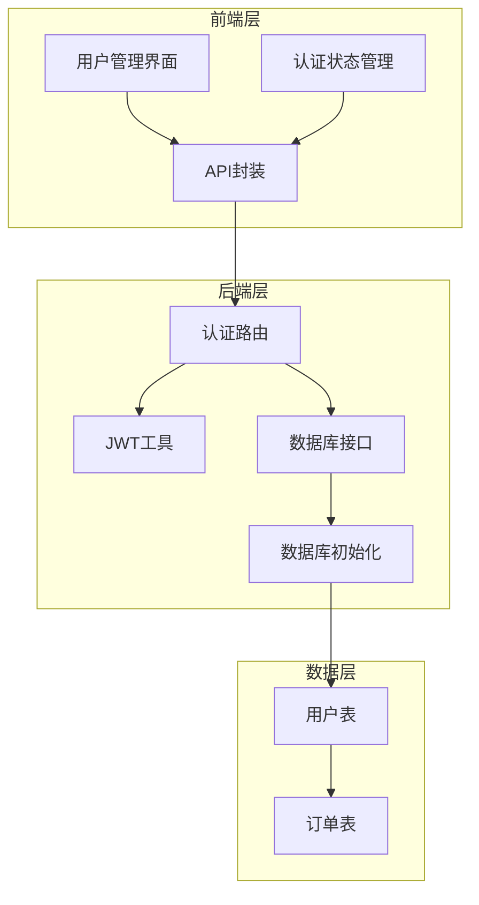
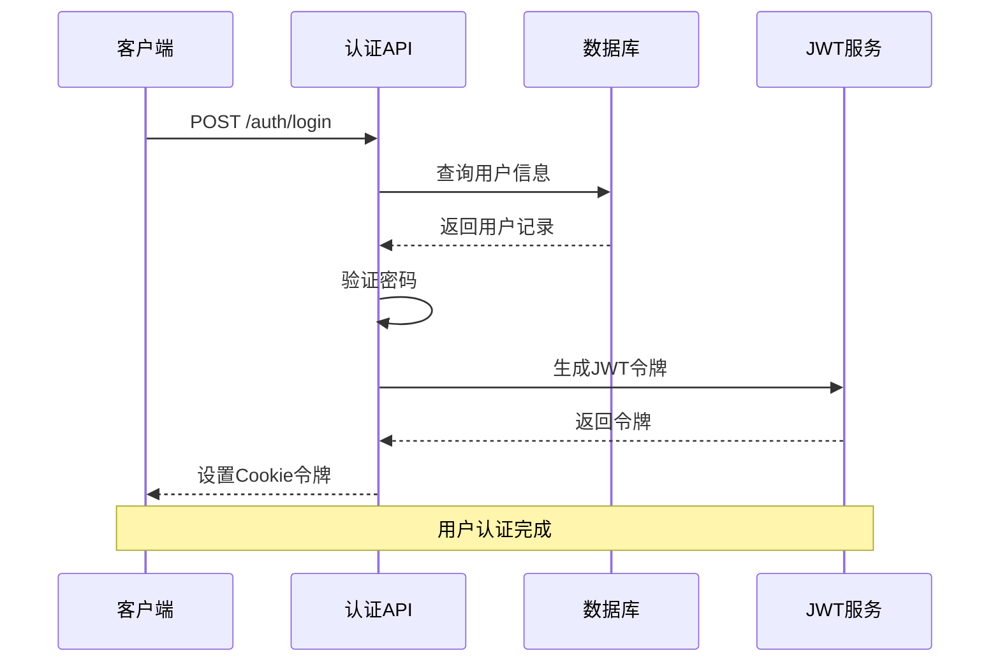
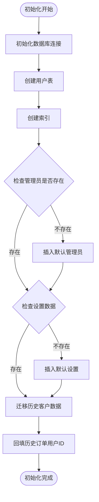
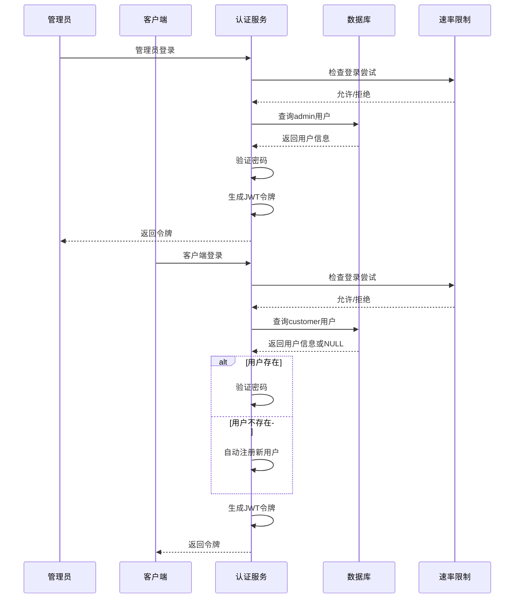
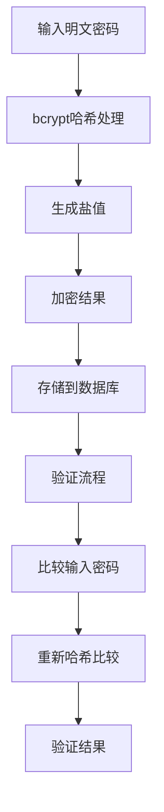
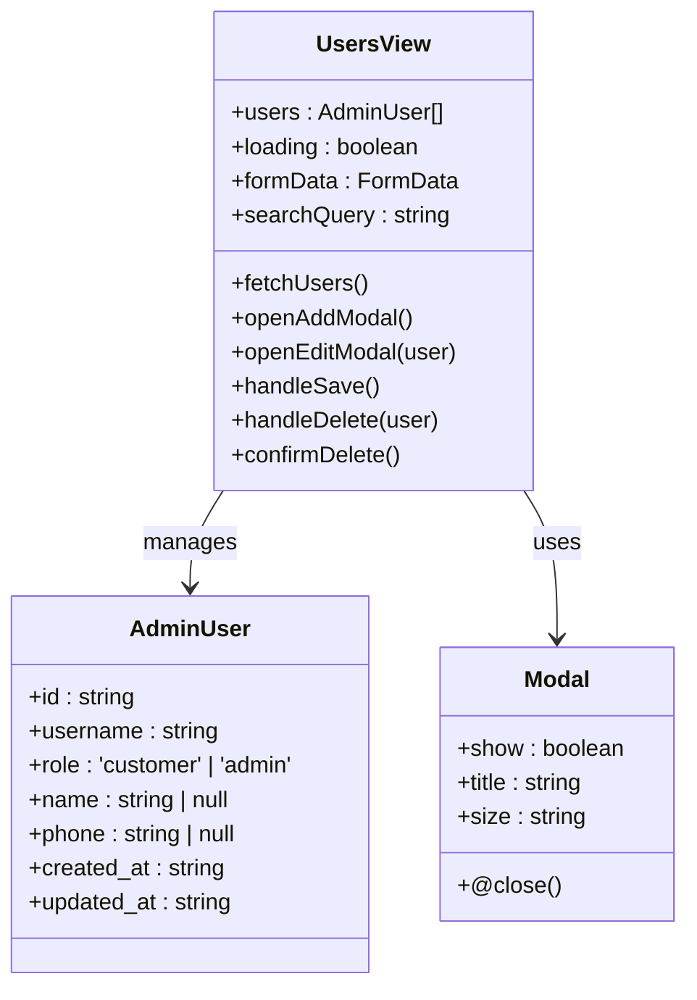
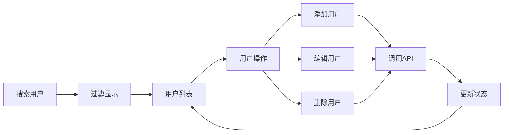
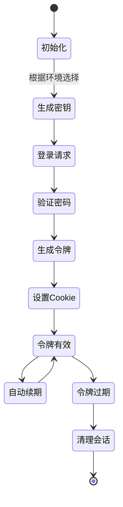
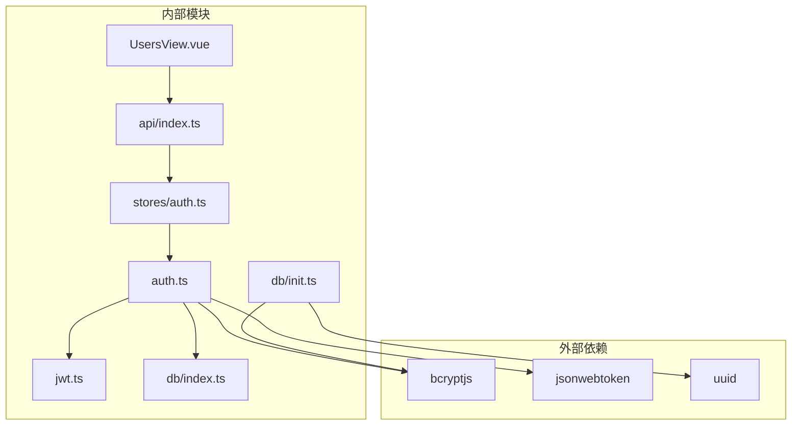

# 用户表设计

<cite>
**本文档引用的文件**
- [server/src/db/init.ts](file://server/src/db/init.ts)
- [server/src/routes/auth.ts](file://server/src/routes/auth.ts)
- [server/src/utils/jwt.ts](file://server/src/utils/jwt.ts)
- [server/src/db/index.ts](file://server/src/db/index.ts)
- [src/admin/views/UsersView.vue](file://src/admin/views/UsersView.vue)
- [src/api/index.ts](file://src/api/index.ts)
- [src/stores/auth.ts](file://src/stores/auth.ts)
- [src/types/index.ts](file://src/types/index.ts)
- [server/src/types/sql.js.d.ts](file://server/src/types/sql.js.d.ts)
</cite>

## 目录
1. [简介](#简介)
2. [项目结构](#项目结构)
3. [核心组件](#核心组件)
4. [架构概览](#架构概览)
5. [详细组件分析](#详细组件分析)
6. [依赖关系分析](#依赖关系分析)
7. [性能考虑](#性能考虑)
8. [故障排除指南](#故障排除指南)
9. [结论](#结论)
10. [附录](#附录)

## 简介

本文件详细阐述了用户表(users)的设计与实现，涵盖字段设计、业务约束、角色管理机制、密码加密策略、用户状态管理以及权限控制。文档还提供了完整的SQL创建语句、索引设计方案和数据字典，帮助开发者和运维人员全面理解用户系统的架构与实现细节。

## 项目结构

用户表设计涉及前后端多个模块的协作：
- 数据库层：负责用户表的创建、索引维护和数据持久化
- 认证路由层：处理用户登录、注册、令牌验证和密码修改
- 前端管理界面：提供用户增删改查功能
- 会话管理：基于JWT的令牌管理和自动续期机制



**图表来源**
- [server/src/db/init.ts:11-22](file://server/src/db/init.ts#L11-L22)
- [server/src/routes/auth.ts:62-144](file://server/src/routes/auth.ts#L62-L144)
- [src/admin/views/UsersView.vue:1-553](file://src/admin/views/UsersView.vue#L1-L553)

**章节来源**
- [server/src/db/init.ts:11-22](file://server/src/db/init.ts#L11-L22)
- [server/src/routes/auth.ts:62-144](file://server/src/routes/auth.ts#L62-L144)
- [src/admin/views/UsersView.vue:1-553](file://src/admin/views/UsersView.vue#L1-L553)

## 核心组件

### 用户表结构设计

用户表采用SQLite数据库存储，支持Web环境下的本地化数据管理。表结构设计充分考虑了业务需求和性能优化。

#### 字段设计详解

| 字段名 | 数据类型 | 约束条件 | 业务含义 | 默认值 |
|--------|----------|----------|----------|--------|
| id | TEXT | PRIMARY KEY | 用户唯一标识符 | UUID生成 |
| username | TEXT | UNIQUE NOT NULL | 用户名/会员号 | 必填 |
| password | TEXT | NOT NULL | 加密后的密码 | 必填 |
| role | TEXT | NOT NULL DEFAULT 'customer' | 用户角色(admin/customer) | 'customer' |
| phone | TEXT | NULL | 手机号码 | 可选 |
| name | TEXT | NULL | 姓名/称呼 | 可选 |
| created_at | DATETIME | DEFAULT CURRENT_TIMESTAMP | 创建时间 | 当前时间 |
| updated_at | DATETIME | DEFAULT CURRENT_TIMESTAMP | 更新时间 | 当前时间 |

#### 角色管理机制

系统支持两种用户角色：
- **admin(管理员)**：拥有完整管理权限，可访问后台管理系统
- **customer(顾客)**：仅能进行点餐和订单管理

角色通过`role`字段区分，并在登录验证时强制限定查询范围。

#### 索引设计

为提升查询性能，系统创建了以下索引：
- `idx_users_phone`: 基于手机号的快速查找索引
- `idx_users_role`: 基于角色的分组查询索引
- `idx_orders_user_id`: 订单关联查询优化

**章节来源**
- [server/src/db/init.ts:11-22](file://server/src/db/init.ts#L11-L22)
- [server/src/db/init.ts:124-136](file://server/src/db/init.ts#L124-L136)

## 架构概览

用户系统采用前后端分离架构，通过RESTful API进行通信，使用JWT令牌实现无状态认证。



**图表来源**
- [server/src/routes/auth.ts:65-144](file://server/src/routes/auth.ts#L65-L144)
- [server/src/utils/jwt.ts:20-22](file://server/src/utils/jwt.ts#L20-L22)

## 详细组件分析

### 数据库初始化流程

数据库初始化过程包含用户表创建、索引建立和默认数据插入等步骤。



**图表来源**
- [server/src/db/init.ts:5-203](file://server/src/db/init.ts#L5-L203)

#### 用户表创建语句

用户表的完整创建语句如下：

```sql
CREATE TABLE IF NOT EXISTS users (
  id TEXT PRIMARY KEY,
  username TEXT UNIQUE NOT NULL,
  password TEXT NOT NULL,
  role TEXT NOT NULL DEFAULT 'customer',
  phone TEXT,
  name TEXT,
  created_at DATETIME DEFAULT CURRENT_TIMESTAMP,
  updated_at DATETIME DEFAULT CURRENT_TIMESTAMP
)
```

#### 索引创建语句

```sql
CREATE INDEX IF NOT EXISTS idx_users_phone ON users(phone)
CREATE INDEX IF NOT EXISTS idx_users_role ON users(role)
```

**章节来源**
- [server/src/db/init.ts:11-22](file://server/src/db/init.ts#L11-L22)
- [server/src/db/init.ts:124-136](file://server/src/db/init.ts#L124-L136)

### 认证与授权机制

#### 登录验证流程

系统提供两种登录方式：管理员登录和客户端登录。



**图表来源**
- [server/src/routes/auth.ts:65-144](file://server/src/routes/auth.ts#L65-L144)
- [server/src/routes/auth.ts:182-294](file://server/src/routes/auth.ts#L182-L294)

#### 密码加密策略

系统采用bcrypt进行密码加密，确保密码存储的安全性。



**图表来源**
- [server/src/routes/auth.ts](file://server/src/routes/auth.ts#L101)
- [server/src/routes/auth.ts](file://server/src/routes/auth.ts#L252)

**章节来源**
- [server/src/routes/auth.ts:65-144](file://server/src/routes/auth.ts#L65-L144)
- [server/src/routes/auth.ts:182-294](file://server/src/routes/auth.ts#L182-L294)

### 前端用户管理界面

#### 用户管理功能

管理员可以通过用户管理界面进行用户全生命周期管理：



**图表来源**
- [src/admin/views/UsersView.vue:1-553](file://src/admin/views/UsersView.vue#L1-L553)

#### 前端数据流



**图表来源**
- [src/admin/views/UsersView.vue:30-144](file://src/admin/views/UsersView.vue#L30-L144)
- [src/api/index.ts:434-457](file://src/api/index.ts#L434-L457)

**章节来源**
- [src/admin/views/UsersView.vue:1-553](file://src/admin/views/UsersView.vue#L1-L553)
- [src/api/index.ts:434-457](file://src/api/index.ts#L434-L457)

### 会话管理与令牌机制

#### JWT配置与管理

系统采用JWT进行会话管理，支持开发和生产环境的不同配置策略。



**图表来源**
- [server/src/utils/jwt.ts:11-22](file://server/src/utils/jwt.ts#L11-L22)
- [src/stores/auth.ts:37-55](file://src/stores/auth.ts#L37-L55)

#### 会话保活机制

前端实现了智能的会话保活功能，确保用户体验的连续性。

**章节来源**
- [server/src/utils/jwt.ts:11-22](file://server/src/utils/jwt.ts#L11-L22)
- [src/stores/auth.ts:37-55](file://src/stores/auth.ts#L37-L55)

## 依赖关系分析

用户系统各组件之间的依赖关系如下：



**图表来源**
- [server/src/routes/auth.ts:1-8](file://server/src/routes/auth.ts#L1-L8)
- [server/src/utils/jwt.ts:1-2](file://server/src/utils/jwt.ts#L1-L2)
- [server/src/db/index.ts:1-4](file://server/src/db/index.ts#L1-L4)

**章节来源**
- [server/src/routes/auth.ts:1-8](file://server/src/routes/auth.ts#L1-L8)
- [server/src/utils/jwt.ts:1-2](file://server/src/utils/jwt.ts#L1-L2)
- [server/src/db/index.ts:1-4](file://server/src/db/index.ts#L1-L4)

## 性能考虑

### 数据库性能优化

1. **索引策略**：针对高频查询字段建立索引，提升查询效率
2. **批量操作**：使用事务批量执行数据库操作，减少I/O开销
3. **缓存机制**：前端实现请求缓存，减少重复网络请求

### 安全性能平衡

1. **密码哈希成本**：合理设置bcrypt成本因子，在安全性与性能间平衡
2. **速率限制**：防止暴力破解攻击
3. **令牌过期**：短生命周期令牌降低风险暴露时间

## 故障排除指南

### 常见问题诊断

#### 用户登录失败

**症状**：用户无法登录系统
**排查步骤**：
1. 检查用户名密码是否正确
2. 验证用户角色是否匹配
3. 确认账户状态正常
4. 检查令牌是否过期

#### 密码修改异常

**症状**：密码修改后无法登录
**排查步骤**：
1. 验证旧密码是否正确
2. 检查新密码长度和复杂度
3. 确认数据库更新成功
4. 清除浏览器缓存重新登录

#### 用户管理功能异常

**症状**：用户列表无法加载或操作失败
**排查步骤**：
1. 检查API接口响应状态
2. 验证前端权限配置
3. 确认数据库连接正常
4. 检查网络请求拦截器

**章节来源**
- [server/src/routes/auth.ts:346-405](file://server/src/routes/auth.ts#L346-L405)
- [src/admin/views/UsersView.vue:77-124](file://src/admin/views/UsersView.vue#L77-L124)

## 结论

用户表设计充分考虑了业务需求、安全性和性能要求。通过合理的字段设计、严格的约束条件和完善的索引策略，系统能够高效地支持用户管理的各项功能。配合JWT认证机制和前端管理界面，形成了完整的用户管理体系。

系统的主要优势包括：
- 明确的角色分离和权限控制
- 安全的密码存储策略
- 高效的查询性能优化
- 用户友好的管理界面
- 完善的错误处理和故障恢复机制

## 附录

### 数据字典

#### 用户表字段说明

| 字段名 | 类型 | 约束 | 描述 | 示例值 |
|--------|------|------|------|--------|
| id | TEXT | PRIMARY KEY | 用户唯一标识 | 'a1b2c3d4-e5f6-7890-abcd-ef1234567890' |
| username | TEXT | UNIQUE NOT NULL | 用户名/会员号 | 'admin' 或 '10001' |
| password | TEXT | NOT NULL | 加密后的密码 | '$2a$10$...' |
| role | TEXT | NOT NULL DEFAULT 'customer' | 用户角色 | 'admin' 或 'customer' |
| phone | TEXT | NULL | 手机号码 | '13800138000' |
| name | TEXT | NULL | 姓名/称呼 | '张三' |
| created_at | DATETIME | DEFAULT CURRENT_TIMESTAMP | 创建时间 | '2024-01-01 12:00:00' |
| updated_at | DATETIME | DEFAULT CURRENT_TIMESTAMP | 更新时间 | '2024-01-01 12:00:00' |

### API接口规范

#### 用户管理接口

| 接口 | 方法 | 功能 | 权限要求 |
|------|------|------|----------|
| /admin/users | GET | 获取用户列表 | admin |
| /admin/users | POST | 创建用户 | admin |
| /admin/users/:id | PUT | 更新用户 | admin |
| /admin/users/:id | DELETE | 删除用户 | admin |

#### 认证接口

| 接口 | 方法 | 功能 | 权限要求 |
|------|------|------|----------|
| /auth/login | POST | 管理员登录 | 无 |
| /auth/logout | POST | 管理员登出 | admin |
| /auth/verify | GET | 验证令牌 | admin |
| /auth/client/login | POST | 客户端登录 | 无 |
| /auth/client/logout | POST | 客户端登出 | customer |
| /auth/client/verify | GET | 客户端验证 | customer |
| /auth/password | PUT | 修改密码 | admin |

**章节来源**
- [src/api/index.ts:434-457](file://src/api/index.ts#L434-L457)
- [server/src/routes/auth.ts:65-144](file://server/src/routes/auth.ts#L65-L144)