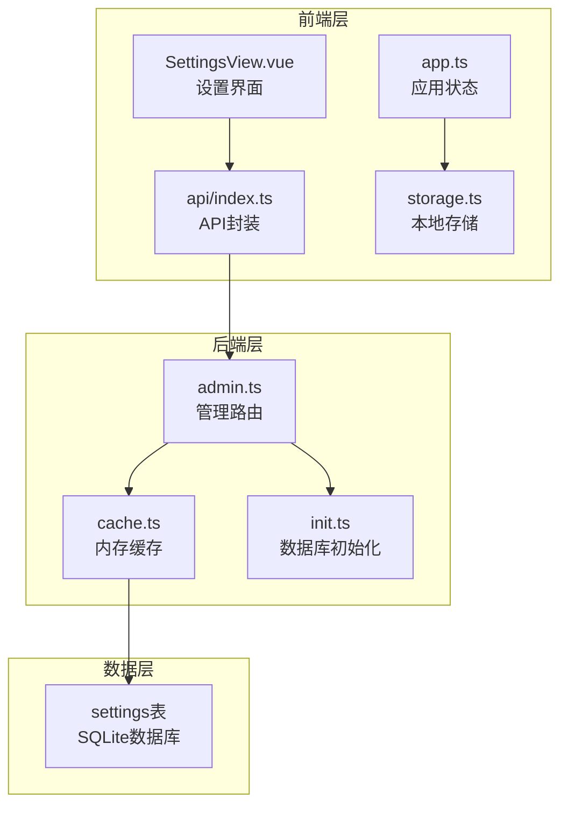
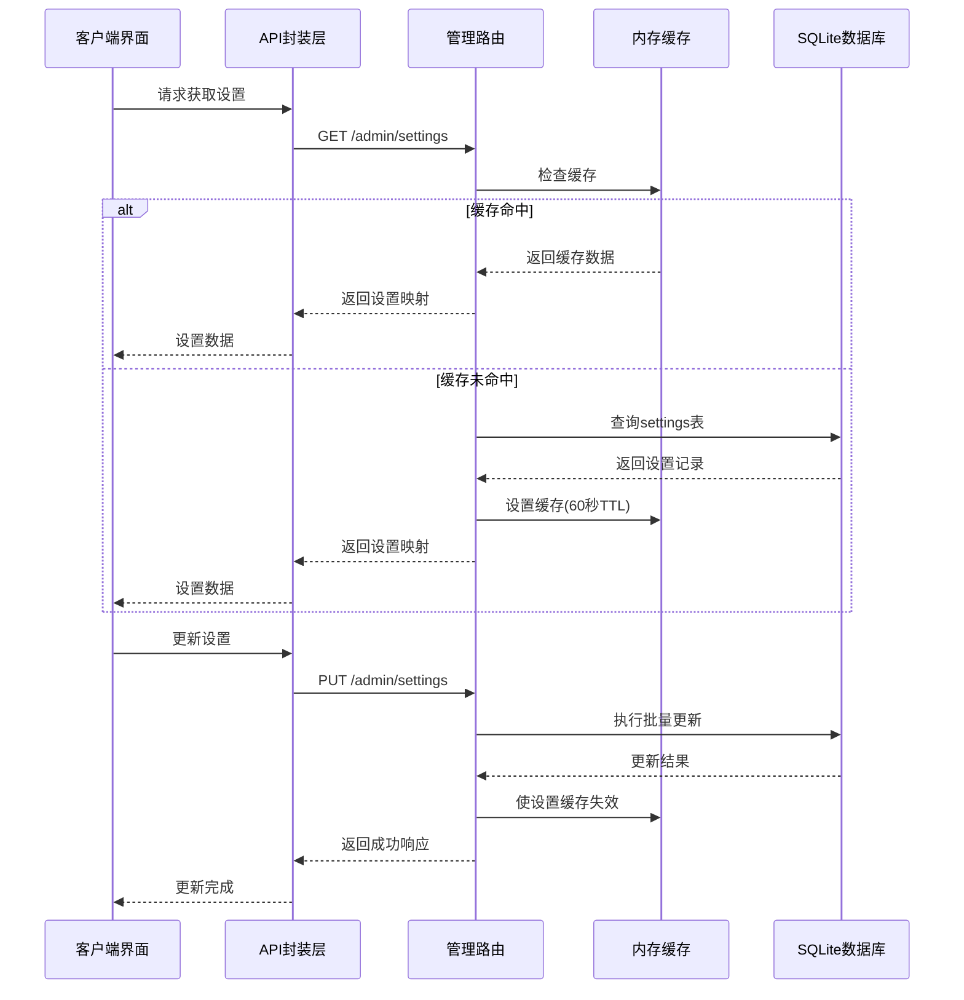
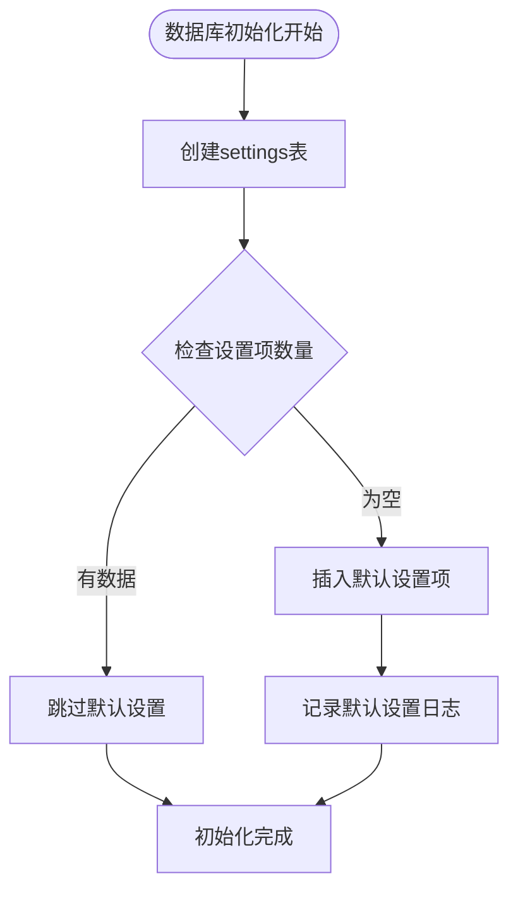
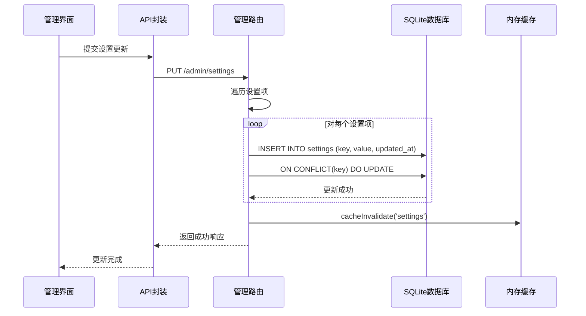
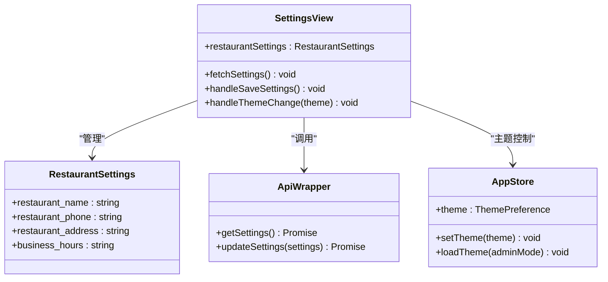
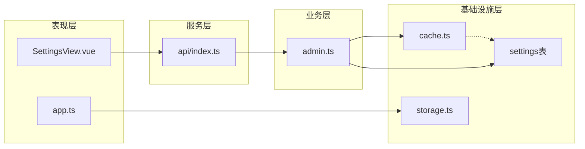

# 系统设置表设计

<cite>
**本文档引用的文件**
- [server/src/db/init.ts](file://server/src/db/init.ts)
- [server/src/route/admin.ts](file://server/src/routes/admin.ts)
- [server/src/utils/cache.ts](file://server/src/utils/cache.ts)
- [src/api/index.ts](file://src/api/index.ts)
- [src/admin/views/SettingsView.vue](file://src/admin/views/SettingsView.vue)
- [src/stores/app.ts](file://src/stores/app.ts)
- [src/utils/storage.ts](file://src/utils/storage.ts)
</cite>

## 目录
1. [简介](#简介)
2. [项目结构](#项目结构)
3. [核心组件](#核心组件)
4. [架构概览](#架构概览)
5. [详细组件分析](#详细组件分析)
6. [依赖关系分析](#依赖关系分析)
7. [性能考虑](#性能考虑)
8. [故障排除指南](#故障排除指南)
9. [结论](#结论)
10. [附录](#附录)

## 简介

本文件详细阐述了系统设置表(settings)的设计与实现，包括字段设计、业务含义、配置管理机制、动态更新流程以及持久化策略。系统通过settings表实现了灵活的配置管理，支持餐厅基本信息、联系方式、营业时间等关键参数的动态配置，并提供了完整的缓存机制以确保性能和一致性。

## 项目结构

系统设置功能涉及前后端多个层次的协作，形成了完整的配置管理体系：



**图表来源**
- [server/src/db/init.ts:117-122](file://server/src/db/init.ts#L117-L122)
- [server/src/routes/admin.ts:1145-1179](file://server/src/routes/admin.ts#L1145-L1179)
- [server/src/utils/cache.ts:64-72](file://server/src/utils/cache.ts#L64-L72)

**章节来源**
- [server/src/db/init.ts:1-204](file://server/src/db/init.ts#L1-L204)
- [server/src/routes/admin.ts:1145-1179](file://server/src/routes/admin.ts#L1145-L1179)

## 核心组件

### 数据库表结构

系统设置表采用简洁而高效的表结构设计：

| 字段名 | 数据类型 | 约束条件 | 描述 |
|--------|----------|----------|------|
| key | TEXT | PRIMARY KEY | 设置项的唯一标识符，作为主键使用 |
| value | TEXT | NOT NULL | 设置项的实际值，支持字符串形式存储 |
| updated_at | DATETIME | DEFAULT CURRENT_TIMESTAMP | 记录最后更新时间戳 |

### 默认配置项

系统初始化时自动创建以下默认设置项：

- `restaurant_name`: 餐厅名称，默认值为"红灯笼食府"
- `restaurant_phone`: 餐厅联系电话，初始为空
- `restaurant_address`: 餐厅地址，初始为空
- `business_hours`: 营业时间，默认值为"11:00-21:00"
- `notification_email`: 通知邮箱，初始为空
- `notification_phone`: 通知电话，初始为空

**章节来源**
- [server/src/db/init.ts:117-122](file://server/src/db/init.ts#L117-L122)
- [server/src/db/init.ts:153-165](file://server/src/db/init.ts#L153-L165)

## 架构概览

系统设置管理采用分层架构设计，确保了高内聚、低耦合的特性：



**图表来源**
- [server/src/routes/admin.ts:1145-1179](file://server/src/routes/admin.ts#L1145-L1179)
- [server/src/utils/cache.ts:18-36](file://server/src/utils/cache.ts#L18-L36)

## 详细组件分析

### 数据库初始化与设置表创建

系统在数据库初始化过程中创建settings表，并自动填充默认配置：



**图表来源**
- [server/src/db/init.ts:151-165](file://server/src/db/init.ts#L151-L165)

**章节来源**
- [server/src/db/init.ts:117-122](file://server/src/db/init.ts#L117-L122)
- [server/src/db/init.ts:151-165](file://server/src/db/init.ts#L151-L165)

### 设置获取流程

设置获取采用智能缓存策略，平衡性能与实时性：

```mermaid
flowchart TD
GetSettings[获取设置请求] --> CheckCache{检查内存缓存}
CheckCache --> |命中且未过期| ReturnCache[返回缓存数据]
CheckCache --> |未命中或已过期| QueryDB[查询数据库]
QueryDB --> BuildMap[构建设置映射]
BuildMap --> SetCache[设置缓存(60秒TTL)]
SetCache --> ReturnData[返回设置数据]
ReturnCache --> End[结束]
ReturnData --> End
```

**图表来源**
- [server/src/routes/admin.ts:1145-1157](file://server/src/routes/admin.ts#L1145-L1157)
- [server/src/utils/cache.ts:18-36](file://server/src/utils/cache.ts#L18-L36)

**章节来源**
- [server/src/routes/admin.ts:1145-1157](file://server/src/routes/admin.ts#L1145-L1157)

### 设置更新流程

设置更新采用批量事务处理，确保数据一致性：



**图表来源**
- [server/src/routes/admin.ts:1164-1179](file://server/src/routes/admin.ts#L1164-L1179)

**章节来源**
- [server/src/routes/admin.ts:1164-1179](file://server/src/routes/admin.ts#L1164-L1179)

### 前端设置界面集成

前端设置界面通过Pinia状态管理实现响应式更新：



**图表来源**
- [src/admin/views/SettingsView.vue:75-104](file://src/admin/views/SettingsView.vue#L75-L104)
- [src/api/index.ts:430-464](file://src/api/index.ts#L430-L464)

**章节来源**
- [src/admin/views/SettingsView.vue:75-104](file://src/admin/views/SettingsView.vue#L75-L104)
- [src/api/index.ts:430-464](file://src/api/index.ts#L430-L464)

## 依赖关系分析

系统设置功能的依赖关系体现了清晰的分层架构：



**图表来源**
- [src/admin/views/SettingsView.vue:1-205](file://src/admin/views/SettingsView.vue#L1-L205)
- [src/api/index.ts:1-608](file://src/api/index.ts#L1-L608)
- [server/src/routes/admin.ts:1145-1179](file://server/src/routes/admin.ts#L1145-L1179)

**章节来源**
- [server/src/utils/cache.ts:64-72](file://server/src/utils/cache.ts#L64-L72)
- [src/utils/storage.ts:1-108](file://src/utils/storage.ts#L1-L108)

## 性能考虑

### 缓存策略

系统采用了多层次的缓存机制来优化性能：

1. **内存缓存**：使用Map结构存储设置数据，60秒TTL
2. **前端缓存**：API层实现stale-while-revalidate策略
3. **数据库索引**：为settings表的key字段建立主键索引

### 性能优化措施

- **批量更新**：设置更新采用批量事务处理，减少数据库往返
- **缓存失效**：更新后立即失效相关缓存，确保数据一致性
- **智能查询**：仅在缓存未命中时才访问数据库

## 故障排除指南

### 常见问题及解决方案

1. **设置更新后未生效**
   - 检查缓存是否正确失效
   - 验证数据库连接状态
   - 确认权限验证通过

2. **设置获取超时**
   - 检查网络连接
   - 验证API服务状态
   - 查看浏览器开发者工具中的错误信息

3. **数据库初始化失败**
   - 检查SQLite文件权限
   - 验证数据库版本兼容性
   - 确认磁盘空间充足

**章节来源**
- [server/src/routes/admin.ts:1158-1161](file://server/src/routes/admin.ts#L1158-L1161)
- [server/src/routes/admin.ts:1175-1178](file://server/src/routes/admin.ts#L1175-L1178)

## 结论

系统设置表设计体现了现代Web应用的最佳实践，通过简洁的表结构、智能的缓存策略和完善的错误处理机制，实现了高效、可靠的配置管理。该设计不仅满足了当前的功能需求，还为未来的扩展提供了良好的基础。

## 附录

### SQL创建语句

```sql
CREATE TABLE IF NOT EXISTS settings (
  key TEXT PRIMARY KEY,
  value TEXT NOT NULL,
  updated_at DATETIME DEFAULT CURRENT_TIMESTAMP
);
```

### 默认配置示例

| 键名 | 类型 | 示例值 | 用途 |
|------|------|--------|------|
| restaurant_name | 文本 | "红灯笼食府" | 餐厅名称显示 |
| restaurant_phone | 文本 | "13800138000" | 联系方式展示 |
| restaurant_address | 文本 | "北京市朝阳区xxx路xxx号" | 地址信息 |
| business_hours | 文本 | "11:00-21:00" | 营业时间显示 |
| notification_email | 文本 | "admin@restaurant.com" | 通知邮箱 |
| notification_phone | 文本 | "13800138000" | 通知电话 |

### 配置持久化策略

系统采用以下持久化策略确保数据安全：
- SQLite数据库存储，支持ACID特性
- 批量事务处理，确保原子性
- 自动备份机制，防止数据丢失
- 权限控制，限制访问范围