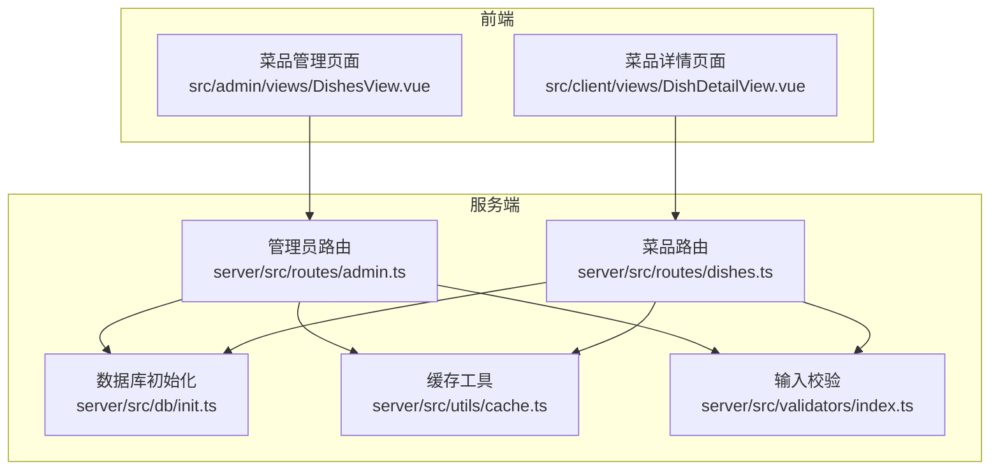
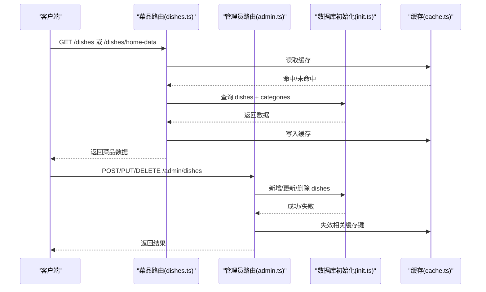
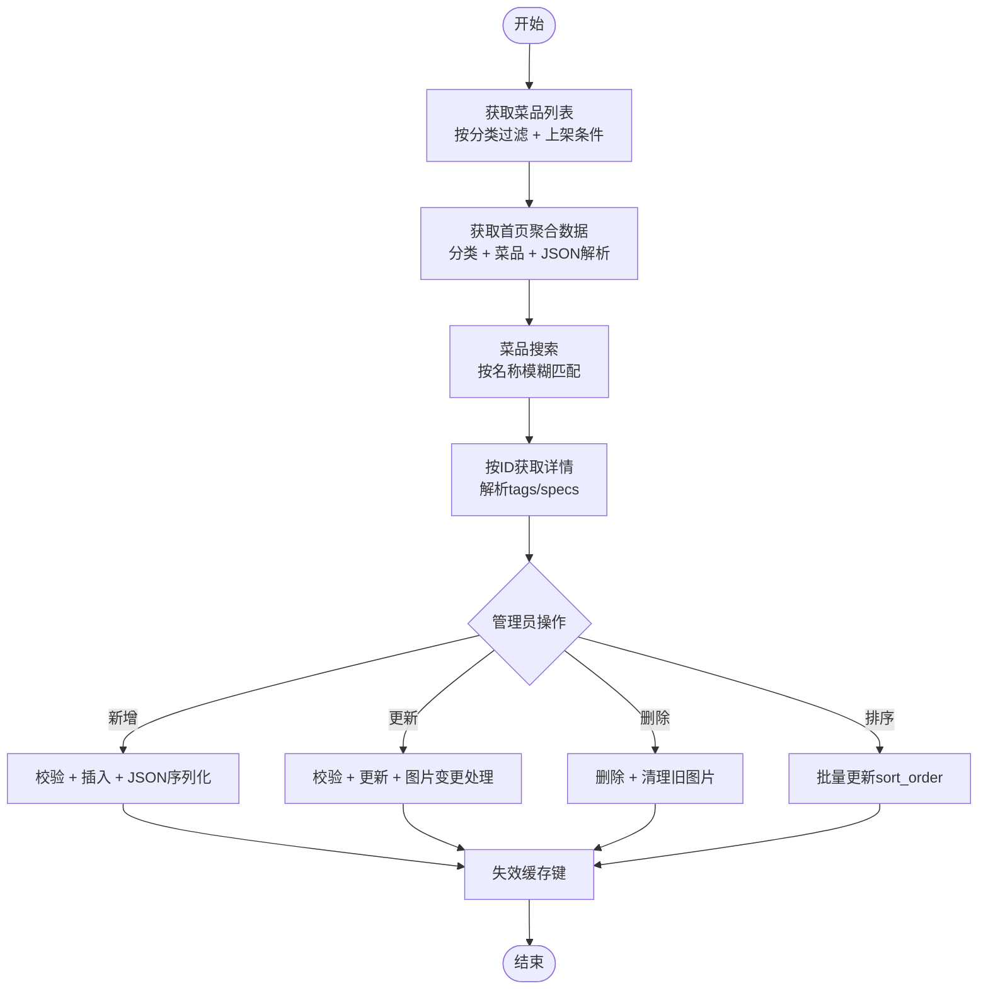
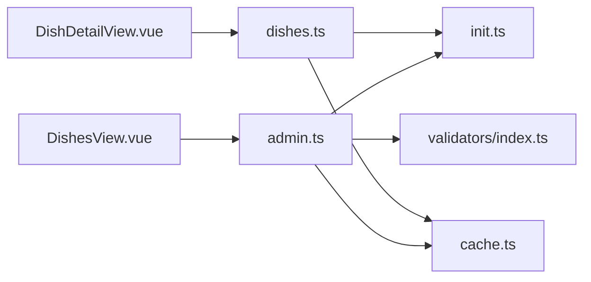
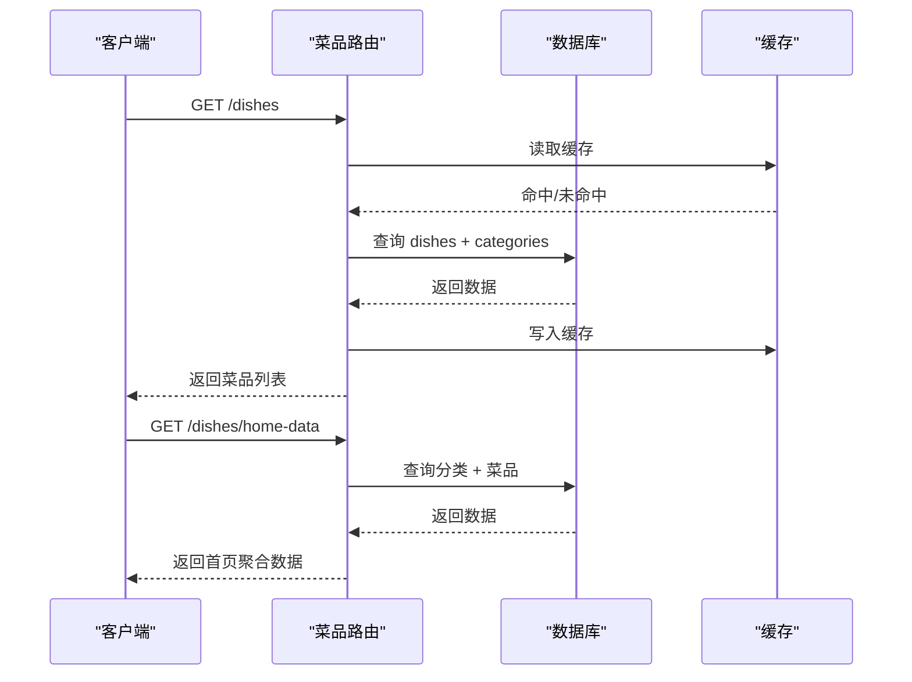
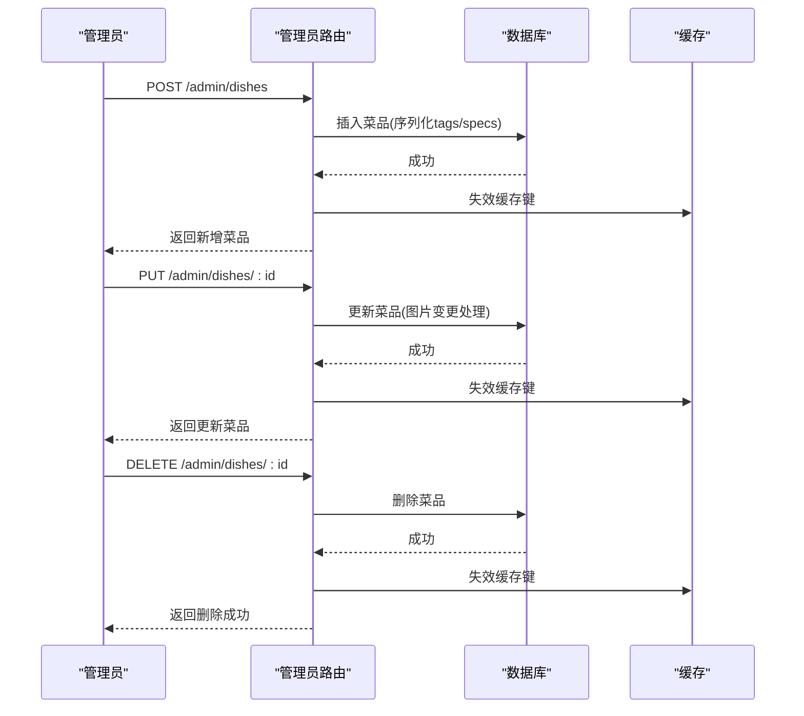

# 菜品表设计

<cite>
**本文档引用的文件**
- [dishes.ts](file://server/src/routes/dishes.ts)
- [admin.ts](file://server/src/routes/admin.ts)
- [init.ts](file://server/src/db/init.ts)
- [index.ts](file://server/src/db/index.ts)
- [cache.ts](file://server/src/utils/cache.ts)
- [index.ts](file://server/src/validators/index.ts)
- [DishesView.vue](file://src/admin/views/DishesView.vue)
- [DishDetailView.vue](file://src/client/views/DishDetailView.vue)
</cite>

## 目录
1. [简介](#简介)
2. [项目结构](#项目结构)
3. [核心组件](#核心组件)
4. [架构总览](#架构总览)
5. [详细组件分析](#详细组件分析)
6. [依赖关系分析](#依赖关系分析)
7. [性能考虑](#性能考虑)
8. [故障排除指南](#故障排除指南)
9. [结论](#结论)
10. [附录](#附录)

## 简介
本设计文档围绕菜品表(dishes)进行深入解析，涵盖字段设计、业务含义、管理机制、价格与规格配置、状态控制以及分类关联。同时提供菜品的增删改查、价格调整、规格设置的实现细节，并给出完整的SQL创建语句、外键约束与索引设计，帮助开发者与运营人员准确理解与使用菜品数据模型。

## 项目结构
菜品功能涉及服务端路由、数据库初始化、缓存策略、输入校验以及前后端界面展示：
- 服务端：菜品路由负责菜品列表、详情、搜索、分类等接口；管理员路由负责菜品的增删改查与排序；数据库初始化脚本定义菜品表结构与索引；缓存模块提供热点数据缓存；输入校验保障数据一致性。
- 前端：后台管理页面支持菜品的增删改、排序、分类筛选与图片上传；客户端详情页支持规格选择与加入购物车。



**图表来源**
- [dishes.ts:1-216](file://server/src/routes/dishes.ts#L1-L216)
- [admin.ts:1-800](file://server/src/routes/admin.ts#L1-L800)
- [init.ts:1-204](file://server/src/db/init.ts#L1-L204)
- [cache.ts:1-73](file://server/src/utils/cache.ts#L1-L73)
- [index.ts:1-123](file://server/src/validators/index.ts#L1-L123)
- [DishesView.vue:1-1162](file://src/admin/views/DishesView.vue#L1-L1162)
- [DishDetailView.vue:1-428](file://src/client/views/DishDetailView.vue#L1-L428)

**章节来源**
- [dishes.ts:1-216](file://server/src/routes/dishes.ts#L1-L216)
- [admin.ts:1-800](file://server/src/routes/admin.ts#L1-L800)
- [init.ts:1-204](file://server/src/db/init.ts#L1-L204)
- [cache.ts:1-73](file://server/src/utils/cache.ts#L1-L73)
- [index.ts:1-123](file://server/src/validators/index.ts#L1-L123)
- [DishesView.vue:1-1162](file://src/admin/views/DishesView.vue#L1-L1162)
- [DishDetailView.vue:1-428](file://src/client/views/DishDetailView.vue#L1-L428)

## 核心组件
- 菜品表(dishes)：存储菜品基本信息、价格、图片、分类、描述、标签、规格、状态与排序等。
- 管理员路由(admin.ts)：提供菜品的增删改查、排序、图片上传与删除、状态切换等管理能力。
- 前端菜品管理页面(DishesView.vue)：支持菜品列表、分类筛选、拖拽排序、标签与规格配置、图片上传等。
- 前端菜品详情页面(DishDetailView.vue)：支持规格选择、加入购物车、数量控制等。
- 数据库初始化(init.ts)：定义菜品表结构、外键约束与索引。
- 缓存(cache.ts)：对菜品列表、首页聚合数据、分类等进行缓存，降低查询压力。
- 输入校验(validators/index.ts)：对菜品新增/更新请求进行字段范围与类型校验。

**章节来源**
- [dishes.ts:1-216](file://server/src/routes/dishes.ts#L1-L216)
- [admin.ts:374-546](file://server/src/routes/admin.ts#L374-L546)
- [init.ts:46-61](file://server/src/db/init.ts#L46-L61)
- [cache.ts:64-72](file://server/src/utils/cache.ts#L64-L72)
- [index.ts:21-40](file://server/src/validators/index.ts#L21-L40)
- [DishesView.vue:1-1162](file://src/admin/views/DishesView.vue#L1-L1162)
- [DishDetailView.vue:1-428](file://src/client/views/DishDetailView.vue#L1-L428)

## 架构总览
菜品功能的端到端流程如下：
- 客户端通过菜品路由获取菜品列表、首页聚合数据与菜品详情；管理员通过管理员路由进行菜品管理。
- 数据库层提供菜品表结构与索引，确保查询性能与数据完整性。
- 缓存层对高频访问的数据进行缓存，减少数据库压力。
- 输入校验确保新增/更新菜品时的数据合法性。



**图表来源**
- [dishes.ts:25-117](file://server/src/routes/dishes.ts#L25-L117)
- [admin.ts:374-546](file://server/src/routes/admin.ts#L374-L546)
- [init.ts:46-61](file://server/src/db/init.ts#L46-L61)
- [cache.ts:18-43](file://server/src/utils/cache.ts#L18-L43)

## 详细组件分析

### 字段设计与业务含义
菜品表(dishes)的关键字段及业务含义：
- id：主键，唯一标识菜品，采用文本型UUID。
- name：菜品名称，必填且长度限制，用于展示与搜索。
- price：单价，非负实数，支持精确到分。
- image_url：菜品图片地址，可为空，支持外部资源路径。
- category_id：分类关联，外键指向categories表的id，可为空表示“其他”分类。
- description：菜品描述，可为空。
- tags：标签数组，JSON字符串形式存储，支持推荐、经典、新品、火爆等标签。
- specs：规格数组，JSON字符串形式存储，如“大份、中份、小份”，用于区分不同规格。
- status：状态，枚举值“on_sale/ off_sale”，决定菜品是否对外展示。
- sort_order：排序权重，整数，默认0，用于菜品列表排序。
- created_at/updated_at：时间戳，自动维护。

字段约束与索引：
- 主键：id
- 外键：category_id 引用 categories(id)
- 索引：idx_dishes_category_id、idx_dishes_status、idx_dishes_sort_order

**章节来源**
- [init.ts:46-61](file://server/src/db/init.ts#L46-L61)
- [init.ts:124-136](file://server/src/db/init.ts#L124-L136)
- [index.ts:21-40](file://server/src/validators/index.ts#L21-L40)

### 菜品管理机制
- 列表与首页聚合：
  - 列表接口按分类过滤、按分类与菜品排序字段排序，仅返回上架菜品。
  - 首页聚合接口一次性返回分类与菜品列表，并对tags/specs进行JSON解析。
- 搜索：
  - 支持按菜品名称模糊搜索，返回上架菜品。
- 详情：
  - 按id查询菜品详情，返回完整字段并解析tags/specs。
- 管理端：
  - 新增菜品：校验名称唯一性，写入tags/specs为JSON字符串，返回带解析后的数据。
  - 更新菜品：支持名称、价格、分类、描述、标签、规格、图片、状态等字段更新；若图片变更，会删除旧图片（若未被其他菜品使用）。
  - 删除菜品：删除记录并清理旧图片。
  - 排序：支持批量更新菜品sort_order并失效相关缓存。



**图表来源**
- [dishes.ts:25-117](file://server/src/routes/dishes.ts#L25-L117)
- [dishes.ts:177-215](file://server/src/routes/dishes.ts#L177-L215)
- [admin.ts:374-546](file://server/src/routes/admin.ts#L374-L546)
- [cache.ts:64-72](file://server/src/utils/cache.ts#L64-L72)

**章节来源**
- [dishes.ts:25-117](file://server/src/routes/dishes.ts#L25-L117)
- [dishes.ts:177-215](file://server/src/routes/dishes.ts#L177-L215)
- [admin.ts:374-546](file://server/src/routes/admin.ts#L374-L546)
- [cache.ts:64-72](file://server/src/utils/cache.ts#L64-L72)

### 价格管理
- 价格字段为非负实数，支持精确到分。
- 新增菜品时需提供价格；更新菜品时可单独修改价格。
- 前端详情页显示价格，购物车与下单流程使用菜品价格作为单价。

**章节来源**
- [index.ts:21-40](file://server/src/validators/index.ts#L21-L40)
- [DishDetailView.vue:1-428](file://src/client/views/DishDetailView.vue#L1-L428)

### 规格配置
- 规格字段为字符串数组，以JSON字符串形式存储。
- 前端支持在菜品管理页面输入规格，自动拆分为数组；菜品详情页根据规格数量决定是否弹窗选择规格。
- 购物车加入时若存在规格，需选择规格与数量。

**章节来源**
- [index.ts:21-40](file://server/src/validators/index.ts#L21-L40)
- [DishesView.vue:554-562](file://src/admin/views/DishesView.vue#L554-L562)
- [DishDetailView.vue:52-91](file://src/client/views/DishDetailView.vue#L52-L91)

### 状态控制
- status字段支持“on_sale/ off_sale”，仅上架菜品参与列表与搜索展示。
- 管理端可直接更新菜品状态，前端菜品列表与详情均受此状态影响。

**章节来源**
- [dishes.ts:34-47](file://server/src/routes/dishes.ts#L34-L47)
- [index.ts:31-40](file://server/src/validators/index.ts#L31-L40)

### 分类关联
- category_id为外键，关联categories表。
- 前端菜品管理页面支持分类筛选与拖拽排序；删除分类时需先清空该分类下的菜品。
- 首页聚合数据包含分类与菜品，便于低带宽场景一次性加载。

**章节来源**
- [init.ts:46-61](file://server/src/db/init.ts#L46-L61)
- [dishes.ts:34-47](file://server/src/routes/dishes.ts#L34-L47)
- [admin.ts:548-639](file://server/src/routes/admin.ts#L548-L639)

### 增删改查实现细节
- 查询：
  - 列表：按status='on_sale'过滤，按分类与菜品sort_order排序。
  - 首页聚合：一次性查询分类与菜品，解析tags/specs。
  - 搜索：按name LIKE模糊匹配，返回上架菜品。
  - 详情：按id查询，解析tags/specs。
- 新增：
  - 校验名称唯一性，插入时将tags/specs序列化为JSON字符串。
- 更新：
  - 支持部分字段更新；若image_url变更，删除旧图片（若未被其他菜品使用）。
- 删除：
  - 删除记录并清理旧图片。
- 排序：
  - 支持批量更新sort_order，配合缓存失效。

**章节来源**
- [dishes.ts:25-117](file://server/src/routes/dishes.ts#L25-L117)
- [dishes.ts:177-215](file://server/src/routes/dishes.ts#L177-L215)
- [admin.ts:374-546](file://server/src/routes/admin.ts#L374-L546)

## 依赖关系分析
- 菜品路由依赖数据库初始化脚本中的表结构与索引。
- 管理员路由依赖输入校验器进行参数校验。
- 前端页面依赖对应路由提供的数据结构。
- 缓存模块贯穿查询与管理端操作，统一失效策略。



**图表来源**
- [dishes.ts:1-216](file://server/src/routes/dishes.ts#L1-L216)
- [admin.ts:1-800](file://server/src/routes/admin.ts#L1-L800)
- [init.ts:1-204](file://server/src/db/init.ts#L1-L204)
- [index.ts:1-123](file://server/src/validators/index.ts#L1-L123)
- [cache.ts:1-73](file://server/src/utils/cache.ts#L1-L73)
- [DishesView.vue:1-1162](file://src/admin/views/DishesView.vue#L1-L1162)
- [DishDetailView.vue:1-428](file://src/client/views/DishDetailView.vue#L1-L428)

**章节来源**
- [dishes.ts:1-216](file://server/src/routes/dishes.ts#L1-L216)
- [admin.ts:1-800](file://server/src/routes/admin.ts#L1-L800)
- [init.ts:1-204](file://server/src/db/init.ts#L1-L204)
- [index.ts:1-123](file://server/src/validators/index.ts#L1-L123)
- [cache.ts:1-73](file://server/src/utils/cache.ts#L1-L73)
- [DishesView.vue:1-1162](file://src/admin/views/DishesView.vue#L1-L1162)
- [DishDetailView.vue:1-428](file://src/client/views/DishDetailView.vue#L1-L428)

## 性能考虑
- 索引优化：
  - idx_dishes_category_id：加速按分类过滤。
  - idx_dishes_status：加速按状态过滤（仅上架菜品）。
  - idx_dishes_sort_order：加速菜品排序。
- 缓存策略：
  - 对菜品列表、首页聚合数据、分类进行缓存，TTL默认30秒，减少数据库压力。
  - 管理端操作后统一失效相关缓存键，保证数据一致性。
- 查询优化：
  - 首页聚合一次性返回分类与菜品，减少往返次数。
  - 列表与搜索仅返回必要字段，降低网络传输。

**章节来源**
- [init.ts:124-136](file://server/src/db/init.ts#L124-L136)
- [cache.ts:13-36](file://server/src/utils/cache.ts#L13-L36)
- [dishes.ts:25-117](file://server/src/routes/dishes.ts#L25-L117)

## 故障排除指南
- 图片删除异常：
  - 若更新菜品时图片变更但旧图片未删除，检查是否被其他菜品使用；系统仅在未被其他菜品使用时删除。
- 名称重复：
  - 新增菜品时报名称已存在，需更换名称或删除重复项。
- 分类删除失败：
  - 删除分类前需清空该分类下的菜品，否则会提示仍有菜品无法删除。
- 缓存不一致：
  - 管理端修改菜品后，相关缓存键会失效；若出现数据不一致，等待TTL过期或手动刷新。
- 搜索无结果：
  - 确认菜品状态为“上架”，搜索关键词大小写不敏感，建议使用更明确的关键词。

**章节来源**
- [admin.ts:50-82](file://server/src/routes/admin.ts#L50-L82)
- [admin.ts:387-390](file://server/src/routes/admin.ts#L387-L390)
- [admin.ts:603-615](file://server/src/routes/admin.ts#L603-L615)
- [cache.ts:41-54](file://server/src/utils/cache.ts#L41-L54)
- [dishes.ts:121-156](file://server/src/routes/dishes.ts#L121-L156)

## 结论
菜品表设计遵循清晰的字段职责与严格的业务约束，结合输入校验、缓存与索引优化，实现了高效稳定的菜品管理与展示。通过管理员路由与前端页面的协同，支持菜品的全生命周期管理，满足餐厅日常运营需求。后续可根据业务扩展增加更多维度的筛选与排序策略。

## 附录

### SQL创建语句与外键约束
```sql
-- 创建菜品表
CREATE TABLE IF NOT EXISTS dishes (
  id TEXT PRIMARY KEY,
  name TEXT NOT NULL,
  price REAL NOT NULL,
  image_url TEXT,
  category_id TEXT,
  description TEXT,
  tags TEXT,
  specs TEXT,
  status TEXT DEFAULT 'on_sale',
  sort_order INTEGER DEFAULT 0,
  created_at DATETIME DEFAULT CURRENT_TIMESTAMP,
  updated_at DATETIME DEFAULT CURRENT_TIMESTAMP,
  FOREIGN KEY (category_id) REFERENCES categories(id)
);

-- 创建索引
CREATE INDEX IF NOT EXISTS idx_dishes_category_id ON dishes(category_id);
CREATE INDEX IF NOT EXISTS idx_dishes_status ON dishes(status);
CREATE INDEX IF NOT EXISTS idx_dishes_sort_order ON dishes(sort_order);
```

**章节来源**
- [init.ts:46-61](file://server/src/db/init.ts#L46-L61)
- [init.ts:124-136](file://server/src/db/init.ts#L124-L136)

### 关键流程时序图

#### 菜品列表与首页聚合


**图表来源**
- [dishes.ts:25-117](file://server/src/routes/dishes.ts#L25-L117)

#### 管理端菜品增删改


**图表来源**
- [admin.ts:374-546](file://server/src/routes/admin.ts#L374-L546)
- [cache.ts:64-72](file://server/src/utils/cache.ts#L64-L72)