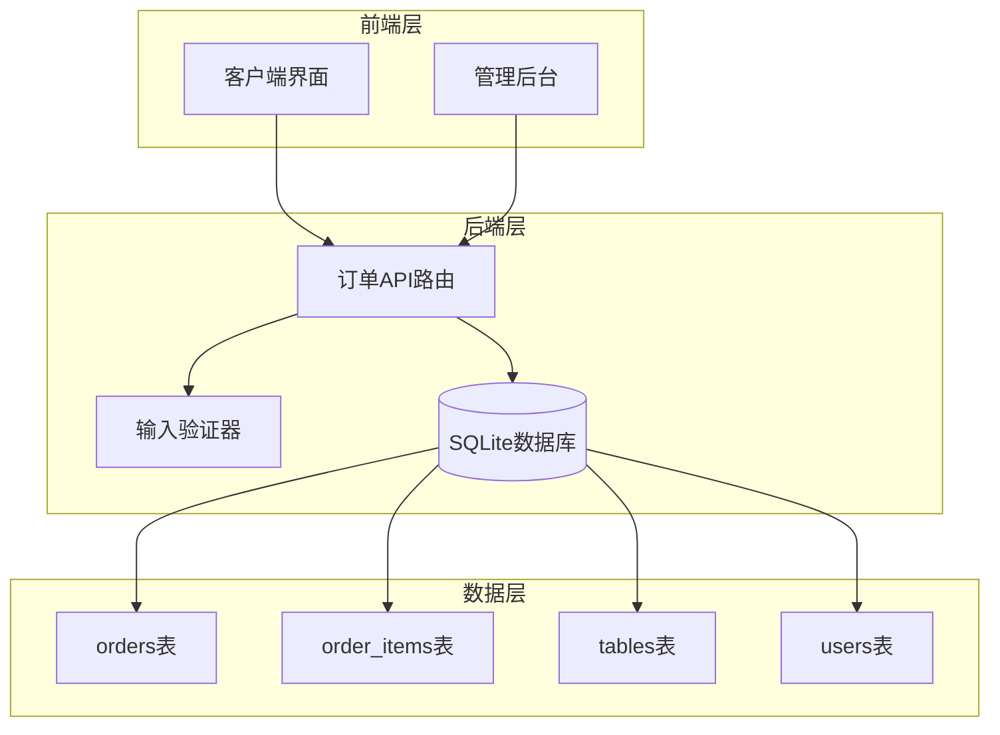
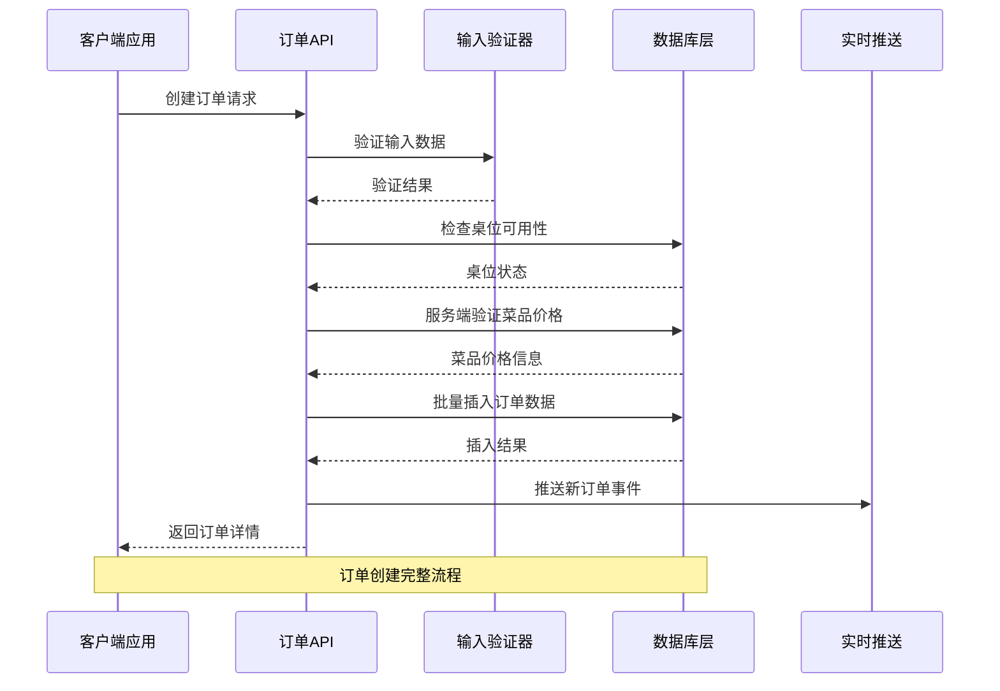
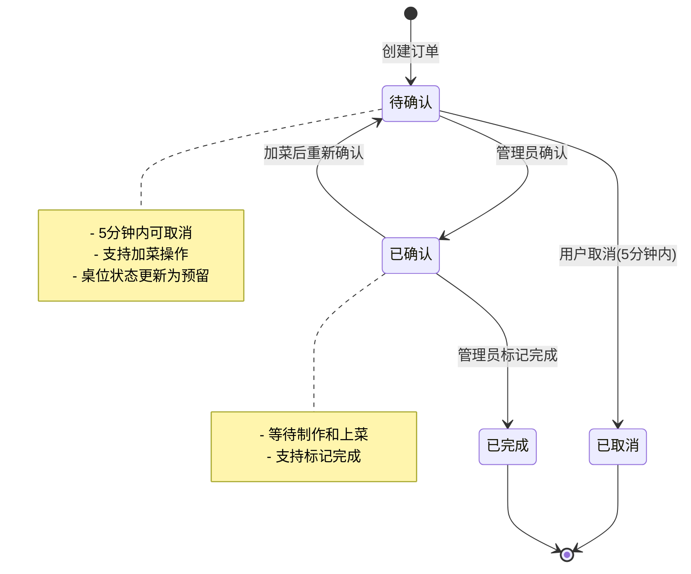
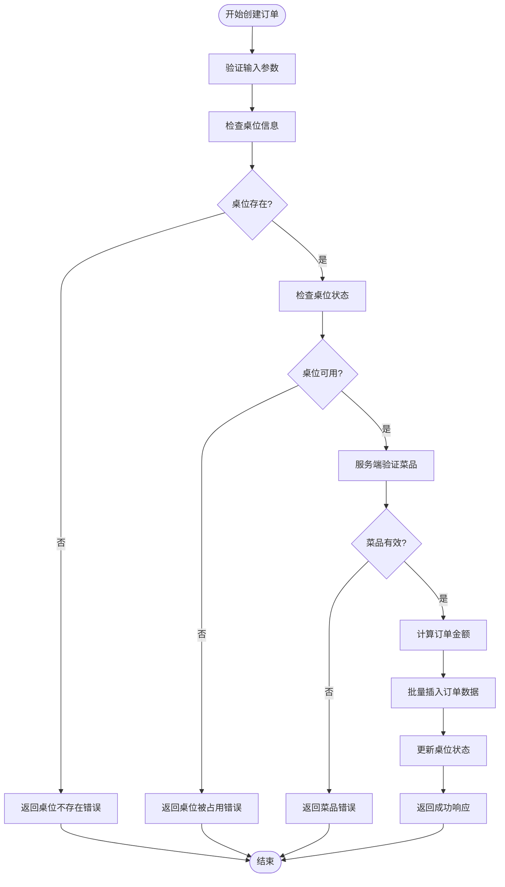
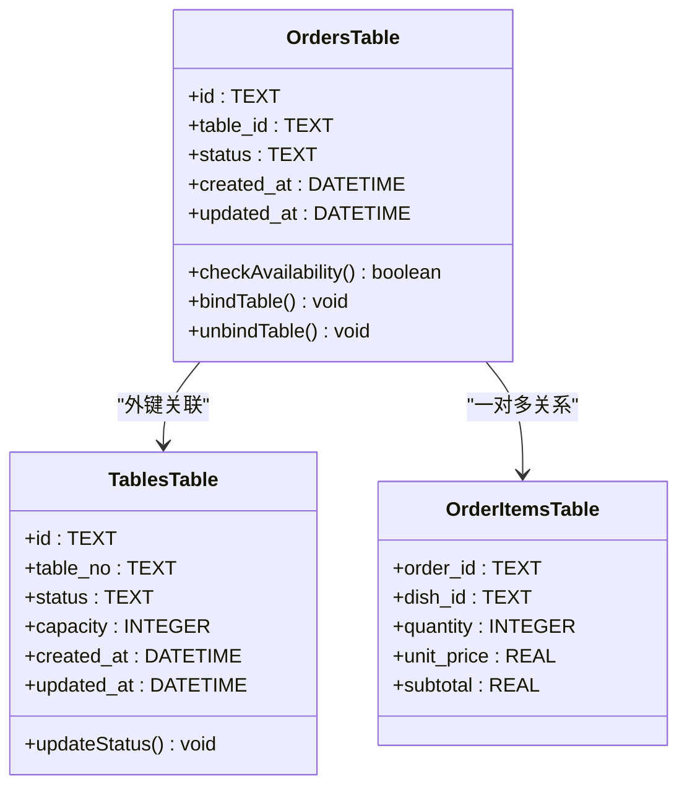
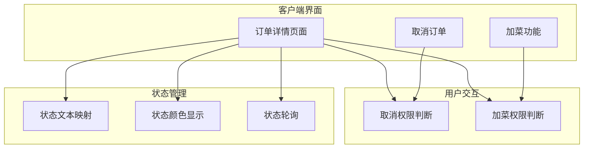
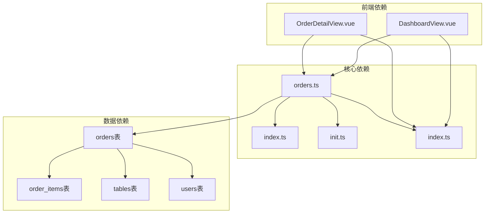

# 订单表设计

<cite>
**本文档引用的文件**
- [orders.ts](file://server/src/routes/orders.ts)
- [init.ts](file://server/src/db/init.ts)
- [index.ts](file://server/src/types/index.ts)
- [index.ts](file://server/src/validators/index.ts)
- [OrderDetailView.vue](file://src/client/views/OrderDetailView.vue)
- [DashboardView.vue](file://src/admin/views/DashboardView.vue)
</cite>

## 目录
1. [简介](#简介)
2. [项目结构](#项目结构)
3. [核心组件](#核心组件)
4. [架构概览](#架构概览)
5. [详细组件分析](#详细组件分析)
6. [依赖关系分析](#依赖关系分析)
7. [性能考虑](#性能考虑)
8. [故障排除指南](#故障排除指南)
9. [结论](#结论)

## 简介

本文档提供了RLRMS餐厅管理系统中订单表(orders)的详细设计文档。订单表是整个系统的核心数据表，负责存储和管理所有用户点餐订单的完整生命周期。本文档深入解释了订单表的字段设计、业务含义、状态流转机制以及相关的外键约束和索引设计。

## 项目结构

订单系统采用前后端分离的架构设计，主要由以下组件构成：

**图表来源**
- [orders.ts:51-552](file://server/src/routes/orders.ts#L51-L552)
- [init.ts:64-95](file://server/src/db/init.ts#L64-L95)

**章节来源**
- [orders.ts:1-552](file://server/src/routes/orders.ts#L1-L552)
- [init.ts:1-204](file://server/src/db/init.ts#L1-L204)

## 核心组件

### 订单表结构设计

订单表(orders)采用SQLite数据库存储，具有以下核心字段：

| 字段名 | 数据类型 | 约束 | 业务含义 |
|--------|----------|------|----------|
| id | TEXT | PRIMARY KEY | 订单唯一标识符，UUID格式 |
| order_no | TEXT | UNIQUE NOT NULL | 订单编号，格式为"RL+日期+4位随机数" |
| table_id | TEXT | FOREIGN KEY | 关联桌位ID，允许为空 |
| user_id | TEXT | FOREIGN KEY | 关联用户ID，允许为空 |
| dining_time | TEXT | | 用餐时间："中午"或"晚上" |
| contact_name | TEXT | | 联系人姓名 |
| contact_phone | TEXT | | 联系电话 |
| total_amount | REAL | NOT NULL | 订单总金额（元） |
| status | TEXT | DEFAULT 'pending' | 订单状态 |
| created_at | DATETIME | DEFAULT CURRENT_TIMESTAMP | 创建时间 |
| updated_at | DATETIME | DEFAULT CURRENT_TIMESTAMP | 更新时间 |

### 外键约束设计

订单表建立了两个重要的外键约束：
- `table_id` → `tables(id)`：确保桌位存在性
- `user_id` → `users(id)`：确保用户存在性

### 索引优化设计

数据库初始化时创建了以下索引以提升查询性能：
- `idx_orders_status`：按状态查询优化
- `idx_orders_contact_phone`：按手机号查询优化  
- `idx_orders_table_id`：按桌位查询优化
- `idx_orders_created_at`：按时间排序优化
- `idx_orders_user_id`：按用户查询优化

**章节来源**
- [init.ts:64-95](file://server/src/db/init.ts#L64-L95)
- [init.ts:124-137](file://server/src/db/init.ts#L124-L137)

## 架构概览

订单系统的整体架构采用RESTful API设计模式，通过Express.js框架实现：

**图表来源**
- [orders.ts:194-353](file://server/src/routes/orders.ts#L194-L353)

**章节来源**
- [orders.ts:1-552](file://server/src/routes/orders.ts#L1-L552)

## 详细组件分析

### 订单生命周期管理

订单状态流转遵循严格的业务规则：

**图表来源**
- [orders.ts:356-418](file://server/src/routes/orders.ts#L356-L418)
- [orders.ts:421-552](file://server/src/routes/orders.ts#L421-L552)

### 订单创建流程

订单创建过程包含多重安全验证和业务逻辑：

**图表来源**
- [orders.ts:194-353](file://server/src/routes/orders.ts#L194-L353)

### 订单状态管理

系统支持四种订单状态，每种状态都有特定的业务含义：

| 状态值 | 中文描述 | 业务含义 | 可执行操作 |
|--------|----------|----------|------------|
| pending | 待确认 | 新创建的订单，等待确认 | 取消、加菜、确认 |
| confirmed | 已确认 | 管理员已确认，准备制作 | 标记完成、重新确认 |
| completed | 已完成 | 菜品制作完成，等待上菜 | - |
| cancelled | 已取消 | 用户或超时取消的订单 | - |

**章节来源**
- [orders.ts:356-418](file://server/src/routes/orders.ts#L356-L418)
- [orders.ts:421-552](file://server/src/routes/orders.ts#L421-L552)

### 桌位绑定机制

桌位绑定是订单系统的重要功能，实现了桌位资源的有效管理：

**图表来源**
- [init.ts:64-95](file://server/src/db/init.ts#L64-L95)

**章节来源**
- [orders.ts:208-236](file://server/src/routes/orders.ts#L208-L236)
- [init.ts:25-34](file://server/src/db/init.ts#L25-L34)

### 用户关联设计

用户关联功能支持会员管理和历史订单追踪：

| 关联方式 | 用途 | 优势 |
|----------|------|------|
| user_id外键 | 明确用户归属 | 支持用户维度统计 |
| contact_phone | 匿名用户识别 | 支持手机号查询 |
| contact_name | 联系人信息 | 提升用户体验 |

**章节来源**
- [orders.ts:62-94](file://server/src/routes/orders.ts#L62-L94)
- [init.ts:188-197](file://server/src/db/init.ts#L188-L197)

### 金额计算机制

系统采用服务端双重验证确保金额准确性：

**图表来源**
- [orders.ts:242-293](file://server/src/routes/orders.ts#L242-L293)

**章节来源**
- [orders.ts:242-293](file://server/src/routes/orders.ts#L242-L293)

### 前端集成实现

前端系统通过Vue.js实现订单状态的实时展示和交互：

**图表来源**
- [OrderDetailView.vue:42-104](file://src/client/views/OrderDetailView.vue#L42-L104)

**章节来源**
- [OrderDetailView.vue:30-104](file://src/client/views/OrderDetailView.vue#L30-L104)
- [DashboardView.vue:91-111](file://src/admin/views/DashboardView.vue#L91-L111)

## 依赖关系分析

订单系统各组件之间的依赖关系如下：

**图表来源**
- [orders.ts:1-10](file://server/src/routes/orders.ts#L1-L10)
- [index.ts:82-97](file://server/src/types/index.ts#L82-L97)

**章节来源**
- [orders.ts:1-552](file://server/src/routes/orders.ts#L1-L552)
- [index.ts:1-133](file://server/src/types/index.ts#L1-L133)

## 性能考虑

### 查询优化策略

1. **索引优化**：针对高频查询字段建立专门索引
2. **批量操作**：使用事务批量处理订单创建
3. **N+1查询优化**：通过预加载避免多次数据库查询

### 缓存策略

系统采用Redis缓存机制优化性能：
- 桌位可用性缓存
- 订单状态缓存
- 实时推送缓存

### 数据一致性保证

通过事务机制确保数据一致性：
- 订单创建的原子性操作
- 桌位状态更新的同步性
- 用户关联的完整性

## 故障排除指南

### 常见问题及解决方案

| 问题类型 | 症状 | 可能原因 | 解决方案 |
|----------|------|----------|----------|
| 订单创建失败 | 返回400错误 | 参数验证失败 | 检查输入数据格式 |
| 桌位冲突 | 返回桌位被占用 | 同一桌位重复下单 | 等待现有订单完成 |
| 金额异常 | 金额与预期不符 | 客户端篡改数据 | 服务端重新计算价格 |
| 状态更新失败 | 状态无法变更 | 权限不足或状态不正确 | 检查用户权限和当前状态 |

### 调试建议

1. **日志分析**：查看服务器端错误日志
2. **数据库检查**：验证订单数据完整性
3. **网络监控**：检查API响应时间和错误率
4. **缓存清理**：定期清理过期缓存数据

**章节来源**
- [orders.ts:196-203](file://server/src/routes/orders.ts#L196-L203)
- [orders.ts:211-216](file://server/src/routes/orders.ts#L211-L216)

## 结论

订单表设计充分考虑了餐厅管理系统的业务需求，通过合理的字段设计、严格的状态管理和完善的外键约束，确保了系统的稳定性和可靠性。系统采用的服务端验证机制有效防止了数据篡改，而丰富的索引设计则保证了查询性能。

未来可以考虑的功能扩展包括：
- 订单历史追踪功能
- 更细粒度的权限控制
- 实时库存同步机制
- 移动端专用接口优化

通过持续的优化和改进，订单系统将能够更好地支撑餐厅业务的发展需求。