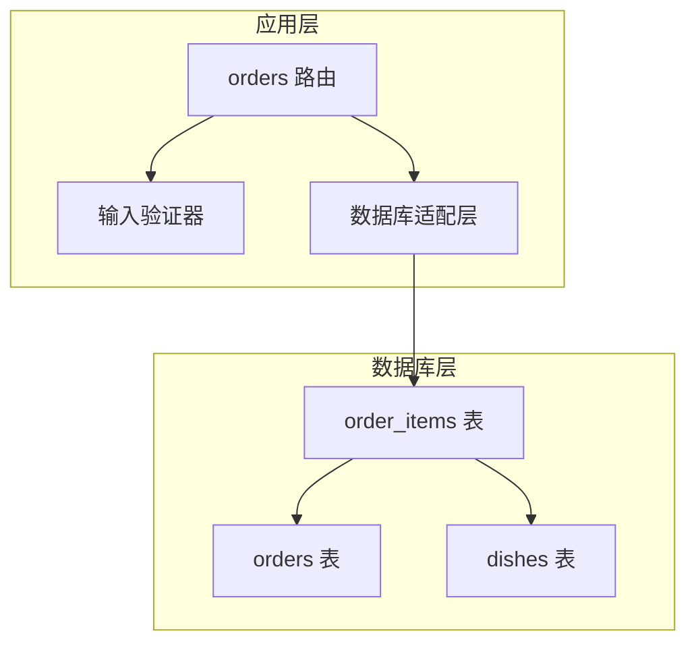
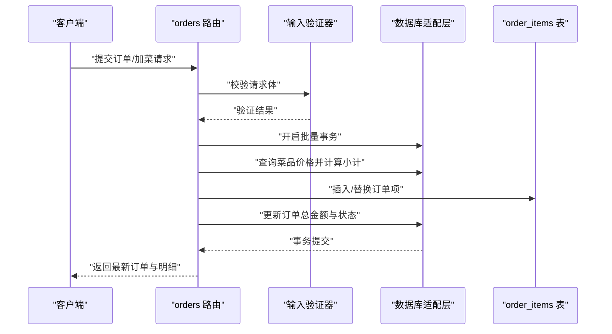

# 订单项表设计

<cite>
**本文引用的文件**
- [server/src/db/init.ts](file://server/src/db/init.ts)
- [server/src/route/orders.ts](file://server/src/routes/orders.ts)
- [server/src/route/admin.ts](file://server/src/routes/admin.ts)
- [server/src/validators/index.ts](file://server/src/validators/index.ts)
- [server/src/db/index.ts](file://server/src/db/index.ts)
- [src/types/index.ts](file://src/types/index.ts)
- [README.md](file://README.md)
</cite>

## 目录
1. [简介](#简介)
2. [项目结构](#项目结构)
3. [核心组件](#核心组件)
4. [架构概览](#架构概览)
5. [详细组件分析](#详细组件分析)
6. [依赖关系分析](#依赖关系分析)
7. [性能考虑](#性能考虑)
8. [故障排除指南](#故障排除指南)
9. [结论](#结论)

## 简介
本设计文档围绕订单项表（order_items）展开，系统性阐述其字段设计、业务含义、数据流与处理逻辑，以及与订单表（orders）、菜品表（dishes）之间的关联关系。文档还覆盖订单明细的添加、修改、删除流程，外键约束与索引策略，并给出 SQL 创建语句与最佳实践建议。

## 项目结构
订单项表位于后端数据库初始化脚本中，与订单表、菜品表共同构成订单域的核心数据模型。相关业务逻辑集中在订单路由模块中，通过批量事务确保数据一致性；前端类型定义用于统一数据契约。



图表来源
- [server/src/db/init.ts:81-95](file://server/src/db/init.ts#L81-L95)
- [server/src/routes/orders.ts:193-392](file://server/src/routes/orders.ts#L193-L392)
- [server/src/validators/index.ts:6-19](file://server/src/validators/index.ts#L6-L19)

章节来源
- [server/src/db/init.ts:81-95](file://server/src/db/init.ts#L81-L95)
- [server/src/routes/orders.ts:193-392](file://server/src/routes/orders.ts#L193-L392)
- [server/src/validators/index.ts:6-19](file://server/src/validators/index.ts#L6-L19)

## 核心组件
- 订单项表（order_items）：存储订单的明细行，包含菜品引用、数量、单价与小计等关键字段。
- 订单路由（orders 路由）：负责订单创建、加菜（修改订单项）、查询等核心业务。
- 输入验证器：对订单创建与加菜请求进行严格的数据校验。
- 数据库适配层：封装 SQL.js 的数据库操作，支持批量事务与防抖保存。

章节来源
- [server/src/db/init.ts:81-95](file://server/src/db/init.ts#L81-L95)
- [server/src/routes/orders.ts:193-392](file://server/src/routes/orders.ts#L193-L392)
- [server/src/validators/index.ts:6-19](file://server/src/validators/index.ts#L6-L19)
- [server/src/db/index.ts:1-156](file://server/src/db/index.ts#L1-L156)

## 架构概览
订单项表作为订单与菜品之间的桥梁，通过外键约束保证引用完整性。订单路由在创建与修改订单项时，会：
- 从菜品表读取实时价格，防止客户端篡改；
- 逐项计算小计并汇总生成订单总金额；
- 在单个事务中完成订单与订单项的写入或替换；
- 通过服务器推送事件通知管理端刷新状态。



图表来源
- [server/src/routes/orders.ts:241-293](file://server/src/routes/orders.ts#L241-L293)
- [server/src/routes/orders.ts:506-524](file://server/src/routes/orders.ts#L506-L524)
- [server/src/validators/index.ts:6-19](file://server/src/validators/index.ts#L6-L19)

## 详细组件分析

### 订单项表字段设计与业务含义
- id：主键，唯一标识每一条订单明细。
- order_id：外键，关联 orders 表，表示该明细所属的订单。
- dish_id：外键，关联 dishes 表，标识具体的菜品。
- dish_name：冗余字段，存储下单时菜品的名称，便于查询与展示。
- quantity：数量，正整数，表示该菜品的数量。
- unit_price：单价，非负浮点数，存储下单时的菜品单价。
- subtotal：小计，非负浮点数，等于 unit_price × quantity，保留两位小数。
- spec：规格/备注，可空字符串，记录菜品规格或客户特殊要求。
- created_at：自动时间戳，默认当前时间，用于排序与审计。

字段来源与约束
- 字段定义与外键约束均在数据库初始化脚本中声明。
- 索引方面，为 order_id 建立了索引以优化按订单查询明细的性能。

章节来源
- [server/src/db/init.ts:81-95](file://server/src/db/init.ts#L81-L95)
- [server/src/db/init.ts:124-137](file://server/src/db/init.ts#L124-L137)

### 订单明细管理机制
- 明细添加（创建订单时）：路由会批量查询菜品价格，使用数据库实际价格重新计算单价与小计，然后一次性插入所有订单项。
- 明细修改（加菜）：先删除原订单下的全部订单项，再插入新的订单项集合，最后更新订单总金额与状态。
- 明细查询：支持按订单 ID 查询明细列表，或在批量查询订单时一并返回明细。

章节来源
- [server/src/routes/orders.ts:193-392](file://server/src/routes/orders.ts#L193-L392)
- [server/src/routes/orders.ts:420-552](file://server/src/routes/orders.ts#L420-L552)

### 菜品关联与价格计算
- 菜品关联：通过 dish_id 与 dishes 表建立外键关系，确保菜品存在且状态为 on_sale。
- 价格计算：服务端根据 dishes.price 实时计算 unit_price 与 subtotal，避免客户端篡改金额。
- 金额精度：采用保留两位小数的四舍五入策略，确保金额一致性。

章节来源
- [server/src/routes/orders.ts:241-293](file://server/src/routes/orders.ts#L241-L293)
- [server/src/routes/orders.ts:453-502](file://server/src/routes/orders.ts#L453-L502)

### 数量控制与规格字段
- 数量控制：数量必须为正整数，防止出现无效数量。
- 规格字段：spec 允许为空，用于记录客户对菜品的特殊要求或规格说明。

章节来源
- [server/src/validators/index.ts:6-19](file://server/src/validators/index.ts#L6-L19)
- [server/src/validators/index.ts:84-93](file://server/src/validators/index.ts#L84-L93)

### 订单项添加、修改、删除实现细节
- 添加（创建订单）：批量插入订单项，随后更新订单总金额与状态为 pending。
- 修改（加菜）：删除旧明细 → 插入新明细 → 更新总金额与状态。
- 删除（删除订单）：删除订单项与订单记录，释放桌位状态并广播事件。

章节来源
- [server/src/routes/orders.ts:295-318](file://server/src/routes/orders.ts#L295-L318)
- [server/src/routes/orders.ts:506-524](file://server/src/routes/orders.ts#L506-L524)
- [server/src/routes/admin.ts:835-872](file://server/src/routes/admin.ts#L835-L872)

### 外键约束与索引设计
- 外键约束
  - order_id 引用 orders(id)，保证订单项归属有效订单。
  - dish_id 引用 dishes(id)，保证菜品存在且状态正常。
- 索引设计
  - idx_order_items_order_id：加速按订单查询明细。
  - 其他相关索引（如 orders.status、dishes.category_id 等）有助于整体查询性能。

章节来源
- [server/src/db/init.ts:81-95](file://server/src/db/init.ts#L81-L95)
- [server/src/db/init.ts:124-137](file://server/src/db/init.ts#L124-L137)

### SQL 创建语句与建议
- 创建 order_items 表的 SQL 与外键约束、索引已在数据库初始化脚本中定义。
- 建议在生产环境中：
  - 保持外键约束以维护引用完整性；
  - 为高频查询列（如 order_id、dish_id）建立合适索引；
  - 对金额字段使用合适的数值类型与精度控制，避免浮点误差累积。

章节来源
- [server/src/db/init.ts:81-95](file://server/src/db/init.ts#L81-L95)
- [server/src/db/init.ts:124-137](file://server/src/db/init.ts#L124-L137)

## 依赖关系分析
订单项表与订单表、菜品表之间存在直接的外键依赖；订单路由依赖输入验证器与数据库适配层；前端类型定义与后端数据结构保持一致。

```mermaid
classDiagram
class OrderItem {
+string id
+string order_id
+string dish_id
+string dish_name
+number quantity
+number unit_price
+number subtotal
+string spec
+datetime created_at
}
class Order {
+string id
+string order_no
+string table_id
+string user_id
+string dining_time
+string contact_name
+string contact_phone
+number total_amount
+string status
}
class Dish {
+string id
+string name
+number price
+string status
}
OrderItem --> Order : "外键 : order_id"
OrderItem --> Dish : "外键 : dish_id"
```

图表来源
- [server/src/db/init.ts:81-95](file://server/src/db/init.ts#L81-L95)
- [README.md:454-462](file://README.md#L454-L462)

章节来源
- [server/src/db/init.ts:81-95](file://server/src/db/init.ts#L81-L95)
- [README.md:454-462](file://README.md#L454-L462)

## 性能考虑
- 批量事务：使用 beginBatch/endBatch 包裹订单与订单项的写入，减少磁盘写入次数，提升吞吐量。
- 防抖保存：数据库写入采用防抖策略，合并短时间内多次写入，降低 I/O 压力。
- 索引优化：为 order_id 建立索引，显著提升按订单查询明细的性能。
- N+1 查询规避：批量查询订单对应的明细，避免逐订单查询导致的性能问题。

章节来源
- [server/src/db/index.ts:46-73](file://server/src/db/index.ts#L46-L73)
- [server/src/db/index.ts:149-156](file://server/src/db/index.ts#L149-L156)
- [server/src/db/init.ts:124-137](file://server/src/db/init.ts#L124-L137)
- [server/src/routes/orders.ts:96-130](file://server/src/routes/orders.ts#L96-L130)

## 故障排除指南
- 订单项未显示或查询异常
  - 检查订单 ID 是否正确，order_id 是否存在对应订单。
  - 确认 order_items 表上是否建立了 idx_order_items_order_id 索引。
- 金额不一致或小数异常
  - 核对单价与数量的计算逻辑，确保使用服务端实时价格。
  - 检查金额四舍五入策略是否一致（保留两位小数）。
- 外键约束报错
  - 确保 dish_id 对应的菜品存在且状态为 on_sale。
  - 确保 order_id 对应的订单存在且状态允许修改。
- 批量写入失败
  - 检查 beginBatch/endBatch 是否成对调用，避免遗漏提交。
  - 关注数据库适配层的错误日志，定位具体失败语句。

章节来源
- [server/src/routes/orders.ts:241-293](file://server/src/routes/orders.ts#L241-L293)
- [server/src/routes/orders.ts:453-502](file://server/src/routes/orders.ts#L453-L502)
- [server/src/db/index.ts:46-73](file://server/src/db/index.ts#L46-L73)

## 结论
订单项表通过清晰的字段设计与严格的外键约束，实现了订单与菜品之间的稳定关联。配合服务端的价格校验、批量事务与索引优化，系统在功能正确性与性能表现上达到良好平衡。建议在生产环境持续关注索引维护与金额精度控制，确保长期稳定运行。