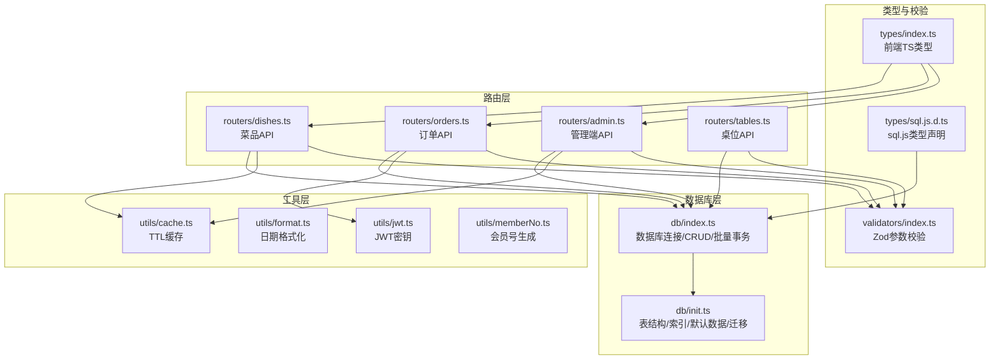
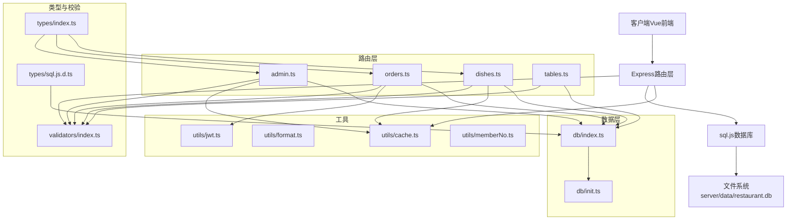
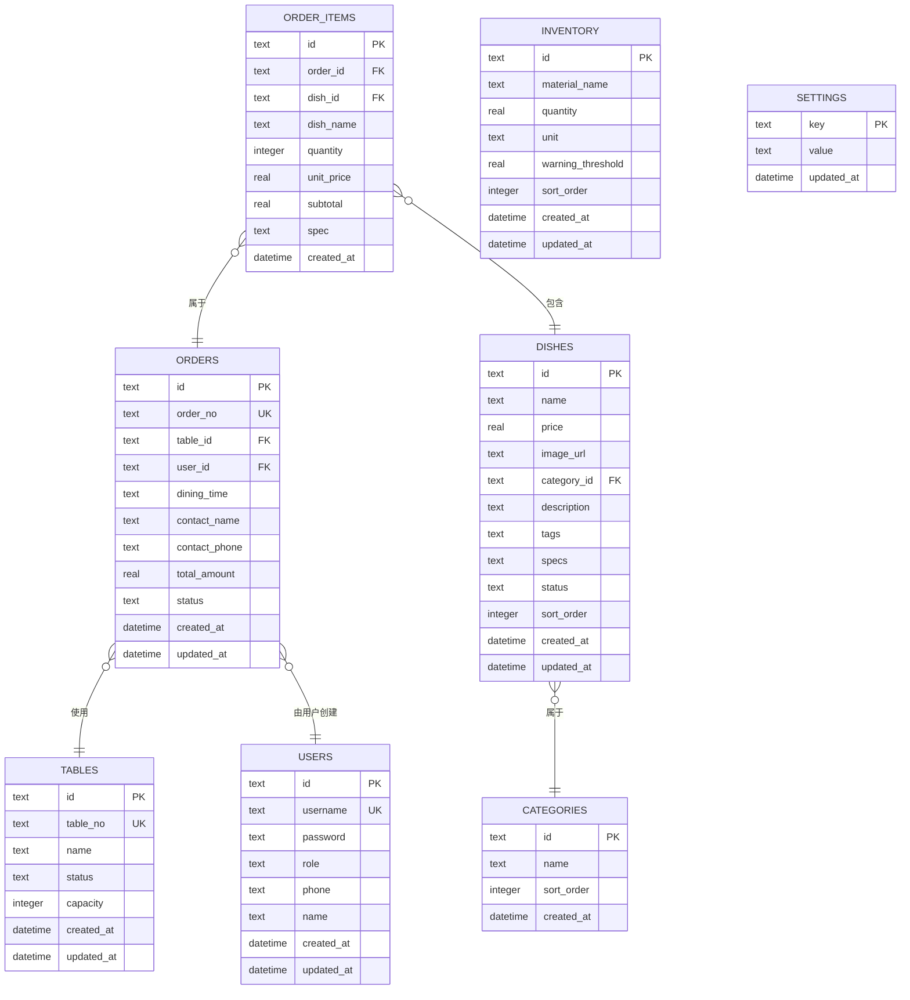
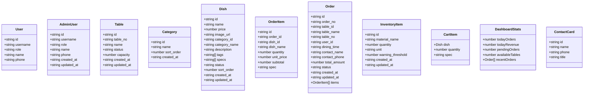
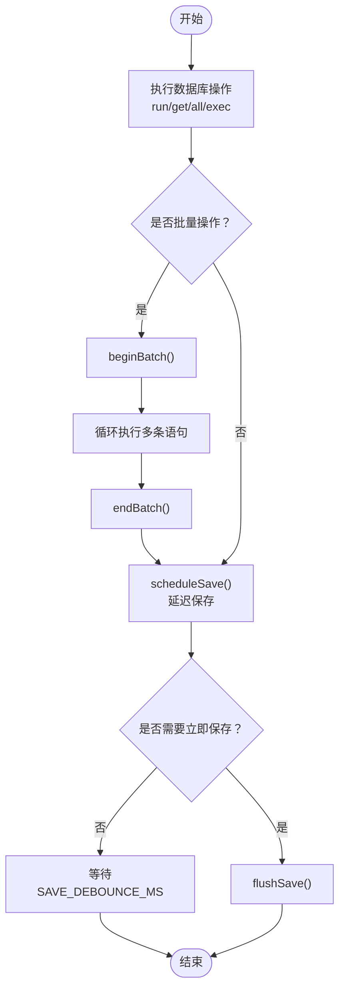
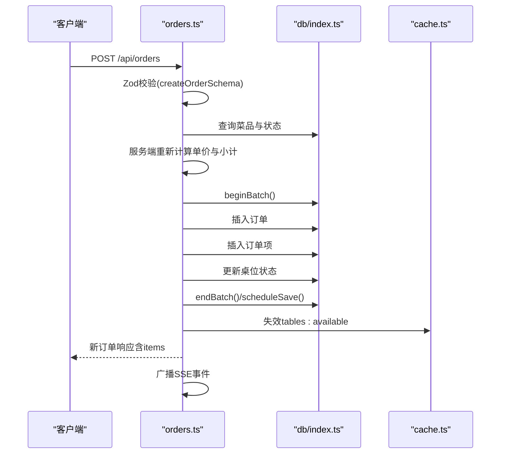
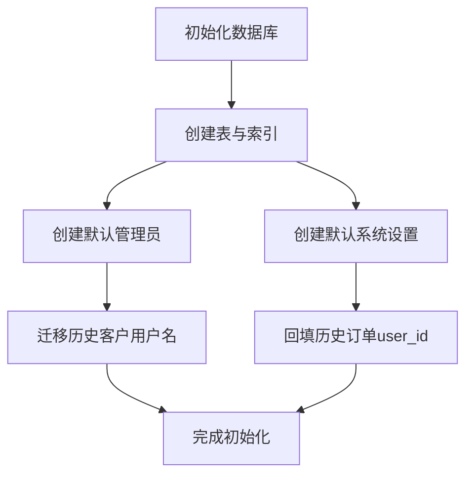
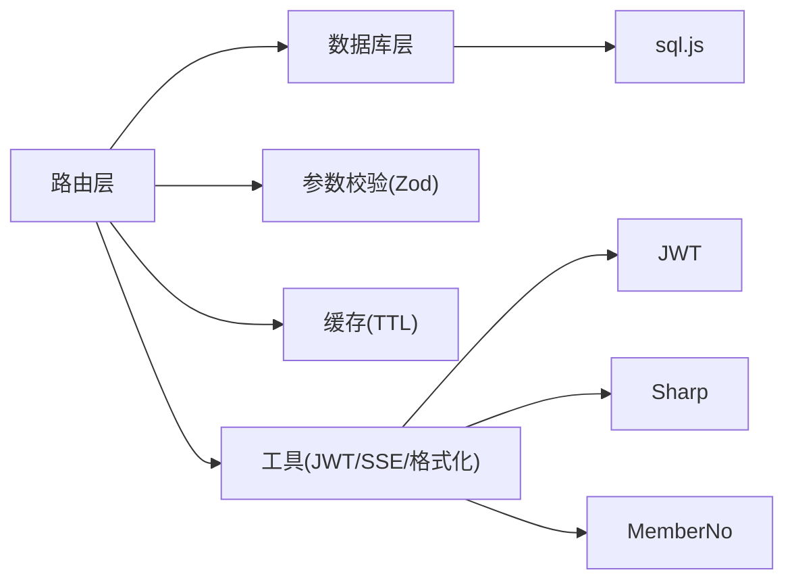

# 数据模型设计

<cite>
**本文档引用的文件**
- [server/src/db/index.ts](file://server/src/db/index.ts)
- [server/src/db/init.ts](file://server/src/db/init.ts)
- [src/types/index.ts](file://src/types/index.ts)
- [server/src/routers/admin.ts](file://server/src/routers/admin.ts)
- [server/src/routers/dishes.ts](file://server/src/routers/dishes.ts)
- [server/src/routers/orders.ts](file://server/src/routers/orders.ts)
- [server/src/routers/tables.ts](file://server/src/routers/tables.ts)
- [server/src/validators/index.ts](file://server/src/validators/index.ts)
- [server/src/utils/cache.ts](file://server/src/utils/cache.ts)
- [server/src/utils/format.ts](file://server/src/utils/format.ts)
- [server/src/utils/jwt.ts](file://server/src/utils/jwt.ts)
- [server/src/utils/memberNo.ts](file://server/src/utils/memberNo.ts)
- [server/src/types/sql.js.d.ts](file://server/src/types/sql.js.d.ts)
- [README.md](file://README.md)
</cite>

## 目录
1. [简介](#简介)
2. [项目结构](#项目结构)
3. [核心组件](#核心组件)
4. [架构总览](#架构总览)
5. [详细组件分析](#详细组件分析)
6. [依赖分析](#依赖分析)
7. [性能考虑](#性能考虑)
8. [故障排除指南](#故障排除指南)
9. [结论](#结论)
10. [附录](#附录)

## 简介
本文件面向RLRMS（红灯笼食府）系统的数据模型设计，系统采用前后端分离架构，后端基于Node.js + Express + sql.js（SQLite的JavaScript实现），前端基于Vue 3 + Vite + TypeScript。数据库采用SQLite文件存储，位于server/data/restaurant.db，通过sql.js进行读写。

数据模型围绕以下核心实体展开：
- 用户（users）
- 桌位（tables）
- 分类（categories）
- 菜品（dishes）
- 订单（orders）
- 订单项（order_items）
- 库存（inventory）
- 系统设置（settings）

系统通过严格的类型定义（TypeScript接口）与参数校验（Zod）保障数据一致性；通过缓存策略（TTL内存缓存）与批量事务（beginBatch/endBatch）提升性能；通过索引与查询优化保证查询效率；通过迁移脚本处理历史数据兼容问题。

## 项目结构
后端数据层与业务层的关键文件组织如下：
- 数据库层：server/src/db/index.ts（数据库连接、CRUD、批量事务、保存策略）、server/src/db/init.ts（表结构初始化、索引创建、默认数据与迁移）
- 类型定义：src/types/index.ts（前端TS类型）、server/src/types/sql.js.d.ts（sql.js类型声明）
- 路由层：server/src/routers/*（dishes.ts、orders.ts、tables.ts、admin.ts等）
- 参数校验：server/src/validators/index.ts（Zod Schema）
- 工具层：server/src/utils/cache.ts（TTL缓存）、server/src/utils/format.ts（日期格式化）、server/src/utils/jwt.ts（JWT密钥）、server/src/utils/memberNo.ts（会员号生成）

**图表来源**
- [server/src/db/index.ts:1-156](file://server/src/db/index.ts#L1-L156)
- [server/src/db/init.ts:1-204](file://server/src/db/init.ts#L1-L204)
- [src/types/index.ts:1-133](file://src/types/index.ts#L1-L133)
- [server/src/routers/admin.ts:1-800](file://server/src/routers/admin.ts#L1-L800)
- [server/src/routers/dishes.ts:1-216](file://server/src/routers/dishes.ts#L1-L216)
- [server/src/routers/orders.ts:1-552](file://server/src/routers/orders.ts#L1-L552)
- [server/src/routers/tables.ts:1-93](file://server/src/routers/tables.ts#L1-L93)
- [server/src/validators/index.ts:1-123](file://server/src/validators/index.ts#L1-L123)
- [server/src/utils/cache.ts:1-73](file://server/src/utils/cache.ts#L1-L73)
- [server/src/utils/format.ts:1-12](file://server/src/utils/format.ts#L1-L12)
- [server/src/utils/jwt.ts:1-27](file://server/src/utils/jwt.ts#L1-L27)
- [server/src/utils/memberNo.ts:1-19](file://server/src/utils/memberNo.ts#L1-L19)
- [server/src/types/sql.js.d.ts:1-24](file://server/src/types/sql.js.d.ts#L1-L24)

**章节来源**
- [README.md:61-174](file://README.md#L61-L174)

## 核心组件
本节概述数据库表结构、关系与约束，以及对应的TypeScript类型定义。

- 用户（users）
  - 字段：id（PK，TEXT）、username（UNIQUE，NOT NULL）、password（NOT NULL）、role（NOT NULL，默认'customer'）、phone、name、created_at、updated_at
  - 约束：username唯一；role枚举值为'customer'或'admin'
  - 关系：被订单表通过user_id外键引用
  - 类型：User、AdminUser（前端TS类型）

- 桌位（tables）
  - 字段：id（PK，TEXT）、table_no（UNIQUE，NOT NULL）、name（NOT NULL）、status（NOT NULL，默认'available'）、capacity（INTEGER，默认4）、created_at、updated_at
  - 约束：table_no唯一；status枚举值为'available'、'occupied'、'reserved'
  - 关系：被订单表通过table_id外键引用
  - 类型：Table

- 分类（categories）
  - 字段：id（PK，TEXT）、name（NOT NULL）、sort_order（INTEGER，默认0）、created_at
  - 约束：sort_order用于排序
  - 关系：被菜品表通过category_id外键引用
  - 类型：Category

- 菜品（dishes）
  - 字段：id（PK，TEXT）、name（NOT NULL）、price（REAL，NOT NULL）、image_url、category_id（FK）、description、tags（JSON字符串数组）、specs（JSON字符串数组）、status（默认'on_sale'）、sort_order（INTEGER，默认0）、created_at、updated_at
  - 约束：status枚举值为'on_sale'、'off_sale'
  - 关系：与分类一对多；与订单项一对多
  - 类型：Dish

- 订单（orders）
  - 字段：id（PK，TEXT）、order_no（UNIQUE，NOT NULL）、table_id（FK）、user_id（FK）、dining_time（'中午'|'晚上'|null）、contact_name、contact_phone、total_amount（REAL，NOT NULL）、status（默认'pending'）、created_at、updated_at
  - 约束：status枚举值为'pending'、'confirmed'、'completed'、'cancelled'
  - 关系：与桌位、用户一对多；与订单项一对多
  - 类型：Order

- 订单项（order_items）
  - 字段：id（PK，TEXT）、order_id（FK）、dish_id（FK）、dish_name（NOT NULL）、quantity（INTEGER，NOT NULL）、unit_price（REAL，NOT NULL）、subtotal（REAL，NOT NULL）、spec、created_at
  - 关系：与订单、菜品多对一
  - 类型：OrderItem

- 库存（inventory）
  - 字段：id（PK，TEXT）、material_name（NOT NULL）、quantity（REAL，NOT NULL）、unit（NOT NULL）、warning_threshold（REAL，默认0）、sort_order（INTEGER，默认0）、created_at、updated_at
  - 类型：InventoryItem

- 系统设置（settings）
  - 字段：key（PK，TEXT）、value（NOT NULL）、updated_at
  - 类型：无专门TS类型，作为通用键值对使用

**章节来源**
- [server/src/db/init.ts:11-122](file://server/src/db/init.ts#L11-L122)
- [src/types/index.ts:9-133](file://src/types/index.ts#L9-L133)

## 架构总览
系统采用“路由层-数据层-类型与校验层”的清晰分层，配合缓存与批量事务机制，实现高性能与一致性的平衡。

**图表来源**
- [server/src/routers/admin.ts:1-800](file://server/src/routers/admin.ts#L1-L800)
- [server/src/routers/dishes.ts:1-216](file://server/src/routers/dishes.ts#L1-L216)
- [server/src/routers/orders.ts:1-552](file://server/src/routers/orders.ts#L1-L552)
- [server/src/routers/tables.ts:1-93](file://server/src/routers/tables.ts#L1-L93)
- [server/src/db/index.ts:1-156](file://server/src/db/index.ts#L1-L156)
- [server/src/db/init.ts:1-204](file://server/src/db/init.ts#L1-L204)
- [src/types/index.ts:1-133](file://src/types/index.ts#L1-L133)
- [server/src/validators/index.ts:1-123](file://server/src/validators/index.ts#L1-L123)
- [server/src/utils/cache.ts:1-73](file://server/src/utils/cache.ts#L1-L73)
- [server/src/utils/format.ts:1-12](file://server/src/utils/format.ts#L1-L12)
- [server/src/utils/jwt.ts:1-27](file://server/src/utils/jwt.ts#L1-L27)
- [server/src/utils/memberNo.ts:1-19](file://server/src/utils/memberNo.ts#L1-L19)
- [server/src/types/sql.js.d.ts:1-24](file://server/src/types/sql.js.d.ts#L1-L24)

## 详细组件分析

### 数据库表结构与关系
- 主键与外键
  - users.id、tables.id、categories.id、dishes.id、orders.id、order_items.id、inventory.id均为主键
  - dishes.category_id → categories.id
  - order_items.order_id → orders.id、order_items.dish_id → dishes.id
  - orders.table_id → tables.id、orders.user_id → users.id
- 索引设计
  - 订单：idx_orders_status、idx_orders_contact_phone、idx_orders_table_id、idx_orders_created_at、idx_orders_user_id
  - 订单项：idx_order_items_order_id
  - 菜品：idx_dishes_category_id、idx_dishes_status、idx_dishes_sort_order
  - 用户：idx_users_phone、idx_users_role
  - 桌位：idx_tables_status
- 约束与默认值
  - 角色、状态枚举值在schema中定义
  - created_at/updated_at使用CURRENT_TIMESTAMP默认值
  - capacity默认4，sort_order默认0

**图表来源**
- [server/src/db/init.ts:11-122](file://server/src/db/init.ts#L11-L122)

**章节来源**
- [server/src/db/init.ts:11-137](file://server/src/db/init.ts#L11-L137)

### TypeScript类型定义与约束
- 前端全局类型（src/types/index.ts）
  - 响应体：ApiResponse<T>
  - 用户：User、AdminUser
  - 桌位：Table
  - 分类：Category
  - 菜品：Dish
  - 订单：Order（含items）
  - 订单项：OrderItem
  - 库存：InventoryItem
  - 购物车：CartItem
  - 仪表盘统计：DashboardStats
  - 联系人/名片：ContactCard
- sql.js类型声明（server/src/types/sql.js.d.ts）
  - Database、Statement接口与initSqlJs方法签名

**图表来源**
- [src/types/index.ts:1-133](file://src/types/index.ts#L1-L133)

**章节来源**
- [src/types/index.ts:1-133](file://src/types/index.ts#L1-L133)
- [server/src/types/sql.js.d.ts:1-24](file://server/src/types/sql.js.d.ts#L1-L24)

### 数据访问模式与缓存策略
- 数据访问模式
  - CRUD封装：run（写）、get（单行）、all（多行）、exec（原始SQL）
  - 批量事务：beginBatch、endBatch、runBatch，使用SAVE_DEBOUNCE_MS降低磁盘写入频率
  - 保存策略：saveDatabase（同步保存）、flushSave（关闭前刷新）
- 缓存策略
  - TTL内存缓存：cacheGet、cacheSet、cacheInvalidate、cacheInvalidatePrefix、cacheClear
  - 缓存键命名空间：categories、dishes:home-data、dishes:list、dishes:search:、settings、tables:available、tables:available-for:
  - 路由侧缓存使用：菜品列表、首页聚合数据、分类列表、可用桌位等

**图表来源**
- [server/src/db/index.ts:36-73](file://server/src/db/index.ts#L36-L73)
- [server/src/db/index.ts:22-44](file://server/src/db/index.ts#L22-L44)
- [server/src/db/index.ts:149-156](file://server/src/db/index.ts#L149-L156)

**章节来源**
- [server/src/db/index.ts:1-156](file://server/src/db/index.ts#L1-L156)
- [server/src/utils/cache.ts:1-73](file://server/src/utils/cache.ts#L1-L73)

### 数据验证规则与业务规则
- 参数校验（Zod）
  - 订单创建：createOrderSchema（桌位、就餐时间、联系人、手机号、菜品清单）
  - 菜品管理：createDishSchema、updateDishSchema
  - 桌位管理：createTableSchema
  - 分类管理：createCategorySchema
  - 库存管理：createInventorySchema、updateInventorySchema
  - 订单状态：updateOrderStatusSchema（状态白名单）
  - 取消订单：cancelOrderSchema（手机号验证）
  - 加菜：updateOrderItemsSchema（复用菜品清单）
  - 用户管理：createUserSchema、updateUserSchema
- 业务规则
  - 订单创建：服务端批量验证菜品与价格，防止客户端篡改；桌位状态检查与占用冲突检测；批量写入事务；SSE广播新订单
  - 订单取消：5分钟时限、状态检查、手机号匹配、桌位状态恢复
  - 桌位可用性：按就餐时段过滤可用与预留但非同时段占用的桌位
  - 菜品与分类排序：支持批量重排
  - 管理端图片清理：删除菜品时若图片未被其他菜品使用则同步删除文件

**图表来源**
- [server/src/routers/orders.ts:194-353](file://server/src/routers/orders.ts#L194-L353)
- [server/src/db/index.ts:63-73](file://server/src/db/index.ts#L63-L73)
- [server/src/db/index.ts:100-109](file://server/src/db/index.ts#L100-L109)
- [server/src/utils/cache.ts:41-43](file://server/src/utils/cache.ts#L41-L43)

**章节来源**
- [server/src/validators/index.ts:1-123](file://server/src/validators/index.ts#L1-L123)
- [server/src/routers/orders.ts:194-353](file://server/src/routers/orders.ts#L194-L353)
- [server/src/routers/tables.ts:24-76](file://server/src/routers/tables.ts#L24-L76)

### 数据生命周期管理与迁移策略
- 生命周期
  - 初始化：首次启动加载或创建数据库文件；创建表与索引；插入默认管理员与系统设置
  - 运行期：批量事务减少IO；TTL缓存降低查询压力；SSE推送实时事件
  - 关闭：flushSave确保未保存的变更落盘
- 迁移策略
  - 历史客户用户名迁移：将username与phone一致的customer迁移到数字会员号（幂等，避免重复）
  - 历史订单user_id回填：根据contact_phone回填关联的customer id（幂等）
  - 库存表列迁移：向后兼容新增sort_order列
- 数据导出/导入/重置
  - 管理端提供导出ZIP（含图片）与导入ZIP（覆盖现有数据）
  - 重置数据库需二次确认（confirm: "RESET"）

**图表来源**
- [server/src/db/init.ts:5-203](file://server/src/db/init.ts#L5-L203)

**章节来源**
- [server/src/db/init.ts:167-198](file://server/src/db/init.ts#L167-L198)
- [server/src/db/init.ts:110-114](file://server/src/db/init.ts#L110-L114)

## 依赖分析
- 组件耦合
  - 路由层依赖数据库层（CRUD）、参数校验层（Zod）、缓存层（TTL）
  - 订单路由依赖JWT中间件与SSE广播
  - 管理端路由依赖鉴权中间件与缓存失效
- 外部依赖
  - sql.js：SQLite的JavaScript实现，提供Database/Statement接口
  - bcryptjs：密码加密
  - uuid：ID生成
  - sharp：图片处理（压缩、WebP转换）
  - zod：类型优先的参数校验
  - jsonwebtoken：JWT签发与验证
- 循环依赖
  - 当前结构未见明显循环依赖；路由与工具模块保持单向依赖

**图表来源**
- [server/src/routers/admin.ts:1-17](file://server/src/routers/admin.ts#L1-L17)
- [server/src/routers/dishes.ts:1-4](file://server/src/routers/dishes.ts#L1-L4)
- [server/src/routers/orders.ts:1-9](file://server/src/routers/orders.ts#L1-L9)
- [server/src/routers/tables.ts:1-4](file://server/src/routers/tables.ts#L1-L4)
- [server/src/db/index.ts:1-6](file://server/src/db/index.ts#L1-L6)
- [server/src/validators/index.ts:1-2](file://server/src/validators/index.ts#L1-L2)
- [server/src/utils/cache.ts:1-4](file://server/src/utils/cache.ts#L1-L4)
- [server/src/utils/jwt.ts:1-27](file://server/src/utils/jwt.ts#L1-L27)
- [server/src/utils/format.ts:1-12](file://server/src/utils/format.ts#L1-L12)
- [server/src/utils/memberNo.ts:1-19](file://server/src/utils/memberNo.ts#L1-L19)

**章节来源**
- [server/src/routers/admin.ts:1-17](file://server/src/routers/admin.ts#L1-L17)
- [server/src/routers/dishes.ts:1-4](file://server/src/routers/dishes.ts#L1-L4)
- [server/src/routers/orders.ts:1-9](file://server/src/routers/orders.ts#L1-L9)
- [server/src/routers/tables.ts:1-4](file://server/src/routers/tables.ts#L1-L4)
- [server/src/db/index.ts:1-6](file://server/src/db/index.ts#L1-L6)
- [server/src/validators/index.ts:1-2](file://server/src/validators/index.ts#L1-L2)
- [server/src/utils/cache.ts:1-4](file://server/src/utils/cache.ts#L1-L4)
- [server/src/utils/jwt.ts:1-27](file://server/src/utils/jwt.ts#L1-L27)
- [server/src/utils/format.ts:1-12](file://server/src/utils/format.ts#L1-L12)
- [server/src/utils/memberNo.ts:1-19](file://server/src/utils/memberNo.ts#L1-L19)

## 性能考虑
- 查询性能
  - 为高频查询字段建立索引（订单状态、桌位状态、菜品状态/排序等）
  - 使用批量查询避免N+1问题（订单列表一次性拉取所有订单项）
- 写入性能
  - 批量事务（beginBatch/endBatch）合并多次写入
  - 写入去抖（debounce）降低磁盘IO频率
- 缓存策略
  - TTL缓存热点数据（分类、菜品列表、首页聚合、可用桌位）
  - 缓存键前缀失效，精确控制缓存失效范围
- 安全与一致性
  - 服务端重新验证菜品与价格，防止客户端篡改
  - 批量写入事务保证订单与订单项的一致性

[本节为通用性能讨论，不直接分析具体文件]

## 故障排除指南
- 数据库未初始化
  - 现象：调用数据库方法抛出未初始化错误
  - 处理：确保先调用初始化流程（db/init.ts）
- 写入未落盘
  - 现象：服务异常退出后数据丢失
  - 处理：在关闭流程中调用flushSave，或使用endBatch触发保存
- 缓存脏读
  - 现象：更新后读取到旧数据
  - 处理：在写入后调用cacheInvalidate或cacheInvalidatePrefix
- 订单状态异常
  - 现象：取消/加菜失败或状态不符
  - 处理：检查状态白名单、时间窗口、手机号匹配、桌位占用情况
- 图片清理失败
  - 现象：删除菜品后仍有残留图片
  - 处理：确认图片未被其他菜品引用，且文件路径在允许范围内

**章节来源**
- [server/src/db/index.ts:93-98](file://server/src/db/index.ts#L93-L98)
- [server/src/db/index.ts:149-156](file://server/src/db/index.ts#L149-L156)
- [server/src/routers/orders.ts:355-418](file://server/src/routers/orders.ts#L355-L418)
- [server/src/routers/admin.ts:46-82](file://server/src/routers/admin.ts#L46-L82)

## 结论
本数据模型设计以SQLite文件为基础，结合sql.js实现轻量级、易部署的数据库方案；通过严格的类型定义与参数校验保障数据一致性；通过缓存与批量事务优化性能；通过索引与查询优化提升查询效率；通过迁移脚本处理历史数据兼容问题。整体架构清晰、扩展性强，适合中小型餐厅的数字化运营需求。

[本节为总结性内容，不直接分析具体文件]

## 附录
- API接口与数据模型对应关系
  - 菜品接口：dishes.ts → dishes表
  - 桌位接口：tables.ts → tables表
  - 订单接口：orders.ts → orders/order_items表
  - 管理端接口：admin.ts → users/tables/categories/dishes/orders/inventory/settings
- 默认账号
  - 管理员：admin/admin123（首次登录后建议修改密码）

**章节来源**
- [README.md:407-483](file://README.md#L407-L483)
- [README.md:485-491](file://README.md#L485-L491)