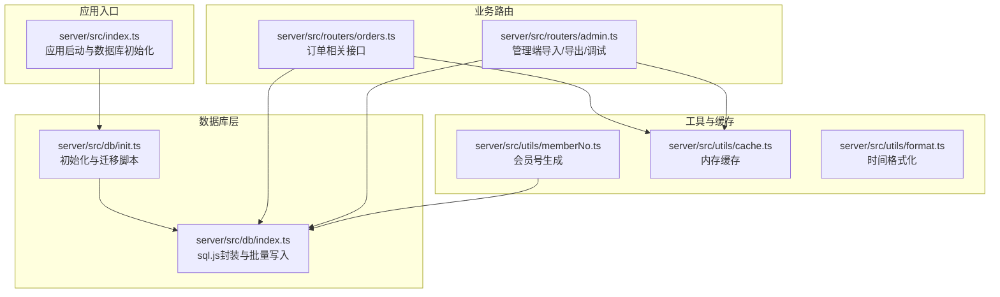
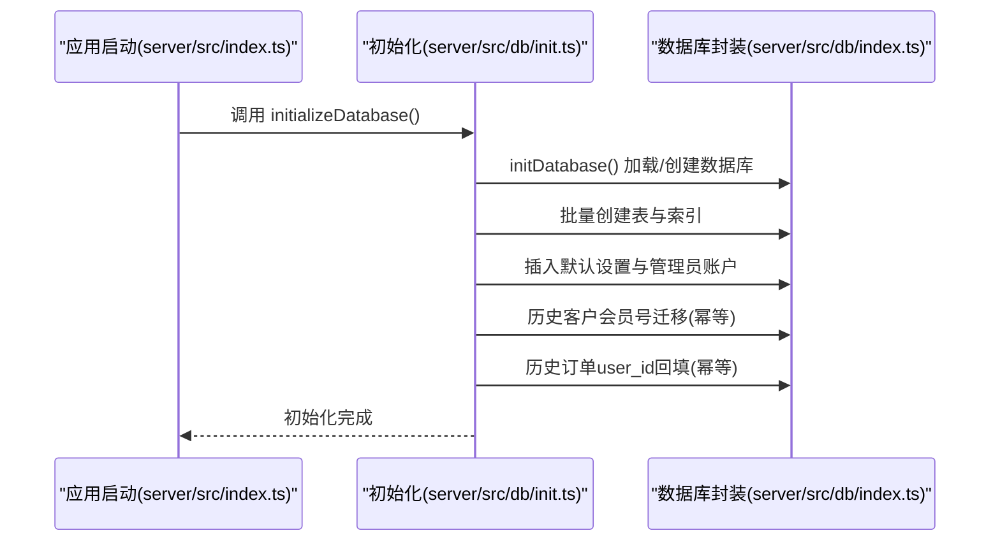
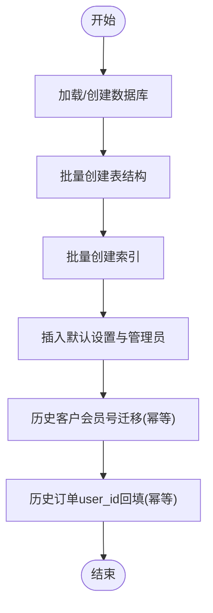
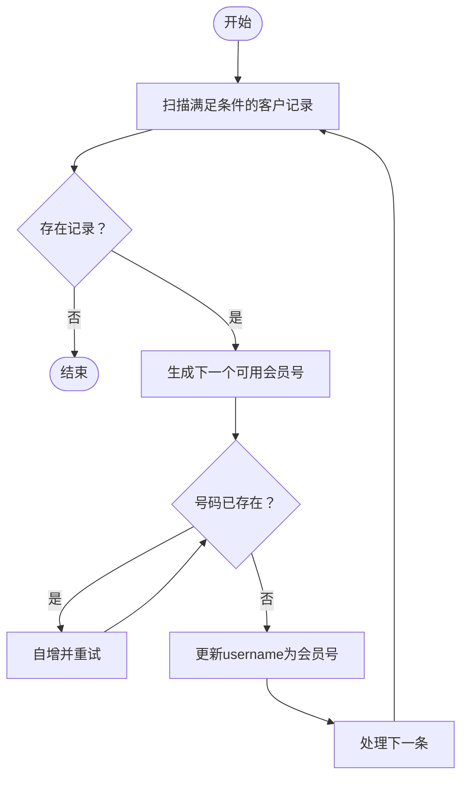
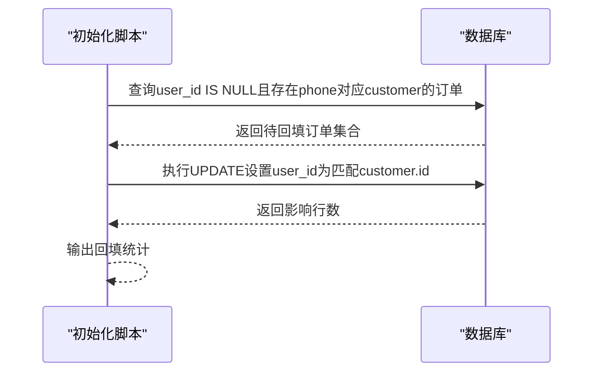
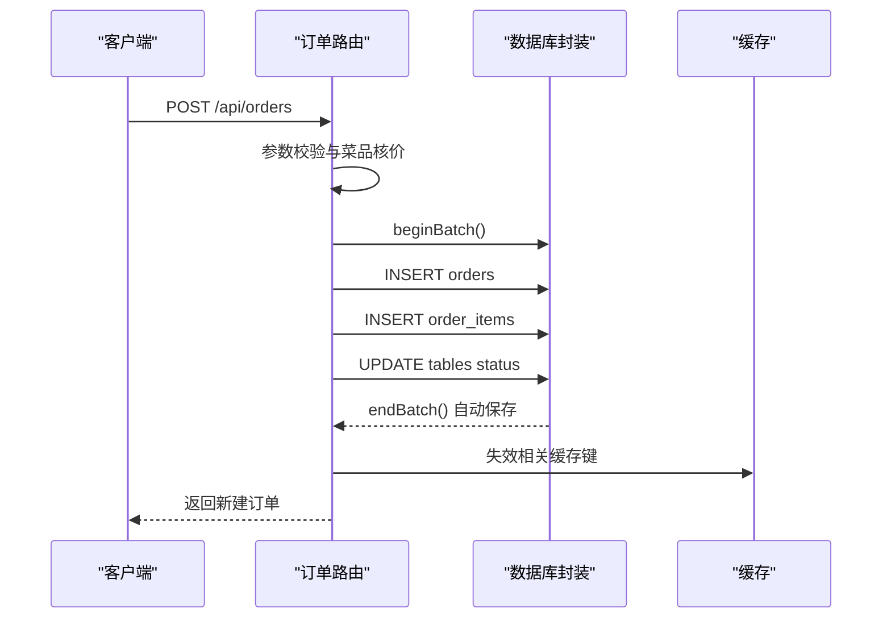
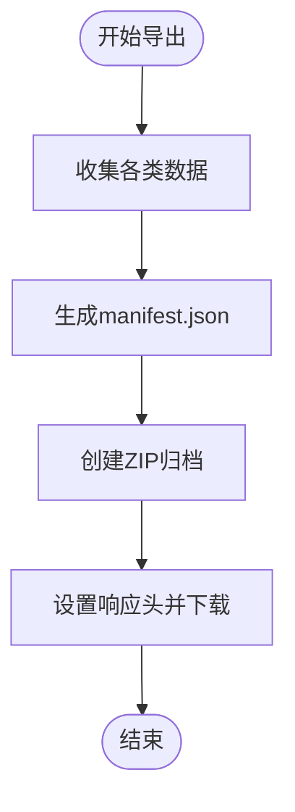
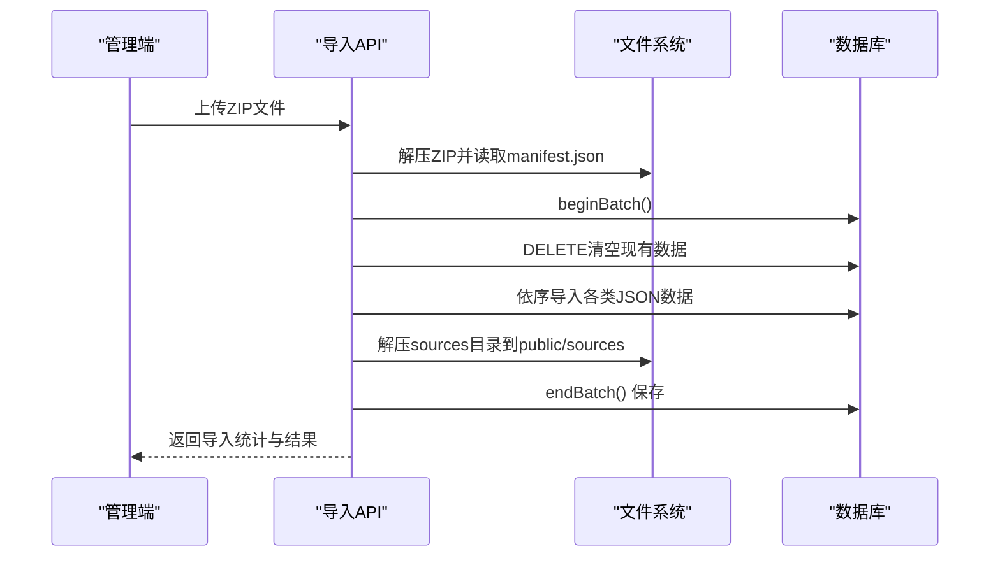
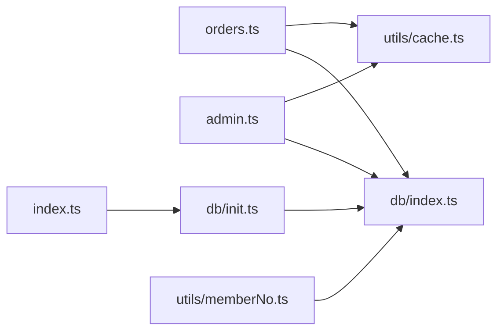

# 数据迁移与版本管理

<cite>
**本文引用的文件**
- [server/src/db/index.ts](file://server/src/db/index.ts)
- [server/src/db/init.ts](file://server/src/db/init.ts)
- [server/src/utils/memberNo.ts](file://server/src/utils/memberNo.ts)
- [server/src/routers/orders.ts](file://server/src/routers/orders.ts)
- [server/src/routers/admin.ts](file://server/src/routers/admin.ts)
- [server/src/utils/cache.ts](file://server/src/utils/cache.ts)
- [server/src/utils/format.ts](file://server/src/utils/format.ts)
- [server/src/index.ts](file://server/src/index.ts)
- [.trae/specs/add-data-import-export/spec.md](file://.trae/specs/add-data-import-export/spec.md)
</cite>

## 目录
1. [简介](#简介)
2. [项目结构](#项目结构)
3. [核心组件](#核心组件)
4. [架构概览](#架构概览)
5. [详细组件分析](#详细组件分析)
6. [依赖关系分析](#依赖关系分析)
7. [性能考虑](#性能考虑)
8. [故障排查指南](#故障排查指南)
9. [结论](#结论)
10. [附录](#附录)

## 简介
本文件面向RLRMS系统的数据库初始化、表结构变更与历史数据迁移，提供完整的版本管理与迁移策略说明。重点涵盖：
- 数据库初始化流程与幂等性设计
- 历史数据迁移方案（客户会员号迁移、订单用户ID回填）
- 版本升级与回滚策略
- 数据备份、恢复与一致性检查
- 索引优化与性能调优

## 项目结构
RLRMS采用前后端分离架构，后端基于Express + sql.js嵌入式数据库，通过统一的数据库访问层封装SQLite操作；管理端提供数据导入/导出能力，支持备份与迁移。

**图表来源**
- [server/src/index.ts:148-175](file://server/src/index.ts#L148-L175)
- [server/src/db/index.ts:75-98](file://server/src/db/index.ts#L75-L98)
- [server/src/db/init.ts:5-203](file://server/src/db/init.ts#L5-L203)
- [server/src/routers/orders.ts:194-353](file://server/src/routers/orders.ts#L194-L353)
- [server/src/routers/admin.ts:1428-1677](file://server/src/routers/admin.ts#L1428-L1677)

**章节来源**
- [server/src/index.ts:148-175](file://server/src/index.ts#L148-L175)
- [server/src/db/index.ts:75-98](file://server/src/db/index.ts#L75-L98)
- [server/src/db/init.ts:5-203](file://server/src/db/init.ts#L5-L203)
- [server/src/routers/orders.ts:194-353](file://server/src/routers/orders.ts#L194-L353)
- [server/src/routers/admin.ts:1428-1677](file://server/src/routers/admin.ts#L1428-L1677)

## 核心组件
- 数据库访问层：封装sql.js初始化、读写、批量事务与防抖落盘，确保高吞吐与一致性。
- 初始化与迁移：在首次启动时创建表结构、索引与默认数据，并执行历史数据迁移。
- 会员号生成：提供幂等的数字会员号生成策略，避免并发冲突。
- 订单接口：批量写入订单与订单项，维护表状态与缓存一致性。
- 管理端导入/导出：标准化备份与恢复流程，支持结构化数据与图片资源打包。

**章节来源**
- [server/src/db/index.ts:100-147](file://server/src/db/index.ts#L100-L147)
- [server/src/db/init.ts:110-203](file://server/src/db/init.ts#L110-L203)
- [server/src/utils/memberNo.ts:12-18](file://server/src/utils/memberNo.ts#L12-L18)
- [server/src/routers/orders.ts:296-318](file://server/src/routers/orders.ts#L296-L318)
- [server/src/routers/admin.ts:1686-1782](file://server/src/routers/admin.ts#L1686-L1782)

## 架构概览
数据库初始化与迁移的关键流程如下：

**图表来源**
- [server/src/index.ts:148-161](file://server/src/index.ts#L148-L161)
- [server/src/db/init.ts:5-203](file://server/src/db/init.ts#L5-L203)
- [server/src/db/index.ts:75-98](file://server/src/db/index.ts#L75-L98)

## 详细组件分析

### 数据库初始化与表结构
- 初始化流程：加载或创建数据库文件，批量创建表与索引，插入默认设置与管理员账户。
- 幂等性：通过条件判断与唯一约束，确保重复执行不会产生副作用。
- 批量事务：使用beginBatch/endBatch合并多次写入，减少磁盘IO。

**图表来源**
- [server/src/db/init.ts:11-203](file://server/src/db/init.ts#L11-L203)

**章节来源**
- [server/src/db/init.ts:11-203](file://server/src/db/init.ts#L11-L203)
- [server/src/db/index.ts:46-73](file://server/src/db/index.ts#L46-L73)

### 历史数据迁移方案

#### 客户会员号迁移
- 目标：将username与phone一致的历史客户迁移到数字会员号（起始号10001），避免与手机号混淆。
- 幂等性：仅处理username等于phone且角色为customer的记录；迁移后username不再等于phone，避免重复执行。
- 冲突规避：生成下一个可用会员号，跳过已存在的号码，确保唯一性。

**图表来源**
- [server/src/db/init.ts:167-183](file://server/src/db/init.ts#L167-L183)
- [server/src/utils/memberNo.ts:12-18](file://server/src/utils/memberNo.ts#L12-L18)

**章节来源**
- [server/src/db/init.ts:167-183](file://server/src/db/init.ts#L167-L183)
- [server/src/utils/memberNo.ts:12-18](file://server/src/utils/memberNo.ts#L12-L18)

#### 订单用户ID回填
- 目标：为历史订单补全user_id，使其指向对应的customer用户。
- 幂等性：仅处理user_id为空且contact_phone非空且存在对应customer的记录。
- 安全性：依赖认证中间件确保一个phone仅对应一个customer记录，避免关联错误。

**图表来源**
- [server/src/db/init.ts:185-197](file://server/src/db/init.ts#L185-L197)

**章节来源**
- [server/src/db/init.ts:185-197](file://server/src/db/init.ts#L185-L197)

### 订单批量写入与幂等性
- 批量事务：在创建订单与加菜场景中，使用beginBatch/endBatch包裹多条写入，确保原子性。
- 幂等性：通过唯一约束与条件更新，避免重复执行导致的数据异常。
- 缓存一致性：写入完成后主动失效相关缓存键，保证读取一致性。

**图表来源**
- [server/src/routers/orders.ts:194-353](file://server/src/routers/orders.ts#L194-L353)
- [server/src/utils/cache.ts:41-54](file://server/src/utils/cache.ts#L41-L54)

**章节来源**
- [server/src/routers/orders.ts:296-318](file://server/src/routers/orders.ts#L296-L318)
- [server/src/utils/cache.ts:41-54](file://server/src/utils/cache.ts#L41-L54)

### 数据导入/导出与备份恢复

#### 导出流程
- 收集数据：按排序规则导出orders、order_items、tables、dishes、categories、inventory、settings。
- 生成清单：创建manifest.json，包含版本、导出时间与各类数据数量。
- 打包下载：使用archiver生成ZIP，包含data/与sources/目录，触发浏览器下载。

**图表来源**
- [server/src/routers/admin.ts:1686-1782](file://server/src/routers/admin.ts#L1686-L1782)

**章节来源**
- [server/src/routers/admin.ts:1686-1782](file://server/src/routers/admin.ts#L1686-L1782)
- [.trae/specs/add-data-import-export/spec.md:88-131](file://.trae/specs/add-data-import-export/spec.md#L88-L131)

#### 导入流程
- 校验结构：读取ZIP中的manifest.json，确保结构完整。
- 清空现有数据：按外键依赖顺序删除，避免约束冲突。
- 逐类导入：依次导入categories、tables、dishes、orders/order_items、inventory、settings。
- 资源还原：将sources目录下的图片文件解压至public/sources。
- 统计反馈：返回导入统计与成功消息。

**图表来源**
- [server/src/routers/admin.ts:1428-1677](file://server/src/routers/admin.ts#L1428-L1677)

**章节来源**
- [server/src/routers/admin.ts:1428-1677](file://server/src/routers/admin.ts#L1428-L1677)
- [.trae/specs/add-data-import-export/spec.md:50-87](file://.trae/specs/add-data-import-export/spec.md#L50-L87)

### 版本升级与回滚策略
- 升级策略
  - 增量迁移：在初始化脚本中新增ALTER语句或索引创建，利用try/catch与条件判断实现幂等。
  - 数据迁移：对历史数据的迁移逻辑置于初始化阶段，确保升级后一次性完成。
- 回滚策略
  - 通过导入备份ZIP快速恢复到上一版本状态。
  - 若需撤销某次迁移，可在初始化脚本中增加逆向迁移逻辑（例如删除新增列或索引），并配合版本号控制。

**章节来源**
- [server/src/db/init.ts:110-114](file://server/src/db/init.ts#L110-L114)
- [server/src/routers/admin.ts:1428-1677](file://server/src/routers/admin.ts#L1428-L1677)

### 数据备份、恢复与一致性检查
- 备份
  - 使用导出API生成标准ZIP，包含数据与图片资源，便于离线存储与传输。
- 恢复
  - 通过导入API覆盖现有数据，自动重建索引与缓存。
- 一致性检查
  - 导入完成后，建议执行schema查询与关键统计数据比对，确保完整性。
  - 对于订单与用户关联，可通过回填结果与查询统计验证一致性。

**章节来源**
- [server/src/routers/admin.ts:1686-1782](file://server/src/routers/admin.ts#L1686-L1782)
- [server/src/routers/admin.ts:1847-1845](file://server/src/routers/admin.ts#L1847-L1845)

## 依赖关系分析

**图表来源**
- [server/src/routers/orders.ts:1-10](file://server/src/routers/orders.ts#L1-L10)
- [server/src/routers/admin.ts:1-17](file://server/src/routers/admin.ts#L1-L17)
- [server/src/db/init.ts:1-3](file://server/src/db/init.ts#L1-L3)
- [server/src/utils/cache.ts:1-73](file://server/src/utils/cache.ts#L1-L73)
- [server/src/utils/memberNo.ts:1-19](file://server/src/utils/memberNo.ts#L1-L19)
- [server/src/index.ts:9-11](file://server/src/index.ts#L9-L11)

**章节来源**
- [server/src/routers/orders.ts:1-10](file://server/src/routers/orders.ts#L1-L10)
- [server/src/routers/admin.ts:1-17](file://server/src/routers/admin.ts#L1-L17)
- [server/src/db/init.ts:1-3](file://server/src/db/init.ts#L1-L3)
- [server/src/utils/cache.ts:1-73](file://server/src/utils/cache.ts#L1-L73)
- [server/src/utils/memberNo.ts:1-19](file://server/src/utils/memberNo.ts#L1-L19)
- [server/src/index.ts:9-11](file://server/src/index.ts#L9-L11)

## 性能考虑
- 批量写入与防抖落盘
  - 使用beginBatch/endBatch合并多次写入，降低磁盘IO压力。
  - scheduleSave对写入进行50ms防抖，避免高频小写入造成性能抖动。
- 索引优化
  - 为orders、dishes、users、tables等高频查询字段建立索引，显著提升查询效率。
  - 对于时间范围查询与状态过滤，建议结合复合索引进一步优化。
- 缓存策略
  - 使用内存缓存降低重复查询成本，写入后主动失效相关键，保证一致性。
  - 时间格式化与JSON解析在缓存层处理，减少重复计算。

**章节来源**
- [server/src/db/index.ts:46-73](file://server/src/db/index.ts#L46-L73)
- [server/src/db/index.ts:149-156](file://server/src/db/index.ts#L149-L156)
- [server/src/db/init.ts:124-137](file://server/src/db/init.ts#L124-L137)
- [server/src/utils/cache.ts:18-36](file://server/src/utils/cache.ts#L18-L36)
- [server/src/utils/format.ts:1-12](file://server/src/utils/format.ts#L1-L12)

## 故障排查指南
- 数据库未初始化
  - 现象：访问/api返回服务不可用。
  - 处理：等待初始化完成或检查日志；确认initializeDatabase()执行成功。
- 写入未持久化
  - 现象：进程意外退出后数据丢失。
  - 处理：确保在进程退出钩子中调用flushSave()，或使用endBatch()结束批量写入。
- 导入失败
  - 现象：ZIP结构不正确或数据校验失败。
  - 处理：检查manifest.json是否存在，确认各JSON文件格式正确；查看导入日志定位具体错误。
- 查询性能差
  - 现象：订单列表或菜品查询响应慢。
  - 处理：确认相关索引已创建；检查查询条件是否命中索引；评估是否需要复合索引。

**章节来源**
- [server/src/index.ts:69-79](file://server/src/index.ts#L69-L79)
- [server/src/index.ts:172-175](file://server/src/index.ts#L172-L175)
- [server/src/routers/admin.ts:1438-1442](file://server/src/routers/admin.ts#L1438-L1442)
- [server/src/db/index.ts:149-156](file://server/src/db/index.ts#L149-L156)

## 结论
本方案通过幂等的初始化与迁移脚本、批量事务与防抖落盘、完善的导入/导出机制，实现了RLRMS数据库的稳定演进与安全运维。建议在每次版本升级前做好备份，并在测试环境先行验证迁移脚本与索引策略，确保生产环境平滑过渡。

## 附录

### 表结构与索引清单
- users：主键id，username唯一，phone、role、name等字段，created_at、updated_at时间戳。
- tables：主键id，table_no唯一，capacity、status等字段。
- categories：主键id，name、sort_order。
- dishes：主键id，category_id外键，price、status、tags、specs等。
- orders：主键id，order_no唯一，table_id、user_id外键，contact_*联系信息，status、amount。
- order_items：主键id，order_id、dish_id外键，quantity、unit_price、subtotal。
- inventory：主键id，material_name、quantity、unit、warning_threshold、sort_order。
- settings：主键key，value，updated_at。

索引建议（已创建）：
- idx_orders_status、idx_orders_contact_phone、idx_orders_table_id、idx_orders_created_at、idx_orders_user_id
- idx_order_items_order_id
- idx_dishes_category_id、idx_dishes_status、idx_dishes_sort_order
- idx_users_phone、idx_users_role
- idx_tables_status

**章节来源**
- [server/src/db/init.ts:11-137](file://server/src/db/init.ts#L11-L137)