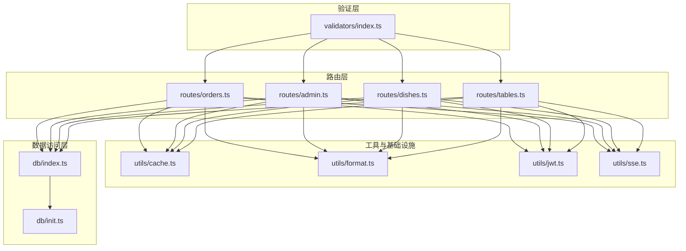
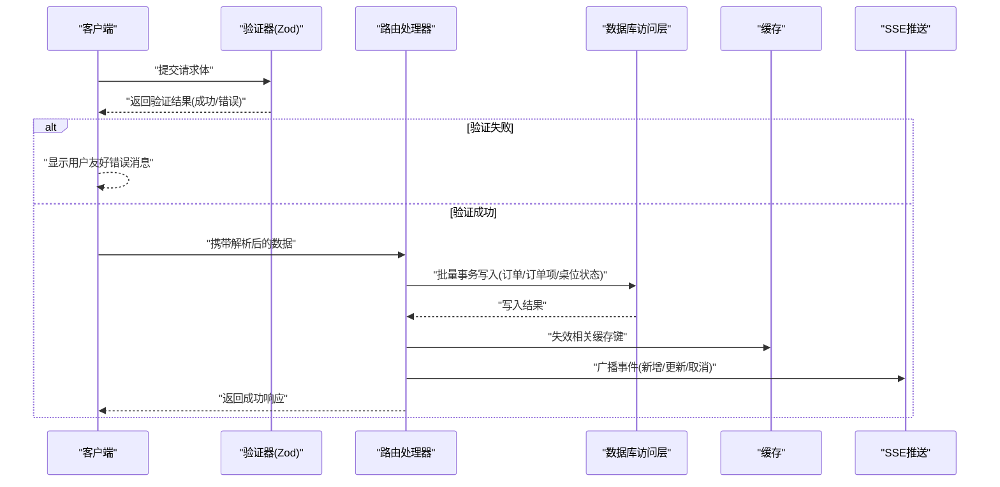
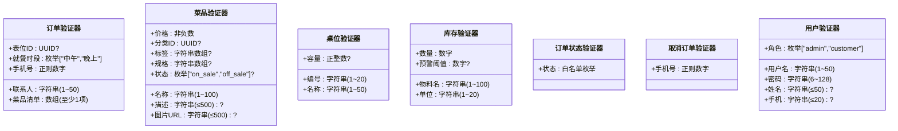
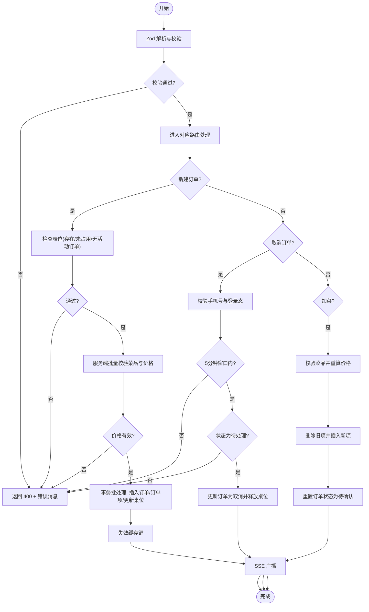
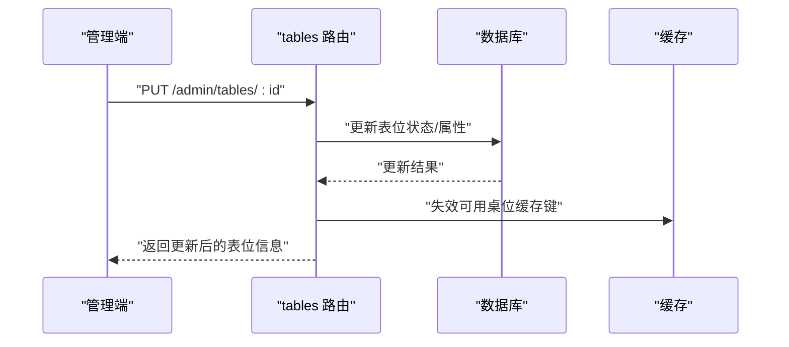
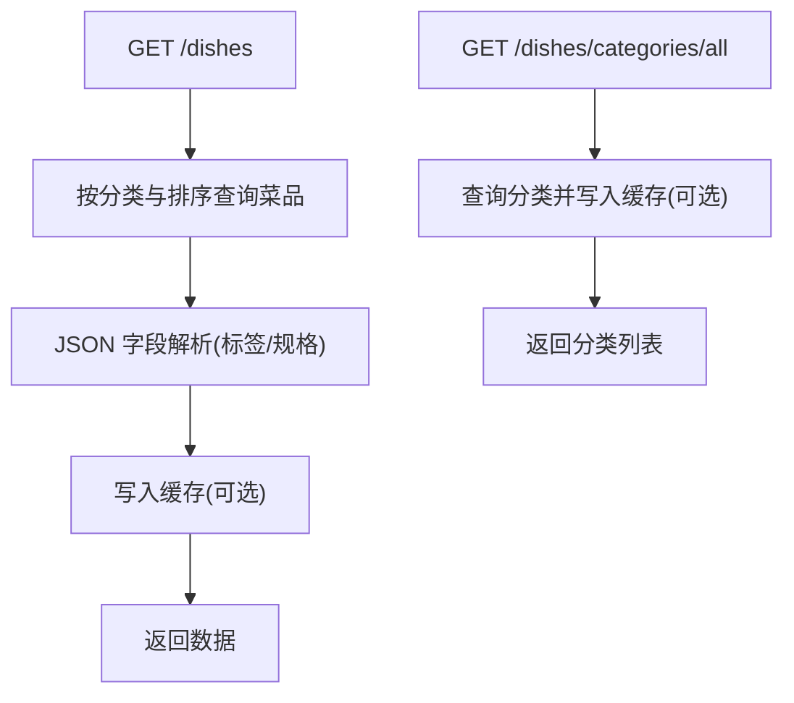
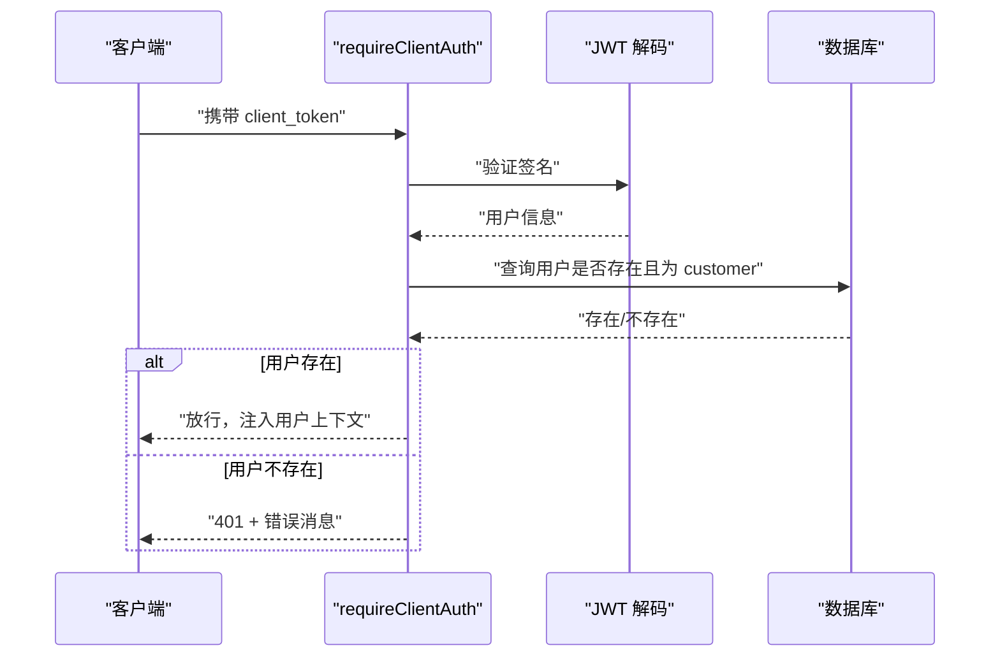
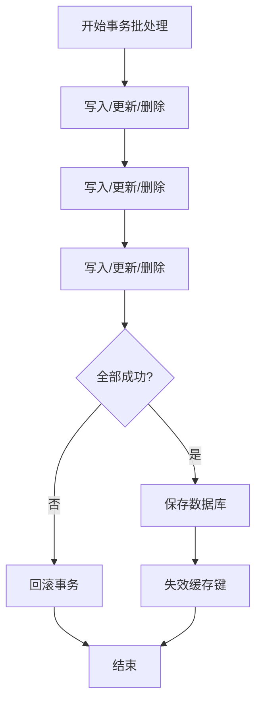
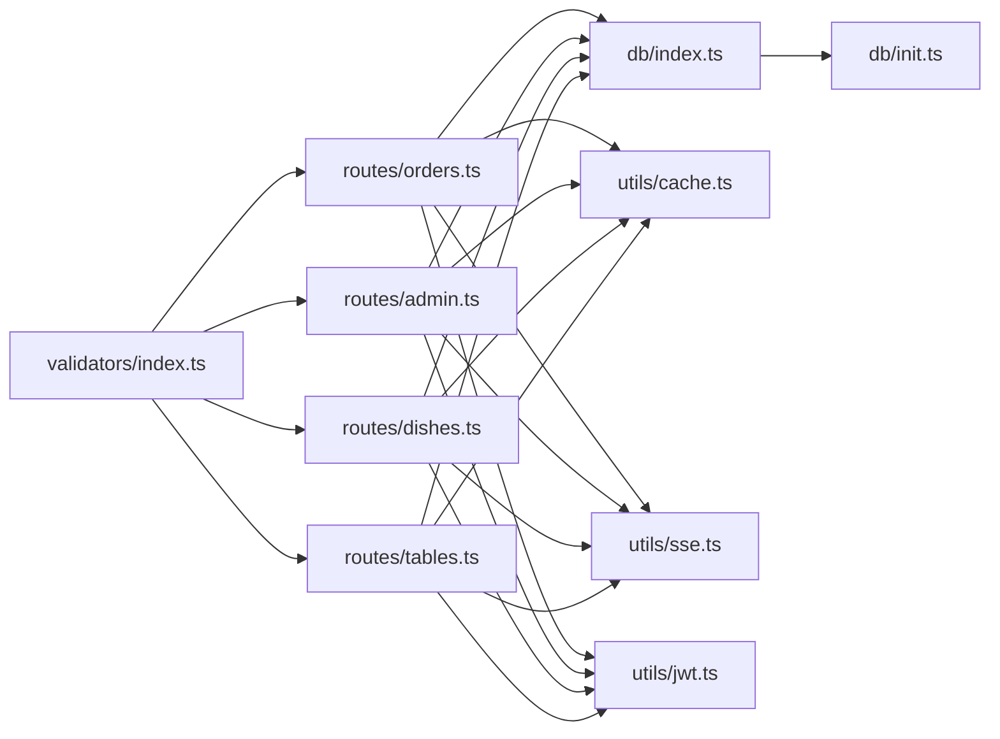
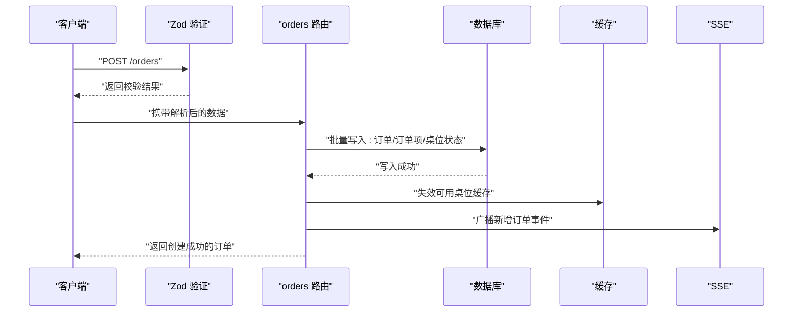

# 数据验证与业务规则

<cite>
**本文引用的文件**
- [validators/index.ts](file://server/src/validators/index.ts)
- [routes/orders.ts](file://server/src/routes/orders.ts)
- [routes/admin.ts](file://server/src/routes/admin.ts)
- [routes/dishes.ts](file://server/src/routes/dishes.ts)
- [routes/tables.ts](file://server/src/routes/tables.ts)
- [utils/cache.ts](file://server/src/utils/cache.ts)
- [utils/format.ts](file://server/src/utils/format.ts)
- [utils/jwt.ts](file://server/src/utils/jwt.ts)
- [utils/sse.ts](file://server/src/utils/sse.ts)
- [db/index.ts](file://server/src/db/index.ts)
- [db/init.ts](file://server/src/db/init.ts)
</cite>

## 目录
1. [简介](#简介)
2. [项目结构](#项目结构)
3. [核心组件](#核心组件)
4. [架构总览](#架构总览)
5. [详细组件分析](#详细组件分析)
6. [依赖关系分析](#依赖关系分析)
7. [性能考量](#性能考量)
8. [故障排查指南](#故障排查指南)
9. [结论](#结论)
10. [附录](#附录)

## 简介
本文件聚焦 RLRMS 的数据验证与业务规则，系统化阐述以下内容：
- 参数验证器的设计与实现：基于 Zod 的强类型验证方案，覆盖订单、菜品、桌位、库存、用户等实体的输入约束与错误映射。
- 自定义验证规则：正则表达式、枚举白名单、字面量确认、错误消息定制等。
- 业务规则实现：订单状态流转、桌位可用性与占用控制、菜品上架状态校验、库存数量与阈值约束、用户角色与权限控制等。
- 数据完整性与异常处理：数据库事务批处理、幂等性迁移与回填、缓存失效策略、SSE 实时推送。
- 错误处理策略与用户友好提示：统一的 400/401/403/404/500 响应结构与错误消息设计。
- 幂等性与一致性保障：初始化脚本的幂等迁移、批量写入的原子性、缓存 TTL 与失效策略。

## 项目结构
围绕“验证层 → 路由层 → 业务规则层 → 数据访问层”的分层组织，验证器集中于 validators，路由层对输入进行 Zod 校验并执行业务规则，数据访问层提供事务批处理与持久化能力。

图表来源
- [validators/index.ts:1-123](file://server/src/validators/index.ts#L1-L123)
- [routes/orders.ts:1-552](file://server/src/routes/orders.ts#L1-L552)
- [routes/admin.ts:1-1887](file://server/src/routes/admin.ts#L1-L1887)
- [routes/dishes.ts:1-216](file://server/src/routes/dishes.ts#L1-L216)
- [routes/tables.ts:1-93](file://server/src/routes/tables.ts#L1-L93)
- [utils/cache.ts:1-73](file://server/src/utils/cache.ts#L1-L73)
- [utils/format.ts:1-12](file://server/src/utils/format.ts#L1-L12)
- [utils/jwt.ts:1-27](file://server/src/utils/jwt.ts#L1-L27)
- [utils/sse.ts:1-59](file://server/src/utils/sse.ts#L1-L59)
- [db/index.ts:1-156](file://server/src/db/index.ts#L1-L156)
- [db/init.ts:1-204](file://server/src/db/init.ts#L1-L204)

章节来源
- [validators/index.ts:1-123](file://server/src/validators/index.ts#L1-L123)
- [routes/orders.ts:1-552](file://server/src/routes/orders.ts#L1-L552)
- [routes/admin.ts:1-1887](file://server/src/routes/admin.ts#L1-L1887)
- [routes/dishes.ts:1-216](file://server/src/routes/dishes.ts#L1-L216)
- [routes/tables.ts:1-93](file://server/src/routes/tables.ts#L1-L93)
- [utils/cache.ts:1-73](file://server/src/utils/cache.ts#L1-L73)
- [utils/format.ts:1-12](file://server/src/utils/format.ts#L1-L12)
- [utils/jwt.ts:1-27](file://server/src/utils/jwt.ts#L1-L27)
- [utils/sse.ts:1-59](file://server/src/utils/sse.ts#L1-L59)
- [db/index.ts:1-156](file://server/src/db/index.ts#L1-L156)
- [db/init.ts:1-204](file://server/src/db/init.ts#L1-L204)

## 核心组件
- Zod 参数验证器：集中定义在 validators/index.ts，覆盖订单、菜品、桌位、库存、用户、状态变更、重置确认、取消订单等场景。
- 路由层业务规则：在 routes/* 中对输入进行 Zod 校验后，执行业务规则（如桌位占用检查、菜品上架校验、订单状态白名单、用户权限校验等），并通过数据库事务批处理保证一致性。
- 工具与基础设施：缓存（utils/cache.ts）、时间格式化（utils/format.ts）、JWT（utils/jwt.ts）、SSE（utils/sse.ts）。
- 数据访问层：db/index.ts 提供 SQL.js 的封装，支持批量事务、延迟保存与防抖，db/init.ts 提供幂等初始化与迁移。

章节来源
- [validators/index.ts:1-123](file://server/src/validators/index.ts#L1-L123)
- [routes/orders.ts:194-353](file://server/src/routes/orders.ts#L194-L353)
- [routes/admin.ts:273-337](file://server/src/routes/admin.ts#L273-L337)
- [routes/admin.ts:795-833](file://server/src/routes/admin.ts#L795-L833)
- [utils/cache.ts:1-73](file://server/src/utils/cache.ts#L1-L73)
- [utils/format.ts:1-12](file://server/src/utils/format.ts#L1-L12)
- [utils/jwt.ts:1-27](file://server/src/utils/jwt.ts#L1-L27)
- [utils/sse.ts:1-59](file://server/src/utils/sse.ts#L1-L59)
- [db/index.ts:46-73](file://server/src/db/index.ts#L46-L73)
- [db/init.ts:167-198](file://server/src/db/init.ts#L167-L198)

## 架构总览
下图展示“客户端请求 → 验证层 → 路由层 → 业务规则 → 数据访问层 → 实时推送”的完整流程。

图表来源
- [validators/index.ts:1-123](file://server/src/validators/index.ts#L1-L123)
- [routes/orders.ts:194-353](file://server/src/routes/orders.ts#L194-L353)
- [routes/admin.ts:795-833](file://server/src/routes/admin.ts#L795-L833)
- [utils/cache.ts:41-54](file://server/src/utils/cache.ts#L41-L54)
- [utils/sse.ts:37-51](file://server/src/utils/sse.ts#L37-L51)
- [db/index.ts:46-73](file://server/src/db/index.ts#L46-L73)

## 详细组件分析

### 参数验证器设计与实现
- 设计要点
  - 使用 Zod 对输入进行强类型校验，结合最小/最大长度、数值范围、枚举白名单、UUID 校验、正则表达式等。
  - 通过 errorMap 自定义错误消息，确保用户可理解的提示。
  - 对敏感操作（如重置数据库、取消订单）要求字面量确认字段，降低误操作风险。
- 关键验证器
  - 订单创建：表位可选、就餐时段枚举、联系人与手机号必填、菜品清单最小为1、单价与小计非负。
  - 菜品增改：名称必填且长度限制、价格非负、分类可选、状态枚举仅允许 on_sale/off_sale。
  - 桌位创建：编号与名称必填、容量可选。
  - 库存增改：物料名必填、数量为数字、单位必填；更新时数量与预警阈值非负。
  - 订单状态变更：状态白名单限定，错误消息明确。
  - 取消订单：手机号正则校验，配合身份验证。
  - 用户增改：角色枚举、密码长度限制、可选字段。
- 类型推导：通过 z.infer 生成 TypeScript 类型，便于路由层类型安全使用。

图表来源
- [validators/index.ts:6-123](file://server/src/validators/index.ts#L6-L123)

章节来源
- [validators/index.ts:1-123](file://server/src/validators/index.ts#L1-L123)

### 订单状态流转与业务规则
- 状态白名单：仅允许 pending/confirmed/completed/cancelled，避免非法状态写入。
- 新建订单
  - 桌位可选：若提供表位，需检查是否存在、未被占用、且无同状态的活动订单。
  - 菜品校验：服务端批量查询菜品，核对存在性与上架状态，使用数据库价格重新计算小计，防止客户端篡改金额。
  - 批量写入：订单 + 订单项 + 桌位状态更新，使用事务批处理，失败回滚。
  - 缓存失效：若涉及桌位，失效可用桌位缓存键。
  - SSE 广播：新增订单事件。
- 取消订单
  - 身份验证：客户端登录态 + 请求体手机号与订单预留手机号一致。
  - 时间窗口：仅限创建后5分钟内可取消。
  - 状态检查：仅待处理订单可取消。
  - 桌位释放：若关联桌位，释放为可用。
  - SSE 广播：订单状态更新事件。
- 加菜（追加菜品）
  - 状态检查：仅待处理或已确认订单可加菜。
  - 服务端校验与价格重算，删除旧项并插入新项，重置订单状态为待确认。
  - SSE 广播：订单更新事件，通知管理端重新确认。

图表来源
- [routes/orders.ts:194-353](file://server/src/routes/orders.ts#L194-L353)
- [routes/orders.ts:356-418](file://server/src/routes/orders.ts#L356-L418)
- [routes/orders.ts:421-552](file://server/src/routes/orders.ts#L421-L552)
- [utils/cache.ts:41-54](file://server/src/utils/cache.ts#L41-L54)
- [utils/sse.ts:37-51](file://server/src/utils/sse.ts#L37-L51)

章节来源
- [routes/orders.ts:194-353](file://server/src/routes/orders.ts#L194-L353)
- [routes/orders.ts:356-418](file://server/src/routes/orders.ts#L356-L418)
- [routes/orders.ts:421-552](file://server/src/routes/orders.ts#L421-L552)
- [utils/cache.ts:41-54](file://server/src/utils/cache.ts#L41-L54)
- [utils/sse.ts:37-51](file://server/src/utils/sse.ts#L37-L51)

### 桌位可用性与库存管理规则
- 桌位可用性
  - 可用列表：status=available。
  - 指定就餐时段可用：status=available 或 status=reserved 且该桌位当前无同时段活动订单。
  - 缓存：TTL 5 秒，减少查询压力。
  - 管理端：支持按状态批量更新与删除，删除前检查是否存在未完成订单。
- 库存管理
  - 新增：物料名唯一、数量为数字、单位必填；可选预警阈值。
  - 更新：数量与预警阈值非负；支持排序重排。
  - 删除：直接删除，不涉及外键约束检查。

图表来源
- [routes/tables.ts:24-55](file://server/src/routes/tables.ts#L24-L55)
- [routes/tables.ts:238-271](file://server/src/routes/tables.ts#L238-L271)
- [routes/tables.ts:308-337](file://server/src/routes/tables.ts#L308-L337)
- [utils/cache.ts:41-54](file://server/src/utils/cache.ts#L41-L54)

章节来源
- [routes/tables.ts:24-55](file://server/src/routes/tables.ts#L24-L55)
- [routes/tables.ts:238-271](file://server/src/routes/tables.ts#L238-L271)
- [routes/tables.ts:308-337](file://server/src/routes/tables.ts#L308-L337)
- [utils/cache.ts:41-54](file://server/src/utils/cache.ts#L41-L54)

### 菜品与分类管理规则
- 菜品列表与首页数据：按分类排序与菜品排序，支持 JSON 字段解析（标签、规格）。
- 分类管理：保留“其他”为系统保留名称；删除前检查是否仍有菜品关联。
- 缓存策略：菜品列表、首页数据、分类均使用缓存，变更后失效相应键。

图表来源
- [routes/dishes.ts:24-65](file://server/src/routes/dishes.ts#L24-L65)
- [routes/dishes.ts:159-174](file://server/src/routes/dishes.ts#L159-L174)
- [utils/cache.ts:41-54](file://server/src/utils/cache.ts#L41-L54)

章节来源
- [routes/dishes.ts:24-65](file://server/src/routes/dishes.ts#L24-L65)
- [routes/dishes.ts:159-174](file://server/src/routes/dishes.ts#L159-L174)
- [utils/cache.ts:41-54](file://server/src/utils/cache.ts#L41-L54)

### 用户权限控制与认证
- 客户端认证中间件：校验 client_token，确认用户仍存在于数据库，注入用户上下文。
- 管理端认证中间件：校验 admin_token，仅 admin 角色可访问。
- 用户管理：创建/更新/删除用户，禁止删除主管理员与当前登录用户，禁止删除最后一个管理员账户。

图表来源
- [routes/orders.ts:24-49](file://server/src/routes/orders.ts#L24-L49)
- [utils/jwt.ts:1-27](file://server/src/utils/jwt.ts#L1-L27)

章节来源
- [routes/orders.ts:24-49](file://server/src/routes/orders.ts#L24-L49)
- [utils/jwt.ts:1-27](file://server/src/utils/jwt.ts#L1-L27)

### 数据完整性检查与异常处理
- 事务批处理：beginBatch/endBatch 包裹多条写入，失败回滚，保证原子性。
- 幂等性设计
  - 初始化脚本：创建表与索引、默认设置、默认管理员、幂等迁移（会员号、历史订单 user_id 回填）。
  - 迁移与回填：通过条件判断避免重复执行。
- 缓存一致性：写入后主动失效相关缓存键，避免脏读。
- 异常处理：统一捕获错误，记录日志，返回结构化错误响应。

图表来源
- [db/index.ts:46-73](file://server/src/db/index.ts#L46-L73)
- [db/init.ts:167-198](file://server/src/db/init.ts#L167-L198)

章节来源
- [db/index.ts:46-73](file://server/src/db/index.ts#L46-L73)
- [db/init.ts:167-198](file://server/src/db/init.ts#L167-L198)

### 验证错误处理策略与用户友好提示
- 输入错误：Zod 校验失败返回 400，优先使用 errorMap 中的自定义消息。
- 身份与权限：401 未登录/过期、403 权限不足。
- 资源不存在：404。
- 业务规则错误：如桌位占用、超时取消、状态不允许等，返回明确的业务提示。
- 统一响应结构：success/error/message/data 字段，便于前端处理。

章节来源
- [routes/orders.ts:196-203](file://server/src/routes/orders.ts#L196-L203)
- [routes/orders.ts:360-367](file://server/src/routes/orders.ts#L360-L367)
- [routes/admin.ts:276-282](file://server/src/routes/admin.ts#L276-L282)
- [routes/admin.ts:799-806](file://server/src/routes/admin.ts#L799-L806)

### 幂等性设计与数据一致性保证
- 初始化幂等：创建表、索引、默认设置、默认管理员，迁移与回填仅在满足条件时执行。
- 批量写入原子性：事务批处理，失败回滚。
- 缓存 TTL 与失效：短 TTL 降低陈旧概率，写入后主动失效。
- SSE 广播：实时通知管理端，保持界面与数据一致。

章节来源
- [db/init.ts:167-198](file://server/src/db/init.ts#L167-L198)
- [db/index.ts:46-73](file://server/src/db/index.ts#L46-L73)
- [utils/cache.ts:13-13](file://server/src/utils/cache.ts#L13-L13)
- [utils/sse.ts:37-51](file://server/src/utils/sse.ts#L37-L51)

## 依赖关系分析
- 验证器依赖：各路由模块引入 validators/index.ts 中的 schema，实现输入约束。
- 路由依赖：路由依赖 db/index.ts 进行数据读写，依赖 utils/cache.ts 进行缓存管理，依赖 utils/sse.ts 进行实时推送。
- JWT 与认证：客户端与管理端分别使用不同的中间件与密钥来源。
- 数据模型：db/init.ts 定义了表结构与索引，支撑订单、菜品、桌位、库存、用户、设置等实体。

图表来源
- [validators/index.ts:1-123](file://server/src/validators/index.ts#L1-L123)
- [routes/orders.ts:1-10](file://server/src/routes/orders.ts#L1-L10)
- [routes/admin.ts:1-17](file://server/src/routes/admin.ts#L1-L17)
- [routes/dishes.ts:1-5](file://server/src/routes/dishes.ts#L1-L5)
- [routes/tables.ts:1-5](file://server/src/routes/tables.ts#L1-L5)
- [utils/cache.ts:1-73](file://server/src/utils/cache.ts#L1-L73)
- [utils/sse.ts:1-59](file://server/src/utils/sse.ts#L1-L59)
- [utils/jwt.ts:1-27](file://server/src/utils/jwt.ts#L1-L27)
- [db/index.ts:1-156](file://server/src/db/index.ts#L1-L156)
- [db/init.ts:1-204](file://server/src/db/init.ts#L1-L204)

章节来源
- [validators/index.ts:1-123](file://server/src/validators/index.ts#L1-L123)
- [routes/orders.ts:1-10](file://server/src/routes/orders.ts#L1-L10)
- [routes/admin.ts:1-17](file://server/src/routes/admin.ts#L1-L17)
- [routes/dishes.ts:1-5](file://server/src/routes/dishes.ts#L1-L5)
- [routes/tables.ts:1-5](file://server/src/routes/tables.ts#L1-L5)
- [utils/cache.ts:1-73](file://server/src/utils/cache.ts#L1-L73)
- [utils/sse.ts:1-59](file://server/src/utils/sse.ts#L1-L59)
- [utils/jwt.ts:1-27](file://server/src/utils/jwt.ts#L1-L27)
- [db/index.ts:1-156](file://server/src/db/index.ts#L1-L156)
- [db/init.ts:1-204](file://server/src/db/init.ts#L1-L204)

## 性能考量
- 批量查询与 N+1 避免：订单详情批量查询订单项，按订单 ID 分组，减少多次查询。
- 缓存策略：菜品列表、首页数据、分类、可用桌位设置 TTL，显著降低数据库压力。
- 事务批处理：合并多次写入为单次事务，减少磁盘写入次数与锁竞争。
- 防抖保存：数据库写入采用防抖策略，合并短时间内多次写入，提高吞吐量。

章节来源
- [routes/orders.ts:96-130](file://server/src/routes/orders.ts#L96-L130)
- [utils/cache.ts:13-13](file://server/src/utils/cache.ts#L13-L13)
- [db/index.ts:37-44](file://server/src/db/index.ts#L37-L44)

## 故障排查指南
- 验证失败
  - 检查请求体是否符合 Zod schema，关注错误消息中的具体字段。
  - 对照 validators/index.ts 中的约束与错误映射。
- 订单相关问题
  - 新建订单：确认表位是否存在、未被占用、无活动订单；菜品是否上架；金额是否由服务端重算。
  - 取消订单：确认手机号与登录态、是否在 5 分钟窗口内、状态是否为待处理。
  - 加菜：确认订单状态为待处理或已确认。
- 桌位与库存
  - 删除桌位前检查是否存在未完成订单；库存更新数量与阈值需非负。
- 缓存问题
  - 修改数据后是否调用 cacheInvalidate；TTL 是否过短导致频繁刷新。
- 实时推送
  - SSE 客户端是否存活；广播事件是否正确触发。

章节来源
- [validators/index.ts:1-123](file://server/src/validators/index.ts#L1-L123)
- [routes/orders.ts:207-236](file://server/src/routes/orders.ts#L207-L236)
- [routes/orders.ts:375-400](file://server/src/routes/orders.ts#L375-L400)
- [routes/orders.ts:445-451](file://server/src/routes/orders.ts#L445-L451)
- [routes/tables.ts:321-329](file://server/src/routes/tables.ts#L321-L329)
- [utils/cache.ts:41-54](file://server/src/utils/cache.ts#L41-L54)
- [utils/sse.ts:37-51](file://server/src/utils/sse.ts#L37-L51)

## 结论
本项目通过 Zod 参数验证器实现了严格的输入约束与用户友好错误提示；在路由层落实业务规则，结合事务批处理与缓存策略，确保数据一致性与性能；借助 JWT 与 SSE，实现权限控制与实时交互。初始化脚本的幂等设计进一步提升了部署与迁移的可靠性。整体架构清晰、职责分明，具备良好的扩展性与维护性。

## 附录
- 关键流程时序图（订单创建）

图表来源
- [routes/orders.ts:194-353](file://server/src/routes/orders.ts#L194-L353)
- [utils/cache.ts:41-54](file://server/src/utils/cache.ts#L41-L54)
- [utils/sse.ts:37-51](file://server/src/utils/sse.ts#L37-L51)