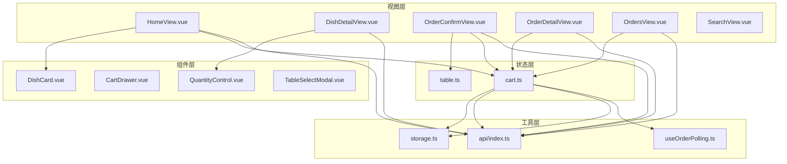
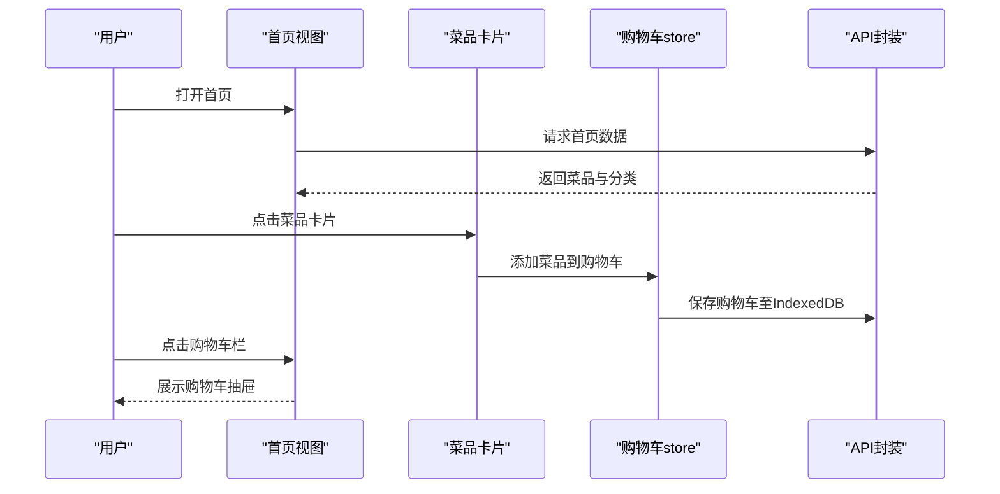
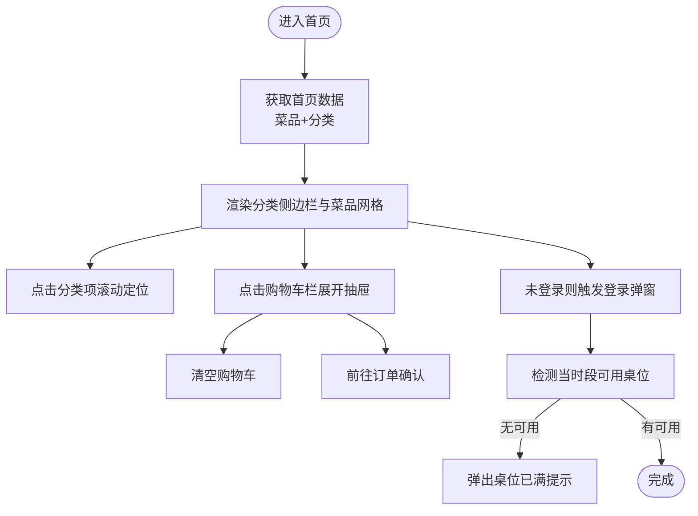
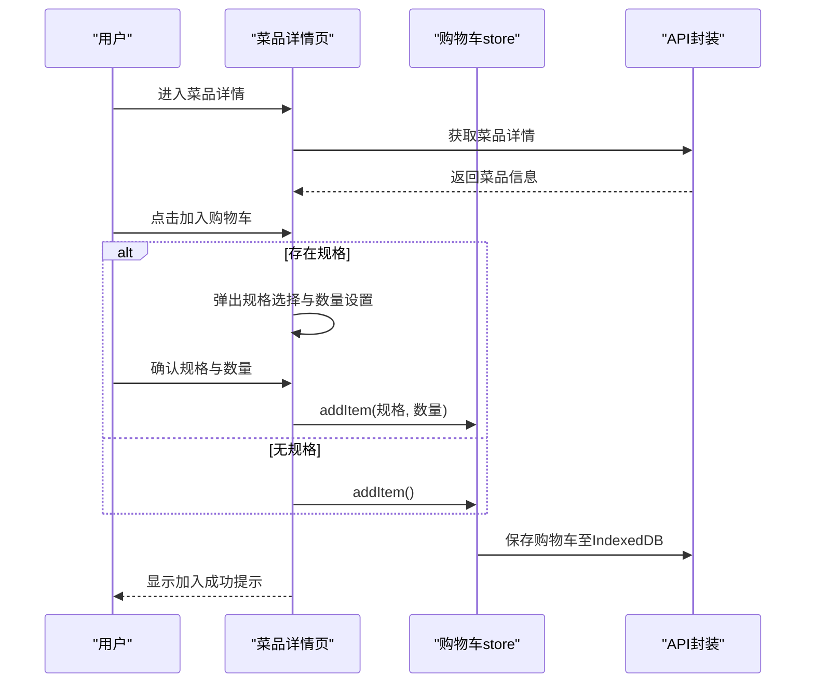
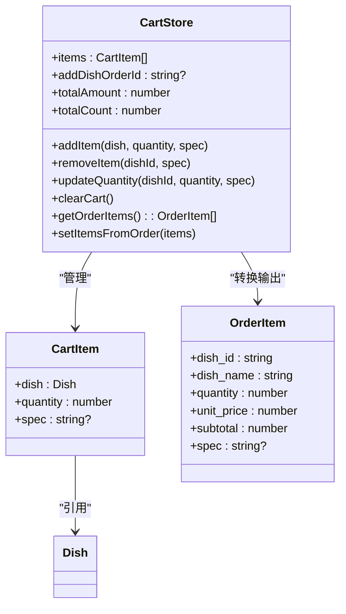
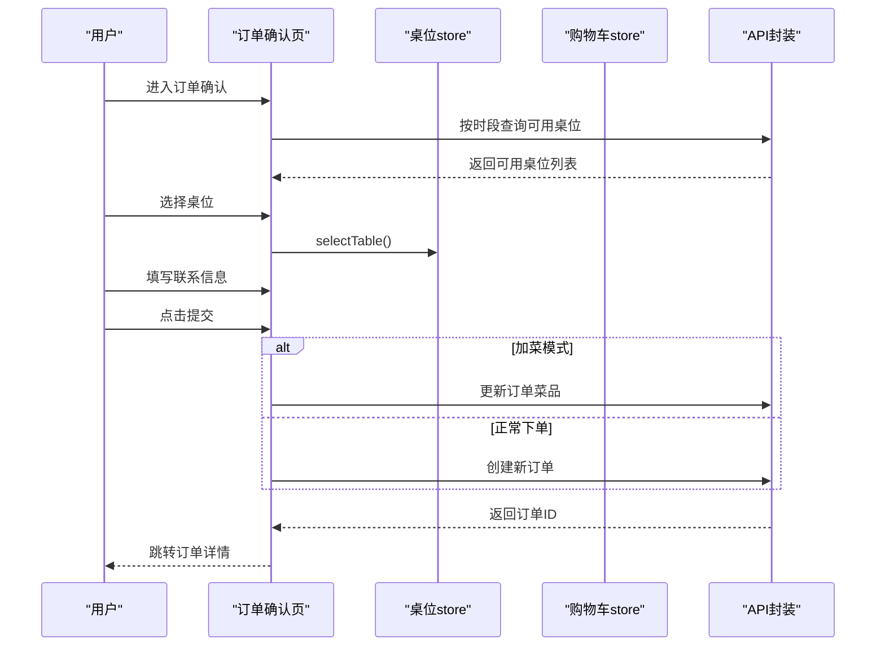
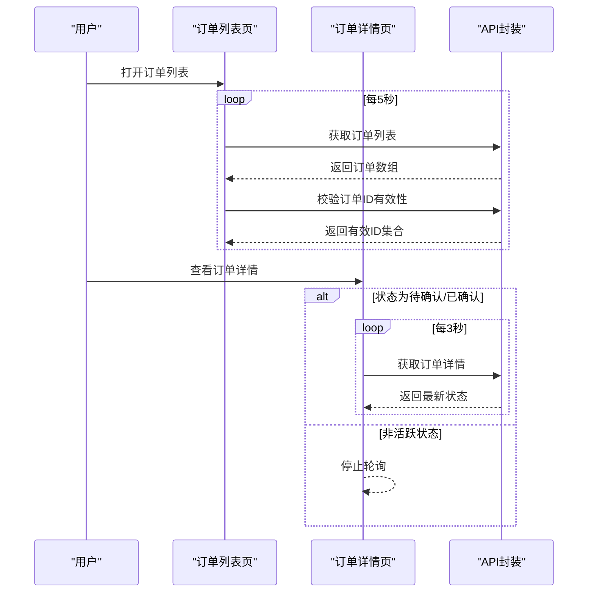
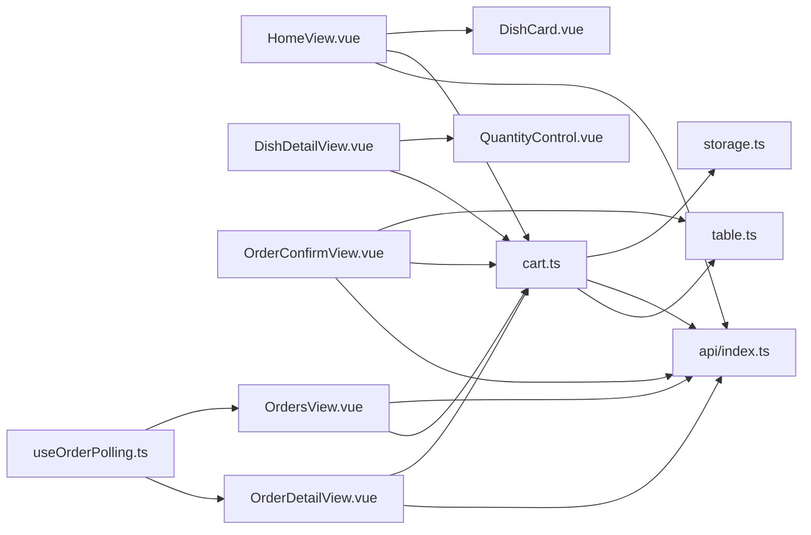

# 客户功能模块

<cite>
**本文档引用的文件**
- [HomeView.vue](file://src/client/views/HomeView.vue)
- [DishDetailView.vue](file://src/client/views/DishDetailView.vue)
- [CartDrawer.vue](file://src/client/components/CartDrawer.vue)
- [OrderConfirmView.vue](file://src/client/views/OrderConfirmView.vue)
- [OrdersView.vue](file://src/client/views/OrdersView.vue)
- [OrderDetailView.vue](file://src/client/views/OrderDetailView.vue)
- [OrderQRCodeView.vue](file://src/client/views/OrderQRCodeView.vue)
- [DishCard.vue](file://src/client/components/DishCard.vue)
- [TableSelectModal.vue](file://src/client/components/TableSelectModal.vue)
- [SearchView.vue](file://src/client/views/SearchView.vue)
- [QuantityControl.vue](file://src/shared/components/QuantityControl.vue)
- [cart.ts](file://src/stores/cart.ts)
- [table.ts](file://src/stores/table.ts)
- [useOrderPolling.ts](file://src/shared/composables/useOrderPolling.ts)
- [api/index.ts](file://src/api/index.ts)
- [types/index.ts](file://src/types/index.ts)
- [storage.ts](file://src/utils/storage.ts)
</cite>

## 目录
1. [引言](#引言)
2. [项目结构](#项目结构)
3. [核心组件](#核心组件)
4. [架构总览](#架构总览)
5. [详细组件分析](#详细组件分析)
6. [依赖关系分析](#依赖关系分析)
7. [性能考量](#性能考量)
8. [故障排除指南](#故障排除指南)
9. [结论](#结论)
10. [附录](#附录)

## 引言
本文件面向RLRMS客户自助点餐系统，提供从首页浏览到订单跟踪的全流程功能文档。内容涵盖用户交互流程、数据处理机制、状态管理与界面设计，并重点解析购物车的状态管理、数量控制与价格计算逻辑；同时说明桌位选择机制、订单提交流程与支付处理过程，以及用户体验设计、响应式布局适配与性能优化策略，最后给出开发者扩展与定制化建议。

## 项目结构
客户端采用Vue 3 + Vite构建，前端路由基于vue-router，状态管理使用Pinia，组件按功能分层组织：
- 视图层：client/views 下的页面组件（首页、菜品详情、订单确认、订单列表、订单详情等）
- 组件层：client/components 与 shared/components 下的可复用UI组件（菜品卡片、数量控制器、模态框等）
- 状态层：stores 下的Pinia store（购物车、桌位、应用状态等）
- 工具层：utils 下的本地存储封装（IndexedDB）
- 类型层：types 下的TS类型定义
- API层：api/index.ts 封装HTTP请求与缓存策略

**图表来源**
- [HomeView.vue:1-867](file://src/client/views/HomeView.vue#L1-L867)
- [DishDetailView.vue:1-428](file://src/client/views/DishDetailView.vue#L1-L428)
- [OrderConfirmView.vue:1-981](file://src/client/views/OrderConfirmView.vue#L1-L981)
- [OrderDetailView.vue:1-670](file://src/client/views/OrderDetailView.vue#L1-L670)
- [OrdersView.vue:1-290](file://src/client/views/OrdersView.vue#L1-L290)
- [DishCard.vue:1-372](file://src/client/components/DishCard.vue#L1-L372)
- [CartDrawer.vue:1-314](file://src/client/components/CartDrawer.vue#L1-L314)
- [QuantityControl.vue:1-212](file://src/shared/components/QuantityControl.vue#L1-L212)
- [TableSelectModal.vue:1-231](file://src/client/components/TableSelectModal.vue#L1-L231)
- [cart.ts:1-175](file://src/stores/cart.ts#L1-L175)
- [table.ts:1-25](file://src/stores/table.ts#L1-L25)
- [api/index.ts:1-608](file://src/api/index.ts#L1-L608)
- [storage.ts:1-109](file://src/utils/storage.ts#L1-L109)
- [useOrderPolling.ts:1-74](file://src/shared/composables/useOrderPolling.ts#L1-L74)

**章节来源**
- [HomeView.vue:1-867](file://src/client/views/HomeView.vue#L1-L867)
- [api/index.ts:1-608](file://src/api/index.ts#L1-L608)

## 核心组件
- 购物车store（cart.ts）：负责购物车数据持久化（IndexedDB）、数量与价格计算、加菜场景的订单ID关联
- 桌位store（table.ts）：维护当前选中的桌位及“是否已选中”的状态
- 数量控制器（QuantityControl.vue）：统一的数量增减控件，支持动画反馈
- 菜品卡片（DishCard.vue）：首页与搜索页的菜品展示与加入购物车入口
- 订单轮询组合式函数（useOrderPolling.ts）：通用轮询逻辑，用于订单状态实时更新
- API封装（api/index.ts）：统一请求、超时、401处理、缓存策略与错误包装

**章节来源**
- [cart.ts:1-175](file://src/stores/cart.ts#L1-L175)
- [table.ts:1-25](file://src/stores/table.ts#L1-L25)
- [QuantityControl.vue:1-212](file://src/shared/components/QuantityControl.vue#L1-L212)
- [DishCard.vue:1-372](file://src/client/components/DishCard.vue#L1-L372)
- [useOrderPolling.ts:1-74](file://src/shared/composables/useOrderPolling.ts#L1-L74)
- [api/index.ts:1-608](file://src/api/index.ts#L1-L608)

## 架构总览
系统采用“视图-组件-状态-工具-API”分层架构，数据流自上而下：
- 用户在视图层进行操作（浏览菜品、选择规格、修改数量、提交订单）
- 组件通过Pinia store读写状态，必要时调用API
- API层统一处理网络请求、缓存与错误
- 本地存储（IndexedDB）保障购物车跨会话持久化

**图表来源**
- [HomeView.vue:68-89](file://src/client/views/HomeView.vue#L68-L89)
- [DishCard.vue:49-63](file://src/client/components/DishCard.vue#L49-L63)
- [cart.ts:112-121](file://src/stores/cart.ts#L112-L121)
- [api/index.ts:128-148](file://src/api/index.ts#L128-L148)

## 详细组件分析

### 首页浏览与分类导航
- 数据加载：首页通过API一次性获取菜品与分类，使用内存缓存（stale-while-revalidate）提升首屏性能
- 分类侧边栏：根据实际存在的菜品动态显示可见分类，支持平滑滚动定位
- 菜品网格：懒加载图片、标签展示、数量控制器集成
- 购物车抽屉：底部悬浮栏，支持展开/收起、清空、数量调整与删除
- 登录与桌位提示：首次进入需登录，随后检测当时段可用桌位，若无则弹窗提示

**图表来源**
- [HomeView.vue:68-210](file://src/client/views/HomeView.vue#L68-L210)
- [api/index.ts:128-148](file://src/api/index.ts#L128-L148)

**章节来源**
- [HomeView.vue:1-867](file://src/client/views/HomeView.vue#L1-L867)
- [DishCard.vue:1-372](file://src/client/components/DishCard.vue#L1-L372)
- [CartDrawer.vue:1-314](file://src/client/components/CartDrawer.vue#L1-L314)

### 菜品详情查看与规格选择
- 规格与数量：若菜品存在规格，点击“加入购物车”弹出规格选择与数量设置；否则直接加入
- 数量联动：详情页与卡片内数量控件均通过store同步，支持增减与直接输入
- 已购数量：详情页顶部显示当前菜品在购物车中的累计数量

**图表来源**
- [DishDetailView.vue:38-95](file://src/client/views/DishDetailView.vue#L38-L95)
- [DishCard.vue:49-84](file://src/client/components/DishCard.vue#L49-L84)
- [cart.ts:112-121](file://src/stores/cart.ts#L112-L121)

**章节来源**
- [DishDetailView.vue:1-428](file://src/client/views/DishDetailView.vue#L1-L428)
- [DishCard.vue:1-372](file://src/client/components/DishCard.vue#L1-L372)

### 购物车管理与状态
- 状态管理：购物车store以结构化克隆剥离响应式代理后持久化到IndexedDB，避免序列化问题
- 数量控制：通过QuantityControl统一增减，支持最小值0（自动删除该项）
- 价格计算：totalAmount基于单价×数量累加，totalCount为数量总和
- 加菜场景：支持从订单详情将订单项还原到购物车并绑定对应订单ID，便于后续更新

**图表来源**
- [cart.ts:9-175](file://src/stores/cart.ts#L9-L175)
- [types/index.ts:110-115](file://src/types/index.ts#L110-L115)
- [types/index.ts:71-80](file://src/types/index.ts#L71-L80)

**章节来源**
- [cart.ts:1-175](file://src/stores/cart.ts#L1-L175)
- [QuantityControl.vue:1-212](file://src/shared/components/QuantityControl.vue#L1-L212)
- [storage.ts:1-109](file://src/utils/storage.ts#L1-L109)

### 订单确认与桌位选择
- 桌位选择：支持按就餐时段查询可用桌位，分页展示，支持翻页与选中状态
- 联动逻辑：切换时段会清空当前选中并重新拉取可用桌位
- 联系方式：自动填充已登录用户的手机号，联系人名称支持本地存储持久化
- 提交流程：支持“加菜模式”（针对已有订单追加菜品）与“正常下单模式”，提交后进入进度动画并跳转订单详情

**图表来源**
- [OrderConfirmView.vue:69-126](file://src/client/views/OrderConfirmView.vue#L69-L126)
- [OrderConfirmView.vue:177-231](file://src/client/views/OrderConfirmView.vue#L177-L231)
- [table.ts:5-24](file://src/stores/table.ts#L5-L24)
- [cart.ts:77-87](file://src/stores/cart.ts#L77-L87)

**章节来源**
- [OrderConfirmView.vue:1-981](file://src/client/views/OrderConfirmView.vue#L1-L981)
- [TableSelectModal.vue:1-231](file://src/client/components/TableSelectModal.vue#L1-L231)
- [table.ts:1-25](file://src/stores/table.ts#L1-L25)

### 订单跟踪与状态轮询
- 列表轮询：订单列表页每5秒轮询一次，支持页面隐藏时暂停轮询
- 详情轮询：订单详情页对“待确认/已确认”状态每3秒轮询一次，支持页面隐藏时暂停
- 幽灵订单处理：列表页通过二次校验接口过滤无效订单ID，保证数据一致性
- 取消与加菜：支持5分钟内取消（需手机号验证），支持从订单详情进入“加菜模式”

**图表来源**
- [OrdersView.vue:33-127](file://src/client/views/OrdersView.vue#L33-L127)
- [OrderDetailView.vue:97-149](file://src/client/views/OrderDetailView.vue#L97-L149)
- [useOrderPolling.ts:19-65](file://src/shared/composables/useOrderPolling.ts#L19-L65)

**章节来源**
- [OrdersView.vue:1-290](file://src/client/views/OrdersView.vue#L1-L290)
- [OrderDetailView.vue:1-670](file://src/client/views/OrderDetailView.vue#L1-L670)
- [useOrderPolling.ts:1-74](file://src/shared/composables/useOrderPolling.ts#L1-L74)

### 搜索与历史
- 搜索历史：本地存储最近10条搜索词，支持一键清空与逐条移除
- 搜索结果：输入回车或点击搜索发起API请求，结果以网格形式展示

**章节来源**
- [SearchView.vue:1-359](file://src/client/views/SearchView.vue#L1-L359)

## 依赖关系分析
- 视图组件依赖：各页面视图依赖API封装与Pinia store；菜品卡片依赖数量控制器
- 状态依赖：购物车store依赖table store（加菜场景需要订单ID）；订单详情依赖购物车store进行“加菜”
- 工具依赖：购物车store依赖本地存储工具；订单轮询组合式函数被多个视图复用

**图表来源**
- [HomeView.vue:1-867](file://src/client/views/HomeView.vue#L1-L867)
- [DishDetailView.vue:1-428](file://src/client/views/DishDetailView.vue#L1-L428)
- [OrderConfirmView.vue:1-981](file://src/client/views/OrderConfirmView.vue#L1-L981)
- [OrderDetailView.vue:1-670](file://src/client/views/OrderDetailView.vue#L1-L670)
- [OrdersView.vue:1-290](file://src/client/views/OrdersView.vue#L1-L290)
- [DishCard.vue:1-372](file://src/client/components/DishCard.vue#L1-L372)
- [CartDrawer.vue:1-314](file://src/client/components/CartDrawer.vue#L1-L314)
- [QuantityControl.vue:1-212](file://src/shared/components/QuantityControl.vue#L1-L212)
- [TableSelectModal.vue:1-231](file://src/client/components/TableSelectModal.vue#L1-L231)
- [cart.ts:1-175](file://src/stores/cart.ts#L1-L175)
- [table.ts:1-25](file://src/stores/table.ts#L1-L25)
- [api/index.ts:1-608](file://src/api/index.ts#L1-L608)
- [storage.ts:1-109](file://src/utils/storage.ts#L1-L109)
- [useOrderPolling.ts:1-74](file://src/shared/composables/useOrderPolling.ts#L1-L74)

**章节来源**
- [types/index.ts:1-133](file://src/types/index.ts#L1-L133)

## 性能考量
- 首屏性能：首页数据采用内存缓存（stale-while-revalidate），减少重复请求
- 图片优化：菜品卡片使用懒加载与占位符，降低首屏阻塞
- 动画与交互：数量控制器与抽屉动画采用CSS过渡，避免JS动画卡顿
- 轮询策略：订单列表与详情分别采用不同轮询间隔，页面隐藏时自动暂停，节省资源
- 本地持久化：购物车与搜索历史使用IndexedDB，避免频繁网络请求

**章节来源**
- [api/index.ts:9-34](file://src/api/index.ts#L9-L34)
- [DishCard.vue:195-266](file://src/client/components/DishCard.vue#L195-L266)
- [OrdersView.vue:88-136](file://src/client/views/OrdersView.vue#L88-L136)
- [OrderDetailView.vue:97-149](file://src/client/views/OrderDetailView.vue#L97-L149)
- [storage.ts:11-40](file://src/utils/storage.ts#L11-L40)

## 故障排除指南
- 登录失效：API层拦截401并触发全局事件，引导重新登录
- 网络异常：统一的ApiError包装，捕获并提示错误；超时控制与信号合并避免悬挂请求
- 购物车异常：IndexedDB初始化失败时静默忽略，购物车仍可通过内存状态工作
- 订单不存在：订单详情页对404做专门处理，显示“订单不存在”并提供返回首页按钮
- 轮询异常：轮询函数内部try/catch，避免异常中断轮询循环

**章节来源**
- [api/index.ts:36-114](file://src/api/index.ts#L36-L114)
- [OrderDetailView.vue:84-95](file://src/client/views/OrderDetailView.vue#L84-L95)
- [cart.ts:133-150](file://src/stores/cart.ts#L133-L150)
- [useOrderPolling.ts:22-30](file://src/shared/composables/useOrderPolling.ts#L22-L30)

## 结论
RLRMS客户功能模块围绕“高效浏览—便捷下单—实时跟踪”形成闭环，通过Pinia状态管理与IndexedDB持久化保障用户体验，配合API缓存与轮询策略实现性能与实时性的平衡。模块化组件与清晰的职责划分便于后续扩展与定制化开发。

## 附录
- 开发者扩展建议
  - 新增菜品规格：在菜品模型中扩展specs字段，组件层自动适配规格选择弹窗
  - 自定义轮询：使用useOrderPolling组合式函数，传入自定义间隔与shouldPoll条件
  - 支付集成：在订单确认页handleSubmit前接入支付网关回调，完成后清理购物车并跳转支付结果页
  - 主题与布局：通过CSS变量与媒体查询适配移动端与桌面端，保持一致交互体验