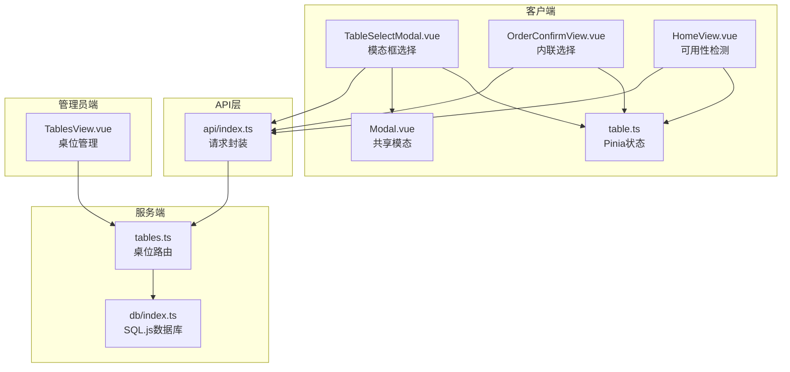
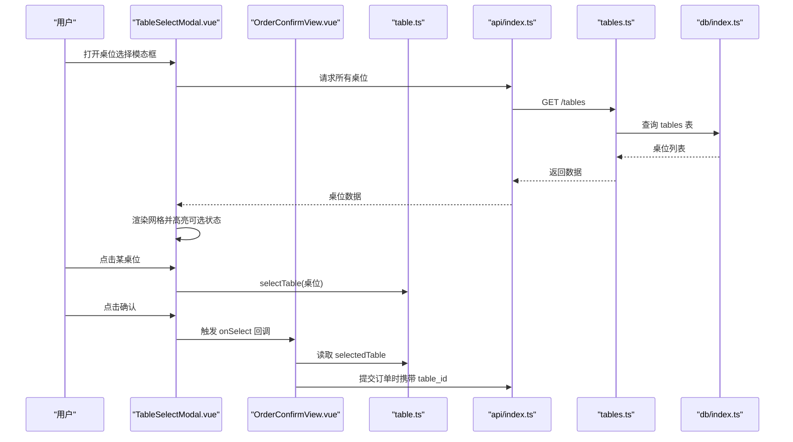
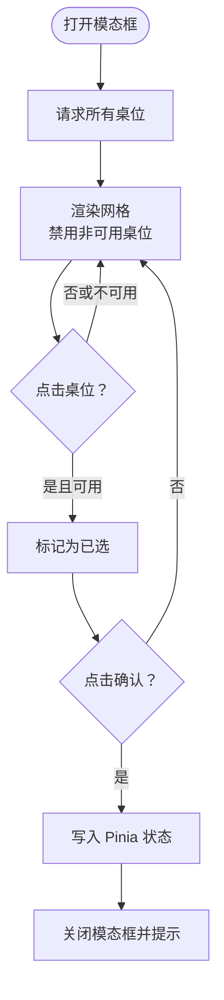
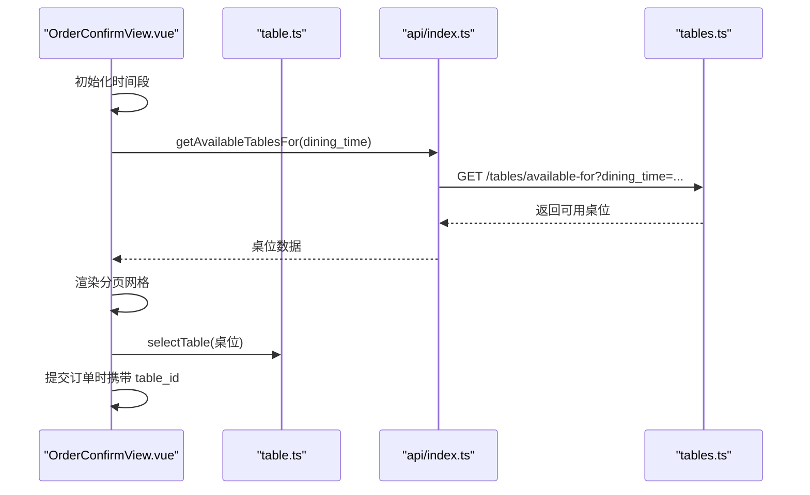
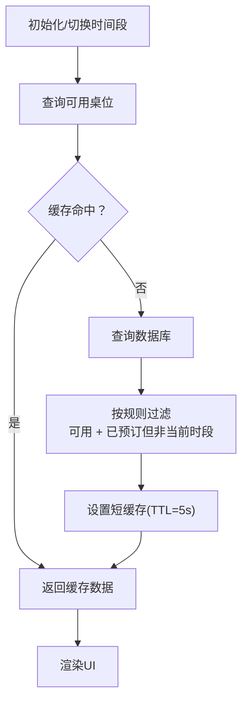
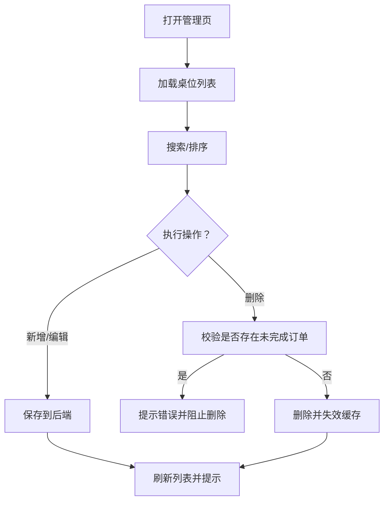
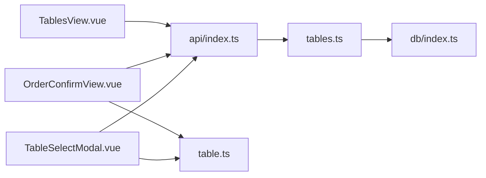

# 桌位选择

<cite>
**本文引用的文件**
- [TableSelectModal.vue](file://src/client/components/TableSelectModal.vue)
- [table.ts](file://src/stores/table.ts)
- [tables.ts](file://server/src/routes/tables.ts)
- [TablesView.vue](file://src/admin/views/TablesView.vue)
- [index.ts](file://src/types/index.ts)
- [index.ts](file://src/api/index.ts)
- [index.ts](file://server/src/db/index.ts)
- [Modal.vue](file://src/shared/components/Modal.vue)
- [HomeView.vue](file://src/client/views/HomeView.vue)
- [OrderConfirmView.vue](file://src/client/views/OrderConfirmView.vue)
</cite>

## 目录
1. [简介](#简介)
2. [项目结构](#项目结构)
3. [核心组件](#核心组件)
4. [架构总览](#架构总览)
5. [详细组件分析](#详细组件分析)
6. [依赖关系分析](#依赖关系分析)
7. [性能考量](#性能考量)
8. [故障排查指南](#故障排查指南)
9. [结论](#结论)
10. [附录](#附录)

## 简介
本文件面向RLRMS的“桌位选择”功能，围绕客户端模态框与内联选择两种交互方式，系统阐述其设计与实现要点，包括：
- 桌位列表展示与可用性检查
- 桌位状态管理与实时更新
- 时间段区分（中午/晚上）与冲突避免策略
- 业务逻辑（分配算法、预订状态管理、座位布局可视化）
- 用户体验设计（视觉反馈、操作引导、错误提示、撤销机制）
- 数据模型与状态同步策略
- 性能优化与扩展建议

## 项目结构
桌位选择涉及前端组件、Pinia状态、API封装、后端路由与数据库层，以及管理员端桌位管理界面。关键文件如下：
- 客户端模态框：src/client/components/TableSelectModal.vue
- 内联选择：src/client/views/OrderConfirmView.vue
- 桌位状态存储：src/stores/table.ts
- 类型定义：src/types/index.ts
- API封装：src/api/index.ts
- 后端路由：server/src/routes/tables.ts
- 管理员桌位管理：src/admin/views/TablesView.vue
- 共享模态组件：src/shared/components/Modal.vue
- 首页自动检测可用性：src/client/views/HomeView.vue
- 数据库抽象：server/src/db/index.ts

图表来源
- [TableSelectModal.vue:1-231](file://src/client/components/TableSelectModal.vue#L1-L231)
- [OrderConfirmView.vue:1-200](file://src/client/views/OrderConfirmView.vue#L1-L200)
- [table.ts:1-25](file://src/stores/table.ts#L1-L25)
- [Modal.vue:1-189](file://src/shared/components/Modal.vue#L1-L189)
- [HomeView.vue:232-245](file://src/client/views/HomeView.vue#L232-L245)
- [index.ts:173-184](file://src/api/index.ts#L173-L184)
- [tables.ts:1-93](file://server/src/routes/tables.ts#L1-L93)
- [index.ts:1-156](file://server/src/db/index.ts#L1-L156)
- [TablesView.vue:1-484](file://src/admin/views/TablesView.vue#L1-L484)

章节来源
- [TableSelectModal.vue:1-231](file://src/client/components/TableSelectModal.vue#L1-L231)
- [OrderConfirmView.vue:1-200](file://src/client/views/OrderConfirmView.vue#L1-L200)
- [table.ts:1-25](file://src/stores/table.ts#L1-L25)
- [Modal.vue:1-189](file://src/shared/components/Modal.vue#L1-L189)
- [HomeView.vue:232-245](file://src/client/views/HomeView.vue#L232-L245)
- [index.ts:173-184](file://src/api/index.ts#L173-L184)
- [tables.ts:1-93](file://server/src/routes/tables.ts#L1-L93)
- [index.ts:1-156](file://server/src/db/index.ts#L1-L156)
- [TablesView.vue:1-484](file://src/admin/views/TablesView.vue#L1-L484)

## 核心组件
- 桌位选择模态框：提供网格化桌位列表，按状态显示图标与颜色，支持选择与确认。
- 内联桌位选择：在订单确认页按时间段动态加载可用桌位，支持分页与选择。
- Pinia状态：集中管理已选桌位，提供选择与清除能力。
- API封装：统一请求、超时、401处理与前端缓存策略。
- 后端路由：提供全量、可用、按时间段可用的桌位查询，带缓存与冲突避免逻辑。
- 管理员桌位管理：增删改查、状态切换、删除前校验。

章节来源
- [TableSelectModal.vue:1-231](file://src/client/components/TableSelectModal.vue#L1-L231)
- [OrderConfirmView.vue:1-200](file://src/client/views/OrderConfirmView.vue#L1-L200)
- [table.ts:1-25](file://src/stores/table.ts#L1-L25)
- [index.ts:173-184](file://src/api/index.ts#L173-L184)
- [tables.ts:1-93](file://server/src/routes/tables.ts#L1-L93)
- [TablesView.vue:1-484](file://src/admin/views/TablesView.vue#L1-L484)

## 架构总览
客户端通过API封装调用后端路由，后端路由基于SQL.js数据库查询，结合缓存策略与冲突避免逻辑返回数据；Pinia状态在客户端维护所选桌位，供后续下单流程使用。

图表来源
- [TableSelectModal.vue:26-82](file://src/client/components/TableSelectModal.vue#L26-L82)
- [OrderConfirmView.vue:82-84](file://src/client/views/OrderConfirmView.vue#L82-L84)
- [table.ts:10-23](file://src/stores/table.ts#L10-L23)
- [index.ts:173-176](file://src/api/index.ts#L173-L176)
- [tables.ts:14-22](file://server/src/routes/tables.ts#L14-L22)
- [index.ts:112-140](file://server/src/db/index.ts#L112-L140)

## 详细组件分析

### 桌位选择模态框（TableSelectModal.vue）
- 功能点
  - 加载所有桌位并渲染网格，禁用非“可用”状态的桌位。
  - 根据状态显示不同图标与颜色，提供图例说明。
  - 支持选择与确认，确认后将桌位写入Pinia状态并关闭模态框。
- 关键实现
  - 请求所有桌位：api.getTables()。
  - 状态映射：根据状态返回对应图标与颜色。
  - 选择逻辑：仅当状态为“可用”时允许选择。
  - 确认逻辑：将所选桌位写入tableStore并触发回调。
- 用户体验
  - 禁用不可选的桌位，视觉高亮已选桌位。
  - 成功/失败提示由appStore.showToast统一处理。

图表来源
- [TableSelectModal.vue:26-82](file://src/client/components/TableSelectModal.vue#L26-L82)
- [table.ts:10-23](file://src/stores/table.ts#L10-L23)

章节来源
- [TableSelectModal.vue:1-231](file://src/client/components/TableSelectModal.vue#L1-L231)
- [table.ts:1-25](file://src/stores/table.ts#L1-L25)

### 订单确认页内联选择（OrderConfirmView.vue）
- 功能点
  - 按时间段（中午/晚上）动态加载可用桌位。
  - 支持分页浏览，避免一次性渲染过多元素。
  - 选择后写入Pinia状态，提交订单时携带table_id。
- 关键实现
  - 监听时间段变化，自动刷新可用桌位列表。
  - 分页计算与切换。
  - 选择逻辑：tableStore.selectTable。
- 用户体验
  - 当该时段无可用桌位时提示切换时段。
  - 选择后高亮显示已选桌位。

图表来源
- [OrderConfirmView.vue:69-94](file://src/client/views/OrderConfirmView.vue#L69-L94)
- [table.ts:10-23](file://src/stores/table.ts#L10-L23)
- [index.ts:182-184](file://src/api/index.ts#L182-L184)
- [tables.ts:24-55](file://server/src/routes/tables.ts#L24-L55)

章节来源
- [OrderConfirmView.vue:1-200](file://src/client/views/OrderConfirmView.vue#L1-L200)
- [table.ts:1-25](file://src/stores/table.ts#L1-L25)
- [index.ts:182-184](file://src/api/index.ts#L182-L184)
- [tables.ts:24-55](file://server/src/routes/tables.ts#L24-L55)

### 桌位状态管理与实时更新
- 状态来源
  - 后端路由提供三种查询：全部、可用、按时间段可用。
  - 冲突避免：保留“可用”状态的桌位；保留“已预订”但当前活跃订单不在目标时间段的桌位。
- 状态同步
  - 管理员修改桌位状态后，后端路由会失效相关缓存键，确保下次查询得到最新数据。
  - 客户端在首页与订单确认页分别按需查询，避免重复请求。
- 实时性
  - 前端对桌位列表采用短期缓存（TTL=5秒）以减少频繁请求。
  - 首页在首次进入时检测当前时间段可用桌位，若无则弹出提示。

图表来源
- [tables.ts:24-55](file://server/src/routes/tables.ts#L24-L55)
- [index.ts:173-184](file://src/api/index.ts#L173-L184)
- [HomeView.vue:232-245](file://src/client/views/HomeView.vue#L232-L245)

章节来源
- [tables.ts:1-93](file://server/src/routes/tables.ts#L1-L93)
- [index.ts:173-184](file://src/api/index.ts#L173-L184)
- [HomeView.vue:232-245](file://src/client/views/HomeView.vue#L232-L245)

### 管理员端桌位管理（TablesView.vue）
- 功能点
  - 列表展示：按名称/编号排序，支持搜索。
  - 操作：新增、编辑、删除、状态切换。
  - 删除校验：若存在未完成订单则禁止删除。
- 错误处理
  - 删除失败回滚UI并提示错误。
  - 更新状态失败回滚UI并提示错误。
- 状态同步
  - 更新状态后失效缓存键，保证查询一致性。

图表来源
- [TablesView.vue:58-162](file://src/admin/views/TablesView.vue#L58-L162)
- [tables.ts:7-11](file://server/src/routes/tables.ts#L7-L11)

章节来源
- [TablesView.vue:1-484](file://src/admin/views/TablesView.vue#L1-L484)
- [tables.ts:7-11](file://server/src/routes/tables.ts#L7-L11)

### 数据模型与类型定义
- Table接口
  - 字段：id、table_no、name、status、capacity、created_at、updated_at。
  - 状态：available、occupied、reserved。
- 订单中的桌位字段
  - table_id、table_name、table_no。
- API响应
  - 统一的ApiResponse结构，包含success、data、error等字段。

章节来源
- [index.ts:34-43](file://src/types/index.ts#L34-L43)
- [index.ts:82-97](file://src/types/index.ts#L82-L97)
- [index.ts:1-7](file://src/types/index.ts#L1-L7)

### 业务逻辑与冲突避免策略
- 冲突避免
  - 查询“可用”桌位：直接返回status=available。
  - 查询“已预订”桌位：仅当该桌位当前活跃订单的dining_time不等于目标时间段时才返回。
- 时间段区分
  - 首页默认按当前小时判断中午/晚上；订单确认页可手动切换。
- 预订状态管理
  - 管理员端可直接修改桌位状态，后端路由负责缓存失效与约束校验。

章节来源
- [tables.ts:38-50](file://server/src/routes/tables.ts#L38-L50)
- [HomeView.vue:234-244](file://src/client/views/HomeView.vue#L234-L244)
- [OrderConfirmView.vue:22-29](file://src/client/views/OrderConfirmView.vue#L22-L29)

### 用户体验设计
- 视觉反馈
  - 状态图标与颜色区分可用/已预订/已占用。
  - 已选桌位高亮边框与背景色。
  - 禁用不可选的桌位，降低误操作。
- 操作引导
  - 图例说明各状态含义。
  - 订单确认页提示“该时段无可用桌位”并引导切换。
- 错误提示
  - 获取桌位失败时统一toast提示。
  - 删除/更新失败时回滚UI并提示。
- 撤销机制
  - 选择后可在确认前取消或重新选择。
  - 首页可用性检测失败不影响主流程。

章节来源
- [TableSelectModal.vue:116-140](file://src/client/components/TableSelectModal.vue#L116-L140)
- [OrderConfirmView.vue:274-282](file://src/client/views/OrderConfirmView.vue#L274-L282)
- [TablesView.vue:114-162](file://src/admin/views/TablesView.vue#L114-L162)

## 依赖关系分析
- 组件耦合
  - TableSelectModal.vue与OrderConfirmView.vue均依赖table.ts进行状态管理。
  - 两者都依赖api封装进行网络请求。
- 外部依赖
  - 后端tables.ts依赖db/index.ts进行数据库查询。
  - 管理员端TablesView.vue依赖api封装与后端路由。
- 潜在循环依赖
  - 未发现直接循环依赖；各模块职责清晰。

图表来源
- [TableSelectModal.vue:1-231](file://src/client/components/TableSelectModal.vue#L1-L231)
- [OrderConfirmView.vue:1-200](file://src/client/views/OrderConfirmView.vue#L1-L200)
- [table.ts:1-25](file://src/stores/table.ts#L1-L25)
- [index.ts:173-184](file://src/api/index.ts#L173-L184)
- [tables.ts:1-93](file://server/src/routes/tables.ts#L1-L93)
- [index.ts:1-156](file://server/src/db/index.ts#L1-L156)
- [TablesView.vue:1-484](file://src/admin/views/TablesView.vue#L1-L484)

章节来源
- [TableSelectModal.vue:1-231](file://src/client/components/TableSelectModal.vue#L1-L231)
- [OrderConfirmView.vue:1-200](file://src/client/views/OrderConfirmView.vue#L1-L200)
- [table.ts:1-25](file://src/stores/table.ts#L1-L25)
- [index.ts:173-184](file://src/api/index.ts#L173-L184)
- [tables.ts:1-93](file://server/src/routes/tables.ts#L1-L93)
- [index.ts:1-156](file://server/src/db/index.ts#L1-L156)
- [TablesView.vue:1-484](file://src/admin/views/TablesView.vue#L1-L484)

## 性能考量
- 前端缓存
  - API层对部分数据采用短期缓存（TTL=30秒），减少重复请求。
  - 桌位可用性查询采用更短缓存（TTL=5秒），平衡实时性与性能。
- 数据库写入优化
  - SQL.js写入采用去抖保存，批量写入合并，降低I/O频率。
- 渲染优化
  - 订单确认页对桌位列表分页，避免一次性渲染大量DOM节点。
- 网络优化
  - 统一超时控制与AbortSignal，避免长时间挂起。
  - 非JSON响应拦截，防止异常导致的解析错误。

章节来源
- [index.ts:9-34](file://src/api/index.ts#L9-L34)
- [index.ts:173-184](file://src/api/index.ts#L173-L184)
- [index.ts:13-44](file://server/src/db/index.ts#L13-L44)
- [OrderConfirmView.vue:52-67](file://src/client/views/OrderConfirmView.vue#L52-L67)
- [index.ts:54-114](file://src/api/index.ts#L54-L114)

## 故障排查指南
- 获取桌位失败
  - 检查网络请求与后端路由是否返回成功。
  - 查看appStore.showToast提示的具体错误信息。
- 无法选择桌位
  - 确认桌位状态是否为“可用”，非可用状态会被禁用。
  - 若为“已预订”，检查当前时间段是否与活跃订单冲突。
- 删除桌位失败
  - 管理员端删除前会校验是否存在未完成订单，若有则阻止删除。
- 首页提示“该时段桌位已满”
  - 切换至另一个时间段查看可用桌位，或稍后再试。

章节来源
- [TableSelectModal.vue:26-37](file://src/client/components/TableSelectModal.vue#L26-L37)
- [TablesView.vue:114-162](file://src/admin/views/TablesView.vue#L114-L162)
- [HomeView.vue:232-245](file://src/client/views/HomeView.vue#L232-L245)
- [tables.ts:38-50](file://server/src/routes/tables.ts#L38-L50)

## 结论
桌位选择功能通过清晰的前后端分工与状态管理，实现了良好的用户体验与业务一致性。前端提供两种选择入口（模态框与内联），后端提供按时间段的可用性查询与冲突避免，管理员端具备完善的桌位管理能力。整体架构具备可扩展性，便于后续引入更多维度的筛选与可视化布局。

## 附录
- 开发者扩展建议
  - 引入座位布局可视化：在管理员端增加座位平面图绘制与拖拽调整，提升直观性。
  - 增强冲突检测：支持跨时间段的预约重叠检测与提醒。
  - 多语言与主题：为状态图标与颜色提供可配置的主题变量，支持多语言提示。
  - 性能监控：对关键API与渲染耗时进行埋点，持续优化首屏与交互流畅度。