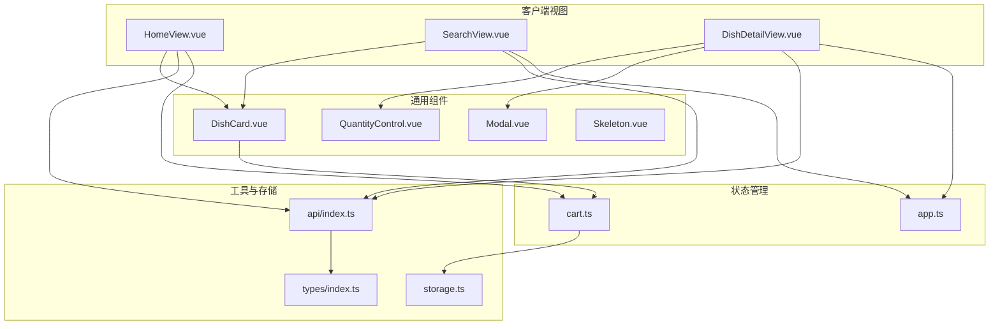
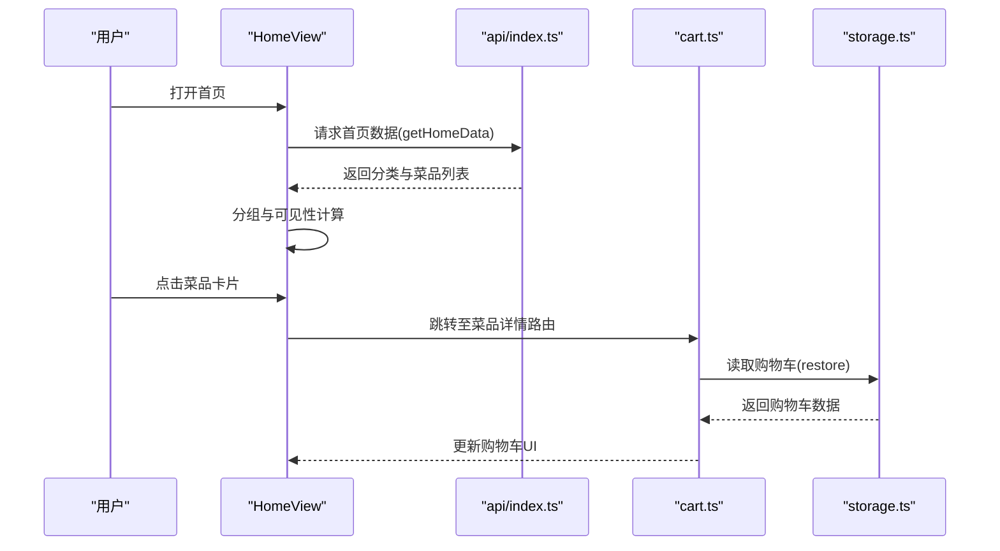
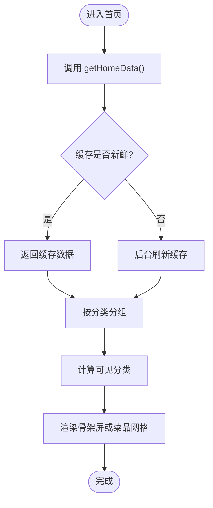
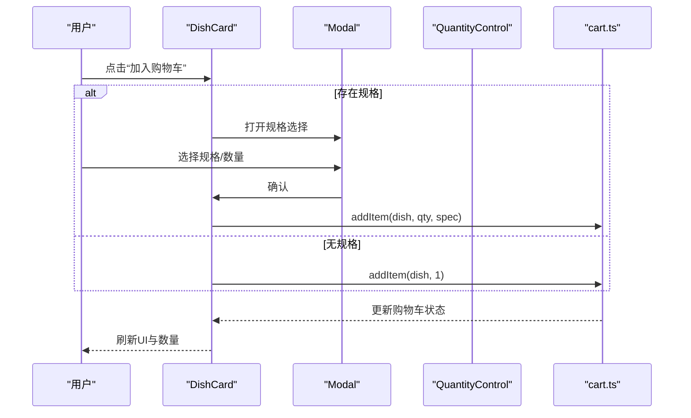
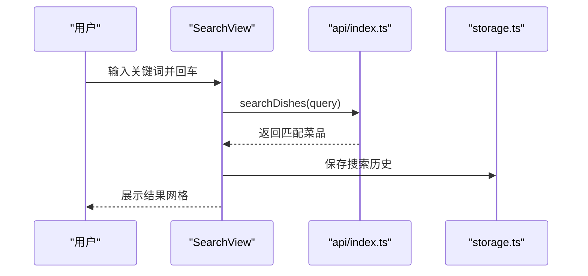
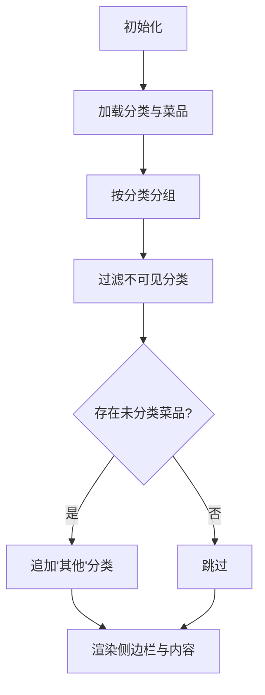
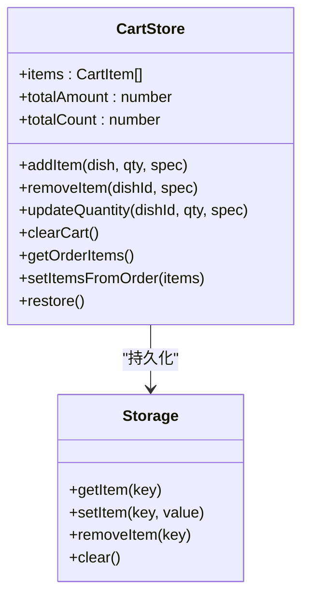
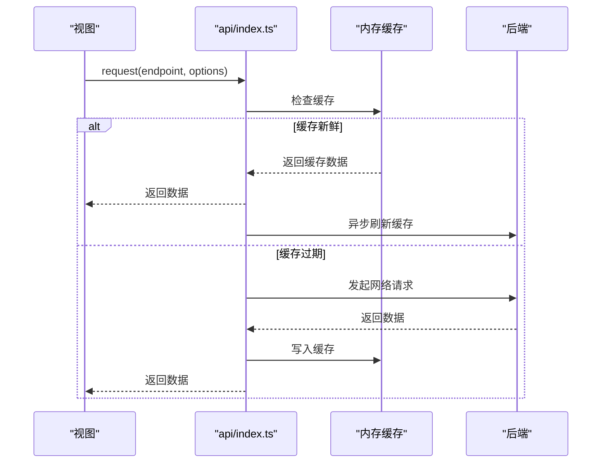
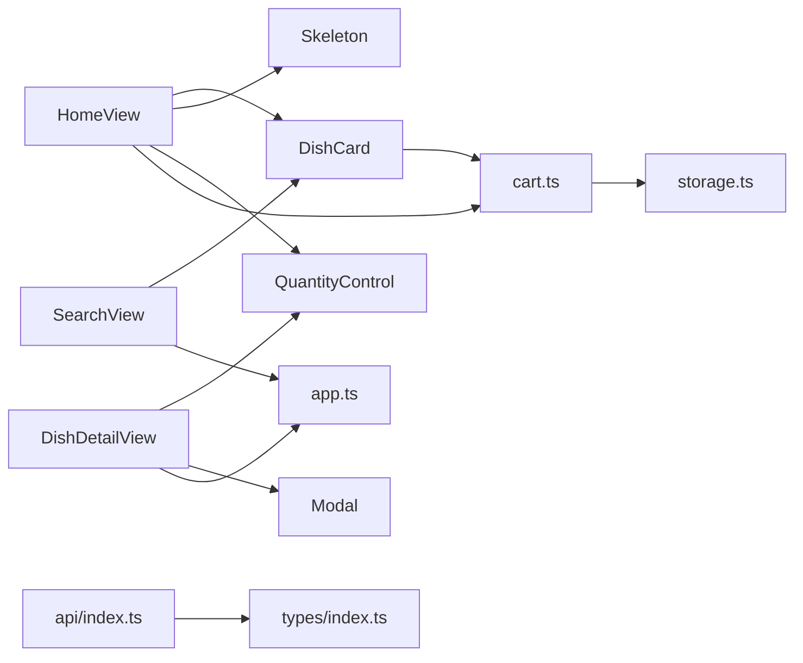

# 菜单浏览与搜索

<cite>
**本文档引用的文件**
- [HomeView.vue](file://src/client/views/HomeView.vue)
- [SearchView.vue](file://src/client/views/SearchView.vue)
- [DishCard.vue](file://src/client/components/DishCard.vue)
- [Skeleton.vue](file://src/shared/components/Skeleton.vue)
- [QuantityControl.vue](file://src/shared/components/QuantityControl.vue)
- [Modal.vue](file://src/shared/components/Modal.vue)
- [cart.ts](file://src/stores/cart.ts)
- [storage.ts](file://src/utils/storage.ts)
- [api/index.ts](file://src/api/index.ts)
- [types/index.ts](file://src/types/index.ts)
- [router/index.ts](file://src/router/index.ts)
- [DishDetailView.vue](file://src/client/views/DishDetailView.vue)
- [app.ts](file://src/stores/app.ts)
</cite>

## 目录
1. [简介](#简介)
2. [项目结构](#项目结构)
3. [核心组件](#核心组件)
4. [架构总览](#架构总览)
5. [详细组件分析](#详细组件分析)
6. [依赖关系分析](#依赖关系分析)
7. [性能考量](#性能考量)
8. [故障排查指南](#故障排查指南)
9. [结论](#结论)
10. [附录](#附录)

## 简介
本文件面向RLRMS系统的菜单浏览与搜索功能，提供从架构到实现细节的完整说明。重点覆盖：
- 首页菜品展示系统：分类导航、菜品网格布局、骨架屏加载、响应式设计
- 菜品卡片组件：点击跳转、图片懒加载、价格显示、规格选择
- 搜索功能：关键词匹配、实时搜索、搜索历史、结果展示
- 分类筛选与分组：按类别分组、可见性过滤、滚动定位
- 用户体验与无障碍：加载态、过渡动画、交互反馈
- 性能优化：缓存策略、懒加载、预取、IndexedDB持久化
- 扩展与定制：组件接口、状态管理、API集成

## 项目结构
菜单浏览与搜索功能主要分布在以下模块：
- 客户端视图层：首页、搜索页、菜品详情
- 组件库：菜品卡片、数量控制、模态框、骨架屏
- 状态管理：购物车、应用状态
- 工具与存储：IndexedDB封装、API请求与缓存
- 类型定义：Dish、Category、CartItem等

图表来源
- [HomeView.vue](file://src/client/views/HomeView.vue)
- [SearchView.vue](file://src/client/views/SearchView.vue)
- [DishCard.vue](file://src/client/components/DishCard.vue)
- [DishDetailView.vue](file://src/client/views/DishDetailView.vue)
- [cart.ts](file://src/stores/cart.ts)
- [api/index.ts](file://src/api/index.ts)
- [storage.ts](file://src/utils/storage.ts)
- [types/index.ts](file://src/types/index.ts)

章节来源
- [HomeView.vue](file://src/client/views/HomeView.vue)
- [SearchView.vue](file://src/client/views/SearchView.vue)
- [DishCard.vue](file://src/client/components/DishCard.vue)
- [DishDetailView.vue](file://src/client/views/DishDetailView.vue)
- [cart.ts](file://src/stores/cart.ts)
- [api/index.ts](file://src/api/index.ts)
- [storage.ts](file://src/utils/storage.ts)
- [types/index.ts](file://src/types/index.ts)

## 核心组件
- 首页视图：负责加载首页数据、分类导航、菜品分组、骨架屏、购物车面板、桌位提示弹窗
- 搜索视图：负责搜索输入、历史记录、搜索结果展示、加载态
- 菜品卡片：负责图片懒加载、价格显示、规格选择、加入购物车、数量控制
- 骨架屏：统一的加载占位样式，支持多种变体与动画
- 数量控制：带波纹反馈的加减控件，支持最小/最大值限制
- 模态框：通用弹窗组件，支持尺寸、标题、关闭事件
- 购物车状态：Pinia状态，持久化到IndexedDB，提供增删改查与订单项转换
- API封装：前端缓存（stale-while-revalidate）、超时与401处理、统一错误包装
- 存储工具：IndexedDB键值存储，提供异步读写与清理

章节来源
- [HomeView.vue](file://src/client/views/HomeView.vue)
- [SearchView.vue](file://src/client/views/SearchView.vue)
- [DishCard.vue](file://src/client/components/DishCard.vue)
- [Skeleton.vue](file://src/shared/components/Skeleton.vue)
- [QuantityControl.vue](file://src/shared/components/QuantityControl.vue)
- [Modal.vue](file://src/shared/components/Modal.vue)
- [cart.ts](file://src/stores/cart.ts)
- [api/index.ts](file://src/api/index.ts)
- [storage.ts](file://src/utils/storage.ts)

## 架构总览
菜单浏览与搜索采用“视图-组件-状态-存储-API”的分层架构：
- 视图层：HomeView、SearchView、DishDetailView
- 组件层：DishCard、QuantityControl、Modal、Skeleton
- 状态层：Pinia购物车、应用状态
- 存储层：IndexedDB持久化购物车
- API层：统一请求封装与缓存

图表来源
- [HomeView.vue](file://src/client/views/HomeView.vue)
- [api/index.ts](file://src/api/index.ts)
- [cart.ts](file://src/stores/cart.ts)
- [storage.ts](file://src/utils/storage.ts)

## 详细组件分析

### 首页菜品展示系统
- 数据加载与缓存
  - 首页通过合并接口一次性获取分类与菜品，减少请求数量
  - 前端缓存采用stale-while-revalidate策略，命中即返回，后台静默刷新
- 分类导航
  - 可见分类基于实际菜品分组结果过滤，自动补充“其他”分类
  - 侧边栏固定定位，支持点击滚动到对应分区
- 菜品网格布局
  - 使用CSS Grid实现两列自适应布局，gap统一间距
  - 每个菜品卡片渲染名称、价格、标签、规格按钮与数量控件
- 骨架屏加载效果
  - 首次加载时显示骨架屏，包含文本、矩形、圆形等变体
  - 骨架屏支持可选动画，尊重“减少运动”偏好
- 响应式设计
  - 侧边栏固定宽度，主内容区域自适应
  - 购物车面板在底部固定，展开时具有阴影与圆角过渡
- 购物车面板
  - 支持展开/收起、清空、单项删除、数量调整
  - 展开时投影增强，收起时恢复边框与轮廓

图表来源
- [HomeView.vue](file://src/client/views/HomeView.vue)
- [api/index.ts](file://src/api/index.ts)
- [Skeleton.vue](file://src/shared/components/Skeleton.vue)

章节来源
- [HomeView.vue](file://src/client/views/HomeView.vue)
- [api/index.ts](file://src/api/index.ts)
- [Skeleton.vue](file://src/shared/components/Skeleton.vue)

### 菜品卡片组件（DishCard）
- 图片懒加载与占位
  - 支持图片懒加载与async解码，加载中显示旋转指示器
  - 加载失败时显示首字母占位与错误提示
  - 无图片时显示品牌渐变占位
- 规格选择与数量控制
  - 若存在规格，则点击“选规格”打开模态框选择规格与数量
  - 若无规格，直接加入购物车
  - 已在购物车中的菜品显示数量控件，支持增减
- 交互反馈
  - 悬停缩放图片，点击卡片触发父级路由跳转
  - 规格选择与数量变更均通过购物车状态更新

图表来源
- [DishCard.vue](file://src/client/components/DishCard.vue)
- [Modal.vue](file://src/shared/components/Modal.vue)
- [QuantityControl.vue](file://src/shared/components/QuantityControl.vue)
- [cart.ts](file://src/stores/cart.ts)

章节来源
- [DishCard.vue](file://src/client/components/DishCard.vue)
- [Modal.vue](file://src/shared/components/Modal.vue)
- [QuantityControl.vue](file://src/shared/components/QuantityControl.vue)
- [cart.ts](file://src/stores/cart.ts)

### 搜索功能
- 关键词匹配与实时搜索
  - 输入框绑定双向数据，回车触发搜索
  - 搜索调用后端搜索接口，返回匹配菜品列表
- 搜索历史
  - 使用IndexedDB存储最近10条历史，支持清空与逐条删除
  - 历史项点击可直接发起搜索
- 结果展示
  - 搜索中显示加载指示器；无结果时显示空状态
  - 结果以菜品卡片网格展示，点击进入详情页

图表来源
- [SearchView.vue](file://src/client/views/SearchView.vue)
- [api/index.ts](file://src/api/index.ts)
- [storage.ts](file://src/utils/storage.ts)

章节来源
- [SearchView.vue](file://src/client/views/SearchView.vue)
- [api/index.ts](file://src/api/index.ts)
- [storage.ts](file://src/utils/storage.ts)

### 分类筛选与菜品分组
- 分类可见性
  - 仅当某分类下存在菜品时才显示该分类
  - “其他”分类在存在未分类菜品时自动追加
- 滚动定位
  - 点击侧边栏分类项，平滑滚动到对应分区
  - 保存离开前的滚动位置与选中分类，返回时恢复

图表来源
- [HomeView.vue](file://src/client/views/HomeView.vue)

章节来源
- [HomeView.vue](file://src/client/views/HomeView.vue)

### 购物车状态与持久化
- 状态模型
  - 购物车为Pinia Store，包含items、总数、总金额
  - 支持单项增删改、清空、订单项转换
- 持久化策略
  - 首次恢复后，所有变更通过watch防抖保存到IndexedDB
  - 保存时使用toRaw剥离Proxy，确保纯对象写入
  - 提供兜底watch，避免遗漏路径

图表来源
- [cart.ts](file://src/stores/cart.ts)
- [storage.ts](file://src/utils/storage.ts)

章节来源
- [cart.ts](file://src/stores/cart.ts)
- [storage.ts](file://src/utils/storage.ts)

### API封装与缓存
- 请求封装
  - 统一超时控制、AbortSignal合并、401处理
  - 非JSON响应防御，避免HTML绕过
- 缓存策略
  - 前端缓存（stale-while-revalidate），命中即返回，后台刷新
  - 首页数据与分类列表均具备缓存能力

图表来源
- [api/index.ts](file://src/api/index.ts)

章节来源
- [api/index.ts](file://src/api/index.ts)

## 依赖关系分析
- 组件依赖
  - HomeView依赖DishCard、Skeleton、QuantityControl、Modal
  - SearchView依赖DishCard、ConfirmDialog、QuantityControl
  - DishCard依赖QuantityControl、Modal、cart.ts
- 状态依赖
  - 购物车状态被多个视图与组件共享
  - 应用状态提供主题、加载态、Toast等全局能力
- 存储依赖
  - 购物车持久化依赖IndexedDB封装
- 路由依赖
  - 路由守卫保障客户端认证与页面标题更新
  - 预取策略提升关键页面切换性能

图表来源
- [HomeView.vue](file://src/client/views/HomeView.vue)
- [SearchView.vue](file://src/client/views/SearchView.vue)
- [DishCard.vue](file://src/client/components/DishCard.vue)
- [DishDetailView.vue](file://src/client/views/DishDetailView.vue)
- [cart.ts](file://src/stores/cart.ts)
- [app.ts](file://src/stores/app.ts)
- [storage.ts](file://src/utils/storage.ts)
- [api/index.ts](file://src/api/index.ts)
- [types/index.ts](file://src/types/index.ts)

章节来源
- [HomeView.vue](file://src/client/views/HomeView.vue)
- [SearchView.vue](file://src/client/views/SearchView.vue)
- [DishCard.vue](file://src/client/components/DishCard.vue)
- [DishDetailView.vue](file://src/client/views/DishDetailView.vue)
- [cart.ts](file://src/stores/cart.ts)
- [app.ts](file://src/stores/app.ts)
- [storage.ts](file://src/utils/storage.ts)
- [api/index.ts](file://src/api/index.ts)
- [types/index.ts](file://src/types/index.ts)

## 性能考量
- 首屏加载
  - 骨架屏减少感知延迟，提升可用性
  - 首页数据合并接口与前端缓存降低网络往返
- 图片优化
  - 懒加载与async解码，避免阻塞主线程
  - 错误回退与占位符保证视觉一致性
- 交互流畅
  - 数量控件波纹反馈与数字弹跳动画增强触觉反馈
  - 购物车展开/收起使用CSS动画，避免重排
- 网络与存储
  - 前端缓存与IndexedDB持久化减少重复请求与数据丢失
  - 防抖保存避免频繁写入

[本节为通用性能建议，不直接分析具体文件]

## 故障排查指南
- 骨架屏不消失
  - 检查数据加载流程与initialized标志位
  - 确认API返回结构与字段映射一致
- 图片加载异常
  - 查看图片URL与懒加载属性
  - 检查错误回调与占位符逻辑
- 购物车数据不同步
  - 确认store恢复逻辑与watch保存时机
  - 检查IndexedDB读写权限与异常处理
- 搜索历史无法保存
  - 确认IndexedDB初始化与事务执行
  - 检查键名与序列化方式
- 401未授权
  - 检查全局401处理与会话过期事件
  - 确认路由守卫与登录拦截逻辑

章节来源
- [HomeView.vue](file://src/client/views/HomeView.vue)
- [DishCard.vue](file://src/client/components/DishCard.vue)
- [cart.ts](file://src/stores/cart.ts)
- [storage.ts](file://src/utils/storage.ts)
- [api/index.ts](file://src/api/index.ts)

## 结论
RLRMS的菜单浏览与搜索功能通过清晰的分层架构与完善的组件体系，实现了高性能、高可用的菜品浏览体验。骨架屏、懒加载、缓存与持久化等策略有效提升了用户体验；购物车状态与路由守卫保障了业务连续性。开发者可在现有基础上扩展规格管理、排序规则、搜索算法与主题系统，进一步提升功能完整性与可维护性。

[本节为总结性内容，不直接分析具体文件]

## 附录
- 开发者扩展建议
  - 规格管理：在菜品详情页增加规格编辑入口，支持多规格组合与价格差异
  - 排序与过滤：在首页增加价格、销量、评分等排序选项，支持多条件过滤
  - 搜索增强：引入拼音索引、模糊匹配、热门词推荐与搜索纠错
  - 主题系统：支持更多主题变量与暗色模式偏好同步
  - 性能监控：埋点统计关键指标（首屏时间、交互延迟、缓存命中率）

[本节为概念性内容，不直接分析具体文件]