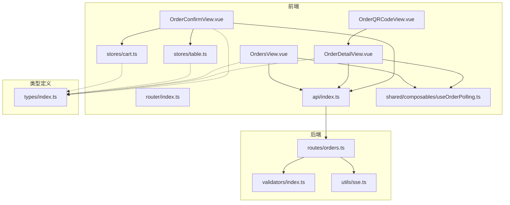
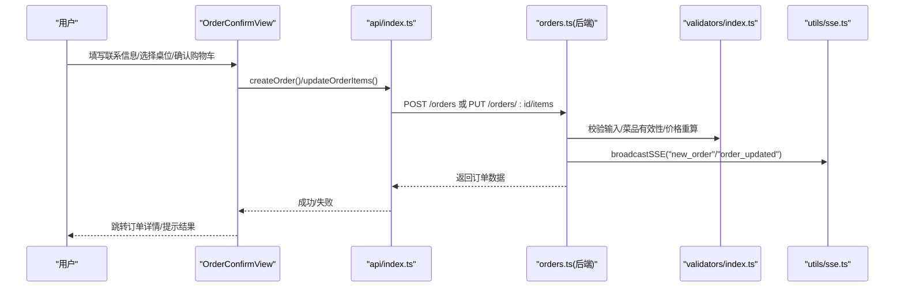
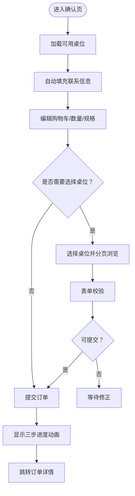
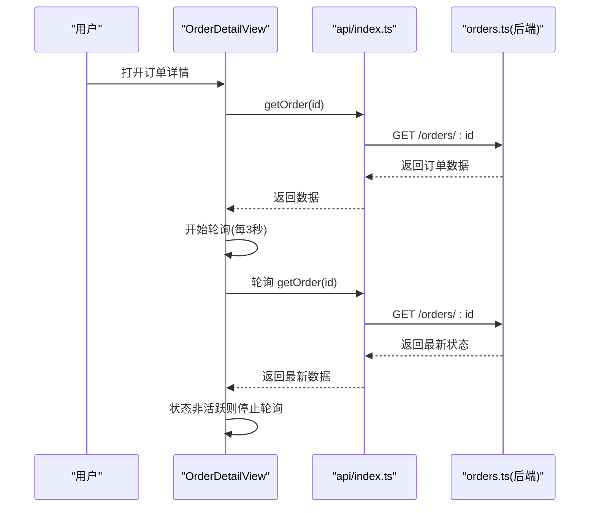
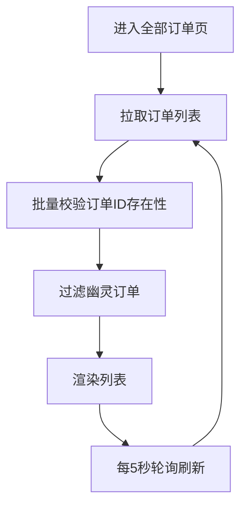
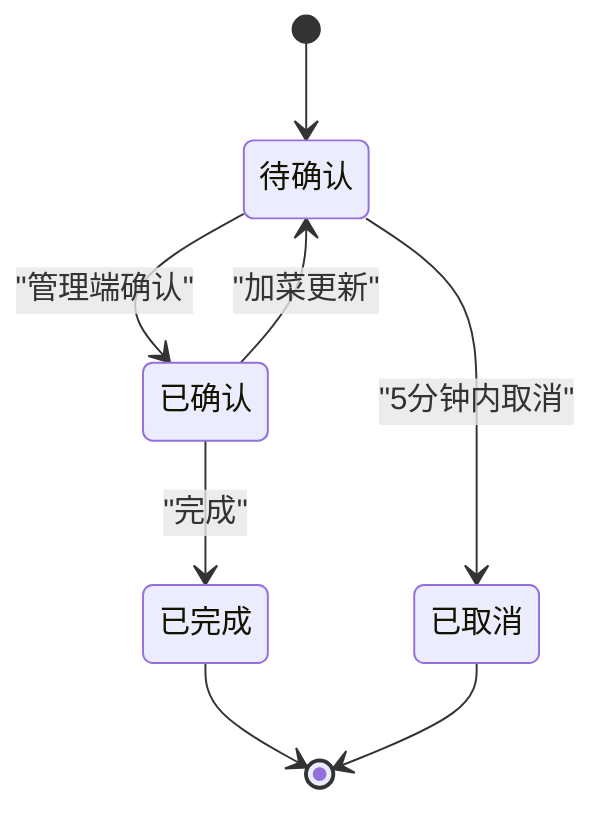
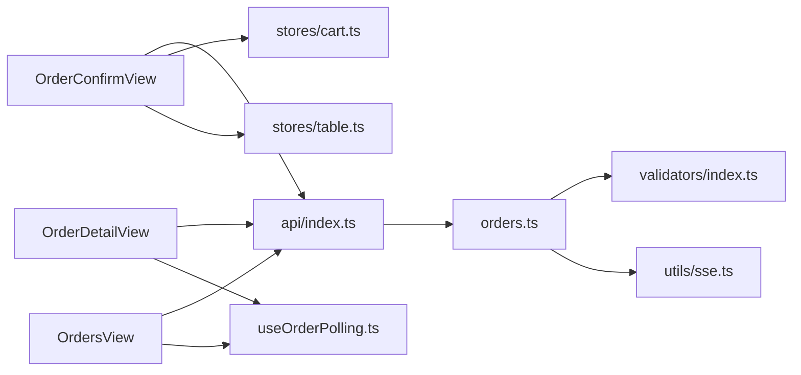

# 订单流程

<cite>
**本文引用的文件**
- [OrderConfirmView.vue](file://src/client/views/OrderConfirmView.vue)
- [OrderDetailView.vue](file://src/client/views/OrderDetailView.vue)
- [OrderQRCodeView.vue](file://src/client/views/OrderQRCodeView.vue)
- [OrdersView.vue](file://src/client/views/OrdersView.vue)
- [orders.ts](file://server/src/routes/orders.ts)
- [index.ts](file://src/types/index.ts)
- [cart.ts](file://src/stores/cart.ts)
- [table.ts](file://src/stores/table.ts)
- [index.ts](file://src/api/index.ts)
- [useOrderPolling.ts](file://src/shared/composables/useOrderPolling.ts)
- [index.ts](file://src/router/index.ts)
- [index.ts](file://server/src/utils/sse.ts)
- [index.ts](file://server/src/validators/index.ts)
</cite>

## 目录
1. [简介](#简介)
2. [项目结构](#项目结构)
3. [核心组件](#核心组件)
4. [架构概览](#架构概览)
5. [详细组件分析](#详细组件分析)
6. [依赖关系分析](#依赖关系分析)
7. [性能考量](#性能考量)
8. [故障排查指南](#故障排查指南)
9. [结论](#结论)
10. [附录](#附录)

## 简介
本文件面向开发者，系统性阐述 RLRMS 的订单流程功能，覆盖从“确认订单”到“订单详情/二维码/历史”的完整链路，包括：
- 订单确认页面：订单详情展示、联系信息填写、支付方式选择、订单提交流程
- 订单详情页面：状态跟踪、菜品清单、价格明细、历史管理
- 订单二维码页面：二维码生成、扫码验证、状态同步、完成提醒
- 订单状态管理：状态流转、实时更新、异常处理、重试机制
- 数据结构与状态机：订单模型、状态枚举、前后端一致性保障
- 用户体验优化：自动填充、分页、进度提示、离线容错
- 扩展与定制：如何在现有架构上扩展新功能

## 项目结构
订单流程涉及前端视图、状态管理、API 客户端、路由守卫与后端路由/验证器/SSE 广播等模块。下图给出与订单流程强相关的模块关系。

图表来源
- [OrderConfirmView.vue:1-981](file://src/client/views/OrderConfirmView.vue#L1-L981)
- [OrderDetailView.vue:1-672](file://src/client/views/OrderDetailView.vue#L1-L672)
- [OrderQRCodeView.vue:1-18](file://src/client/views/OrderQRCodeView.vue#L1-L18)
- [OrdersView.vue:1-290](file://src/client/views/OrdersView.vue#L1-L290)
- [index.ts:1-317](file://src/router/index.ts#L1-L317)
- [index.ts:1-608](file://src/api/index.ts#L1-L608)
- [cart.ts:1-183](file://src/stores/cart.ts#L1-L183)
- [table.ts:1-25](file://src/stores/table.ts#L1-L25)
- [useOrderPolling.ts:1-74](file://src/shared/composables/useOrderPolling.ts#L1-L74)
- [orders.ts:1-552](file://server/src/routes/orders.ts#L1-L552)
- [index.ts:1-123](file://server/src/validators/index.ts#L1-L123)
- [index.ts:1-59](file://server/src/utils/sse.ts#L1-L59)
- [index.ts:1-133](file://src/types/index.ts#L1-L133)

章节来源
- [index.ts:42-92](file://src/router/index.ts#L42-L92)
- [index.ts:128-243](file://src/api/index.ts#L128-L243)
- [orders.ts:51-552](file://server/src/routes/orders.ts#L51-L552)
- [index.ts:6-93](file://server/src/validators/index.ts#L6-L93)
- [index.ts:37-51](file://server/src/utils/sse.ts#L37-L51)
- [index.ts:70-97](file://src/types/index.ts#L70-L97)

## 核心组件
- 订单确认页：负责选择就餐时段、桌位、填写联系信息、展示购物车、提交订单；支持“加菜模式”。
- 订单详情页：展示订单状态、菜品清单、价格明细、联系信息；支持二维码弹窗、加菜、取消。
- 订单二维码页：占位跳转至订单详情页，便于通过二维码直达订单详情。
- 全部订单页：展示历史订单列表，支持轮询刷新与幽灵订单清理。
- 前端状态管理：购物车与桌位选择状态持久化与恢复。
- 后端路由与验证：下单、加菜、取消、查询、批量验证等接口，配合 Zod 校验与 SSE 广播。
- 轮询与实时：基于定时轮询与可见性感知的实时更新策略。

章节来源
- [OrderConfirmView.vue:1-434](file://src/client/views/OrderConfirmView.vue#L1-L434)
- [OrderDetailView.vue:1-375](file://src/client/views/OrderDetailView.vue#L1-L375)
- [OrderQRCodeView.vue:1-18](file://src/client/views/OrderQRCodeView.vue#L1-L18)
- [OrdersView.vue:1-290](file://src/client/views/OrdersView.vue#L1-L290)
- [cart.ts:1-183](file://src/stores/cart.ts#L1-L183)
- [table.ts:1-25](file://src/stores/table.ts#L1-L25)
- [orders.ts:51-552](file://server/src/routes/orders.ts#L51-L552)
- [index.ts:6-93](file://server/src/validators/index.ts#L6-L93)
- [index.ts:37-51](file://server/src/utils/sse.ts#L37-L51)

## 架构概览
订单流程采用“前端路由 + Pinia 状态 + API 客户端 + 后端 Express 路由 + SSE 广播”的组合架构。前端通过路由守卫控制客户端登录态，后端通过 JWT 验证与 Zod 输入校验保障安全与一致性，SSE 实现管理端与客户端的实时事件推送。

图表来源
- [OrderConfirmView.vue:177-231](file://src/client/views/OrderConfirmView.vue#L177-L231)
- [index.ts:186-243](file://src/api/index.ts#L186-L243)
- [orders.ts:193-353](file://server/src/routes/orders.ts#L193-L353)
- [index.ts:6-93](file://server/src/validators/index.ts#L6-L93)
- [index.ts:37-51](file://server/src/utils/sse.ts#L37-L51)

## 详细组件分析

### 订单确认页面（OrderConfirmView）
- 功能要点
  - 就餐时段选择：根据当前时间自动判断“中午/晚上”，并限制“中午”选项在下午之后不可选。
  - 桌位选择：按就餐时段查询可用桌位，支持分页与选中状态；切换时段清空选中并刷新。
  - 购物车展示：支持折叠/展开、数量调整、删除单项；合计金额实时计算。
  - 联系信息：自动填充手机号（来自登录态），称呼自动保存到本地存储用于下次自动填充。
  - 提交流程：区分“正常下单”和“加菜模式”，提交前进行表单校验与按钮禁用；提交后显示三步进度动画，完成后跳转订单详情。
- 关键交互
  - 表单校验：称呼正则校验、手机号清洗、必填项检查。
  - 提交逻辑：调用后端接口，成功后清空购物车并跳转详情页。
- 用户体验
  - 自动填充与本地存储持久化，减少重复输入。
  - 进度提示与动画，提升提交反馈感。
  - “加菜模式”下无需选择桌位，简化流程。

图表来源
- [OrderConfirmView.vue:82-126](file://src/client/views/OrderConfirmView.vue#L82-L126)
- [OrderConfirmView.vue:148-171](file://src/client/views/OrderConfirmView.vue#L148-L171)
- [OrderConfirmView.vue:177-231](file://src/client/views/OrderConfirmView.vue#L177-L231)

章节来源
- [OrderConfirmView.vue:22-126](file://src/client/views/OrderConfirmView.vue#L22-L126)
- [OrderConfirmView.vue:148-231](file://src/client/views/OrderConfirmView.vue#L148-L231)
- [cart.ts:77-87](file://src/stores/cart.ts#L77-L87)
- [table.ts:5-24](file://src/stores/table.ts#L5-L24)

### 订单详情页面（OrderDetailView）
- 功能要点
  - 订单状态跟踪：根据状态映射显示不同颜色与文案；仅“待确认/已确认”状态持续轮询。
  - 菜品清单与价格明细：支持折叠/展开，显示单价、数量、小计；总计金额来自后端。
  - 联系信息展示：手机号与联系人。
  - 二维码弹窗：生成订单二维码与条形码，支持点击复制订单号。
  - 加菜与取消：根据状态允许加菜；5 分钟内可取消，需手机号验证。
  - 轮询刷新：页面可见时启动轮询，隐藏时停止；订单状态变为非活跃时停止轮询。
- 关键交互
  - 轮询策略：每 3 秒拉取一次；可见性变化时自动启停。
  - 取消流程：校验手机号与创建时间，成功后刷新状态。
  - 二维码生成：使用二维码库与条形码库生成图片数据。
- 用户体验
  - 状态徽章颜色区分，一目了然。
  - 二维码弹窗简洁直观，支持复制订单号。

图表来源
- [OrderDetailView.vue:77-128](file://src/client/views/OrderDetailView.vue#L77-L128)
- [index.ts:212-214](file://src/api/index.ts#L212-L214)
- [orders.ts:156-191](file://server/src/routes/orders.ts#L156-L191)

章节来源
- [OrderDetailView.vue:50-128](file://src/client/views/OrderDetailView.vue#L50-L128)
- [OrderDetailView.vue:196-226](file://src/client/views/OrderDetailView.vue#L196-L226)
- [OrderDetailView.vue:151-171](file://src/client/views/OrderDetailView.vue#L151-L171)

### 订单二维码页面（OrderQRCodeView）
- 设计说明
  - 作为占位视图，直接重定向到订单详情页，便于通过二维码直达订单详情。
- 适用场景
  - 支付/取餐环节扫码核销，统一入口到订单详情页。

章节来源
- [OrderQRCodeView.vue:1-18](file://src/client/views/OrderQRCodeView.vue#L1-L18)

### 全部订单页面（OrdersView）
- 功能要点
  - 展示历史订单列表：桌位、创建时间、状态、金额。
  - 轮询刷新：每 5 秒拉取一次；可见性变化时自动启停。
  - 幽灵订单清理：先拉取订单列表，再批量校验 ID 是否存在，过滤掉不存在的“幽灵订单”。
- 用户体验
  - 列表卡片化展示，点击进入详情。
  - 加载与空状态友好提示。

图表来源
- [OrdersView.vue:33-63](file://src/client/views/OrdersView.vue#L33-L63)
- [OrdersView.vue:92-115](file://src/client/views/OrdersView.vue#L92-L115)

章节来源
- [OrdersView.vue:33-136](file://src/client/views/OrdersView.vue#L33-L136)

### 订单状态管理与实时更新
- 状态机
  - 订单状态：pending（待确认）、confirmed（已确认）、completed（已完成）、cancelled（已取消）。
  - 状态流转：下单后 pending；管理端确认后 confirmed；完成后 completed；5 分钟内可取消为 cancelled。
- 实时更新
  - 前端轮询：订单详情页与全部订单页分别以不同间隔轮询。
  - SSE 广播：下单成功后广播“new_order”，取消或加菜更新广播“order_updated”，通知管理端与客户端。
- 异常处理与重试
  - 轮询失败静默记录日志，保持界面稳定。
  - 取消接口对手机号与创建时间进行严格校验，超时或状态不符直接拒绝。
  - 幽灵订单清理：当批量校验失败时降级信任列表数据，避免阻塞。

图表来源
- [orders.ts:355-418](file://server/src/routes/orders.ts#L355-L418)
- [orders.ts:420-552](file://server/src/routes/orders.ts#L420-L552)
- [index.ts:37-51](file://server/src/utils/sse.ts#L37-L51)

章节来源
- [orders.ts:355-418](file://server/src/routes/orders.ts#L355-L418)
- [orders.ts:420-552](file://server/src/routes/orders.ts#L420-L552)
- [index.ts:37-51](file://server/src/utils/sse.ts#L37-L51)

### 数据结构与前后端一致性
- 订单模型
  - 字段：id、order_no、table_id、table_name、table_no、user_id、dining_time、contact_name、contact_phone、total_amount、status、created_at、updated_at、items。
  - 状态：pending、confirmed、completed、cancelled。
- 前后端一致性保障
  - 下单/加菜：后端批量校验菜品、重算单价与小计，防止前端篡改金额。
  - 取消：校验手机号与创建时间，仅 pending 状态可取消。
  - 查询：批量查询订单项，避免 N+1 查询。

章节来源
- [index.ts:82-97](file://src/types/index.ts#L82-L97)
- [orders.ts:242-291](file://server/src/routes/orders.ts#L242-L291)
- [orders.ts:453-502](file://server/src/routes/orders.ts#L453-L502)

### 用户体验优化策略
- 自动填充与持久化
  - 联系电话来自登录态，称呼自动保存到本地存储，下次自动回填。
- 分页与折叠
  - 桌位网格分页、菜品清单折叠/展开，降低长列表视觉负担。
- 进度提示
  - 提交订单时三步进度动画，增强反馈。
- 可见性感知轮询
  - 页面隐藏时停止轮询，恢复可见时立刻拉取一次并重启轮询，兼顾性能与实时性。

章节来源
- [OrderConfirmView.vue:116-126](file://src/client/views/OrderConfirmView.vue#L116-L126)
- [OrderDetailView.vue:130-149](file://src/client/views/OrderDetailView.vue#L130-L149)
- [OrdersView.vue:117-136](file://src/client/views/OrdersView.vue#L117-L136)

### 扩展与定制化指导
- 新增支付方式
  - 在确认页增加支付方式选择项，提交时将支付方式随订单数据发送；后端在下单接口中新增字段校验与存储。
- 订单备注
  - 在确认页增加备注输入框，提交时携带；后端在下单/加菜接口中新增字段并持久化。
- 优惠券/折扣
  - 前端在提交前计算折扣，后端在下单接口中校验折扣规则并重算 total_amount。
- 自定义状态
  - 在状态机中新增状态枚举与映射文案；后端路由中新增状态转换逻辑与校验。
- SSE 事件扩展
  - 在广播处新增自定义事件名与数据结构，前端订阅并处理。

章节来源
- [OrderConfirmView.vue:177-231](file://src/client/views/OrderConfirmView.vue#L177-L231)
- [orders.ts:193-353](file://server/src/routes/orders.ts#L193-L353)
- [index.ts:37-51](file://server/src/utils/sse.ts#L37-L51)

## 依赖关系分析
- 前端依赖
  - 路由：客户端路由守卫控制“确认订单/全部订单”等页面的登录态要求。
  - 状态管理：购物车与桌位状态通过 Pinia 管理，并持久化到本地存储。
  - 组合式函数：useOrderPolling 抽象轮询逻辑，供订单详情与全部订单页复用。
- 后端依赖
  - 校验器：Zod schema 保证输入合法性与安全。
  - SSE：广播新订单与状态更新事件。
  - 缓存键：下单/取消后失效相关缓存键，确保可用桌位等数据一致。

图表来源
- [index.ts:201-247](file://src/router/index.ts#L201-L247)
- [index.ts:128-243](file://src/api/index.ts#L128-L243)
- [orders.ts:51-552](file://server/src/routes/orders.ts#L51-L552)
- [index.ts:6-93](file://server/src/validators/index.ts#L6-L93)
- [index.ts:37-51](file://server/src/utils/sse.ts#L37-L51)
- [cart.ts:1-183](file://src/stores/cart.ts#L1-L183)
- [table.ts:1-25](file://src/stores/table.ts#L1-L25)
- [useOrderPolling.ts:1-74](file://src/shared/composables/useOrderPolling.ts#L1-L74)

章节来源
- [index.ts:201-247](file://src/router/index.ts#L201-L247)
- [index.ts:128-243](file://src/api/index.ts#L128-L243)
- [orders.ts:51-552](file://server/src/routes/orders.ts#L51-L552)

## 性能考量
- 前端
  - 购物车与桌位状态持久化到本地存储，减少重复请求与输入成本。
  - 订单详情与全部订单页采用轮询策略，间隔分别为 3 秒与 5 秒，避免频繁请求。
  - 可见性感知轮询，隐藏时停止，恢复可见时立刻拉取，兼顾性能与实时性。
- 后端
  - 批量查询订单项，避免 N+1 查询。
  - 下单/加菜时批量校验菜品与价格，一次性写入数据库，减少往返。
  - SSE 广播事件，避免客户端轮询压力。

章节来源
- [cart.ts:112-150](file://src/stores/cart.ts#L112-L150)
- [OrderDetailView.vue:97-140](file://src/client/views/OrderDetailView.vue#L97-L140)
- [OrdersView.vue:88-127](file://src/client/views/OrdersView.vue#L88-L127)
- [orders.ts:96-128](file://server/src/routes/orders.ts#L96-L128)
- [orders.ts:295-318](file://server/src/routes/orders.ts#L295-L318)
- [index.ts:37-51](file://server/src/utils/sse.ts#L37-L51)

## 故障排查指南
- 提交订单失败
  - 检查网络请求与后端响应，确认表单校验是否通过；查看购物车是否为空、桌位是否被占用。
  - 观察进度提示与最终跳转，若失败会显示错误提示。
- 订单详情不刷新
  - 确认页面处于可见状态且轮询已启动；检查后端 SSE 是否正常广播。
  - 若状态变为非活跃，轮询会自动停止，属预期行为。
- 取消订单失败
  - 确认手机号与订单绑定一致，且创建时间在 5 分钟内；仅 pending 状态可取消。
- 全部订单出现“幽灵订单”
  - 后端已做批量校验清理；若清理失败会降级信任列表数据，建议刷新页面或稍后再试。

章节来源
- [OrderConfirmView.vue:224-231](file://src/client/views/OrderConfirmView.vue#L224-L231)
- [OrderDetailView.vue:116-128](file://src/client/views/OrderDetailView.vue#L116-L128)
- [orders.ts:355-418](file://server/src/routes/orders.ts#L355-L418)
- [OrdersView.vue:33-63](file://src/client/views/OrdersView.vue#L33-L63)

## 结论
RLRMS 的订单流程在前端与后端协同下实现了高可用、低耦合与良好的用户体验。通过严格的输入校验、服务端价格重算、SSE 实时广播与轮询策略，确保了订单数据的一致性与实时性。开发者可在现有架构基础上平滑扩展支付方式、备注、优惠等功能，同时保持状态机与数据结构的清晰与可维护性。

## 附录
- 路由与权限
  - 客户端路由对“确认订单/全部订单”等页面设置了登录态要求，未登录时触发登录弹窗。
- 类型与状态
  - 订单状态与字段定义集中于类型文件，前后端共享，减少歧义。
- 组件关系
  - 订单确认页依赖购物车与桌位状态；订单详情页依赖轮询组合式函数；全部订单页依赖通用轮询逻辑。

章节来源
- [index.ts:201-247](file://src/router/index.ts#L201-L247)
- [index.ts:82-97](file://src/types/index.ts#L82-L97)
- [useOrderPolling.ts:1-74](file://src/shared/composables/useOrderPolling.ts#L1-L74)