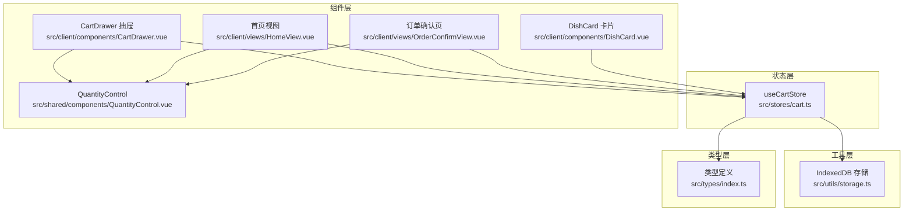
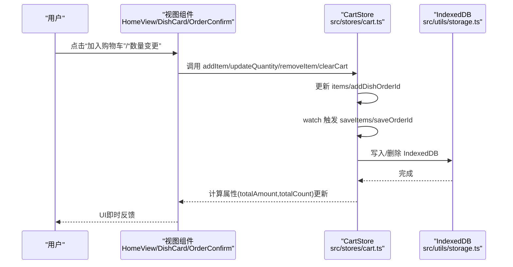
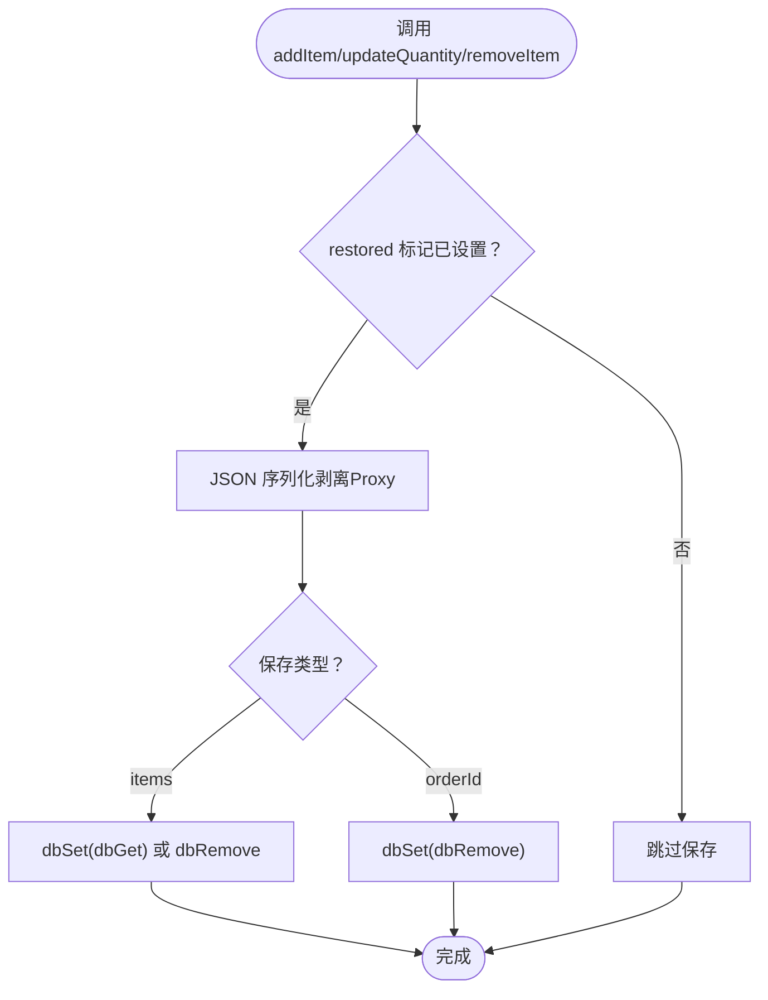
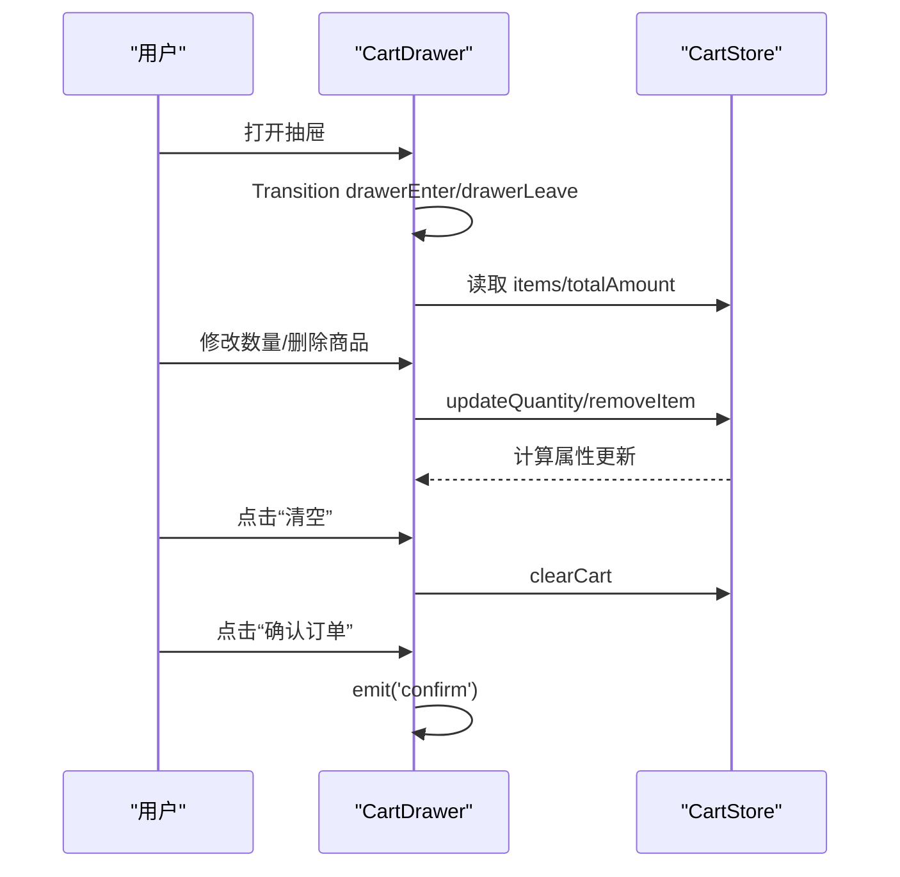
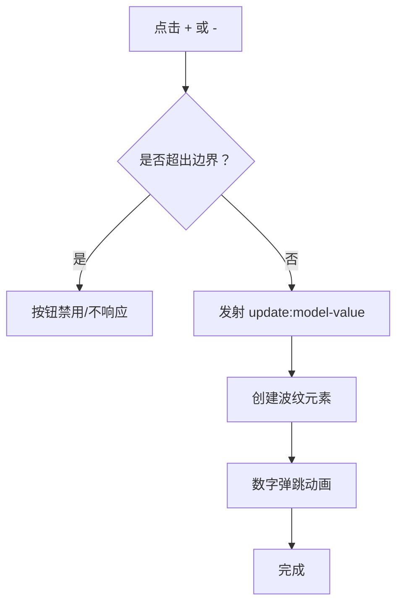
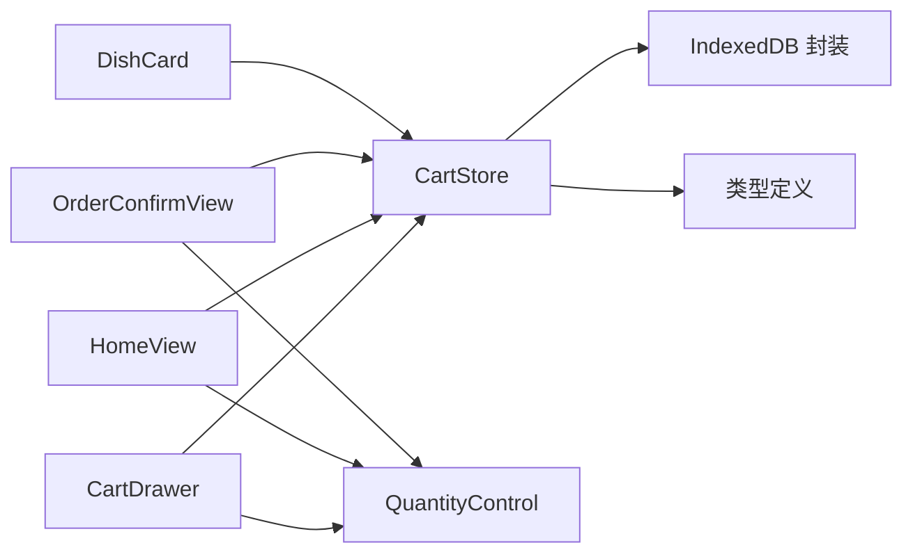

# 购物车管理

<cite>
**本文档引用的文件**
- [src/stores/cart.ts](file://src/stores/cart.ts)
- [src/client/components/CartDrawer.vue](file://src/client/components/CartDrawer.vue)
- [src/shared/components/QuantityControl.vue](file://src/shared/components/QuantityControl.vue)
- [src/utils/storage.ts](file://src/utils/storage.ts)
- [src/types/index.ts](file://src/types/index.ts)
- [src/client/views/HomeView.vue](file://src/client/views/HomeView.vue)
- [src/client/components/DishCard.vue](file://src/client/components/DishCard.vue)
- [src/client/views/DishDetailView.vue](file://src/client/views/DishDetailView.vue)
- [src/client/views/OrderConfirmView.vue](file://src/client/views/OrderConfirmView.vue)
- [src/client/components/ClientLayout.vue](file://src/client/components/ClientLayout.vue)
- [src/style.css](file://src/style.css)
</cite>

## 目录
1. [引言](#引言)
2. [项目结构](#项目结构)
3. [核心组件](#核心组件)
4. [架构总览](#架构总览)
5. [详细组件分析](#详细组件分析)
6. [依赖关系分析](#依赖关系分析)
7. [性能考虑](#性能考虑)
8. [故障排查指南](#故障排查指南)
9. [结论](#结论)
10. [附录](#附录)

## 引言
本文件面向RLRMS项目的购物车管理功能，系统性阐述其状态管理机制、UI组件实现与持久化策略。内容覆盖商品添加、数量调整、删除、清空、总价计算等核心逻辑；购物车抽屉与底部栏两种交互形态；数量控制组件的交互设计与动画反馈；以及基于IndexedDB的本地持久化与数据同步策略。同时提供扩展与定制化建议，帮助开发者在现有架构上进行二次开发。

## 项目结构
购物车相关代码主要分布在以下模块：
- Pinia状态层：购物车store负责状态、计算属性与持久化
- 组件层：数量控制组件、购物车抽屉、菜品卡片、订单确认页等
- 工具层：IndexedDB封装的本地存储工具
- 类型层：购物车数据结构与订单项转换模型

图表来源
- [src/stores/cart.ts:1-183](file://src/stores/cart.ts#L1-L183)
- [src/client/components/CartDrawer.vue:1-314](file://src/client/components/CartDrawer.vue#L1-L314)
- [src/shared/components/QuantityControl.vue:1-212](file://src/shared/components/QuantityControl.vue#L1-L212)
- [src/utils/storage.ts:1-109](file://src/utils/storage.ts#L1-L109)
- [src/types/index.ts:110-116](file://src/types/index.ts#L110-L116)

章节来源
- [src/stores/cart.ts:1-183](file://src/stores/cart.ts#L1-L183)
- [src/client/components/CartDrawer.vue:1-314](file://src/client/components/CartDrawer.vue#L1-L314)
- [src/shared/components/QuantityControl.vue:1-212](file://src/shared/components/QuantityControl.vue#L1-L212)
- [src/utils/storage.ts:1-109](file://src/utils/storage.ts#L1-L109)
- [src/types/index.ts:110-116](file://src/types/index.ts#L110-L116)

## 核心组件
- 购物车Store（Pinia）
  - 状态：items、addDishOrderId、restored
  - 计算属性：totalAmount、totalCount
  - 核心方法：addItem、updateQuantity、removeItem、clearCart、getOrderItems、setItemsFromOrder
  - 持久化：saveItems、saveOrderId、restore
- 数量控制组件（QuantityControl）
  - 支持最小值/最大值、尺寸、数值变化动画、波纹点击反馈
- 购物车抽屉（CartDrawer）
  - 展开/收起动画、商品列表渲染、数量控制集成、清空与确认下单
- 本地存储（IndexedDB）
  - 封装getItem/setItem/removeItem/clear，懒加载数据库连接

章节来源
- [src/stores/cart.ts:9-182](file://src/stores/cart.ts#L9-L182)
- [src/shared/components/QuantityControl.vue:1-212](file://src/shared/components/QuantityControl.vue#L1-L212)
- [src/client/components/CartDrawer.vue:1-80](file://src/client/components/CartDrawer.vue#L1-L80)
- [src/utils/storage.ts:11-91](file://src/utils/storage.ts#L11-L91)

## 架构总览
购物车采用“状态驱动+本地持久化”的架构：
- 状态由Pinia store集中管理，计算属性驱动UI更新
- 通过watch与防抖机制将状态落盘至IndexedDB
- 页面级组件通过store暴露的方法完成用户交互
- 订单确认页可将store中的items转换为后端所需的OrderItem格式

图表来源
- [src/client/views/HomeView.vue:336-344](file://src/client/views/HomeView.vue#L336-L344)
- [src/client/components/DishCard.vue:134-139](file://src/client/components/DishCard.vue#L134-L139)
- [src/client/views/OrderConfirmView.vue:338-346](file://src/client/views/OrderConfirmView.vue#L338-L346)
- [src/stores/cart.ts:154-164](file://src/stores/cart.ts#L154-L164)
- [src/utils/storage.ts:59-91](file://src/utils/storage.ts#L59-L91)

## 详细组件分析

### 购物车Store（状态管理与持久化）
- 数据结构
  - CartItem：包含菜品、数量、规格
  - 订单项转换：getOrderItems将store中的items映射为后端OrderItem数组
- 核心逻辑
  - 添加/更新/删除：基于dishId与spec匹配定位，支持同菜品不同规格的独立计数
  - 总价与总数：基于单价×数量累加
  - 清空：同时清理items与addDishOrderId
- 持久化策略
  - 显式保存：saveItems对Vue响应式对象进行toRaw序列化后写入
  - 防抖兜底：watch(items)在变更后延时100ms统一写库
  - 订单模式：addDishOrderId用于加菜模式识别，同样持久化
  - 恢复：启动时并行读取items与orderId，失败静默忽略

图表来源
- [src/stores/cart.ts:113-130](file://src/stores/cart.ts#L113-L130)
- [src/stores/cart.ts:154-158](file://src/stores/cart.ts#L154-L158)
- [src/stores/cart.ts:133-150](file://src/stores/cart.ts#L133-L150)
- [src/utils/storage.ts:42-91](file://src/utils/storage.ts#L42-L91)

章节来源
- [src/stores/cart.ts:9-182](file://src/stores/cart.ts#L9-L182)
- [src/types/index.ts:110-116](file://src/types/index.ts#L110-L116)

### 购物车抽屉组件（CartDrawer）
- 展现逻辑
  - 使用Teleport挂载到body，配合CSS动画实现抽屉滑入/滑出
  - 条件渲染：空购物车提示与商品列表
  - 合计金额与操作区：清空、确认下单
- 交互细节
  - 商品项：名称、规格、单价、数量控制、删除按钮
  - 数量控制：绑定modelValue与update:model-value事件
  - 删除：按dishId与spec删除对应项
- 动画与样式
  - 抽屉入场/出场动画、单项入场动画
  - 基于全局变量的间距、圆角、阴影与主题色

图表来源
- [src/client/components/CartDrawer.vue:24-79](file://src/client/components/CartDrawer.vue#L24-L79)
- [src/client/components/CartDrawer.vue:50-76](file://src/client/components/CartDrawer.vue#L50-L76)

章节来源
- [src/client/components/CartDrawer.vue:1-314](file://src/client/components/CartDrawer.vue#L1-L314)

### 数量控制组件（QuantityControl）
- 交互设计
  - 最小值/最大值限制、尺寸（sm/md）
  - 增减按钮禁用态、点击波纹效果
  - 数值变化时的弹跳动画与视觉反馈
- 事件与状态
  - 通过v-model双向绑定modelValue
  - 发射update:modelValue事件供父组件监听

图表来源
- [src/shared/components/QuantityControl.vue:33-63](file://src/shared/components/QuantityControl.vue#L33-L63)
- [src/shared/components/QuantityControl.vue:170-174](file://src/shared/components/QuantityControl.vue#L170-L174)

章节来源
- [src/shared/components/QuantityControl.vue:1-212](file://src/shared/components/QuantityControl.vue#L1-L212)

### 页面级集成（首页、菜品详情、订单确认）
- 首页（HomeView）
  - 底部展开式购物车栏：展开/收起动画、清空、确认下单
  - 商品卡片内数量控制：根据是否有规格决定是否弹出规格选择
- 菜品详情（DishDetailView）
  - 规格选择与数量控制：支持规格与数量双控
- 订单确认（OrderConfirmView）
  - 菜单折叠/展开、逐项数量调整与删除
  - 提交订单时将store中的items转换为后端OrderItem数组

章节来源
- [src/client/views/HomeView.vue:310-365](file://src/client/views/HomeView.vue#L310-L365)
- [src/client/components/DishCard.vue:134-139](file://src/client/components/DishCard.vue#L134-L139)
- [src/client/views/DishDetailView.vue:142-158](file://src/client/views/DishDetailView.vue#L142-L158)
- [src/client/views/OrderConfirmView.vue:327-361](file://src/client/views/OrderConfirmView.vue#L327-L361)

## 依赖关系分析
- 组件耦合
  - CartDrawer与HomeView均依赖CartStore，但渲染方式不同
  - DishCard与OrderConfirmView均复用QuantityControl
- 外部依赖
  - IndexedDB封装：统一的事务读写接口
  - 类型系统：CartItem、OrderItem、Dish等强类型约束
- 潜在风险
  - 本地存储不可用时的降级：restore阶段异常被静默处理
  - 防抖保存可能遗漏极短时间内连续变更的场景

图表来源
- [src/stores/cart.ts:1-183](file://src/stores/cart.ts#L1-L183)
- [src/utils/storage.ts:1-109](file://src/utils/storage.ts#L1-L109)
- [src/types/index.ts:110-116](file://src/types/index.ts#L110-L116)
- [src/client/components/CartDrawer.vue:1-80](file://src/client/components/CartDrawer.vue#L1-L80)
- [src/client/views/HomeView.vue:1-800](file://src/client/views/HomeView.vue#L1-L800)
- [src/client/views/OrderConfirmView.vue:1-981](file://src/client/views/OrderConfirmView.vue#L1-L981)
- [src/client/components/DishCard.vue:1-372](file://src/client/components/DishCard.vue#L1-L372)
- [src/shared/components/QuantityControl.vue:1-212](file://src/shared/components/QuantityControl.vue#L1-L212)

章节来源
- [src/stores/cart.ts:1-183](file://src/stores/cart.ts#L1-L183)
- [src/utils/storage.ts:1-109](file://src/utils/storage.ts#L1-L109)
- [src/types/index.ts:110-116](file://src/types/index.ts#L110-L116)

## 性能考虑
- 渲染优化
  - 购物车列表使用v-for渲染，key为“dishId-规格”，避免重复渲染
  - 抽屉与底部栏均采用CSS动画，减少JS动画开销
- 状态更新
  - 计算属性totalAmount与totalCount按需计算，避免冗余
  - watch(items)防抖100ms，降低频繁写库频率
- 存储优化
  - IndexedDB懒加载，首次使用时初始化，避免冷启动阻塞
  - 批量写入：saveItems对items进行序列化后一次性写入
- 动画与体验
  - 数字弹跳、波纹点击、抽屉滑动等动画均基于CSS，保持流畅

章节来源
- [src/client/components/CartDrawer.vue:39-60](file://src/client/components/CartDrawer.vue#L39-L60)
- [src/client/views/HomeView.vue:325-346](file://src/client/views/HomeView.vue#L325-L346)
- [src/stores/cart.ts:154-158](file://src/stores/cart.ts#L154-L158)
- [src/utils/storage.ts:11-40](file://src/utils/storage.ts#L11-L40)

## 故障排查指南
- 购物车为空或数据丢失
  - 检查restore是否执行且成功：确认IndexedDB可用
  - 查看saveItems/saveOrderId是否被触发（watch与显式调用）
- 数量控制无效
  - 确认传入modelValue与事件绑定正确
  - 检查min/max边界导致按钮禁用
- 订单提交失败
  - 确认getOrderItems输出格式符合后端要求
  - 检查加菜模式下的addDishOrderId是否正确设置
- 动画异常
  - 检查全局CSS变量与主题是否影响动画表现
  - 确认浏览器兼容性（部分动画含webkit前缀）

章节来源
- [src/stores/cart.ts:133-167](file://src/stores/cart.ts#L133-L167)
- [src/shared/components/QuantityControl.vue:22-31](file://src/shared/components/QuantityControl.vue#L22-L31)
- [src/client/views/OrderConfirmView.vue:177-231](file://src/client/views/OrderConfirmView.vue#L177-L231)
- [src/style.css:1-800](file://src/style.css#L1-L800)

## 结论
RLRMS购物车系统以Pinia为核心，结合IndexedDB实现可靠的本地持久化，覆盖从菜品浏览到下单确认的完整链路。组件间职责清晰、交互自然，具备良好的扩展性。后续可在规格体系、促销规则、库存校验等方面进一步增强。

## 附录

### 数据结构与类型
- CartItem：菜品、数量、规格
- OrderItem：后端订单项（用于提交）
- Dish：菜品基础信息

章节来源
- [src/types/index.ts:110-116](file://src/types/index.ts#L110-L116)
- [src/stores/cart.ts:78-87](file://src/stores/cart.ts#L78-L87)

### 关键API与行为
- addItem(dish, quantity, spec)
- updateQuantity(dishId, quantity, spec)
- removeItem(dishId, spec)
- clearCart()
- getOrderItems()
- setItemsFromOrder(orderItems)
- restore()

章节来源
- [src/stores/cart.ts:26-110](file://src/stores/cart.ts#L26-L110)
- [src/stores/cart.ts:132-167](file://src/stores/cart.ts#L132-L167)