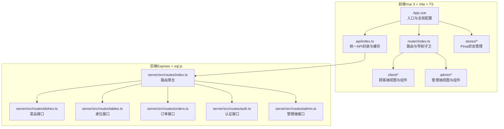
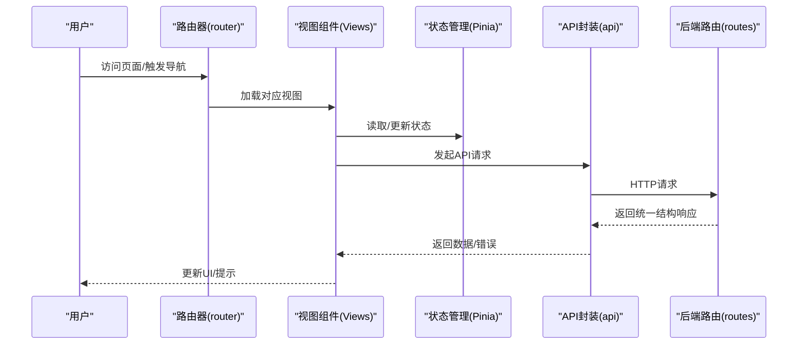
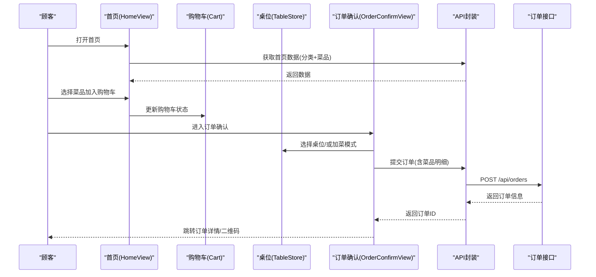
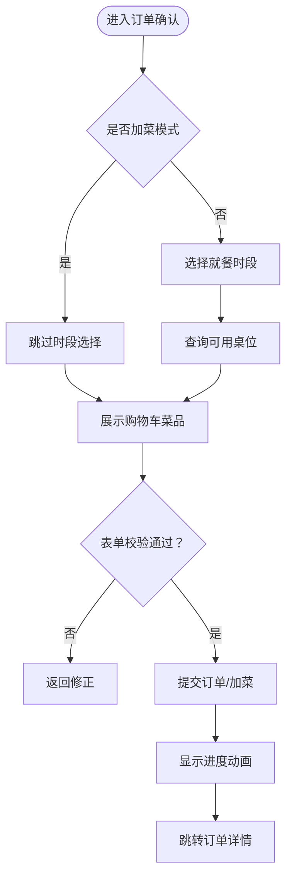
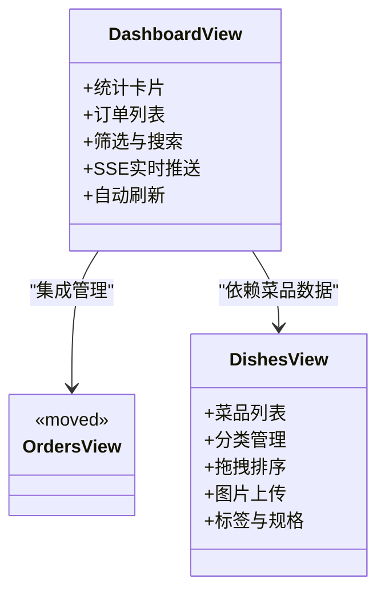
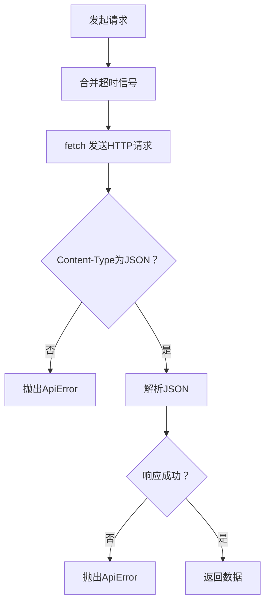
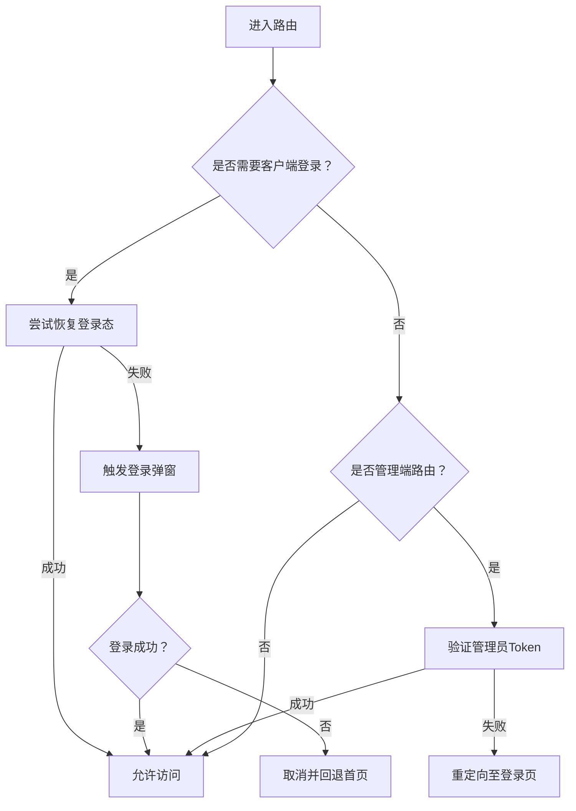
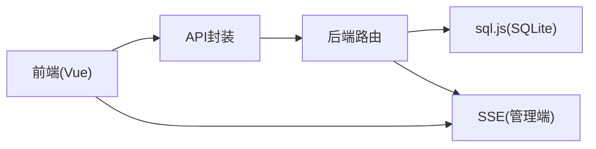

# 核心功能模块

<cite>
**本文档引用的文件**
- [README.md](file://README.md)
- [main.ts](file://src/main.ts)
- [router/index.ts](file://src/router/index.ts)
- [api/index.ts](file://src/api/index.ts)
- [stores/cart.ts](file://src/stores/cart.ts)
- [stores/clientAuth.ts](file://src/stores/clientAuth.ts)
- [stores/table.ts](file://src/stores/table.ts)
- [client/views/HomeView.vue](file://src/client/views/HomeView.vue)
- [client/views/OrderConfirmView.vue](file://src/client/views/OrderConfirmView.vue)
- [admin/views/DashboardView.vue](file://src/admin/views/DashboardView.vue)
- [admin/views/DishesView.vue](file://src/admin/views/DishesView.vue)
- [routes/index.ts](file://server/src/routes/index.ts)
- [package.json](file://package.json)
</cite>

## 目录
1. [引言](#引言)
2. [项目结构](#项目结构)
3. [核心组件](#核心组件)
4. [架构总览](#架构总览)
5. [详细组件分析](#详细组件分析)
6. [依赖分析](#依赖分析)
7. [性能考虑](#性能考虑)
8. [故障排除指南](#故障排除指南)
9. [结论](#结论)
10. [附录](#附录)

## 引言
本文件面向RLRMS（红灯笼食府管理系统）的核心功能模块，围绕“顾客自助点餐”与“管理后台”两大体系，系统性阐述从菜品浏览、购物车管理、订单确认、订单跟踪到管理端的桌位管理、菜品管理、订单处理、库存管理、用户管理等完整业务闭环。文档不仅解释各模块的业务逻辑与数据处理机制，还提供用户交互流程、功能关联关系与数据流转过程，并给出用户体验设计考量与扩展定制建议。

## 项目结构
系统采用前后端分离架构，前端使用Vue 3 + Vite + TypeScript，后端基于Express + sql.js（SQLite的JavaScript实现）。前端分为顾客端（client）与管理端（admin）两套UI与路由体系；后端提供REST风格API，按模块拆分路由（dishes、tables、orders、auth、admin）。

**图表来源**
- [main.ts:1-37](file://src/main.ts#L1-L37)
- [router/index.ts:1-317](file://src/router/index.ts#L1-L317)
- [api/index.ts:1-608](file://src/api/index.ts#L1-L608)
- [routes/index.ts:1-18](file://server/src/routes/index.ts#L1-L18)

**章节来源**
- [README.md:61-174](file://README.md#L61-L174)
- [package.json:1-64](file://package.json#L1-L64)

## 核心组件
- 路由与导航守卫：负责顾客端与管理端的页面路由、登录态校验与页面预取优化。
- API封装：统一请求、响应处理、错误拦截、缓存策略与可取消请求能力。
- 状态管理：购物车、桌位选择、客户端认证等状态持久化与跨组件共享。
- 顾客端视图：首页菜品浏览、菜品详情、购物车、订单确认、订单跟踪等。
- 管理端视图：仪表盘、菜品管理、订单管理（通过仪表盘集成）、库存管理、用户管理等。

**章节来源**
- [router/index.ts:19-317](file://src/router/index.ts#L19-L317)
- [api/index.ts:1-608](file://src/api/index.ts#L1-L608)
- [stores/cart.ts:1-175](file://src/stores/cart.ts#L1-L175)
- [stores/table.ts:1-25](file://src/stores/table.ts#L1-L25)
- [stores/clientAuth.ts:1-87](file://src/stores/clientAuth.ts#L1-L87)

## 架构总览
系统采用“前端SPA + 后端REST API”的典型现代Web架构。前端通过API层与后端交互，后端路由按模块划分，统一返回统一结构的响应体。管理端通过SSE实现实时事件推送，提升运营效率。

**图表来源**
- [router/index.ts:201-277](file://src/router/index.ts#L201-L277)
- [api/index.ts:54-114](file://src/api/index.ts#L54-L114)
- [routes/index.ts:1-18](file://server/src/routes/index.ts#L1-L18)

## 详细组件分析

### 顾客自助点餐流程
涵盖从进入系统、浏览菜品、加入购物车、选择桌位、提交订单到订单跟踪的完整闭环。

**图表来源**
- [client/views/HomeView.vue:68-210](file://src/client/views/HomeView.vue#L68-L210)
- [client/views/OrderConfirmView.vue:108-231](file://src/client/views/OrderConfirmView.vue#L108-L231)
- [stores/cart.ts:1-175](file://src/stores/cart.ts#L1-L175)
- [stores/table.ts:1-25](file://src/stores/table.ts#L1-L25)
- [api/index.ts:186-243](file://src/api/index.ts#L186-L243)
- [routes/index.ts:10-14](file://server/src/routes/index.ts#L10-L14)

**章节来源**
- [client/views/HomeView.vue:1-867](file://src/client/views/HomeView.vue#L1-L867)
- [client/views/OrderConfirmView.vue:1-981](file://src/client/views/OrderConfirmView.vue#L1-L981)
- [stores/cart.ts:1-175](file://src/stores/cart.ts#L1-L175)
- [stores/table.ts:1-25](file://src/stores/table.ts#L1-L25)
- [api/index.ts:186-243](file://src/api/index.ts#L186-L243)

### 订单确认与加菜流程
- 正常下单：选择就餐时段、可用桌位、填写联系人与手机号，提交订单，展示进度动画，跳转订单详情。
- 加菜模式：针对已有订单追加菜品，走更新订单接口，完成后跳转对应订单详情。

**图表来源**
- [client/views/OrderConfirmView.vue:108-231](file://src/client/views/OrderConfirmView.vue#L108-L231)
- [api/index.ts:186-243](file://src/api/index.ts#L186-L243)

**章节来源**
- [client/views/OrderConfirmView.vue:1-981](file://src/client/views/OrderConfirmView.vue#L1-L981)
- [api/index.ts:186-243](file://src/api/index.ts#L186-L243)

### 管理后台核心功能
- 仪表盘：今日订单、收入、待处理订单、可用桌位统计；支持订单查询、筛选、自动刷新与SSE实时推送。
- 菜品管理：菜品增删改查、分类管理、拖拽排序、图片上传、标签与规格维护。
- 订单管理：通过仪表盘直接管理订单状态、查看详情、搜索订单。
- 库存管理：原材料库存监控、预警阈值、出入库记录与排序。
- 用户管理：管理员/顾客账号管理、密码重置。
- 系统设置：店铺信息、数据导入导出、重置数据库、清空历史订单。

**图表来源**
- [admin/views/DashboardView.vue:1-1449](file://src/admin/views/DashboardView.vue#L1-L1449)
- [admin/views/DishesView.vue:1-1162](file://src/admin/views/DishesView.vue#L1-L1162)
- [admin/views/OrdersView.vue:1-16](file://src/admin/views/OrdersView.vue#L1-L16)

**章节来源**
- [admin/views/DashboardView.vue:1-1449](file://src/admin/views/DashboardView.vue#L1-L1449)
- [admin/views/DishesView.vue:1-1162](file://src/admin/views/DishesView.vue#L1-L1162)
- [admin/views/OrdersView.vue:1-16](file://src/admin/views/OrdersView.vue#L1-L16)

### API封装与缓存策略
- 统一请求：封装fetch，自动携带Cookie、超时控制、AbortController支持。
- 错误处理：统一解析响应、拦截401并触发全局登录过期事件。
- 缓存策略：stale-while-revalidate，首页数据与分类数据带TTL缓存，提升首屏性能。
- 取消请求：提供可取消请求工厂，避免竞态与内存泄漏。

**图表来源**
- [api/index.ts:54-114](file://src/api/index.ts#L54-L114)

**章节来源**
- [api/index.ts:1-608](file://src/api/index.ts#L1-L608)

### 路由与导航守卫
- 顾客端保护：对需要登录的页面（如订单确认、全部订单、设置）进行登录态校验，支持从Cookie恢复登录。
- 管理端保护：对管理端路由进行鉴权，未登录重定向至登录页。
- 性能优化：关键路由与相关页面预加载，提升首屏与跳转体验。

**图表来源**
- [router/index.ts:201-277](file://src/router/index.ts#L201-L277)

**章节来源**
- [router/index.ts:1-317](file://src/router/index.ts#L1-L317)

## 依赖分析
- 前端依赖：Vue 3、Pinia、Vue Router、Lucide Vue Next、Zod、vuedraggable等。
- 后端依赖：Express、sql.js、JWT、bcryptjs、QRCode、JsBarcode、Multer、Sharp、Archiver、AdmZip、Cookie-parser、Compression、Uuid等。
- 关键耦合点：前端通过统一API封装与后端路由通信；管理端通过SSE与后端建立长连接；路由守卫保障访问权限。

**图表来源**
- [package.json:16-41](file://package.json#L16-L41)
- [routes/index.ts:1-18](file://server/src/routes/index.ts#L1-L18)

**章节来源**
- [package.json:1-64](file://package.json#L1-L64)
- [routes/index.ts:1-18](file://server/src/routes/index.ts#L1-L18)

## 性能考虑
- 首屏优化：关键路由组件预加载与页面预取，减少白屏时间。
- 数据缓存：首页与分类数据采用stale-while-revalidate缓存策略，降低重复请求成本。
- 网络健壮性：请求超时与可取消能力，避免长时间挂起与竞态问题。
- 图片优化：后端对上传图片进行压缩与WebP转换，前端懒加载与骨架屏提升感知性能。
- SSE降级：SSE断开后自动启用轮询，保证实时性与稳定性。

[本节为通用性能建议，无需特定文件引用]

## 故障排除指南
- 登录态失效：401时前端会派发auth:expired事件，触发全局登录过期提示与路由跳转。
- 网络异常：统一错误捕获与Toast提示，检查网络与后端服务状态。
- SSE断线：自动重连与轮询降级，关注断线提示与自动刷新开关。
- 数据一致性：管理端批量操作（排序、删除）失败时，前端会回滚UI并提示错误。

**章节来源**
- [api/index.ts:94-114](file://src/api/index.ts#L94-L114)
- [admin/views/DashboardView.vue:308-446](file://src/admin/views/DashboardView.vue#L308-L446)

## 结论
RLRMS通过清晰的模块划分与前后端协作，实现了从顾客自助点餐到管理后台的完整业务闭环。前端以用户体验为中心，后端以数据安全与可运维为目标，配合SSE实时推送与缓存策略，在保证功能完整性的同时兼顾性能与可扩展性。开发者可在现有API与状态管理基础上，按需扩展新功能模块并保持一致的交互与数据处理规范。

## 附录
- 默认管理员账号：用户名admin，密码admin123（首次登录建议修改密码）。
- 开发与部署：提供集成/分离两种开发模式、Docker部署、Nginx/Apache反向代理与PM2进程管理配置。
- 数据模型：用户、桌位、菜品、订单、分类、库存、系统设置等核心实体与字段说明详见README数据模型章节。

**章节来源**
- [README.md:485-491](file://README.md#L485-L491)
- [README.md:510-578](file://README.md#L510-L578)
- [README.md:407-483](file://README.md#L407-L483)