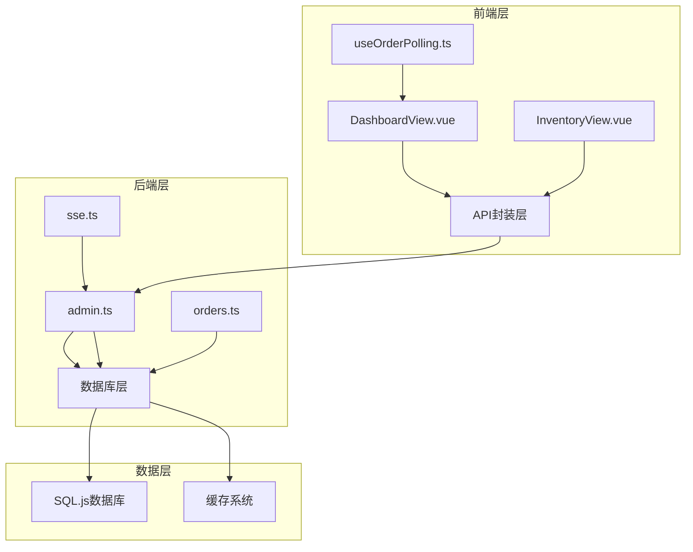
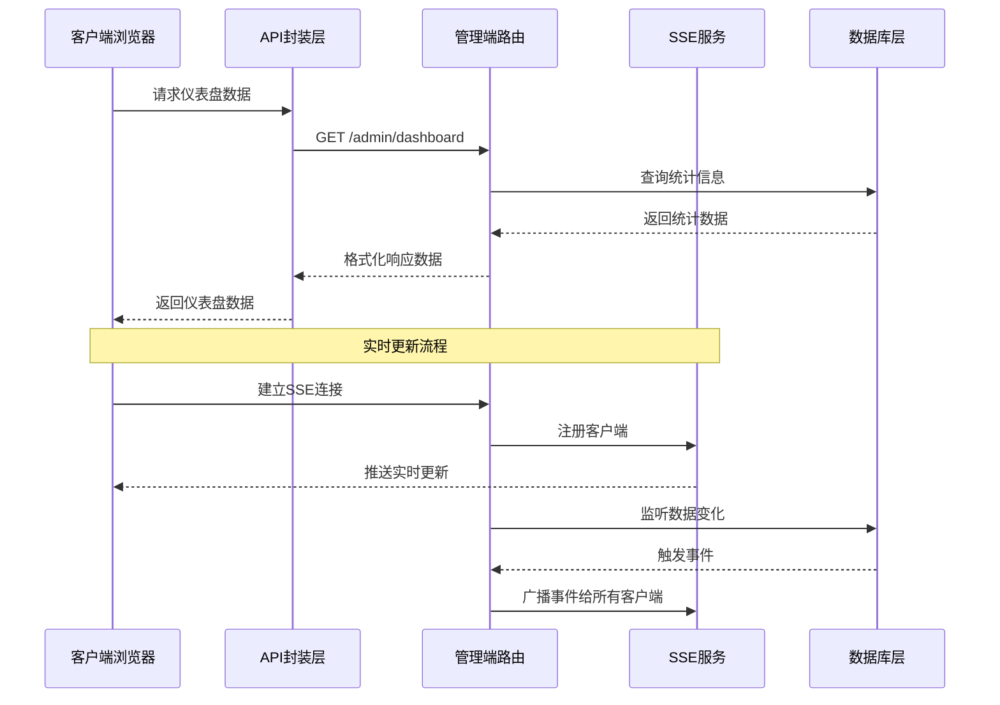
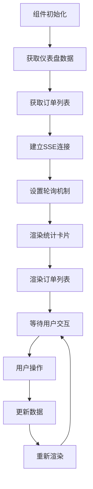
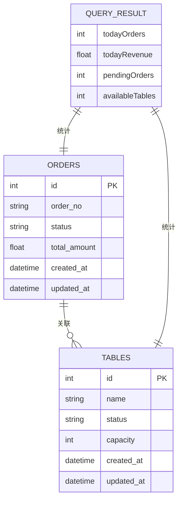
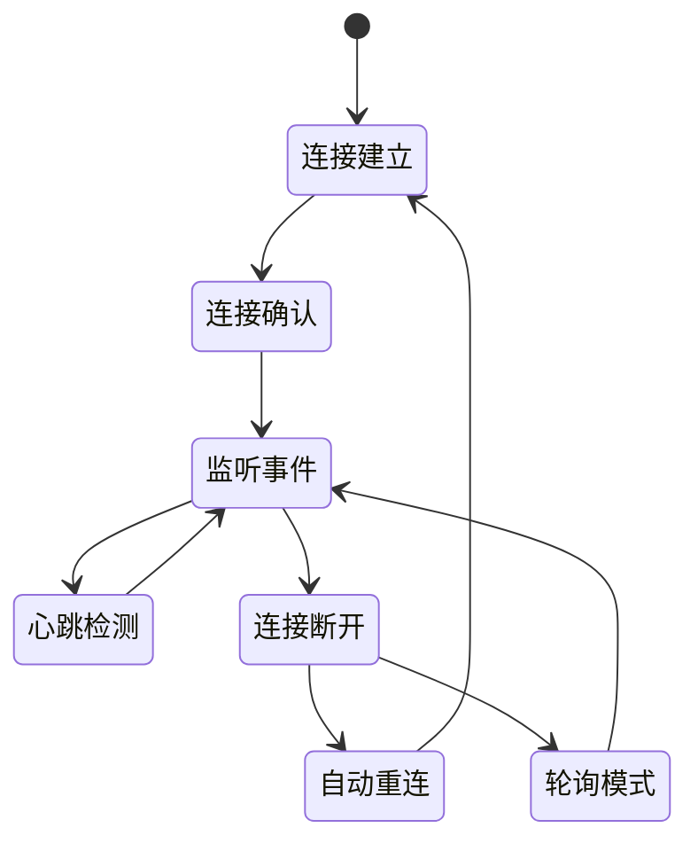
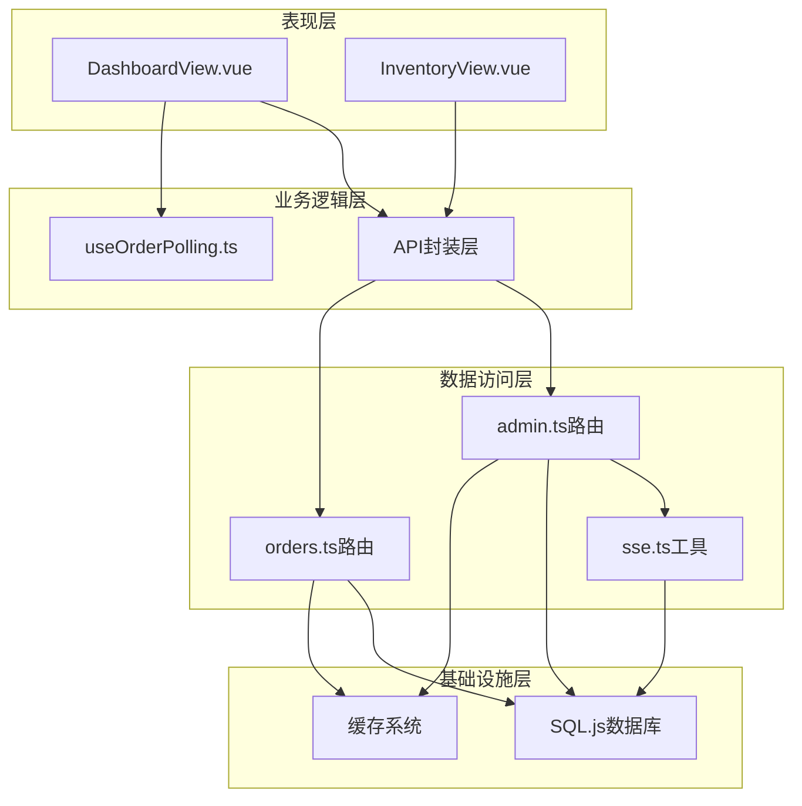

# 仪表盘概览

<cite>
**本文档引用的文件**
- [DashboardView.vue](file://src/admin/views/DashboardView.vue)
- [admin.ts](file://server/src/routes/admin.ts)
- [orders.ts](file://server/src/routes/orders.ts)
- [index.ts](file://server/src/db/index.ts)
- [sse.ts](file://server/src/utils/sse.ts)
- [index.ts](file://src/api/index.ts)
- [useOrderPolling.ts](file://src/shared/composables/useOrderPolling.ts)
- [index.ts](file://src/types/index.ts)
- [InventoryView.vue](file://src/admin/views/InventoryView.vue)
</cite>

## 目录
1. [简介](#简介)
2. [项目结构](#项目结构)
3. [核心组件](#核心组件)
4. [架构概览](#架构概览)
5. [详细组件分析](#详细组件分析)
6. [依赖关系分析](#依赖关系分析)
7. [性能考虑](#性能考虑)
8. [故障排除指南](#故障排除指南)
9. [结论](#结论)

## 简介

RLRMS仪表盘概览功能是一个综合性的餐厅管理系统控制面板，为管理员提供实时的业务洞察和操作界面。该功能集成了数据统计模块、实时监控图表、关键指标展示等核心特性，能够帮助管理者快速了解餐厅运营状况并进行有效决策。

仪表盘概览功能具有以下关键特点：
- **实时数据更新**：通过SSE和轮询机制实现实时数据同步
- **多维度统计**：涵盖订单、收入、库存等多个业务指标
- **响应式设计**：适配不同屏幕尺寸的设备访问
- **交互式操作**：支持订单状态管理和库存预警
- **数据可视化**：直观展示关键业务指标和趋势

## 项目结构

仪表盘概览功能采用前后端分离的架构设计，主要由以下组件构成：

**图表来源**
- [DashboardView.vue:1-50](file://src/admin/views/DashboardView.vue#L1-L50)
- [admin.ts:164-219](file://server/src/routes/admin.ts#L164-L219)
- [index.ts:1-156](file://server/src/db/index.ts#L1-L156)

**章节来源**
- [DashboardView.vue:1-100](file://src/admin/views/DashboardView.vue#L1-L100)
- [admin.ts:1-50](file://server/src/routes/admin.ts#L1-L50)

## 核心组件

仪表盘概览功能的核心组件包括数据统计模块、订单管理界面、实时监控系统和库存预警模块。

### 数据统计模块

数据统计模块负责收集和展示关键业务指标，主要包括：

- **今日订单数**：统计当天产生的订单总数
- **今日收入**：计算当日已完成订单的总收入
- **待处理订单**：显示当前等待处理的订单数量
- **可用桌位**：统计当前可使用的餐桌数量

这些指标通过单一查询语句高效获取，确保数据的一致性和实时性。

### 订单管理界面

订单管理界面提供完整的订单生命周期管理功能：

- **订单列表展示**：以卡片形式展示最近的订单信息
- **状态筛选**：支持按订单状态进行筛选
- **日期范围筛选**：支持按时间范围查看订单
- **订单详情**：提供订单的详细信息和操作界面

### 实时监控系统

系统采用双通道实时更新机制：

- **SSE推送**：服务器向客户端推送实时数据更新
- **轮询降级**：当SSE连接异常时自动切换到轮询模式
- **智能刷新**：根据连接状态动态调整刷新频率

### 库存预警模块

库存预警功能帮助管理者及时发现库存不足的情况：

- **库存监控**：实时跟踪物料库存水平
- **预警阈值**：基于预设阈值触发库存预警
- **可视化提醒**：通过颜色和图标直观显示库存状态

**章节来源**
- [DashboardView.vue:144-241](file://src/admin/views/DashboardView.vue#L144-L241)
- [admin.ts:164-219](file://server/src/routes/admin.ts#L164-L219)
- [InventoryView.vue:127-129](file://src/admin/views/InventoryView.vue#L127-L129)

## 架构概览

仪表盘概览功能采用现代化的前后端分离架构，实现了高可用性和可扩展性。

**图表来源**
- [DashboardView.vue:302-412](file://src/admin/views/DashboardView.vue#L302-L412)
- [admin.ts:133-162](file://server/src/routes/admin.ts#L133-L162)
- [sse.ts:15-51](file://server/src/utils/sse.ts#L15-L51)

系统架构的关键优势：

1. **实时性保障**：SSE提供低延迟的实时数据推送
2. **容错机制**：自动降级到轮询模式确保服务连续性
3. **性能优化**：数据库查询优化和缓存策略提升响应速度
4. **扩展性设计**：模块化架构便于功能扩展和维护

## 详细组件分析

### 仪表盘视图组件

DashboardView.vue是仪表盘的核心视图组件，负责渲染所有UI元素和处理用户交互。

#### 数据流处理

组件采用响应式数据绑定和计算属性来管理数据状态：

**图表来源**
- [DashboardView.vue:448-460](file://src/admin/views/DashboardView.vue#L448-L460)

#### 实时更新机制

系统实现了智能的实时更新策略：

- **SSE优先**：优先使用服务器推送技术
- **轮询降级**：SSE断开时自动切换到轮询
- **连接状态监控**：实时监控SSE连接状态
- **自动重连**：断线后自动尝试重新连接

#### 用户交互功能

组件支持多种用户交互场景：

- **订单状态管理**：支持确认、完成、取消订单操作
- **订单查询**：提供订单号搜索功能
- **筛选功能**：支持按状态和日期范围筛选
- **批量操作**：支持清空已完成订单

**章节来源**
- [DashboardView.vue:144-460](file://src/admin/views/DashboardView.vue#L144-L460)
- [DashboardView.vue:414-446](file://src/admin/views/DashboardView.vue#L414-L446)

### 后端数据处理

后端通过admin.ts路由处理所有仪表盘相关的数据请求。

#### 统计数据聚合

系统通过单一查询语句聚合多个统计指标：

**图表来源**
- [admin.ts:167-179](file://server/src/routes/admin.ts#L167-L179)

#### 数据一致性保证

系统采用事务处理确保数据一致性：

- **原子性操作**：订单状态更新在单个事务中完成
- **并发控制**：防止多个客户端同时修改同一订单
- **数据验证**：严格的输入验证和业务规则检查

**章节来源**
- [admin.ts:164-219](file://server/src/routes/admin.ts#L164-L219)

### 数据库层设计

数据库层采用SQLite的WebAssembly实现，提供高性能的本地存储解决方案。

#### 数据模型设计

系统的核心数据模型包括：

- **订单表**：存储订单基本信息和状态
- **订单项表**：存储订单中菜品的详细信息
- **桌位表**：管理餐厅桌位状态
- **库存表**：跟踪物料库存和预警阈值

#### 性能优化策略

数据库层实施了多项性能优化措施：

- **批量操作**：使用事务批量处理多个操作
- **查询优化**：针对常用查询建立索引
- **内存管理**：智能的内存分配和垃圾回收
- **持久化策略**：定期保存数据库状态到文件系统

**章节来源**
- [index.ts:100-156](file://server/src/db/index.ts#L100-L156)

### 实时通信机制

系统采用Server-Sent Events (SSE) 实现高效的双向通信。

#### SSE连接管理

**图表来源**
- [DashboardView.vue:302-412](file://src/admin/views/DashboardView.vue#L302-L412)

#### 事件类型定义

系统支持多种事件类型的实时推送：

- **new_order**：新订单创建事件
- **order_updated**：订单状态更新事件
- **order_deleted**：订单删除事件
- **connected**：客户端连接确认事件

**章节来源**
- [sse.ts:15-59](file://server/src/utils/sse.ts#L15-L59)
- [orders.ts:342-343](file://server/src/routes/orders.ts#L342-L343)

## 依赖关系分析

仪表盘概览功能的依赖关系体现了清晰的分层架构设计。

**图表来源**
- [DashboardView.vue:1-12](file://src/admin/views/DashboardView.vue#L1-L12)
- [useOrderPolling.ts:1-8](file://src/shared/composables/useOrderPolling.ts#L1-L8)

### 关键依赖关系

1. **组件依赖**：DashboardView.vue依赖API封装层和轮询组合式函数
2. **路由依赖**：管理端路由依赖SSE工具和数据库访问层
3. **数据依赖**：所有数据操作最终依赖于SQL.js数据库
4. **工具依赖**：SSE工具为实时通信提供基础设施支持

### 循环依赖检测

系统设计避免了循环依赖问题：
- 前端组件只依赖API封装层，不反向依赖后端
- 后端路由层专注于数据处理，不直接依赖前端组件
- 工具层提供独立的功能模块，可被多个组件共享

**章节来源**
- [index.ts:1-18](file://server/src/routes/index.ts#L1-L18)
- [types/index.ts:117-124](file://src/types/index.ts#L117-L124)

## 性能考虑

仪表盘概览功能在设计时充分考虑了性能优化，采用了多种策略来确保系统的高效运行。

### 数据查询优化

系统通过优化的SQL查询减少数据库负载：

- **单一查询聚合**：使用一条查询获取所有统计指标
- **索引优化**：为常用查询字段建立索引
- **批量操作**：使用事务批量处理多个数据库操作
- **缓存策略**：对静态数据和频繁访问的数据进行缓存

### 实时更新优化

实时通信机制采用了多项优化措施：

- **连接池管理**：有效管理SSE客户端连接
- **心跳机制**：定期发送心跳包维持连接稳定
- **断线重连**：智能的自动重连机制
- **背压处理**：防止消息积压导致的性能问题

### 前端性能优化

前端组件实现了多项性能优化策略：

- **懒加载**：使用异步组件实现按需加载
- **虚拟滚动**：对长列表使用虚拟滚动技术
- **防抖处理**：对高频操作进行防抖优化
- **内存管理**：及时清理不再使用的资源

### 缓存策略

系统采用了多层次的缓存策略：

- **API缓存**：前端API层实现30秒TTL的缓存
- **数据库缓存**：对查询结果进行缓存
- **静态资源缓存**：利用浏览器缓存静态资源
- **内存缓存**：使用内存存储临时数据

**章节来源**
- [api/index.ts:9-34](file://src/api/index.ts#L9-L34)
- [DashboardView.vue:302-412](file://src/admin/views/DashboardView.vue#L302-L412)

## 故障排除指南

仪表盘概览功能可能遇到的各种问题及其解决方案：

### 实时连接问题

**问题现象**：订单状态更新不及时或完全无响应

**可能原因**：
- SSE连接断开
- 网络环境不稳定
- 服务器负载过高

**解决步骤**：
1. 检查浏览器开发者工具的Network标签页
2. 确认SSE连接状态指示器
3. 查看控制台是否有JavaScript错误
4. 验证服务器日志中的SSE连接信息

### 数据显示异常

**问题现象**：仪表盘数据显示不准确或延迟

**可能原因**：
- 缓存数据过期
- 数据库查询超时
- 前端数据绑定问题

**解决步骤**：
1. 强制刷新页面清除缓存
2. 检查数据库连接状态
3. 验证API响应数据格式
4. 查看浏览器控制台错误信息

### 性能问题

**问题现象**：页面加载缓慢或操作响应迟缓

**可能原因**：
- 数据量过大
- 查询复杂度高
- 前端渲染压力大

**解决步骤**：
1. 使用浏览器性能分析工具
2. 检查网络请求耗时
3. 优化数据库查询
4. 实施数据分页和懒加载

### 权限问题

**问题现象**：无法访问某些功能或看到完整数据

**可能原因**：
- 用户权限不足
- 会话过期
- Cookie设置问题

**解决步骤**：
1. 检查用户角色和权限
2. 重新登录系统
3. 验证Cookie配置
4. 清除浏览器缓存

**章节来源**
- [DashboardView.vue:375-390](file://src/admin/views/DashboardView.vue#L375-L390)
- [api/index.ts:94-114](file://src/api/index.ts#L94-L114)

## 结论

RLRMS仪表盘概览功能通过精心设计的架构和优化的实现，为餐厅管理提供了强大而实用的工具。该功能不仅满足了基本的数据展示需求，更重要的是提供了实时监控、智能预警和高效操作等高级特性。

### 主要成就

1. **实时性保障**：通过SSE和轮询双重机制确保数据实时更新
2. **用户体验优化**：响应式设计和流畅的交互体验
3. **性能稳定性**：多层优化策略确保系统高效运行
4. **可扩展性设计**：模块化架构便于功能扩展和维护

### 技术亮点

- **双通道通信**：SSE与轮询的智能切换机制
- **智能缓存**：多层次缓存策略提升性能
- **数据一致性**：事务处理确保数据完整性
- **错误处理**：完善的异常处理和降级机制

### 未来改进方向

1. **移动端优化**：进一步优化移动设备上的用户体验
2. **图表可视化**：集成更多数据可视化图表
3. **报表功能**：增强数据分析和报表生成功能
4. **通知系统**：完善多渠道的通知提醒机制

该仪表盘概览功能为RLRMS系统奠定了坚实的基础，为餐厅管理提供了现代化的技术支撑。