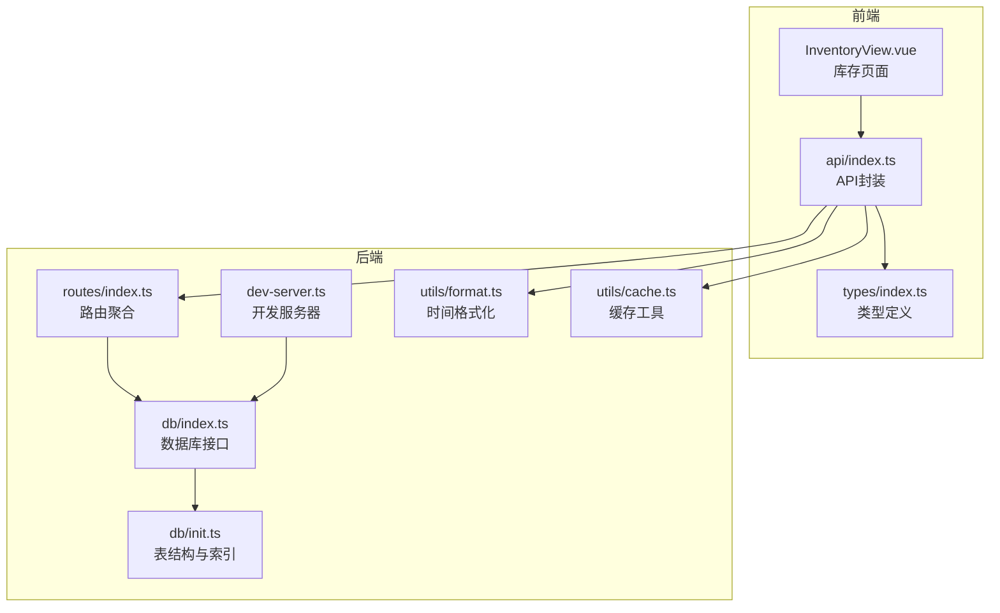
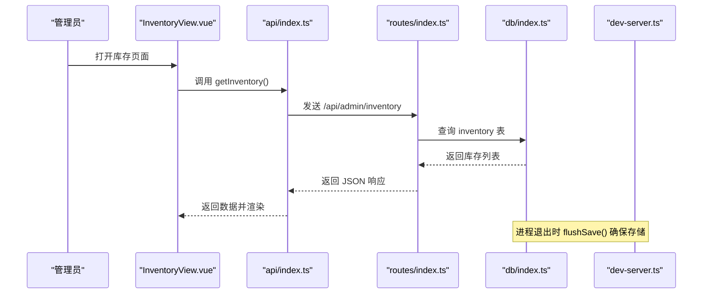
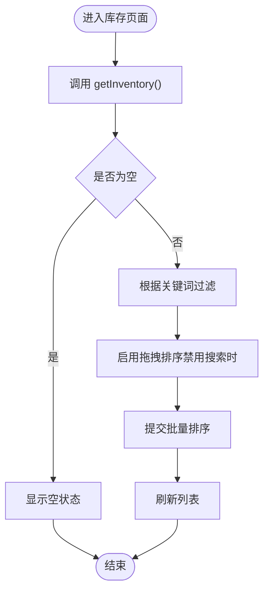
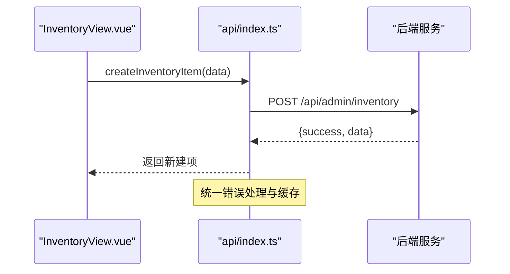
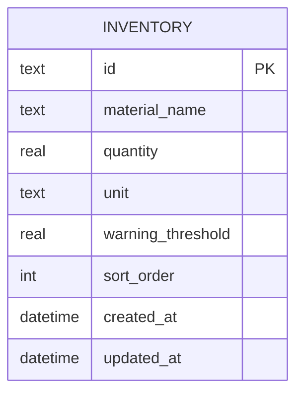
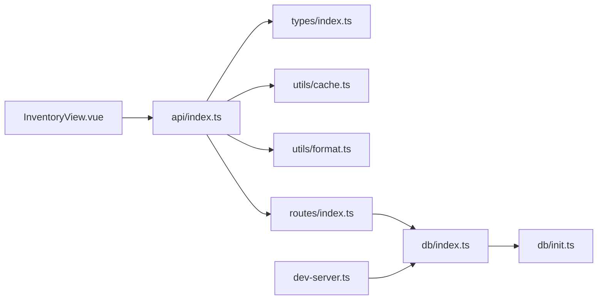

# 库存管理

<cite>
**本文引用的文件**
- [InventoryView.vue](file://src/admin/views/InventoryView.vue)
- [api/index.ts](file://src/api/index.ts)
- [types/index.ts](file://src/types/index.ts)
- [db/index.ts](file://server/src/db/index.ts)
- [db/init.ts](file://server/src/db/init.ts)
- [routes/index.ts](file://server/src/routes/index.ts)
- [dev-server.ts](file://server/src/dev-server.ts)
- [format.ts](file://server/src/utils/format.ts)
- [cache.ts](file://server/src/utils/cache.ts)
- [README.md](file://README.md)
</cite>

## 目录
1. [简介](#简介)
2. [项目结构](#项目结构)
3. [核心组件](#核心组件)
4. [架构总览](#架构总览)
5. [详细组件分析](#详细组件分析)
6. [依赖关系分析](#依赖关系分析)
7. [性能考量](#性能考量)
8. [故障排查指南](#故障排查指南)
9. [结论](#结论)
10. [附录](#附录)

## 简介
本文件面向RLRMS系统的库存管理功能，围绕“入库管理、出库记录、库存盘点、预警设置”展开，结合前端界面、API封装、数据库设计与后端路由，系统性阐述库存数据模型、交互流程、数据一致性保障与性能优化策略。同时补充库存搜索过滤、批量排序、报表生成思路、安全阈值与自动提醒、采购建议生成、数据导入导出、备份与审计日志、以及性能优化方案。

## 项目结构
- 前端管理端库存页面负责展示与交互，调用统一API封装进行增删改查与排序。
- API封装层提供库存相关接口方法，统一错误处理与缓存策略。
- 后端数据库采用SQLite（sql.js）持久化，提供批量事务、防抖落盘与索引优化。
- 路由聚合器集中挂载管理端API，库存接口位于/admin/inventory系列路径。

**图表来源**
- [InventoryView.vue:1-507](file://src/admin/views/InventoryView.vue#L1-L507)
- [api/index.ts:1-608](file://src/api/index.ts#L1-L608)
- [types/index.ts:1-133](file://src/types/index.ts#L1-L133)
- [routes/index.ts:1-18](file://server/src/routes/index.ts#L1-L18)
- [db/index.ts:1-156](file://server/src/db/index.ts#L1-L156)
- [db/init.ts:1-204](file://server/src/db/init.ts#L1-L204)
- [dev-server.ts:1-18](file://server/src/dev-server.ts#L1-L18)
- [format.ts:1-12](file://server/src/utils/format.ts#L1-L12)
- [cache.ts:1-73](file://server/src/utils/cache.ts#L1-L73)

**章节来源**
- [README.md:61-174](file://README.md#L61-L174)
- [routes/index.ts:1-18](file://server/src/routes/index.ts#L1-L18)
- [db/index.ts:1-156](file://server/src/db/index.ts#L1-L156)
- [db/init.ts:1-204](file://server/src/db/init.ts#L1-L204)

## 核心组件
- 库存页面组件：负责加载库存列表、搜索过滤、拖拽排序、新增/编辑/删除、低库存高亮与确认对话框。
- API封装：提供库存查询、创建、更新、删除、批量排序等方法；内置前端缓存与超时控制；统一处理401与非JSON响应。
- 数据模型：InventoryItem包含物料名称、数量、单位、预警阈值、排序字段与时间戳。
- 数据库：inventory表包含上述字段，支持sort_order列；索引覆盖常用查询场景；提供批量事务与防抖落盘。

**章节来源**
- [InventoryView.vue:14-133](file://src/admin/views/InventoryView.vue#L14-L133)
- [api/index.ts:399-428](file://src/api/index.ts#L399-L428)
- [types/index.ts:99-108](file://src/types/index.ts#L99-L108)
- [db/init.ts:97-114](file://server/src/db/init.ts#L97-L114)
- [db/index.ts:100-147](file://server/src/db/index.ts#L100-L147)

## 架构总览
库存管理从前端页面发起请求，经API封装层统一处理，再由后端路由分发至数据库层，最终落盘到SQLite文件。开发服务器在进程退出时确保防抖缓冲区数据落盘，避免丢失。

**图表来源**
- [InventoryView.vue:52-63](file://src/admin/views/InventoryView.vue#L52-L63)
- [api/index.ts:399-401](file://src/api/index.ts#L399-L401)
- [routes/index.ts:16-18](file://server/src/routes/index.ts#L16-L18)
- [db/index.ts:149-156](file://server/src/db/index.ts#L149-L156)
- [dev-server.ts:15-18](file://server/src/dev-server.ts#L15-L18)

## 详细组件分析

### 前端库存页面（InventoryView.vue）
- 数据加载：mounted时调用api.getInventory()拉取列表，异常时提示toast。
- 搜索过滤：基于material_name进行大小写无关的包含匹配，支持清空恢复。
- 低库存高亮：当quantity ≤ warning_threshold时，行边框与背景高亮。
- 拖拽排序：禁用搜索状态下拖拽，结束后调用reorderInventory批量更新sort_order。
- 新增/编辑：表单包含material_name、quantity、unit、warning_threshold；编辑时禁用部分字段。
- 删除确认：二次确认对话框，成功后刷新列表。

**图表来源**
- [InventoryView.vue:29-50](file://src/admin/views/InventoryView.vue#L29-L50)
- [InventoryView.vue:166-176](file://src/admin/views/InventoryView.vue#L166-L176)
- [InventoryView.vue:423-428](file://src/admin/views/InventoryView.vue#L423-L428)

**章节来源**
- [InventoryView.vue:14-133](file://src/admin/views/InventoryView.vue#L14-L133)
- [InventoryView.vue:166-214](file://src/admin/views/InventoryView.vue#L166-L214)

### API封装（api/index.ts）
- 库存接口：getInventory、createInventoryItem、updateInventoryItem、deleteInventoryItem、reorderInventory。
- 错误处理：统一捕获401、非JSON响应、业务错误，抛出ApiError并触发全局会话过期事件。
- 缓存策略：stale-while-revalidate，提升弱网与重复请求体验。
- 数据导入导出：exportData与importData，支持ZIP打包/解包与文件名解析。

**图表来源**
- [api/index.ts:403-408](file://src/api/index.ts#L403-L408)
- [api/index.ts:84-114](file://src/api/index.ts#L84-L114)
- [api/index.ts:17-34](file://src/api/index.ts#L17-L34)

**章节来源**
- [api/index.ts:399-428](file://src/api/index.ts#L399-L428)
- [api/index.ts:509-549](file://src/api/index.ts#L509-L549)
- [api/index.ts:556-595](file://src/api/index.ts#L556-L595)

### 数据模型与数据库（types/index.ts、db/init.ts、db/index.ts）
- 数据模型：InventoryItem包含id、material_name、quantity、unit、warning_threshold、sort_order、created_at、updated_at。
- 表结构：inventory表具备唯一索引与排序列；初始化脚本创建表并回填sort_order。
- 索引优化：对常用查询建立索引，降低查询延迟。
- 写入优化：run()后scheduleSave()进行防抖落盘；beginBatch()/endBatch()支持批量事务一次性落盘。
- 时间格式：formatDateTime用于统一时间字符串格式，便于前端展示与日志审计。

**图表来源**
- [types/index.ts:99-108](file://src/types/index.ts#L99-L108)
- [db/init.ts:97-114](file://server/src/db/init.ts#L97-L114)

**章节来源**
- [types/index.ts:99-108](file://src/types/index.ts#L99-L108)
- [db/init.ts:97-137](file://server/src/db/init.ts#L97-L137)
- [db/index.ts:36-73](file://server/src/db/index.ts#L36-L73)
- [format.ts:1-12](file://server/src/utils/format.ts#L1-L12)

### 后端路由与开发服务器（routes/index.ts、dev-server.ts）
- 路由聚合：/api/admin下挂载管理端接口，库存接口位于/admin/inventory系列。
- 开发服务器：监听端口并初始化数据库；进程退出信号(SIGTERM/SIGINT)触发flushSave()确保落盘。

**章节来源**
- [routes/index.ts:16-18](file://server/src/routes/index.ts#L16-L18)
- [dev-server.ts:5-18](file://server/src/dev-server.ts#L5-L18)

## 依赖关系分析
- 前端依赖：InventoryView.vue依赖api封装；api封装依赖类型定义；开发服务器依赖数据库接口。
- 后端依赖：路由依赖数据库接口；数据库接口依赖初始化脚本；开发服务器依赖数据库接口。
- 缓存与格式化：API封装使用缓存工具与时间格式化工具，提升性能与一致性。

**图表来源**
- [InventoryView.vue:1-10](file://src/admin/views/InventoryView.vue#L1-L10)
- [api/index.ts:1-15](file://src/api/index.ts#L1-L15)
- [cache.ts:1-73](file://server/src/utils/cache.ts#L1-L73)
- [format.ts:1-12](file://server/src/utils/format.ts#L1-L12)
- [routes/index.ts:1-18](file://server/src/routes/index.ts#L1-L18)
- [db/index.ts:1-156](file://server/src/db/index.ts#L1-L156)
- [db/init.ts:1-204](file://server/src/db/init.ts#L1-L204)
- [dev-server.ts:1-18](file://server/src/dev-server.ts#L1-L18)

**章节来源**
- [README.md:267-406](file://README.md#L267-L406)

## 性能考量
- 写入优化：防抖落盘（SAVE_DEBOUNCE_MS）合并多次写入，减少磁盘IO；批量事务一次性落盘，避免频繁fsync。
- 查询优化：为订单、菜品、用户、桌位等建立索引，加速筛选与排序。
- 前端缓存：stale-while-revalidate策略降低重复请求与带宽消耗。
- 前端渲染：搜索过滤在前端进行，避免不必要的网络请求；拖拽排序禁用搜索状态，减少DOM重排。
- 时间格式：统一时间格式化，减少前端解析成本。

**章节来源**
- [db/index.ts:13-44](file://server/src/db/index.ts#L13-L44)
- [db/index.ts:63-73](file://server/src/db/index.ts#L63-L73)
- [db/init.ts:124-137](file://server/src/db/init.ts#L124-L137)
- [api/index.ts:17-34](file://src/api/index.ts#L17-L34)
- [format.ts:1-12](file://server/src/utils/format.ts#L1-L12)

## 故障排查指南
- 会话过期：API封装在401时触发全局事件，前端应监听并跳转登录页。
- 非JSON响应：API封装对content-type进行校验，防止HTML等非JSON响应导致解析错误。
- 数据库未初始化：确保先执行数据库初始化脚本，再启动服务。
- 写入丢失：开发服务器在进程退出时flushSave()，避免防抖缓冲未落盘。
- 低库存提醒：前端根据warning_threshold进行视觉提示，可在运营端增加通知渠道。

**章节来源**
- [api/index.ts:84-114](file://src/api/index.ts#L84-L114)
- [dev-server.ts:15-18](file://server/src/dev-server.ts#L15-L18)
- [db/index.ts:149-156](file://server/src/db/index.ts#L149-L156)

## 结论
RLRMS库存管理以简洁的前端页面与统一API封装为核心，配合SQLite数据库的批量事务与防抖落盘机制，实现了高效稳定的库存数据管理。通过预警阈值与低库存高亮，提升了运营可视性；通过搜索过滤与批量排序，改善了用户体验。未来可在现有基础上扩展出入库明细、盘点与损耗统计、报表生成、自动提醒与采购建议、以及更完善的审计日志与备份策略。

## 附录

### 库存管理功能清单与实现映射
- 入库管理：通过创建库存项与更新数量实现；支持单位与预警阈值设置。
- 出库记录：当前仓库未见专用“出库明细”表，建议在inventory表外增加order_items或专门的出入库流水表，以便追踪消耗与损耗。
- 库存盘点：当前未见盘点任务表，建议引入盘点任务与差异记录，结合库存项与流水表生成盘点报告。
- 预警设置：基于warning_threshold与当前quantity进行低库存高亮与提醒。
- 库存分类：当前inventory表未包含分类字段，建议增加category_id或tags字段，便于分类统计与报表。
- 供应商管理：当前未见供应商表，建议引入供应商表与采购订单关联，支撑采购建议与成本核算。
- 成本核算：当前未见成本字段，建议在inventory与order_items中增加成本字段，支持加权平均法或先进先出法。
- 损耗统计：建议在出入库流水表中增加损耗标识与原因字段，定期生成损耗报表。
- 搜索过滤：前端基于material_name进行过滤；后端可扩展为多字段过滤与分页。
- 批量操作：前端支持拖拽排序与批量排序提交；后端提供批量排序接口。
- 报表生成：建议基于inventory、order_items与出入库流水表生成库存报表、损耗报表与成本报表。
- 安全阈值与自动提醒：前端低库存高亮；建议后端定时任务扫描并推送提醒。
- 采购建议：建议结合历史消耗、安全阈值与供应商交货周期生成建议采购量。
- 导入导出：API封装提供exportData与importData，支持ZIP打包/解包。
- 数据备份：数据库文件位于server/data/restaurant.db，建议定期备份。
- 审计日志：建议在数据库中增加审计日志表，记录关键操作与变更。
- 性能优化：继续完善索引、缓存与批量事务策略，必要时引入分页与服务端过滤。

**章节来源**
- [README.md:267-406](file://README.md#L267-L406)
- [api/index.ts:509-595](file://src/api/index.ts#L509-L595)
- [db/init.ts:97-137](file://server/src/db/init.ts#L97-L137)