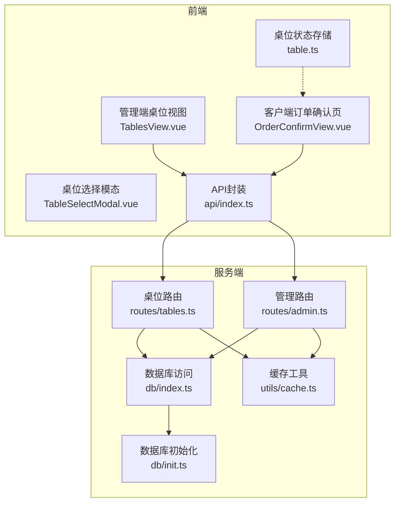
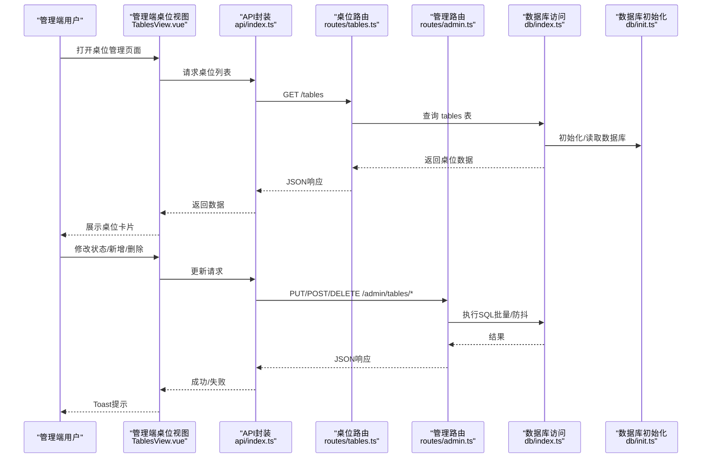
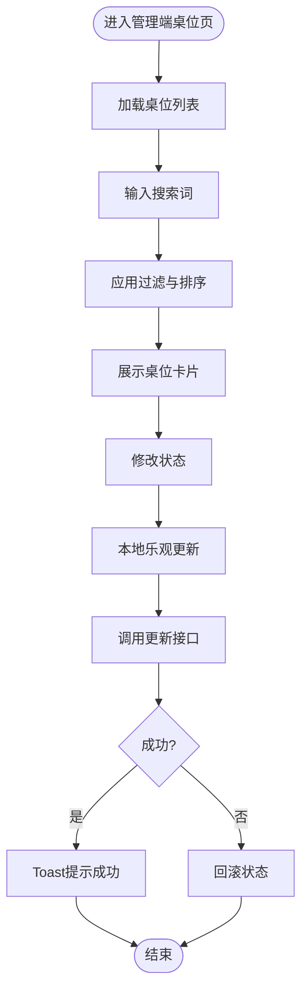
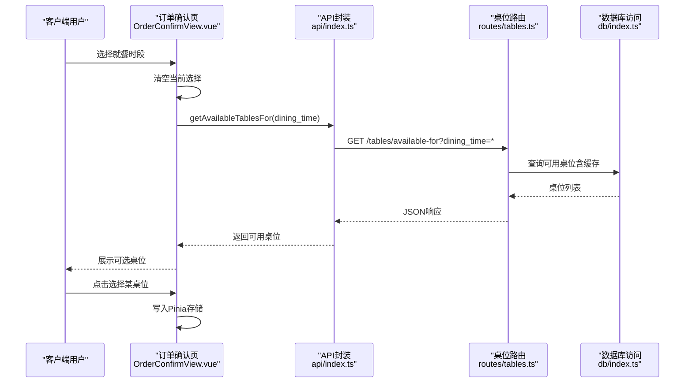
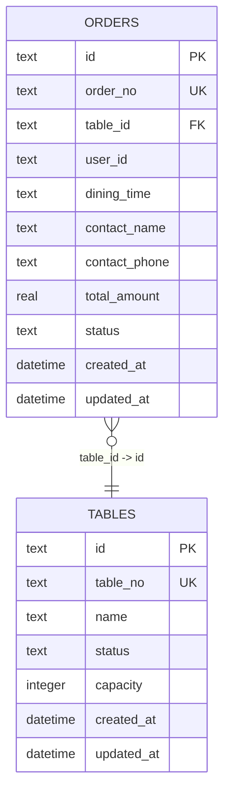
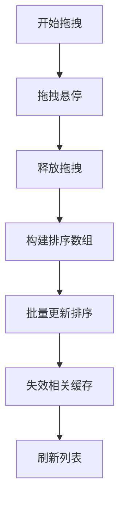
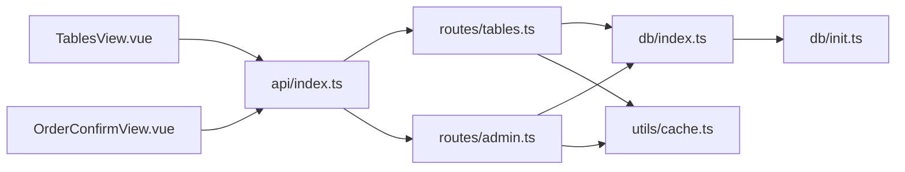

# 桌位管理

<cite>
**本文引用的文件**
- [TablesView.vue](file://src/admin/views/TablesView.vue)
- [tables.ts](file://server/src/routes/tables.ts)
- [admin.ts](file://server/src/routes/admin.ts)
- [table.ts](file://src/stores/table.ts)
- [index.ts](file://src/types/index.ts)
- [index.ts](file://src/api/index.ts)
- [init.ts](file://server/src/db/init.ts)
- [index.ts](file://server/src/db/index.ts)
- [cache.ts](file://server/src/utils/cache.ts)
- [OrderConfirmView.vue](file://src/client/views/OrderConfirmView.vue)
- [TableSelectModal.vue](file://src/client/components/TableSelectModal.vue)
- [useDragReorder.ts](file://src/shared/composables/useDragReorder.ts)
</cite>

## 目录
1. [简介](#简介)
2. [项目结构](#项目结构)
3. [核心组件](#核心组件)
4. [架构总览](#架构总览)
5. [详细组件分析](#详细组件分析)
6. [依赖关系分析](#依赖关系分析)
7. [性能考量](#性能考量)
8. [故障排查指南](#故障排查指南)
9. [结论](#结论)
10. [附录](#附录)

## 简介
本文件面向RLRMS系统的“桌位管理”功能，围绕以下目标进行系统化说明：
- 桌位的添加、删除、状态设置、容量配置
- 桌位状态管理（可用/已预订/占用）
- 预订管理与座位分配（按就餐时段筛选可用桌位）
- 桌位搜索与筛选、批量操作能力
- 布局可视化编辑（拖拽重排思路与实现建议）
- 桌位与订单关联、使用统计、清理提醒
- 桌位导入模板、批量配置、布局优化建议

## 项目结构
桌位管理涉及前端管理界面、客户端点餐流程、服务端路由与数据库层，以及缓存策略。关键模块如下：
- 管理端桌位视图：负责展示、增删改、状态切换、搜索筛选
- 客户端点餐流程：支持按就餐时段选择可用桌位
- 服务端路由：提供桌位查询、可用性查询、状态更新、新增删除
- 数据库：存储桌位表及索引；支持批量写入与防抖落盘
- 缓存：对常用查询结果进行TTL缓存，降低数据库压力
- 类型定义：统一前后端数据契约

图表来源
- [TablesView.vue:1-484](file://src/admin/views/TablesView.vue#L1-L484)
- [OrderConfirmView.vue:1-200](file://src/client/views/OrderConfirmView.vue#L1-L200)
- [TableSelectModal.vue:205-230](file://src/client/components/TableSelectModal.vue#L205-L230)
- [tables.ts:1-93](file://server/src/routes/tables.ts#L1-L93)
- [admin.ts:221-337](file://server/src/routes/admin.ts#L221-L337)
- [init.ts:25-34](file://server/src/db/init.ts#L25-L34)
- [index.ts:1-156](file://server/src/db/index.ts#L1-L156)
- [cache.ts:1-73](file://server/src/utils/cache.ts#L1-L73)

章节来源
- [TablesView.vue:1-484](file://src/admin/views/TablesView.vue#L1-L484)
- [OrderConfirmView.vue:1-200](file://src/client/views/OrderConfirmView.vue#L1-L200)
- [tables.ts:1-93](file://server/src/routes/tables.ts#L1-L93)
- [admin.ts:221-337](file://server/src/routes/admin.ts#L221-L337)
- [init.ts:25-34](file://server/src/db/init.ts#L25-L34)
- [index.ts:1-156](file://server/src/db/index.ts#L1-L156)
- [cache.ts:1-73](file://server/src/utils/cache.ts#L1-L73)

## 核心组件
- 管理端桌位视图（TablesView.vue）
  - 提供桌位卡片网格展示，支持搜索过滤、状态切换、增删改弹窗
  - 使用API封装进行数据交互，本地状态与Toast提示
- 客户端桌位选择（OrderConfirmView.vue + TableSelectModal.vue）
  - 支持按“中午/晚上”时段动态加载可用桌位
  - 提供分页与占位符样式，配合颜色区分状态
- 服务端路由（tables.ts + admin.ts）
  - 提供桌位列表、可用性查询、状态更新、新增删除
  - 对可用性查询使用缓存，减少并发压力
- 数据模型与类型（index.ts）
  - Table接口定义状态枚举与容量字段
  - Order接口包含桌位关联字段（table_id、table_name、table_no）
- 存储与缓存（table.ts + cache.ts + db/index.ts）
  - Pinia存储用于客户端选择状态
  - 内存缓存与TTL机制用于热点查询
  - 数据库采用sql.js，支持批量写入与防抖落盘

章节来源
- [TablesView.vue:32-72](file://src/admin/views/TablesView.vue#L32-L72)
- [OrderConfirmView.vue:48-94](file://src/client/views/OrderConfirmView.vue#L48-L94)
- [tables.ts:14-55](file://server/src/routes/tables.ts#L14-L55)
- [admin.ts:223-337](file://server/src/routes/admin.ts#L223-L337)
- [index.ts:35-43](file://src/types/index.ts#L35-L43)
- [index.ts:82-97](file://src/types/index.ts#L82-L97)
- [table.ts:1-25](file://src/stores/table.ts#L1-L25)
- [cache.ts:64-72](file://server/src/utils/cache.ts#L64-L72)
- [index.ts:101-109](file://server/src/db/index.ts#L101-L109)

## 架构总览
下图展示了从用户操作到数据持久化的完整链路，包括管理端与客户端的交互。

图表来源
- [TablesView.vue:58-162](file://src/admin/views/TablesView.vue#L58-L162)
- [index.ts:293-322](file://src/api/index.ts#L293-L322)
- [tables.ts:14-22](file://server/src/routes/tables.ts#L14-L22)
- [admin.ts:238-337](file://server/src/routes/admin.ts#L238-L337)
- [index.ts:101-109](file://server/src/db/index.ts#L101-L109)
- [init.ts:25-34](file://server/src/db/init.ts#L25-L34)

## 详细组件分析

### 管理端桌位视图（TablesView.vue）
- 功能要点
  - 列表渲染：按table_no排序，支持名称/编号搜索
  - 状态显示：通过颜色与文案标识可用/已预订/占用
  - 操作面板：状态选择器、编辑按钮、删除确认
  - 新增/编辑弹窗：表单校验（编号唯一、名称唯一）
  - 删除保护：若存在未完成订单则禁止删除
- 关键流程
  - 搜索与排序：本地过滤与排序，避免频繁网络请求
  - 状态变更：先本地乐观更新，再调用API，失败回滚
  - 新增/编辑：提交后刷新列表，Toast提示
  - 删除：本地预移除，调用API，失败恢复

图表来源
- [TablesView.vue:32-72](file://src/admin/views/TablesView.vue#L32-L72)
- [TablesView.vue:144-162](file://src/admin/views/TablesView.vue#L144-L162)

章节来源
- [TablesView.vue:32-72](file://src/admin/views/TablesView.vue#L32-L72)
- [TablesView.vue:144-162](file://src/admin/views/TablesView.vue#L144-L162)

### 客户端桌位选择（OrderConfirmView.vue + TableSelectModal.vue）
- 功能要点
  - 按就餐时段（中午/晚上）动态获取可用桌位
  - 分页展示，支持点击选择并同步Pinia存储
  - 状态图例与颜色区分，便于快速识别
- 关键流程
  - 时段切换：清空选择，重新拉取可用桌位
  - 可用性查询：调用tables/available-for接口，使用缓存
  - 选择保存：写入Pinia，后续下单时携带

图表来源
- [OrderConfirmView.vue:69-94](file://src/client/views/OrderConfirmView.vue#L69-L94)
- [index.ts:182-184](file://src/api/index.ts#L182-L184)
- [tables.ts:25-55](file://server/src/routes/tables.ts#L25-L55)
- [index.ts:101-109](file://server/src/db/index.ts#L101-L109)

章节来源
- [OrderConfirmView.vue:48-94](file://src/client/views/OrderConfirmView.vue#L48-L94)
- [TableSelectModal.vue:205-230](file://src/client/components/TableSelectModal.vue#L205-L230)

### 服务端路由与数据库（tables.ts + admin.ts + db/index.ts + db/init.ts）
- 路由职责
  - GET /tables：返回全部桌位（含当前活跃订单号）
  - GET /tables/available：返回status=available的桌位
  - GET /tables/available-for：按dining_time返回可用桌位（含缓存）
  - 管理端：PUT/POST/DELETE /admin/tables/*，支持状态更新、新增、删除
- 数据库设计
  - tables表包含id、table_no、name、status、capacity、created_at、updated_at
  - orders表外键关联tables，支持按table_id查询
- 缓存策略
  - 缓存键前缀：TABLES_AVAILABLE、TABLES_AVAILABLE_FOR_PREFIX
  - TTL：5秒，避免高并发下的重复计算
- 批量写入与防抖
  - run()后scheduleSave()，debounce 50ms，合并多次写入
  - beginBatch()/endBatch()支持事务式批量写入

图表来源
- [init.ts:25-34](file://server/src/db/init.ts#L25-L34)
- [init.ts:64-79](file://server/src/db/init.ts#L64-L79)

章节来源
- [tables.ts:14-76](file://server/src/routes/tables.ts#L14-L76)
- [admin.ts:223-337](file://server/src/routes/admin.ts#L223-L337)
- [index.ts:101-109](file://server/src/db/index.ts#L101-L109)
- [cache.ts:64-72](file://server/src/utils/cache.ts#L64-L72)

### 类型定义与状态管理
- Table接口
  - 状态枚举：available/reserved/occupied
  - 容量字段：capacity
- Order接口
  - 关联字段：table_id、table_name、table_no
  - 业务状态：pending/confirmed/completed/cancelled
- Pinia存储
  - selectedTable：当前选中的桌位
  - isTableSelected：是否已选择

章节来源
- [index.ts:35-43](file://src/types/index.ts#L35-L43)
- [index.ts:82-97](file://src/types/index.ts#L82-L97)
- [table.ts:1-25](file://src/stores/table.ts#L1-L25)

### 布局可视化编辑（拖拽重排）
- 现状
  - 管理端桌位列表按table_no排序，未提供拖拽重排
  - 共享组合式函数useDragReorder.ts提供通用拖拽重排能力
- 建议
  - 在管理端增加拖拽重排：将table_no改为sort_order，支持拖拽调整顺序
  - 保存时批量提交新的sort_order，服务端批量更新
  - 与现有排序逻辑结合，保持table_no稳定不变

图表来源
- [useDragReorder.ts:1-52](file://src/shared/composables/useDragReorder.ts#L1-L52)

章节来源
- [useDragReorder.ts:1-52](file://src/shared/composables/useDragReorder.ts#L1-L52)

## 依赖关系分析
- 前端依赖
  - TablesView.vue依赖api封装与Toast提示
  - OrderConfirmView.vue依赖api封装、Pinia存储与客户端布局
- 后端依赖
  - routes/tables.ts依赖db/index.ts与cache.ts
  - routes/admin.ts依赖db/index.ts、cache.ts、验证器与索引
- 数据依赖
  - orders表外键依赖tables表
  - 索引idx_tables_status加速可用性查询

图表来源
- [TablesView.vue:1-10](file://src/admin/views/TablesView.vue#L1-L10)
- [OrderConfirmView.vue:1-12](file://src/client/views/OrderConfirmView.vue#L1-L12)
- [index.ts:1-608](file://src/api/index.ts#L1-L608)
- [tables.ts:1-93](file://server/src/routes/tables.ts#L1-L93)
- [admin.ts:1-18](file://server/src/routes/admin.ts#L1-L18)
- [index.ts:1-156](file://server/src/db/index.ts#L1-L156)
- [init.ts:1-204](file://server/src/db/init.ts#L1-L204)
- [cache.ts:1-73](file://server/src/utils/cache.ts#L1-L73)

章节来源
- [index.ts:1-608](file://src/api/index.ts#L1-L608)
- [tables.ts:1-93](file://server/src/routes/tables.ts#L1-L93)
- [admin.ts:1-18](file://server/src/routes/admin.ts#L1-L18)
- [index.ts:1-156](file://server/src/db/index.ts#L1-L156)
- [init.ts:124-137](file://server/src/db/init.ts#L124-L137)

## 性能考量
- 缓存策略
  - 桌位可用性查询使用TTL=5秒缓存，显著降低数据库压力
  - 缓存键前缀区分不同dining_time，避免误命中
- 数据库写入
  - run()后scheduleSave()，debounce 50ms，合并多次写入
  - beginBatch()/endBatch()支持批量事务，减少磁盘IO
- 查询优化
  - 为orders、dishes、users、tables建立索引，提升常见查询性能
- 前端体验
  - 管理端列表本地过滤与排序，减少网络请求
  - 客户端按时段查询可用桌位，避免全量渲染

章节来源
- [cache.ts:13-36](file://server/src/utils/cache.ts#L13-L36)
- [cache.ts:64-72](file://server/src/utils/cache.ts#L64-L72)
- [index.ts:13-44](file://server/src/db/index.ts#L13-L44)
- [index.ts:124-137](file://server/src/db/index.ts#L124-L137)
- [TablesView.vue:32-44](file://src/admin/views/TablesView.vue#L32-L44)
- [OrderConfirmView.vue:69-94](file://src/client/views/OrderConfirmView.vue#L69-L94)

## 故障排查指南
- 桌位删除失败
  - 若桌位存在未完成订单（pending/confirmed），服务端拒绝删除
  - 建议：先处理相关订单或等待订单完成后再删除
- 状态更新异常
  - 管理端先本地乐观更新，失败会自动回滚
  - 建议：检查网络状态与服务端日志
- 可用性查询为空
  - 确认dining_time参数正确且缓存未过期
  - 建议：刷新页面或等待缓存过期
- 客户端无法选择桌位
  - 检查时段是否正确（中午/晚上）
  - 确认网络请求成功且返回可用桌位

章节来源
- [admin.ts:321-337](file://server/src/routes/admin.ts#L321-L337)
- [TablesView.vue:144-162](file://src/admin/views/TablesView.vue#L144-L162)
- [tables.ts:25-55](file://server/src/routes/tables.ts#L25-L55)
- [OrderConfirmView.vue:69-94](file://src/client/views/OrderConfirmView.vue#L69-L94)

## 结论
- 桌位管理功能覆盖了从管理端到客户端的关键路径，具备良好的可用性与性能保障
- 通过缓存与批量写入策略，有效降低了数据库压力
- 建议在管理端增加拖拽重排能力，并完善批量配置与导入模板，进一步提升运营效率

## 附录

### 桌位状态管理与预订流程
- 状态枚举：available/reserved/occupied
- 预订判定：同一dining_time下，status=reserved且当前无活跃订单的桌位视为可用
- 客户端选择：按dining_time查询可用桌位，选择后写入Pinia

章节来源
- [index.ts:35-43](file://src/types/index.ts#L35-L43)
- [tables.ts:38-50](file://server/src/routes/tables.ts#L38-L50)
- [OrderConfirmView.vue:69-94](file://src/client/views/OrderConfirmView.vue#L69-L94)

### 桌位与订单关联
- 订单接口包含table_id、table_name、table_no字段
- 下单时可选择桌位，完成后可用于统计与清理提醒

章节来源
- [index.ts:82-97](file://src/types/index.ts#L82-L97)

### 布局可视化编辑与优化建议
- 当前列表按table_no排序，建议引入sort_order字段支持拖拽重排
- 使用useDragReorder.ts实现拖拽交互，批量提交排序更新
- 优化建议：提供“一键优化布局”功能，基于容量与位置进行智能排序

章节来源
- [useDragReorder.ts:1-52](file://src/shared/composables/useDragReorder.ts#L1-L52)

### 桌位导入模板与批量配置
- 现有导入导出能力用于系统整体数据备份与恢复
- 桌位导入模板建议包含：table_no、name、capacity、status
- 批量配置建议：支持批量更新状态、容量、名称等字段

章节来源
- [index.ts:509-595](file://src/api/index.ts#L509-L595)