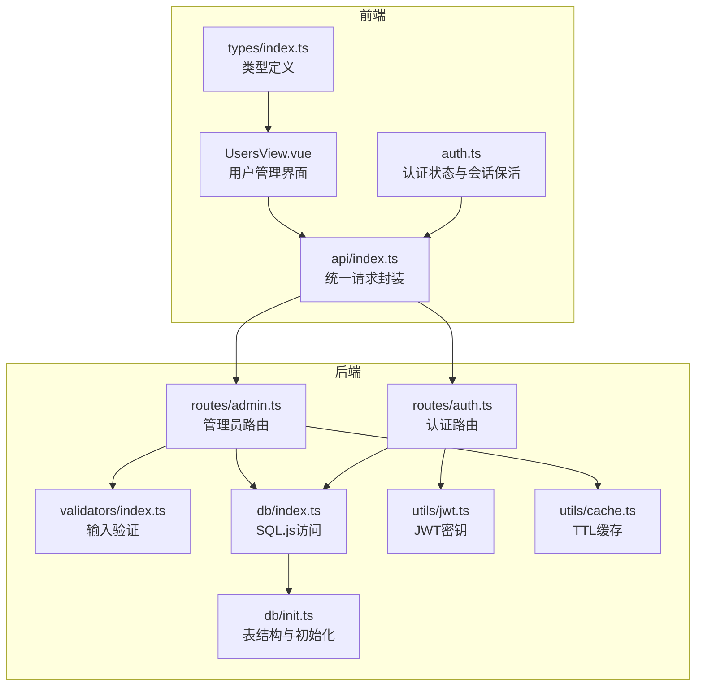
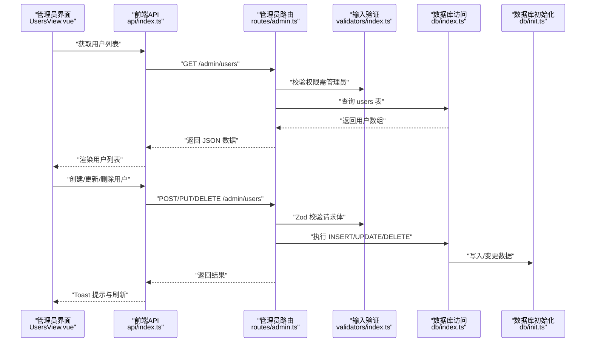
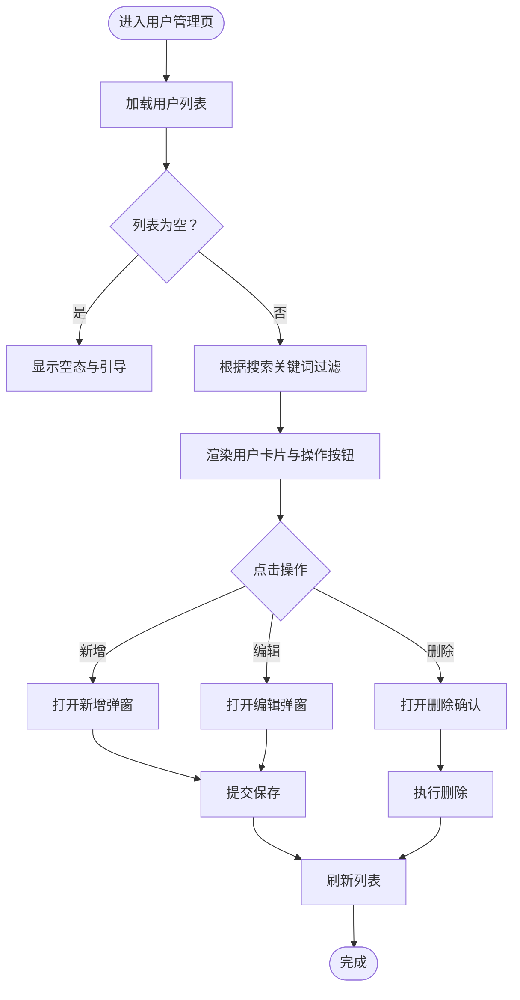
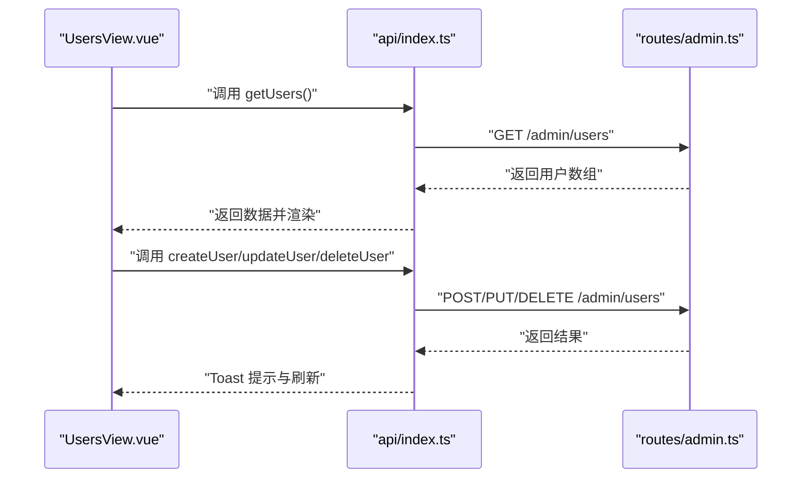
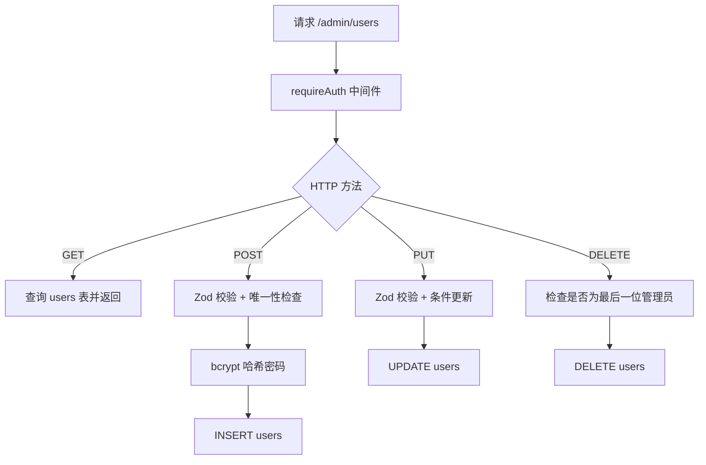
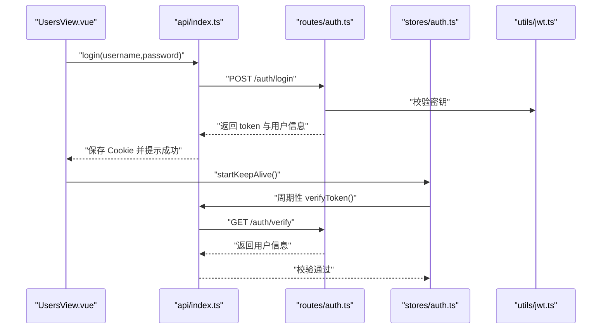
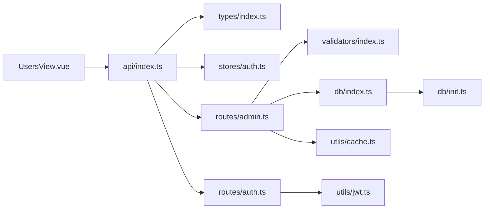

# 用户管理

<cite>
**本文引用的文件**
- [UsersView.vue](file://src/admin/views/UsersView.vue)
- [api/index.ts](file://src/api/index.ts)
- [types/index.ts](file://src/types/index.ts)
- [auth.ts（Pinia Store）](file://src/stores/auth.ts)
- [routes/admin.ts](file://server/src/routes/admin.ts)
- [routes/auth.ts](file://server/src/routes/auth.ts)
- [validators/index.ts](file://server/src/validators/index.ts)
- [db/index.ts](file://server/src/db/index.ts)
- [db/init.ts](file://server/src/db/init.ts)
- [utils/jwt.ts](file://server/src/utils/jwt.ts)
- [utils/cache.ts](file://server/src/utils/cache.ts)
</cite>

## 目录
1. [简介](#简介)
2. [项目结构](#项目结构)
3. [核心组件](#核心组件)
4. [架构总览](#架构总览)
5. [详细组件分析](#详细组件分析)
6. [依赖关系分析](#依赖关系分析)
7. [性能考量](#性能考量)
8. [故障排查指南](#故障排查指南)
9. [结论](#结论)
10. [附录](#附录)

## 简介
本章节概述 RLRMS 用户管理功能的目标与范围，包括用户账户的创建、修改、删除、权限分配；用户角色与部门设置；操作日志记录；用户搜索与筛选、批量操作与状态控制；用户数据验证、密码重置与登录审计；以及用户导入导出、权限继承与安全策略配置、合规性要求。

## 项目结构
用户管理功能由前端视图层、API 层、后端路由层、数据库层与工具库共同组成，采用前后端分离架构，前端通过统一的 API 封装调用后端接口，后端通过 Express 路由提供 RESTful 接口，并使用 SQL.js 存储用户与业务数据。

图表来源
- [UsersView.vue:1-553](file://src/admin/views/UsersView.vue#L1-L553)
- [api/index.ts:1-608](file://src/api/index.ts#L1-L608)
- [routes/admin.ts:1-1887](file://server/src/routes/admin.ts#L1-L1887)
- [routes/auth.ts:1-405](file://server/src/routes/auth.ts#L1-L405)
- [validators/index.ts:1-123](file://server/src/validators/index.ts#L1-L123)
- [db/index.ts:1-156](file://server/src/db/index.ts#L1-L156)
- [db/init.ts:1-204](file://server/src/db/init.ts#L1-L204)
- [utils/jwt.ts:1-27](file://server/src/utils/jwt.ts#L1-L27)
- [utils/cache.ts:1-73](file://server/src/utils/cache.ts#L1-L73)

章节来源
- [UsersView.vue:1-553](file://src/admin/views/UsersView.vue#L1-L553)
- [api/index.ts:1-608](file://src/api/index.ts#L1-L608)
- [routes/admin.ts:1-1887](file://server/src/routes/admin.ts#L1-L1887)
- [routes/auth.ts:1-405](file://server/src/routes/auth.ts#L1-L405)
- [validators/index.ts:1-123](file://server/src/validators/index.ts#L1-L123)
- [db/index.ts:1-156](file://server/src/db/index.ts#L1-L156)
- [db/init.ts:1-204](file://server/src/db/init.ts#L1-L204)
- [utils/jwt.ts:1-27](file://server/src/utils/jwt.ts#L1-L27)
- [utils/cache.ts:1-73](file://server/src/utils/cache.ts#L1-L73)

## 核心组件
- 前端用户管理视图：负责用户列表展示、搜索筛选、新增/编辑/删除弹窗、基础表单校验与提示。
- 统一 API 封装：提供用户管理相关的 GET/POST/PUT/DELETE 请求方法，内置缓存与超时控制。
- 后端管理员路由：提供 /admin/users 列表、创建、更新、删除接口，配合输入验证与数据库操作。
- 认证与会话：管理员登录鉴权、令牌校验、会话保活与过期处理。
- 数据模型与验证：AdminUser 类型、Zod 校验规则、SQL.js 初始化与表结构。
- 安全与策略：JWT 密钥生成策略、bcrypt 密码哈希、登录速率限制、禁止删除最后一个管理员。

章节来源
- [UsersView.vue:1-553](file://src/admin/views/UsersView.vue#L1-L553)
- [api/index.ts:434-457](file://src/api/index.ts#L434-L457)
- [routes/admin.ts:993-1141](file://server/src/routes/admin.ts#L993-L1141)
- [routes/auth.ts:64-179](file://server/src/routes/auth.ts#L64-L179)
- [validators/index.ts:95-109](file://server/src/validators/index.ts#L95-L109)
- [db/init.ts:11-22](file://server/src/db/init.ts#L11-L22)
- [utils/jwt.ts:16-22](file://server/src/utils/jwt.ts#L16-L22)

## 架构总览
用户管理的端到端流程如下：

图表来源
- [UsersView.vue:40-51](file://src/admin/views/UsersView.vue#L40-L51)
- [api/index.ts:434-457](file://src/api/index.ts#L434-L457)
- [routes/admin.ts:993-1141](file://server/src/routes/admin.ts#L993-L1141)
- [validators/index.ts:95-109](file://server/src/validators/index.ts#L95-L109)
- [db/index.ts:101-140](file://server/src/db/index.ts#L101-L140)
- [db/init.ts:11-22](file://server/src/db/init.ts#L11-L22)

## 详细组件分析

### 前端用户管理视图（UsersView.vue）
- 功能要点
  - 用户列表加载与空态展示
  - 搜索过滤：按用户名、称呼、手机号模糊匹配
  - 新增/编辑弹窗：用户名唯一、编辑时可留空密码不更新
  - 删除确认：删除前弹窗确认
  - 基础表单校验：新建顾客时称呼与手机号必填
  - 日期格式化与角色徽标显示
- 关键交互
  - 打开新增/编辑弹窗时重置表单
  - 保存成功后关闭弹窗并刷新列表
  - 删除成功后刷新列表并提示

图表来源
- [UsersView.vue:30-51](file://src/admin/views/UsersView.vue#L30-L51)
- [UsersView.vue:53-124](file://src/admin/views/UsersView.vue#L53-L124)
- [UsersView.vue:126-144](file://src/admin/views/UsersView.vue#L126-L144)

章节来源
- [UsersView.vue:1-553](file://src/admin/views/UsersView.vue#L1-L553)

### 统一 API 封装（api/index.ts）
- 用户管理相关方法
  - getUsers：获取用户列表
  - createUser：创建用户
  - updateUser：更新用户（可选密码、角色、姓名、手机）
  - deleteUser：删除用户
- 其他能力
  - 统一的请求封装、超时与信号合并、401 处理、全局会话过期事件
  - 导入导出：exportData、importData（ZIP 包含系统数据）

图表来源
- [api/index.ts:434-457](file://src/api/index.ts#L434-L457)
- [routes/admin.ts:993-1141](file://server/src/routes/admin.ts#L993-L1141)

章节来源
- [api/index.ts:1-608](file://src/api/index.ts#L1-L608)

### 后端管理员路由（routes/admin.ts）
- 用户管理接口
  - GET /admin/users：列出用户（含 created_at、updated_at）
  - POST /admin/users：创建用户（用户名唯一、密码加密存储）
  - PUT /admin/users/{id}：更新用户（可选字段）
  - DELETE /admin/users/{id}：删除用户（禁止删除最后一个管理员）
- 输入验证
  - 使用 Zod 校验请求体，约束用户名、密码长度、角色枚举、可选字段
- 数据库操作
  - 使用 SQL.js 执行查询与写入，支持批处理与延迟保存

图表来源
- [routes/admin.ts:993-1141](file://server/src/routes/admin.ts#L993-L1141)
- [validators/index.ts:95-109](file://server/src/validators/index.ts#L95-L109)
- [db/index.ts:101-140](file://server/src/db/index.ts#L101-L140)

章节来源
- [routes/admin.ts:993-1141](file://server/src/routes/admin.ts#L993-L1141)
- [validators/index.ts:95-109](file://server/src/validators/index.ts#L95-L109)
- [db/index.ts:101-140](file://server/src/db/index.ts#L101-L140)

### 认证与会话（routes/auth.ts 与 stores/auth.ts）
- 管理员登录
  - 仅允许 role=admin 的用户登录
  - 登录失败进行速率限制（IP 级）
  - 成功后签发 JWT 并设置 httpOnly Cookie
- 令牌校验与会话保活
  - 前端定时调用 verifyToken，后端校验 JWT
  - 会话过期自动触发全局事件，引导重新登录
- 密码重置
  - 通过 PUT /auth/password 更新当前用户密码（旧密码校验）

图表来源
- [routes/auth.ts:64-179](file://server/src/routes/auth.ts#L64-L179)
- [stores/auth.ts:15-127](file://src/stores/auth.ts#L15-L127)
- [utils/jwt.ts:16-22](file://server/src/utils/jwt.ts#L16-L22)

章节来源
- [routes/auth.ts:64-179](file://server/src/routes/auth.ts#L64-L179)
- [stores/auth.ts:15-127](file://src/stores/auth.ts#L15-L127)
- [utils/jwt.ts:16-22](file://server/src/utils/jwt.ts#L16-L22)

### 数据模型与验证（types/index.ts 与 validators/index.ts）
- 数据模型
  - User/AdminUser：包含 id、username、role、name、phone、created_at、updated_at
- 输入验证
  - createUserSchema：用户名、密码长度、角色、可选姓名/手机
  - updateUserSchema：同上，允许部分字段更新
- 类型推断
  - 通过 Zod infer 得到输入类型，便于 TypeScript 强类型约束

章节来源
- [types/index.ts:9-27](file://src/types/index.ts#L9-L27)
- [validators/index.ts:95-109](file://server/src/validators/index.ts#L95-L109)

### 数据库层（db/index.ts 与 db/init.ts）
- 数据库初始化
  - users 表：id、username（唯一）、password、role、phone、name、created_at、updated_at
  - 索引：对 phone、role 等常用查询列建立索引
  - 默认管理员与默认设置回填
- 数据访问
  - run/get/all/exec：封装 SQL.js 的执行与查询
  - 批处理与延迟保存：beginBatch/endBatch 降低写入开销

章节来源
- [db/init.ts:11-22](file://server/src/db/init.ts#L11-L22)
- [db/init.ts:124-136](file://server/src/db/init.ts#L124-L136)
- [db/index.ts:75-98](file://server/src/db/index.ts#L75-L98)
- [db/index.ts:101-140](file://server/src/db/index.ts#L101-L140)

### 安全策略与工具（utils/jwt.ts 与 utils/cache.ts）
- JWT 密钥
  - 开发环境：基于主机特征派生固定密钥
  - 生产环境：可配置或随机生成，每次启动不同
- 缓存策略
  - TTL 内存缓存，用于设置等不频繁变更的数据
- 其他安全措施
  - bcrypt 哈希存储密码
  - 登录速率限制
  - 禁止删除最后一个管理员

章节来源
- [utils/jwt.ts:16-22](file://server/src/utils/jwt.ts#L16-L22)
- [utils/cache.ts:1-73](file://server/src/utils/cache.ts#L1-73)
- [routes/admin.ts:1127-1133](file://server/src/routes/admin.ts#L1127-L1133)

## 依赖关系分析
- 前端依赖
  - UsersView.vue 依赖 api/index.ts 提供的用户管理方法
  - api/index.ts 依赖 types/index.ts 的类型定义
  - stores/auth.ts 与 api/index.ts 协作实现会话保活与 401 处理
- 后端依赖
  - routes/admin.ts 依赖 validators/index.ts 进行输入校验
  - routes/admin.ts 与 routes/auth.ts 依赖 db/index.ts 与 db/init.ts 进行数据持久化
  - routes/auth.ts 依赖 utils/jwt.ts 生成与校验令牌
  - utils/cache.ts 为后端提供轻量缓存

图表来源
- [UsersView.vue:1-553](file://src/admin/views/UsersView.vue#L1-L553)
- [api/index.ts:1-608](file://src/api/index.ts#L1-L608)
- [routes/admin.ts:1-1887](file://server/src/routes/admin.ts#L1-L1887)
- [routes/auth.ts:1-405](file://server/src/routes/auth.ts#L1-L405)
- [validators/index.ts:1-123](file://server/src/validators/index.ts#L1-L123)
- [db/index.ts:1-156](file://server/src/db/index.ts#L1-L156)
- [db/init.ts:1-204](file://server/src/db/init.ts#L1-L204)
- [utils/jwt.ts:1-27](file://server/src/utils/jwt.ts#L1-L27)
- [utils/cache.ts:1-73](file://server/src/utils/cache.ts#L1-L73)

章节来源
- [UsersView.vue:1-553](file://src/admin/views/UsersView.vue#L1-L553)
- [api/index.ts:1-608](file://src/api/index.ts#L1-L608)
- [routes/admin.ts:1-1887](file://server/src/routes/admin.ts#L1-L1887)
- [routes/auth.ts:1-405](file://server/src/routes/auth.ts#L1-L405)
- [validators/index.ts:1-123](file://server/src/validators/index.ts#L1-L123)
- [db/index.ts:1-156](file://server/src/db/index.ts#L1-L156)
- [db/init.ts:1-204](file://server/src/db/init.ts#L1-L204)
- [utils/jwt.ts:1-27](file://server/src/utils/jwt.ts#L1-L27)
- [utils/cache.ts:1-73](file://server/src/utils/cache.ts#L1-L73)

## 性能考量
- 前端缓存
  - api/index.ts 内置 30 秒 TTL 的内存缓存，减少重复请求
- 后端缓存
  - utils/cache.ts 提供 TTL 内存缓存，适用于设置等不频繁变更的数据
- 数据库优化
  - 为 users.phone、users.role 等列建立索引，提升查询效率
  - 批处理写入（beginBatch/endBatch）降低磁盘写入频率
- 会话保活
  - 前端定时校验 token，避免无效请求造成资源浪费

章节来源
- [api/index.ts:9-34](file://src/api/index.ts#L9-L34)
- [utils/cache.ts:1-73](file://server/src/utils/cache.ts#L1-L73)
- [db/init.ts:124-136](file://server/src/db/init.ts#L124-L136)
- [db/index.ts:46-60](file://server/src/db/index.ts#L46-L60)
- [stores/auth.ts:37-55](file://src/stores/auth.ts#L37-L55)

## 故障排查指南
- 登录失败
  - 检查用户名/密码是否正确，确认用户 role 是否为 admin
  - 观察是否存在登录速率限制（同一 IP 短时间内多次失败）
- 会话过期
  - 前端会话保活定时器会定期校验 token，过期后触发全局事件
  - 检查 Cookie 是否被清除或跨域问题导致携带失败
- 用户创建/更新失败
  - 确认请求体符合 Zod 校验规则（用户名唯一、密码长度、角色枚举）
  - 检查数据库约束（如 username 唯一）
- 删除失败
  - 若提示“不能删除最后一个管理员”，请先为其他管理员重置角色或创建新管理员
- 导入导出异常
  - 导入时检查 ZIP 文件格式与内容完整性
  - 导出时确认响应头中的文件名编码与浏览器下载行为

章节来源
- [routes/auth.ts:64-179](file://server/src/routes/auth.ts#L64-L179)
- [stores/auth.ts:37-55](file://src/stores/auth.ts#L37-L55)
- [validators/index.ts:95-109](file://server/src/validators/index.ts#L95-L109)
- [routes/admin.ts:1013-1051](file://server/src/routes/admin.ts#L1013-L1051)
- [routes/admin.ts:1127-1133](file://server/src/routes/admin.ts#L1127-L1133)
- [api/index.ts:508-595](file://src/api/index.ts#L508-L595)

## 结论
RLRMS 的用户管理功能通过清晰的前后端职责划分与严格的输入验证、安全策略与缓存机制，实现了管理员对用户账户的全生命周期管理。前端提供直观的交互体验，后端通过路由与数据库层保障数据一致性与安全性。建议在生产环境中进一步完善操作审计与合规性日志记录，以满足更严格的安全与监管要求。

## 附录
- 用户搜索与筛选
  - 前端按用户名、称呼、手机号进行模糊匹配
- 批量操作
  - 当前用户管理页面未提供多选批量删除/更新入口，可通过扩展前端交互实现
- 状态控制
  - 用户实体未包含启用/禁用状态字段，如需可扩展 role 或新增 status 字段
- 权限继承
  - 系统未实现角色继承或细粒度权限模型，当前仅区分 admin/customer
- 合规性要求
  - 建议增加登录审计、密码策略（复杂度、到期提醒）、操作审计日志与数据最小化原则