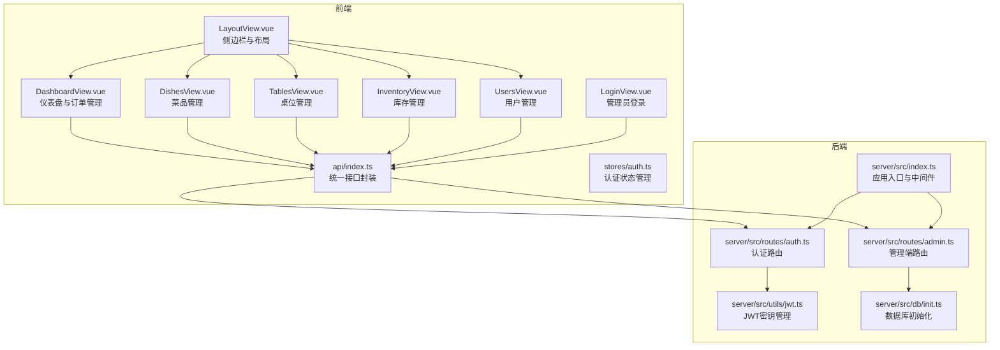
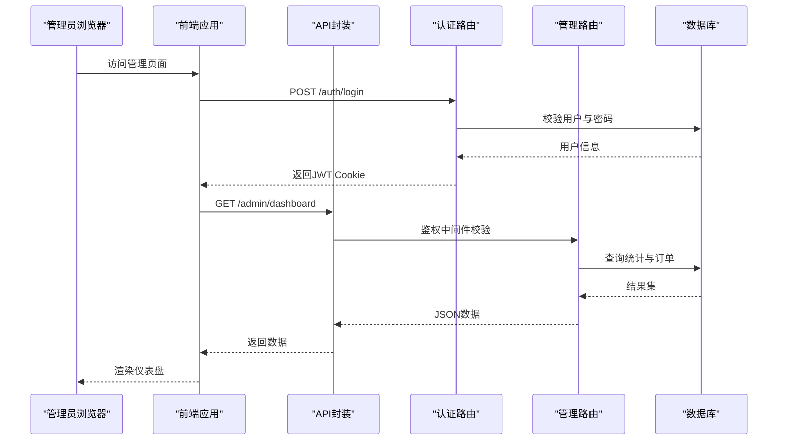
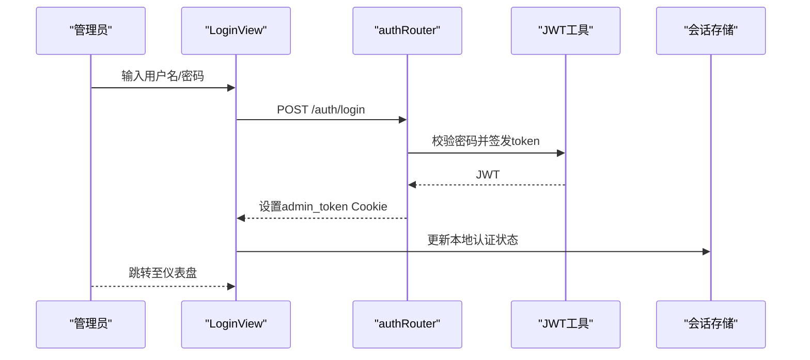
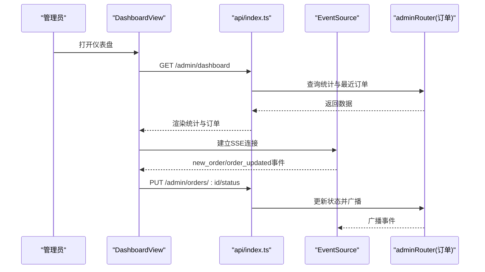
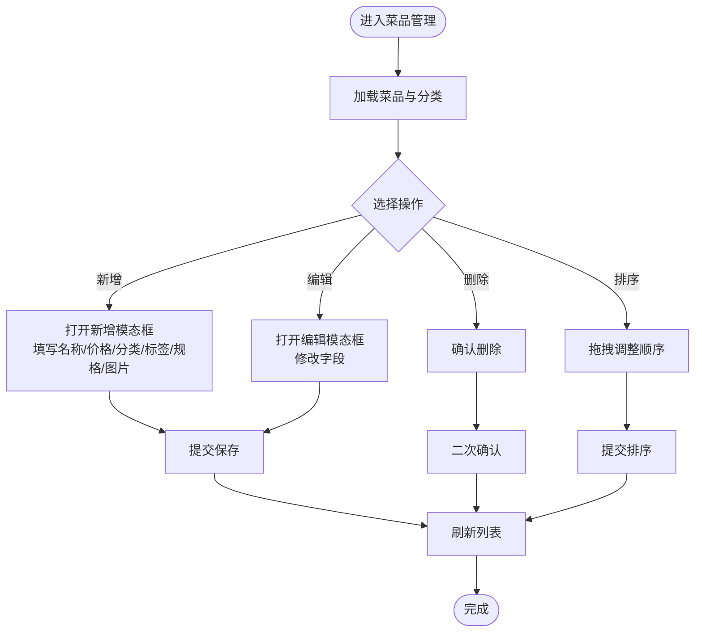
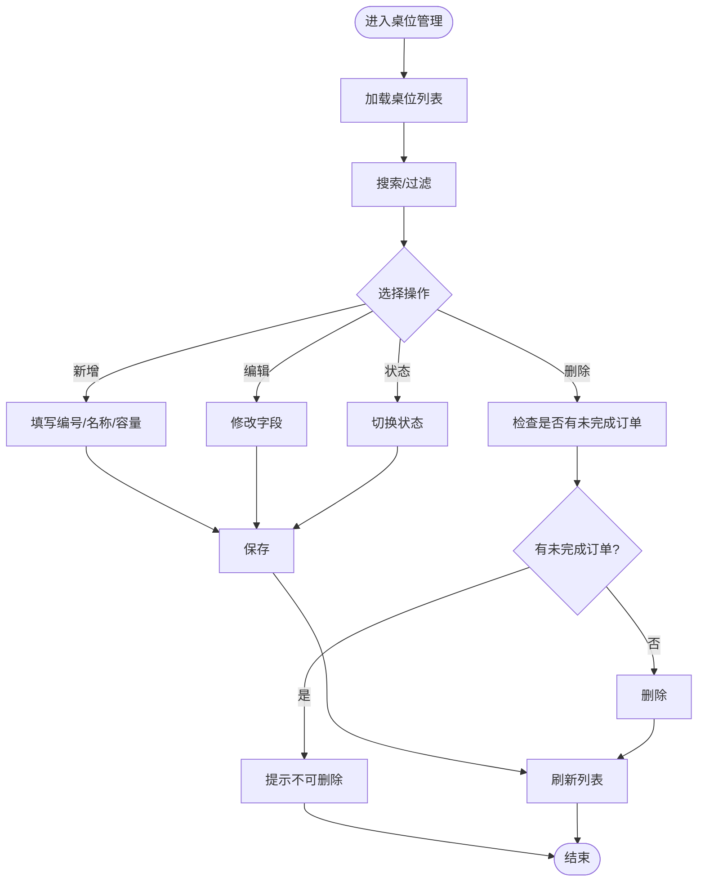
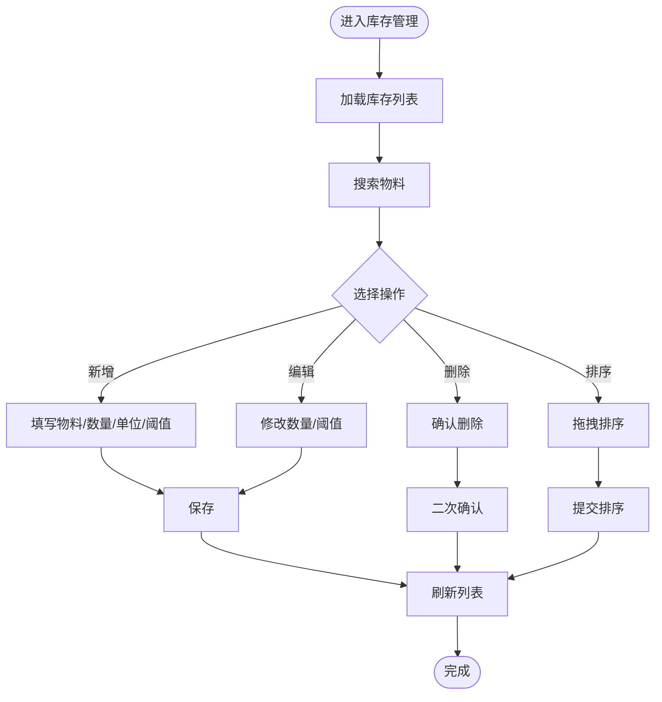
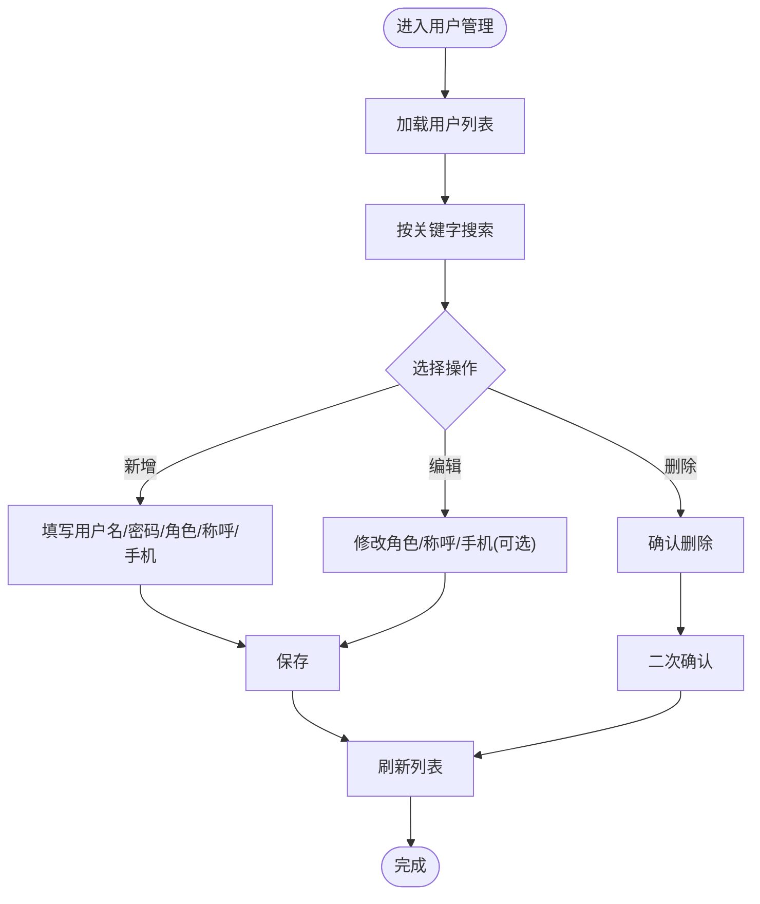
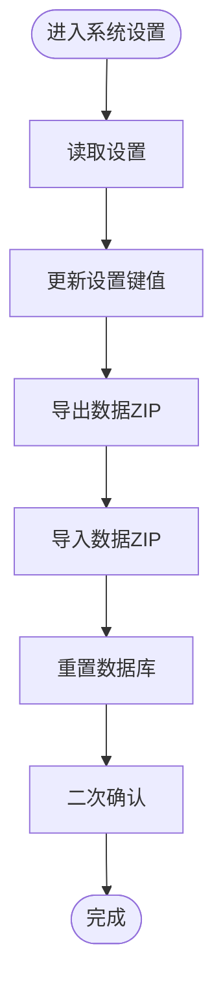
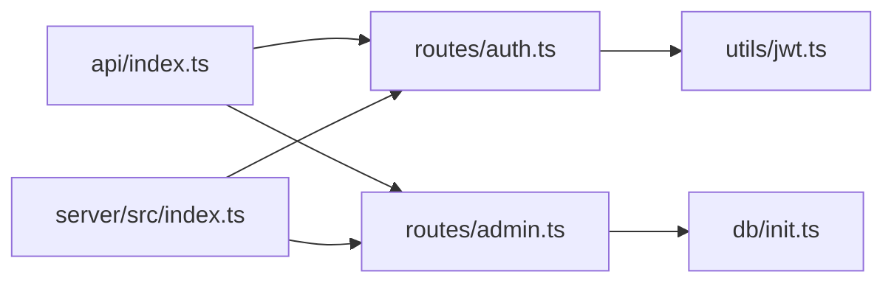

# 管理功能模块

<cite>
**本文档引用的文件**
- [server/src/index.ts](file://server/src/index.ts)
- [server/src/route/admin.ts](file://server/src/routes/admin.ts)
- [server/src/utils/jwt.ts](file://server/src/utils/jwt.ts)
- [server/src/db/init.ts](file://server/src/db/init.ts)
- [src/admin/views/LayoutView.vue](file://src/admin/views/LayoutView.vue)
- [src/admin/views/DashboardView.vue](file://src/admin/views/DashboardView.vue)
- [src/admin/views/LoginView.vue](file://src/admin/views/LoginView.vue)
- [src/admin/views/DishesView.vue](file://src/admin/views/DishesView.vue)
- [src/admin/views/TablesView.vue](file://src/admin/views/TablesView.vue)
- [src/admin/views/InventoryView.vue](file://src/admin/views/InventoryView.vue)
- [src/admin/views/UsersView.vue](file://src/admin/views/UsersView.vue)
- [src/api/index.ts](file://src/api/index.ts)
- [src/stores/auth.ts](file://src/stores/auth.ts)
</cite>

## 目录
1. [简介](#简介)
2. [项目结构](#项目结构)
3. [核心组件](#核心组件)
4. [架构总览](#架构总览)
5. [详细组件分析](#详细组件分析)
6. [依赖关系分析](#依赖关系分析)
7. [性能考虑](#性能考虑)
8. [故障排除指南](#故障排除指南)
9. [结论](#结论)

## 简介
本文件为 RLRMS 管理功能模块的详细技术文档，面向管理员与开发者，系统性阐述管理后台的登录认证、仪表盘概览、菜品管理、桌位管理、订单处理、库存管理、用户管理、系统设置等核心功能。文档覆盖业务逻辑、操作流程、数据验证规则、权限控制机制、数据安全策略、批量操作、界面设计原则与用户体验优化、功能间关联关系与数据流转、异常处理机制以及运维维护建议。

## 项目结构
管理功能模块采用前后端分离架构：
- 前端（Vue 3 + TypeScript）：位于 `src/admin/views`，负责管理界面渲染与交互；通过 `src/api/index.ts` 统一调用后端 `/api/admin` 接口。
- 后端（Node.js + Express + SQLite）：位于 `server/src`，提供 RESTful API，实现认证、业务逻辑与数据持久化。
- 数据层：SQLite 数据库，初始化脚本在 `server/src/db/init.ts` 中定义表结构、索引与默认数据。

**图表来源**
- [server/src/index.ts:1-171](file://server/src/index.ts#L1-L171)
- [server/src/routes/admin.ts:1-800](file://server/src/routes/admin.ts#L1-L800)
- [server/src/routes/auth.ts:1-405](file://server/src/routes/auth.ts#L1-L405)
- [server/src/utils/jwt.ts:1-27](file://server/src/utils/jwt.ts#L1-L27)
- [server/src/db/init.ts:1-204](file://server/src/db/init.ts#L1-L204)
- [src/admin/views/LayoutView.vue:1-769](file://src/admin/views/LayoutView.vue#L1-L769)
- [src/admin/views/DashboardView.vue:1-800](file://src/admin/views/DashboardView.vue#L1-L800)
- [src/admin/views/LoginView.vue:1-300](file://src/admin/views/LoginView.vue#L1-L300)
- [src/admin/views/DishesView.vue:1-200](file://src/admin/views/DishesView.vue#L1-L200)
- [src/admin/views/TablesView.vue:1-200](file://src/admin/views/TablesView.vue#L1-L200)
- [src/admin/views/InventoryView.vue:1-200](file://src/admin/views/InventoryView.vue#L1-L200)
- [src/admin/views/UsersView.vue:1-200](file://src/admin/views/UsersView.vue#L1-L200)
- [src/api/index.ts:1-608](file://src/api/index.ts#L1-L608)
- [src/stores/auth.ts:1-128](file://src/stores/auth.ts#L1-L128)

**章节来源**
- [server/src/index.ts:1-171](file://server/src/index.ts#L1-L171)
- [server/src/db/init.ts:1-204](file://server/src/db/init.ts#L1-L204)

## 核心组件
- 登录认证与会话管理
  - 前端：`src/admin/views/LoginView.vue` 提供登录表单；`src/stores/auth.ts` 管理认证状态、会话保活与过期提示；`src/api/index.ts` 提供登录、登出、令牌校验与密码修改接口。
  - 后端：`server/src/routes/auth.ts` 实现管理员登录、登出、令牌校验；`server/src/utils/jwt.ts` 动态生成 JWT 密钥（开发/生产差异化）；`server/src/index.ts` 在请求前进行数据库就绪检查与全局错误处理。
- 仪表盘与订单管理
  - 前端：`src/admin/views/DashboardView.vue` 展示今日订单、收入、待处理订单、可用桌位；支持订单筛选、搜索、状态变更；集成 SSE 实时推送与轮询降级。
  - 后端：`server/src/routes/admin.ts` 提供仪表盘统计、订单查询、状态更新、订单清空等接口。
- 菜品与分类管理
  - 前端：`src/admin/views/DishesView.vue` 支持菜品增删改、图片上传、标签与规格管理、拖拽排序；分类 CRUD 与排序。
  - 后端：`server/src/routes/admin.ts` 提供菜品与分类的增删改查、排序、图片清理等。
- 桌位管理
  - 前端：`src/admin/views/TablesView.vue` 支持桌位增删改、状态变更、搜索与排序。
  - 后端：`server/src/routes/admin.ts` 提供桌位 CRUD 与状态更新。
- 库存管理
  - 前端：`src/admin/views/InventoryView.vue` 支持库存增删改、预警阈值设置、拖拽排序。
  - 后端：`server/src/routes/admin.ts` 提供库存 CRUD 与排序。
- 用户管理
  - 前端：`src/admin/views/UsersView.vue` 支持用户增删改、角色与联系方式维护。
  - 后端：`server/src/routes/admin.ts` 提供用户 CRUD。
- 系统设置与数据导入导出
  - 前端：`src/api/index.ts` 提供设置读取/更新、数据导入导出、数据库重置等。
  - 后端：`server/src/routes/admin.ts` 提供设置、导入导出、重置数据库等接口。

**章节来源**
- [src/admin/views/LoginView.vue:1-300](file://src/admin/views/LoginView.vue#L1-L300)
- [src/stores/auth.ts:1-128](file://src/stores/auth.ts#L1-L128)
- [src/admin/views/DashboardView.vue:1-800](file://src/admin/views/DashboardView.vue#L1-L800)
- [server/src/routes/admin.ts:164-800](file://server/src/routes/admin.ts#L164-L800)
- [src/admin/views/DishesView.vue:1-200](file://src/admin/views/DishesView.vue#L1-L200)
- [src/admin/views/TablesView.vue:1-200](file://src/admin/views/TablesView.vue#L1-L200)
- [src/admin/views/InventoryView.vue:1-200](file://src/admin/views/InventoryView.vue#L1-L200)
- [src/admin/views/UsersView.vue:1-200](file://src/admin/views/UsersView.vue#L1-L200)
- [src/api/index.ts:288-595](file://src/api/index.ts#L288-L595)
- [server/src/routes/auth.ts:64-180](file://server/src/routes/auth.ts#L64-L180)
- [server/src/utils/jwt.ts:1-27](file://server/src/utils/jwt.ts#L1-L27)
- [server/src/index.ts:121-139](file://server/src/index.ts#L121-L139)

## 架构总览
管理功能模块遵循分层架构：
- 表现层：Vue 组件负责视图与交互，通过 Pinia 状态管理会话与全局提示。
- 服务层：统一 API 封装，提供带超时、取消、401 处理与缓存策略的请求方法。
- 控制层：Express 路由处理管理端请求，内置鉴权中间件与数据校验。
- 数据层：SQLite + 索引优化，初始化脚本创建表结构与默认数据。

**图表来源**
- [src/admin/views/LoginView.vue:20-42](file://src/admin/views/LoginView.vue#L20-L42)
- [src/api/index.ts:246-261](file://src/api/index.ts#L246-L261)
- [server/src/routes/auth.ts:64-144](file://server/src/routes/auth.ts#L64-L144)
- [server/src/routes/admin.ts:164-219](file://server/src/routes/admin.ts#L164-L219)
- [server/src/index.ts:115-131](file://server/src/index.ts#L115-L131)

## 详细组件分析

### 登录认证与会话管理
- 业务逻辑
  - 管理员输入用户名与密码，前端调用登录接口；后端校验凭据，成功后签发 JWT 并设置 httpOnly Cookie。
  - 前端通过会话保活定时器定期校验令牌有效性，临近过期自动提示。
  - 登出时清除 Cookie 与本地状态。
- 权限控制
  - 所有管理端接口均需携带有效 Cookie；后端中间件校验 JWT 并限定角色为 admin。
- 数据安全
  - 生产环境 Cookie 设置 secure；JWT 密钥动态生成且生产环境可显式配置。
- 操作流程

**图表来源**
- [src/admin/views/LoginView.vue:20-42](file://src/admin/views/LoginView.vue#L20-L42)
- [server/src/routes/auth.ts:64-144](file://server/src/routes/auth.ts#L64-L144)
- [server/src/utils/jwt.ts:16-22](file://server/src/utils/jwt.ts#L16-L22)
- [src/stores/auth.ts:37-55](file://src/stores/auth.ts#L37-L55)

**章节来源**
- [server/src/routes/auth.ts:64-180](file://server/src/routes/auth.ts#L64-L180)
- [server/src/utils/jwt.ts:1-27](file://server/src/utils/jwt.ts#L1-L27)
- [src/stores/auth.ts:1-128](file://src/stores/auth.ts#L1-L128)
- [src/admin/views/LoginView.vue:1-300](file://src/admin/views/LoginView.vue#L1-L300)

### 仪表盘概览与订单处理
- 业务逻辑
  - 仪表盘聚合今日订单数、今日收入、待处理订单、可用桌位；支持按日期与状态筛选订单。
  - 订单列表支持状态变更（待处理/已确认/已完成/已取消），并提供订单搜索与清空已完成/已取消订单。
- 实时推送
  - SSE 主动推送新订单与状态变更；断线自动轮询降级，支持手动开关自动刷新。
- 数据验证
  - 订单状态更新使用白名单校验，防止非法状态。
- 操作流程

**图表来源**
- [src/admin/views/DashboardView.vue:144-183](file://src/admin/views/DashboardView.vue#L144-L183)
- [src/admin/views/DashboardView.vue:302-446](file://src/admin/views/DashboardView.vue#L302-L446)
- [src/api/index.ts:288-397](file://src/api/index.ts#L288-L397)
- [server/src/routes/admin.ts:795-800](file://server/src/routes/admin.ts#L795-L800)

**章节来源**
- [src/admin/views/DashboardView.vue:1-800](file://src/admin/views/DashboardView.vue#L1-L800)
- [src/api/index.ts:288-397](file://src/api/index.ts#L288-L397)
- [server/src/routes/admin.ts:641-793](file://server/src/routes/admin.ts#L641-L793)

### 菜品管理
- 业务逻辑
  - 支持菜品增删改、图片上传与替换、标签与规格管理、按分类与名称搜索。
  - 支持菜品与分类的拖拽排序，批量更新排序字段。
- 数据验证
  - 使用 Zod Schema 校验新增/更新参数，避免脏数据入库。
- 操作流程

**图表来源**
- [src/admin/views/DishesView.vue:103-121](file://src/admin/views/DishesView.vue#L103-L121)
- [src/admin/views/DishesView.vue:185-200](file://src/admin/views/DishesView.vue#L185-L200)
- [src/api/index.ts:324-353](file://src/api/index.ts#L324-L353)
- [server/src/routes/admin.ts:374-546](file://server/src/routes/admin.ts#L374-L546)

**章节来源**
- [src/admin/views/DishesView.vue:1-200](file://src/admin/views/DishesView.vue#L1-L200)
- [src/api/index.ts:324-353](file://src/api/index.ts#L324-L353)
- [server/src/routes/admin.ts:339-546](file://server/src/routes/admin.ts#L339-L546)

### 桌位管理
- 业务逻辑
  - 支持桌位增删改、容量与编号/名称唯一性校验、状态变更（可用/已预订/占用中）。
  - 支持按编号/名称搜索与排序。
- 数据验证
  - 新增时校验编号与名称唯一性；删除时检查是否存在未完成订单。
- 操作流程

**图表来源**
- [src/admin/views/TablesView.vue:58-72](file://src/admin/views/TablesView.vue#L58-L72)
- [src/admin/views/TablesView.vue:90-112](file://src/admin/views/TablesView.vue#L90-L112)
- [src/api/index.ts:293-322](file://src/api/index.ts#L293-L322)
- [server/src/routes/admin.ts:273-337](file://server/src/routes/admin.ts#L273-L337)

**章节来源**
- [src/admin/views/TablesView.vue:1-200](file://src/admin/views/TablesView.vue#L1-L200)
- [src/api/index.ts:293-322](file://src/api/index.ts#L293-L322)
- [server/src/routes/admin.ts:221-337](file://server/src/routes/admin.ts#L221-L337)

### 库存管理
- 业务逻辑
  - 支持物料增删改、数量与单位、预警阈值设置、拖拽排序。
  - 列表高亮低库存物料，便于及时补货。
- 操作流程

**图表来源**
- [src/admin/views/InventoryView.vue:52-63](file://src/admin/views/InventoryView.vue#L52-L63)
- [src/admin/views/InventoryView.vue:87-106](file://src/admin/views/InventoryView.vue#L87-L106)
- [src/api/index.ts:399-428](file://src/api/index.ts#L399-L428)
- [server/src/routes/admin.ts:1-800](file://server/src/routes/admin.ts#L1-L800)

**章节来源**
- [src/admin/views/InventoryView.vue:1-200](file://src/admin/views/InventoryView.vue#L1-L200)
- [src/api/index.ts:399-428](file://src/api/index.ts#L399-L428)
- [server/src/routes/admin.ts:1-800](file://server/src/routes/admin.ts#L1-L800)

### 用户管理
- 业务逻辑
  - 支持用户增删改，区分管理员与普通客户；客户需填写称呼与手机号。
  - 支持按用户名/姓名/手机号搜索。
- 操作流程

**图表来源**
- [src/admin/views/UsersView.vue:40-51](file://src/admin/views/UsersView.vue#L40-L51)
- [src/admin/views/UsersView.vue:77-124](file://src/admin/views/UsersView.vue#L77-L124)
- [src/api/index.ts:434-457](file://src/api/index.ts#L434-L457)
- [server/src/routes/admin.ts:1-800](file://server/src/routes/admin.ts#L1-L800)

**章节来源**
- [src/admin/views/UsersView.vue:1-200](file://src/admin/views/UsersView.vue#L1-L200)
- [src/api/index.ts:434-457](file://src/api/index.ts#L434-L457)
- [server/src/routes/admin.ts:1-800](file://server/src/routes/admin.ts#L1-L800)

### 系统设置与数据维护
- 业务逻辑
  - 读取/更新系统设置键值对；支持数据导出为 ZIP、导入 ZIP；支持重置数据库。
- 操作流程

**图表来源**
- [src/api/index.ts:430-471](file://src/api/index.ts#L430-L471)
- [src/api/index.ts:509-549](file://src/api/index.ts#L509-L549)
- [src/api/index.ts:556-595](file://src/api/index.ts#L556-L595)
- [server/src/routes/admin.ts:1-800](file://server/src/routes/admin.ts#L1-L800)

**章节来源**
- [src/api/index.ts:430-595](file://src/api/index.ts#L430-L595)
- [server/src/routes/admin.ts:1-800](file://server/src/routes/admin.ts#L1-L800)

## 依赖关系分析
- 组件耦合
  - 前端各管理视图通过 `src/api/index.ts` 统一访问后端，降低耦合度。
  - 认证状态集中于 `src/stores/auth.ts`，避免多处重复逻辑。
- 外部依赖
  - JWT 用于会话令牌；Multer 用于图片上传；Sharp 用于图片处理；AdmZip/archiver 用于数据导入导出。
- 潜在风险
  - SSE 断线降级依赖轮询；需关注网络波动与心跳保活。
  - 批量排序与缓存一致性需确保数据库事务与缓存失效策略一致。

**图表来源**
- [src/api/index.ts:1-608](file://src/api/index.ts#L1-L608)
- [server/src/routes/auth.ts:1-405](file://server/src/routes/auth.ts#L1-L405)
- [server/src/routes/admin.ts:1-800](file://server/src/routes/admin.ts#L1-L800)
- [server/src/db/init.ts:1-204](file://server/src/db/init.ts#L1-204)
- [server/src/utils/jwt.ts:1-27](file://server/src/utils/jwt.ts#L1-L27)
- [server/src/index.ts:1-171](file://server/src/index.ts#L1-L171)

**章节来源**
- [src/api/index.ts:1-608](file://src/api/index.ts#L1-L608)
- [server/src/index.ts:1-171](file://server/src/index.ts#L1-L171)

## 性能考虑
- 前端
  - 内存缓存（stale-while-revalidate）减少重复请求；骨架屏优化首屏体验；拖拽排序批量提交减少网络往返。
- 后端
  - 批量事务（beginBatch/endBatch）提升排序与批量更新性能；索引优化订单、菜品、用户、桌位等高频查询。
- 实时推送
  - SSE 优先，断线自动轮询降级；心跳保活避免代理缓存导致的延迟。

[本节为通用性能建议，无需特定文件引用]

## 故障排除指南
- 登录失败
  - 检查用户名/密码是否正确；查看 15 分钟内登录尝试次数限制；确认 Cookie 是否设置为 httpOnly。
- 会话过期
  - 前端会话保活定时器会在令牌失效时触发自定义事件；检查浏览器控制台与网络面板。
- 数据库初始化失败
  - 后端启动时进行数据库初始化，若失败会关闭服务器；检查日志输出与数据库文件权限。
- SSE 断线
  - 自动轮询降级；检查网络与代理配置；确认断线重连定时器是否生效。

**章节来源**
- [server/src/routes/auth.ts:34-55](file://server/src/routes/auth.ts#L34-L55)
- [src/stores/auth.ts:37-55](file://src/stores/auth.ts#L37-L55)
- [server/src/index.ts:147-160](file://server/src/index.ts#L147-L160)
- [src/admin/views/DashboardView.vue:375-403](file://src/admin/views/DashboardView.vue#L375-L403)

## 结论
RLRMS 管理功能模块通过清晰的前后端分层、完善的认证与权限控制、健壮的实时推送与降级机制、以及友好的用户界面与批量操作能力，为餐厅运营提供了高效、稳定、易用的管理平台。建议在生产环境中强化日志审计、监控告警与备份策略，持续优化性能与用户体验。