# 管理员登录认证

<cite>
**本文档引用的文件**
- [LoginView.vue](file://src/admin/views/LoginView.vue)
- [auth.ts](file://src/stores/auth.ts)
- [auth.ts](file://server/src/routes/auth.ts)
- [jwt.ts](file://server/src/utils/jwt.ts)
- [clientAuth.ts](file://src/stores/clientAuth.ts)
- [index.ts](file://src/api/index.ts)
- [index.ts](file://server/src/db/index.ts)
- [index.ts](file://src/router/index.ts)
- [index.ts](file://src/stores/app.ts)
- [index.ts](file://server/src/utils/cache.ts)
- [index.ts](file://src/types/index.ts)
- [storage.ts](file://src/utils/storage.ts)
</cite>

## 目录
1. [简介](#简介)
2. [项目结构](#项目结构)
3. [核心组件](#核心组件)
4. [架构概览](#架构概览)
5. [详细组件分析](#详细组件分析)
6. [依赖关系分析](#依赖关系分析)
7. [性能考虑](#性能考虑)
8. [故障排除指南](#故障排除指南)
9. [结论](#结论)

## 简介

RLRMS（红灯笼食府）管理系统采用基于JWT的管理员登录认证机制，通过HTTP Only Cookie实现安全的会话管理。该系统提供了完整的登录流程、令牌验证、会话管理和安全防护功能，确保管理员能够安全地访问管理后台。

系统的核心特点包括：
- 基于JWT的无状态认证
- HTTP Only Cookie存储令牌，防止XSS攻击
- IP地址级别的登录频率限制
- 会话保活机制和自动过期处理
- 响应式UI设计和用户体验优化

## 项目结构

管理员登录认证功能涉及前端Vue应用和后端Express服务器两个主要部分：

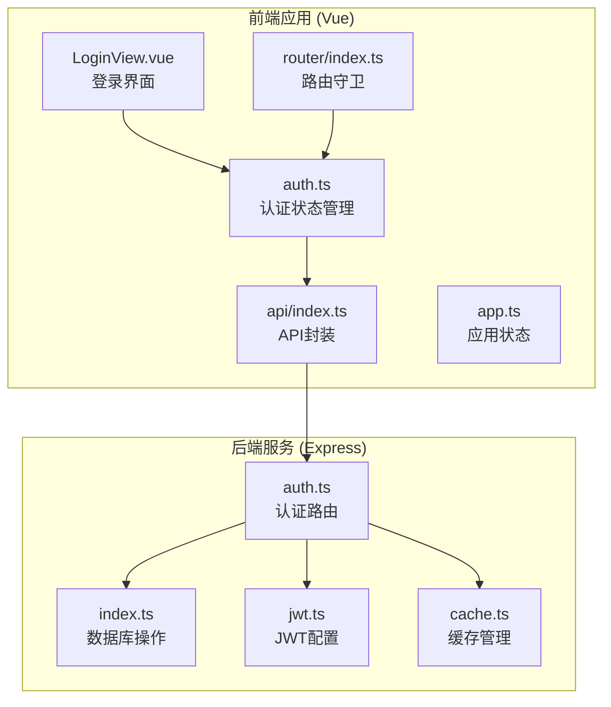

**图表来源**
- [LoginView.vue:1-300](file://src/admin/views/LoginView.vue#L1-L300)
- [auth.ts:1-128](file://src/stores/auth.ts#L1-L128)
- [index.ts:1-317](file://src/router/index.ts#L1-L317)
- [index.ts:1-608](file://src/api/index.ts#L1-L608)

**章节来源**
- [LoginView.vue:1-300](file://src/admin/views/LoginView.vue#L1-L300)
- [auth.ts:1-128](file://src/stores/auth.ts#L1-L128)
- [index.ts:1-317](file://src/router/index.ts#L1-L317)

## 核心组件

### 前端认证组件

前端认证系统由多个相互协作的组件组成：

1. **登录视图组件**：提供用户界面和表单验证
2. **认证状态存储**：管理用户会话和令牌生命周期
3. **API封装层**：统一处理HTTP请求和错误处理
4. **路由守卫**：控制访问权限和页面跳转

### 后端认证组件

后端认证系统包含以下核心组件：

1. **认证路由**：处理登录、登出和令牌验证请求
2. **数据库层**：用户数据存储和查询
3. **JWT配置**：令牌生成和验证机制
4. **安全中间件**：频率限制和访问控制

**章节来源**
- [auth.ts:15-127](file://src/stores/auth.ts#L15-L127)
- [index.ts:62-144](file://server/src/routes/auth.ts#L62-L144)

## 架构概览

管理员登录认证采用分层架构设计，确保前后端分离和职责明确：

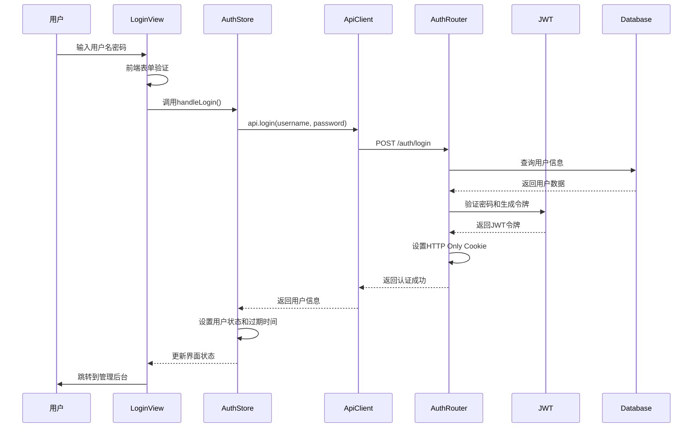

**图表来源**
- [LoginView.vue:20-42](file://src/admin/views/LoginView.vue#L20-L42)
- [auth.ts:71-85](file://src/stores/auth.ts#L71-L85)
- [index.ts:246-251](file://src/api/index.ts#L246-L251)
- [index.ts:65-144](file://server/src/routes/auth.ts#L65-L144)

## 详细组件分析

### 登录界面组件分析

登录界面采用现代化的双面板设计，提供直观的用户体验：

#### UI组件结构

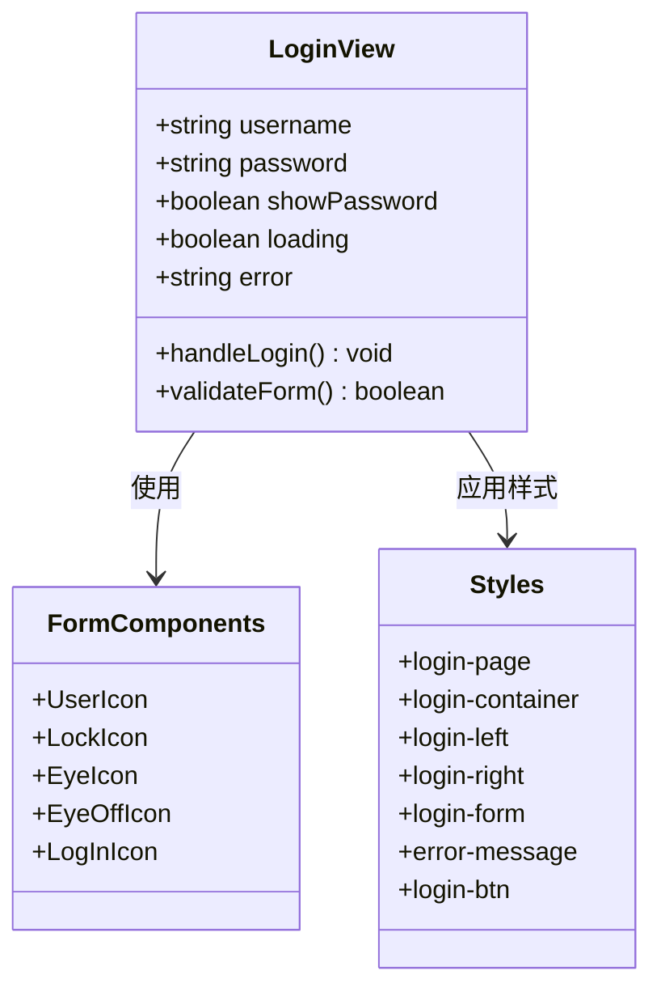

**图表来源**
- [LoginView.vue:1-119](file://src/admin/views/LoginView.vue#L1-L119)

#### 表单验证规则

登录表单实现了多层次的验证机制：

1. **必填字段检查**：用户名和密码不能为空
2. **实时反馈**：错误信息即时显示
3. **防重复提交**：加载状态下禁用提交按钮
4. **无障碍支持**：自动填充属性提升用户体验

#### 错误处理机制

系统采用渐进式错误处理策略：

- **前端验证错误**：立即显示错误消息
- **网络异常处理**：优雅降级和重试机制
- **认证失败处理**：清晰的错误提示和状态恢复

**章节来源**
- [LoginView.vue:20-42](file://src/admin/views/LoginView.vue#L20-L42)
- [LoginView.vue:276-284](file://src/admin/views/LoginView.vue#L276-L284)

### 认证状态管理分析

认证状态管理是整个系统的核心，负责维护用户会话状态和令牌生命周期：

#### 状态模型设计

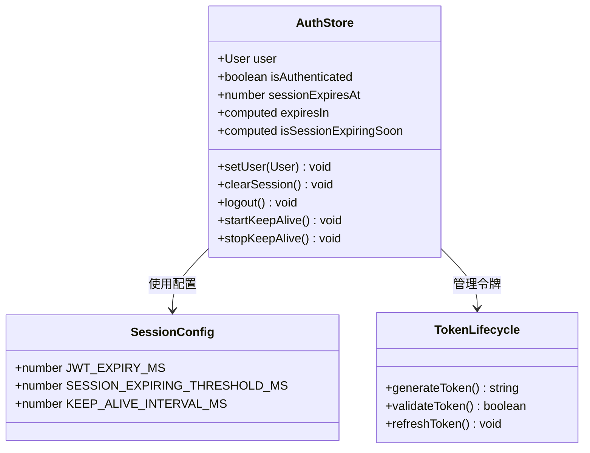

**图表来源**
- [auth.ts:15-127](file://src/stores/auth.ts#L15-L127)

#### 会话保活机制

系统实现了智能的会话保活策略：

1. **定时检查**：每5分钟自动验证令牌有效性
2. **阈值检测**：提前30分钟检测即将过期的会话
3. **自动续期**：在令牌有效期内保持登录状态
4. **过期处理**：令牌过期时自动清理状态

#### 令牌生命周期管理

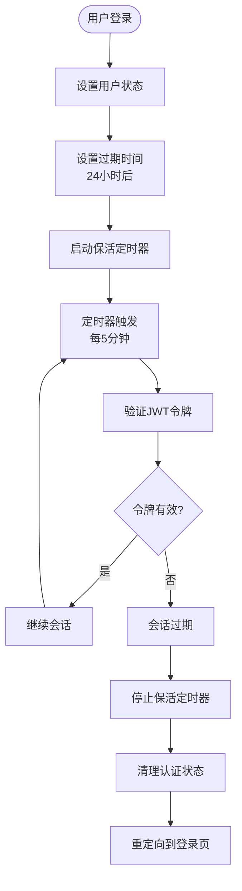

**图表来源**
- [auth.ts:37-55](file://src/stores/auth.ts#L37-L55)
- [auth.ts:67-85](file://src/stores/auth.ts#L67-L85)

**章节来源**
- [auth.ts:15-127](file://src/stores/auth.ts#L15-L127)

### JWT令牌生成与验证机制

JWT（JSON Web Token）是系统的核心认证机制，提供了无状态的身份验证能力：

#### 令牌结构设计

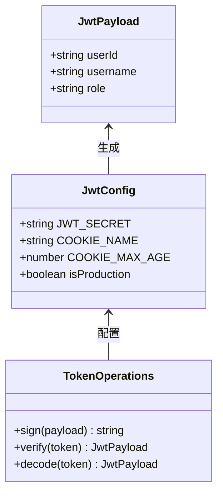

**图表来源**
- [index.ts:13-17](file://server/src/routes/auth.ts#L13-L17)
- [jwt.ts:20-22](file://server/src/utils/jwt.ts#L20-L22)

#### 令牌生成流程

1. **用户凭据验证**：检查用户名和密码的有效性
2. **密码哈希验证**：使用bcrypt验证密码
3. **令牌签名**：使用JWT_SECRET签名生成令牌
4. **Cookie设置**：设置HTTP Only Cookie存储令牌

#### 令牌验证机制

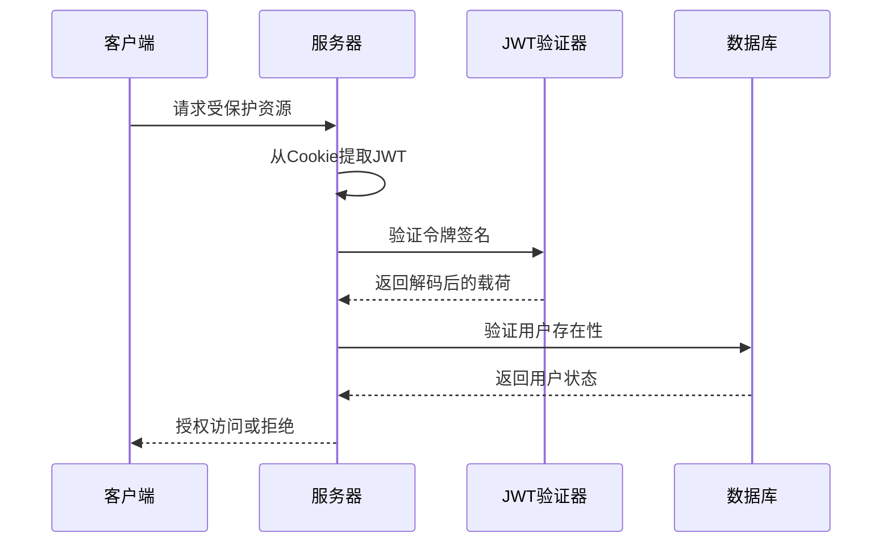

**图表来源**
- [index.ts:158-179](file://server/src/routes/auth.ts#L158-L179)
- [index.ts:308-344](file://server/src/routes/auth.ts#L308-L344)

**章节来源**
- [index.ts:114-118](file://server/src/routes/auth.ts#L114-L118)
- [jwt.ts:1-27](file://server/src/utils/jwt.ts#L1-L27)

### 后端认证路由分析

后端认证路由提供了完整的RESTful API接口：

#### 登录流程实现

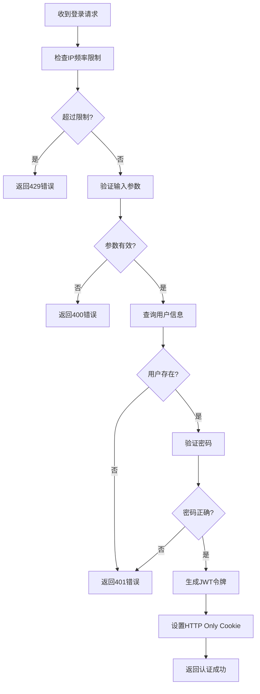

**图表来源**
- [index.ts:65-144](file://server/src/routes/auth.ts#L65-L144)

#### 安全防护措施

系统实现了多层安全防护：

1. **IP频率限制**：每15分钟最多5次登录尝试
2. **密码哈希存储**：使用bcrypt进行密码加密
3. **HTTP Only Cookie**：防止JavaScript访问令牌
4. **HTTPS强制**：生产环境启用安全传输

**章节来源**
- [index.ts:34-55](file://server/src/routes/auth.ts#L34-L55)
- [index.ts:114-128](file://server/src/routes/auth.ts#L114-L128)

### API封装层分析

API封装层提供了统一的HTTP请求处理机制：

#### 请求处理流程

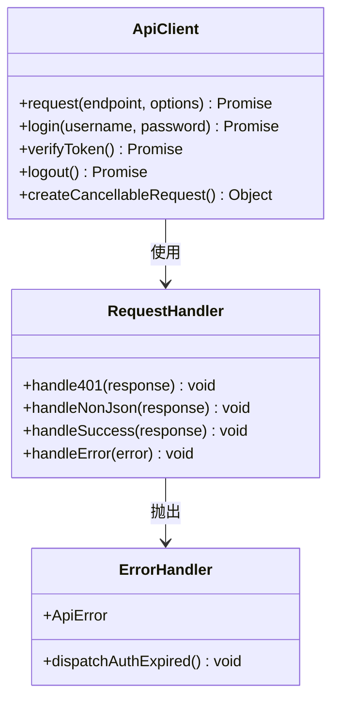

**图表来源**
- [index.ts:54-114](file://src/api/index.ts#L54-L114)
- [index.ts:246-251](file://src/api/index.ts#L246-L251)

#### 错误处理策略

API封装层实现了全面的错误处理机制：

1. **401未授权处理**：自动触发认证过期事件
2. **非JSON响应防御**：防止HTML响应绕过错误处理
3. **超时控制**：30秒请求超时机制
4. **取消支持**：支持请求取消和清理

**章节来源**
- [index.ts:94-104](file://src/api/index.ts#L94-L104)
- [index.ts:117-126](file://src/api/index.ts#L117-L126)

### 路由守卫分析

路由守卫确保只有认证用户才能访问管理后台：

#### 权限控制流程

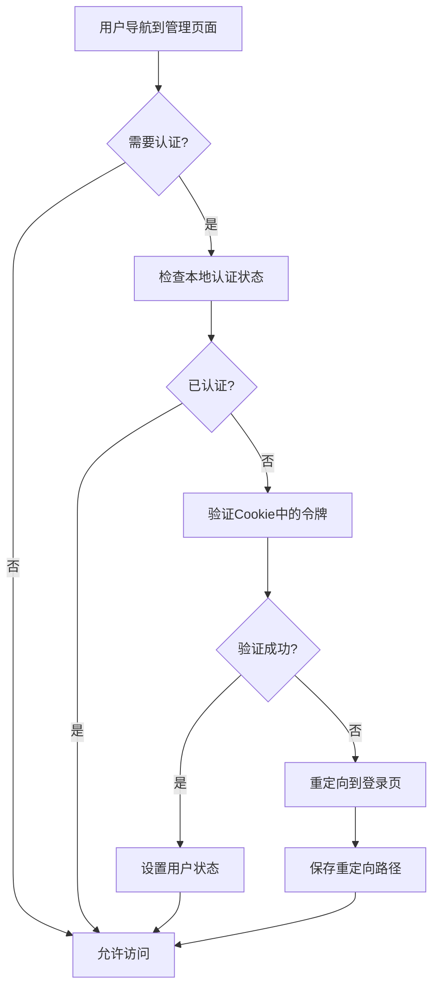

**图表来源**
- [index.ts:201-277](file://src/router/index.ts#L201-L277)

#### 自动登录功能

系统支持自动登录功能：

1. **令牌恢复**：启动时自动验证现有令牌
2. **状态同步**：与后端保持认证状态同步
3. **无缝体验**：用户无需手动重新登录

**章节来源**
- [index.ts:259-272](file://src/router/index.ts#L259-L272)

## 依赖关系分析

管理员登录认证系统的依赖关系体现了清晰的分层架构：

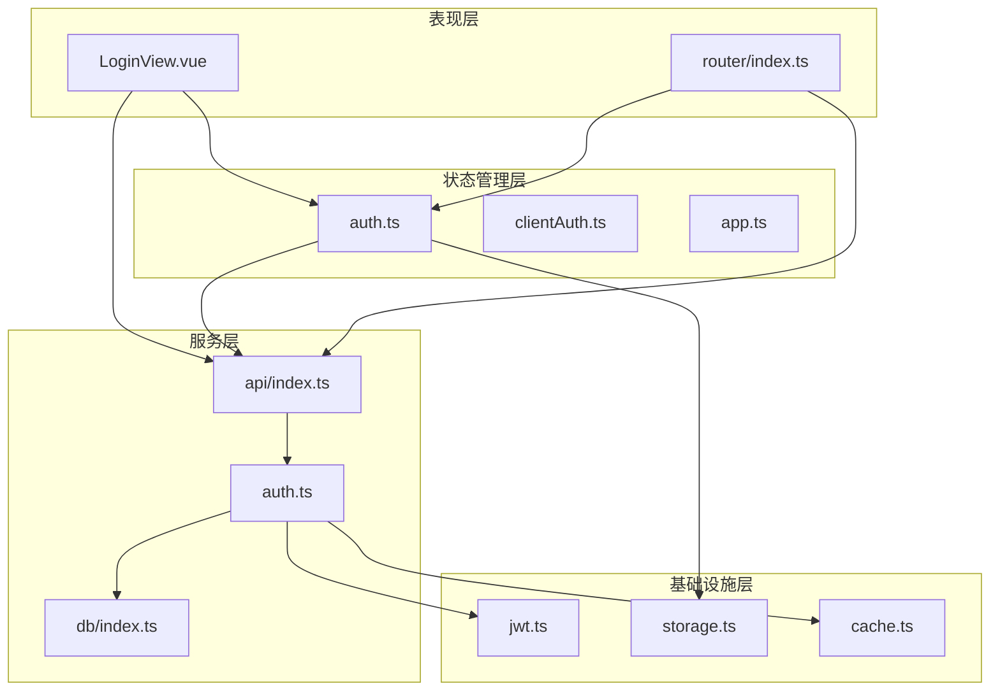

**图表来源**
- [LoginView.vue:1-12](file://src/admin/views/LoginView.vue#L1-L12)
- [auth.ts:1-4](file://src/stores/auth.ts#L1-L4)
- [index.ts:1-3](file://src/api/index.ts#L1-L3)

**章节来源**
- [index.ts:1-6](file://src/router/index.ts#L1-L6)
- [index.ts:1-7](file://server/src/routes/auth.ts#L1-L7)

## 性能考虑

系统在设计时充分考虑了性能优化：

### 缓存策略

1. **前端内存缓存**：30秒TTL的stale-while-revalidate策略
2. **数据库查询缓存**：针对不频繁变化的数据
3. **静态资源缓存**：利用浏览器缓存机制

### 会话保活优化

1. **定时器去抖**：避免频繁的令牌验证请求
2. **阈值检测**：提前30分钟检测即将过期的会话
3. **智能清理**：定期清理过期的IP记录

### 网络优化

1. **请求超时控制**：30秒超时防止长时间等待
2. **并发请求管理**：避免重复的认证请求
3. **错误快速响应**：及时处理网络异常

## 故障排除指南

### 常见问题及解决方案

#### 登录失败问题

**问题症状**：用户无法登录，显示"用户名或密码错误"

**可能原因**：
1. 用户名或密码输入错误
2. 账户被锁定或禁用
3. 数据库连接异常

**解决步骤**：
1. 检查用户名和密码是否正确
2. 确认账户状态正常
3. 查看服务器日志了解具体错误
4. 验证数据库连接状态

#### 会话过期问题

**问题症状**：登录后一段时间自动退出

**可能原因**：
1. 令牌过期（24小时）
2. 会话保活定时器异常
3. 浏览器Cookie被清理

**解决步骤**：
1. 检查浏览器Cookie设置
2. 验证会话保活定时器状态
3. 查看控制台是否有错误信息
4. 重新登录系统

#### 频率限制问题

**问题症状**：多次登录尝试后被限制

**可能原因**：
1. IP地址被临时限制
2. 频繁的登录尝试
3. 代理服务器影响

**解决步骤**：
1. 等待15分钟冷却时间
2. 检查网络环境
3. 避免频繁的登录尝试
4. 联系系统管理员

#### 安全相关问题

**问题症状**：浏览器警告或安全提示

**可能原因**：
1. HTTP Only Cookie设置问题
2. HTTPS证书配置错误
3. SameSite属性冲突

**解决步骤**：
1. 确认使用HTTPS协议
2. 检查Cookie属性设置
3. 验证SameSite兼容性
4. 更新浏览器版本

### 调试技巧

1. **浏览器开发者工具**：查看Network标签页的请求和响应
2. **控制台日志**：监控JavaScript错误和警告
3. **服务器日志**：查看后端错误和访问日志
4. **认证状态检查**：验证Cookie和localStorage状态

### 性能监控

1. **登录响应时间**：监控登录请求的处理时间
2. **会话保活频率**：跟踪令牌验证的执行频率
3. **错误率统计**：监控认证相关的错误发生率
4. **用户行为分析**：了解用户的登录模式和习惯

**章节来源**
- [index.ts:36-46](file://src/api/index.ts#L36-L46)
- [auth.ts:37-55](file://src/stores/auth.ts#L37-L55)

## 结论

RLRMS管理员登录认证系统采用了现代的安全架构设计，通过JWT令牌和HTTP Only Cookie实现了安全可靠的认证机制。系统具有以下优势：

1. **安全性高**：采用HTTP Only Cookie存储令牌，有效防止XSS攻击
2. **用户体验好**：提供直观的登录界面和流畅的操作体验
3. **可靠性强**：实现完善的错误处理和故障恢复机制
4. **扩展性强**：模块化设计便于功能扩展和维护

系统在设计时充分考虑了实际应用场景的需求，既满足了安全要求，又保证了使用的便利性。通过持续的优化和改进，该认证系统能够为RLRMS管理后台提供稳定可靠的服务支撑。