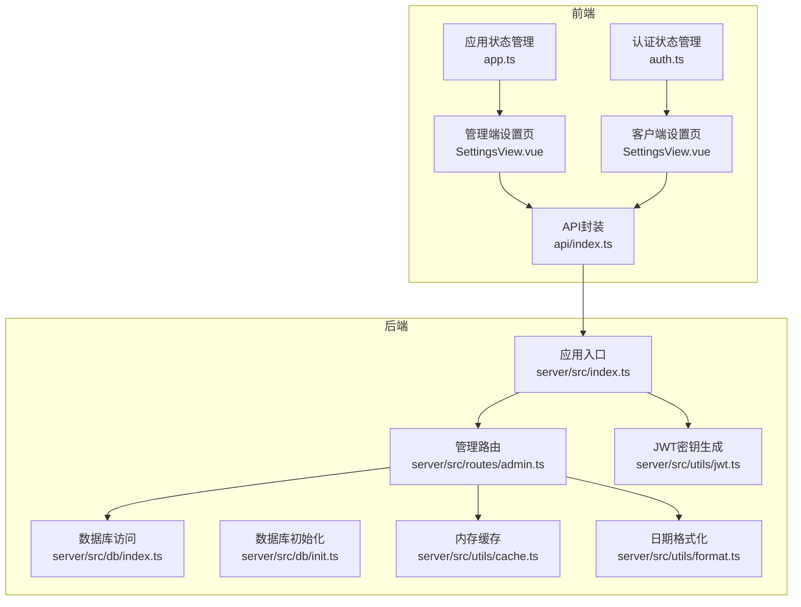
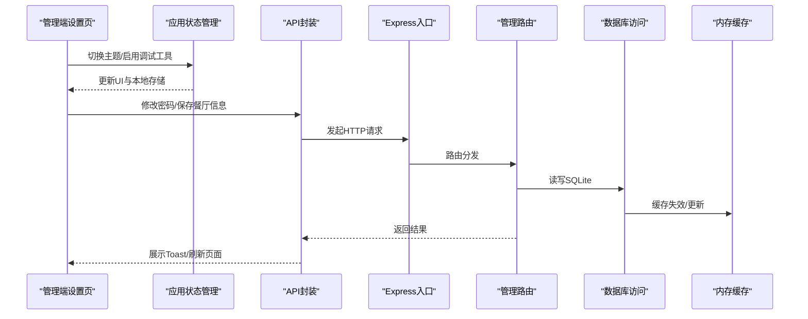
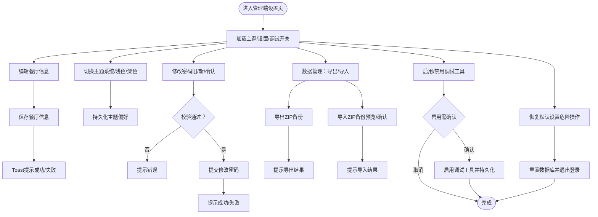
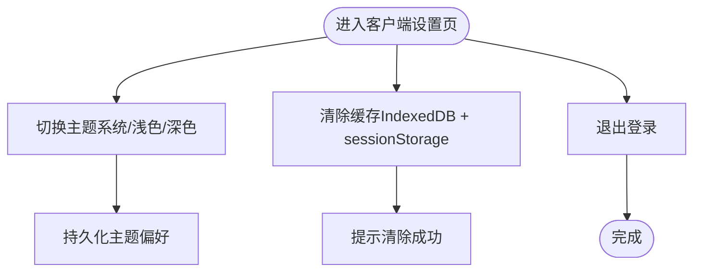
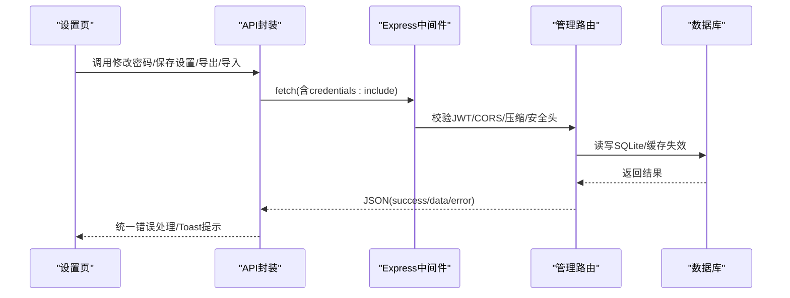
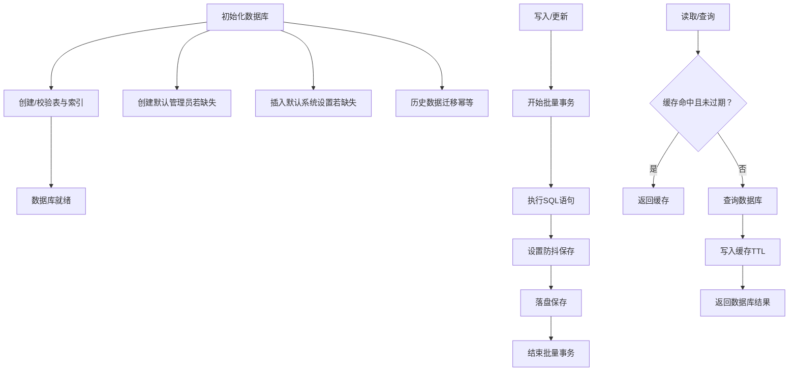
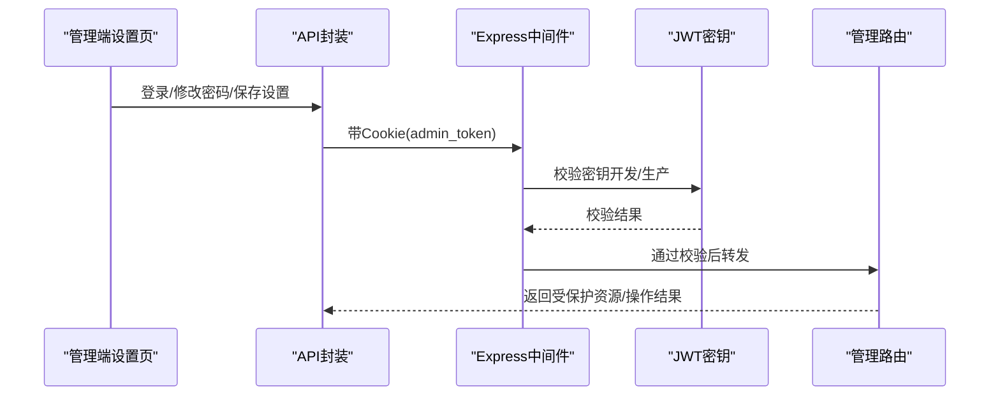
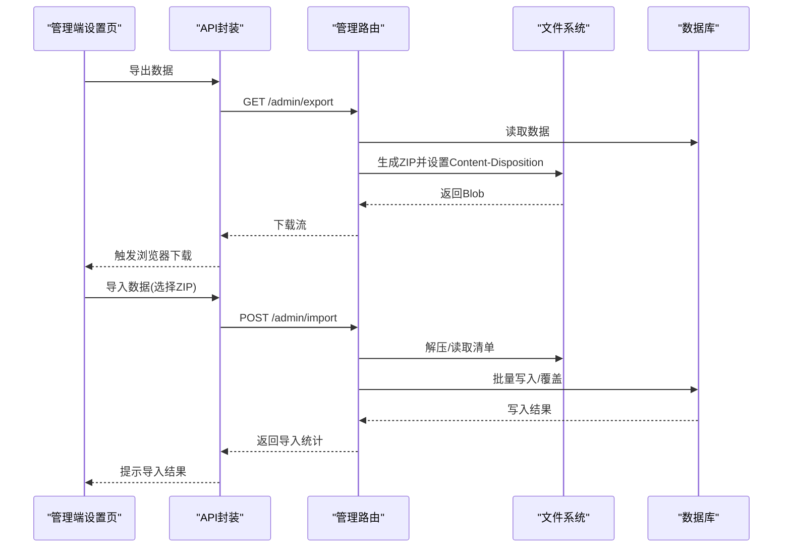
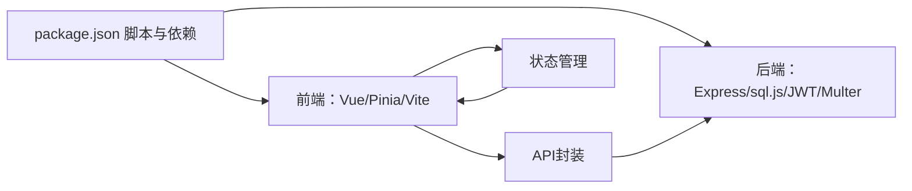

# 系统设置

<cite>
**本文引用的文件**
- [server/src/index.ts](file://server/src/index.ts)
- [server/src/db/index.ts](file://server/src/db/index.ts)
- [server/src/db/init.ts](file://server/src/db/init.ts)
- [server/src/utils/cache.ts](file://server/src/utils/cache.ts)
- [server/src/utils/jwt.ts](file://server/src/utils/jwt.ts)
- [server/src/utils/format.ts](file://server/src/utils/format.ts)
- [server/src/routes/admin.ts](file://server/src/routes/admin.ts)
- [src/api/index.ts](file://src/api/index.ts)
- [src/stores/app.ts](file://src/stores/app.ts)
- [src/stores/auth.ts](file://src/stores/auth.ts)
- [src/admin/views/SettingsView.vue](file://src/admin/views/SettingsView.vue)
- [src/client/views/SettingsView.vue](file://src/client/views/SettingsView.vue)
- [package.json](file://package.json)
</cite>

## 目录
1. [简介](#简介)
2. [项目结构](#项目结构)
3. [核心组件](#核心组件)
4. [架构总览](#架构总览)
5. [详细组件分析](#详细组件分析)
6. [依赖关系分析](#依赖关系分析)
7. [性能考虑](#性能考虑)
8. [故障排查指南](#故障排查指南)
9. [结论](#结论)
10. [附录](#附录)

## 简介
本文件面向RLRMS系统的“系统设置”功能，围绕以下目标进行系统化说明：
- 系统参数配置与基础数据管理
- 品牌信息设置与功能开关控制
- 数据库配置、缓存设置、文件上传限制、安全参数
- 系统备份恢复、日志管理、性能监控配置
- 多语言支持、主题切换、移动端适配
- 系统升级、版本管理、兼容性配置、故障诊断工具

## 项目结构
RLRMS采用前后端分离架构，前端包含管理端与客户端两套设置界面，后端提供REST接口与SQLite存储；整体通过Express中间件实现安全与性能控制。

**图示来源**
- [server/src/index.ts:1-176](file://server/src/index.ts#L1-L176)
- [server/src/routes/admin.ts:1-1887](file://server/src/routes/admin.ts#L1-L1887)
- [server/src/db/index.ts:1-156](file://server/src/db/index.ts#L1-L156)
- [server/src/db/init.ts:1-204](file://server/src/db/init.ts#L1-L204)
- [server/src/utils/cache.ts:1-73](file://server/src/utils/cache.ts#L1-L73)
- [server/src/utils/jwt.ts:1-27](file://server/src/utils/jwt.ts#L1-L27)
- [server/src/utils/format.ts:1-12](file://server/src/utils/format.ts#L1-L12)
- [src/api/index.ts:1-608](file://src/api/index.ts#L1-L608)
- [src/stores/app.ts:1-122](file://src/stores/app.ts#L1-L122)
- [src/stores/auth.ts:1-128](file://src/stores/auth.ts#L1-L128)
- [src/admin/views/SettingsView.vue:1-907](file://src/admin/views/SettingsView.vue#L1-L907)
- [src/client/views/SettingsView.vue:1-351](file://src/client/views/SettingsView.vue#L1-L351)

**章节来源**
- [server/src/index.ts:1-176](file://server/src/index.ts#L1-L176)
- [src/admin/views/SettingsView.vue:1-907](file://src/admin/views/SettingsView.vue#L1-L907)
- [src/client/views/SettingsView.vue:1-351](file://src/client/views/SettingsView.vue#L1-L351)

## 核心组件
- 管理端设置页：提供餐厅信息、外观设置（主题）、账号设置（修改密码）、关于、数据管理（导出/导入）、开发者选项（调试工具开关）、恢复默认设置与退出登录。
- 客户端设置页：提供个人资料展示、主题切换、关于、清除缓存与退出登录。
- API封装：统一请求、超时、401处理、缓存策略与下载导出。
- 应用状态管理：主题持久化、系统主题监听、调试工具开关、Toast提示。
- 认证状态管理：JWT生命周期、会话保活、即将过期提醒。
- 数据库与缓存：SQLite存储、批量写入、防抖落盘、内存缓存与失效策略。
- 安全与中间件：CORS、压缩、安全响应头、JWT校验、文件上传限制。

**章节来源**
- [src/admin/views/SettingsView.vue:1-907](file://src/admin/views/SettingsView.vue#L1-L907)
- [src/client/views/SettingsView.vue:1-351](file://src/client/views/SettingsView.vue#L1-L351)
- [src/api/index.ts:1-608](file://src/api/index.ts#L1-L608)
- [src/stores/app.ts:1-122](file://src/stores/app.ts#L1-L122)
- [src/stores/auth.ts:1-128](file://src/stores/auth.ts#L1-L128)
- [server/src/db/index.ts:1-156](file://server/src/db/index.ts#L1-L156)
- [server/src/utils/cache.ts:1-73](file://server/src/utils/cache.ts#L1-L73)

## 架构总览
系统设置功能贯穿前端视图层、状态管理层、API封装层与后端路由层，后端通过Express中间件统一处理安全与性能，数据库采用SQLite并提供备份/导入能力。

**图示来源**
- [src/admin/views/SettingsView.vue:1-907](file://src/admin/views/SettingsView.vue#L1-L907)
- [src/stores/app.ts:1-122](file://src/stores/app.ts#L1-L122)
- [src/api/index.ts:1-608](file://src/api/index.ts#L1-L608)
- [server/src/index.ts:1-176](file://server/src/index.ts#L1-L176)
- [server/src/routes/admin.ts:1-1887](file://server/src/routes/admin.ts#L1-L1887)
- [server/src/db/index.ts:1-156](file://server/src/db/index.ts#L1-L156)
- [server/src/utils/cache.ts:1-73](file://server/src/utils/cache.ts#L1-L73)

## 详细组件分析

### 管理端设置页（系统参数与数据管理）
- 餐厅信息：支持名称、电话、地址、营业时间的编辑与保存。
- 外观设置：支持系统/浅色/深色主题切换，主题偏好持久化到本地存储。
- 账号设置：修改密码（旧密码、新密码一致性与长度校验）。
- 关于：展示系统版本与技术栈信息。
- 数据管理：导出ZIP备份、导入ZIP备份（包含预览清单与覆盖风险提示）。
- 开发者选项：调试工具开关（启用前二次确认，仅限开发场景）。
- 恢复默认设置：重置数据库（清空所有数据并恢复默认设置）。
- 退出登录：清理会话并跳转登录页。

**图示来源**
- [src/admin/views/SettingsView.vue:1-907](file://src/admin/views/SettingsView.vue#L1-L907)
- [src/api/index.ts:1-608](file://src/api/index.ts#L1-L608)
- [src/stores/app.ts:1-122](file://src/stores/app.ts#L1-L122)

**章节来源**
- [src/admin/views/SettingsView.vue:1-907](file://src/admin/views/SettingsView.vue#L1-L907)
- [src/api/index.ts:1-608](file://src/api/index.ts#L1-L608)
- [src/stores/app.ts:1-122](file://src/stores/app.ts#L1-L122)

### 客户端设置页（主题与缓存）
- 主题：支持系统/浅色/深色主题切换，偏好持久化。
- 关于：展示应用版本与描述。
- 清除缓存：清空IndexedDB与会话存储，提示用户。
- 退出登录：清理客户端会话并返回首页。

**图示来源**
- [src/client/views/SettingsView.vue:1-351](file://src/client/views/SettingsView.vue#L1-L351)
- [src/stores/app.ts:1-122](file://src/stores/app.ts#L1-L122)

**章节来源**
- [src/client/views/SettingsView.vue:1-351](file://src/client/views/SettingsView.vue#L1-L351)
- [src/stores/app.ts:1-122](file://src/stores/app.ts#L1-L122)

### API封装与安全中间件
- 请求封装：统一超时、凭据携带、401处理、JSON响应校验、错误包装。
- 缓存策略：前端stale-while-revalidate缓存，降低带宽与延迟。
- 安全中间件：生产环境CORS限制、压缩阈值与过滤（SSE不压缩）、安全响应头、健康检查。
- 文件上传：后端multer限制大小与类型，存储至public/sources目录。

**图示来源**
- [src/api/index.ts:1-608](file://src/api/index.ts#L1-L608)
- [server/src/index.ts:1-176](file://server/src/index.ts#L1-L176)
- [server/src/routes/admin.ts:1-1887](file://server/src/routes/admin.ts#L1-L1887)
- [server/src/db/index.ts:1-156](file://server/src/db/index.ts#L1-L156)

**章节来源**
- [src/api/index.ts:1-608](file://src/api/index.ts#L1-L608)
- [server/src/index.ts:1-176](file://server/src/index.ts#L1-L176)
- [server/src/routes/admin.ts:1-1887](file://server/src/routes/admin.ts#L1-L1887)

### 数据库与缓存配置
- 数据库：SQLite（sql.js），数据目录server/data，首次运行自动建表与索引，初始化默认设置与管理员账户。
- 写入优化：批量事务、防抖落盘（SAVE_DEBOUNCE_MS），减少磁盘IO。
- 内存缓存：TTL缓存（默认30秒），提供键空间与前缀失效，用于分类、菜品、设置、桌位等查询结果。

**图示来源**
- [server/src/db/init.ts:1-204](file://server/src/db/init.ts#L1-L204)
- [server/src/db/index.ts:1-156](file://server/src/db/index.ts#L1-L156)
- [server/src/utils/cache.ts:1-73](file://server/src/utils/cache.ts#L1-L73)

**章节来源**
- [server/src/db/init.ts:1-204](file://server/src/db/init.ts#L1-L204)
- [server/src/db/index.ts:1-156](file://server/src/db/index.ts#L1-L156)
- [server/src/utils/cache.ts:1-73](file://server/src/utils/cache.ts#L1-L73)

### 安全参数与认证
- JWT密钥：开发模式基于主机特征派生固定密钥；生产模式支持环境变量或动态密钥（建议设置）。
- 认证流程：Cookie中携带admin_token，后端JWT校验，角色限定为admin。
- 会话保活：前端定时校验token，接近过期阈值时触发过期事件。
- 安全响应头：X-Content-Type-Options、X-Frame-Options、X-XSS-Protection、Referrer-Policy。

**图示来源**
- [server/src/utils/jwt.ts:1-27](file://server/src/utils/jwt.ts#L1-L27)
- [server/src/index.ts:1-176](file://server/src/index.ts#L1-L176)
- [server/src/routes/admin.ts:1-1887](file://server/src/routes/admin.ts#L1-L1887)

**章节来源**
- [server/src/utils/jwt.ts:1-27](file://server/src/utils/jwt.ts#L1-L27)
- [server/src/index.ts:1-176](file://server/src/index.ts#L1-L176)
- [src/stores/auth.ts:1-128](file://src/stores/auth.ts#L1-L128)

### 备份恢复与日志管理
- 备份：导出ZIP包含清单与各实体计数，便于审计与迁移。
- 恢复：导入ZIP覆盖当前数据，提供预览与二次确认。
- 日志：健康检查接口返回状态与时间戳；错误中间件输出堆栈与错误消息。

**图示来源**
- [src/api/index.ts:505-595](file://src/api/index.ts#L505-L595)
- [server/src/routes/admin.ts:1-1887](file://server/src/routes/admin.ts#L1-L1887)
- [server/src/db/index.ts:1-156](file://server/src/db/index.ts#L1-L156)

**章节来源**
- [src/api/index.ts:505-595](file://src/api/index.ts#L505-L595)
- [server/src/routes/admin.ts:1-1887](file://server/src/routes/admin.ts#L1-L1887)

### 性能监控配置
- 前端缓存：stale-while-revalidate，降低重复请求与带宽消耗。
- 后端缓存：TTL内存缓存，键空间与前缀失效，减少热点查询压力。
- 压缩：Gzip压缩阈值与过滤（SSE不压缩），平衡传输体积与实时性。
- 数据库：批量事务与防抖落盘，降低写放大。

**章节来源**
- [src/api/index.ts:1-608](file://src/api/index.ts#L1-L608)
- [server/src/utils/cache.ts:1-73](file://server/src/utils/cache.ts#L1-L73)
- [server/src/index.ts:1-176](file://server/src/index.ts#L1-L176)
- [server/src/db/index.ts:1-156](file://server/src/db/index.ts#L1-L156)

### 多语言支持、主题切换与移动端适配
- 多语言：当前仓库未发现专门的国际化实现，建议后续引入i18n方案。
- 主题切换：系统/浅色/深色三态，支持系统跟随，偏好持久化。
- 移动端适配：组件使用相对单位与flex布局，具备基础响应式样式。

**章节来源**
- [src/stores/app.ts:1-122](file://src/stores/app.ts#L1-L122)
- [src/admin/views/SettingsView.vue:1-907](file://src/admin/views/SettingsView.vue#L1-L907)
- [src/client/views/SettingsView.vue:1-351](file://src/client/views/SettingsView.vue#L1-L351)

### 系统升级、版本管理与兼容性
- 版本：前端设置页展示版本信息；后端初始化脚本包含默认设置。
- 升级：数据库迁移采用幂等策略（历史字段回填、用户名迁移），避免重复执行。
- 兼容性：开发模式密钥派生，保证热重载不丢失token；生产模式建议固定密钥。

**章节来源**
- [server/src/db/init.ts:167-197](file://server/src/db/init.ts#L167-L197)
- [server/src/utils/jwt.ts:1-27](file://server/src/utils/jwt.ts#L1-L27)
- [src/admin/views/SettingsView.vue:1-907](file://src/admin/views/SettingsView.vue#L1-L907)

### 故障诊断工具
- 调试工具开关：管理端设置页提供“调试工具”，启用前二次确认，仅开发场景使用。
- Schema查看：后端提供schema查询接口，便于诊断表结构与外键关系。
- 查询调试：后端提供SQL调试接口，返回列名、行数据与变更计数。

**章节来源**
- [src/admin/views/SettingsView.vue:1-907](file://src/admin/views/SettingsView.vue#L1-L907)
- [src/api/index.ts:597-608](file://src/api/index.ts#L597-L608)

## 依赖关系分析
- 前端依赖：Vue 3、Pinia、Vite、TypeScript、Lucide图标库等。
- 后端依赖：Express、sql.js、bcryptjs、jsonwebtoken、multer、sharp、adm-zip、archiver等。
- 构建与运行：开发/生产脚本、打包与启动命令。

**图示来源**
- [package.json:1-64](file://package.json#L1-L64)

**章节来源**
- [package.json:1-64](file://package.json#L1-L64)

## 性能考虑
- 写入优化：批量事务与防抖保存，降低磁盘IO与锁竞争。
- 读取优化：内存缓存与前端stale-while-revalidate，减少重复请求。
- 压缩策略：对非SSE响应启用压缩，平衡带宽与实时性。
- 索引策略：为高频查询字段建立索引，提升查询效率。

## 故障排查指南
- 503服务不可用：数据库初始化中，等待初始化完成或检查数据库文件权限。
- 401未授权：检查Cookie中admin_token是否存在与有效，必要时重新登录。
- 导入失败：确认ZIP包包含合法清单与数据，避免损坏或类型不符。
- 主题不生效：检查本地存储偏好与系统主题监听，确认data-theme属性正确设置。
- 缓存异常：客户端可执行“清除缓存”，前端缓存TTL为30秒，可等待刷新。

**章节来源**
- [server/src/index.ts:122-140](file://server/src/index.ts#L122-L140)
- [src/api/index.ts:94-114](file://src/api/index.ts#L94-L114)
- [src/client/views/SettingsView.vue:1-351](file://src/client/views/SettingsView.vue#L1-L351)

## 结论
系统设置功能覆盖了RLRMS的核心运维与用户体验需求：通过管理端设置页实现品牌信息与功能开关控制，借助API封装与后端路由保障安全与性能，结合SQLite与内存缓存提供高效的数据访问。未来可在多语言、版本发布流程与监控告警方面进一步完善。

## 附录
- 健康检查：/health接口返回数据库就绪状态与时间戳。
- 默认管理员：首次启动自动创建，初始密码在初始化脚本中可见（生产环境务必修改）。

**章节来源**
- [server/src/index.ts:90-96](file://server/src/index.ts#L90-L96)
- [server/src/db/init.ts:140-149](file://server/src/db/init.ts#L140-L149)