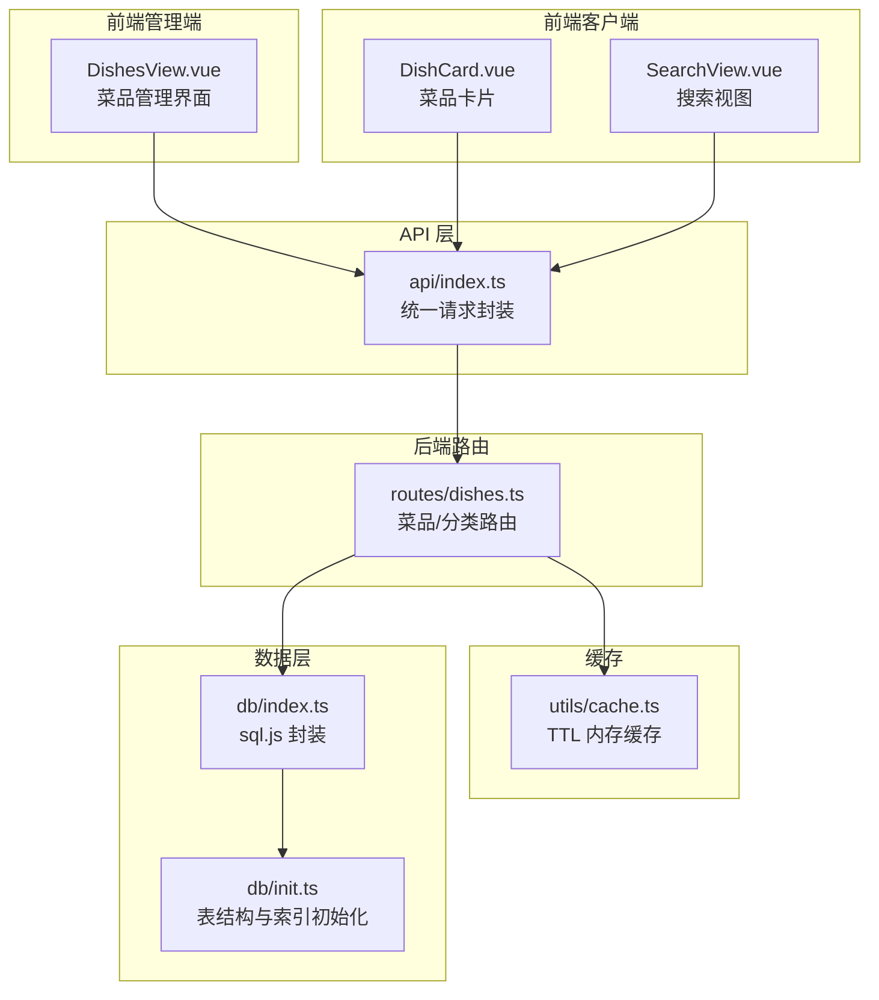
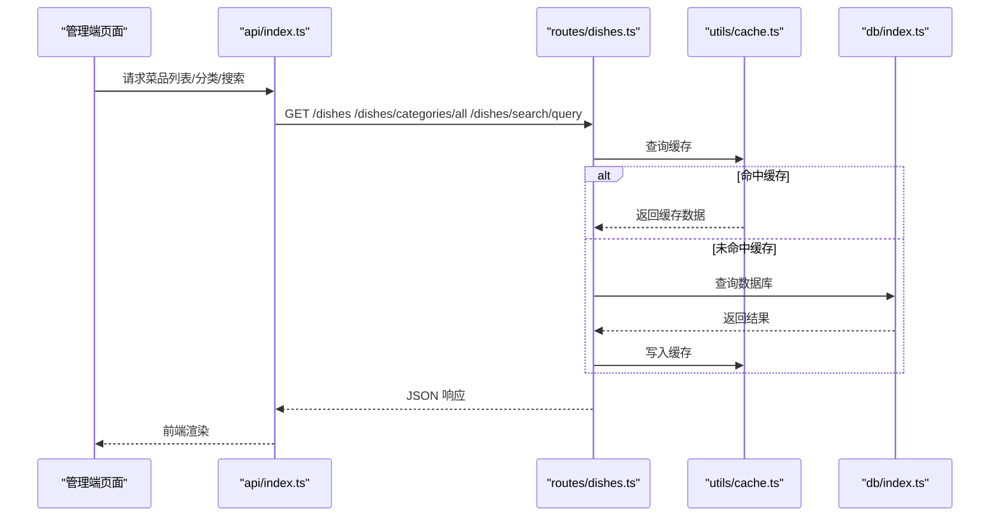
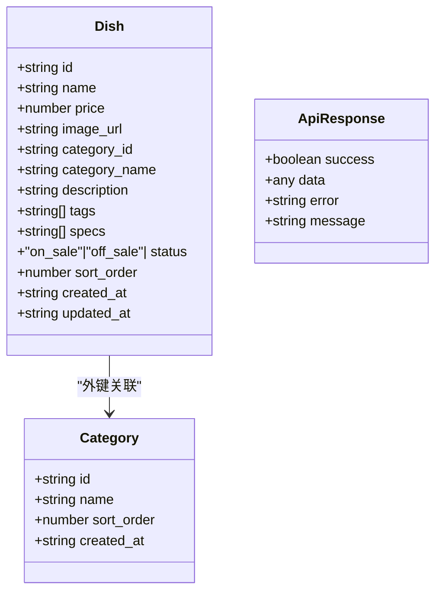
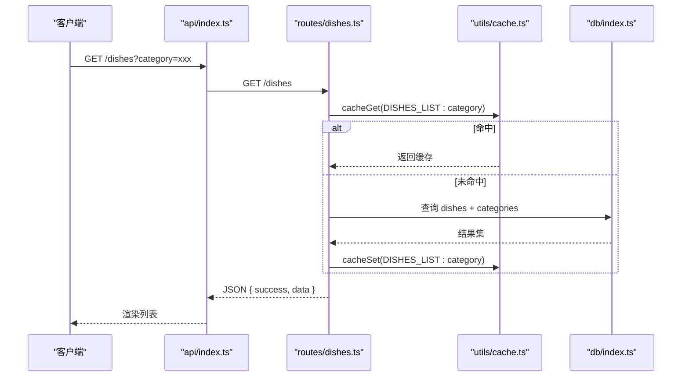
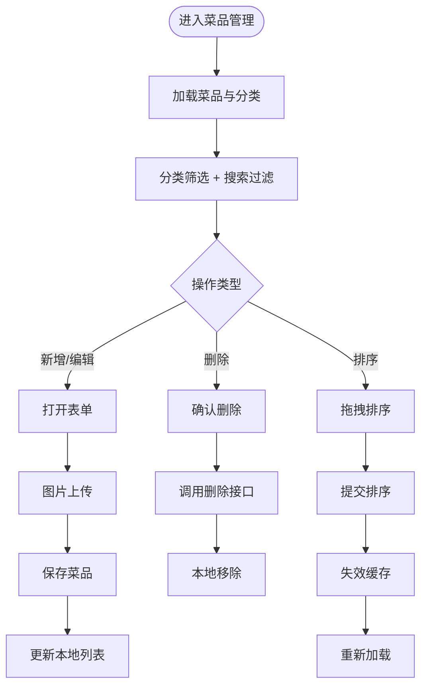
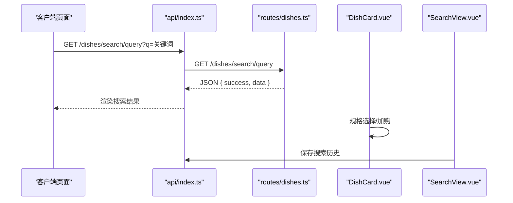
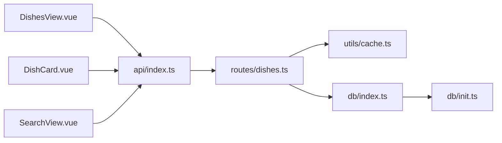

# 菜品管理

<cite>
**本文引用的文件**
- [server/src/routes/dishes.ts](file://server/src/routes/dishes.ts)
- [server/src/db/index.ts](file://server/src/db/index.ts)
- [server/src/db/init.ts](file://server/src/db/init.ts)
- [server/src/utils/cache.ts](file://server/src/utils/cache.ts)
- [server/src/validators/index.ts](file://server/src/validators/index.ts)
- [src/admin/views/DishesView.vue](file://src/admin/views/DishesView.vue)
- [src/api/index.ts](file://src/api/index.ts)
- [src/types/index.ts](file://src/types/index.ts)
- [src/client/components/DishCard.vue](file://src/client/components/DishCard.vue)
- [src/client/views/SearchView.vue](file://src/client/views/SearchView.vue)
</cite>

## 目录
1. [简介](#简介)
2. [项目结构](#项目结构)
3. [核心组件](#核心组件)
4. [架构总览](#架构总览)
5. [详细组件分析](#详细组件分析)
6. [依赖关系分析](#依赖关系分析)
7. [性能考虑](#性能考虑)
8. [故障排查指南](#故障排查指南)
9. [结论](#结论)
10. [附录](#附录)

## 简介
本文件面向 RL RMS 的菜品管理功能，提供从后端接口到前端界面的完整说明。内容涵盖菜品的增删改查、分类管理、价格设置、图片上传；菜品状态管理（上架/下架）、排序调整、搜索过滤；数据验证规则、图片处理机制、缓存策略与性能优化；以及导入导出、数据备份恢复、SEO 优化建议。文档同时给出关键流程的时序图与类图，帮助开发者快速定位实现位置与扩展点。

## 项目结构
菜品管理涉及前后端协作：
- 后端路由层：提供菜品与分类的查询、新增、修改、删除、排序、搜索等接口，并维护缓存。
- 数据层：基于 sql.js 的嵌入式数据库，提供事务批处理与索引优化。
- 前端管理端：提供菜品与分类的可视化管理界面，支持拖拽排序、标签与规格配置、图片上传等。
- 前端客户端：展示菜品卡片、规格选择、加入购物车、搜索历史等功能。
- API 层：统一封装请求、响应、错误处理与前端缓存策略。

图表来源
- [server/src/routes/dishes.ts:1-216](file://server/src/routes/dishes.ts#L1-L216)
- [server/src/utils/cache.ts:1-73](file://server/src/utils/cache.ts#L1-L73)
- [server/src/db/index.ts:1-156](file://server/src/db/index.ts#L1-L156)
- [server/src/db/init.ts:1-204](file://server/src/db/init.ts#L1-L204)
- [src/api/index.ts:1-608](file://src/api/index.ts#L1-L608)
- [src/admin/views/DishesView.vue:1-1162](file://src/admin/views/DishesView.vue#L1-L1162)
- [src/client/components/DishCard.vue:1-372](file://src/client/components/DishCard.vue#L1-L372)
- [src/client/views/SearchView.vue:1-359](file://src/client/views/SearchView.vue#L1-L359)

章节来源
- [server/src/routes/dishes.ts:1-216](file://server/src/routes/dishes.ts#L1-L216)
- [server/src/db/index.ts:1-156](file://server/src/db/index.ts#L1-L156)
- [server/src/db/init.ts:1-204](file://server/src/db/init.ts#L1-L204)
- [server/src/utils/cache.ts:1-73](file://server/src/utils/cache.ts#L1-L73)
- [src/api/index.ts:1-608](file://src/api/index.ts#L1-L608)
- [src/admin/views/DishesView.vue:1-1162](file://src/admin/views/DishesView.vue#L1-L1162)
- [src/client/components/DishCard.vue:1-372](file://src/client/components/DishCard.vue#L1-L372)
- [src/client/views/SearchView.vue:1-359](file://src/client/views/SearchView.vue#L1-L359)

## 核心组件
- 菜品模型与类型：定义菜品字段（名称、价格、图片、分类、描述、标签、规格、状态、排序、时间戳）。
- 分类模型：包含名称、排序、时间戳。
- 菜品路由：提供菜品列表、详情、搜索、分类、首页聚合数据等接口。
- 数据库封装：sql.js 初始化、读写、批处理、索引与持久化。
- 缓存：TTL 内存缓存，支持失效与批量失效。
- 验证器：使用 Zod 对菜品新增/更新进行字段长度、数值范围、枚举值等校验。
- 管理端界面：菜品增删改、分类管理、标签与规格配置、图片上传、排序拖拽。
- 客户端界面：菜品卡片、规格选择、加入购物车、搜索历史。
- API 封装：统一请求、超时、401 处理、前端缓存（stale-while-revalidate）。

章节来源
- [src/types/index.ts:53-68](file://src/types/index.ts#L53-L68)
- [src/types/index.ts:45-51](file://src/types/index.ts#L45-L51)
- [server/src/routes/dishes.ts:24-216](file://server/src/routes/dishes.ts#L24-L216)
- [server/src/db/index.ts:75-156](file://server/src/db/index.ts#L75-L156)
- [server/src/utils/cache.ts:1-73](file://server/src/utils/cache.ts#L1-L73)
- [server/src/validators/index.ts:21-40](file://server/src/validators/index.ts#L21-L40)
- [src/admin/views/DishesView.vue:1-332](file://src/admin/views/DishesView.vue#L1-L332)
- [src/client/components/DishCard.vue:1-85](file://src/client/components/DishCard.vue#L1-L85)
- [src/api/index.ts:128-171](file://src/api/index.ts#L128-L171)

## 架构总览
菜品管理采用“前端 Vue + 后端 Express + sql.js”的轻量架构。前端通过 api/index.ts 统一发起请求，后端 routes/dishes.ts 提供 REST 接口，数据访问通过 db/index.ts 封装，缓存通过 utils/cache.ts 管理。数据库初始化由 db/init.ts 完成，包含表结构、索引与默认数据。

图表来源
- [src/api/index.ts:128-171](file://src/api/index.ts#L128-L171)
- [server/src/routes/dishes.ts:24-174](file://server/src/routes/dishes.ts#L24-L174)
- [server/src/utils/cache.ts:18-36](file://server/src/utils/cache.ts#L18-L36)
- [server/src/db/index.ts:111-140](file://server/src/db/index.ts#L111-L140)

## 详细组件分析

### 菜品数据模型与验证
- 模型字段：菜品包含名称、价格、图片 URL、分类外键、描述、标签数组、规格数组、状态（上架/下架）、排序、创建/更新时间。
- 验证规则：名称长度限制、价格非负、分类可选、描述长度限制、标签/规格数组可选、状态枚举仅允许 on_sale/off_sale。
- 类型定义：Dish、Category、ApiResponse 等。

图表来源
- [src/types/index.ts:53-68](file://src/types/index.ts#L53-L68)
- [src/types/index.ts:45-51](file://src/types/index.ts#L45-L51)
- [src/types/index.ts:1-7](file://src/types/index.ts#L1-L7)

章节来源
- [src/types/index.ts:53-68](file://src/types/index.ts#L53-L68)
- [server/src/validators/index.ts:21-40](file://server/src/validators/index.ts#L21-L40)

### 菜品路由与接口
- 列表与筛选：按分类过滤、状态为 on_sale 的菜品列表，支持排序（分类排序、菜品排序、创建时间）。
- 首页聚合：一次性返回分类与菜品（含 tags/specs 解析），减少网络往返。
- 搜索：按名称模糊匹配，返回最小字段集。
- 分类：获取全部分类并按 sort_order 排序。
- 详情：按 id 获取菜品详情，解析 tags/specs JSON 字段。
- 缓存失效：提供统一的缓存失效函数，供管理端操作后清理缓存。

图表来源
- [server/src/routes/dishes.ts:24-65](file://server/src/routes/dishes.ts#L24-L65)
- [server/src/utils/cache.ts:18-36](file://server/src/utils/cache.ts#L18-L36)
- [server/src/db/index.ts:111-140](file://server/src/db/index.ts#L111-L140)

章节来源
- [server/src/routes/dishes.ts:24-174](file://server/src/routes/dishes.ts#L24-L174)

### 管理端菜品管理界面
- 功能概览：添加/编辑菜品、删除菜品、分类管理、标签与规格配置、图片上传、排序拖拽、搜索过滤。
- 数据流：首次加载并行获取菜品与分类；保存后更新本地状态并提示；删除时本地预移除并在失败时回滚。
- 排序：支持菜品与分类的拖拽排序，提交后调用后端 reorder 接口。
- 图片上传：选择图片后调用上传接口，成功后回填 URL；支持移除图片。
- 标签与规格：内置默认标签，支持自定义标签；规格输入框自动拆分为数组。

图表来源
- [src/admin/views/DishesView.vue:103-331](file://src/admin/views/DishesView.vue#L103-L331)
- [src/admin/views/DishesView.vue:185-237](file://src/admin/views/DishesView.vue#L185-L237)
- [src/admin/views/DishesView.vue:69-101](file://src/admin/views/DishesView.vue#L69-L101)
- [src/admin/views/DishesView.vue:162-179](file://src/admin/views/DishesView.vue#L162-L179)
- [server/src/routes/dishes.ts:7-12](file://server/src/routes/dishes.ts#L7-L12)

章节来源
- [src/admin/views/DishesView.vue:1-332](file://src/admin/views/DishesView.vue#L1-L332)
- [src/admin/views/DishesView.vue:333-1162](file://src/admin/views/DishesView.vue#L333-L1162)

### 客户端菜品展示与交互
- 菜品卡片：懒加载与错误降级、标签展示、加入购物车、规格选择弹窗。
- 规格处理：当存在规格时，先选择规格再加购；数量变更时根据规格动态处理。
- 搜索：支持搜索历史、清空历史、回车搜索、空结果提示。

图表来源
- [src/client/views/SearchView.vue:54-79](file://src/client/views/SearchView.vue#L54-L79)
- [src/client/components/DishCard.vue:49-84](file://src/client/components/DishCard.vue#L49-L84)
- [server/src/routes/dishes.ts:121-157](file://server/src/routes/dishes.ts#L121-L157)

章节来源
- [src/client/components/DishCard.vue:1-372](file://src/client/components/DishCard.vue#L1-L372)
- [src/client/views/SearchView.vue:1-359](file://src/client/views/SearchView.vue#L1-L359)

### 数据验证与安全
- 新增菜品：名称必填且长度限制、价格非负、分类可选、描述长度限制、标签/规格数组可选、图片 URL 长度限制。
- 更新菜品：名称/价格/分类/描述/标签/规格/状态可选更新。
- 验证器覆盖：Zod schema 定义，确保后端接收参数符合预期。

章节来源
- [server/src/validators/index.ts:21-40](file://server/src/validators/index.ts#L21-L40)

### 图片处理机制
- 前端上传：选择图片后调用上传接口，返回 URL；支持移除图片。
- 图片加载：懒加载与解码优化，错误时显示首字母占位。
- 后端接口：提供上传与删除接口，配合前端 API 使用。

章节来源
- [src/admin/views/DishesView.vue:162-179](file://src/admin/views/DishesView.vue#L162-L179)
- [src/client/components/DishCard.vue:16-27](file://src/client/components/DishCard.vue#L16-L27)
- [src/api/index.ts:479-503](file://src/api/index.ts#L479-L503)

### 缓存与性能优化
- 后端缓存：菜品列表、分类、首页聚合数据使用 TTL 内存缓存；数据变更时主动失效。
- 前端缓存：stale-while-revalidate 策略，提升二次访问速度。
- 数据库优化：索引覆盖订单、菜品、用户、桌位等高频查询字段；批处理写入降低磁盘 IO。
- 图片优化：客户端懒加载与错误降级，减少阻塞。

章节来源
- [server/src/utils/cache.ts:1-73](file://server/src/utils/cache.ts#L1-L73)
- [src/api/index.ts:9-34](file://src/api/index.ts#L9-L34)
- [server/src/db/index.ts:36-60](file://server/src/db/index.ts#L36-L60)
- [server/src/db/init.ts:124-137](file://server/src/db/init.ts#L124-L137)

### SEO 优化建议
- 页面标题与描述：可在前端路由或静态资源中补充 meta 信息。
- 结构化数据：可考虑输出菜品结构化数据（如 schema.org 的 MenuItem）。
- 图片替代文本：为菜品图片提供 alt 文本，提升可访问性。
- 可访问性：为图片加载状态与错误状态提供语义化提示。

（本节为通用建议，不直接分析具体文件）

### 导入导出与数据备份恢复
- 导出：后端提供导出接口，返回 ZIP 文件，前端解析并触发下载。
- 导入：前端选择 ZIP 文件，后端解析并写入数据库，返回导入统计。
- 备份：数据库文件位于 server/data/restaurant.db，可定期复制备份。
- 恢复：停止服务后替换数据库文件，重启服务生效。

章节来源
- [src/api/index.ts:509-549](file://src/api/index.ts#L509-L549)
- [src/api/index.ts:556-595](file://src/api/index.ts#L556-L595)
- [server/src/db/index.ts:22-34](file://server/src/db/index.ts#L22-L34)
- [server/src/db/init.ts:81-108](file://server/src/db/init.ts#L81-L108)

## 依赖关系分析
- 前端管理端依赖 api/index.ts 发起请求，依赖 DishesView.vue 渲染与交互。
- 前端客户端依赖 DishCard.vue 与 SearchView.vue，通过 api/index.ts 获取数据。
- api/index.ts 依赖后端 routes/dishes.ts 提供的接口。
- routes/dishes.ts 依赖 utils/cache.ts 进行缓存，依赖 db/index.ts 进行数据库访问。
- db/index.ts 依赖 sql.js 初始化数据库，依赖 db/init.ts 创建表与索引。

图表来源
- [src/admin/views/DishesView.vue:1-10](file://src/admin/views/DishesView.vue#L1-L10)
- [src/client/components/DishCard.vue:1-6](file://src/client/components/DishCard.vue#L1-L6)
- [src/client/views/SearchView.vue:1-11](file://src/client/views/SearchView.vue#L1-L11)
- [src/api/index.ts:1-11](file://src/api/index.ts#L1-L11)
- [server/src/routes/dishes.ts:1-5](file://server/src/routes/dishes.ts#L1-L5)
- [server/src/utils/cache.ts:1-5](file://server/src/utils/cache.ts#L1-L5)
- [server/src/db/index.ts:1-6](file://server/src/db/index.ts#L1-L6)
- [server/src/db/init.ts:1-6](file://server/src/db/init.ts#L1-L6)

章节来源
- [src/admin/views/DishesView.vue:1-10](file://src/admin/views/DishesView.vue#L1-L10)
- [src/client/components/DishCard.vue:1-6](file://src/client/components/DishCard.vue#L1-L6)
- [src/client/views/SearchView.vue:1-11](file://src/client/views/SearchView.vue#L1-L11)
- [src/api/index.ts:1-11](file://src/api/index.ts#L1-L11)
- [server/src/routes/dishes.ts:1-5](file://server/src/routes/dishes.ts#L1-L5)
- [server/src/utils/cache.ts:1-5](file://server/src/utils/cache.ts#L1-L5)
- [server/src/db/index.ts:1-6](file://server/src/db/index.ts#L1-L6)
- [server/src/db/init.ts:1-6](file://server/src/db/init.ts#L1-L6)

## 性能考虑
- 缓存策略：后端 TTL 缓存与前端 stale-while-revalidate 双层缓存，显著降低重复请求成本。
- 批处理写入：数据库写入使用批处理与去抖动保存，避免频繁落盘。
- 索引优化：为高频查询字段建立索引，减少查询耗时。
- 图片懒加载：客户端图片懒加载与错误降级，改善首屏性能与稳定性。
- 排序拖拽：本地即时反馈，提交后统一失效缓存并刷新。

（本节为通用指导，不直接分析具体文件）

## 故障排查指南
- 401 未授权：前端请求拦截器检测 401，触发全局认证过期事件，跳转登录。
- 非 JSON 响应：后端返回非 JSON 时前端抛出 ApiError，避免语法错误。
- 图片上传失败：检查上传接口返回与前端错误提示，确认文件类型与大小限制。
- 缓存异常：若出现脏数据，调用后端缓存失效接口或刷新页面。
- 数据库异常：检查数据库文件是否存在与权限，必要时重建数据库并初始化。

章节来源
- [src/api/index.ts:36-114](file://src/api/index.ts#L36-L114)
- [src/api/index.ts:479-503](file://src/api/index.ts#L479-L503)
- [server/src/routes/dishes.ts:7-12](file://server/src/routes/dishes.ts#L7-L12)

## 结论
菜品管理模块以清晰的职责分离实现了完整的 CRUD、分类、搜索、排序、图片与缓存能力。前端通过直观的界面与良好的交互体验提升了运营效率，后端通过缓存与索引保障了性能。结合导入导出与数据库备份，系统具备较好的可维护性与可扩展性。后续可进一步完善 SEO、库存关联与推荐设置等高级特性。

## 附录
- 关键接口路径与用途
  - GET /dishes：菜品列表（支持分类过滤）
  - GET /dishes/home-data：首页聚合数据（分类+菜品）
  - GET /dishes/search/query：菜品搜索
  - GET /dishes/categories/all：获取全部分类
  - GET /dishes/:id：获取菜品详情
  - POST /admin/dishes：新增菜品
  - PUT /admin/dishes/:id：更新菜品
  - DELETE /admin/dishes/:id：删除菜品
  - PUT /admin/dishes/reorder：菜品排序
  - POST /admin/categories：新增分类
  - PUT /admin/categories/:id：更新分类
  - DELETE /admin/categories/:id：删除分类
  - PUT /admin/categories/reorder：分类排序
  - POST /admin/upload：图片上传
  - GET /admin/export：数据导出
  - POST /admin/import：数据导入

章节来源
- [server/src/routes/dishes.ts:24-216](file://server/src/routes/dishes.ts#L24-L216)
- [src/api/index.ts:324-377](file://src/api/index.ts#L324-L377)
- [src/api/index.ts:479-595](file://src/api/index.ts#L479-L595)