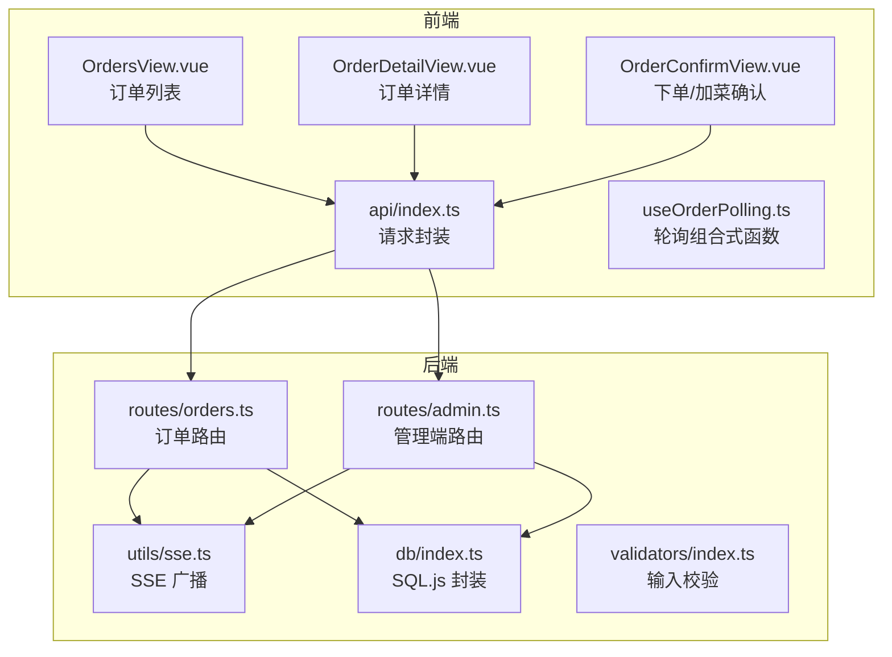
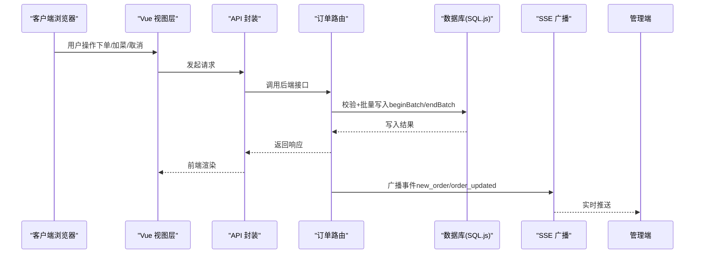
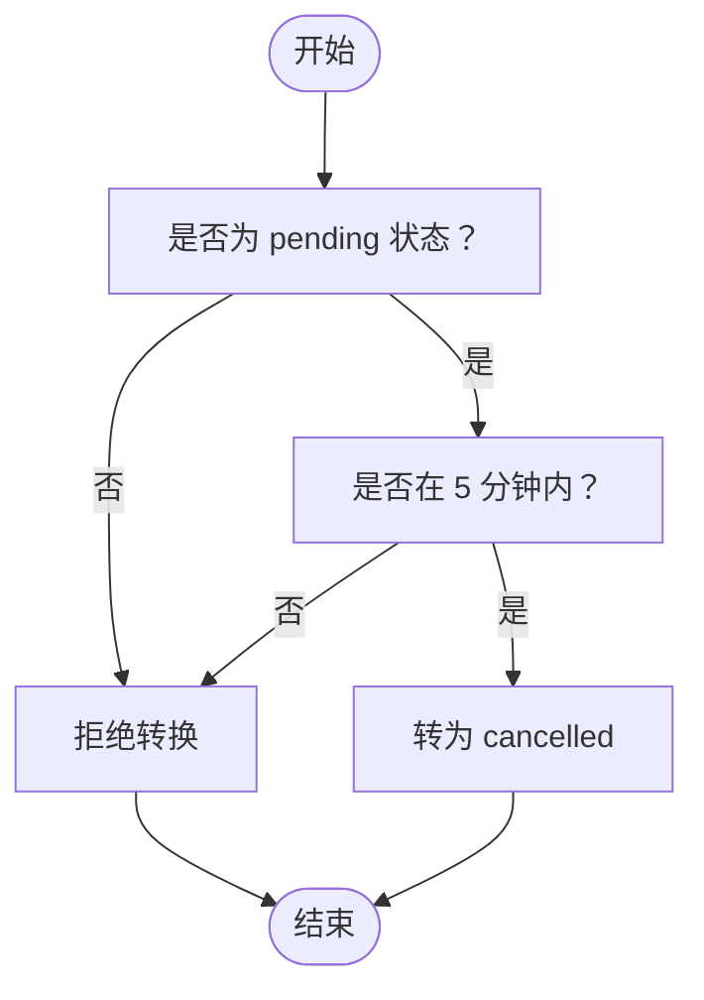
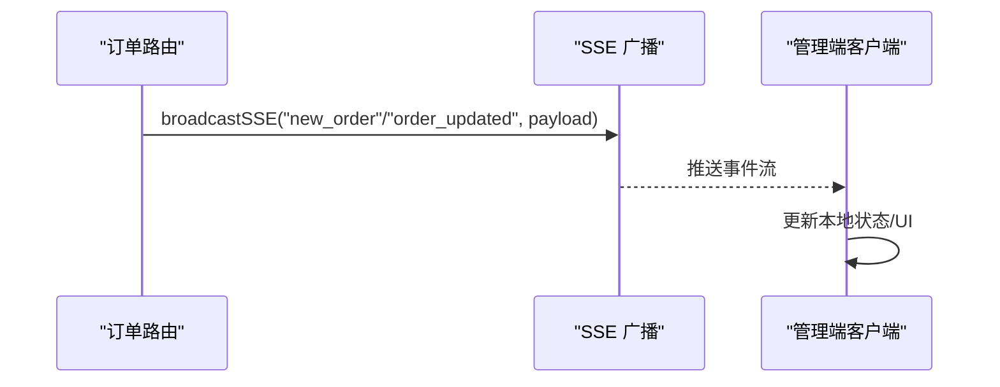
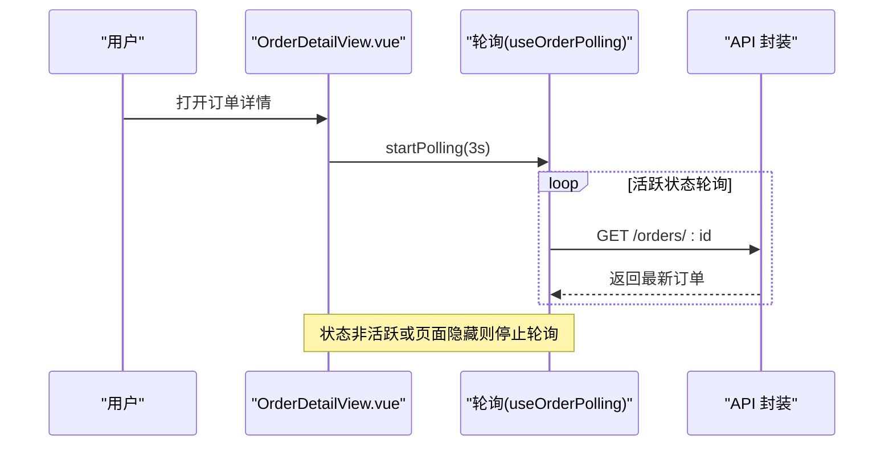
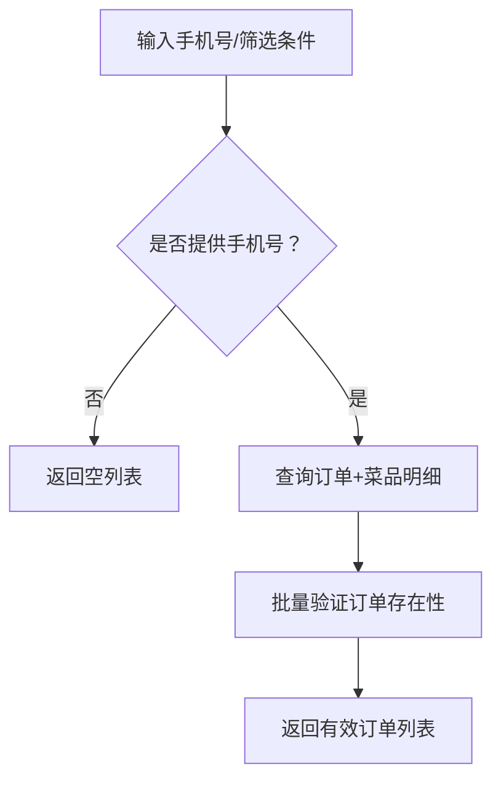
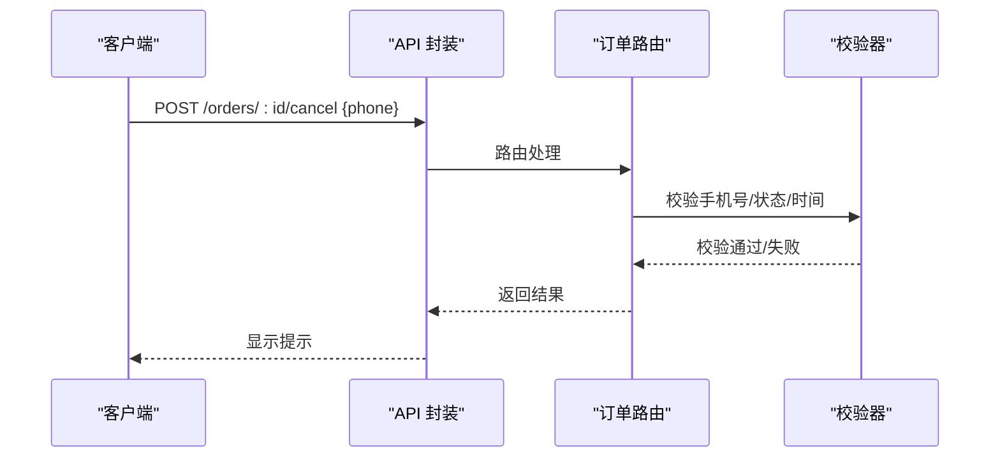
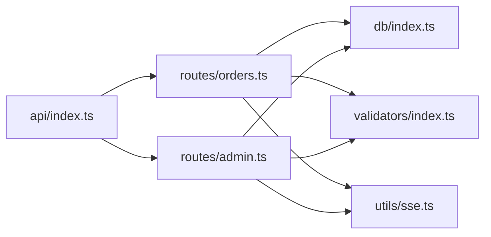

# 订单管理

<cite>
**本文引用的文件**
- [server/src/routes/orders.ts](file://server/src/routes/orders.ts)
- [server/src/utils/sse.ts](file://server/src/utils/sse.ts)
- [server/src/db/index.ts](file://server/src/db/index.ts)
- [server/src/validators/index.ts](file://server/src/validators/index.ts)
- [src/api/index.ts](file://src/api/index.ts)
- [src/types/index.ts](file://src/types/index.ts)
- [src/client/views/OrdersView.vue](file://src/client/views/OrdersView.vue)
- [src/client/views/OrderDetailView.vue](file://src/client/views/OrderDetailView.vue)
- [src/client/views/OrderConfirmView.vue](file://src/client/views/OrderConfirmView.vue)
- [src/shared/composables/useOrderPolling.ts](file://src/shared/composables/useOrderPolling.ts)
- [src/admin/views/DashboardView.vue](file://src/admin/views/DashboardView.vue)
- [server/src/routes/admin.ts](file://server/src/routes/admin.ts)
</cite>

## 目录
1. [简介](#简介)
2. [项目结构](#项目结构)
3. [核心组件](#核心组件)
4. [架构总览](#架构总览)
5. [详细组件分析](#详细组件分析)
6. [依赖关系分析](#依赖关系分析)
7. [性能考量](#性能考量)
8. [故障排查指南](#故障排查指南)
9. [结论](#结论)
10. [附录](#附录)

## 简介
本文件面向 RL RMS 的订单管理功能，围绕“订单状态流转、实时订单推送、订单详情查看、状态更新操作”进行系统化梳理；同时覆盖“订单搜索筛选、批量处理、历史订单管理”，解释“订单状态枚举、状态转换规则、异常订单处理”，并补充“订单数据统计、销售报表、客户分析”的实现线索与扩展建议。文档还包含“订单打印、导出功能、SSE 实时通信机制、轮询优化策略”的技术细节与最佳实践。

## 项目结构
订单管理由前端 Vue 组件、API 层、后端路由与数据库层协同完成：
- 前端负责订单列表、详情、加菜、取消、轮询与导出触发；
- API 层封装请求、超时与 401 处理、缓存策略；
- 后端路由负责业务校验、状态转换、SSE 推送与批量写入；
- 数据库层提供 SQL.js 初始化、批量事务与持久化。

图表来源
- [server/src/routes/orders.ts:1-552](file://server/src/routes/orders.ts#L1-L552)
- [server/src/routes/admin.ts:795-833](file://server/src/routes/admin.ts#L795-L833)
- [server/src/utils/sse.ts:1-59](file://server/src/utils/sse.ts#L1-L59)
- [server/src/db/index.ts:1-156](file://server/src/db/index.ts#L1-L156)
- [src/api/index.ts:1-608](file://src/api/index.ts#L1-L608)
- [src/client/views/OrdersView.vue:1-290](file://src/client/views/OrdersView.vue#L1-L290)
- [src/client/views/OrderDetailView.vue:1-672](file://src/client/views/OrderDetailView.vue#L1-L672)
- [src/client/views/OrderConfirmView.vue:1-981](file://src/client/views/OrderConfirmView.vue#L1-L981)
- [src/shared/composables/useOrderPolling.ts:1-74](file://src/shared/composables/useOrderPolling.ts#L1-L74)

章节来源
- [server/src/routes/orders.ts:1-552](file://server/src/routes/orders.ts#L1-L552)
- [src/api/index.ts:1-608](file://src/api/index.ts#L1-L608)
- [src/types/index.ts:70-97](file://src/types/index.ts#L70-L97)

## 核心组件
- 订单状态枚举与模型
  - 状态：pending（待处理）、confirmed（已确认）、completed（已完成）、cancelled（已取消）
  - 订单模型包含：订单号、桌位信息、联系人、电话、总金额、状态、创建时间、菜品明细等
- 前端视图
  - 订单列表页：展示状态、桌位、时间、金额，支持轮询与幽灵订单清理
  - 订单详情页：展示菜品明细、联系信息、状态徽章、加菜/取消按钮、订单码生成
  - 下单/加菜确认页：校验收餐时段、桌位可用性、联系信息、菜品清单与金额
- 后端路由
  - 客户端下单、加菜、取消、按手机号查询、批量验证订单存在性
  - 管理端更新订单状态、导出数据、清空历史订单
- SSE 实时推送
  - 新订单创建、订单状态变更、加菜更新均通过 SSE 广播给管理端

章节来源
- [src/types/index.ts:70-97](file://src/types/index.ts#L70-L97)
- [src/client/views/OrdersView.vue:1-290](file://src/client/views/OrdersView.vue#L1-L290)
- [src/client/views/OrderDetailView.vue:1-672](file://src/client/views/OrderDetailView.vue#L1-L672)
- [src/client/views/OrderConfirmView.vue:1-981](file://src/client/views/OrderConfirmView.vue#L1-L981)
- [server/src/routes/orders.ts:193-353](file://server/src/routes/orders.ts#L193-L353)
- [server/src/routes/admin.ts:795-833](file://server/src/routes/admin.ts#L795-L833)
- [server/src/utils/sse.ts:37-51](file://server/src/utils/sse.ts#L37-L51)

## 架构总览
订单管理采用前后端分离架构，前端通过统一 API 封装访问后端；后端路由对输入进行严格校验，执行数据库批量事务，必要时通过 SSE 推送至管理端。

图表来源
- [src/api/index.ts:54-114](file://src/api/index.ts#L54-L114)
- [server/src/routes/orders.ts:295-353](file://server/src/routes/orders.ts#L295-L353)
- [server/src/utils/sse.ts:37-51](file://server/src/utils/sse.ts#L37-L51)
- [server/src/db/index.ts:46-73](file://server/src/db/index.ts#L46-L73)

## 详细组件分析

### 订单状态与转换规则
- 状态枚举：pending → confirmed → completed；或 pending → cancelled
- 转换约束
  - 取消：仅 pending 且创建时间在 5 分钟内可取消
  - 加菜：仅 pending 或 confirmed 的订单允许
  - 管理端状态更新：仅允许在白名单状态间转换
- 异常处理
  - 超时取消、状态不符、手机号不匹配、菜品下架或不存在等均返回明确错误

图表来源
- [server/src/routes/orders.ts:383-418](file://server/src/routes/orders.ts#L383-L418)
- [server/src/validators/index.ts:66-93](file://server/src/validators/index.ts#L66-L93)

章节来源
- [server/src/routes/orders.ts:355-418](file://server/src/routes/orders.ts#L355-L418)
- [server/src/validators/index.ts:66-93](file://server/src/validators/index.ts#L66-L93)

### 实时订单推送（SSE）
- 客户端连接
  - 通过 SSE 客户端管理器维护连接池，广播事件给所有连接
- 事件类型
  - new_order：新订单创建
  - order_updated：订单状态变更/加菜更新
- 管理端消费
  - 管理端仪表盘监听 SSE，实时刷新订单列表与状态

图表来源
- [server/src/routes/orders.ts:342-343](file://server/src/routes/orders.ts#L342-L343)
- [server/src/routes/admin.ts:825-826](file://server/src/routes/admin.ts#L825-L826)
- [server/src/utils/sse.ts:37-51](file://server/src/utils/sse.ts#L37-L51)

章节来源
- [server/src/utils/sse.ts:1-59](file://server/src/utils/sse.ts#L1-L59)
- [server/src/routes/orders.ts:342-343](file://server/src/routes/orders.ts#L342-L343)
- [server/src/routes/admin.ts:825-826](file://server/src/routes/admin.ts#L825-L826)

### 订单详情查看与轮询优化
- 订单详情页
  - 仅在 pending/confirmed 时进行高频轮询（3 秒），状态变化后自动停止
  - 支持页面可见性变化时暂停/恢复轮询
- 订单列表页
  - 5 秒轮询，支持幽灵订单清理（verify 接口）
  - 页面隐藏时自动暂停轮询，显示时立刻拉取一次并恢复定时

图表来源
- [src/client/views/OrderDetailView.vue:97-149](file://src/client/views/OrderDetailView.vue#L97-L149)
- [src/shared/composables/useOrderPolling.ts:19-47](file://src/shared/composables/useOrderPolling.ts#L19-L47)

章节来源
- [src/client/views/OrdersView.vue:88-136](file://src/client/views/OrdersView.vue#L88-L136)
- [src/client/views/OrderDetailView.vue:97-149](file://src/client/views/OrderDetailView.vue#L97-L149)
- [src/shared/composables/useOrderPolling.ts:1-74](file://src/shared/composables/useOrderPolling.ts#L1-L74)

### 订单搜索筛选与批量处理
- 客户端搜索
  - 订单列表按联系人手机号筛选（必须提供 phone 参数）
  - 幽灵订单清理：对列表中的订单 ID 进行存在性验证，剔除不存在的订单
- 管理端筛选
  - 支持按状态、日期范围筛选订单
  - 支持按订单号搜索
  - 批量清空已完成/已取消的历史订单（保留其他状态）

图表来源
- [server/src/routes/orders.ts:62-135](file://server/src/routes/orders.ts#L62-L135)
- [src/client/views/OrdersView.vue:33-63](file://src/client/views/OrdersView.vue#L33-L63)

章节来源
- [server/src/routes/orders.ts:62-154](file://server/src/routes/orders.ts#L62-L154)
- [src/client/views/OrdersView.vue:33-63](file://src/client/views/OrdersView.vue#L33-L63)
- [src/admin/views/DashboardView.vue:162-183](file://src/admin/views/DashboardView.vue#L162-L183)

### 订单状态更新与异常处理
- 客户端取消
  - 需提供手机号进行身份验证，仅 5 分钟内的 pending 订单可取消
- 管理端更新
  - 仅允许在白名单状态间转换，完成后释放桌位并广播
- 输入校验
  - 使用 Zod 对下单、加菜、取消、状态更新等进行强类型校验

图表来源
- [server/src/routes/orders.ts:355-418](file://server/src/routes/orders.ts#L355-L418)
- [server/src/validators/index.ts:78-81](file://server/src/validators/index.ts#L78-L81)

章节来源
- [server/src/routes/orders.ts:355-418](file://server/src/routes/orders.ts#L355-L418)
- [server/src/validators/index.ts:66-93](file://server/src/validators/index.ts#L66-L93)

### 订单数据统计、销售报表、客户分析
- 仪表盘统计
  - 今日订单数、今日收入、待处理订单数、可用桌位、最近订单
- 报表与分析
  - 当前未直接提供销售报表与客户画像页面；可通过管理端导出数据后离线分析
  - 建议在管理端增加按日/周/月维度的汇总与可视化

章节来源
- [src/admin/views/DashboardView.vue:91-111](file://src/admin/views/DashboardView.vue#L91-L111)
- [server/src/routes/admin.ts:1747-1772](file://server/src/routes/admin.ts#L1747-L1772)

### 订单打印、导出功能
- 导出
  - 管理端提供导出接口，将订单、菜品、库存、设置等打包为 ZIP 并触发下载
  - 导出文件名从响应头解析，支持 UTF-8 编码
- 打印
  - 订单详情页支持生成订单码与条形码，便于线下核销与打印展示

章节来源
- [src/api/index.ts:509-549](file://src/api/index.ts#L509-L549)
- [src/client/views/OrderDetailView.vue:196-226](file://src/client/views/OrderDetailView.vue#L196-L226)

## 依赖关系分析
- 前端依赖
  - API 封装：统一请求、超时、401 处理、缓存策略
  - 组合式轮询：抽象通用轮询逻辑，支持页面可见性优化
- 后端依赖
  - SQL.js：轻量嵌入式数据库，支持批量事务与延迟保存
  - Zod：输入校验，保障数据一致性
  - SSE：实时事件推送

图表来源
- [src/api/index.ts:1-608](file://src/api/index.ts#L1-L608)
- [server/src/routes/orders.ts:1-552](file://server/src/routes/orders.ts#L1-L552)
- [server/src/routes/admin.ts:795-833](file://server/src/routes/admin.ts#L795-L833)
- [server/src/db/index.ts:1-156](file://server/src/db/index.ts#L1-L156)
- [server/src/validators/index.ts:1-123](file://server/src/validators/index.ts#L1-L123)
- [server/src/utils/sse.ts:1-59](file://server/src/utils/sse.ts#L1-L59)

章节来源
- [src/api/index.ts:1-608](file://src/api/index.ts#L1-L608)
- [server/src/db/index.ts:1-156](file://server/src/db/index.ts#L1-L156)
- [server/src/validators/index.ts:1-123](file://server/src/validators/index.ts#L1-L123)

## 性能考量
- 批量写入与事务
  - 使用 beginBatch/endBatch 将多条写入合并为单次保存，降低磁盘 IO
- 轮询优化
  - 页面隐藏时自动停止轮询，显示时立刻拉取一次再恢复定时
  - 活跃状态才轮询，避免不必要的网络与 CPU 开销
- 缓存策略
  - 前端对部分接口采用“陈旧优先”缓存，提升弱网体验
- 数据库写入节流
  - debounce 保存，合并短时间内的多次写入

章节来源
- [server/src/db/index.ts:46-73](file://server/src/db/index.ts#L46-L73)
- [src/shared/composables/useOrderPolling.ts:41-47](file://src/shared/composables/useOrderPolling.ts#L41-L47)
- [src/api/index.ts:9-34](file://src/api/index.ts#L9-L34)

## 故障排查指南
- 常见问题
  - 401 未授权：会话过期，触发全局事件并提示重新登录
  - 取消失败：订单状态非 pending 或超时（>5 分钟）
  - 加菜失败：订单状态不允许或菜品已下架
  - 订单不存在：幽灵订单清理后被剔除
- 排查步骤
  - 检查前端轮询是否正常启动/停止
  - 确认后端 SSE 是否在广播事件
  - 核对输入参数与状态转换规则
  - 查看数据库批量写入是否成功

章节来源
- [src/api/index.ts:94-114](file://src/api/index.ts#L94-L114)
- [server/src/routes/orders.ts:383-418](file://server/src/routes/orders.ts#L383-L418)
- [src/client/views/OrdersView.vue:33-63](file://src/client/views/OrdersView.vue#L33-L63)

## 结论
RL RMS 的订单管理以清晰的状态模型与严格的输入校验为基础，结合 SSE 实时推送与前端轮询优化，实现了良好的用户体验与系统稳定性。管理端具备基础的筛选、状态更新与数据导出能力；未来可在报表与客户分析方面进一步增强，以支撑更全面的运营决策。

## 附录
- 订单状态枚举与含义
  - pending：待处理（等待商家确认）
  - confirmed：已确认
  - completed：已完成
  - cancelled：已取消
- 关键流程路径参考
  - 下单：[server/src/routes/orders.ts:193-353](file://server/src/routes/orders.ts#L193-L353)
  - 加菜：[server/src/routes/orders.ts:420-552](file://server/src/routes/orders.ts#L420-L552)
  - 取消：[server/src/routes/orders.ts:355-418](file://server/src/routes/orders.ts#L355-L418)
  - 管理端状态更新：[server/src/routes/admin.ts:795-833](file://server/src/routes/admin.ts#L795-L833)
  - SSE 广播：[server/src/utils/sse.ts:37-51](file://server/src/utils/sse.ts#L37-L51)
  - 幽灵订单清理：[src/client/views/OrdersView.vue:33-63](file://src/client/views/OrdersView.vue#L33-L63)
  - 导出数据：[src/api/index.ts:509-549](file://src/api/index.ts#L509-L549)