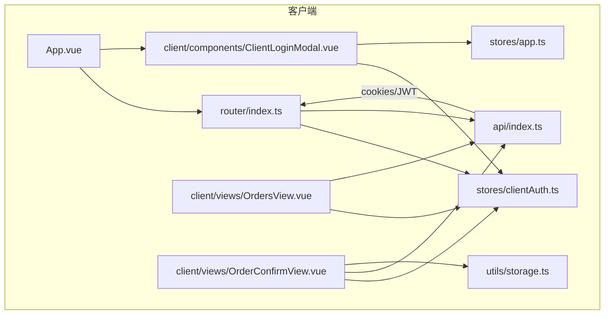
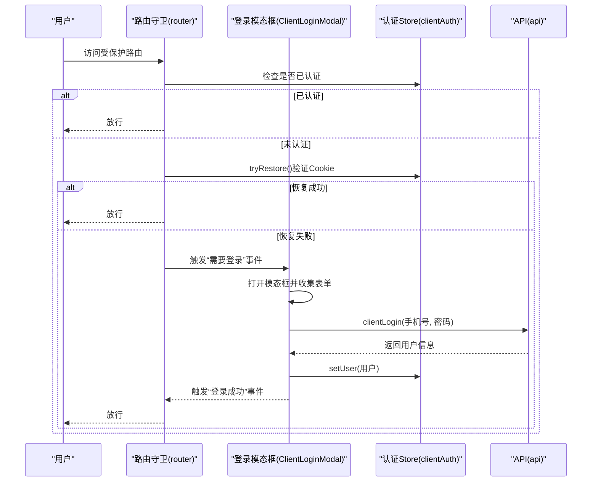
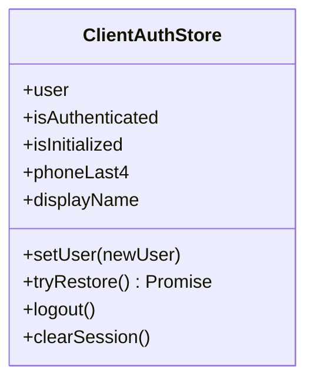
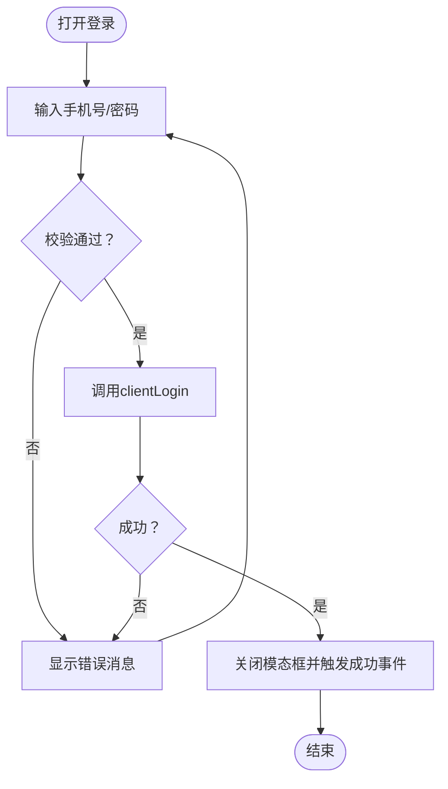
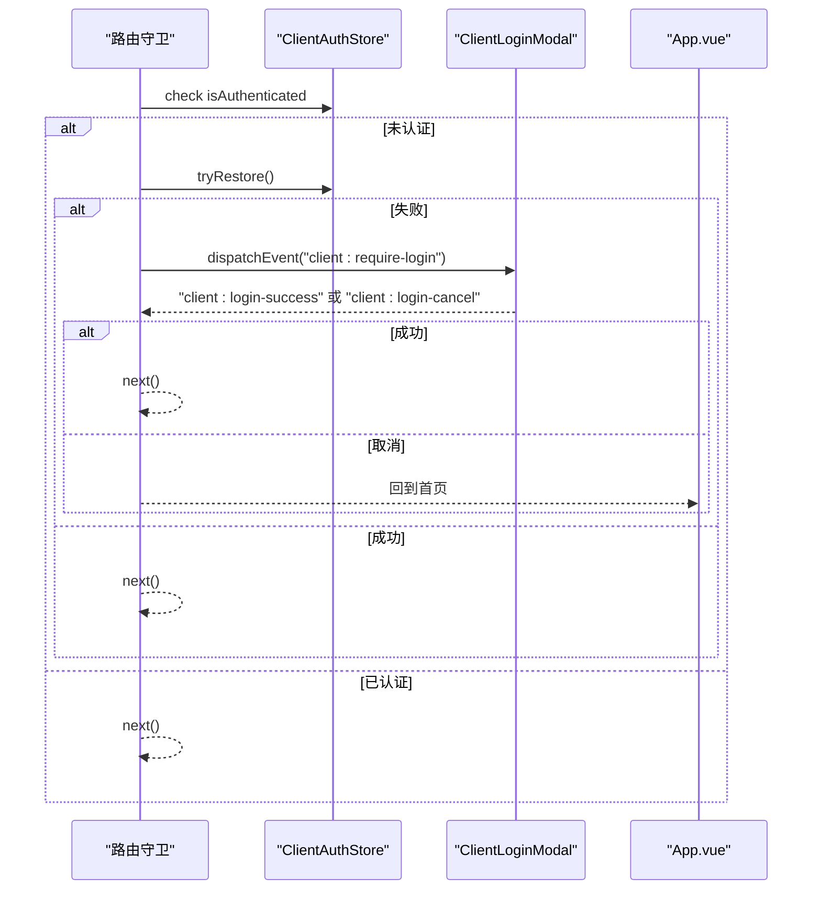
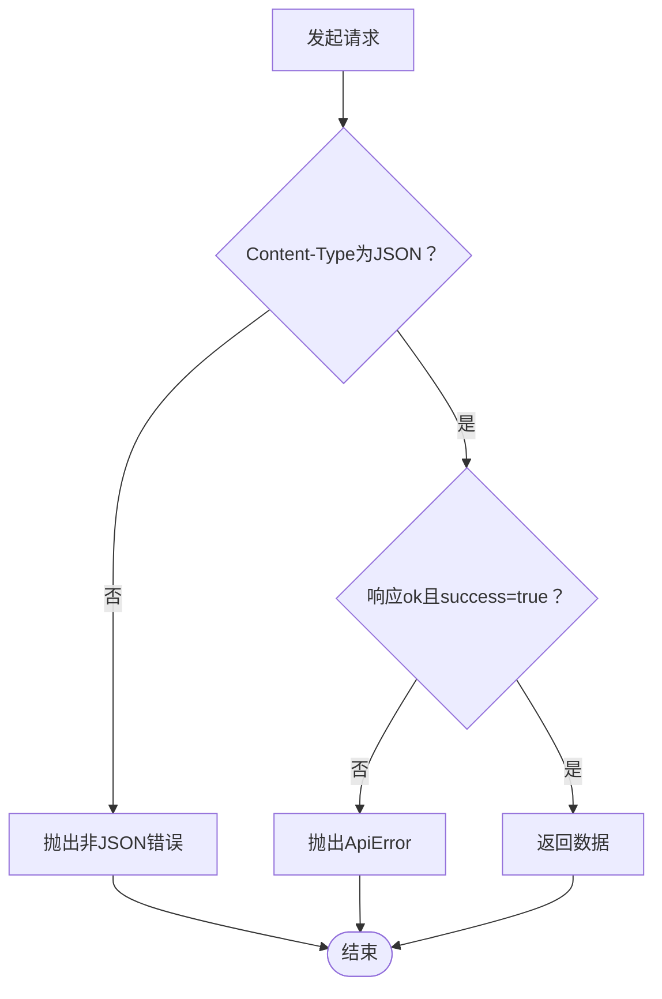
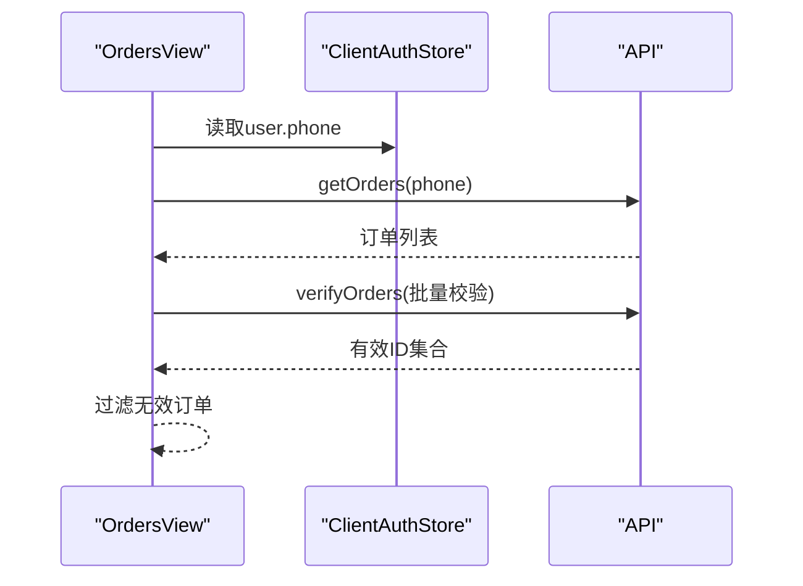
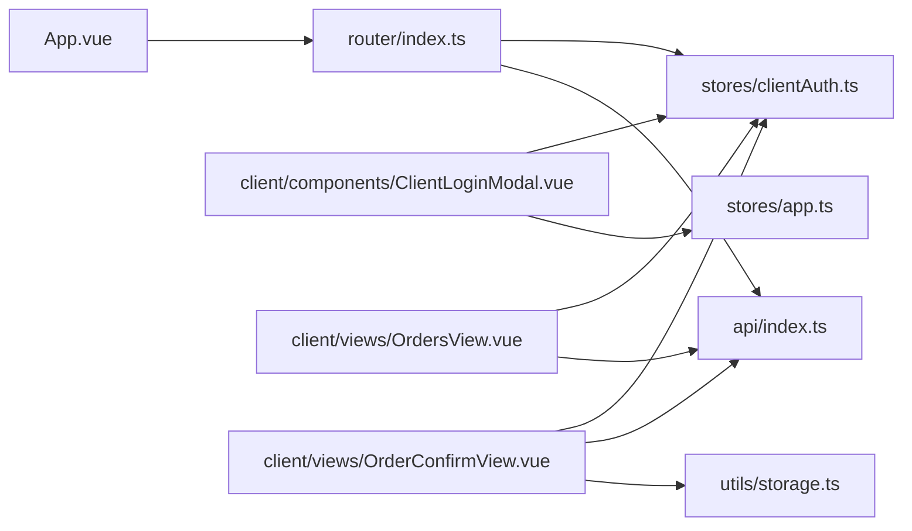

# 客户端认证

<cite>
**本文引用的文件**
- [src/stores/clientAuth.ts](file://src/stores/clientAuth.ts)
- [src/client/components/ClientLoginModal.vue](file://src/client/components/ClientLoginModal.vue)
- [src/api/index.ts](file://src/api/index.ts)
- [src/router/index.ts](file://src/router/index.ts)
- [src/App.vue](file://src/App.vue)
- [src/utils/storage.ts](file://src/utils/storage.ts)
- [src/client/views/OrdersView.vue](file://src/client/views/OrdersView.vue)
- [src/client/views/OrderConfirmView.vue](file://src/client/views/OrderConfirmView.vue)
- [src/stores/app.ts](file://src/stores/app.ts)
- [src/types/index.ts](file://src/types/index.ts)
</cite>

## 目录
1. [简介](#简介)
2. [项目结构](#项目结构)
3. [核心组件](#核心组件)
4. [架构总览](#架构总览)
5. [详细组件分析](#详细组件分析)
6. [依赖关系分析](#依赖关系分析)
7. [性能考量](#性能考量)
8. [故障排查指南](#故障排查指南)
9. [结论](#结论)
10. [附录](#附录)

## 简介
本文件面向RLRMS的客户端认证系统，聚焦客户登录流程（手机号+密码）、自动登录与会话保持、前端状态管理（Pinia Store）、登录模态框实现、以及认证与订单系统的集成。文档同时给出安全与隐私建议，帮助开发者与运维人员快速理解并维护该模块。

## 项目结构
客户端认证涉及的关键目录与文件：
- stores：集中存放状态管理逻辑，包括客户认证状态与应用通用状态
- client/components：登录模态框等UI组件
- client/views：与认证强相关的页面（订单列表、订单确认）
- api：统一的HTTP请求封装与错误处理
- router：路由守卫与鉴权控制
- utils：本地持久化（IndexedDB）工具
- types：前后端数据契约

图表来源
- [src/App.vue:1-113](file://src/App.vue#L1-L113)
- [src/router/index.ts:1-317](file://src/router/index.ts#L1-L317)
- [src/stores/clientAuth.ts:1-87](file://src/stores/clientAuth.ts#L1-L87)
- [src/client/components/ClientLoginModal.vue:1-351](file://src/client/components/ClientLoginModal.vue#L1-L351)
- [src/client/views/OrdersView.vue:1-290](file://src/client/views/OrdersView.vue#L1-L290)
- [src/client/views/OrderConfirmView.vue:1-981](file://src/client/views/OrderConfirmView.vue#L1-L981)
- [src/utils/storage.ts:1-109](file://src/utils/storage.ts#L1-L109)
- [src/api/index.ts:1-608](file://src/api/index.ts#L1-L608)

章节来源
- [src/router/index.ts:19-277](file://src/router/index.ts#L19-L277)
- [src/App.vue:16-47](file://src/App.vue#L16-L47)
- [src/stores/clientAuth.ts:10-86](file://src/stores/clientAuth.ts#L10-L86)
- [src/client/components/ClientLoginModal.vue:1-107](file://src/client/components/ClientLoginModal.vue#L1-L107)
- [src/api/index.ts:54-126](file://src/api/index.ts#L54-L126)

## 核心组件
- 客户端认证Store（clientAuth）
  - 维护用户信息、认证状态、显示名与手机号后四位
  - 提供尝试恢复登录、登出、清理会话等方法
- 登录模态框（ClientLoginModal）
  - 表单校验（手机号、密码长度）、加载态、错误提示
  - 触发全局事件以驱动路由守卫弹窗
- API层（api）
  - 统一封装fetch、超时、401处理、JSON响应校验
  - 暴露clientLogin、clientVerifyToken、clientLogout等接口
- 路由守卫（router）
  - 对需要客户认证的路由进行拦截与自动登录
- 应用状态（app）
  - 主题、Toast、开发模式等通用状态
- 本地存储（storage）
  - IndexedDB封装，用于联系人姓名等轻量数据持久化

章节来源
- [src/stores/clientAuth.ts:10-86](file://src/stores/clientAuth.ts#L10-L86)
- [src/client/components/ClientLoginModal.vue:11-107](file://src/client/components/ClientLoginModal.vue#L11-L107)
- [src/api/index.ts:270-286](file://src/api/index.ts#L270-L286)
- [src/router/index.ts:207-247](file://src/router/index.ts#L207-L247)
- [src/stores/app.ts:14-121](file://src/stores/app.ts#L14-L121)
- [src/utils/storage.ts:42-91](file://src/utils/storage.ts#L42-L91)

## 架构总览
客户端认证的整体交互链路如下：

图表来源
- [src/router/index.ts:207-247](file://src/router/index.ts#L207-L247)
- [src/client/components/ClientLoginModal.vue:20-107](file://src/client/components/ClientLoginModal.vue#L20-L107)
- [src/stores/clientAuth.ts:38-66](file://src/stores/clientAuth.ts#L38-L66)
- [src/api/index.ts:270-286](file://src/api/index.ts#L270-L286)

## 详细组件分析

### 客户端认证Store（clientAuth）
- 数据模型
  - 用户对象包含id与phone
  - 认证状态通过computed派生
  - 显示名与手机号后四位基于phone计算
- 关键方法
  - tryRestore：通过clientVerifyToken验证Cookie并恢复会话
  - setUser：设置用户并更新Store状态
  - logout：调用clientLogout并清空本地用户
  - clearSession：仅清理本地状态（不请求后端）

图表来源
- [src/stores/clientAuth.ts:5-86](file://src/stores/clientAuth.ts#L5-L86)

章节来源
- [src/stores/clientAuth.ts:10-86](file://src/stores/clientAuth.ts#L10-L86)

### 登录模态框（ClientLoginModal）
- 表单与校验
  - 手机号输入限制为11位数字
  - 密码长度不少于6位
  - 错误消息统一展示在顶部
- 交互流程
  - 打开时清空输入与错误
  - 提交时调用clientLogin，成功后关闭并触发“登录成功”
  - 取消时触发“登录取消”，路由守卫据此回退至首页
- UI细节
  - 密码可见性切换
  - 加载态禁用按钮
  - Teleport到body，过渡动画

图表来源
- [src/client/components/ClientLoginModal.vue:47-88](file://src/client/components/ClientLoginModal.vue#L47-L88)
- [src/api/index.ts:270-286](file://src/api/index.ts#L270-L286)

章节来源
- [src/client/components/ClientLoginModal.vue:11-107](file://src/client/components/ClientLoginModal.vue#L11-L107)

### 路由守卫与自动登录
- 客户端路由守卫
  - 对requiresClientAuth的路由进行拦截
  - 若未认证，先尝试tryRestore
  - 失败则通过自定义事件触发ClientLoginModal
  - 登录成功后放行；取消则回到首页
- 会话过期处理
  - API层401时分发auth:expired事件
  - App.vue监听事件，区分管理员路径与客户路径
  - 客户路径下清理clientAuth并再次触发登录

图表来源
- [src/router/index.ts:207-247](file://src/router/index.ts#L207-L247)
- [src/App.vue:16-39](file://src/App.vue#L16-L39)

章节来源
- [src/router/index.ts:207-247](file://src/router/index.ts#L207-L247)
- [src/App.vue:16-39](file://src/App.vue#L16-L39)

### API层与错误处理
- 统一请求封装
  - 默认携带credentials: 'include'，支持Cookie/JWT
  - 非JSON响应直接抛错，防止被误判为成功
  - 401时分发auth:expired事件，并抛出ApiError
- 客户端认证相关接口
  - clientLogin、clientVerifyToken、clientLogout
  - verifyToken（管理员）与clientVerifyToken（客户）分离

图表来源
- [src/api/index.ts:54-126](file://src/api/index.ts#L54-L126)
- [src/api/index.ts:270-286](file://src/api/index.ts#L270-L286)

章节来源
- [src/api/index.ts:54-126](file://src/api/index.ts#L54-L126)
- [src/api/index.ts:270-286](file://src/api/index.ts#L270-L286)

### 前端状态管理与本地存储策略
- Pinia Store
  - clientAuth：保存用户、认证状态、派生属性
  - app：主题、Toast、开发模式等
- 本地存储
  - 使用IndexedDB（storage.ts）持久化轻量数据（如联系人姓名）
  - 与订单确认页结合，提升用户体验

章节来源
- [src/stores/clientAuth.ts:10-86](file://src/stores/clientAuth.ts#L10-L86)
- [src/stores/app.ts:14-121](file://src/stores/app.ts#L14-L121)
- [src/utils/storage.ts:42-91](file://src/utils/storage.ts#L42-L91)
- [src/client/views/OrderConfirmView.vue:117-126](file://src/client/views/OrderConfirmView.vue#L117-L126)

### 登录模态框与用户体验优化
- 输入体验
  - 手机号自动过滤非数字并限制长度
  - 密码可见性切换
  - 即时校验与错误提示
- 交互反馈
  - 加载态禁用按钮
  - 登录成功Toast提示
  - 登录取消事件用于路由回退

章节来源
- [src/client/components/ClientLoginModal.vue:42-88](file://src/client/components/ClientLoginModal.vue#L42-L88)
- [src/client/components/ClientLoginModal.vue:109-180](file://src/client/components/ClientLoginModal.vue#L109-L180)

### 认证与订单系统的集成
- 订单列表（OrdersView）
  - 通过clientAuth.user.phone筛选个人订单
  - 轮询拉取最新订单并验证有效性
- 订单确认（OrderConfirmView）
  - 自动填充联系人手机号（来自clientAuth）
  - 使用IndexedDB持久化联系人姓名，提升复购体验
  - 提交订单后进入进度动画与跳转

图表来源
- [src/client/views/OrdersView.vue:33-63](file://src/client/views/OrdersView.vue#L33-L63)
- [src/stores/clientAuth.ts:10-26](file://src/stores/clientAuth.ts#L10-L26)

章节来源
- [src/client/views/OrdersView.vue:33-63](file://src/client/views/OrdersView.vue#L33-L63)
- [src/client/views/OrderConfirmView.vue:117-126](file://src/client/views/OrderConfirmView.vue#L117-L126)

## 依赖关系分析
- 组件耦合
  - 路由守卫依赖clientAuth与API
  - 登录模态框依赖clientAuth与app
  - 订单相关视图依赖clientAuth与API
- 外部依赖
  - Vue Router用于路由守卫与导航
  - Pinia用于状态管理
  - IndexedDB用于本地持久化

图表来源
- [src/router/index.ts:1-317](file://src/router/index.ts#L1-L317)
- [src/stores/clientAuth.ts:1-87](file://src/stores/clientAuth.ts#L1-L87)
- [src/client/components/ClientLoginModal.vue:1-351](file://src/client/components/ClientLoginModal.vue#L1-L351)
- [src/client/views/OrdersView.vue:1-290](file://src/client/views/OrdersView.vue#L1-L290)
- [src/client/views/OrderConfirmView.vue:1-981](file://src/client/views/OrderConfirmView.vue#L1-L981)
- [src/utils/storage.ts:1-109](file://src/utils/storage.ts#L1-L109)
- [src/App.vue:1-113](file://src/App.vue#L1-L113)

章节来源
- [src/router/index.ts:1-317](file://src/router/index.ts#L1-L317)
- [src/stores/clientAuth.ts:1-87](file://src/stores/clientAuth.ts#L1-L87)
- [src/client/components/ClientLoginModal.vue:1-351](file://src/client/components/ClientLoginModal.vue#L1-L351)
- [src/client/views/OrdersView.vue:1-290](file://src/client/views/OrdersView.vue#L1-L290)
- [src/client/views/OrderConfirmView.vue:1-981](file://src/client/views/OrderConfirmView.vue#L1-L981)
- [src/utils/storage.ts:1-109](file://src/utils/storage.ts#L1-L109)
- [src/App.vue:1-113](file://src/App.vue#L1-L113)

## 性能考量
- 请求缓存
  - API层采用stale-while-revalidate策略，降低带宽与延迟
- 路由预取
  - 首屏与关键路由组件预加载，提升首屏体验
- 轮询与可见性
  - 订单列表按需轮询，页面隐藏时停止，显示时恢复
- 本地存储
  - IndexedDB懒加载与失败重试，避免阻塞主线程

章节来源
- [src/api/index.ts:9-34](file://src/api/index.ts#L9-L34)
- [src/router/index.ts:23-40](file://src/router/index.ts#L23-L40)
- [src/client/views/OrdersView.vue:88-136](file://src/client/views/OrdersView.vue#L88-L136)
- [src/utils/storage.ts:11-40](file://src/utils/storage.ts#L11-L40)

## 故障排查指南
- 401会话过期
  - 现象：页面出现“会话已过期，请重新登录”
  - 处理：App.vue监听auth:expired事件，清理clientAuth并触发登录
- 登录失败
  - 现象：登录模态框显示错误消息
  - 排查：检查手机号/密码格式、网络状况、后端返回的error字段
- 订单为空或异常
  - 现象：订单列表为空或出现无效订单
  - 排查：确认clientAuth.user.phone正确、verifyOrders接口可用、轮询逻辑正常

章节来源
- [src/App.vue:16-39](file://src/App.vue#L16-L39)
- [src/client/components/ClientLoginModal.vue:47-88](file://src/client/components/ClientLoginModal.vue#L47-L88)
- [src/client/views/OrdersView.vue:33-63](file://src/client/views/OrdersView.vue#L33-L63)

## 结论
RLRMS的客户端认证体系以Pinia Store为核心，配合路由守卫与登录模态框实现了“自动登录+手动登录”的双通道机制。API层统一处理401与非JSON响应，保障了健壮性。与订单系统的集成体现在订单查询、联系人信息持久化与个性化体验上。整体设计清晰、可扩展性强，适合进一步引入验证码登录与更细粒度的权限控制。

## 附录

### 客户端登录流程（手机号+密码）
- 流程要点
  - 路由守卫拦截 → tryRestore → 失败则弹出登录模态框 → 提交表单 → 设置用户 → 放行
- 关键路径
  - [src/router/index.ts:207-247](file://src/router/index.ts#L207-L247)
  - [src/client/components/ClientLoginModal.vue:47-88](file://src/client/components/ClientLoginModal.vue#L47-L88)
  - [src/stores/clientAuth.ts:38-66](file://src/stores/clientAuth.ts#L38-L66)

### 认证状态与本地存储
- Store状态
  - user、isAuthenticated、isInitialized、派生属性（phoneLast4、displayName）
- 本地存储
  - IndexedDB封装，提供getItem/setItem/removeItem/clear

章节来源
- [src/stores/clientAuth.ts:10-86](file://src/stores/clientAuth.ts#L10-L86)
- [src/utils/storage.ts:42-91](file://src/utils/storage.ts#L42-L91)

### 类型与契约
- 用户与订单类型
  - User、Order、OrderItem等类型定义
- API响应
  - ApiResponse统一结构，便于前端处理

章节来源
- [src/types/index.ts:9-97](file://src/types/index.ts#L9-L97)