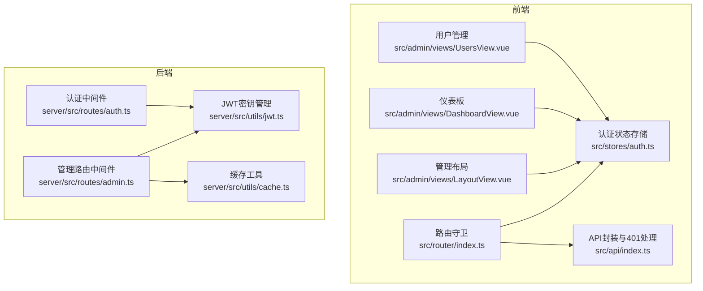
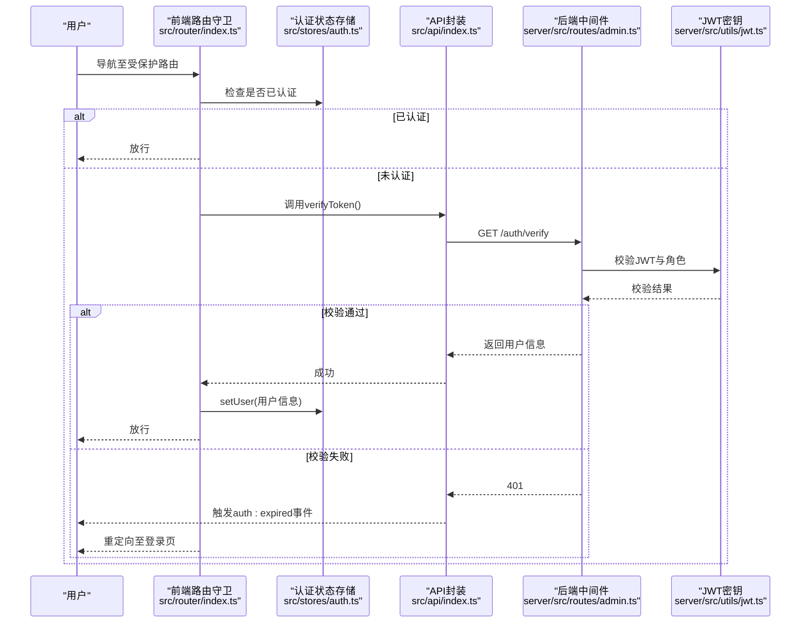
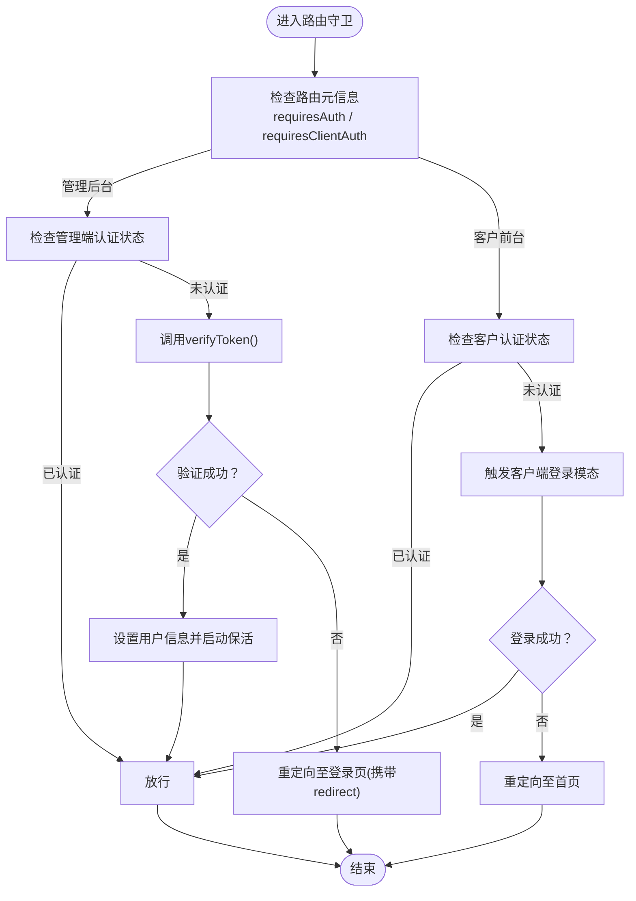
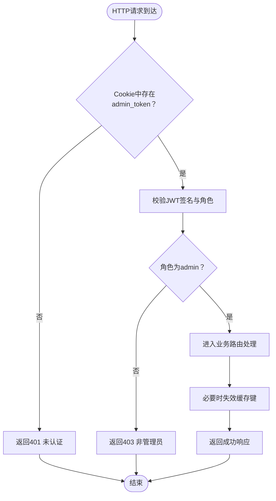
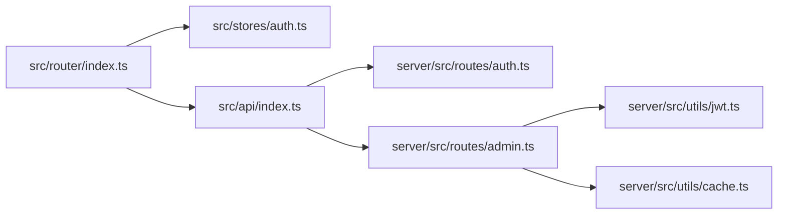

# 权限控制

<cite>
**本文引用的文件**
- [src/router/index.ts](file://src/router/index.ts)
- [src/stores/auth.ts](file://src/stores/auth.ts)
- [src/api/index.ts](file://src/api/index.ts)
- [src/types/index.ts](file://src/types/index.ts)
- [src/admin/views/LayoutView.vue](file://src/admin/views/LayoutView.vue)
- [src/admin/views/DashboardView.vue](file://src/admin/views/DashboardView.vue)
- [src/admin/views/UsersView.vue](file://src/admin/views/UsersView.vue)
- [server/src/routes/auth.ts](file://server/src/routes/auth.ts)
- [server/src/routes/admin.ts](file://server/src/routes/admin.ts)
- [server/src/utils/jwt.ts](file://server/src/utils/jwt.ts)
- [server/src/utils/cache.ts](file://server/src/utils/cache.ts)
</cite>

## 目录
1. [简介](#简介)
2. [项目结构](#项目结构)
3. [核心组件](#核心组件)
4. [架构总览](#架构总览)
5. [详细组件分析](#详细组件分析)
6. [依赖关系分析](#依赖关系分析)
7. [性能考量](#性能考量)
8. [故障排查指南](#故障排查指南)
9. [结论](#结论)
10. [附录](#附录)

## 简介
本文件面向RLRMS权限控制系统，围绕基于角色的访问控制（RBAC）进行技术文档梳理，覆盖管理员权限分级、功能模块权限分配、数据访问权限控制；前端路由守卫的实现机制（导航拦截、权限验证、重定向处理）；后端API权限控制（中间件实现、路由级权限检查、资源访问控制）；以及组件级别的权限控制（UI元素显示隐藏、操作按钮权限、表单字段控制）。同时提供权限系统的扩展方法与安全审计机制。

## 项目结构
权限控制涉及前后端协同：
- 前端：Vue Router导航守卫负责路由级权限拦截与重定向；Pinia Store维护用户会话状态与保活；API封装统一处理401与全局会话过期事件；各管理视图组件承担UI层的权限呈现。
- 后端：Express中间件校验JWT与角色；各路由按需进行资源级访问控制；缓存提升读取性能并配合变更失效策略。

**图表来源**
- [src/router/index.ts:201-277](file://src/router/index.ts#L201-L277)
- [src/stores/auth.ts:15-127](file://src/stores/auth.ts#L15-L127)
- [src/api/index.ts:54-114](file://src/api/index.ts#L54-L114)
- [server/src/routes/auth.ts:62-179](file://server/src/routes/auth.ts#L62-L179)
- [server/src/routes/admin.ts:115-131](file://server/src/routes/admin.ts#L115-L131)
- [server/src/utils/jwt.ts:1-27](file://server/src/utils/jwt.ts#L1-L27)
- [server/src/utils/cache.ts:1-73](file://server/src/utils/cache.ts#L1-L73)

**章节来源**
- [src/router/index.ts:178-187](file://src/router/index.ts#L178-L187)
- [src/stores/auth.ts:15-127](file://src/stores/auth.ts#L15-L127)
- [src/api/index.ts:128-608](file://src/api/index.ts#L128-L608)
- [server/src/routes/auth.ts:62-179](file://server/src/routes/auth.ts#L62-L179)
- [server/src/routes/admin.ts:115-131](file://server/src/routes/admin.ts#L115-L131)
- [server/src/utils/jwt.ts:1-27](file://server/src/utils/jwt.ts#L1-L27)
- [server/src/utils/cache.ts:1-73](file://server/src/utils/cache.ts#L1-L73)

## 核心组件
- 路由守卫：根据路由元信息requiresAuth/ requiresClientAuth决定是否拦截与重定向，支持从Cookie恢复会话并触发登录模态。
- 认证状态存储：维护用户信息、认证状态、会话过期时间与保活定时器，暴露会话即将过期判断。
- API封装：统一处理401错误，触发全局auth:expired事件，供应用层统一处理跳转与提示。
- 后端中间件：JWT校验与角色过滤（仅admin），路由级资源访问控制与缓存失效策略。
- 类型系统：User/AdminUser等类型定义role字段，约束权限边界。

**章节来源**
- [src/router/index.ts:201-277](file://src/router/index.ts#L201-L277)
- [src/stores/auth.ts:15-127](file://src/stores/auth.ts#L15-L127)
- [src/api/index.ts:54-114](file://src/api/index.ts#L54-L114)
- [server/src/routes/admin.ts:115-131](file://server/src/routes/admin.ts#L115-L131)
- [src/types/index.ts:9-27](file://src/types/index.ts#L9-L27)

## 架构总览
RBAC在RLRMS中的落地体现为“前端路由守卫 + 后端中间件”的双层防护，结合JWT Cookie与Pinia Store实现会话管理与保活。

**图表来源**
- [src/router/index.ts:201-277](file://src/router/index.ts#L201-L277)
- [src/stores/auth.ts:71-85](file://src/stores/auth.ts#L71-L85)
- [src/api/index.ts:253-255](file://src/api/index.ts#L253-L255)
- [server/src/routes/admin.ts:115-131](file://server/src/routes/admin.ts#L115-L131)
- [server/src/utils/jwt.ts:16-22](file://server/src/utils/jwt.ts#L16-L22)

## 详细组件分析

### 前端路由守卫与会话保活
- 路由拦截逻辑：
  - 对requiresAuth为true的管理后台路由，若未认证则调用后端verifyToken接口恢复会话；失败则重定向至登录页并携带redirect参数。
  - 对requiresClientAuth为true的客户前台路由，若未认证则触发客户端登录模态，允许用户完成登录后放行。
- 会话保活：
  - 认证状态存储在用户登录后启动保活定时器，定期调用verifyToken以维持会话有效性；当保活失败时触发auth:expired事件，统一处理跳转与提示。
- 全局401处理：
  - API封装在请求返回401时，触发auth:expired事件，避免用户在长停留页面时出现“令牌过期但无提示”的情况。

**图表来源**
- [src/router/index.ts:201-277](file://src/router/index.ts#L201-L277)
- [src/stores/auth.ts:37-55](file://src/stores/auth.ts#L37-L55)
- [src/api/index.ts:94-104](file://src/api/index.ts#L94-L104)

**章节来源**
- [src/router/index.ts:201-277](file://src/router/index.ts#L201-L277)
- [src/stores/auth.ts:37-85](file://src/stores/auth.ts#L37-L85)
- [src/api/index.ts:94-104](file://src/api/index.ts#L94-L104)

### 后端中间件与资源访问控制
- 认证中间件：
  - 从Cookie提取admin_token，使用JWT_SECRET解码并校验角色是否为admin；失败返回401/403。
- 资源访问控制：
  - 管理端路由在进入业务处理前均经过requireAuth中间件，确保只有admin可访问。
  - 部分敏感操作（如删除用户）在业务逻辑中进一步校验：禁止删除主管理员、禁止删除当前登录用户、保证至少保留一个admin账号。
- 缓存与一致性：
  - 读多写少场景使用内存缓存（TTL）；写操作主动失效相关缓存键，确保数据一致性。

**图表来源**
- [server/src/routes/admin.ts:115-131](file://server/src/routes/admin.ts#L115-L131)
- [server/src/utils/jwt.ts:16-22](file://server/src/utils/jwt.ts#L16-L22)
- [server/src/utils/cache.ts:41-54](file://server/src/utils/cache.ts#L41-L54)

**章节来源**
- [server/src/routes/admin.ts:115-131](file://server/src/routes/admin.ts#L115-L131)
- [server/src/routes/admin.ts:1120-1141](file://server/src/routes/admin.ts#L1120-L1141)
- [server/src/utils/cache.ts:1-73](file://server/src/utils/cache.ts#L1-L73)

### 类型与权限边界
- 用户类型：
  - User/AdminUser包含role字段，明确区分customer与admin两类角色，作为前端与后端权限判断的基础。
- 前端路由元信息：
  - 通过meta.requiresAuth/meta.requiresClientAuth标记路由是否需要认证，形成前端第一道防线。

**章节来源**
- [src/types/index.ts:9-27](file://src/types/index.ts#L9-L27)
- [src/router/index.ts:94-176](file://src/router/index.ts#L94-L176)

### 组件级权限控制（UI与交互）
- 管理布局导航：
  - LayoutView根据当前路由高亮对应导航项，支持调试工具菜单折叠与子项展开，便于在管理后台内快速定位功能模块。
- 仪表板与用户管理：
  - DashboardView与UsersView等视图通过API拉取数据，内部不直接做角色判断，而是依赖后端中间件与前端路由守卫保障访问合法性。
- 可扩展性：
  - 若未来需要在组件内进行细粒度权限控制（如按钮可见性），可在store中暴露用户角色与能力集合，并在组件模板中基于角色条件渲染。

**章节来源**
- [src/admin/views/LayoutView.vue:47-86](file://src/admin/views/LayoutView.vue#L47-L86)
- [src/admin/views/DashboardView.vue:144-183](file://src/admin/views/DashboardView.vue#L144-L183)
- [src/admin/views/UsersView.vue:40-51](file://src/admin/views/UsersView.vue#L40-L51)

## 依赖关系分析
- 前端依赖链：
  - 路由守卫依赖认证状态存储与API封装；认证状态存储依赖JWT密钥（运行时派生或环境变量）；API封装依赖后端接口与Cookie。
- 后端依赖链：
  - 管理路由依赖认证中间件与JWT密钥；中间件依赖Cookie与JWT库；部分路由依赖缓存工具。
- 耦合与内聚：
  - 前后端通过JWT Cookie与REST接口耦合，职责清晰：前端负责导航与展示，后端负责鉴权与数据。

**图表来源**
- [src/router/index.ts:201-277](file://src/router/index.ts#L201-L277)
- [src/stores/auth.ts:15-127](file://src/stores/auth.ts#L15-L127)
- [src/api/index.ts:128-608](file://src/api/index.ts#L128-L608)
- [server/src/routes/auth.ts:62-179](file://server/src/routes/auth.ts#L62-L179)
- [server/src/routes/admin.ts:115-131](file://server/src/routes/admin.ts#L115-L131)
- [server/src/utils/jwt.ts:1-27](file://server/src/utils/jwt.ts#L1-L27)
- [server/src/utils/cache.ts:1-73](file://server/src/utils/cache.ts#L1-L73)

**章节来源**
- [src/router/index.ts:201-277](file://src/router/index.ts#L201-L277)
- [src/stores/auth.ts:15-127](file://src/stores/auth.ts#L15-L127)
- [src/api/index.ts:128-608](file://src/api/index.ts#L128-L608)
- [server/src/routes/auth.ts:62-179](file://server/src/routes/auth.ts#L62-L179)
- [server/src/routes/admin.ts:115-131](file://server/src/routes/admin.ts#L115-L131)
- [server/src/utils/jwt.ts:1-27](file://server/src/utils/jwt.ts#L1-L27)
- [server/src/utils/cache.ts:1-73](file://server/src/utils/cache.ts#L1-L73)

## 性能考量
- 前端：
  - 路由守卫与API封装采用credentials: 'include'携带Cookie，减少跨域复杂度；API层实现stale-while-revalidate缓存策略，降低重复请求。
- 后端：
  - 读多写少场景使用内存缓存（TTL），写操作主动失效相关键，平衡一致性与性能。
- 会话保活：
  - 定时器周期性验证token，避免用户长时间无操作导致状态不一致。

**章节来源**
- [src/api/index.ts:9-34](file://src/api/index.ts#L9-L34)
- [server/src/utils/cache.ts:18-36](file://server/src/utils/cache.ts#L18-L36)
- [src/stores/auth.ts:37-55](file://src/stores/auth.ts#L37-L55)

## 故障排查指南
- 401未认证/403禁止访问：
  - 检查Cookie中admin_token是否存在与有效；确认JWT_SECRET配置；核对用户角色是否为admin。
- 会话过期：
  - 前端：监听auth:expired事件，显示提示并跳转登录页；后端：保活定时器失败会触发过期事件。
- 登录频繁受限：
  - 后端对IP进行登录尝试计数，超过阈值将返回429；等待窗口期或调整策略。
- 删除用户失败：
  - 确认不是删除主管理员、当前登录用户，且至少保留一个admin账号。

**章节来源**
- [server/src/routes/auth.ts:19-55](file://server/src/routes/auth.ts#L19-L55)
- [server/src/routes/admin.ts:1120-1141](file://server/src/routes/admin.ts#L1120-L1141)
- [src/api/index.ts:94-104](file://src/api/index.ts#L94-L104)
- [src/stores/auth.ts:41-54](file://src/stores/auth.ts#L41-L54)

## 结论
RLRMS的权限控制以JWT Cookie为基础，结合前端路由守卫与后端中间件形成双层防护；通过Pinia Store实现会话保活与全局401处理，确保用户体验与安全性。系统在管理后台实现了admin角色的统一访问控制，并在关键业务操作上增加额外的业务规则校验。后续可在组件层引入更细粒度的角色能力映射，以满足更复杂的UI权限需求。

## 附录
- 扩展建议：
  - 引入角色能力矩阵：在store中维护用户能力集合，组件内基于能力渲染按钮与字段。
  - 增加审计日志：记录关键操作（如用户删除、设置变更）的时间、操作者与目标对象。
  - 多租户/部门隔离：在用户模型中加入组织维度，路由与API层按组织过滤资源。
- 安全审计：
  - 定期轮换JWT_SECRET（生产环境建议显式配置）。
  - 对敏感路由增加二次确认与操作日志。
  - 限制Cookie传输范围与SameSite策略，增强CSRF防护。