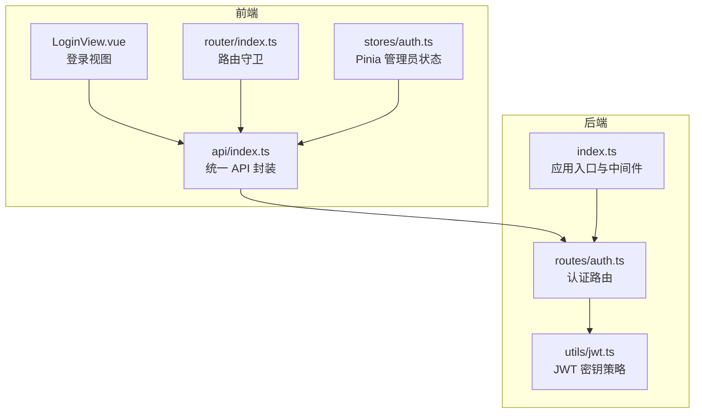
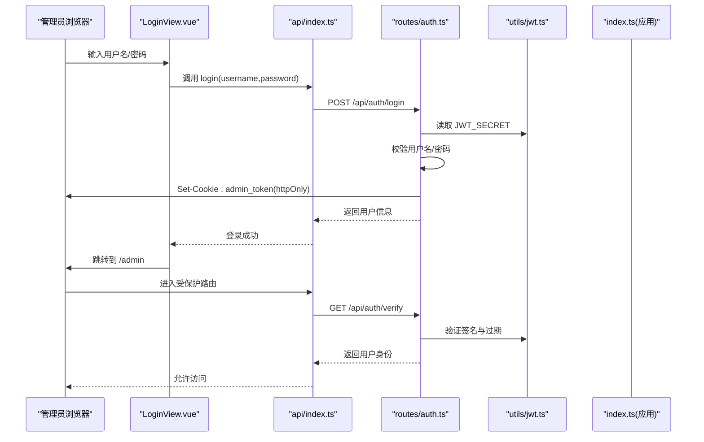
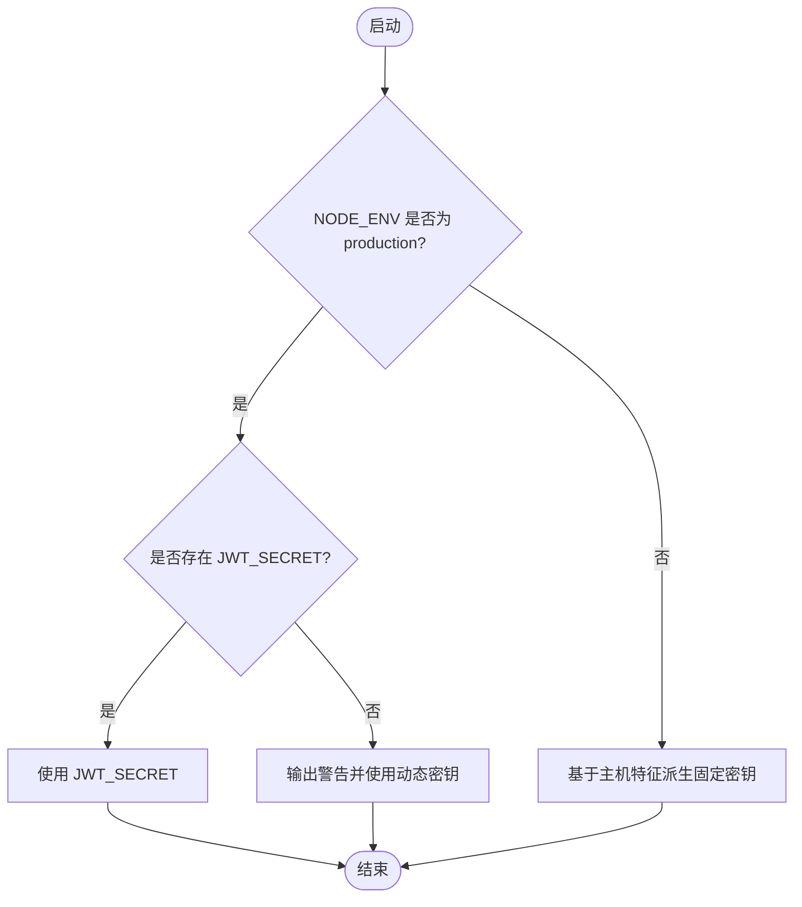
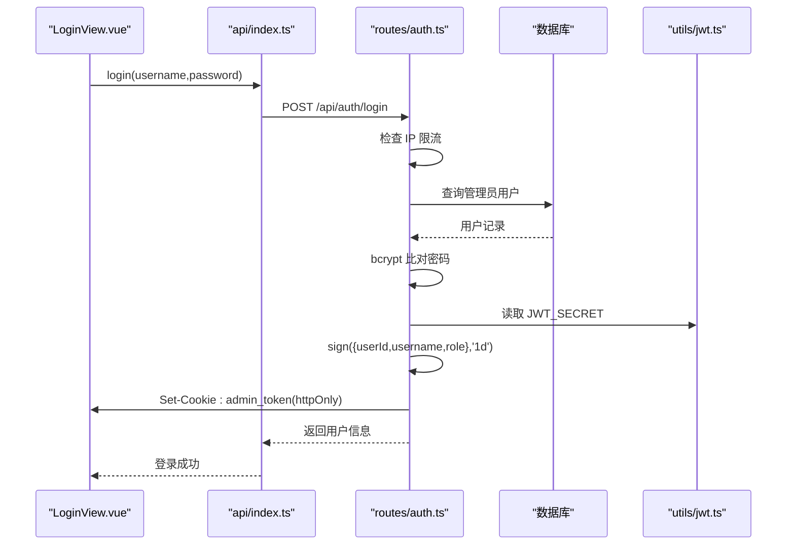
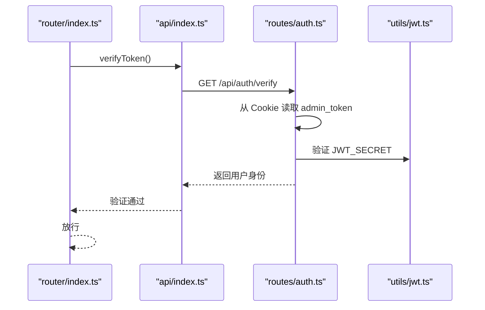
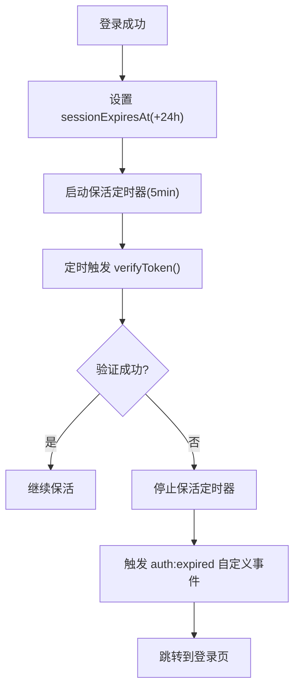
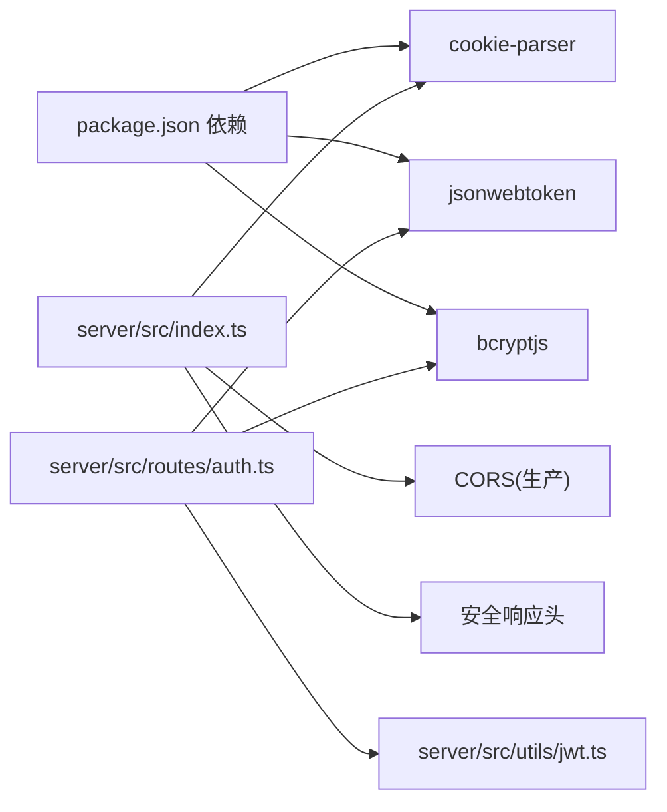

# 管理员认证

<cite>
**本文引用的文件列表**
- [server/src/utils/jwt.ts](file://server/src/utils/jwt.ts)
- [server/src/routes/auth.ts](file://server/src/routes/auth.ts)
- [src/stores/auth.ts](file://src/stores/auth.ts)
- [src/admin/views/LoginView.vue](file://src/admin/views/LoginView.vue)
- [src/router/index.ts](file://src/router/index.ts)
- [src/api/index.ts](file://src/api/index.ts)
- [server/src/index.ts](file://server/src/index.ts)
- [src/stores/clientAuth.ts](file://src/stores/clientAuth.ts)
- [package.json](file://package.json)
</cite>

## 目录
1. [简介](#简介)
2. [项目结构与角色定位](#项目结构与角色定位)
3. [核心组件](#核心组件)
4. [架构总览](#架构总览)
5. [详细组件分析](#详细组件分析)
6. [依赖关系分析](#依赖关系分析)
7. [性能与安全考量](#性能与安全考量)
8. [故障排查指南](#故障排查指南)
9. [结论](#结论)

## 简介
本技术文档聚焦于 RLRMS 管理员认证系统，围绕管理员登录流程、凭据验证、JWT 令牌生成与发放、JWT 密钥管理策略、认证中间件实现原理、前端状态管理与路由守卫、以及错误处理与安全最佳实践进行系统性解析。文档旨在帮助开发者与运维人员快速理解并维护该认证体系。

## 项目结构与角色定位
- 后端服务负责：
  - 管理员登录与密码校验
  - JWT 签发与发放（httpOnly cookie）
  - 登录尝试频率限制
  - 令牌验证与登出
- 前端应用负责：
  - 管理员登录界面与表单交互
  - 通过 API 发起登录请求
  - 通过 Pinia Store 维护认证状态与会话保活
  - 路由守卫基于后端验证接口判断访问权限

图表来源
- [src/admin/views/LoginView.vue:1-300](file://src/admin/views/LoginView.vue#L1-L300)
- [src/router/index.ts:1-317](file://src/router/index.ts#L1-L317)
- [src/stores/auth.ts:1-128](file://src/stores/auth.ts#L1-L128)
- [src/api/index.ts:1-608](file://src/api/index.ts#L1-L608)
- [server/src/routes/auth.ts:1-405](file://server/src/routes/auth.ts#L1-L405)
- [server/src/utils/jwt.ts:1-27](file://server/src/utils/jwt.ts#L1-L27)
- [server/src/index.ts:1-171](file://server/src/index.ts#L1-L171)

章节来源
- [src/admin/views/LoginView.vue:1-300](file://src/admin/views/LoginView.vue#L1-L300)
- [src/router/index.ts:1-317](file://src/router/index.ts#L1-L317)
- [src/stores/auth.ts:1-128](file://src/stores/auth.ts#L1-L128)
- [src/api/index.ts:1-608](file://src/api/index.ts#L1-L608)
- [server/src/routes/auth.ts:1-405](file://server/src/routes/auth.ts#L1-L405)
- [server/src/utils/jwt.ts:1-27](file://server/src/utils/jwt.ts#L1-L27)
- [server/src/index.ts:1-171](file://server/src/index.ts#L1-L171)

## 核心组件
- JWT 密钥管理器：根据运行环境选择固定或动态密钥，兼顾开发体验与生产安全。
- 认证路由：提供管理员登录、登出、令牌验证等接口；内置 IP 级登录尝试限流。
- 前端认证 Store：管理管理员登录态、会话过期时间、保活定时器与即将过期提醒。
- 登录视图：收集用户名/密码，调用 API 登录并同步前端状态。
- 路由守卫：在进入受保护路由前，调用后端验证接口确认登录状态。
- API 封装：统一处理 401、超时、非 JSON 响应等异常，触发全局“会话过期”事件。

章节来源
- [server/src/utils/jwt.ts:1-27](file://server/src/utils/jwt.ts#L1-L27)
- [server/src/routes/auth.ts:64-179](file://server/src/routes/auth.ts#L64-L179)
- [src/stores/auth.ts:15-127](file://src/stores/auth.ts#L15-L127)
- [src/admin/views/LoginView.vue:20-42](file://src/admin/views/LoginView.vue#L20-L42)
- [src/router/index.ts:201-277](file://src/router/index.ts#L201-L277)
- [src/api/index.ts:54-114](file://src/api/index.ts#L54-L114)

## 架构总览
管理员认证采用“基于 httpOnly Cookie 的 JWT”方案，避免 XSS 盗取 token；后端签发的 JWT 仅通过 Cookie 传输，前端通过 API 接口完成登录、验证与登出。

图表来源
- [src/admin/views/LoginView.vue:20-42](file://src/admin/views/LoginView.vue#L20-L42)
- [src/api/index.ts:246-261](file://src/api/index.ts#L246-L261)
- [server/src/routes/auth.ts:65-144](file://server/src/routes/auth.ts#L65-L144)
- [server/src/utils/jwt.ts:20-22](file://server/src/utils/jwt.ts#L20-L22)
- [server/src/index.ts:44](file://server/src/index.ts#L44)

## 详细组件分析

### JWT 密钥管理策略
- 开发环境：基于主机名与用户名派生固定密钥，保证 tsx watch 重启后 token 不失效，同时避免硬编码在代码中。
- 生产环境：优先使用环境变量 JWT_SECRET；若未设置，则生成随机动态密钥，每次启动不同，提升安全性。
- 重要提示：生产环境建议显式设置 JWT_SECRET，避免动态密钥导致重启后 token 失效。

图表来源
- [server/src/utils/jwt.ts:4-26](file://server/src/utils/jwt.ts#L4-L26)

章节来源
- [server/src/utils/jwt.ts:1-27](file://server/src/utils/jwt.ts#L1-L27)

### 管理员登录流程与凭据验证
- 前端 LoginView.vue 收集用户名/密码，调用 api.login(username,password)。
- 后端 auth 路由接收请求，先做 IP 级登录尝试限流（15 分钟最多 5 次），再查询数据库管理员用户并比对密码。
- 登录成功后，后端使用 JWT_SECRET 签发 JWT，设置 httpOnly Cookie admin_token，有效期 1 天。
- 前端收到响应后，调用 authStore.setUser 同步状态并跳转至目标页面。

图表来源
- [src/admin/views/LoginView.vue:20-42](file://src/admin/views/LoginView.vue#L20-L42)
- [src/api/index.ts:246-251](file://src/api/index.ts#L246-L251)
- [server/src/routes/auth.ts:65-144](file://server/src/routes/auth.ts#L65-L144)
- [server/src/utils/jwt.ts:20-22](file://server/src/utils/jwt.ts#L20-L22)

章节来源
- [server/src/routes/auth.ts:64-144](file://server/src/routes/auth.ts#L64-L144)
- [src/admin/views/LoginView.vue:20-42](file://src/admin/views/LoginView.vue#L20-L42)
- [src/api/index.ts:246-251](file://src/api/index.ts#L246-L251)

### JWT 令牌发放与 Cookie 策略
- Cookie 名称：admin_token
- 属性：httpOnly、secure（生产环境）、sameSite=lax、maxAge=1 天、path=/，确保跨站脚本难以读取，且在 HTTPS 下传输。
- 前端 fetch 请求默认携带 Cookie（credentials: include），无需手动附加 Authorization 头。

章节来源
- [server/src/routes/auth.ts:120-127](file://server/src/routes/auth.ts#L120-L127)
- [src/api/index.ts:80](file://src/api/index.ts#L80)

### 认证中间件与令牌验证
- 路由守卫在进入受保护路由前，调用 api.verifyToken() 向后端发起 /api/auth/verify 请求。
- 后端从 Cookie 读取 admin_token，使用 JWT_SECRET 验证签名与过期时间，返回用户身份信息。
- 若验证失败（无 token 或无效），路由守卫将重定向到登录页并附带 redirect 参数。

图表来源
- [src/router/index.ts:259-272](file://src/router/index.ts#L259-L272)
- [src/api/index.ts:253-255](file://src/api/index.ts#L253-L255)
- [server/src/routes/auth.ts:157-179](file://server/src/routes/auth.ts#L157-L179)
- [server/src/utils/jwt.ts:20-22](file://server/src/utils/jwt.ts#L20-L22)

章节来源
- [src/router/index.ts:201-277](file://src/router/index.ts#L201-L277)
- [src/api/index.ts:253-255](file://src/api/index.ts#L253-L255)
- [server/src/routes/auth.ts:157-179](file://server/src/routes/auth.ts#L157-L179)

### 登出与会话清理
- 前端调用 api.logout()，后端清除 admin_token Cookie。
- 前端 Store 清理本地状态，停止保活定时器。

章节来源
- [server/src/routes/auth.ts:147-155](file://server/src/routes/auth.ts#L147-L155)
- [src/api/index.ts:257-261](file://src/api/index.ts#L257-L261)
- [src/stores/auth.ts:90-103](file://src/stores/auth.ts#L90-L103)

### 前端认证状态管理与会话保活
- Pinia Store 维护：
  - user、isAuthenticated、sessionExpiresAt
  - expiresIn（计算剩余秒数）
  - startKeepAlive()/stopKeepAlive() 保活定时器（每 5 分钟验证一次）
  - isSessionExpiringSoon（30 分钟内即将过期）
- 登录成功后设置 sessionExpiresAt 为当前时间 + 24 小时，并启动保活定时器。
- 保活定时器内部调用 api.verifyToken()，失败则触发自定义事件 auth:expired，通知应用进行登出与跳转。

图表来源
- [src/stores/auth.ts:37-55](file://src/stores/auth.ts#L37-L55)
- [src/stores/auth.ts:71-85](file://src/stores/auth.ts#L71-L85)
- [src/stores/auth.ts:109-113](file://src/stores/auth.ts#L109-L113)
- [src/api/index.ts:94-104](file://src/api/index.ts#L94-L104)

章节来源
- [src/stores/auth.ts:15-127](file://src/stores/auth.ts#L15-L127)
- [src/api/index.ts:94-104](file://src/api/index.ts#L94-L104)

### 登录尝试频率限制
- 基于 IP 的 Map 记录最近 15 分钟内的尝试次数，超过 5 次返回 429 Too Many Requests。
- 定期清理过期记录，防止内存泄漏。

章节来源
- [server/src/routes/auth.ts:19-32](file://server/src/routes/auth.ts#L19-L32)
- [server/src/routes/auth.ts:34-55](file://server/src/routes/auth.ts#L34-L55)

### 错误处理与安全最佳实践
- 401 处理：api.request 对 401 响应触发全局 auth:expired 事件，统一提示“会话已过期，请重新登录”，并在路由守卫中重定向。
- 非 JSON 响应防御：严格校验 Content-Type，防止 HTML 等非 JSON 响应绕过错误处理。
- 安全响应头：X-Content-Type-Options、X-Frame-Options、X-XSS-Protection、Referrer-Policy。
- Cookie 安全：httpOnly、secure（生产）、sameSite、maxAge。
- 生产密钥：建议显式设置 JWT_SECRET，避免动态密钥重启失效。

章节来源
- [src/api/index.ts:94-104](file://src/api/index.ts#L94-L104)
- [server/src/index.ts:60-66](file://server/src/index.ts#L60-L66)
- [server/src/routes/auth.ts:120-127](file://server/src/routes/auth.ts#L120-L127)
- [server/src/utils/jwt.ts:24-26](file://server/src/utils/jwt.ts#L24-L26)

## 依赖关系分析
- 前端依赖后端提供的 /api/auth/* 接口，依赖 Cookie 传递 token。
- 后端依赖 cookie-parser 中间件解析 Cookie，依赖 jsonwebtoken 与 crypto 生成/验证 JWT。
- 应用入口在生产环境启用 CORS、安全响应头与静态资源托管。

图表来源
- [package.json:24-29](file://package.json#L24-L29)
- [server/src/index.ts:44](file://server/src/index.ts#L44)
- [server/src/routes/auth.ts:3-6](file://server/src/routes/auth.ts#L3-L6)
- [server/src/utils/jwt.ts:1-2](file://server/src/utils/jwt.ts#L1-L2)

章节来源
- [package.json:16-41](file://package.json#L16-L41)
- [server/src/index.ts:37-46](file://server/src/index.ts#L37-L46)
- [server/src/routes/auth.ts:1-7](file://server/src/routes/auth.ts#L1-L7)

## 性能与安全考量
- 性能
  - 保活定时器 5 分钟一次，开销极小。
  - 前端 API 层使用 credentials: include，减少重复头部设置。
- 安全
  - 使用 httpOnly Cookie 存储 token，降低 XSS 风险。
  - 生产环境启用 secure 与 HTTPS。
  - 严格的 401 处理与全局事件分发，确保一致的过期体验。
  - 非 JSON 响应防御，避免解析异常。
  - 登录尝试限流，抵御暴力破解。

[本节为通用指导，不直接分析具体文件]

## 故障排查指南
- 登录后仍提示未登录
  - 检查 Cookie 是否正确设置（admin_token），确认 SameSite/CORS/HTTPS 配置。
  - 确认前端路由守卫调用 api.verifyToken() 是否返回 200。
- 会话频繁过期
  - 检查保活定时器是否正常运行，确认 api.verifyToken() 未抛错。
  - 确认 JWT_SECRET 在生产环境已设置，避免动态密钥重启失效。
- 401 未授权
  - 查看全局 auth:expired 事件是否被触发，确认前端是否正确处理。
  - 检查后端 /api/auth/verify 是否返回有效用户身份。
- 登录被限流
  - 确认同一 IP 在 15 分钟内尝试次数不超过 5 次。

章节来源
- [src/api/index.ts:94-104](file://src/api/index.ts#L94-L104)
- [server/src/routes/auth.ts:19-32](file://server/src/routes/auth.ts#L19-L32)
- [server/src/utils/jwt.ts:24-26](file://server/src/utils/jwt.ts#L24-L26)

## 结论
RLRMS 管理员认证系统以“httpOnly Cookie + JWT”为核心，结合前端 Pinia Store 的会话保活与路由守卫，实现了安全、稳定且用户体验良好的认证流程。生产环境建议显式配置 JWT_SECRET，并确保 HTTPS 与安全响应头生效，以进一步提升安全性。