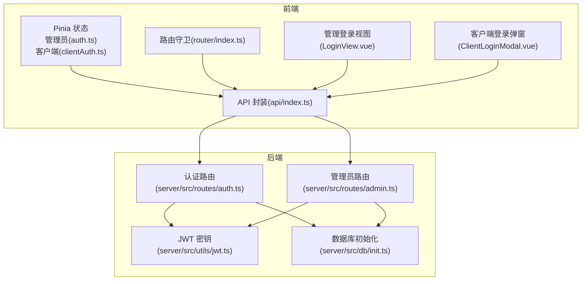
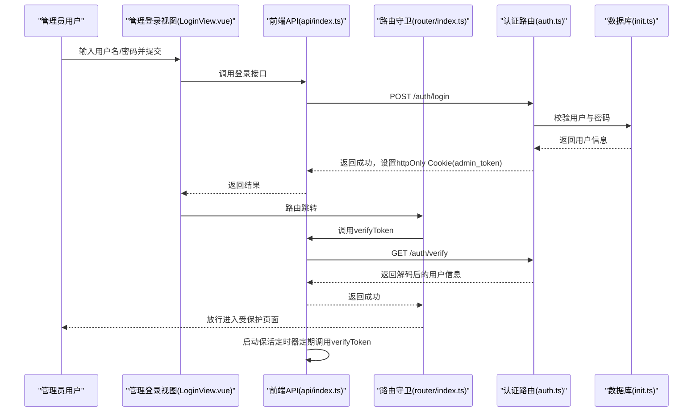
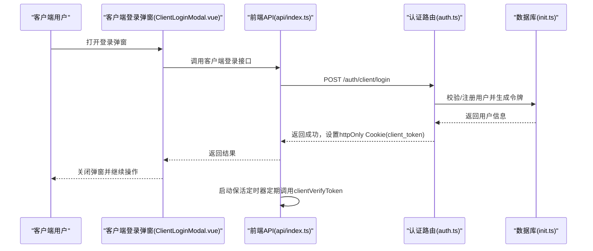
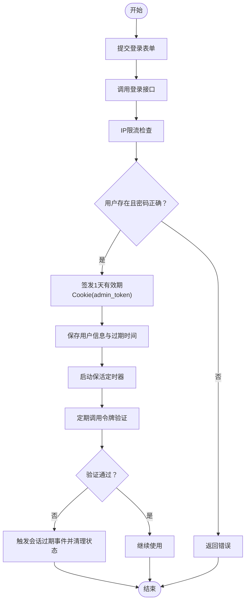
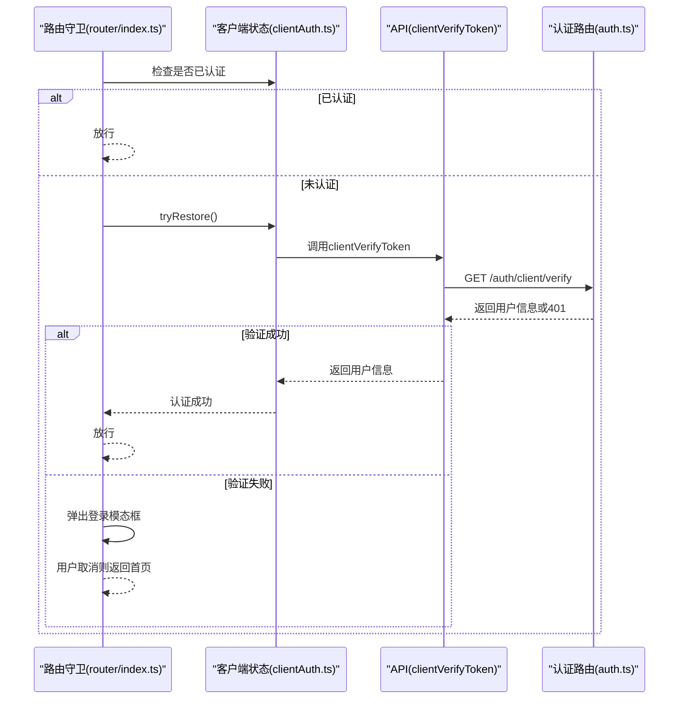
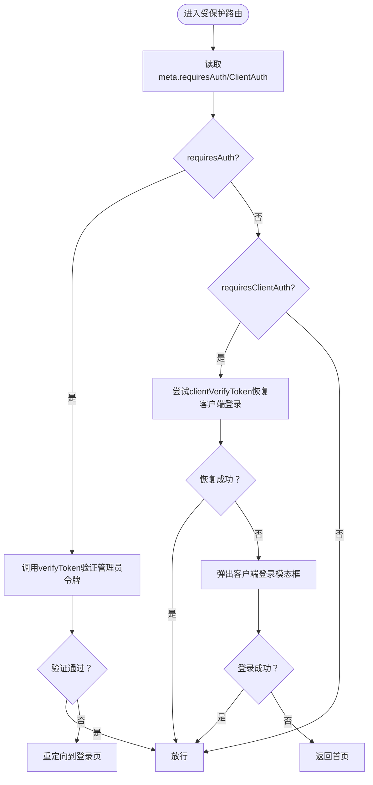
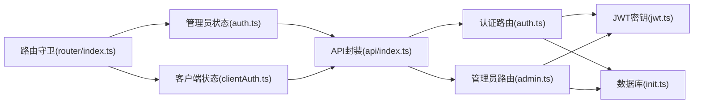

# 认证与授权

<cite>
**本文引用的文件**
- [auth.ts](file://src/stores/auth.ts)
- [clientAuth.ts](file://src/stores/clientAuth.ts)
- [storage.ts](file://src/utils/storage.ts)
- [jwt.ts](file://server/src/utils/jwt.ts)
- [auth.ts](file://server/src/routes/auth.ts)
- [admin.ts](file://server/src/routes/admin.ts)
- [index.ts](file://src/router/index.ts)
- [index.ts](file://src/api/index.ts)
- [LoginView.vue](file://src/admin/views/LoginView.vue)
- [ClientLoginModal.vue](file://src/client/components/ClientLoginModal.vue)
- [index.ts](file://src/types/index.ts)
- [init.ts](file://server/src/db/init.ts)
- [dev-server.ts](file://server/src/dev-server.ts)
</cite>

## 目录
1. [简介](#简介)
2. [项目结构](#项目结构)
3. [核心组件](#核心组件)
4. [架构总览](#架构总览)
5. [详细组件分析](#详细组件分析)
6. [依赖关系分析](#依赖关系分析)
7. [性能考量](#性能考量)
8. [故障排查指南](#故障排查指南)
9. [结论](#结论)
10. [附录](#附录)

## 简介
本文件面向RLRMS的认证与授权系统，围绕JWT令牌的生成、验证与管理，管理员与客户端两类用户的认证流程，以及权限控制（路由守卫与组件级控制）进行深入技术说明。文档同时覆盖令牌过期策略、会话保活、错误处理与用户体验优化，并总结安全最佳实践与防护措施。

## 项目结构
认证与授权相关的核心位置分布如下：
- 前端
  - Pinia状态管理：管理员会话与客户端会话状态
  - 路由守卫：基于meta字段的权限控制
  - API封装：统一的请求与401处理
  - 视图与组件：登录视图、客户端登录弹窗
- 后端
  - 路由：登录、登出、令牌校验、密码修改
  - 中间件：管理员鉴权中间件
  - 工具：JWT密钥生成与环境适配
  - 数据库：用户表与默认初始化

**图表来源**
- [auth.ts:15-127](file://src/stores/auth.ts#L15-L127)
- [clientAuth.ts:10-86](file://src/stores/clientAuth.ts#L10-L86)
- [index.ts:201-277](file://src/router/index.ts#L201-L277)
- [index.ts:54-114](file://src/api/index.ts#L54-L114)
- [LoginView.vue:20-42](file://src/admin/views/LoginView.vue#L20-L42)
- [ClientLoginModal.vue:20-96](file://src/client/components/ClientLoginModal.vue#L20-L96)
- [jwt.ts:11-26](file://server/src/utils/jwt.ts#L11-L26)
- [auth.ts:65-144](file://server/src/routes/auth.ts#L65-L144)
- [admin.ts:116-131](file://server/src/routes/admin.ts#L116-L131)
- [init.ts:140-149](file://server/src/db/init.ts#L140-L149)

**章节来源**
- [auth.ts:15-127](file://src/stores/auth.ts#L15-L127)
- [clientAuth.ts:10-86](file://src/stores/clientAuth.ts#L10-L86)
- [index.ts:201-277](file://src/router/index.ts#L201-L277)
- [index.ts:54-114](file://src/api/index.ts#L54-L114)
- [LoginView.vue:20-42](file://src/admin/views/LoginView.vue#L20-L42)
- [ClientLoginModal.vue:20-96](file://src/client/components/ClientLoginModal.vue#L20-L96)
- [jwt.ts:11-26](file://server/src/utils/jwt.ts#L11-L26)
- [auth.ts:65-144](file://server/src/routes/auth.ts#L65-L144)
- [admin.ts:116-131](file://server/src/routes/admin.ts#L116-L131)
- [init.ts:140-149](file://server/src/db/init.ts#L140-L149)

## 核心组件
- 管理员认证状态（Pinia）
  - 管理员登录成功后设置用户信息与会话过期时间，启动保活定时器定期验证令牌有效性；即将过期时提供提示。
- 客户端认证状态（Pinia）
  - 通过cookie中的客户端令牌进行自动恢复登录；支持登出与清除本地状态。
- 前端API封装
  - 统一处理401未授权：触发全局自定义事件，便于路由守卫与UI层响应；对非JSON响应进行防御性处理。
- 路由守卫
  - 管理端：对需要鉴权的路由，优先尝试从cookie验证令牌；失败则重定向至登录页。
  - 客户端：对需要客户端认证的路由，尝试恢复登录，否则弹出登录模态框；用户取消则回到首页。
- JWT密钥管理
  - 开发模式：基于主机与用户名派生固定密钥，保证热重载不使令牌失效。
  - 生产模式：可配置JWT_SECRET，否则使用随机密钥（每次启动不同），注意重启会导致令牌失效。
- 认证路由
  - 管理员登录：IP限流、密码校验、签发1天有效期的httpOnly Cookie令牌。
  - 客户端登录：手机号格式校验、密码强度校验、自动注册与登录、签发7天有效期的httpOnly Cookie令牌。
  - 令牌验证：分别验证管理员与客户端令牌，客户端还会二次校验用户是否仍存在于数据库。
  - 密码修改：旧密码校验、新密码长度限制、更新密码。
- 管理员中间件
  - 从Cookie读取令牌，校验角色为admin，否则拒绝访问。

**章节来源**
- [auth.ts:15-127](file://src/stores/auth.ts#L15-L127)
- [clientAuth.ts:10-86](file://src/stores/clientAuth.ts#L10-L86)
- [index.ts:54-114](file://src/api/index.ts#L54-L114)
- [index.ts:201-277](file://src/router/index.ts#L201-L277)
- [jwt.ts:11-26](file://server/src/utils/jwt.ts#L11-L26)
- [auth.ts:65-144](file://server/src/routes/auth.ts#L65-L144)
- [auth.ts:182-294](file://server/src/routes/auth.ts#L182-L294)
- [auth.ts:307-344](file://server/src/routes/auth.ts#L307-L344)
- [auth.ts:347-405](file://server/src/routes/auth.ts#L347-L405)
- [admin.ts:116-131](file://server/src/routes/admin.ts#L116-L131)

## 架构总览
下面的序列图展示了管理员登录与会话保活的整体流程，以及客户端登录与令牌验证流程。

**图表来源**
- [LoginView.vue:20-42](file://src/admin/views/LoginView.vue#L20-L42)
- [index.ts:246-261](file://src/api/index.ts#L246-L261)
- [index.ts:201-277](file://src/router/index.ts#L201-L277)
- [auth.ts:65-144](file://server/src/routes/auth.ts#L65-L144)
- [init.ts:140-149](file://server/src/db/init.ts#L140-L149)

**图表来源**
- [ClientLoginModal.vue:20-96](file://src/client/components/ClientLoginModal.vue#L20-L96)
- [index.ts:271-286](file://src/api/index.ts#L271-L286)
- [auth.ts:182-294](file://server/src/routes/auth.ts#L182-L294)
- [init.ts:140-149](file://server/src/db/init.ts#L140-L149)

## 详细组件分析

### 管理员认证流程（登录、权限控制、会话管理）
- 登录流程
  - 前端登录视图收集用户名与密码，调用登录接口。
  - 后端路由接收请求，进行IP限流、用户名/密码校验，成功后签发1天有效期的httpOnly Cookie令牌。
  - 前端收到响应后，将用户信息写入Pinia状态，并记录会话过期时间。
- 权限控制
  - 路由守卫对需要鉴权的管理端路由，先尝试从Cookie验证令牌；若失败则重定向至登录页并携带redirect参数。
  - 管理员中间件在每个受保护的管理端接口上再次校验令牌与角色。
- 会话管理
  - 前端启动保活定时器，周期性调用令牌验证接口；失败则触发全局“会话过期”事件，清理状态并提示用户重新登录。
  - 提供“即将过期”的判断，用于UI提示。

**图表来源**
- [LoginView.vue:20-42](file://src/admin/views/LoginView.vue#L20-L42)
- [auth.ts:65-144](file://server/src/routes/auth.ts#L65-L144)
- [auth.ts:116-131](file://server/src/routes/admin.ts#L116-L131)
- [auth.ts:37-55](file://src/stores/auth.ts#L37-L55)

**章节来源**
- [LoginView.vue:20-42](file://src/admin/views/LoginView.vue#L20-L42)
- [auth.ts:65-144](file://server/src/routes/auth.ts#L65-L144)
- [index.ts:201-277](file://src/router/index.ts#L201-L277)
- [admin.ts:116-131](file://server/src/routes/admin.ts#L116-L131)
- [auth.ts:37-55](file://src/stores/auth.ts#L37-L55)

### 客户端认证系统（登录、自动登录、令牌持久化）
- 登录与自动注册
  - 客户端登录接口对手机号格式与密码长度进行校验；若用户不存在则自动注册并登录，随后签发7天有效期的httpOnly Cookie令牌。
- 自动登录
  - 路由守卫在访问需要客户端认证的路由时，尝试从Cookie恢复令牌；若成功则放行；若失败则弹出登录模态框。
- 令牌持久化
  - 令牌存储于httpOnly Cookie，前端通过API封装的clientVerifyToken进行验证；同时提供clientLogout清理Cookie。

**图表来源**
- [index.ts:208-247](file://src/router/index.ts#L208-L247)
- [clientAuth.ts:38-54](file://src/stores/clientAuth.ts#L38-L54)
- [index.ts:278-280](file://src/api/index.ts#L278-L280)
- [auth.ts:307-344](file://server/src/routes/auth.ts#L307-L344)

**章节来源**
- [ClientLoginModal.vue:20-96](file://src/client/components/ClientLoginModal.vue#L20-L96)
- [index.ts:208-247](file://src/router/index.ts#L208-L247)
- [clientAuth.ts:38-54](file://src/stores/clientAuth.ts#L38-L54)
- [auth.ts:182-294](file://server/src/routes/auth.ts#L182-L294)
- [auth.ts:307-344](file://server/src/routes/auth.ts#L307-L344)

### JWT令牌结构、过期策略与刷新机制
- 令牌结构
  - 管理员令牌：包含userId、username、role等声明。
  - 客户端令牌：包含userId、username（或phone）、role、phone等声明。
- 过期策略
  - 管理员令牌：1天有效期。
  - 客户端令牌：7天有效期。
- 刷新机制
  - 当前实现采用会话保活：前端定时调用验证接口，若失败则判定会话过期并清理状态，引导用户重新登录。
  - 未实现独立的刷新令牌（refresh token）轮换机制。

**章节来源**
- [auth.ts:114-118](file://server/src/routes/auth.ts#L114-L118)
- [auth.ts:265-269](file://server/src/routes/auth.ts#L265-L269)
- [auth.ts:37-55](file://src/stores/auth.ts#L37-L55)

### 权限控制设计原则与实现方法
- 设计原则
  - 最小权限：仅授予完成任务所需的最低权限。
  - 双重校验：前端路由守卫与后端中间件双重保障。
  - 一致性：前后端对令牌与角色的校验保持一致。
- 实现方法
  - 路由守卫：通过meta字段标记是否需要管理员或客户端认证；在进入路由前进行令牌验证与自动登录。
  - 组件级控制：结合Pinia状态与路由守卫，在组件内部根据isAuthenticated与用户角色决定渲染与交互。
  - 后端中间件：管理员接口统一requireAuth，校验角色为admin。

**图表来源**
- [index.ts:201-277](file://src/router/index.ts#L201-L277)
- [index.ts:253-255](file://src/api/index.ts#L253-L255)
- [index.ts:278-280](file://src/api/index.ts#L278-L280)

**章节来源**
- [index.ts:201-277](file://src/router/index.ts#L201-L277)
- [admin.ts:116-131](file://server/src/routes/admin.ts#L116-L131)

### 安全最佳实践与防护措施
- 传输安全
  - 使用httpOnly Cookie存储令牌，降低XSS风险；生产环境启用secure属性。
- 令牌安全
  - 开发模式使用基于主机特征的固定密钥；生产模式建议设置JWT_SECRET，避免每次启动令牌失效。
- 速率限制
  - 登录接口对IP进行限流，防止暴力破解。
- 输入校验
  - 客户端登录对手机号格式与密码长度进行严格校验；服务端同样进行格式与长度校验。
- 会话保活
  - 前端定期验证令牌有效性，异常时清理状态并提示用户重新登录。
- 错误处理
  - API封装对401进行统一处理，触发全局事件；对非JSON响应进行防御性处理，避免解析异常。

**章节来源**
- [auth.ts:19-55](file://server/src/routes/auth.ts#L19-L55)
- [auth.ts:182-294](file://server/src/routes/auth.ts#L182-L294)
- [index.ts:54-114](file://src/api/index.ts#L54-L114)
- [jwt.ts:11-26](file://server/src/utils/jwt.ts#L11-L26)

## 依赖关系分析
- 前端依赖
  - 路由守卫依赖Pinia状态与API封装；API封装依赖Cookie凭证与全局401处理。
- 后端依赖
  - 认证路由依赖JWT密钥与数据库；管理员中间件依赖认证路由提供的令牌。
- 数据库初始化
  - 首次运行时创建用户表与默认管理员账户，确保系统可用。

**图表来源**
- [index.ts:201-277](file://src/router/index.ts#L201-L277)
- [auth.ts:15-127](file://src/stores/auth.ts#L15-L127)
- [clientAuth.ts:10-86](file://src/stores/clientAuth.ts#L10-L86)
- [index.ts:54-114](file://src/api/index.ts#L54-L114)
- [auth.ts:65-144](file://server/src/routes/auth.ts#L65-L144)
- [admin.ts:116-131](file://server/src/routes/admin.ts#L116-L131)
- [jwt.ts:11-26](file://server/src/utils/jwt.ts#L11-L26)
- [init.ts:140-149](file://server/src/db/init.ts#L140-L149)

**章节来源**
- [index.ts:201-277](file://src/router/index.ts#L201-L277)
- [auth.ts:15-127](file://src/stores/auth.ts#L15-L127)
- [clientAuth.ts:10-86](file://src/stores/clientAuth.ts#L10-L86)
- [index.ts:54-114](file://src/api/index.ts#L54-L114)
- [auth.ts:65-144](file://server/src/routes/auth.ts#L65-L144)
- [admin.ts:116-131](file://server/src/routes/admin.ts#L116-L131)
- [jwt.ts:11-26](file://server/src/utils/jwt.ts#L11-L26)
- [init.ts:140-149](file://server/src/db/init.ts#L140-L149)

## 性能考量
- 前端
  - 会话保活定时器周期性调用验证接口，建议合理设置间隔（当前为5分钟），避免过于频繁导致不必要的网络开销。
  - API封装使用stale-while-revalidate缓存策略，减少重复请求带来的压力。
- 后端
  - 登录接口采用IP限流，防止恶意尝试；数据库建立必要索引，提升查询性能。
  - 管理端接口使用批量查询与缓存键失效策略，降低N+1查询与重复计算成本。

**章节来源**
- [auth.ts:37-55](file://src/stores/auth.ts#L37-L55)
- [index.ts:9-34](file://src/api/index.ts#L9-L34)
- [init.ts:124-137](file://server/src/db/init.ts#L124-L137)

## 故障排查指南
- 401未授权
  - 前端：API封装在收到401时触发全局“auth:expired”事件，清理状态并提示重新登录。
  - 后端：认证路由与管理员中间件在缺少或无效令牌时返回401。
- 会话过期
  - 前端：保活定时器检测失败后触发过期事件，清理状态并提示用户重新登录。
- 客户端登录失败
  - 检查手机号格式与密码长度；确认是否自动注册成功；查看客户端令牌是否正确设置。
- 生产环境令牌失效
  - 若未设置JWT_SECRET，生产环境每次启动会更换密钥，导致旧令牌失效；请设置固定密钥或在重启后引导用户重新登录。

**章节来源**
- [index.ts:94-114](file://src/api/index.ts#L94-L114)
- [auth.ts:158-179](file://server/src/routes/auth.ts#L158-L179)
- [admin.ts:116-131](file://server/src/routes/admin.ts#L116-L131)
- [auth.ts:41-55](file://src/stores/auth.ts#L41-L55)
- [jwt.ts:24-26](file://server/src/utils/jwt.ts#L24-L26)

## 结论
RLRMS的认证与授权体系以JWT为核心，结合httpOnly Cookie与Pinia状态管理，实现了管理员与客户端两类用户的认证与权限控制。前端通过路由守卫与API封装提供一致的用户体验，后端通过中间件与限流策略保障安全性。建议后续引入独立的刷新令牌机制与更细粒度的权限模型，进一步提升系统的安全性与可维护性。

## 附录
- 默认管理员账号
  - 用户名：admin
  - 密码：admin123（初始化脚本中生成）
- 开发服务器启动
  - 通过开发服务器脚本启动，自动初始化数据库并监听端口。

**章节来源**
- [init.ts:140-149](file://server/src/db/init.ts#L140-L149)
- [dev-server.ts:1-13](file://server/src/dev-server.ts#L1-L13)