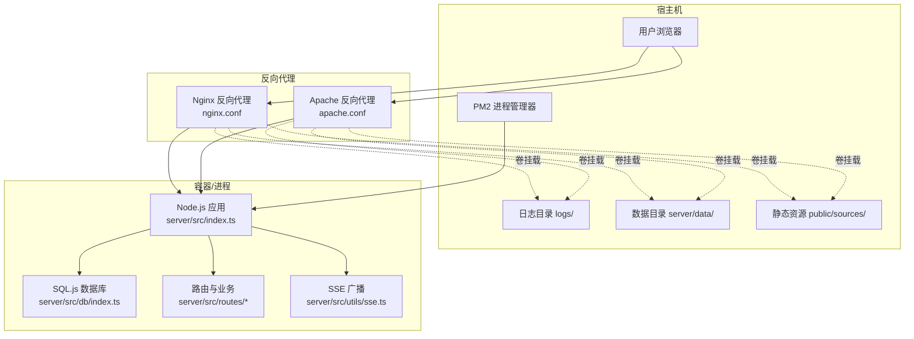
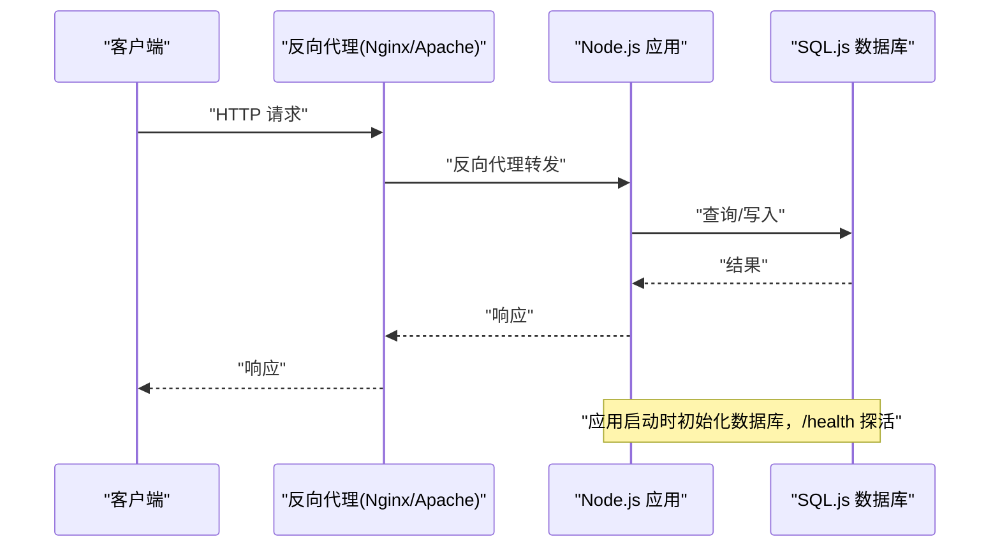
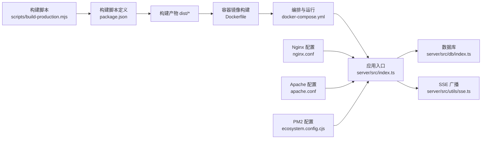

# 部署与运维

<cite>
**本文引用的文件**
- [Dockerfile](file://Dockerfile)
- [docker-compose.yml](file://docker-compose.yml)
- [ecosystem.config.cjs](file://ecosystem.config.cjs)
- [nginx.conf](file://nginx.conf)
- [apache.conf](file://apache.conf)
- [package.json](file://package.json)
- [scripts/build-production.mjs](file://scripts/build-production.mjs)
- [install.sh](file://install.sh)
- [start.sh](file://start.sh)
- [stop.sh](file://stop.sh)
- [server/src/index.ts](file://server/src/index.ts)
- [server/src/dev.ts](file://server/src/dev.ts)
- [server/src/dev-server.ts](file://server/src/dev-server.ts)
- [server/src/db/index.ts](file://server/src/db/index.ts)
- [server/src/utils/sse.ts](file://server/src/utils/sse.ts)
</cite>

## 目录
1. [简介](#简介)
2. [项目结构](#项目结构)
3. [核心组件](#核心组件)
4. [架构总览](#架构总览)
5. [详细组件分析](#详细组件分析)
6. [依赖关系分析](#依赖关系分析)
7. [性能考虑](#性能考虑)
8. [故障排除指南](#故障排除指南)
9. [结论](#结论)
10. [附录](#附录)

## 简介
本文件面向运维工程师，提供红灯笼食府管理系统的生产级部署与运维指南。内容覆盖：
- Docker 容器化部署：多阶段构建、镜像优化、健康检查、资源限制、卷挂载与环境变量
- 反向代理：Nginx 与 Apache 的配置要点（SSE/WS 支持、静态资源缓存、超时控制）
- 进程管理：PM2 的配置与使用（自动重启、日志管理、内存阈值）
- 生产部署流程与最佳实践
- 监控告警、日志分析与性能调优
- 故障排除与应急处理

## 项目结构
系统由前端构建产物、后端 Node.js 服务、SQLite-js 数据存储与反向代理组成。生产环境通过 Docker Compose 统一编排，支持 Nginx/Apache 作为入口代理。

图表来源
- [server/src/index.ts:163-171](file://server/src/index.ts#L163-L171)
- [server/src/db/index.ts:76-90](file://server/src/db/index.ts#L76-L90)
- [server/src/utils/sse.ts:37-51](file://server/src/utils/sse.ts#L37-L51)
- [nginx.conf:5-85](file://nginx.conf#L5-L85)
- [apache.conf:8-64](file://apache.conf#L8-L64)

章节来源
- [Dockerfile:1-65](file://Dockerfile#L1-L65)
- [docker-compose.yml:1-54](file://docker-compose.yml#L1-L54)
- [server/src/index.ts:163-171](file://server/src/index.ts#L163-L171)

## 核心组件
- Node.js 应用入口与静态资源托管：负责健康检查、CORS、安全头、静态资源缓存策略、SSE/WS 支持与 SPA 回退
- 数据层：基于 sql.js 的内存数据库，持久化至 server/data/restaurant.db
- SSE 广播：用于管理员实时事件推送
- 反向代理：Nginx/Apache 提供静态资源缓存、SSE/WS 透传、超时与 keepalive 控制
- 进程管理：PM2 提供自动重启、日志聚合、内存阈值保护
- 容器化：Docker 多阶段构建、非 root 用户、健康检查、资源限制与日志轮转

章节来源
- [server/src/index.ts:33-142](file://server/src/index.ts#L33-L142)
- [server/src/db/index.ts:76-90](file://server/src/db/index.ts#L76-L90)
- [server/src/utils/sse.ts:37-51](file://server/src/utils/sse.ts#L37-L51)
- [nginx.conf:5-85](file://nginx.conf#L5-L85)
- [apache.conf:8-64](file://apache.conf#L8-L64)
- [ecosystem.config.cjs:1-19](file://ecosystem.config.cjs#L1-L19)
- [Dockerfile:24-64](file://Dockerfile#L24-L64)

## 架构总览
生产部署采用“反向代理 + Node.js 应用 + 数据持久化”的三层架构。Nginx/Apache 作为统一入口，负责静态资源缓存、SSE/WS 透传与超时控制；Node.js 应用提供 API、SSE 事件与前端静态资源回退；数据通过 sql.js 写入本地文件系统。

图表来源
- [server/src/index.ts:89-95](file://server/src/index.ts#L89-L95)
- [server/src/db/index.ts:76-90](file://server/src/db/index.ts#L76-L90)
- [nginx.conf:50-68](file://nginx.conf#L50-L68)
- [apache.conf:32-39](file://apache.conf#L32-L39)

## 详细组件分析

### Docker 容器化部署
- 多阶段构建：构建阶段安装依赖并产出 server/dist、dist、public、server/data；运行阶段仅保留生产依赖与构建产物，降低镜像体积
- 非 root 用户：创建 appuser/appgroup 并切换，提升安全性
- 环境变量：默认 NODE_ENV=production、PORT=3000，可通过 .env 注入
- 健康检查：每 30s 访问 /health，启动期 15s 后开始探测，连续 3 次失败即重启
- 资源限制：限制内存上限与预留，防止内存泄漏影响宿主机
- 卷挂载：server/data、logs、public/sources 持久化，便于备份与扩容
- 日志轮转：容器日志驱动为 json-file，单文件最大 10MB，最多 3 个文件

章节来源
- [Dockerfile:6-64](file://Dockerfile#L6-L64)
- [docker-compose.yml:7-54](file://docker-compose.yml#L7-L54)

### Nginx 反向代理
- 上游节点：指向 127.0.0.1:3000，启用 keepalive
- SSE 支持：/api/admin/events 关闭代理缓冲与缓存，长连接超时 24 小时，分块传输开启
- WebSocket：升级头透传，超时合理设置
- 静态资源缓存：/sources/ 与 /assets/ 长期缓存，API 路径禁用缓存
- 日志与请求限制：access/error 日志路径、client_max_body_size 限制
- HTTPS：提供可选模板，包含协议与会话参数示例

章节来源
- [nginx.conf:5-85](file://nginx.conf#L5-L85)
- [nginx.conf:94-170](file://nginx.conf#L94-L170)

### Apache 反向代理
- SSE 支持：/api/admin/events 使用 ProxyPass，flushpackets=auto 确保不缓冲
- 通用代理：/ 代理到 127.0.0.1:3000，并透传真实客户端信息
- WebSocket：通过 RewriteEngine 匹配 Upgrade 头进行 ws:// 转发
- 静态资源缓存：/sources/ 与 /assets/ 设置 Cache-Control
- HTTPS：提供可选模板，包含证书与协议参数

章节来源
- [apache.conf:8-64](file://apache.conf#L8-L64)
- [apache.conf:66-77](file://apache.conf#L66-L77)

### PM2 进程管理
- 应用名称与脚本：red-lantern-restaurant，脚本为 server/dist/index.js
- 实例数与自动重启：instances=1，autorestart=true
- 内存阈值：max_memory_restart=500M，避免内存泄漏导致崩溃
- 日志：独立 error/out/combined 日志文件，时间戳开启
- 环境变量：NODE_ENV=production，PORT=3000

章节来源
- [ecosystem.config.cjs:1-19](file://ecosystem.config.cjs#L1-L19)

### Node.js 应用与数据层
- 健康检查：/health 返回数据库初始化状态
- 静态资源：/sources/ 与 /assets/ 长期缓存；生产环境回退到 index.html
- 安全头：X-Content-Type-Options、X-Frame-Options、X-XSS-Protection、Referrer-Policy
- 压缩：除 SSE 外启用 gzip/deflate，threshold=512B
- 数据库：首次启动加载或创建数据库文件，批量写入使用防抖与事务封装

章节来源
- [server/src/index.ts:89-139](file://server/src/index.ts#L89-L139)
- [server/src/db/index.ts:76-90](file://server/src/db/index.ts#L76-L90)

### 开发与生产启动脚本
- install.sh：安装依赖、构建生产包、可选 PM2/Apache/Nginx 配置、可选 Docker Compose 启动
- start.sh：校验构建产物与端口占用，优先 PM2 启动，否则直接后台运行
- stop.sh：优先 PM2 停止，其次 PID 文件，最后按端口查找进程并强制终止

章节来源
- [install.sh:47-87](file://install.sh#L47-L87)
- [install.sh:282-306](file://install.sh#L282-L306)
- [start.sh:94-155](file://start.sh#L94-L155)
- [stop.sh:29-89](file://stop.sh#L29-L89)

## 依赖关系分析
- 构建链路：scripts/build-production.mjs -> package.json 脚本 -> dist/server/dist/public/server/data
- 运行链路：Dockerfile -> docker-compose.yml -> ecosystem.config.cjs -> server/src/index.ts
- 反向代理：nginx.conf / apache.conf -> Node.js 应用 -> 数据持久化

图表来源
- [scripts/build-production.mjs:13-40](file://scripts/build-production.mjs#L13-L40)
- [package.json:6-14](file://package.json#L6-L14)
- [Dockerfile:24-47](file://Dockerfile#L24-L47)
- [docker-compose.yml:7-31](file://docker-compose.yml#L7-L31)
- [server/src/index.ts:163-171](file://server/src/index.ts#L163-L171)
- [server/src/db/index.ts:76-90](file://server/src/db/index.ts#L76-L90)
- [server/src/utils/sse.ts:37-51](file://server/src/utils/sse.ts#L37-L51)
- [nginx.conf:50-68](file://nginx.conf#L50-L68)
- [apache.conf:32-39](file://apache.conf#L32-L39)
- [ecosystem.config.cjs:2-17](file://ecosystem.config.cjs#L2-L17)

章节来源
- [scripts/build-production.mjs:13-40](file://scripts/build-production.mjs#L13-L40)
- [package.json:6-14](file://package.json#L6-L14)
- [Dockerfile:24-47](file://Dockerfile#L24-L47)
- [docker-compose.yml:7-31](file://docker-compose.yml#L7-L31)
- [server/src/index.ts:163-171](file://server/src/index.ts#L163-L171)

## 性能考虑
- 静态资源缓存：/sources/ 与 /assets/ 设置长期缓存，减少带宽与延迟
- 压缩策略：除 SSE 外启用压缩，阈值与算法平衡传输效率与 CPU 开销
- SSE/WS 透传：关闭缓冲、设置长连接超时，确保实时性
- 数据写入优化：sql.js 批量写入使用防抖与事务封装，降低 I/O 频率
- 进程与容器资源：PM2 内存阈值与 Docker 内存限制双重保障，避免雪崩

章节来源
- [server/src/index.ts:44-55](file://server/src/index.ts#L44-L55)
- [server/src/db/index.ts:63-73](file://server/src/db/index.ts#L63-L73)
- [nginx.conf:70-84](file://nginx.conf#L70-L84)
- [ecosystem.config.cjs:8](file://ecosystem.config.cjs#L8)
- [docker-compose.yml:40-47](file://docker-compose.yml#L40-L47)

## 故障排除指南
- 服务无法启动
  - 检查构建产物是否存在：server/dist/index.js
  - 端口占用：start.sh 会检测端口，必要时修改 .env 中的 PORT
  - 直接启动失败：查看 logs/out.log
- PM2 未生效
  - 确认 PM2 是否安装与版本
  - 使用 pm2 status 查看状态，pm2 logs red-lantern-restaurant 查看日志
- 反向代理异常
  - Nginx：检查 nginx -t 语法，确认 /api/admin/events 与 /location 块顺序与 flushpackets
  - Apache：确认启用 proxy/proxy_http/proxy_wstunnel/rewrite/headers 模块
- 数据库初始化失败
  - 观察启动日志，确认 server/data/restaurant.db 可写
  - /health 返回 initializing 时属正常，等待初始化完成
- 日志过大
  - Docker 日志轮转：json-file + max-size/max-file
  - PM2 日志轮转：结合系统日志工具或外部日志平台

章节来源
- [start.sh:33-73](file://start.sh#L33-L73)
- [stop.sh:29-89](file://stop.sh#L29-L89)
- [nginx.conf:27-48](file://nginx.conf#L27-L48)
- [apache.conf:24-47](file://apache.conf#L24-L47)
- [server/src/index.ts:89-95](file://server/src/index.ts#L89-L95)
- [docker-compose.yml:48-53](file://docker-compose.yml#L48-L53)

## 结论
通过 Docker 多阶段构建与非 root 运行、PM2 内存阈值与健康检查、Nginx/Apache 的 SSE/WS 透传与静态资源缓存策略，系统具备良好的安全性、稳定性与性能表现。建议在生产环境中配合监控与日志平台，持续优化资源与缓存策略。

## 附录

### 生产部署流程（推荐）
- 准备工作
  - 安装 Node.js（>=18）、npm、Docker、PM2（可选）
  - 准备 .env（含 PORT、FRONTEND_URL 等）
- 本地构建
  - 执行 npm run build:production 生成 dist/server/dist/public/server/data
- 容器化部署
  - docker compose up -d 构建并启动
  - 配置反向代理：Nginx/Apache 按模板启用
- 进程管理（可选）
  - pm2 start ecosystem.config.cjs 启动并保存
  - pm2 save && pm2 startup 设置开机自启
- 验证
  - docker compose logs -f 或 pm2 logs 查看日志
  - /health 探活与功能测试

章节来源
- [scripts/build-production.mjs:13-54](file://scripts/build-production.mjs#L13-L54)
- [install.sh:282-306](file://install.sh#L282-L306)
- [ecosystem.config.cjs:1-19](file://ecosystem.config.cjs#L1-L19)
- [nginx.conf:5-85](file://nginx.conf#L5-L85)
- [apache.conf:8-64](file://apache.conf#L8-L64)

### 环境变量与关键配置
- 环境变量
  - NODE_ENV=production
  - PORT=3000（可在 .env 中修改）
  - FRONTEND_URL（生产环境 CORS 使用）
- Docker
  - 端口映射：3000:3000
  - 卷挂载：server/data、logs、public/sources
  - 健康检查：/health
  - 资源限制：内存上限与预留
- PM2
  - instances=1、autorestart=true、max_memory_restart=500M
  - 日志文件：logs/error.log、logs/out.log、logs/combined.log

章节来源
- [server/src/index.ts:22-24](file://server/src/index.ts#L22-L24)
- [docker-compose.yml:14-31](file://docker-compose.yml#L14-L31)
- [ecosystem.config.cjs:5-17](file://ecosystem.config.cjs#L5-L17)