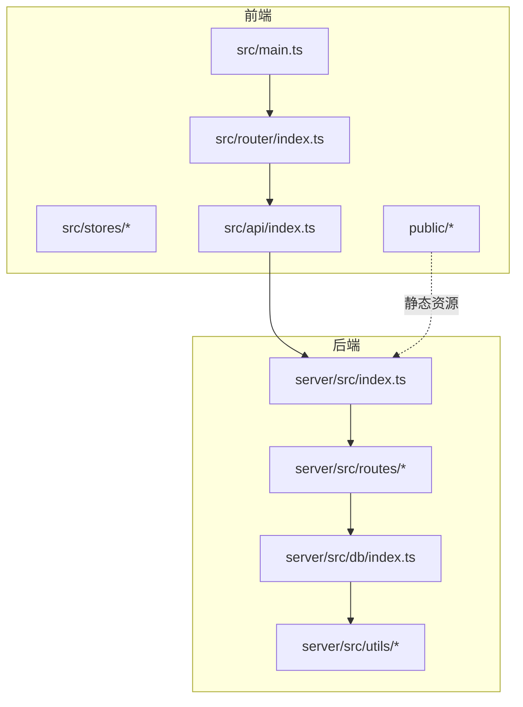
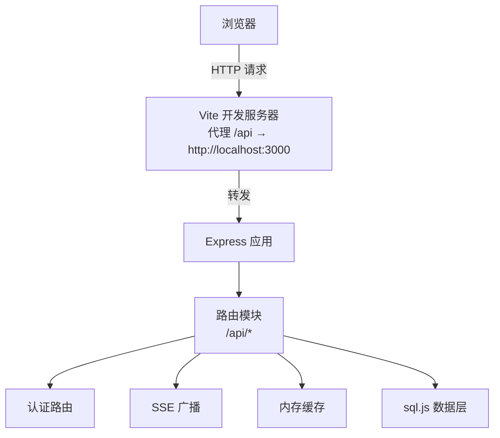
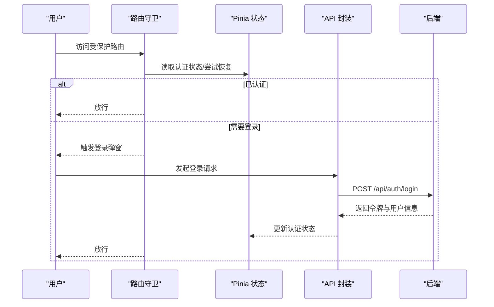
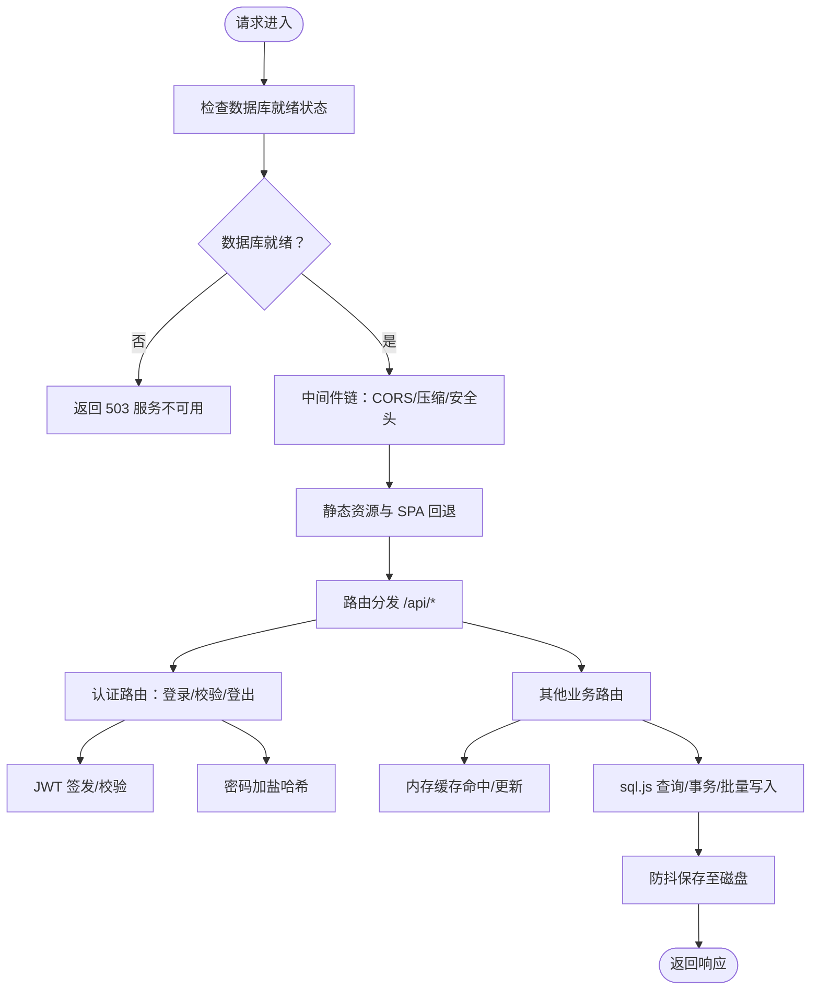
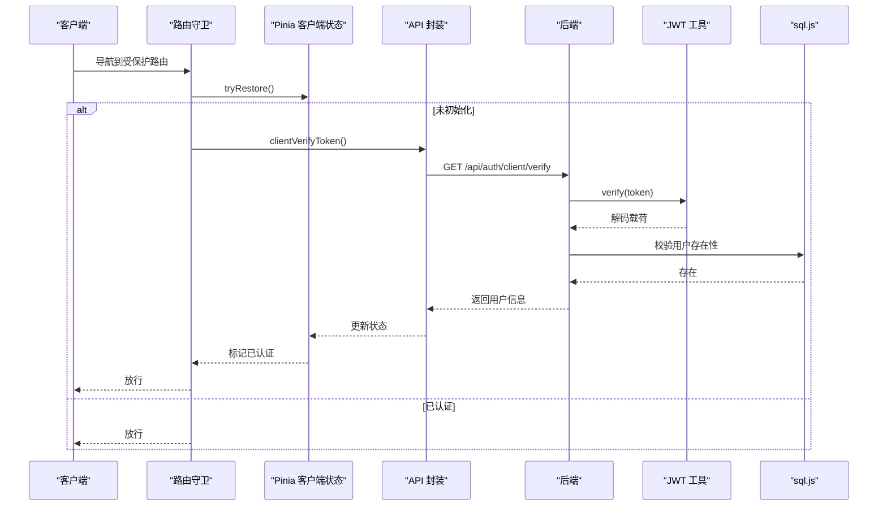
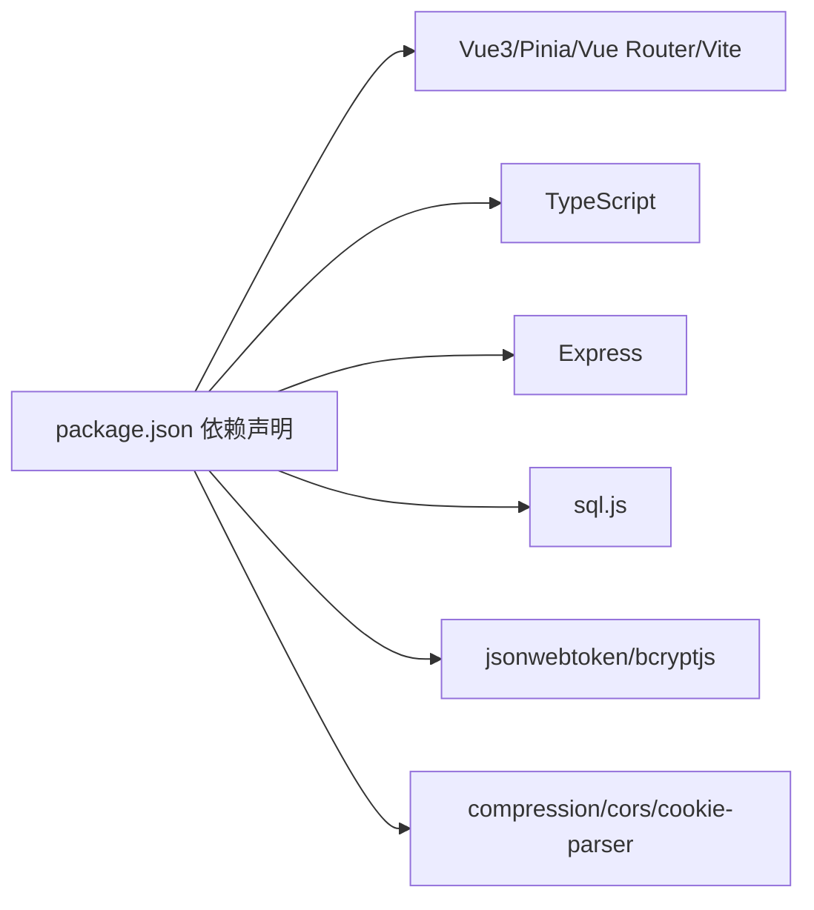

# 技术栈

<cite>
**本文引用的文件**
- [package.json](file://package.json)
- [vite.config.ts](file://vite.config.ts)
- [src/main.ts](file://src/main.ts)
- [src/router/index.ts](file://src/router/index.ts)
- [src/stores/auth.ts](file://src/stores/auth.ts)
- [src/stores/clientAuth.ts](file://src/stores/clientAuth.ts)
- [src/api/index.ts](file://src/api/index.ts)
- [server/src/index.ts](file://server/src/index.ts)
- [server/src/utils/jwt.ts](file://server/src/utils/jwt.ts)
- [server/src/db/index.ts](file://server/src/db/index.ts)
- [server/src/route/auth.ts](file://server/src/routes/auth.ts)
- [server/src/utils/cache.ts](file://server/src/utils/cache.ts)
- [server/src/utils/sse.ts](file://server/src/utils/sse.ts)
- [server/src/types/sql.js.d.ts](file://server/src/types/sql.js.d.ts)
- [tsconfig.json](file://tsconfig.json)
</cite>

## 目录
1. [引言](#引言)
2. [项目结构](#项目结构)
3. [核心组件](#核心组件)
4. [架构总览](#架构总览)
5. [详细组件分析](#详细组件分析)
6. [依赖关系分析](#依赖关系分析)
7. [性能考量](#性能考量)
8. [故障排查指南](#故障排查指南)
9. [结论](#结论)
10. [附录](#附录)

## 引言
本技术栈文档围绕 RLRMS 餐厅管理系统，系统性梳理前端与后端技术选型与实现要点。前端采用 Vue3 + TypeScript + Pinia + Vue Router + Vite，强调类型安全、状态管理与构建优化；后端采用 Express + sql.js + JWT + bcryptjs，强调轻量化嵌入式数据库与认证安全。文档同时提供对比分析、版本兼容性与升级建议，并兼顾初学者与资深开发者的需求。

## 项目结构
项目采用“前后端同仓库”的一体化组织方式：
- 前端位于根目录的 src 与 public，使用 Vite 构建，包含路由、状态管理、API 封装与视图组件。
- 后端位于 server/src，采用 Express 提供 REST API，内置 sql.js 实现嵌入式数据库，配合中间件与路由模块化组织。
- 配置文件集中于根目录，包含包管理、构建配置、类型引用与脚本命令。

图表来源
- [src/main.ts:1-37](file://src/main.ts#L1-L37)
- [src/router/index.ts:1-317](file://src/router/index.ts#L1-L317)
- [src/api/index.ts:1-608](file://src/api/index.ts#L1-L608)
- [server/src/index.ts:1-171](file://server/src/index.ts#L1-L171)
- [server/src/db/index.ts:1-156](file://server/src/db/index.ts#L1-L156)

章节来源
- [package.json:1-64](file://package.json#L1-L64)
- [vite.config.ts:1-112](file://vite.config.ts#L1-L112)
- [tsconfig.json:1-8](file://tsconfig.json#L1-L8)

## 核心组件
- 前端核心：应用入口、路由与导航守卫、Pinia 状态管理、API 封装与缓存、构建与代理配置。
- 后端核心：应用工厂与中间件、路由模块、sql.js 数据层、JWT 工具、缓存与 SSE 工具。

章节来源
- [src/main.ts:1-37](file://src/main.ts#L1-L37)
- [src/router/index.ts:1-317](file://src/router/index.ts#L1-L317)
- [src/stores/auth.ts:1-128](file://src/stores/auth.ts#L1-L128)
- [src/stores/clientAuth.ts:1-87](file://src/stores/clientAuth.ts#L1-L87)
- [src/api/index.ts:1-608](file://src/api/index.ts#L1-L608)
- [server/src/index.ts:1-171](file://server/src/index.ts#L1-L171)
- [server/src/db/index.ts:1-156](file://server/src/db/index.ts#L1-L156)
- [server/src/utils/jwt.ts:1-27](file://server/src/utils/jwt.ts#L1-L27)
- [server/src/utils/cache.ts:1-73](file://server/src/utils/cache.ts#L1-L73)
- [server/src/utils/sse.ts:1-59](file://server/src/utils/sse.ts#L1-L59)

## 架构总览
系统采用“前端 SPA + Express 后端”的经典分离架构，前端通过 /api 前缀调用后端接口，静态资源由后端统一托管。后端使用 sql.js 将 SQLite 以 WASM 方式嵌入 Node.js，实现零外部依赖的本地数据库方案。

图表来源
- [vite.config.ts:48-61](file://vite.config.ts#L48-L61)
- [server/src/index.ts:87-119](file://server/src/index.ts#L87-L119)
- [server/src/routes/auth.ts:62-144](file://server/src/routes/auth.ts#L62-L144)
- [server/src/utils/sse.ts:1-59](file://server/src/utils/sse.ts#L1-L59)
- [server/src/utils/cache.ts:1-73](file://server/src/utils/cache.ts#L1-L73)
- [server/src/db/index.ts:1-156](file://server/src/db/index.ts#L1-L156)

## 详细组件分析

### 前端技术栈与实现要点
- Vue3 + TypeScript：提供强类型与组合式 API，提升开发效率与可维护性。
- Pinia：集中式状态管理，支持服务端渲染友好与模块化拆分。
- Vue Router：支持路由懒加载、导航守卫与预取策略，优化首屏与交互体验。
- Vite：快速开发与构建，内置插件体系与智能依赖预构建。
- API 层：统一封装 fetch、超时与 401 处理、内存缓存与取消能力。

图表来源
- [src/router/index.ts:201-277](file://src/router/index.ts#L201-L277)
- [src/stores/auth.ts:15-127](file://src/stores/auth.ts#L15-L127)
- [src/api/index.ts:245-268](file://src/api/index.ts#L245-L268)
- [server/src/routes/auth.ts:64-144](file://server/src/routes/auth.ts#L64-L144)

章节来源
- [src/main.ts:1-37](file://src/main.ts#L1-L37)
- [src/router/index.ts:1-317](file://src/router/index.ts#L1-L317)
- [src/stores/auth.ts:1-128](file://src/stores/auth.ts#L1-L128)
- [src/stores/clientAuth.ts:1-87](file://src/stores/clientAuth.ts#L1-L87)
- [src/api/index.ts:1-608](file://src/api/index.ts#L1-L608)
- [vite.config.ts:1-112](file://vite.config.ts#L1-L112)

### 后端技术栈与实现要点
- Express：简洁灵活的 Web 框架，结合中间件实现安全头、CORS、压缩与静态资源托管。
- sql.js：WASM 驱动的 SQLite，零安装、跨平台，适合小型到中型业务场景。
- JWT + bcryptjs：令牌签发与校验、密码加密存储，配合 Cookie 安全传输。
- SSE：事件推送，用于实时通知与广播。
- 缓存：TTL 内存缓存，降低重复查询成本。

图表来源
- [server/src/index.ts:33-142](file://server/src/index.ts#L33-L142)
- [server/src/routes/auth.ts:62-405](file://server/src/routes/auth.ts#L62-L405)
- [server/src/utils/jwt.ts:1-27](file://server/src/utils/jwt.ts#L1-L27)
- [server/src/db/index.ts:1-156](file://server/src/db/index.ts#L1-L156)
- [server/src/utils/cache.ts:1-73](file://server/src/utils/cache.ts#L1-L73)

章节来源
- [server/src/index.ts:1-171](file://server/src/index.ts#L1-L171)
- [server/src/utils/jwt.ts:1-27](file://server/src/utils/jwt.ts#L1-L27)
- [server/src/db/index.ts:1-156](file://server/src/db/index.ts#L1-L156)
- [server/src/utils/cache.ts:1-73](file://server/src/utils/cache.ts#L1-L73)
- [server/src/utils/sse.ts:1-59](file://server/src/utils/sse.ts#L1-L59)
- [server/src/types/sql.js.d.ts:1-24](file://server/src/types/sql.js.d.ts#L1-L24)

### 关键流程：登录与会话保持
- 前端：路由守卫拦截受保护路由，尝试恢复客户端/管理员会话，必要时弹出登录框。
- 后端：登录接口进行速率限制、密码校验与 JWT 签发，设置 HttpOnly Cookie。
- 会话保持：前端定时校验令牌有效性，接近过期时提示续期。

图表来源
- [src/router/index.ts:201-277](file://src/router/index.ts#L201-L277)
- [src/stores/clientAuth.ts:38-54](file://src/stores/clientAuth.ts#L38-L54)
- [src/api/index.ts:278-286](file://src/api/index.ts#L278-L286)
- [server/src/routes/auth.ts:307-344](file://server/src/routes/auth.ts#L307-L344)
- [server/src/utils/jwt.ts:1-27](file://server/src/utils/jwt.ts#L1-L27)
- [server/src/db/index.ts:100-147](file://server/src/db/index.ts#L100-L147)

章节来源
- [src/router/index.ts:1-317](file://src/router/index.ts#L1-L317)
- [src/stores/clientAuth.ts:1-87](file://src/stores/clientAuth.ts#L1-L87)
- [src/api/index.ts:1-608](file://src/api/index.ts#L1-L608)
- [server/src/routes/auth.ts:1-405](file://server/src/routes/auth.ts#L1-L405)
- [server/src/utils/jwt.ts:1-27](file://server/src/utils/jwt.ts#L1-L27)
- [server/src/db/index.ts:1-156](file://server/src/db/index.ts#L1-L156)

## 依赖关系分析
- 前端依赖：Vue3、Vue Router、Pinia、TypeScript、Vite 及生态插件；构建时通过 optimizeDeps 预构建常用依赖，减少冷启动时间。
- 后端依赖：Express、sql.js、bcryptjs、jsonwebtoken、cookie-parser、cors、compression 等；数据库初始化与持久化由 sql.js 与文件系统协作完成。
- 版本与兼容：根目录 tsconfig.json 采用多引用配置，分别约束应用与 Node 端编译上下文。

图表来源
- [package.json:16-41](file://package.json#L16-L41)
- [tsconfig.json:1-8](file://tsconfig.json#L1-L8)

章节来源
- [package.json:1-64](file://package.json#L1-L64)
- [tsconfig.json:1-8](file://tsconfig.json#L1-L8)

## 性能考量
- 前端构建优化：Vite 通过 esbuild 压缩、手动分包策略（vendor 与 vendor-icons）、按扩展名命名资源、CSS 分割与按需移除 console，降低首屏体积与加载时间。
- 数据库写入优化：sql.js 写入采用防抖合并保存，批量操作使用 beginBatch/endBatch，显著降低磁盘 IO。
- 缓存策略：内存 TTL 缓存与前端内存缓存（stale-while-revalidate）双层缓存，减少重复请求与后端压力。
- 网络与安全：Express 启用压缩与安全响应头，SSE 不参与压缩以保证实时性；登录接口具备 IP 限流与速率控制。

章节来源
- [vite.config.ts:63-112](file://vite.config.ts#L63-L112)
- [server/src/db/index.ts:36-73](file://server/src/db/index.ts#L36-L73)
- [server/src/utils/cache.ts:1-73](file://server/src/utils/cache.ts#L1-L73)
- [server/src/index.ts:44-66](file://server/src/index.ts#L44-L66)
- [server/src/routes/auth.ts:19-55](file://server/src/routes/auth.ts#L19-L55)

## 故障排查指南
- 401 未授权：前端在请求 401 时触发全局“auth:expired”事件，建议检查 Cookie 是否携带、令牌是否过期、后端 verify 接口是否正常。
- 数据库未就绪：后端在初始化期间对非健康检查路径返回 503，等待数据库初始化完成或检查初始化日志。
- SSE 无法实时：确认响应头 Content-Type 包含 text/event-stream，且未被压缩；检查客户端连接是否被意外关闭。
- 密码错误/登录失败：核对 bcrypt 加密强度、盐值生成与 JWT 密钥一致性；生产环境务必设置 JWT_SECRET。

章节来源
- [src/api/index.ts:94-114](file://src/api/index.ts#L94-L114)
- [server/src/index.ts:68-78](file://server/src/index.ts#L68-L78)
- [server/src/utils/sse.ts:37-51](file://server/src/utils/sse.ts#L37-L51)
- [server/src/routes/auth.ts:140-144](file://server/src/routes/auth.ts#L140-L144)
- [server/src/utils/jwt.ts:24-26](file://server/src/utils/jwt.ts#L24-L26)

## 结论
本项目在技术选型上实现了“轻量、易部署、可维护”的平衡：前端以现代工程化工具链保障开发体验与性能；后端以 Express + sql.js 构建低门槛的嵌入式数据库方案，结合 JWT 与 bcryptjs 提升安全性。通过合理的缓存与网络优化策略，系统在中小规模业务场景下具备良好的扩展性与稳定性。

## 附录

### 技术选型对比与建议
- Vue3 vs React：学习曲线更平滑、组合式 API 更契合复杂状态管理；React 生态更成熟，但本项目已稳定使用 Vue3 生态。
- Pinia vs Redux：Pinia 更贴近 Vue 设计哲学，API 更简洁；Redux 在大型复杂应用中具备更强的可观测性与中间件生态。
- Vite vs Webpack：Vite 开发体验更佳、冷启动更快；Webpack 生态更广，但 Vite 已能满足本项目的构建需求。
- Express vs Koa/Nest：Express 足够满足当前体量，路由清晰、中间件丰富；Nest 提供更好的架构约束，但会增加学习成本。
- sql.js vs MySQL/PostgreSQL：sql.js 适合小型到中型应用与演示环境，零依赖、易迁移；生产高并发场景建议迁移到传统数据库。

### 版本兼容性与升级路径
- Node.js 与 Express：建议锁定 LTS 版本，关注 Express 未来大版本变更（如 5.x）对中间件签名的影响。
- Vue3 + Vite：关注 Vite 与 @vitejs/plugin-vue 的兼容性；升级时优先测试别名解析与插件生态。
- TypeScript：遵循语义化版本，逐步升级至更高主版本，注意严格模式与类型断言的变化。
- sql.js：关注 WASM 性能与内存占用变化；如业务增长，评估迁移至传统数据库。
- JWT 与 bcryptjs：保持密钥轮换策略，生产环境必须设置 JWT_SECRET；bcrypt 参数可根据硬件能力调整。