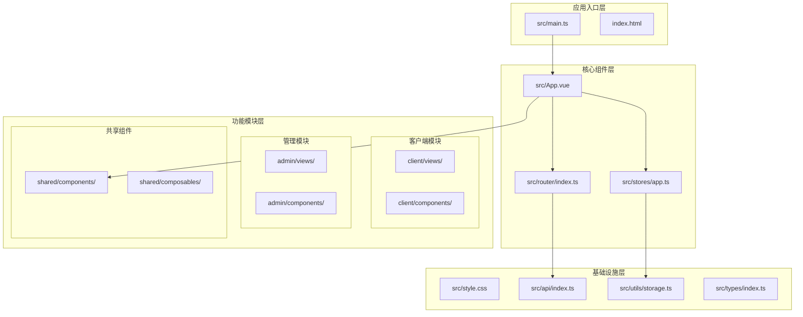
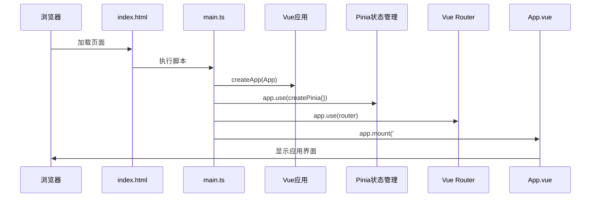
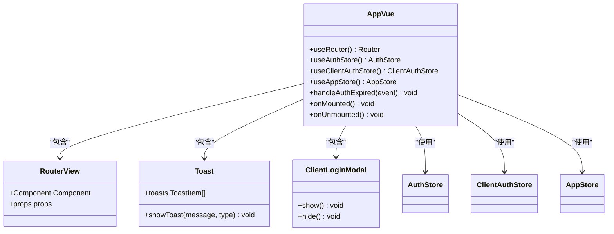
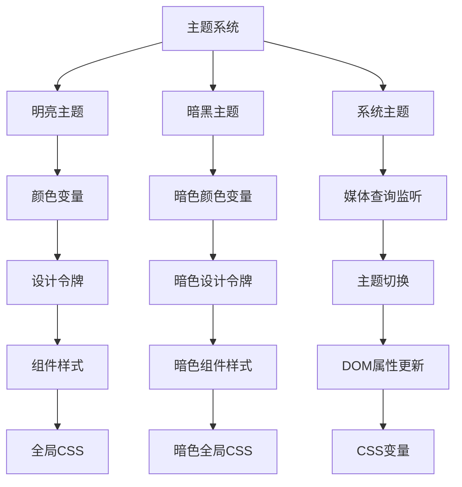
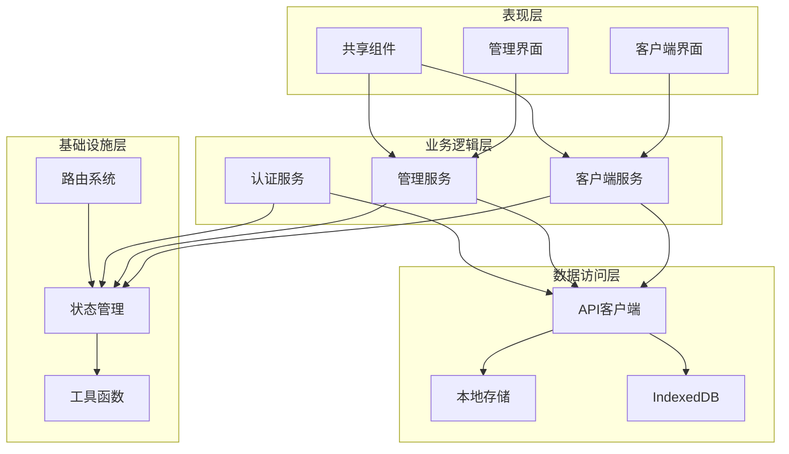
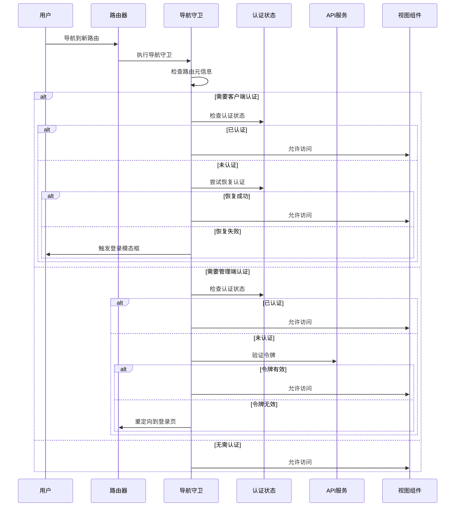
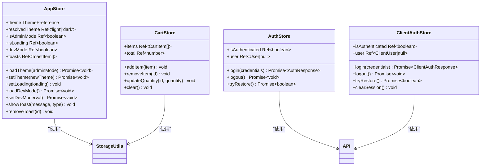
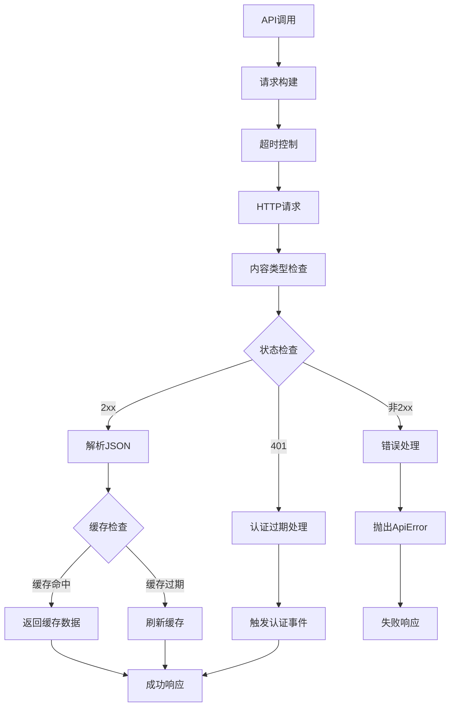
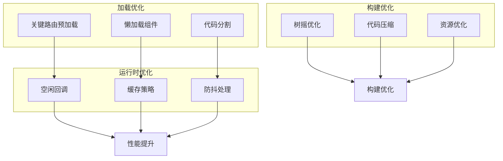
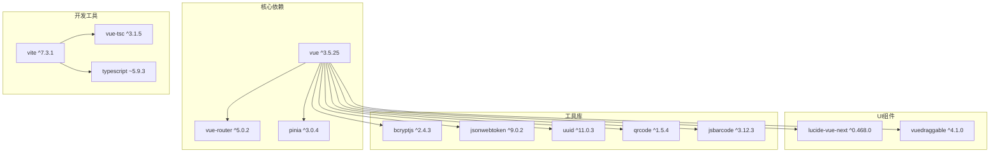

# Vue应用结构

<cite>
**本文档引用的文件**
- [main.ts](file://src/main.ts)
- [App.vue](file://src/App.vue)
- [router/index.ts](file://src/router/index.ts)
- [stores/app.ts](file://src/stores/app.ts)
- [style.css](file://src/style.css)
- [api/index.ts](file://src/api/index.ts)
- [vite.config.ts](file://vite.config.ts)
- [index.html](file://index.html)
- [types/index.ts](file://src/types/index.ts)
- [utils/storage.ts](file://src/utils/storage.ts)
- [shared/components/Toast.vue](file://src/shared/components/Toast.vue)
- [package.json](file://package.json)
</cite>

## 目录
1. [简介](#简介)
2. [项目结构](#项目结构)
3. [核心组件](#核心组件)
4. [架构概览](#架构概览)
5. [详细组件分析](#详细组件分析)
6. [依赖关系分析](#依赖关系分析)
7. [性能考虑](#性能考虑)
8. [故障排除指南](#故障排除指南)
9. [结论](#结论)

## 简介

RLRMS餐厅管理系统是一个基于Vue 3的现代化餐厅管理应用，采用前后端分离架构设计。该应用提供了完整的餐厅运营管理功能，包括客户点餐系统、后台管理面板、实时订单处理等核心业务模块。

应用采用Vue 3 Composition API和TypeScript实现，结合Pinia状态管理和Vue Router路由系统，构建了一个高性能、可维护的单页应用(SPA)。通过精心设计的组件层次结构和全局样式管理，为用户提供流畅的交互体验。

## 项目结构

应用采用模块化的文件组织方式，按照功能域进行分层：

**图表来源**
- [main.ts:1-37](file://src/main.ts#L1-L37)
- [App.vue:1-113](file://src/App.vue#L1-L113)
- [router/index.ts:1-317](file://src/router/index.ts#L1-L317)

**章节来源**
- [main.ts:1-37](file://src/main.ts#L1-L37)
- [index.html:1-79](file://index.html#L1-L79)

## 核心组件

### 应用入口配置

应用入口配置遵循标准的Vue 3应用初始化流程，确保插件和服务的正确注册顺序：

**图表来源**
- [main.ts:7-12](file://src/main.ts#L7-L12)

应用初始化的关键步骤包括：
1. **创建Vue实例**：使用`createApp(App)`创建根组件实例
2. **注册Pinia插件**：提供全局状态管理能力
3. **注册路由插件**：配置客户端和管理端路由系统
4. **挂载应用**：将应用渲染到DOM中

**章节来源**
- [main.ts:1-37](file://src/main.ts#L1-L37)

### 根组件设计理念

App.vue作为应用的根组件，采用了简洁而强大的设计理念：

**图表来源**
- [App.vue:1-48](file://src/App.vue#L1-L48)

根组件的核心特性：
- **统一认证处理**：集中处理401会话过期事件
- **双模式支持**：同时支持客户端和管理端功能
- **全局状态管理**：集成Toast通知系统
- **响应式主题切换**：支持明暗主题模式

**章节来源**
- [App.vue:1-113](file://src/App.vue#L1-L113)

### 全局样式管理

应用采用CSS变量驱动的设计系统，实现了完整的主题体系：

**图表来源**
- [style.css:1-800](file://src/style.css#L1-L800)
- [stores/app.ts:14-53](file://src/stores/app.ts#L14-L53)

**章节来源**
- [style.css:1-800](file://src/style.css#L1-L800)
- [stores/app.ts:14-53](file://src/stores/app.ts#L14-L53)

## 架构概览

应用采用分层架构设计，各层职责明确，耦合度低：

**图表来源**
- [router/index.ts:178-187](file://src/router/index.ts#L178-L187)
- [api/index.ts:128-608](file://src/api/index.ts#L128-L608)

## 详细组件分析

### 路由系统分析

应用的路由系统采用模块化设计，支持客户端和管理端双模式：

**图表来源**
- [router/index.ts:201-277](file://src/router/index.ts#L201-L277)

路由系统的关键特性：
- **异步组件加载**：使用动态导入实现代码分割
- **导航守卫**：统一处理认证和权限控制
- **预加载机制**：提升用户体验的性能优化
- **滚动行为**：智能的页面滚动管理

**章节来源**
- [router/index.ts:19-40](file://src/router/index.ts#L19-L40)
- [router/index.ts:283-314](file://src/router/index.ts#L283-L314)

### 状态管理系统

应用采用Pinia作为状态管理解决方案，提供了类型安全的状态管理：

**图表来源**
- [stores/app.ts:14-121](file://src/stores/app.ts#L14-L121)

状态管理的核心功能：
- **主题持久化**：支持用户偏好的主题设置
- **全局通知**：统一的Toast通知系统
- **开发模式**：调试工具的全局开关
- **响应式设计**：自动适配系统主题变化

**章节来源**
- [stores/app.ts:14-121](file://src/stores/app.ts#L14-L121)

### API客户端设计

应用的API客户端实现了完整的请求处理机制：

**图表来源**
- [api/index.ts:54-114](file://src/api/index.ts#L54-L114)

API客户端的关键特性：
- **缓存策略**：stale-while-revalidate缓存机制
- **超时控制**：统一的请求超时管理
- **错误处理**：标准化的错误响应格式
- **认证集成**：自动处理401认证过期

**章节来源**
- [api/index.ts:54-114](file://src/api/index.ts#L54-L114)

### 性能优化策略

应用实施了多层次的性能优化策略：

**图表来源**
- [router/index.ts:23-40](file://src/router/index.ts#L23-L40)
- [vite.config.ts:63-112](file://vite.config.ts#L63-L112)

**章节来源**
- [router/index.ts:23-40](file://src/router/index.ts#L23-L40)
- [vite.config.ts:63-112](file://vite.config.ts#L63-L112)

## 依赖关系分析

应用的依赖关系清晰明确，遵循单一职责原则：

**图表来源**
- [package.json:16-41](file://package.json#L16-L41)
- [package.json:42-62](file://package.json#L42-L62)

**章节来源**
- [package.json:16-62](file://package.json#L16-L62)

## 性能考虑

应用在多个层面实施了性能优化策略：

### 预加载机制
- **关键路由预加载**：在应用初始化后空闲时预加载首页和管理首页组件
- **导航后预取**：根据用户行为预测可能访问的页面并进行预加载
- **空闲回调优化**：使用`requestIdleCallback`确保不阻塞主线程

### 缓存策略
- **前端缓存**：stale-while-revalidate策略，提供即时响应和后台刷新
- **主题持久化**：使用IndexedDB存储用户偏好设置
- **API缓存**：针对频繁访问的数据建立缓存层

### 代码分割
- **按需加载**：使用动态导入实现组件级别的代码分割
- **手动分块**：通过Vite配置实现自定义的代码分块策略
- **第三方库优化**：将常用依赖单独打包以便缓存

### 构建优化
- **Tree Shaking**：消除未使用的代码
- **代码压缩**：生产环境启用代码压缩
- **资源优化**：图片、字体等静态资源的优化处理

## 故障排除指南

### 常见问题诊断

**应用无法正常启动**
1. 检查浏览器控制台是否有JavaScript错误
2. 确认网络连接是否正常
3. 验证API服务器是否可用

**路由跳转异常**
1. 检查路由配置是否正确
2. 验证导航守卫逻辑
3. 确认认证状态是否正确

**主题切换失效**
1. 检查CSS变量是否正确设置
2. 验证系统主题监听器
3. 确认localStorage权限

**性能问题排查**
1. 使用浏览器性能分析工具
2. 检查网络请求时间
3. 分析内存使用情况

### 调试工具

应用提供了完善的调试工具：
- **开发模式开关**：通过全局状态管理启用调试功能
- **日志过滤**：生产环境自动移除不必要的console.log
- **错误边界**：统一的错误处理和报告机制

**章节来源**
- [stores/app.ts:62-72](file://src/stores/app.ts#L62-L72)
- [vite.config.ts:9-25](file://vite.config.ts#L9-L25)

## 结论

RLRMS餐厅管理系统展现了现代Vue应用的最佳实践，通过合理的架构设计和丰富的功能实现，为餐厅管理提供了完整的数字化解决方案。

应用的主要优势包括：
- **模块化设计**：清晰的功能分层和组件组织
- **性能优化**：多维度的性能优化策略
- **用户体验**：流畅的交互和响应式设计
- **可维护性**：类型安全的代码和完善的测试覆盖

未来可以进一步优化的方向：
- 增强离线功能支持
- 扩展移动端适配
- 完善单元测试覆盖率
- 优化SEO和可访问性