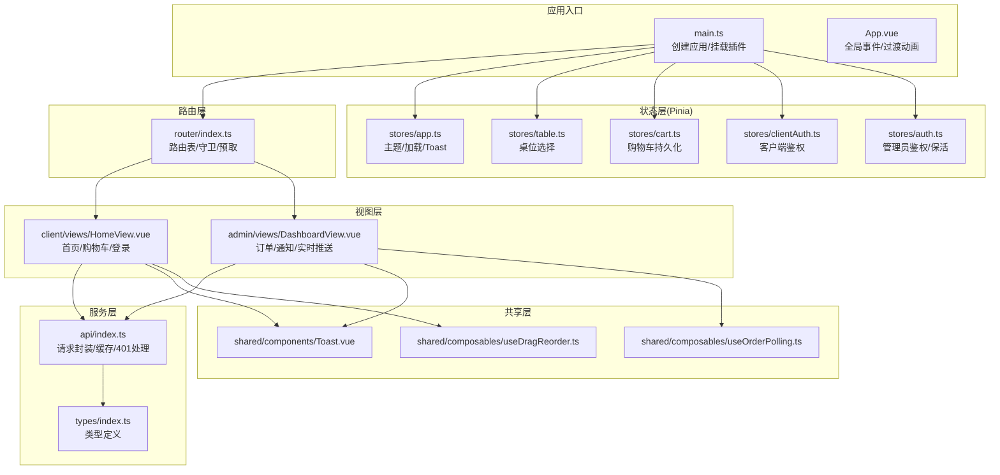
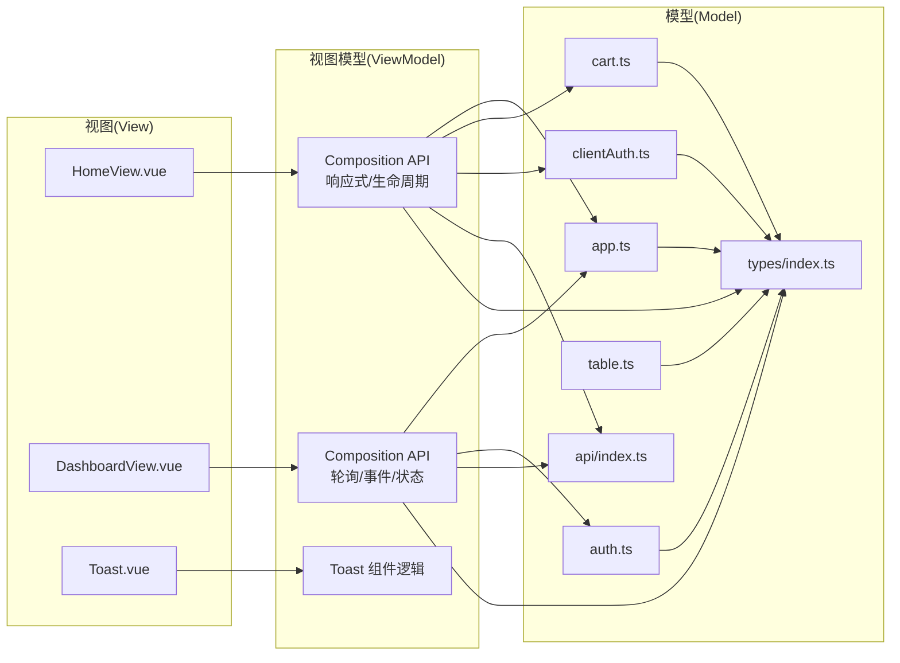
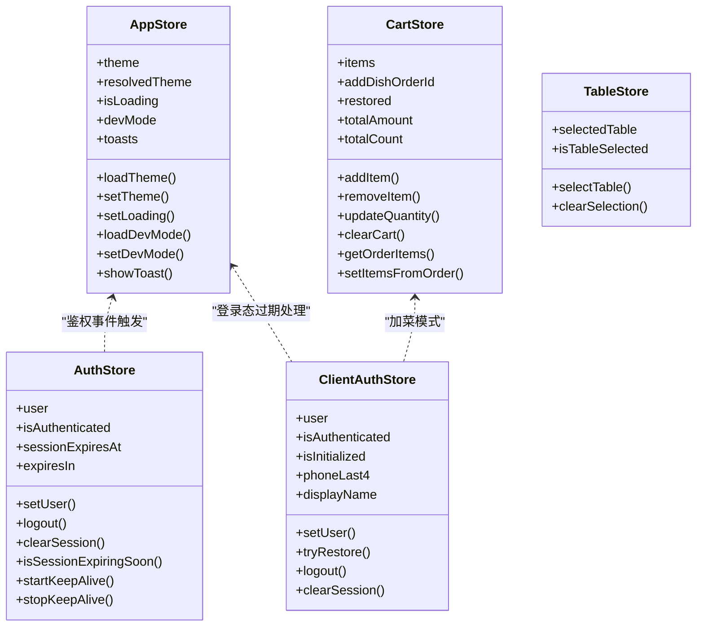
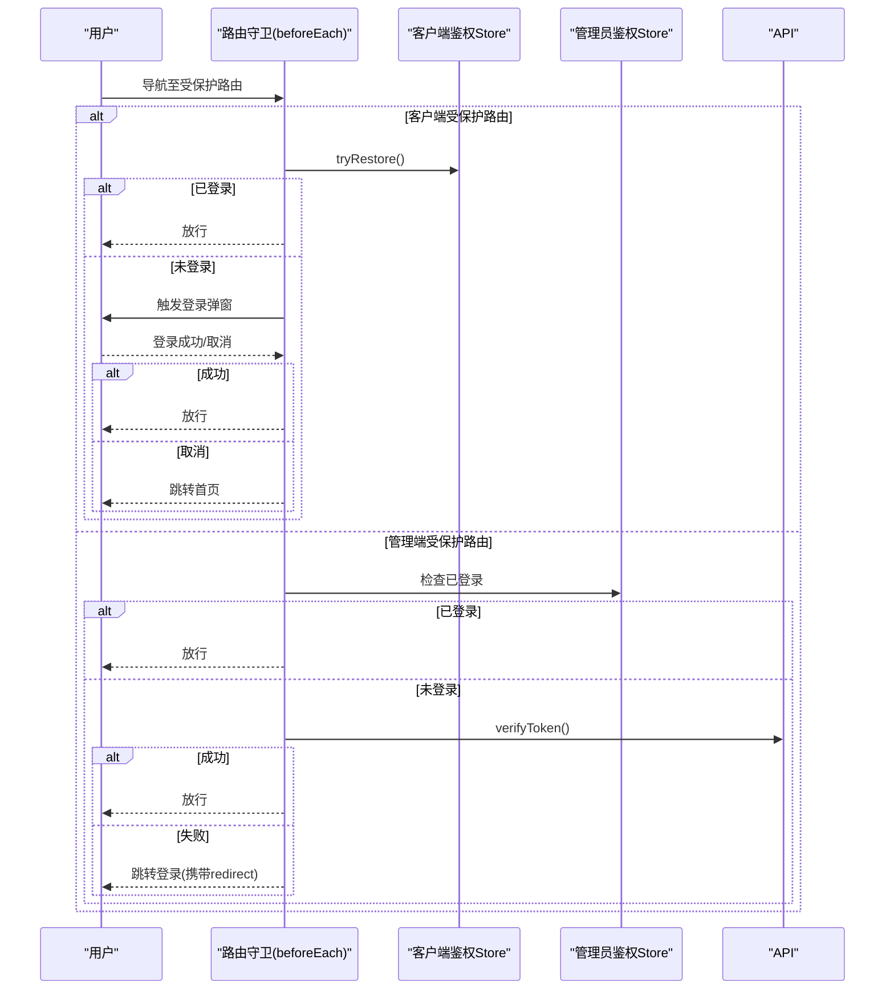
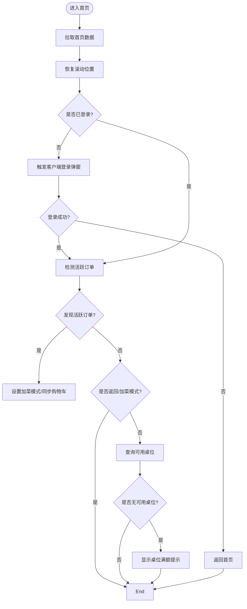
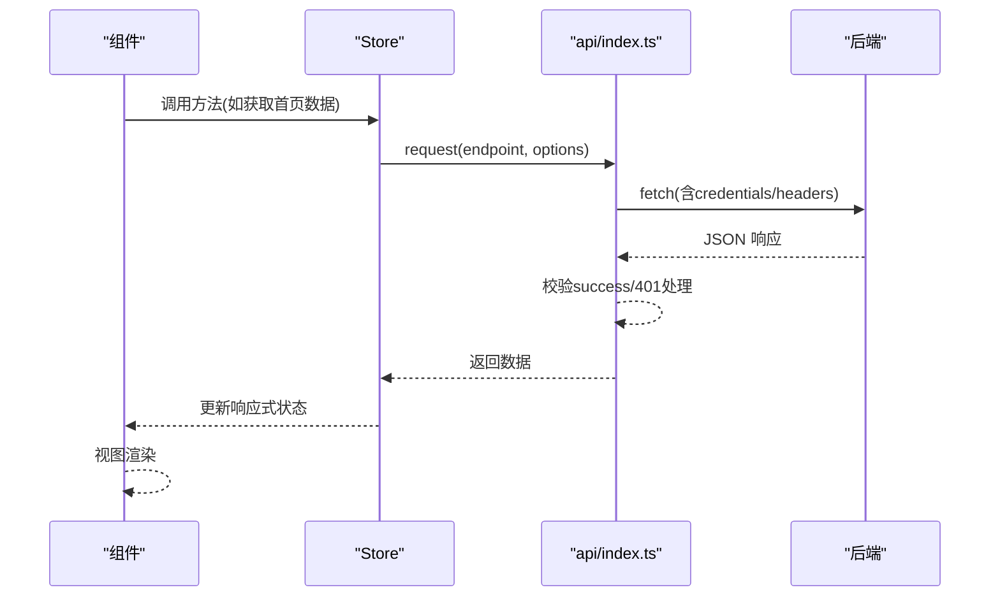
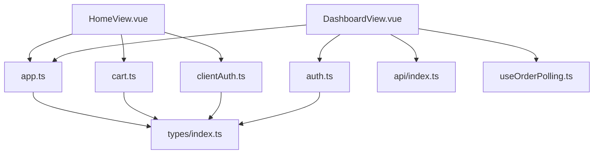

# 前端架构设计

<cite>
**本文引用的文件**
- [main.ts](file://src/main.ts)
- [App.vue](file://src/App.vue)
- [router/index.ts](file://src/router/index.ts)
- [stores/app.ts](file://src/stores/app.ts)
- [stores/auth.ts](file://src/stores/auth.ts)
- [stores/cart.ts](file://src/stores/cart.ts)
- [stores/clientAuth.ts](file://src/stores/clientAuth.ts)
- [stores/table.ts](file://src/stores/table.ts)
- [shared/composables/useOrderPolling.ts](file://src/shared/composables/useOrderPolling.ts)
- [shared/composables/useDragReorder.ts](file://src/shared/composables/useDragReorder.ts)
- [admin/views/DashboardView.vue](file://src/admin/views/DashboardView.vue)
- [client/views/HomeView.vue](file://src/client/views/HomeView.vue)
- [shared/components/Toast.vue](file://src/shared/components/Toast.vue)
- [api/index.ts](file://src/api/index.ts)
- [types/index.ts](file://src/types/index.ts)
</cite>

## 目录
1. [引言](#引言)
2. [项目结构](#项目结构)
3. [核心组件](#核心组件)
4. [架构总览](#架构总览)
5. [详细组件分析](#详细组件分析)
6. [依赖关系分析](#依赖关系分析)
7. [性能考量](#性能考量)
8. [故障排查指南](#故障排查指南)
9. [结论](#结论)
10. [附录](#附录)

## 引言
本设计文档面向 RLRMS 餐厅管理系统前端，聚焦于 Vue3 Composition API 的应用、MVVM 架构模式的落地、Pinia 状态管理的设计与组织、Vue Router 的路由策略与导航控制，以及前端数据流与状态流转机制。文档旨在帮助开发者快速理解系统架构、掌握关键实现细节，并提供可操作的优化建议与排障指引。

## 项目结构
前端采用基于功能域的分层组织方式：
- 应用入口与根组件：应用初始化、全局事件、路由与状态挂载
- 路由层：按客户前台与管理后台划分路由表，统一守卫与预取策略
- 状态层：Pinia Store 按业务域拆分，职责清晰、边界明确
- 视图层：按功能域划分视图，组件内使用 Composition API 管理响应式数据与生命周期
- 共享层：通用组合式函数与组件，提升复用性与一致性
- API 层：统一请求封装、缓存策略与错误处理
- 类型层：集中定义前后端交互数据模型

图表来源
- [main.ts:1-37](file://src/main.ts#L1-L37)
- [App.vue:1-113](file://src/App.vue#L1-L113)
- [router/index.ts:1-317](file://src/router/index.ts#L1-L317)
- [stores/app.ts:1-122](file://src/stores/app.ts#L1-L122)
- [stores/table.ts:1-25](file://src/stores/table.ts#L1-L25)
- [stores/cart.ts:1-183](file://src/stores/cart.ts#L1-L183)
- [stores/clientAuth.ts:1-87](file://src/stores/clientAuth.ts#L1-L87)
- [stores/auth.ts:1-128](file://src/stores/auth.ts#L1-L128)
- [client/views/HomeView.vue:1-893](file://src/client/views/HomeView.vue#L1-L893)
- [admin/views/DashboardView.vue:1-1452](file://src/admin/views/DashboardView.vue#L1-L1452)
- [shared/components/Toast.vue:1-138](file://src/shared/components/Toast.vue#L1-L138)
- [shared/composables/useOrderPolling.ts:1-74](file://src/shared/composables/useOrderPolling.ts#L1-L74)
- [shared/composables/useDragReorder.ts:1-109](file://src/shared/composables/useDragReorder.ts#L1-L109)
- [api/index.ts:1-608](file://src/api/index.ts#L1-L608)
- [types/index.ts:1-133](file://src/types/index.ts#L1-L133)

章节来源
- [main.ts:1-37](file://src/main.ts#L1-L37)
- [router/index.ts:1-317](file://src/router/index.ts#L1-L317)

## 核心组件
- 应用入口与挂载
  - 创建应用实例，注册 Pinia 与 Vue Router 插件，全局禁用输入拼写检查，应用挂载后派发“应用已挂载”事件，触发关键路由预加载
- 根组件与全局事件
  - 监听“会话过期”自定义事件，区分管理端与客户端路径，执行相应清理与跳转逻辑；统一渲染 RouterView 与全局 Toast、客户端登录弹窗
- 路由与导航
  - 客户端路由与管理端路由分离，统一设置文档标题；前置守卫处理鉴权与登录态恢复；后置守卫进行相关页面预取
- 状态管理
  - 主题与加载态、Toast 队列、调试模式等通用状态；客户端与管理员双套鉴权状态；购物车持久化与订单项转换；桌位选择状态
- 视图与交互
  - 首页聚合菜品与分类、购物车、登录态校验与桌位提示；管理后台仪表盘实时订单推送与状态变更
- 共享能力
  - 订单轮询组合式函数，支持可见性切换与降级策略；拖拽排序组合式函数，支持保存阶段的防抖与错误处理
- API 与类型
  - 统一请求封装、缓存策略、超时与信号合并、401 全局处理；集中类型定义，保障前后端契约一致

章节来源
- [main.ts:1-37](file://src/main.ts#L1-L37)
- [App.vue:1-113](file://src/App.vue#L1-L113)
- [router/index.ts:1-317](file://src/router/index.ts#L1-L317)
- [stores/app.ts:1-122](file://src/stores/app.ts#L1-L122)
- [stores/cart.ts:1-183](file://src/stores/cart.ts#L1-L183)
- [stores/clientAuth.ts:1-87](file://src/stores/clientAuth.ts#L1-L87)
- [stores/auth.ts:1-128](file://src/stores/auth.ts#L1-L128)
- [stores/table.ts:1-25](file://src/stores/table.ts#L1-L25)
- [shared/composables/useOrderPolling.ts:1-74](file://src/shared/composables/useOrderPolling.ts#L1-L74)
- [shared/composables/useDragReorder.ts:1-109](file://src/shared/composables/useDragReorder.ts#L1-L109)
- [api/index.ts:1-608](file://src/api/index.ts#L1-L608)
- [types/index.ts:1-133](file://src/types/index.ts#L1-L133)

## 架构总览
系统遵循 MVVM 架构：
- Model：后端 API 与 Pinia Store 提供的数据模型与状态
- View：Vue 单文件组件，负责渲染与用户交互
- ViewModel：Composition API 与 Store 组合，封装视图所需的响应式状态与行为

图表来源
- [client/views/HomeView.vue:1-893](file://src/client/views/HomeView.vue#L1-L893)
- [admin/views/DashboardView.vue:1-1452](file://src/admin/views/DashboardView.vue#L1-L1452)
- [shared/components/Toast.vue:1-138](file://src/shared/components/Toast.vue#L1-L138)
- [stores/app.ts:1-122](file://src/stores/app.ts#L1-L122)
- [stores/cart.ts:1-183](file://src/stores/cart.ts#L1-L183)
- [stores/clientAuth.ts:1-87](file://src/stores/clientAuth.ts#L1-L87)
- [stores/auth.ts:1-128](file://src/stores/auth.ts#L1-L128)
- [stores/table.ts:1-25](file://src/stores/table.ts#L1-L25)
- [api/index.ts:1-608](file://src/api/index.ts#L1-L608)
- [types/index.ts:1-133](file://src/types/index.ts#L1-L133)

## 详细组件分析

### MVVM 架构实现
- 视图层
  - HomeView 与 DashboardView 通过 Composition API 管理响应式状态（如分类、菜品、订单、轮询状态等），并在生命周期钩子中发起数据拉取与资源清理
- 视图模型层
  - Store 将业务状态与行为抽象为可复用的 Store 函数，提供计算属性与方法，供多个视图共享
- 模型层
  - API 封装统一请求、缓存与错误处理；类型定义确保前后端契约一致

章节来源
- [client/views/HomeView.vue:1-893](file://src/client/views/HomeView.vue#L1-L893)
- [admin/views/DashboardView.vue:1-1452](file://src/admin/views/DashboardView.vue#L1-L1452)
- [stores/app.ts:1-122](file://src/stores/app.ts#L1-L122)
- [stores/cart.ts:1-183](file://src/stores/cart.ts#L1-L183)
- [stores/clientAuth.ts:1-87](file://src/stores/clientAuth.ts#L1-L87)
- [stores/auth.ts:1-128](file://src/stores/auth.ts#L1-L128)
- [api/index.ts:1-608](file://src/api/index.ts#L1-L608)
- [types/index.ts:1-133](file://src/types/index.ts#L1-L133)

### Pinia 状态管理设计
- Store 组织结构
  - app.ts：主题、加载态、Toast、调试模式等跨域状态
  - auth.ts：管理员鉴权、会话保活、过期检测
  - clientAuth.ts：客户端用户态、登录态恢复、登出
  - cart.ts：购物车数据、持久化、订单项转换、防抖保存
  - table.ts：桌位选择状态
- 状态共享机制
  - 通过 defineStore 定义的 Store 实例在组件中以组合式函数形式调用，实现跨组件共享与响应式联动
- 异步操作处理
  - 鉴权保活定时器、购物车 IndexedDB 持久化、API 请求封装与缓存策略

图表来源
- [stores/app.ts:1-122](file://src/stores/app.ts#L1-L122)
- [stores/auth.ts:1-128](file://src/stores/auth.ts#L1-L128)
- [stores/clientAuth.ts:1-87](file://src/stores/clientAuth.ts#L1-L87)
- [stores/cart.ts:1-183](file://src/stores/cart.ts#L1-L183)
- [stores/table.ts:1-25](file://src/stores/table.ts#L1-L25)

章节来源
- [stores/app.ts:1-122](file://src/stores/app.ts#L1-L122)
- [stores/auth.ts:1-128](file://src/stores/auth.ts#L1-L128)
- [stores/clientAuth.ts:1-87](file://src/stores/clientAuth.ts#L1-L87)
- [stores/cart.ts:1-183](file://src/stores/cart.ts#L1-L183)
- [stores/table.ts:1-25](file://src/stores/table.ts#L1-L25)

### Vue Router 路由设计
- 路由分层
  - 客户端路由：首页、菜品详情、搜索、订单确认、订单详情、订单二维码、全部订单、设置等
  - 管理端路由：登录、布局、仪表盘、桌位、菜单、订单、库存、用户、设置、调试等
- 路由守卫
  - 文档标题动态设置
  - 客户端受保护路由：鉴权、Cookie 恢复、登录弹窗交互
  - 管理端受保护路由：JWT 校验、自动登录态恢复
- 懒加载与预取
  - 组件懒加载；关键路由预加载；导航后根据目标路由预测并预取相关页面
- 浏览器兼容
  - Edge 浏览器 replaceState 适配

图表来源
- [router/index.ts:201-277](file://src/router/index.ts#L201-L277)
- [stores/clientAuth.ts:38-54](file://src/stores/clientAuth.ts#L38-L54)
- [stores/auth.ts:71-85](file://src/stores/auth.ts#L71-L85)
- [api/index.ts:253-255](file://src/api/index.ts#L253-L255)

章节来源
- [router/index.ts:1-317](file://src/router/index.ts#L1-L317)

### 组件层次结构与状态流转
- 首页组件（HomeView）
  - 响应式数据：分类、菜品、选中分类、加载态、购物车展开态、桌位满额提示等
  - 生命周期：mounted 中拉取数据、恢复滚动位置、登录态校验、活跃订单检测与加菜模式设置；离开前保存滚动位置
  - 交互：菜品点击跳转详情、确认下单、清空购物车、分类侧边栏滚动定位
- 管理后台仪表盘（DashboardView）
  - 响应式数据：统计数据、订单列表、过滤条件、自动刷新开关、新订单计数、SSE 连接状态
  - 生命周期：mounted 中拉取数据、建立 SSE 连接；unmounted 中断开连接
  - 交互：订单状态更新、订单查询、清空已完成/已取消订单、自动刷新开关切换
- 全局 Toast
  - 响应式队列：最多 5 条，逐条定时消失，独立动画

图表来源
- [client/views/HomeView.vue:169-236](file://src/client/views/HomeView.vue#L169-L236)
- [stores/clientAuth.ts:38-54](file://src/stores/clientAuth.ts#L38-L54)
- [stores/cart.ts:89-110](file://src/stores/cart.ts#L89-L110)

章节来源
- [client/views/HomeView.vue:1-893](file://src/client/views/HomeView.vue#L1-L893)
- [admin/views/DashboardView.vue:1-1452](file://src/admin/views/DashboardView.vue#L1-L1452)
- [shared/components/Toast.vue:1-138](file://src/shared/components/Toast.vue#L1-L138)

### 组合式函数与可复用能力
- 订单轮询（useOrderPolling）
  - 功能：周期性拉取订单数量，检测新增订单并触发回调；支持可见性切换自动启停；可提供 shouldPoll 判断是否轮询
  - 适用场景：管理后台仪表盘实时订单监控
- 拖拽重排（useDragReorder）
  - 功能：维护拖拽索引、放置目标、保存状态；生成排序数组并调用 onReorder 回调
  - 适用场景：菜品/分类/库存等排序配置

章节来源
- [shared/composables/useOrderPolling.ts:1-74](file://src/shared/composables/useOrderPolling.ts#L1-L74)
- [shared/composables/useDragReorder.ts:1-109](file://src/shared/composables/useDragReorder.ts#L1-L109)

### API 封装与数据流
- 请求封装
  - 统一基础路径、Content-Type、credentials、超时与信号合并、非 JSON 防御
  - 401 统一处理：触发全局“会话过期”事件，阻止默认错误处理
- 缓存策略
  - 内存缓存（stale-while-revalidate）：命中即刻返回，后台静默刷新
- 错误处理
  - 包装为 ApiError，包含状态码与数据，便于上层展示与分支处理
- 数据流
  - 组件通过 Store 调用 API 方法，Store 将结果写入响应式状态，视图自动更新

图表来源
- [api/index.ts:54-114](file://src/api/index.ts#L54-L114)
- [client/views/HomeView.vue:68-89](file://src/client/views/HomeView.vue#L68-L89)
- [admin/views/DashboardView.vue:144-183](file://src/admin/views/DashboardView.vue#L144-L183)

章节来源
- [api/index.ts:1-608](file://src/api/index.ts#L1-L608)
- [types/index.ts:1-133](file://src/types/index.ts#L1-L133)

## 依赖关系分析
- 组件到 Store
  - HomeView 依赖 app、cart、clientAuth
  - DashboardView 依赖 app、auth、API 与组合式函数
- Store 间耦合
  - app 作为全局状态中心，被多个组件与 Store 使用
  - auth 与 clientAuth 分别服务于管理端与客户端登录态，避免交叉污染
- 外部依赖
  - Vue Router：路由守卫、懒加载、滚动行为
  - Pinia：状态持久化与响应式
  - Web APIs：IndexedDB（购物车持久化）、EventSource（SSE）、AbortController（可取消请求）

图表来源
- [client/views/HomeView.vue:1-893](file://src/client/views/HomeView.vue#L1-L893)
- [admin/views/DashboardView.vue:1-1452](file://src/admin/views/DashboardView.vue#L1-L1452)
- [stores/app.ts:1-122](file://src/stores/app.ts#L1-L122)
- [stores/cart.ts:1-183](file://src/stores/cart.ts#L1-L183)
- [stores/clientAuth.ts:1-87](file://src/stores/clientAuth.ts#L1-L87)
- [stores/auth.ts:1-128](file://src/stores/auth.ts#L1-L128)
- [api/index.ts:1-608](file://src/api/index.ts#L1-L608)
- [types/index.ts:1-133](file://src/types/index.ts#L1-L133)

章节来源
- [client/views/HomeView.vue:1-893](file://src/client/views/HomeView.vue#L1-L893)
- [admin/views/DashboardView.vue:1-1452](file://src/admin/views/DashboardView.vue#L1-L1452)
- [stores/app.ts:1-122](file://src/stores/app.ts#L1-L122)
- [stores/cart.ts:1-183](file://src/stores/cart.ts#L1-L183)
- [stores/clientAuth.ts:1-87](file://src/stores/clientAuth.ts#L1-L87)
- [stores/auth.ts:1-128](file://src/stores/auth.ts#L1-L128)
- [api/index.ts:1-608](file://src/api/index.ts#L1-L608)
- [types/index.ts:1-133](file://src/types/index.ts#L1-L133)

## 性能考量
- 路由与组件加载
  - 关键路由预加载与导航后预取，结合 requestIdleCallback/timeout 降级，减少首屏与跳转等待
- 数据缓存
  - API 层内存缓存（stale-while-revalidate），降低重复请求与带宽占用
- 轮询与 SSE
  - SSE 优先，断线自动轮询降级；可见性切换自动启停，避免后台消耗
- 存储与持久化
  - 购物车 IndexedDB 持久化，避免刷新丢失；watch 防抖兜底，减少频繁写入
- 动画与渲染
  - 页面过渡与 Toast 动画使用 CSS 动画，配合 will-change 提升流畅度

## 故障排查指南
- 401 会话过期
  - 现象：全局触发“auth:expired”，管理端跳转登录，客户端清空会话并弹出登录框
  - 排查：检查 Cookie 是否携带、verifyToken 是否返回 401、鉴权保活定时器是否运行
- 购物车丢失
  - 现象：刷新后购物车为空
  - 排查：IndexedDB 是否可用、watch 防抖保存是否触发、restore 是否完成
- 订单不更新
  - 现象：新订单未显示或状态未变
  - 排查：SSE 是否连接、shouldPoll 是否允许轮询、轮询间隔与可见性状态
- 登录弹窗无法关闭
  - 现象：登录成功/取消事件未触发导致阻塞
  - 排查：事件监听是否正确移除、once 事件是否按预期触发

章节来源
- [App.vue:16-47](file://src/App.vue#L16-L47)
- [stores/auth.ts:37-65](file://src/stores/auth.ts#L37-L65)
- [stores/cart.ts:133-167](file://src/stores/cart.ts#L133-L167)
- [admin/views/DashboardView.vue:308-403](file://src/admin/views/DashboardView.vue#L308-L403)
- [router/index.ts:225-246](file://src/router/index.ts#L225-L246)

## 结论
本项目以 Vue3 Composition API 为核心，结合 Pinia 实现清晰的 MVVM 分层与状态共享；通过 Vue Router 的守卫与预取策略，兼顾用户体验与性能；API 层统一封装与缓存策略提升了稳定性与效率。整体架构具备良好的扩展性与可维护性，适合在多端场景下持续演进。

## 附录
- 关键实现参考路径
  - 应用入口与挂载：[main.ts:1-37](file://src/main.ts#L1-L37)
  - 根组件与全局事件：[App.vue:16-47](file://src/App.vue#L16-L47)
  - 路由守卫与预取：[router/index.ts:201-314](file://src/router/index.ts#L201-L314)
  - 首页数据流与登录态：[client/views/HomeView.vue:68-236](file://src/client/views/HomeView.vue#L68-L236)
  - 管理后台实时推送：[admin/views/DashboardView.vue:308-446](file://src/admin/views/DashboardView.vue#L308-L446)
  - API 请求封装与缓存：[api/index.ts:54-148](file://src/api/index.ts#L54-L148)
  - 类型定义：[types/index.ts:1-133](file://src/types/index.ts#L1-L133)