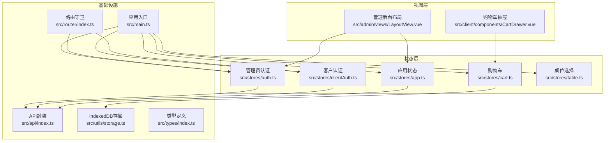
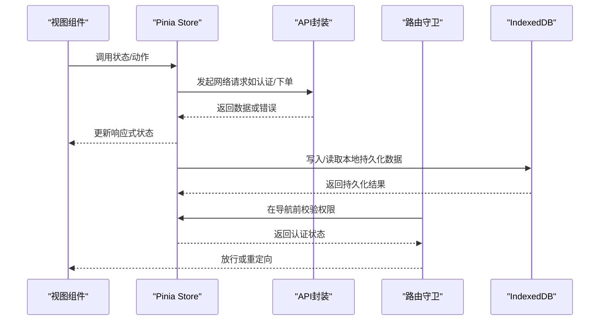
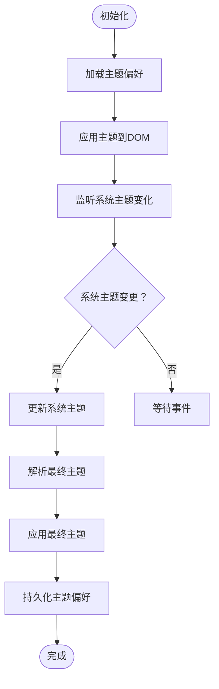
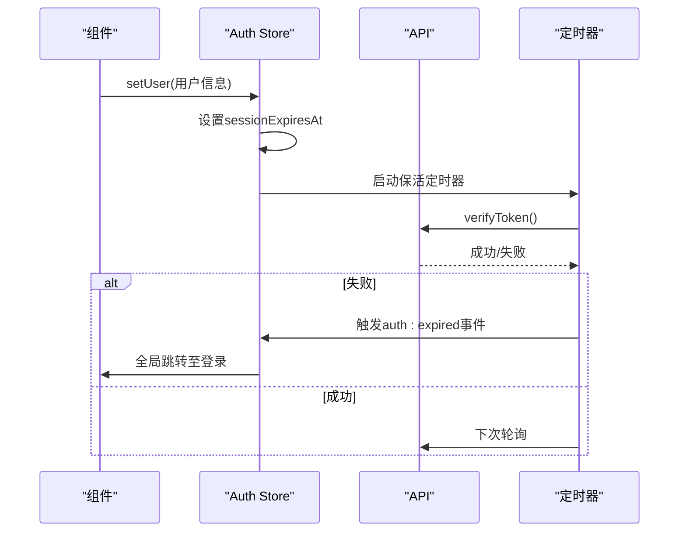
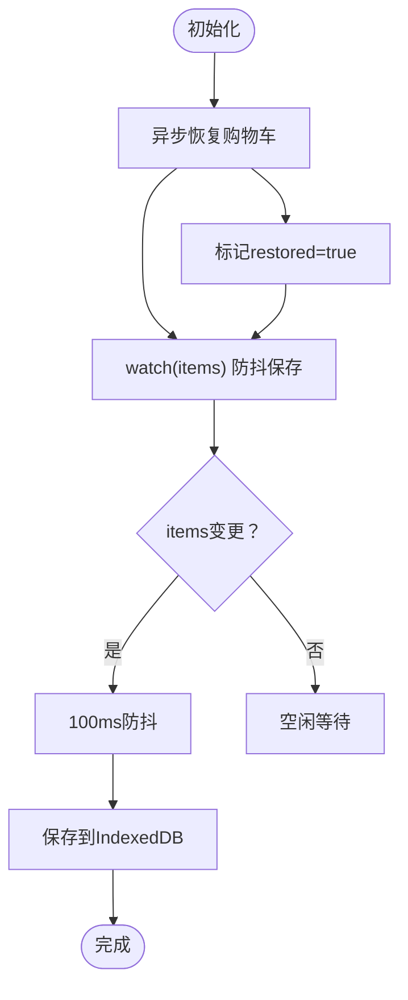
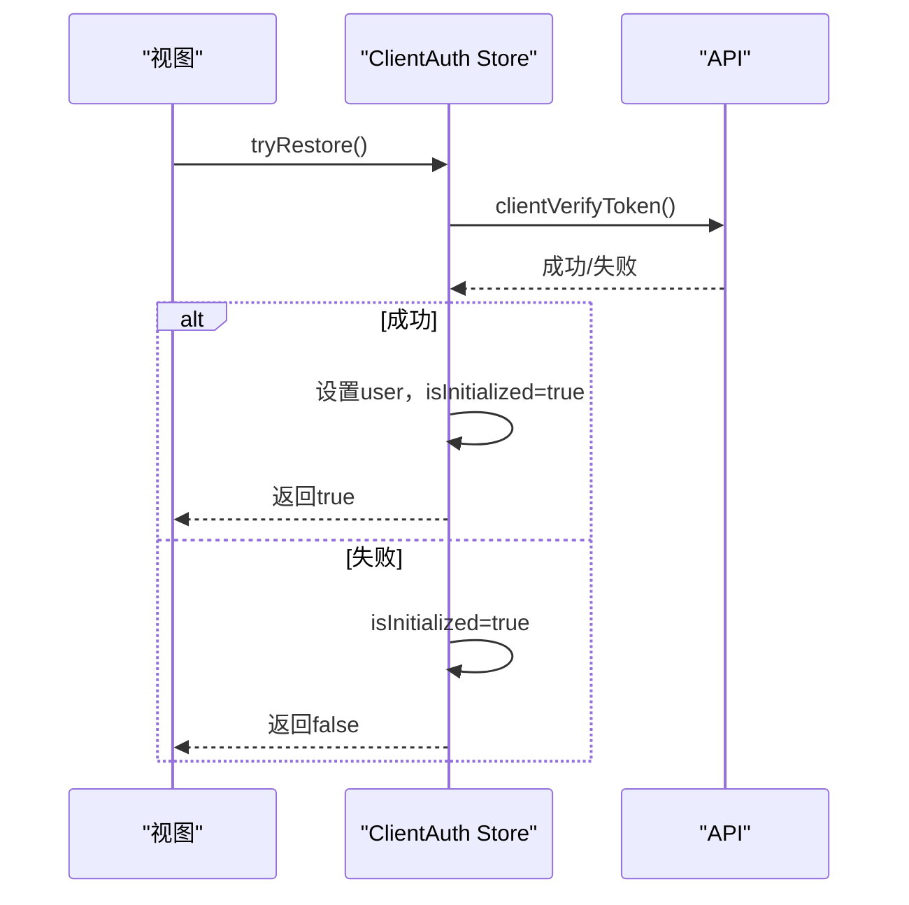
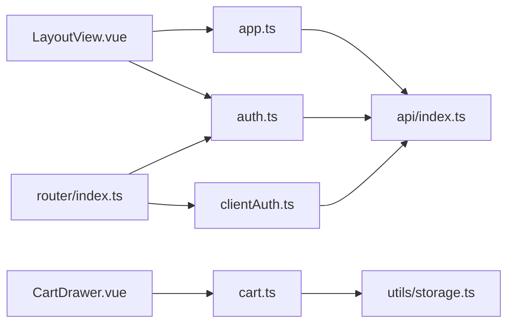

# 状态管理架构

<cite>
**本文档引用的文件**
- [src/stores/app.ts](file://src/stores/app.ts)
- [src/stores/auth.ts](file://src/stores/auth.ts)
- [src/stores/cart.ts](file://src/stores/cart.ts)
- [src/stores/clientAuth.ts](file://src/stores/clientAuth.ts)
- [src/stores/table.ts](file://src/stores/table.ts)
- [src/types/index.ts](file://src/types/index.ts)
- [src/api/index.ts](file://src/api/index.ts)
- [src/utils/storage.ts](file://src/utils/storage.ts)
- [src/main.ts](file://src/main.ts)
- [src/router/index.ts](file://src/router/index.ts)
- [src/client/components/CartDrawer.vue](file://src/client/components/CartDrawer.vue)
- [src/admin/views/LayoutView.vue](file://src/admin/views/LayoutView.vue)
</cite>

## 目录
1. [引言](#引言)
2. [项目结构](#项目结构)
3. [核心组件](#核心组件)
4. [架构总览](#架构总览)
5. [详细组件分析](#详细组件分析)
6. [依赖关系分析](#依赖关系分析)
7. [性能考量](#性能考量)
8. [故障排查指南](#故障排查指南)
9. [结论](#结论)

## 引言
本文件面向RLRMS餐厅管理系统，系统性阐述基于Pinia的状态管理架构设计与实现。文档聚焦以下目标：
- 解释Pinia在本项目中的设计理念与组织方式，包括store命名规范与职责边界
- 逐项说明应用状态、认证状态、购物车状态、客户认证状态、桌位状态等store的功能与交互
- 阐述状态共享机制与响应式更新原理
- 提供最佳实践与性能优化建议，帮助开发者在复杂业务场景下保持状态管理的可维护性与稳定性

## 项目结构
本项目的前端采用Vue 3 + Pinia架构，状态管理集中于src/stores目录，围绕“按功能域划分”的原则组织各store模块，每个store封装独立的领域状态与行为，通过组合式API对外暴露响应式状态与方法。

图表来源
- [src/stores/app.ts:1-122](file://src/stores/app.ts#L1-L122)
- [src/stores/auth.ts:1-128](file://src/stores/auth.ts#L1-L128)
- [src/stores/cart.ts:1-183](file://src/stores/cart.ts#L1-L183)
- [src/stores/clientAuth.ts:1-87](file://src/stores/clientAuth.ts#L1-L87)
- [src/stores/table.ts:1-25](file://src/stores/table.ts#L1-L25)
- [src/main.ts:1-37](file://src/main.ts#L1-L37)
- [src/router/index.ts:1-317](file://src/router/index.ts#L1-L317)
- [src/api/index.ts:1-608](file://src/api/index.ts#L1-L608)
- [src/utils/storage.ts:1-109](file://src/utils/storage.ts#L1-L109)
- [src/types/index.ts:1-133](file://src/types/index.ts#L1-L133)
- [src/client/components/CartDrawer.vue:1-314](file://src/client/components/CartDrawer.vue#L1-L314)
- [src/admin/views/LayoutView.vue:1-769](file://src/admin/views/LayoutView.vue#L1-L769)

章节来源
- [src/main.ts:1-37](file://src/main.ts#L1-L37)
- [src/router/index.ts:1-317](file://src/router/index.ts#L1-L317)

## 核心组件
本节概述五个核心store及其职责边界与典型用法。

- 应用状态store（app）
  - 职责：主题管理（支持浅色/深色/跟随系统）、全局加载状态、调试模式、全局提示（toast）
  - 关键点：主题持久化、系统主题监听、响应式解析最终主题、toast队列与去重
- 认证store（auth）
  - 职责：管理员JWT认证、会话生命周期管理、会话保活（定时轮询）、过期事件派发
  - 关键点：JWT有效期、保活间隔、即将过期判断、过期事件用于全局跳转
- 购物车store（cart）
  - 职责：菜品加入/移除/数量调整、小计与总计计算、订单提交数据转换、本地持久化（IndexedDB）
  - 关键点：防抖持久化、显式保存与watch兜底、恢复逻辑、序列化剥离Proxy
- 客户认证store（clientAuth）
  - 职责：客户登录态恢复、登录/登出、显示名与手机号后四位派生属性
  - 关键点：tryRestore流程、仅本地清理与后端调用分离
- 桌位store（table）
  - 职责：当前选中桌位的读取与清空
  - 关键点：简单状态与派生属性，便于UI联动

章节来源
- [src/stores/app.ts:14-121](file://src/stores/app.ts#L14-L121)
- [src/stores/auth.ts:15-126](file://src/stores/auth.ts#L15-L126)
- [src/stores/cart.ts:9-182](file://src/stores/cart.ts#L9-L182)
- [src/stores/clientAuth.ts:10-85](file://src/stores/clientAuth.ts#L10-L85)
- [src/stores/table.ts:5-23](file://src/stores/table.ts#L5-L23)

## 架构总览
Pinia在本项目中承担“单一事实来源”的角色，通过组合式API将状态与方法暴露给组件，配合路由守卫与API封装形成完整的认证与数据流闭环。

图表来源
- [src/stores/auth.ts:37-55](file://src/stores/auth.ts#L37-L55)
- [src/stores/cart.ts:113-130](file://src/stores/cart.ts#L113-L130)
- [src/router/index.ts:202-277](file://src/router/index.ts#L202-L277)
- [src/api/index.ts:54-114](file://src/api/index.ts#L54-L114)

## 详细组件分析

### 应用状态store（app）
- 设计要点
  - 主题管理：支持“跟随系统”策略，动态监听系统主题变化并同步到DOM属性，实现跨组件主题一致性
  - 持久化：主题偏好与调试模式均通过本地存储持久化，应用启动时自动恢复
  - 全局提示：toast队列限制与自动清理，避免UI堆积
- 关键实现
  - 主题持久化与系统主题监听
  - 调试模式开关与持久化
  - toast队列与去重策略

图表来源
- [src/stores/app.ts:33-53](file://src/stores/app.ts#L33-L53)
- [src/stores/app.ts:24-31](file://src/stores/app.ts#L24-L31)

章节来源
- [src/stores/app.ts:14-121](file://src/stores/app.ts#L14-L121)

### 认证store（auth）
- 设计要点
  - 会话生命周期：设置用户时即设定JWT有效期，启动保活定时器；过期时停止保活并派发全局事件
  - 即将过期提醒：基于阈值判断，便于前端引导用户续期
  - 统一过期处理：通过自定义事件驱动全局跳转，避免分散处理
- 关键实现
  - 保活定时器的启动/停止
  - 过期事件派发与错误处理
  - 会话剩余时间计算

图表来源
- [src/stores/auth.ts:37-55](file://src/stores/auth.ts#L37-L55)
- [src/stores/auth.ts:47-53](file://src/stores/auth.ts#L47-L53)
- [src/api/index.ts:253-255](file://src/api/index.ts#L253-L255)

章节来源
- [src/stores/auth.ts:15-126](file://src/stores/auth.ts#L15-L126)

### 购物车store（cart）
- 设计要点
  - 本地持久化：使用IndexedDB存储购物车与关联订单ID，支持跨会话恢复
  - 防抖与兜底：显式保存与深度watch结合，确保变更可靠落盘
  - 订单数据转换：提供提交订单所需的标准化结构
- 关键实现
  - IndexedDB读写与错误静默
  - 深度watch与防抖timer
  - 序列化剥离Proxy，避免存储非原生对象

图表来源
- [src/stores/cart.ts:133-167](file://src/stores/cart.ts#L133-L167)
- [src/stores/cart.ts:154-158](file://src/stores/cart.ts#L154-L158)
- [src/stores/cart.ts:113-130](file://src/stores/cart.ts#L113-L130)

章节来源
- [src/stores/cart.ts:9-182](file://src/stores/cart.ts#L9-L182)

### 客户认证store（clientAuth）
- 设计要点
  - 无侵入恢复：tryRestore尝试从cookie恢复登录，不阻塞UI渲染
  - 本地清理与后端登出分离：clearSession仅清理本地，logout发起后端登出
  - 派生属性：手机号后四位与显示名，便于UI展示
- 关键实现
  - tryRestore流程与初始化标志
  - logout与clearSession的区分

图表来源
- [src/stores/clientAuth.ts:38-54](file://src/stores/clientAuth.ts#L38-L54)
- [src/api/index.ts:278-280](file://src/api/index.ts#L278-L280)

章节来源
- [src/stores/clientAuth.ts:10-85](file://src/stores/clientAuth.ts#L10-L85)

### 桌位store（table）
- 设计要点
  - 最简状态：仅维护当前选中桌位，提供是否已选择的派生属性
  - 与UI联动：在选择/清空时触发视图更新
- 关键实现
  - 选择与清空动作
  - 派生属性isTableSelected

章节来源
- [src/stores/table.ts:5-23](file://src/stores/table.ts#L5-L23)

### 状态共享与响应式更新
- 共享机制
  - 组件通过组合式API获取store实例，直接读取ref/computed状态与调用方法
  - 路由守卫在导航前注入认证store进行权限校验，实现跨页面共享
- 响应式原理
  - Pinia基于Vue响应式系统，store内部的ref/computed在变更时自动触发依赖组件的更新
  - watch与computed在store内部形成稳定的更新链路，避免重复渲染

章节来源
- [src/client/components/CartDrawer.vue:1-314](file://src/client/components/CartDrawer.vue#L1-L314)
- [src/admin/views/LayoutView.vue:1-769](file://src/admin/views/LayoutView.vue#L1-L769)
- [src/router/index.ts:202-277](file://src/router/index.ts#L202-L277)

## 依赖关系分析
- store之间的耦合
  - app与auth：app负责主题与全局状态，auth负责会话保活与过期事件，二者低耦合，通过事件通信
  - cart与storage：cart依赖storage进行本地持久化，但对上层组件透明
  - clientAuth与api：clientAuth依赖api进行令牌验证与登出
- 外部依赖
  - API封装提供统一的请求、缓存与错误处理
  - 类型定义贯穿store与API，确保数据结构一致

图表来源
- [src/stores/app.ts:1-122](file://src/stores/app.ts#L1-L122)
- [src/stores/auth.ts:1-128](file://src/stores/auth.ts#L1-L128)
- [src/stores/cart.ts:1-183](file://src/stores/cart.ts#L1-L183)
- [src/stores/clientAuth.ts:1-87](file://src/stores/clientAuth.ts#L1-L87)
- [src/stores/table.ts:1-25](file://src/stores/table.ts#L1-L25)
- [src/api/index.ts:1-608](file://src/api/index.ts#L1-L608)
- [src/utils/storage.ts:1-109](file://src/utils/storage.ts#L1-L109)
- [src/router/index.ts:1-317](file://src/router/index.ts#L1-L317)
- [src/client/components/CartDrawer.vue:1-314](file://src/client/components/CartDrawer.vue#L1-L314)
- [src/admin/views/LayoutView.vue:1-769](file://src/admin/views/LayoutView.vue#L1-L769)

章节来源
- [src/types/index.ts:1-133](file://src/types/index.ts#L1-L133)

## 性能考量
- 网络请求与缓存
  - API封装采用“先返回缓存、后台刷新”的stale-while-revalidate策略，减少首屏等待与重复请求
  - 对分类列表与首页数据设置TTL，提升弱网体验
- 本地持久化
  - 购物车与调试模式使用IndexedDB持久化，避免频繁网络请求；通过防抖与watch兜底确保可靠性
- 响应式与渲染
  - store内部使用computed与watch，避免不必要的全量重渲染
  - 路由守卫在导航前进行轻量校验，避免在组件内重复校验
- 最佳实践建议
  - 将昂贵计算放入computed，避免在模板中重复计算
  - 对高频变更的store动作进行防抖（如购物车保存），降低IO压力
  - 对需要跨组件共享的全局状态，优先使用Pinia而非localStorage，以获得更好的响应式体验

[本节提供通用指导，无需特定文件来源]

## 故障排查指南
- 会话过期导致的全局跳转
  - 现象：访问受保护路由时被重定向至登录页
  - 排查：检查认证store的保活定时器是否正常运行，确认API verifyToken接口返回
  - 参考：[src/stores/auth.ts:37-55](file://src/stores/auth.ts#L37-L55)，[src/api/index.ts:253-255](file://src/api/index.ts#L253-L255)
- 购物车无法恢复
  - 现象：刷新页面后购物车为空
  - 排查：确认IndexedDB初始化是否成功，检查storage.ts的openDB流程与错误处理
  - 参考：[src/stores/cart.ts:133-167](file://src/stores/cart.ts#L133-L167)，[src/utils/storage.ts:11-40](file://src/utils/storage.ts#L11-L40)
- 主题不生效或不随系统变化
  - 现象：切换系统深色/浅色后界面未更新
  - 排查：确认系统主题监听事件是否绑定，DOM属性"data-theme"是否正确设置
  - 参考：[src/stores/app.ts:24-31](file://src/stores/app.ts#L24-L31)，[src/stores/app.ts:40-53](file://src/stores/app.ts#L40-L53)
- 客户登录态异常
  - 现象：进入需要登录的页面时反复弹出登录框
  - 排查：检查clientAuth的tryRestore流程与事件派发，确认登录模态事件是否正确处理
  - 参考：[src/stores/clientAuth.ts:38-54](file://src/stores/clientAuth.ts#L38-L54)，[src/router/index.ts:208-247](file://src/router/index.ts#L208-L247)

章节来源
- [src/stores/auth.ts:37-55](file://src/stores/auth.ts#L37-L55)
- [src/stores/cart.ts:133-167](file://src/stores/cart.ts#L133-L167)
- [src/stores/app.ts:24-53](file://src/stores/app.ts#L24-L53)
- [src/stores/clientAuth.ts:38-54](file://src/stores/clientAuth.ts#L38-L54)
- [src/router/index.ts:208-247](file://src/router/index.ts#L208-L247)

## 结论
本项目的Pinia状态管理遵循“按功能域划分、最小耦合、高内聚”的设计原则，通过store清晰地隔离了应用状态、认证、购物车、客户认证与桌位等不同领域的状态与行为。借助响应式系统与路由守卫，实现了跨页面的状态共享与统一的权限控制。配合API封装的缓存策略与IndexedDB的本地持久化，整体在用户体验与开发效率之间取得了良好平衡。建议在后续迭代中继续坚持上述最佳实践，持续优化性能与可维护性。