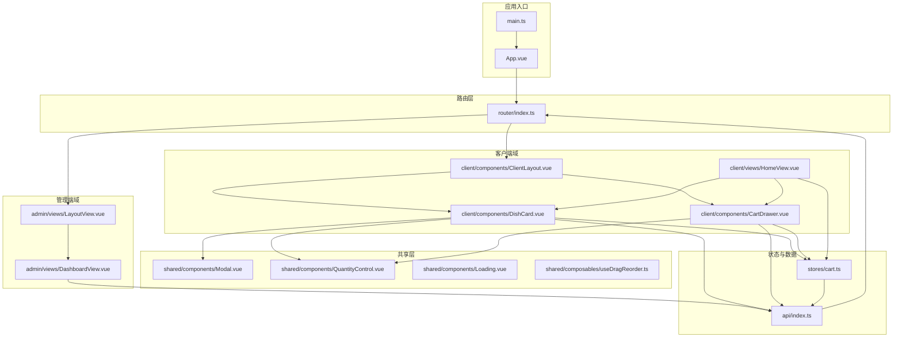
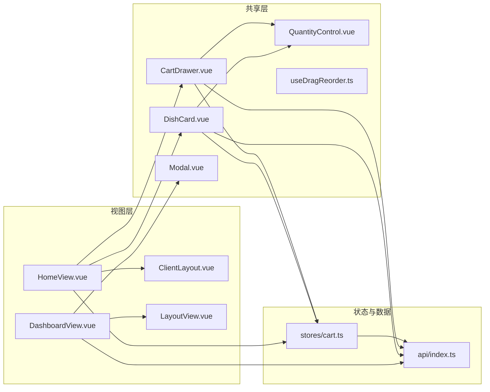
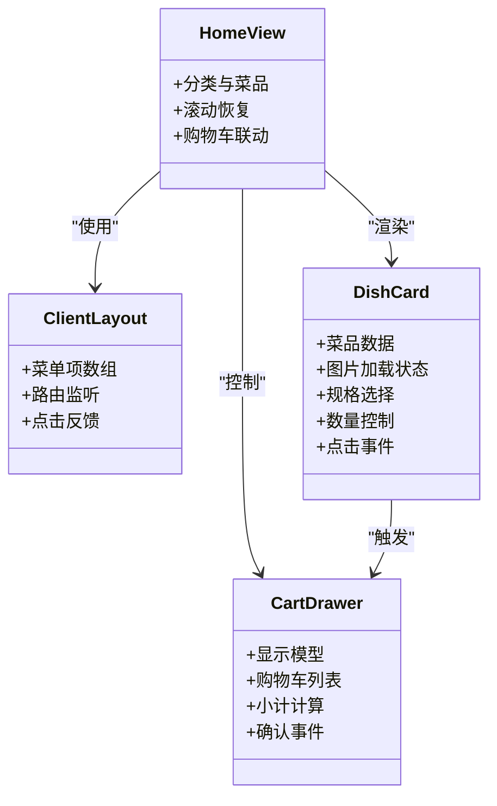
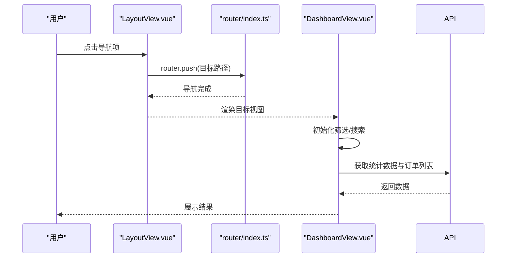
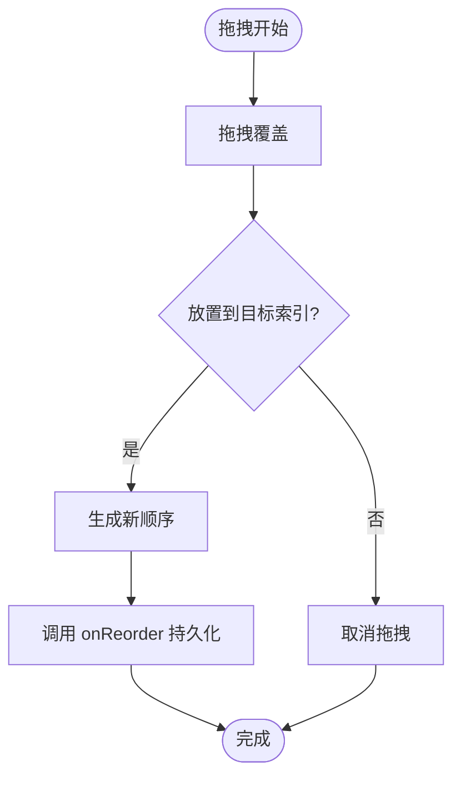
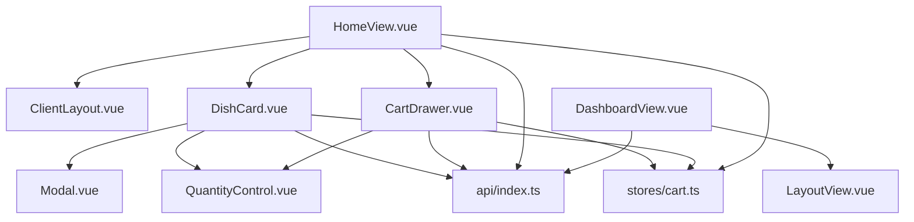

# 组件架构设计

<cite>
**本文引用的文件**
- [App.vue](file://src/App.vue)
- [main.ts](file://src/main.ts)
- [router/index.ts](file://src/router/index.ts)
- [admin/views/LayoutView.vue](file://src/admin/views/LayoutView.vue)
- [client/components/ClientLayout.vue](file://src/client/components/ClientLayout.vue)
- [shared/components/Modal.vue](file://src/shared/components/Modal.vue)
- [shared/components/Loading.vue](file://src/shared/components/Loading.vue)
- [client/components/CartDrawer.vue](file://src/client/components/CartDrawer.vue)
- [client/components/DishCard.vue](file://src/client/components/DishCard.vue)
- [shared/components/QuantityControl.vue](file://src/shared/components/QuantityControl.vue)
- [shared/composables/useDragReorder.ts](file://src/shared/composables/useDragReorder.ts)
- [stores/cart.ts](file://src/stores/cart.ts)
- [api/index.ts](file://src/api/index.ts)
- [admin/views/DashboardView.vue](file://src/admin/views/DashboardView.vue)
- [client/views/HomeView.vue](file://src/client/views/HomeView.vue)
</cite>

## 目录
1. [引言](#引言)
2. [项目结构](#项目结构)
3. [核心组件](#核心组件)
4. [架构总览](#架构总览)
5. [详细组件分析](#详细组件分析)
6. [依赖关系分析](#依赖关系分析)
7. [性能考量](#性能考量)
8. [故障排查指南](#故障排查指南)
9. [结论](#结论)
10. [附录](#附录)

## 引言
本设计文档面向 RLRMS 餐厅管理系统，聚焦前端组件架构与交互设计，系统性阐述客户端组件、管理端组件与共享组件的设计原则；详解组件间通信机制（props 传递、事件触发、插槽使用）、组件复用策略与组合式设计模式；并总结最佳实践（单一职责、命名规范、样式隔离）。

## 项目结构
系统采用按“功能域+层次”混合组织方式：
- 客户端功能域：client/
- 管理端功能域：admin/
- 共享资源：shared/
- 路由与入口：router/、main.ts、App.vue
- 状态管理：stores/
- API 封装：api/

图表来源
- [main.ts:1-37](file://src/main.ts#L1-L37)
- [App.vue:1-113](file://src/App.vue#L1-L113)
- [router/index.ts:1-317](file://src/router/index.ts#L1-L317)
- [client/components/ClientLayout.vue:1-256](file://src/client/components/ClientLayout.vue#L1-L256)
- [client/components/DishCard.vue:1-372](file://src/client/components/DishCard.vue#L1-L372)
- [client/components/CartDrawer.vue:1-314](file://src/client/components/CartDrawer.vue#L1-L314)
- [client/views/HomeView.vue:1-200](file://src/client/views/HomeView.vue#L1-L200)
- [admin/views/LayoutView.vue:1-769](file://src/admin/views/LayoutView.vue#L1-L769)
- [admin/views/DashboardView.vue:1-200](file://src/admin/views/DashboardView.vue#L1-L200)
- [shared/components/Modal.vue:1-189](file://src/shared/components/Modal.vue#L1-L189)
- [shared/components/QuantityControl.vue:1-212](file://src/shared/components/QuantityControl.vue#L1-L212)
- [shared/components/Loading.vue:1-83](file://src/shared/components/Loading.vue#L1-L83)
- [shared/composables/useDragReorder.ts:1-109](file://src/shared/composables/useDragReorder.ts#L1-L109)
- [stores/cart.ts:1-183](file://src/stores/cart.ts#L1-L183)
- [api/index.ts:1-608](file://src/api/index.ts#L1-L608)

章节来源
- [router/index.ts:1-317](file://src/router/index.ts#L1-L317)
- [main.ts:1-37](file://src/main.ts#L1-L37)
- [App.vue:1-113](file://src/App.vue#L1-L113)

## 核心组件
- 应用根组件 App.vue：统一处理全局认证过期事件、挂载 Toast 与客户端登录模态框，承载页面切换动画。
- 客户端布局 ClientLayout.vue：提供底部导航、路由切换动画与主题加载。
- 管理端布局 LayoutView.vue：侧边栏导航、移动端抽屉、调试工具折叠菜单、登出流程。
- 共享组件 Modal/Loading/QuantityControl：跨域复用的通用 UI。
- 客户端卡片 DishCard.vue：菜品展示、规格选择、加入购物车、图片懒加载与占位。
- 购物车抽屉 CartDrawer.vue：购物车列表、数量控制、小计计算、确认下单。
- 组合式工具 useDragReorder.ts：拖拽重排逻辑抽象，支持排序持久化。
- Pinia 状态 stores/cart.ts：购物车本地持久化（IndexedDB）、防抖保存、订单项转换。
- API 封装 api/index.ts：统一请求、401 全局处理、内存缓存（stale-while-revalidate）、可取消请求。

章节来源
- [App.vue:1-113](file://src/App.vue#L1-L113)
- [client/components/ClientLayout.vue:1-256](file://src/client/components/ClientLayout.vue#L1-L256)
- [admin/views/LayoutView.vue:1-769](file://src/admin/views/LayoutView.vue#L1-L769)
- [shared/components/Modal.vue:1-189](file://src/shared/components/Modal.vue#L1-L189)
- [shared/components/Loading.vue:1-83](file://src/shared/components/Loading.vue#L1-L83)
- [client/components/DishCard.vue:1-372](file://src/client/components/DishCard.vue#L1-L372)
- [client/components/CartDrawer.vue:1-314](file://src/client/components/CartDrawer.vue#L1-L314)
- [shared/composables/useDragReorder.ts:1-109](file://src/shared/composables/useDragReorder.ts#L1-L109)
- [stores/cart.ts:1-183](file://src/stores/cart.ts#L1-L183)
- [api/index.ts:1-608](file://src/api/index.ts#L1-L608)

## 架构总览
系统采用“单页应用 + 组件化 + 状态管理 + 组合式工具”的分层架构：
- 视图层：客户端/管理端视图与布局组件，负责渲染与交互。
- 通信层：props 传递、事件发射、插槽分发、Teleport 跨 DOM 传送。
- 数据层：Pinia Store 管理业务状态，API 封装统一网络请求与缓存。
- 复用层：共享组件与组合式工具提升代码复用与可维护性。

图表来源
- [client/views/HomeView.vue:1-200](file://src/client/views/HomeView.vue#L1-L200)
- [admin/views/DashboardView.vue:1-200](file://src/admin/views/DashboardView.vue#L1-L200)
- [client/components/ClientLayout.vue:1-256](file://src/client/components/ClientLayout.vue#L1-L256)
- [admin/views/LayoutView.vue:1-769](file://src/admin/views/LayoutView.vue#L1-L769)
- [client/components/DishCard.vue:1-372](file://src/client/components/DishCard.vue#L1-L372)
- [client/components/CartDrawer.vue:1-314](file://src/client/components/CartDrawer.vue#L1-L314)
- [shared/components/Modal.vue:1-189](file://src/shared/components/Modal.vue#L1-L189)
- [shared/components/QuantityControl.vue:1-212](file://src/shared/components/QuantityControl.vue#L1-L212)
- [shared/composables/useDragReorder.ts:1-109](file://src/shared/composables/useDragReorder.ts#L1-L109)
- [stores/cart.ts:1-183](file://src/stores/cart.ts#L1-L183)
- [api/index.ts:1-608](file://src/api/index.ts#L1-L608)

## 详细组件分析

### 客户端组件体系
- ClientLayout.vue
  - 设计要点：底部固定导航、路由切换动画、主题加载、移动端适配。
  - 通信机制：通过 $route 匹配高亮、Transition 控制图标弹跳。
- DishCard.vue
  - 设计要点：菜品卡片、图片懒加载/错误占位、标签展示、规格选择、数量控制。
  - 通信机制：emit('click') 通知父级跳转详情；与 QuantityControl 通过 v-model 交互；与 Modal 插槽配合实现规格确认。
- CartDrawer.vue
  - 设计要点：抽屉式购物车、列表项动画、小计计算、清空与确认下单。
  - 通信机制：defineModel('show') 控制显示；emit('confirm') 通知上层进入确认页；与 QuantityControl 双向绑定数量。
- HomeView.vue
  - 设计要点：分类聚合、菜品分组、滚动位置恢复、购物车联动、修改订单轮询。
  - 通信机制：与 DishCard 交互跳转详情；与 CartDrawer 交互打开抽屉；与 stores/cart 交互读写购物车。

图表来源
- [client/components/ClientLayout.vue:1-256](file://src/client/components/ClientLayout.vue#L1-L256)
- [client/components/DishCard.vue:1-372](file://src/client/components/DishCard.vue#L1-L372)
- [client/components/CartDrawer.vue:1-314](file://src/client/components/CartDrawer.vue#L1-L314)
- [client/views/HomeView.vue:1-200](file://src/client/views/HomeView.vue#L1-L200)

章节来源
- [client/components/ClientLayout.vue:1-256](file://src/client/components/ClientLayout.vue#L1-L256)
- [client/components/DishCard.vue:1-372](file://src/client/components/DishCard.vue#L1-L372)
- [client/components/CartDrawer.vue:1-314](file://src/client/components/CartDrawer.vue#L1-L314)
- [client/views/HomeView.vue:1-200](file://src/client/views/HomeView.vue#L1-L200)

### 管理端组件体系
- LayoutView.vue
  - 设计要点：侧边栏导航、移动端抽屉、调试工具折叠菜单、登出流程、主题与开发模式加载。
  - 通信机制：router.push 导航；watch 跟踪路由触发淡入动画；条件渲染调试子菜单。
- DashboardView.vue
  - 设计要点：仪表盘统计、订单筛选与搜索、自动刷新、批量清理、状态颜色映射。
  - 通信机制：与 api 交互获取数据；与 Modal/ConfirmDialog 交互；与 useOrderPolling 组合式工具协作。

图表来源
- [admin/views/LayoutView.vue:1-769](file://src/admin/views/LayoutView.vue#L1-L769)
- [router/index.ts:1-317](file://src/router/index.ts#L1-L317)
- [admin/views/DashboardView.vue:1-200](file://src/admin/views/DashboardView.vue#L1-L200)
- [api/index.ts:1-608](file://src/api/index.ts#L1-L608)

章节来源
- [admin/views/LayoutView.vue:1-769](file://src/admin/views/LayoutView.vue#L1-L769)
- [admin/views/DashboardView.vue:1-200](file://src/admin/views/DashboardView.vue#L1-L200)
- [router/index.ts:1-317](file://src/router/index.ts#L1-L317)

### 共享组件与组合式工具
- Modal.vue
  - 设计要点：Teleport 到 body、背景遮罩、尺寸与标题、插槽 footer。
  - 通信机制：props.show 控制显示；emit('close') 关闭；watch 阻止背景滚动。
- QuantityControl.vue
  - 设计要点：最小最大值限制、数值弹跳动画、波纹点击反馈。
  - 通信机制：v-model 双向绑定；emit('update:modelValue') 更新父级。
- useDragReorder.ts
  - 设计要点：拖拽开始/结束、拖拽覆盖、放置、排序持久化。
  - 通信机制：暴露 handleDragStart/Over/Leave/Drop 与状态；调用 onReorder 回调。

图表来源
- [shared/composables/useDragReorder.ts:1-109](file://src/shared/composables/useDragReorder.ts#L1-L109)

章节来源
- [shared/components/Modal.vue:1-189](file://src/shared/components/Modal.vue#L1-L189)
- [shared/components/QuantityControl.vue:1-212](file://src/shared/components/QuantityControl.vue#L1-L212)
- [shared/composables/useDragReorder.ts:1-109](file://src/shared/composables/useDragReorder.ts#L1-L109)

### 组件通信机制
- Props 传递
  - DishCard 接收 Dish；CartDrawer 接收 show；QuantityControl 接收 modelValue/min/max/size。
- 事件触发
  - DishCard.emit('click')；CartDrawer.emit('confirm')；QuantityControl.emit('update:modelValue')；Modal.emit('close')。
- 插槽使用
  - Modal 提供默认插槽与 footer 插槽；ClientLayout 提供默认插槽承载内容。
- 跨 DOM 传送
  - Modal/Modal.vue 使用 Teleport 将内容传送到 body，避免层级与定位问题。
- 自定义事件
  - App.vue 监听 'auth:expired'；router/index.ts 触发 'client:require-login'/'client:login-success'/'client:login-cancel'。

章节来源
- [client/components/DishCard.vue:1-372](file://src/client/components/DishCard.vue#L1-L372)
- [client/components/CartDrawer.vue:1-314](file://src/client/components/CartDrawer.vue#L1-L314)
- [shared/components/QuantityControl.vue:1-212](file://src/shared/components/QuantityControl.vue#L1-L212)
- [shared/components/Modal.vue:1-189](file://src/shared/components/Modal.vue#L1-L189)
- [App.vue:1-113](file://src/App.vue#L1-L113)
- [router/index.ts:1-317](file://src/router/index.ts#L1-L317)

### 组件复用策略与组合式设计
- 组件复用
  - Modal/QuantityControl/Loading 在客户端与管理端多处使用，减少重复实现。
  - DishCard 与 CartDrawer 在 HomeView 中组合使用，形成点餐工作流。
- 组合式设计
  - useDragReorder 抽象拖拽重排逻辑，支持任意列表排序持久化。
  - HomeView 与 DashboardView 分别组合不同组合式工具与共享组件，形成模块化能力。

章节来源
- [shared/composables/useDragReorder.ts:1-109](file://src/shared/composables/useDragReorder.ts#L1-L109)
- [client/views/HomeView.vue:1-200](file://src/client/views/HomeView.vue#L1-L200)
- [admin/views/DashboardView.vue:1-200](file://src/admin/views/DashboardView.vue#L1-L200)

### 最佳实践
- 单一职责
  - DishCard 专注菜品展示与规格选择；CartDrawer 专注购物车操作；LayoutView 专注导航与布局。
- 命名规范
  - 组件文件采用 PascalCase；store 使用 useXxx 形式；组合式函数以 use 开头。
- 样式隔离
  - 使用 scoped CSS；变量命名遵循 --color/--spacing/--radius 等语义化前缀；在 Modal/QuantityControl 中通过类名控制尺寸与状态。

章节来源
- [client/components/DishCard.vue:1-372](file://src/client/components/DishCard.vue#L1-L372)
- [client/components/CartDrawer.vue:1-314](file://src/client/components/CartDrawer.vue#L1-L314)
- [shared/components/Modal.vue:1-189](file://src/shared/components/Modal.vue#L1-L189)
- [shared/components/QuantityControl.vue:1-212](file://src/shared/components/QuantityControl.vue#L1-L212)

## 依赖关系分析
- 组件依赖
  - HomeView 依赖 ClientLayout、DishCard、CartDrawer；DashboardView 依赖 LayoutView、Modal、ConfirmDialog。
  - DishCard 依赖 Modal、QuantityControl；CartDrawer 依赖 QuantityControl。
- 状态与数据依赖
  - stores/cart 与 api 互为依赖：cart 通过 api 发起网络请求；api 读取/写入购物车状态。
- 路由与守卫
  - router/index.ts 定义客户端/管理端路由与导航守卫，处理鉴权与预取。

图表来源
- [client/views/HomeView.vue:1-200](file://src/client/views/HomeView.vue#L1-L200)
- [client/components/ClientLayout.vue:1-256](file://src/client/components/ClientLayout.vue#L1-L256)
- [client/components/DishCard.vue:1-372](file://src/client/components/DishCard.vue#L1-L372)
- [client/components/CartDrawer.vue:1-314](file://src/client/components/CartDrawer.vue#L1-L314)
- [admin/views/DashboardView.vue:1-200](file://src/admin/views/DashboardView.vue#L1-L200)
- [admin/views/LayoutView.vue:1-769](file://src/admin/views/LayoutView.vue#L1-L769)
- [shared/components/Modal.vue:1-189](file://src/shared/components/Modal.vue#L1-L189)
- [shared/components/QuantityControl.vue:1-212](file://src/shared/components/QuantityControl.vue#L1-L212)
- [api/index.ts:1-608](file://src/api/index.ts#L1-L608)
- [stores/cart.ts:1-183](file://src/stores/cart.ts#L1-L183)

章节来源
- [router/index.ts:1-317](file://src/router/index.ts#L1-L317)
- [api/index.ts:1-608](file://src/api/index.ts#L1-L608)
- [stores/cart.ts:1-183](file://src/stores/cart.ts#L1-L183)

## 性能考量
- 路由预取与预加载
  - 预加载关键路由组件（首页、管理首页、管理布局）；导航后根据当前路由预测并预取相关页面，降低白屏时间。
- 请求缓存
  - api/index.ts 实现内存缓存（stale-while-revalidate），提升弱网与重复访问体验。
- 本地持久化
  - stores/cart.ts 使用 IndexedDB 持久化购物车，结合防抖保存与恢复逻辑，兼顾一致性与性能。
- 图片优化
  - DishCard.vue 对图片懒加载、错误占位与占位符处理，减少首屏阻塞与闪烁。

章节来源
- [router/index.ts:1-317](file://src/router/index.ts#L1-L317)
- [api/index.ts:1-608](file://src/api/index.ts#L1-L608)
- [stores/cart.ts:1-183](file://src/stores/cart.ts#L1-L183)
- [client/components/DishCard.vue:1-372](file://src/client/components/DishCard.vue#L1-L372)

## 故障排查指南
- 认证过期处理
  - App.vue 监听 'auth:expired'，区分客户端与管理端路径，分别提示与跳转登录。
  - router/index.ts 在导航守卫中处理客户端/管理端鉴权，必要时触发登录模态框或 401 处理。
- 错误上报与提示
  - api/index.ts 抛出 ApiError 并携带状态与数据；各视图通过 appStore.showToast 统一提示。
- 调试与日志
  - LayoutView.vue 支持开发模式下显示调试工具菜单；DashboardView.vue 提供订单搜索与筛选。

章节来源
- [App.vue:1-113](file://src/App.vue#L1-L113)
- [router/index.ts:1-317](file://src/router/index.ts#L1-L317)
- [api/index.ts:1-608](file://src/api/index.ts#L1-L608)
- [admin/views/LayoutView.vue:1-769](file://src/admin/views/LayoutView.vue#L1-L769)
- [admin/views/DashboardView.vue:1-200](file://src/admin/views/DashboardView.vue#L1-L200)

## 结论
本系统通过清晰的功能域划分与共享组件复用，构建了高内聚、低耦合的前端架构。组件间以 props/事件/插槽为核心通信方式，结合 Teleport 与自定义事件实现灵活交互；状态管理与 API 封装保障数据一致性与性能。建议持续完善类型约束与单元测试，进一步提升可维护性与可靠性。

## 附录
- 入口与全局配置
  - main.ts 初始化应用、注册路由与状态管理、全局禁用拼写检查、预加载关键路由。
- 主题与动画
  - App.vue 提供页面切换动画；各布局组件加载主题与开发模式；共享组件统一动画风格。

章节来源
- [main.ts:1-37](file://src/main.ts#L1-L37)
- [App.vue:1-113](file://src/App.vue#L1-L113)