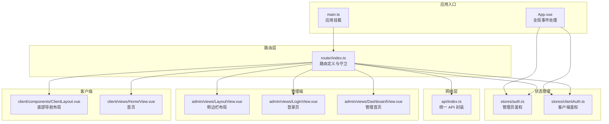
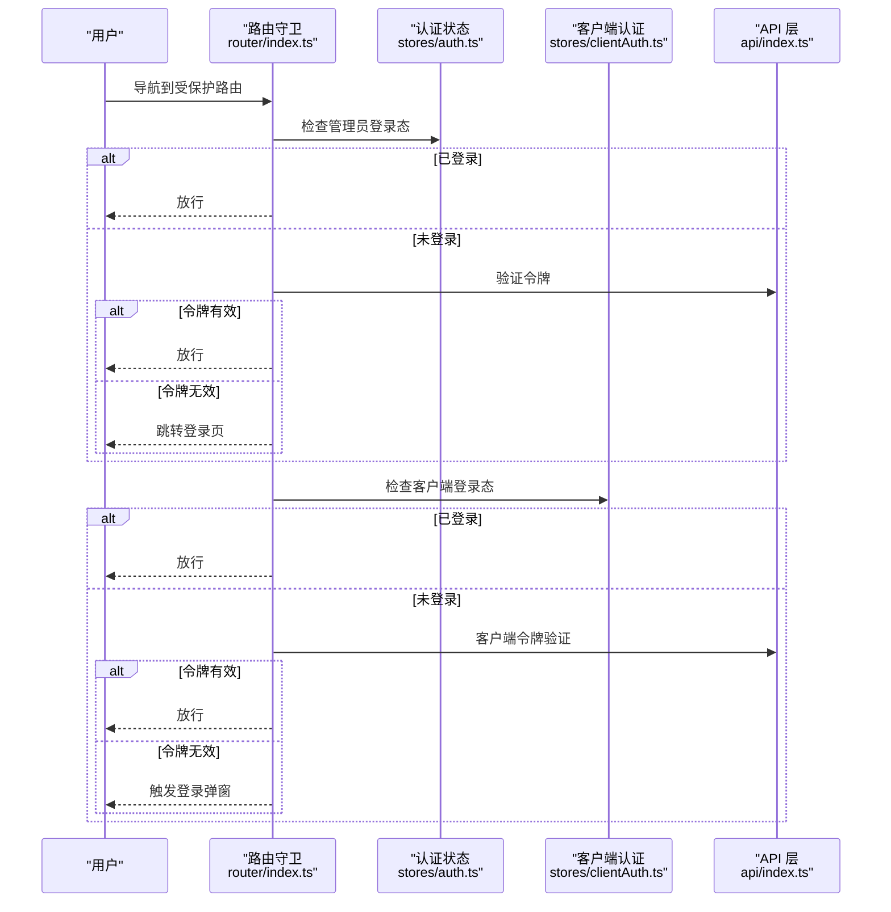
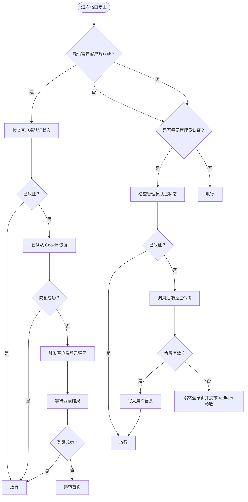
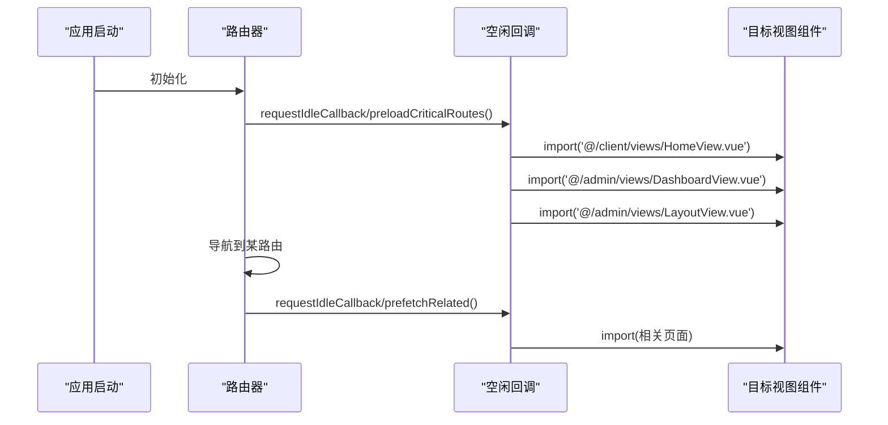
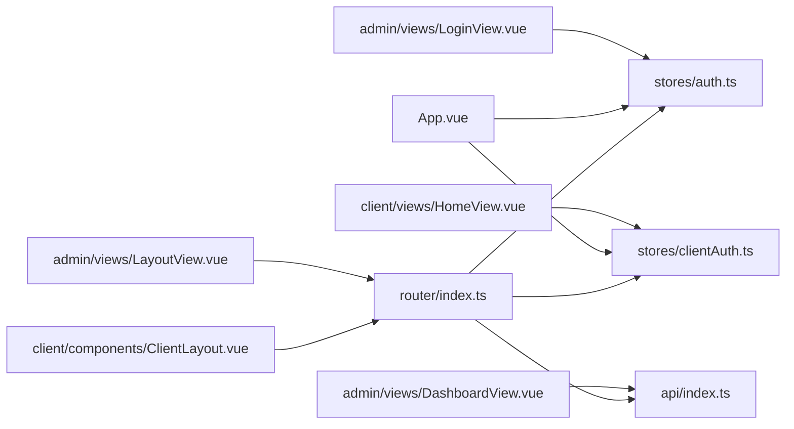

# 路由系统设计

<cite>
**本文档引用的文件**
- [src/router/index.ts](file://src/router/index.ts)
- [src/main.ts](file://src/main.ts)
- [src/admin/views/LayoutView.vue](file://src/admin/views/LayoutView.vue)
- [src/client/components/ClientLayout.vue](file://src/client/components/ClientLayout.vue)
- [src/stores/auth.ts](file://src/stores/auth.ts)
- [src/stores/clientAuth.ts](file://src/stores/clientAuth.ts)
- [src/api/index.ts](file://src/api/index.ts)
- [src/admin/views/LoginView.vue](file://src/admin/views/LoginView.vue)
- [src/client/views/HomeView.vue](file://src/client/views/HomeView.vue)
- [src/admin/views/DashboardView.vue](file://src/admin/views/DashboardView.vue)
- [vite.config.ts](file://vite.config.ts)
- [src/App.vue](file://src/App.vue)
</cite>

## 目录
1. [引言](#引言)
2. [项目结构](#项目结构)
3. [核心组件](#核心组件)
4. [架构总览](#架构总览)
5. [详细组件分析](#详细组件分析)
6. [依赖关系分析](#依赖关系分析)
7. [性能考虑](#性能考虑)
8. [故障排除指南](#故障排除指南)
9. [结论](#结论)

## 引言
本设计文档围绕 RLRMS 餐厅管理系统的路由系统展开，重点阐述 Vue Router 的配置与使用，包括客户端路由与管理端路由的分离设计、路由守卫的实现机制（权限验证与页面跳转控制）、路由懒加载策略与性能优化方案，并提供路由配置示例与最佳实践（嵌套路由、动态路由处理）。文档旨在帮助开发者快速理解并高效扩展该路由体系。

## 项目结构
系统采用“按功能域分层”的组织方式，路由配置集中于路由器入口文件，客户端与管理端分别拥有独立的视图与布局组件，配合 Pinia Store 实现状态管理与鉴权控制。

**图表来源**
- [src/main.ts:1-37](file://src/main.ts#L1-L37)
- [src/router/index.ts:1-317](file://src/router/index.ts#L1-L317)
- [src/admin/views/LayoutView.vue:1-769](file://src/admin/views/LayoutView.vue#L1-L769)
- [src/client/components/ClientLayout.vue:1-256](file://src/client/components/ClientLayout.vue#L1-L256)
- [src/stores/auth.ts:1-128](file://src/stores/auth.ts#L1-L128)
- [src/stores/clientAuth.ts:1-87](file://src/stores/clientAuth.ts#L1-L87)
- [src/api/index.ts:1-608](file://src/api/index.ts#L1-L608)

**章节来源**
- [src/router/index.ts:178-187](file://src/router/index.ts#L178-L187)
- [src/main.ts:1-37](file://src/main.ts#L1-L37)

## 核心组件
- 路由器实例与历史模式：基于 Web History 的 SPA 路由，支持滚动行为与标题设置。
- 客户端路由：面向顾客的点餐流程，包含首页、菜品详情、订单确认、订单列表、个人设置等。
- 管理端路由：面向管理员的后台面板，包含登录、仪表盘、桌位管理、菜单管理、订单管理、库存管理、用户管理、系统设置、调试工具等。
- 嵌套路由：管理端采用嵌套路由，父级为 LayoutView，子级为各功能页面。
- 动态路由：使用通配符捕获未匹配路径，统一跳转至对应“未找到”页面。
- 路由守卫：全局前置守卫负责权限校验与登录态恢复；后置守卫负责预取策略。

**章节来源**
- [src/router/index.ts:42-176](file://src/router/index.ts#L42-L176)
- [src/router/index.ts:201-277](file://src/router/index.ts#L201-L277)
- [src/admin/views/LayoutView.vue:47-68](file://src/admin/views/LayoutView.vue#L47-L68)

## 架构总览
路由系统通过统一的路由器实例整合客户端与管理端路由，利用 Pinia Store 管理登录状态，结合 API 层的 401 处理与会话保活机制，形成闭环的权限控制与用户体验保障。

**图表来源**
- [src/router/index.ts:201-277](file://src/router/index.ts#L201-L277)
- [src/stores/auth.ts:15-85](file://src/stores/auth.ts#L15-L85)
- [src/stores/clientAuth.ts:10-54](file://src/stores/clientAuth.ts#L10-L54)
- [src/api/index.ts:253-286](file://src/api/index.ts#L253-L286)

## 详细组件分析

### 路由配置与分离设计
- 客户端路由（前缀与命名）：以“/”开头的路径归类为客户端路由，包含首页、菜品详情、搜索、订单确认、订单列表、个人设置等，部分路由带有 requiresClientAuth 标记。
- 管理端路由（前缀与命名）：以“/admin”开头的路径归类为管理端路由，包含登录、仪表盘、多级子路由（桌位、菜单、库存、用户、设置、调试工具等），父级路由带有 requiresAuth 标记。
- 通用 404：客户端与管理端分别提供“未找到”页面，保证用户体验一致性。
- 嵌套路由：管理端父级路由“/admin”使用 LayoutView 作为容器，子路由渲染在 router-view 中，实现统一布局与导航。

**章节来源**
- [src/router/index.ts:42-92](file://src/router/index.ts#L42-L92)
- [src/router/index.ts:94-176](file://src/router/index.ts#L94-L176)
- [src/admin/views/LayoutView.vue:23-26](file://src/admin/views/LayoutView.vue#L23-L26)

### 路由守卫实现机制
- 文档标题更新：根据路由 meta.title 自动设置页面标题。
- 客户端权限校验：对 requiresClientAuth 的路由，优先检查客户端认证状态；若未登录，尝试从 Cookie 恢复；仍失败则触发客户端登录弹窗，等待用户交互后再放行或回退。
- 管理端权限校验：对 requiresAuth 的路由，优先检查管理员认证状态；若未登录，尝试调用后端令牌验证接口；成功则写入用户信息并放行；失败则跳转到管理端登录页并携带 redirect 参数。
- 会话保活与 401 处理：API 层在 401 时触发全局事件，App.vue 监听该事件并根据当前路径区分处理（管理端跳转登录，客户端清理状态并触发登录弹窗）。

**图表来源**
- [src/router/index.ts:201-277](file://src/router/index.ts#L201-L277)
- [src/stores/clientAuth.ts:38-54](file://src/stores/clientAuth.ts#L38-L54)
- [src/api/index.ts:253-286](file://src/api/index.ts#L253-L286)
- [src/App.vue:16-39](file://src/App.vue#L16-L39)

**章节来源**
- [src/router/index.ts:201-277](file://src/router/index.ts#L201-L277)
- [src/App.vue:16-39](file://src/App.vue#L16-L39)

### 路由懒加载与预取策略
- 路由懒加载：所有路由组件均通过动态 import 实现按需加载，减少首屏包体积。
- 关键路由预加载：应用启动后，在浏览器空闲时预加载客户端首页、管理首页与管理布局组件，提升首屏体验。
- 导航后预取：afterEach 钩子根据当前路由预测用户可能访问的下一个页面，进行异步预取，进一步降低二次跳转延迟。

**图表来源**
- [src/router/index.ts:19-40](file://src/router/index.ts#L19-L40)
- [src/router/index.ts:283-314](file://src/router/index.ts#L283-L314)

**章节来源**
- [src/router/index.ts:19-40](file://src/router/index.ts#L19-L40)
- [src/router/index.ts:283-314](file://src/router/index.ts#L283-L314)

### 性能优化与构建策略
- 代码分割：Vite Rollup 输出手动分割 vendor（依赖）与 vendor-icons（图标库），CSS 独立拆分，资源文件名带内容哈希，利于缓存与 Tree-Shaking。
- 开发优化：预构建常用依赖（vue、vue-router、pinia、lucide-vue-next），提升开发服务器启动速度。
- 生产优化：ESBuild 压缩、移除 console（生产环境）、禁用 SourceMap（可选）。

**章节来源**
- [vite.config.ts:63-112](file://vite.config.ts#L63-L112)
- [vite.config.ts:39-42](file://vite.config.ts#L39-L42)

### 嵌套路由与动态路由处理
- 嵌套路由：管理端采用父子路由结构，父级为 LayoutView，子级为各功能页面，支持面包屑与侧边栏导航联动。
- 动态路由：使用通配符“:pathMatch(.*)*”捕获未匹配路径，统一跳转至对应“未找到”页面，避免 404 白屏。
- 路由参数传递：管理端调试工具组件支持路径参数与查询参数的动态替换与发送，体现动态路由的实际应用场景。

**章节来源**
- [src/router/index.ts:107-175](file://src/router/index.ts#L107-L175)
- [src/router/index.ts:169-173](file://src/router/index.ts#L169-L173)
- [src/admin/views/LayoutView.vue:47-68](file://src/admin/views/LayoutView.vue#L47-L68)

### 客户端与管理端导航实现
- 客户端导航：ClientLayout 提供底部导航栏，使用 router-link 与路由路径绑定，支持激活态样式与动画。
- 管理端导航：LayoutView 通过计算属性生成导航项，支持折叠、移动端抽屉、子菜单展开与路由切换，结合 watch 监听路由变化触发动画。

**章节来源**
- [src/client/components/ClientLayout.vue:10-38](file://src/client/components/ClientLayout.vue#L10-L38)
- [src/admin/views/LayoutView.vue:47-133](file://src/admin/views/LayoutView.vue#L47-L133)

## 依赖关系分析
路由系统与状态管理、API 层存在强耦合关系，权限控制贯穿全局，确保安全与一致的用户体验。

**图表来源**
- [src/router/index.ts:1-6](file://src/router/index.ts#L1-L6)
- [src/stores/auth.ts:1-4](file://src/stores/auth.ts#L1-L4)
- [src/stores/clientAuth.ts:1-4](file://src/stores/clientAuth.ts#L1-L4)
- [src/api/index.ts:1-4](file://src/api/index.ts#L1-L4)
- [src/App.vue:1-15](file://src/App.vue#L1-L15)

**章节来源**
- [src/router/index.ts:1-6](file://src/router/index.ts#L1-L6)
- [src/App.vue:1-15](file://src/App.vue#L1-L15)

## 性能考虑
- 路由懒加载与预取：减少首屏体积，提升二次跳转速度。
- 会话保活：定时验证令牌，避免长时间停留导致的“假登录”状态。
- API 缓存与 401 处理：统一错误处理与提示，减少重复登录成本。
- 构建优化：手动分割 vendor 与图标库，CSS 独立拆分，资源哈希化，提升缓存命中率。

[本节为通用指导，无需特定文件引用]

## 故障排除指南
- 管理端登录后仍被重定向：检查路由守卫中的 requiresAuth 标记与后端令牌验证逻辑，确认 redirect 参数是否正确传递。
- 客户端登录弹窗无法关闭：确认客户端登录事件监听与 Promise 解决逻辑，确保“登录成功/取消”事件正确派发与移除。
- 401 未登录跳转异常：检查 API 层 401 处理与 App.vue 全局事件监听，确保区分管理端与客户端路径。
- Edge 浏览器历史状态异常：路由初始化中针对 Edge 的 replaceState 进行了兼容处理，若仍有问题，检查 visibilityState 判断逻辑。

**章节来源**
- [src/router/index.ts:10-17](file://src/router/index.ts#L10-L17)
- [src/api/index.ts:94-104](file://src/api/index.ts#L94-L104)
- [src/App.vue:16-39](file://src/App.vue#L16-L39)

## 结论
RLRMS 路由系统通过清晰的客户端/管理端分离、完善的路由守卫与鉴权机制、以及高效的懒加载与预取策略，实现了良好的用户体验与可维护性。结合 Pinia 状态管理与 API 层的 401 处理，系统在安全性与性能之间取得了平衡。建议在后续迭代中持续关注路由层级的演进与性能指标，确保系统稳定扩展。