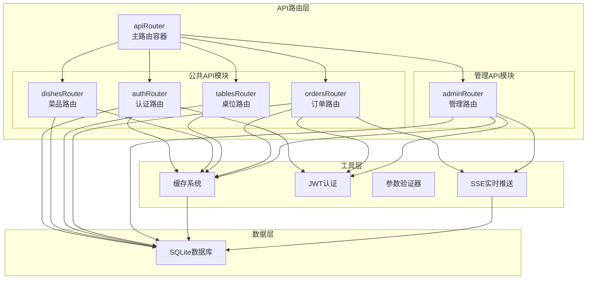
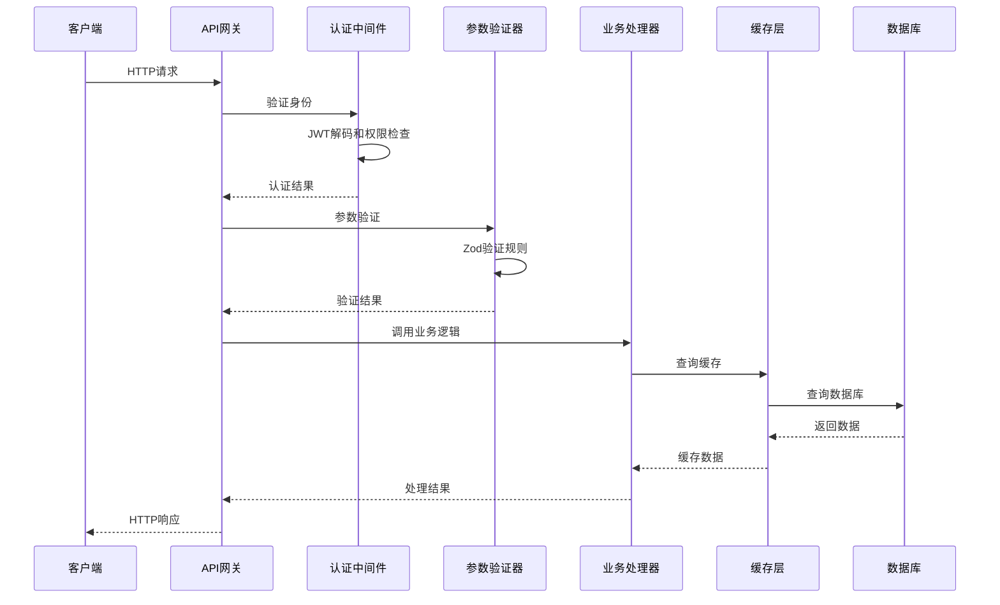
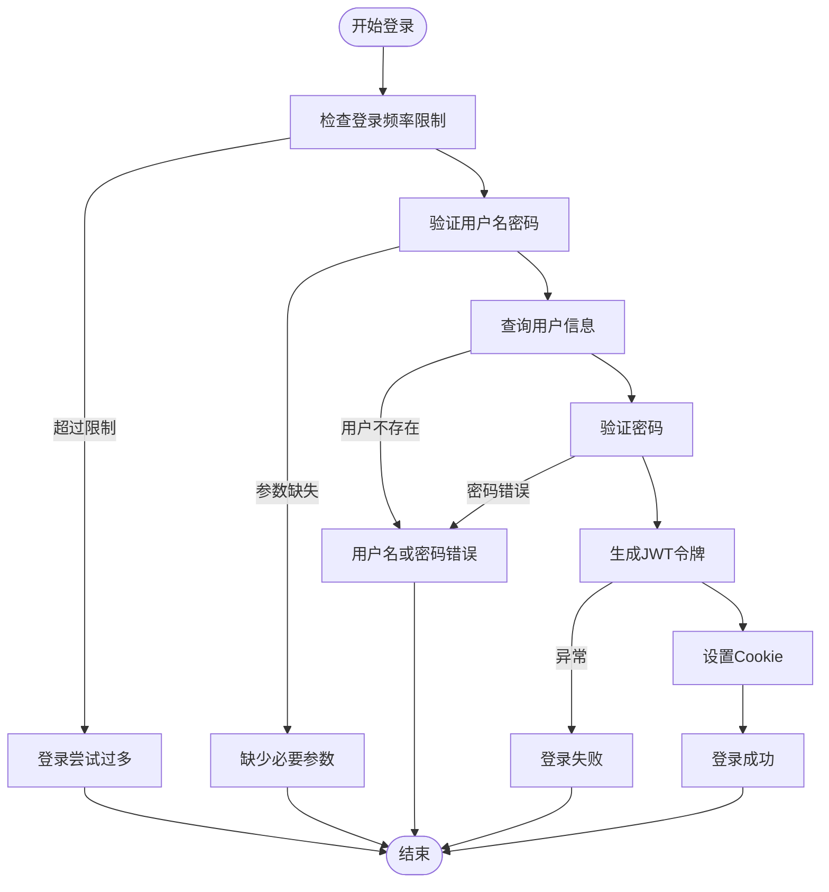
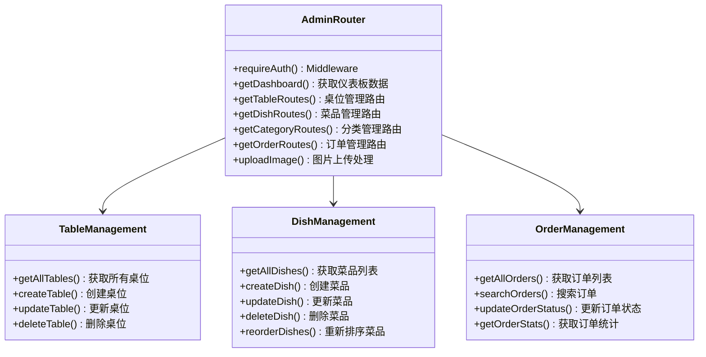
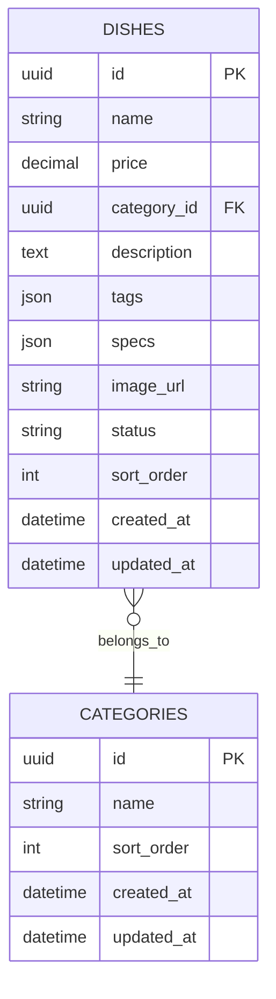
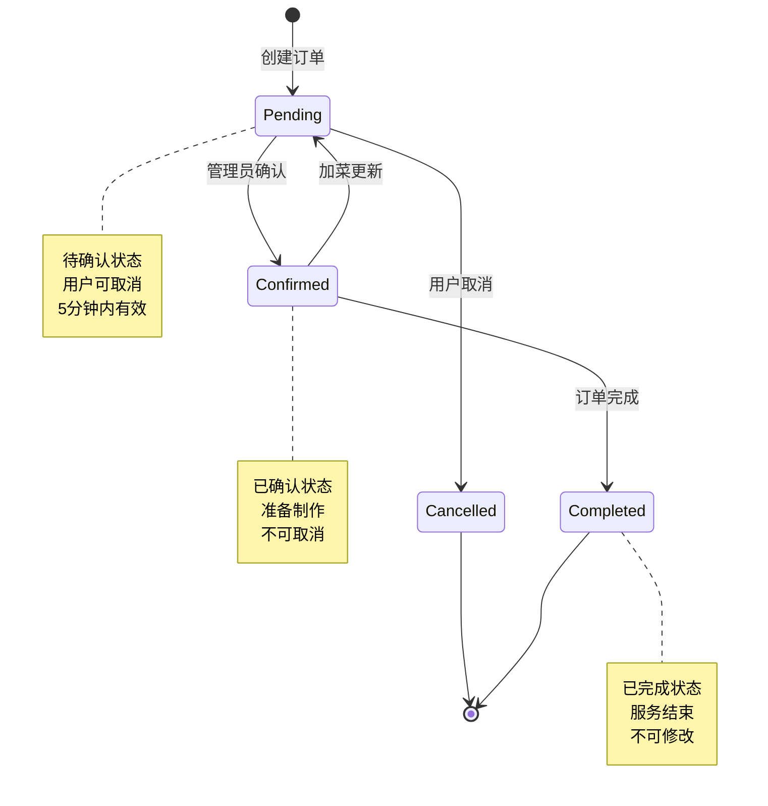
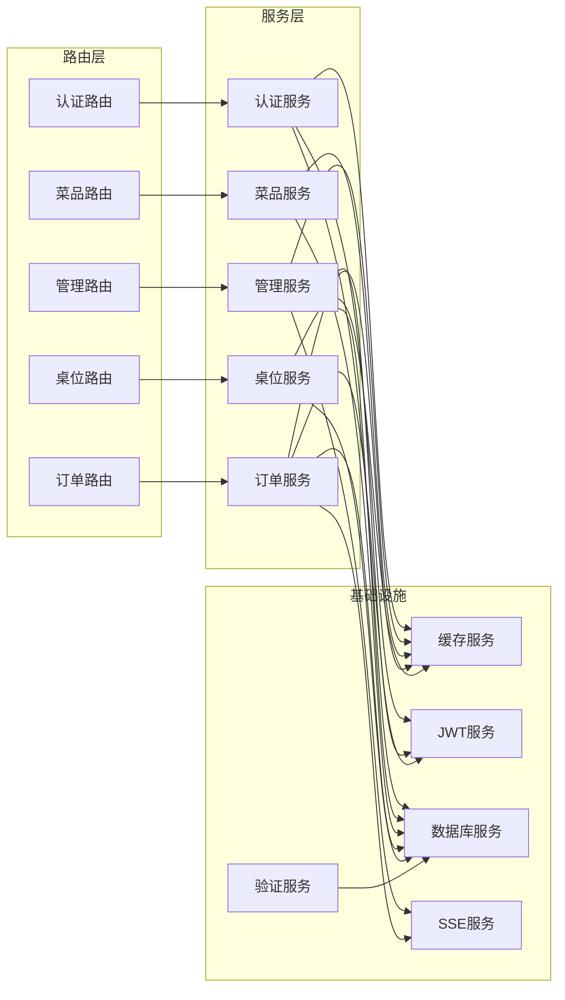
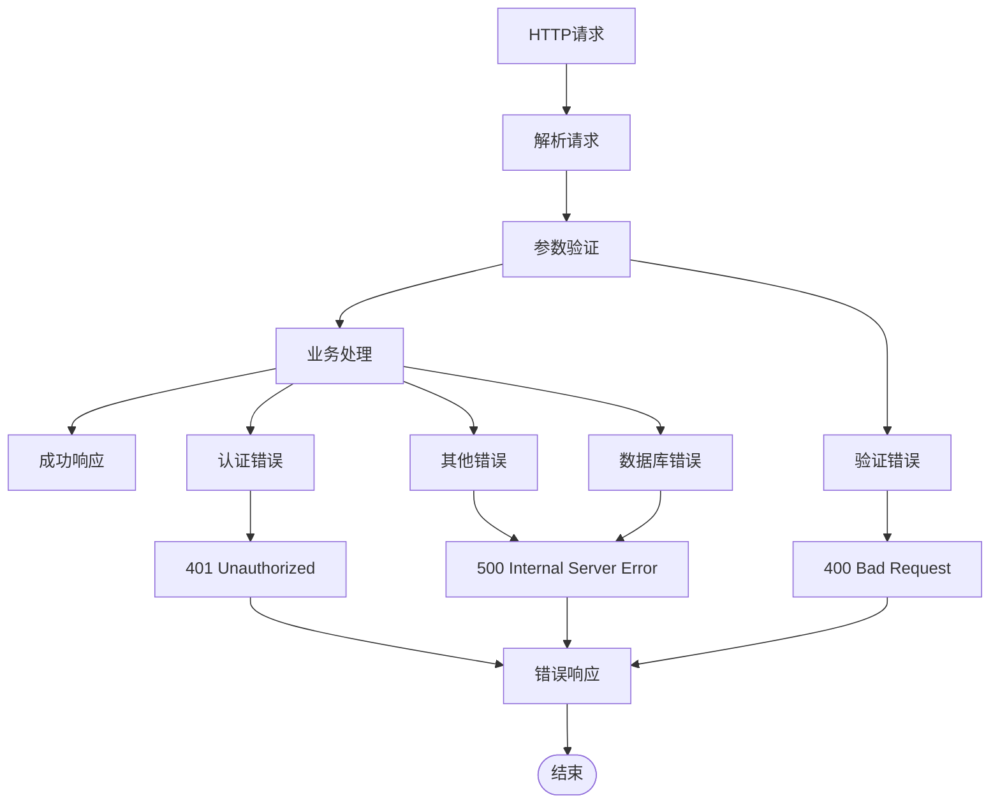

# API路由系统

<cite>
**本文档引用的文件**
- [server/src/routes/index.ts](file://server/src/routes/index.ts)
- [server/src/routes/auth.ts](file://server/src/routes/auth.ts)
- [server/src/routes/admin.ts](file://server/src/routes/admin.ts)
- [server/src/routes/dishes.ts](file://server/src/routes/dishes.ts)
- [server/src/routes/orders.ts](file://server/src/routes/orders.ts)
- [server/src/routes/tables.ts](file://server/src/routes/tables.ts)
- [server/src/utils/cache.ts](file://server/src/utils/cache.ts)
- [server/src/utils/jwt.ts](file://server/src/utils/jwt.ts)
- [server/src/validators/index.ts](file://server/src/validators/index.ts)
- [server/src/db/index.ts](file://server/src/db/index.ts)
- [server/src/utils/sse.ts](file://server/src/utils/sse.ts)
- [server/src/utils/format.ts](file://server/src/utils/format.ts)
- [server/src/index.ts](file://server/src/index.ts)
</cite>

## 目录
1. [简介](#简介)
2. [项目结构](#项目结构)
3. [核心组件](#核心组件)
4. [架构概览](#架构概览)
5. [详细组件分析](#详细组件分析)
6. [依赖关系分析](#依赖关系分析)
7. [性能考虑](#性能考虑)
8. [故障排除指南](#故障排除指南)
9. [结论](#结论)

## 简介

RLRMS餐厅管理系统采用RESTful API设计原则，构建了一个完整的餐厅管理解决方案。系统通过模块化的路由架构实现了认证管理、菜品管理、订单处理、桌位管理等功能模块，为餐厅运营提供了全面的数字化支持。

本API路由系统遵循现代Web服务最佳实践，采用Express.js框架，结合TypeScript实现强类型安全，通过中间件机制实现认证授权、参数验证、错误处理等横切关注点。

## 项目结构

系统采用按功能模块组织的路由结构，每个业务领域都有独立的路由模块：

**图表来源**
- [server/src/routes/index.ts:1-18](file://server/src/routes/index.ts#L1-L18)
- [server/src/routes/auth.ts:62](file://server/src/routes/auth.ts#L62)
- [server/src/routes/admin.ts:107](file://server/src/routes/admin.ts#L107)

**章节来源**
- [server/src/routes/index.ts:1-18](file://server/src/routes/index.ts#L1-L18)
- [server/src/index.ts:88](file://server/src/index.ts#L88)

## 核心组件

### 路由组织架构

系统采用分层路由设计，通过主路由容器统一管理各功能模块：

- **公共API路由**：面向客户端的公开接口，包括认证、菜品浏览、桌位查询、订单处理
- **管理API路由**：面向餐厅管理员的后台管理接口，包括数据维护、统计分析、实时监控

### 认证与授权机制

系统实现了双重认证体系：
- **管理员认证**：基于JWT的Cookie认证，支持会话管理和权限控制
- **客户认证**：基于JWT的客户端认证，支持自动注册和登录流程

### 数据验证系统

采用Zod库实现严格的输入验证，确保数据完整性和安全性：

- **参数验证**：对所有API请求进行类型和范围验证
- **业务规则验证**：实现复杂的业务逻辑验证
- **错误处理**：提供详细的验证错误信息

**章节来源**
- [server/src/routes/auth.ts:13](file://server/src/routes/auth.ts#L13-L17)
- [server/src/validators/index.ts:1-123](file://server/src/validators/index.ts#L1-L123)

## 架构概览

系统采用经典的三层架构模式，通过中间件实现横切关注点的分离：

**图表来源**
- [server/src/index.ts:122-140](file://server/src/index.ts#L122-L140)
- [server/src/routes/auth.ts:116](file://server/src/routes/auth.ts#L116)
- [server/src/validators/index.ts:6](file://server/src/validators/index.ts#L6)

## 详细组件分析

### 认证路由模块

认证路由模块实现了完整的用户身份验证流程，支持管理员和客户两种身份：

#### 管理员认证流程

**图表来源**
- [server/src/routes/auth.ts:65-144](file://server/src/routes/auth.ts#L65-L144)

#### 客户认证流程

客户认证实现了自动注册功能，支持手机号和密码登录：

- **自动注册**：首次登录的客户自动创建账户
- **密码加密**：使用bcrypt进行密码哈希存储
- **会员号生成**：自动生成唯一的会员标识符

**章节来源**
- [server/src/routes/auth.ts:182-294](file://server/src/routes/auth.ts#L182-L294)

### 管理路由模块

管理路由模块是系统的核心功能模块，提供了完整的餐厅管理能力：

#### 数据管理功能

**图表来源**
- [server/src/routes/admin.ts:107](file://server/src/routes/admin.ts#L107)
- [server/src/routes/admin.ts:223-337](file://server/src/routes/admin.ts#L223-L337)

#### 实时监控系统

系统集成了Server-Sent Events (SSE) 实现实时数据推送：

- **订单状态更新**：新订单创建和状态变更实时通知
- **库存预警**：库存不足时的实时提醒
- **系统状态监控**：数据库连接和系统健康状态

**章节来源**
- [server/src/routes/admin.ts:134-162](file://server/src/routes/admin.ts#L134-L162)
- [server/src/utils/sse.ts:1-59](file://server/src/utils/sse.ts#L1-L59)

### 菜品路由模块

菜品路由模块提供了完整的菜品浏览和搜索功能：

#### 菜品数据结构

**图表来源**
- [server/src/routes/dishes.ts:34-57](file://server/src/routes/dishes.ts#L34-L57)

#### 缓存策略

菜品模块实现了智能缓存机制：
- **分类缓存**：分类数据缓存30秒
- **菜品列表缓存**：菜品列表缓存30秒
- **首页数据缓存**：首页组合数据缓存30秒
- **搜索缓存**：搜索结果按关键词缓存

**章节来源**
- [server/src/routes/dishes.ts:25-117](file://server/src/routes/dishes.ts#L25-L117)
- [server/src/utils/cache.ts:64-73](file://server/src/utils/cache.ts#L64-L73)

### 订单路由模块

订单路由模块实现了完整的订单生命周期管理：

#### 订单状态流转

**图表来源**
- [server/src/routes/orders.ts:356-418](file://server/src/routes/orders.ts#L356-L418)

#### 订单验证机制

订单模块实现了多层次的数据验证：

- **客户端验证**：确保订单金额和服务端一致
- **桌位验证**：检查桌位可用性和冲突
- **菜品验证**：验证菜品状态和价格
- **身份验证**：确保订单操作者身份

**章节来源**
- [server/src/routes/orders.ts:194-353](file://server/src/routes/orders.ts#L194-L353)

### 桌位路由模块

桌位路由模块提供了灵活的桌位管理和查询功能：

#### 桌位状态管理

桌位状态包括：
- **available**：空闲状态，可被预订
- **reserved**：已预订状态，等待确认
- **occupied**：已占用状态，正在用餐

#### 智能查询算法

系统实现了高效的桌位查询算法：

- **实时可用性**：根据当前时间和订单状态计算可用桌位
- **时间窗口**：支持特定就餐时间段的桌位查询
- **容量匹配**：根据就餐人数匹配合适桌位

**章节来源**
- [server/src/routes/tables.ts:25-76](file://server/src/routes/tables.ts#L25-L76)

## 依赖关系分析

系统采用模块化设计，各组件之间保持松耦合：

**图表来源**
- [server/src/routes/auth.ts:116](file://server/src/routes/auth.ts#L116)
- [server/src/routes/admin.ts:116](file://server/src/routes/admin.ts#L116)
- [server/src/routes/orders.ts:24](file://server/src/routes/orders.ts#L24)

**章节来源**
- [server/src/db/index.ts:101-147](file://server/src/db/index.ts#L101-L147)
- [server/src/utils/cache.ts:18-61](file://server/src/utils/cache.ts#L18-L61)

## 性能考虑

### 缓存策略

系统实现了多层级缓存机制：

- **内存缓存**：使用Map数据结构实现高性能缓存
- **TTL控制**：不同数据类型的缓存有不同的过期时间
- **缓存失效**：数据变更时自动失效相关缓存
- **缓存键管理**：统一的缓存键命名规范

### 数据库优化

- **批量操作**：使用事务批量执行数据库操作
- **防抖保存**：合并多次写操作，减少磁盘I/O
- **索引优化**：为常用查询字段建立索引
- **连接池**：合理管理数据库连接

### 网络优化

- **Gzip压缩**：对响应数据进行压缩传输
- **静态资源缓存**：长期缓存静态文件
- **SSE优化**：禁用SSE响应的压缩以保证实时性
- **CORS配置**：生产环境启用跨域资源共享

**章节来源**
- [server/src/utils/cache.ts:18-61](file://server/src/utils/cache.ts#L18-L61)
- [server/src/db/index.ts:47-73](file://server/src/db/index.ts#L47-L73)
- [server/src/index.ts:46-56](file://server/src/index.ts#L46-L56)

## 故障排除指南

### 常见问题诊断

#### 认证相关问题

- **登录失败**：检查用户名密码是否正确，确认用户角色为admin
- **Token过期**：检查JWT密钥配置，确认Token有效期设置
- **Cookie问题**：验证Cookie设置参数，检查SameSite属性

#### 数据验证错误

- **参数验证失败**：检查请求数据格式，确认字段类型和范围
- **业务规则错误**：查看具体的业务逻辑约束
- **数据完整性错误**：确认外键关系和唯一性约束

#### 数据库连接问题

- **初始化失败**：检查数据库文件权限和路径
- **连接超时**：确认数据库文件大小和磁盘空间
- **事务冲突**：检查并发访问和锁机制

### 错误处理机制

系统实现了完善的错误处理机制：

**图表来源**
- [server/src/index.ts:122-140](file://server/src/index.ts#L122-L140)

**章节来源**
- [server/src/index.ts:122-140](file://server/src/index.ts#L122-L140)
- [server/src/routes/auth.ts:140](file://server/src/routes/auth.ts#L140)

## 结论

RLRMS餐厅管理系统的API路由系统展现了现代Web应用的最佳实践：

### 设计优势

- **模块化架构**：清晰的功能模块划分，便于维护和扩展
- **强类型安全**：TypeScript提供编译时类型检查
- **完整认证体系**：支持多种身份验证方式
- **智能缓存机制**：提升系统性能和用户体验
- **实时数据推送**：基于SSE的实时通信能力

### 技术特色

- **RESTful设计**：符合REST架构原则的API设计
- **中间件模式**：通过中间件实现横切关注点分离
- **数据验证**：严格的输入验证确保数据质量
- **错误处理**：完善的错误处理和恢复机制
- **性能优化**：多层面的性能优化策略

### 扩展建议

系统具备良好的扩展基础，未来可以考虑：

- **API版本管理**：实现向后兼容的版本控制
- **微服务架构**：将大型模块拆分为独立服务
- **分布式缓存**：使用Redis等分布式缓存系统
- **监控告警**：集成APM工具进行性能监控
- **测试覆盖**：增加单元测试和集成测试覆盖率

该系统为餐厅管理提供了完整的技术解决方案，具有良好的可维护性和扩展性，能够满足现代餐厅运营的各种需求。