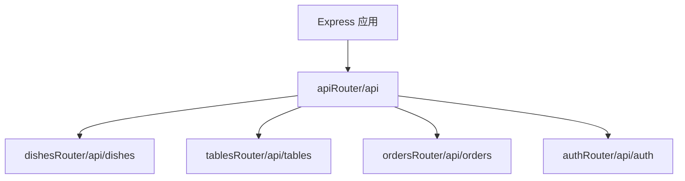
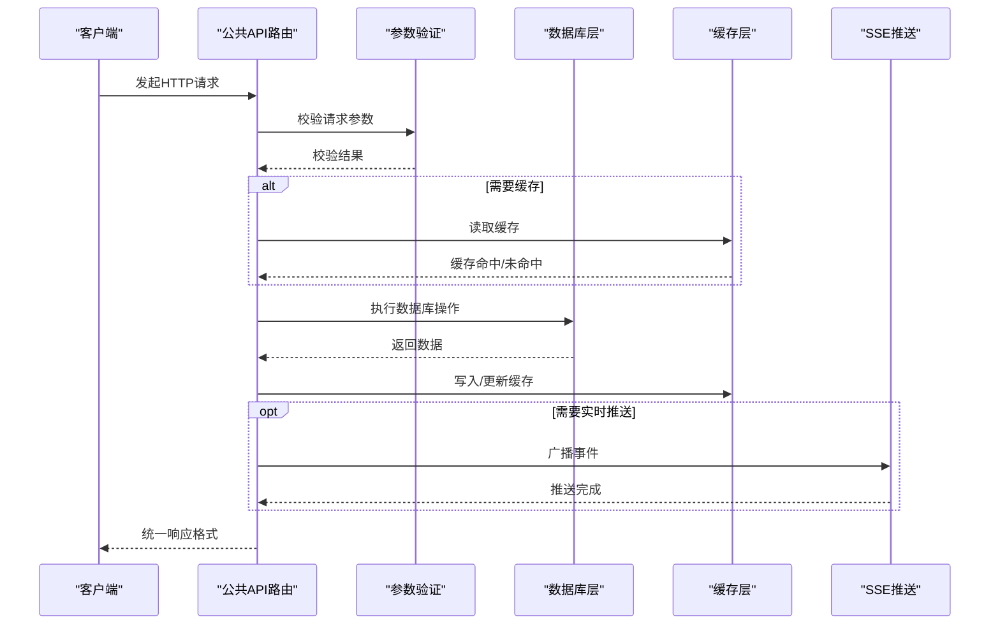
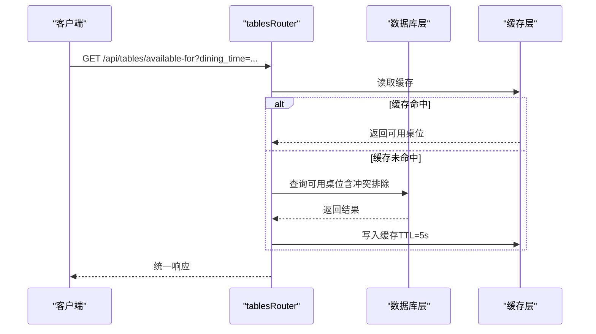
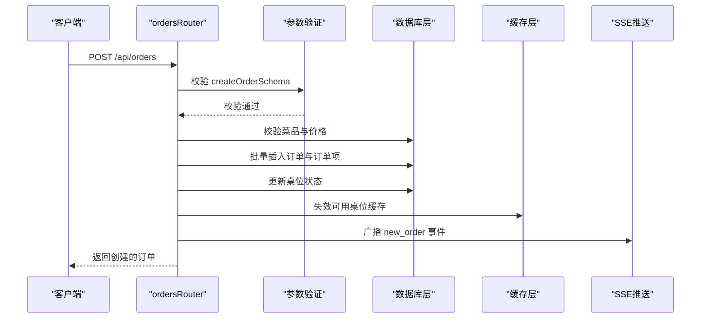
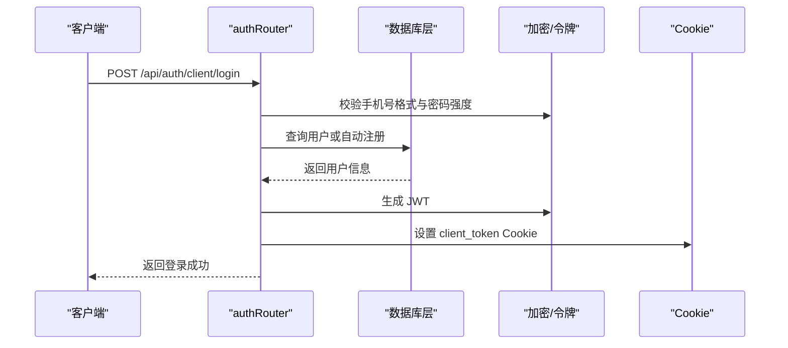
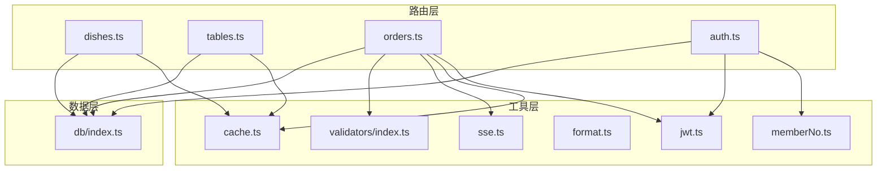

# 公共API路由

<cite>
**本文档引用的文件**
- [server/src/routes/index.ts](file://server/src/routes/index.ts)
- [server/src/routes/dishes.ts](file://server/src/routes/dishes.ts)
- [server/src/routes/tables.ts](file://server/src/routes/tables.ts)
- [server/src/routes/orders.ts](file://server/src/routes/orders.ts)
- [server/src/routes/auth.ts](file://server/src/routes/auth.ts)
- [server/src/utils/cache.ts](file://server/src/utils/cache.ts)
- [server/src/validators/index.ts](file://server/src/validators/index.ts)
- [server/src/utils/jwt.ts](file://server/src/utils/jwt.ts)
- [server/src/db/index.ts](file://server/src/db/index.ts)
- [server/src/utils/sse.ts](file://server/src/utils/sse.ts)
- [server/src/utils/format.ts](file://server/src/utils/format.ts)
- [server/src/utils/memberNo.ts](file://server/src/utils/memberNo.ts)
</cite>

## 目录
1. [简介](#简介)
2. [项目结构](#项目结构)
3. [核心组件](#核心组件)
4. [架构概览](#架构概览)
5. [详细组件分析](#详细组件分析)
6. [依赖关系分析](#依赖关系分析)
7. [性能考量](#性能考量)
8. [故障排除指南](#故障排除指南)
9. [结论](#结论)

## 简介
本文件为 RLRMS 餐厅管理系统公共 API 路由的详细技术文档。公共 API 主要面向客户端用户，提供菜品浏览、桌位查询、订单创建与管理、以及客户端认证等功能。系统采用 Express.js 构建，结合 SQLite 数据库、JWT Cookie 认证、Redis 缓存和服务器推送事件（SSE）等技术，确保高可用性和良好的用户体验。

## 项目结构
公共 API 路由位于 server/src/routes 目录下，按功能划分为独立模块：
- dishes：菜品管理（列表、详情、搜索、分类）
- tables：桌位管理（全部、可用、按时间段可用、详情）
- orders：订单管理（查询、创建、取消、修改、验证）
- auth：认证管理（管理员登录、登出、令牌验证；客户端登录、登出、令牌验证）

路由入口在 server/src/routes/index.ts 中统一挂载到 /api 前缀下，公共 API 路由包括：
- /api/dishes
- /api/tables
- /api/orders
- /api/auth



**图表来源**
- [server/src/routes/index.ts:1-18](file://server/src/routes/index.ts#L1-L18)

**章节来源**
- [server/src/routes/index.ts:1-18](file://server/src/routes/index.ts#L1-L18)

## 核心组件
- 路由聚合器：负责将各子路由挂载到统一前缀，区分公共与管理端 API。
- 数据访问层：封装 SQL.js 的数据库操作，提供 get、all、run、beginBatch/endBatch 等方法，支持批量事务与防抖保存。
- 缓存层：提供 TTL 内存缓存，减少重复查询开销，支持精确键与前缀失效。
- 参数验证：使用 Zod 对输入进行严格校验，保证数据一致性与安全性。
- 认证与会话：基于 JWT 的 Cookie 认证，支持管理员与客户端两类用户。
- 实时推送：通过 SSE 广播订单状态变更，提升管理端响应速度。

**章节来源**
- [server/src/db/index.ts:1-156](file://server/src/db/index.ts#L1-L156)
- [server/src/utils/cache.ts:1-73](file://server/src/utils/cache.ts#L1-L73)
- [server/src/validators/index.ts:1-123](file://server/src/validators/index.ts#L1-L123)
- [server/src/utils/jwt.ts:1-27](file://server/src/utils/jwt.ts#L1-L27)
- [server/src/utils/sse.ts:1-59](file://server/src/utils/sse.ts#L1-L59)

## 架构概览
公共 API 的整体架构围绕“路由 -> 业务逻辑 -> 数据访问 -> 缓存/数据库”的链路展开。请求流程通常包含参数校验、权限检查、业务规则验证、数据库读写与缓存更新，最终返回统一格式的响应。



**图表来源**
- [server/src/routes/dishes.ts:24-65](file://server/src/routes/dishes.ts#L24-L65)
- [server/src/routes/tables.ts:24-55](file://server/src/routes/tables.ts#L24-L55)
- [server/src/routes/orders.ts:194-354](file://server/src/routes/orders.ts#L194-L354)
- [server/src/utils/cache.ts:18-36](file://server/src/utils/cache.ts#L18-L36)
- [server/src/db/index.ts:101-140](file://server/src/db/index.ts#L101-L140)
- [server/src/utils/sse.ts:37-51](file://server/src/utils/sse.ts#L37-L51)

## 详细组件分析

### 菜品管理（/api/dishes）
- 设计原则
  - RESTful 端点：GET /api/dishes、GET /api/dishes/:id、GET /api/dishes/home-data、GET /api/dishes/search/query、GET /api/dishes/categories/all
  - 缓存策略：对列表、首页聚合数据、分类进行缓存，减少数据库压力
  - 安全与健壮性：对 JSON 字段进行安全解析，异常捕获并返回统一错误
- 关键功能
  - 获取菜品列表：支持按分类过滤，返回精简字段
  - 获取首页数据：一次性返回分类与菜品聚合数据，降低网络往返
  - 搜索菜品：模糊匹配菜品名称，返回精简字段
  - 获取分类：返回排序后的分类列表
  - 获取菜品详情：按 ID 查询完整信息，解析 JSON 字段
- 参数与响应
  - 查询参数：category（字符串）、q（字符串）、id（UUID）
  - 统一响应：success（布尔）、data（对象/数组）、error（可选）
- 性能优化
  - 缓存键命名规范：CACHE_KEYS.DISHES_LIST、CACHE_KEYS.DISHES_HOME、CACHE_KEYS.CATEGORIES
  - 预编译 SQL 与参数绑定，避免 SQL 注入
- 错误处理
  - 500 错误：数据库异常
  - 404 错误：菜品不存在
  - 400 错误：参数非法

```mermaid
flowchart TD
Start(["请求进入 /api/dishes"]) --> Route{"路由匹配"}
Route --> |"/" 或 "/:id"| ListOrDetail["查询菜品列表/详情"]
Route --> |"/home-data"| HomeData["查询首页聚合数据"]
Route --> |"/search/query"| Search["模糊搜索菜品"]
Route --> |"/categories/all"| Categories["查询分类列表"]
ListOrDetail --> CacheCheck{"缓存命中？"}
HomeData --> CacheCheck
Search --> CacheCheck
Categories --> CacheCheck
CacheCheck --> |是| ReturnCache["返回缓存数据"]
CacheCheck --> |否| QueryDB["执行数据库查询"]
QueryDB --> ParseJSON["安全解析 JSON 字段"]
ParseJSON --> CacheSet["写入缓存"]
CacheSet --> ReturnOK["返回成功响应"]
ReturnCache --> End(["结束"])
ReturnOK --> End
```

**图表来源**
- [server/src/routes/dishes.ts:24-215](file://server/src/routes/dishes.ts#L24-L215)
- [server/src/utils/cache.ts:64-72](file://server/src/utils/cache.ts#L64-L72)

**章节来源**
- [server/src/routes/dishes.ts:1-216](file://server/src/routes/dishes.ts#L1-L216)
- [server/src/utils/cache.ts:1-73](file://server/src/utils/cache.ts#L1-L73)

### 桌位管理（/api/tables）
- 设计原则
  - RESTful 端点：GET /api/tables、GET /api/tables/:id、GET /api/tables/available、GET /api/tables/available-for
  - 实时性：可用桌位查询带短 TTL 缓存，确保状态及时更新
  - 业务规则：预留桌位需检查同一就餐时段的冲突
- 关键功能
  - 获取全部桌位：按编号排序返回
  - 获取可用桌位：status=available 或 status=reserved 且无同时段活动订单
  - 按时间段获取可用桌位：根据 dining_time 参数查询
  - 获取桌位详情：按 ID 查询
- 参数与响应
  - 查询参数：dining_time（字符串）、id（UUID）
  - 统一响应：success（布尔）、data（对象/数组）、error（可选）
- 性能优化
  - 缓存键命名规范：CACHE_KEYS.TABLES_AVAILABLE、CACHE_KEYS.TABLES_AVAILABLE_FOR_PREFIX
  - 短 TTL（5 秒）确保数据新鲜度
- 错误处理
  - 500 错误：数据库异常
  - 404 错误：桌位不存在
  - 400 错误：缺少必要参数



**图表来源**
- [server/src/routes/tables.ts:24-55](file://server/src/routes/tables.ts#L24-L55)
- [server/src/utils/cache.ts:64-72](file://server/src/utils/cache.ts#L64-L72)

**章节来源**
- [server/src/routes/tables.ts:1-93](file://server/src/routes/tables.ts#L1-L93)
- [server/src/utils/cache.ts:1-73](file://server/src/utils/cache.ts#L1-L73)

### 订单管理（/api/orders）
- 设计原则
  - 客户端认证：所有订单相关接口均要求客户端登录（client_token Cookie）
  - 价格安全：服务端批量验证菜品并重新计算价格，防止客户端篡改
  - 状态机：支持 pending、confirmed、completed、cancelled 状态
  - 实时推送：新订单与状态变更通过 SSE 广播给管理端
- 关键功能
  - 查询订单：按联系人手机号查询历史订单，批量加载订单项
  - 创建订单：校验桌位可用性、菜品有效性与价格，批量写入订单与订单项
  - 取消订单：5 分钟内且状态为 pending 可取消，恢复桌位状态
  - 修改订单：支持新增/删减菜品，记录差异（order_modifications）
  - 订单验证：批量验证订单 ID 是否存在
- 参数与响应
  - 请求体：createOrderSchema、cancelOrderSchema、updateOrderItemsSchema
  - 查询参数：phone（字符串）
  - 统一响应：success（布尔）、data（对象/数组）、error（可选）
- 安全与访问控制
  - 客户端身份验证中间件：校验 client_token，确认用户存在且角色为 customer
  - 手机号验证：取消订单时要求请求体提供手机号并与订单匹配
- 性能优化
  - 批量事务：beginBatch/endBatch 减少磁盘写入次数
  - 缓存失效：订单状态变更后失效相关缓存键
  - N+1 避免：批量查询订单项，按订单 ID 分组
- 错误处理
  - 401 错误：未登录或登录过期
  - 403 错误：手机号与订单不匹配
  - 400 错误：参数非法、桌位冲突、超时取消、状态不可修改
  - 500 错误：数据库异常



**图表来源**
- [server/src/routes/orders.ts:194-354](file://server/src/routes/orders.ts#L194-L354)
- [server/src/validators/index.ts:6-19](file://server/src/validators/index.ts#L6-L19)
- [server/src/utils/cache.ts:41-43](file://server/src/utils/cache.ts#L41-L43)
- [server/src/utils/sse.ts:37-51](file://server/src/utils/sse.ts#L37-L51)

**章节来源**
- [server/src/routes/orders.ts:1-616](file://server/src/routes/orders.ts#L1-L616)
- [server/src/validators/index.ts:1-123](file://server/src/validators/index.ts#L1-L123)
- [server/src/utils/cache.ts:1-73](file://server/src/utils/cache.ts#L1-L73)
- [server/src/utils/sse.ts:1-59](file://server/src/utils/sse.ts#L1-L59)

### 认证相关（/api/auth）
- 设计原则
  - 管理员认证：基于用户名/密码登录，生成 admin_token Cookie，有效期 1 天
  - 客户端认证：手机号+密码登录或自动注册，生成 client_token Cookie，有效期 7 天
  - 登录防护：IP 级限流（15 分钟最多 5 次），失败清零
  - 令牌验证：支持验证管理员与客户端令牌，自动清理失效用户
- 关键功能
  - 管理员登录：校验用户名与密码，签发 JWT 并设置 Cookie
  - 管理员登出：清除 admin_token Cookie
  - 管理员令牌验证：校验 Cookie 中的 JWT
  - 客户端登录/自动注册：校验手机号格式与密码强度，自动注册并签发 JWT
  - 客户端登出：清除 client_token Cookie
  - 客户端令牌验证：校验 Cookie 中的 JWT，并确认用户存在
  - 修改密码：管理员端口令修改
- 参数与响应
  - 请求体：管理员登录（username、password）、客户端登录（phone、password）、修改密码（oldPassword、newPassword）
  - 统一响应：success（布尔）、data（对象/数组）、error（可选）
- 安全与访问控制
  - Cookie 属性：httpOnly、secure（生产环境）、sameSite=lax、路径 /
  - JWT 密钥：开发模式基于主机特征派生，生产模式支持环境变量覆盖
  - 速率限制：每 IP 15 分钟最多 5 次尝试
- 错误处理
  - 429 错误：登录尝试过多
  - 401 错误：未提供令牌、令牌无效、用户不存在或被删除
  - 400 错误：参数非法、手机号格式错误、密码长度不足
  - 500 错误：内部错误



**图表来源**
- [server/src/routes/auth.ts:181-294](file://server/src/routes/auth.ts#L181-L294)
- [server/src/utils/jwt.ts:11-22](file://server/src/utils/jwt.ts#L11-L22)

**章节来源**
- [server/src/routes/auth.ts:1-405](file://server/src/routes/auth.ts#L1-L405)
- [server/src/utils/jwt.ts:1-27](file://server/src/utils/jwt.ts#L1-L27)
- [server/src/utils/memberNo.ts:1-19](file://server/src/utils/memberNo.ts#L1-L19)

## 依赖关系分析
- 路由模块依赖
  - dishes/tables/orders/auth 路由依赖数据库层（get、all、run、beginBatch、endBatch）
  - 订单模块依赖参数验证（Zod Schema）、SSE 广播、JWT 工具、缓存工具
  - 认证模块依赖 JWT 工具、手机号格式校验、会员号生成
- 外部依赖
  - sql.js：SQLite 内存数据库，支持 WebAssembly
  - express：Web 框架
  - zod：运行时类型检查与参数验证
  - bcryptjs：密码哈希
  - uuid：生成唯一标识符
  - jsonwebtoken：JWT 生成与验证



**图表来源**
- [server/src/routes/dishes.ts:1-216](file://server/src/routes/dishes.ts#L1-L216)
- [server/src/routes/tables.ts:1-93](file://server/src/routes/tables.ts#L1-L93)
- [server/src/routes/orders.ts:1-616](file://server/src/routes/orders.ts#L1-L616)
- [server/src/routes/auth.ts:1-405](file://server/src/routes/auth.ts#L1-L405)
- [server/src/db/index.ts:1-156](file://server/src/db/index.ts#L1-L156)
- [server/src/utils/cache.ts:1-73](file://server/src/utils/cache.ts#L1-L73)
- [server/src/validators/index.ts:1-123](file://server/src/validators/index.ts#L1-L123)
- [server/src/utils/jwt.ts:1-27](file://server/src/utils/jwt.ts#L1-L27)
- [server/src/utils/sse.ts:1-59](file://server/src/utils/sse.ts#L1-L59)
- [server/src/utils/format.ts:1-12](file://server/src/utils/format.ts#L1-L12)
- [server/src/utils/memberNo.ts:1-19](file://server/src/utils/memberNo.ts#L1-L19)

**章节来源**
- [server/src/routes/index.ts:1-18](file://server/src/routes/index.ts#L1-L18)
- [server/src/db/index.ts:1-156](file://server/src/db/index.ts#L1-L156)

## 性能考量
- 缓存策略
  - TTL 内存缓存：菜品列表、首页聚合数据、分类、可用桌位（短 TTL）
  - 缓存键前缀：支持批量失效，如 tables:available-for:
- 数据库优化
  - 防抖保存：批量写入合并，减少磁盘 IO
  - 批处理事务：beginBatch/endBatch 包裹多步写入
  - 预编译语句与参数绑定：避免 SQL 注入与重复解析
- 网络与实时性
  - SSE 广播：低延迟通知管理端订单状态变更
  - 统一响应格式：简化前端处理，减少解析成本
- 安全与稳定性
  - 速率限制：防止暴力破解
  - 参数验证：Zod 提前拦截非法输入
  - 异常捕获：统一错误响应，避免泄露内部细节

[本节为通用性能建议，不直接分析具体文件]

## 故障排除指南
- 常见错误与排查
  - 401 未授权：检查 client_token/admin_token 是否存在、是否过期、是否被删除
  - 403 权限拒绝：确认手机号与订单匹配、用户角色正确
  - 400 参数错误：核对请求体格式与长度、枚举值、UUID 格式
  - 404 资源不存在：确认 ID 存在、表名/字段拼写
  - 500 服务器错误：查看日志，检查数据库连接与缓存状态
- 缓存问题
  - 缓存未命中：确认缓存键是否正确、TTL 是否过期
  - 缓存污染：调用缓存失效函数或前缀失效
- 数据库问题
  - 事务未提交：确保 beginBatch/endBatch 成对出现
  - 写入失败：检查磁盘空间与权限
- 实时推送问题
  - SSE 客户端断开：检查客户端连接状态与网络
  - 广播失败：确认客户端可写，清理不可写连接

**章节来源**
- [server/src/routes/orders.ts:24-49](file://server/src/routes/orders.ts#L24-L49)
- [server/src/routes/auth.ts:65-144](file://server/src/routes/auth.ts#L65-L144)
- [server/src/utils/cache.ts:41-54](file://server/src/utils/cache.ts#L41-L54)
- [server/src/db/index.ts:47-60](file://server/src/db/index.ts#L47-L60)
- [server/src/utils/sse.ts:37-51](file://server/src/utils/sse.ts#L37-L51)

## 结论
RLRMS 的公共 API 通过清晰的路由划分、严格的参数验证、完善的缓存与数据库优化、以及安全的认证与实时推送机制，构建了稳定高效的客户端服务。建议在生产环境中：
- 明确 JWT_SECRET 环境变量，确保令牌持久性
- 监控缓存命中率与数据库写入频率
- 定期审查订单状态机与取消策略
- 加强日志审计与异常告警