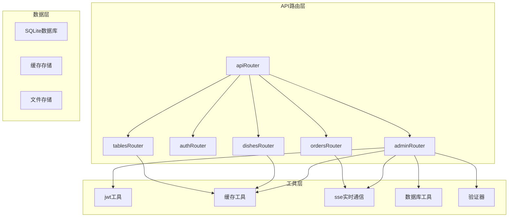
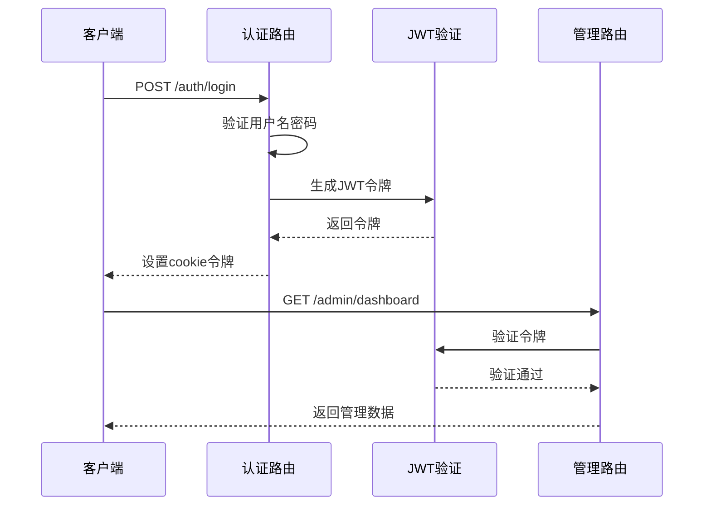
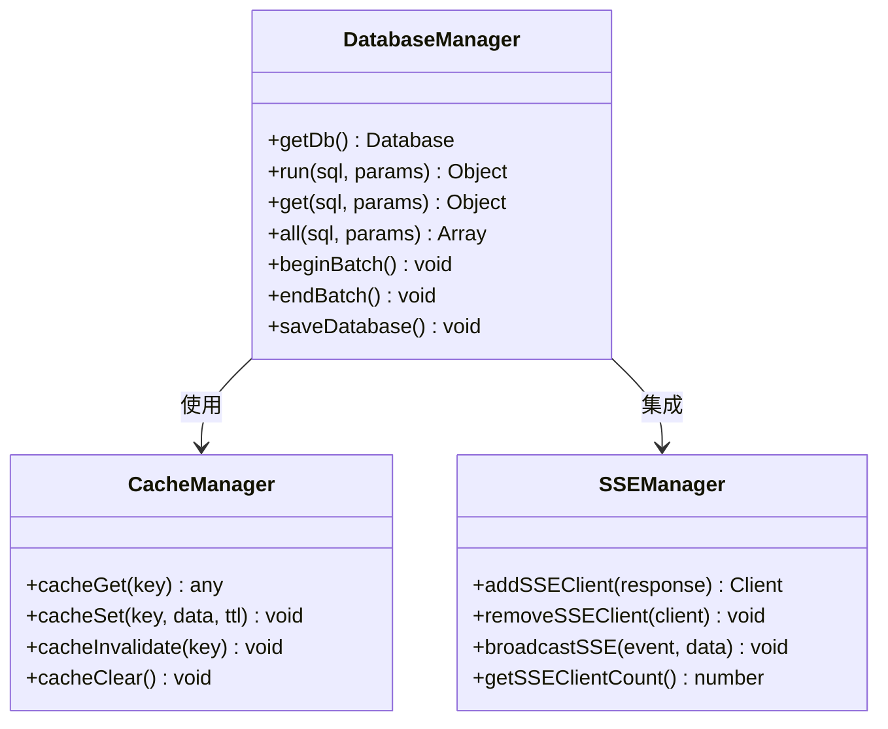
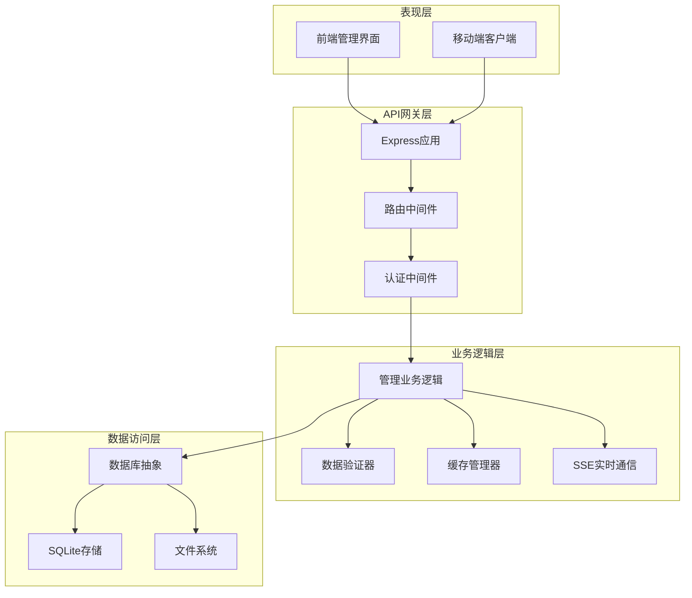
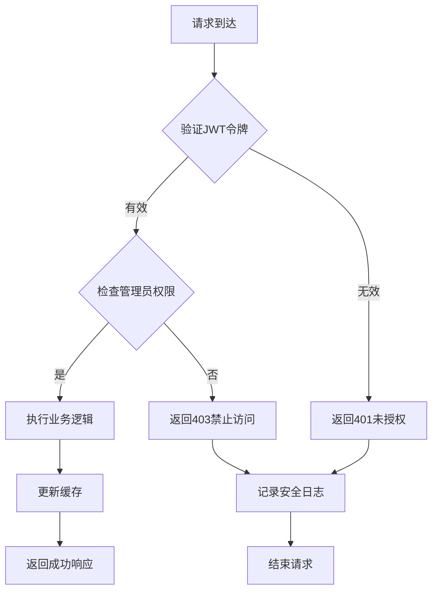
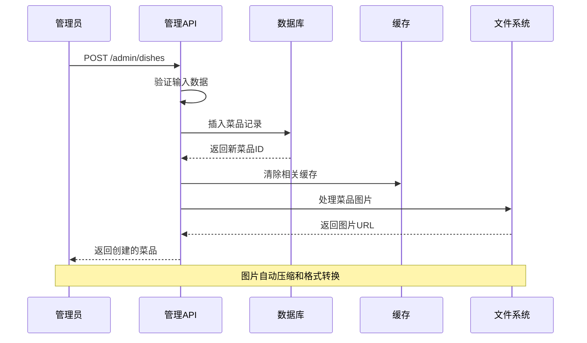
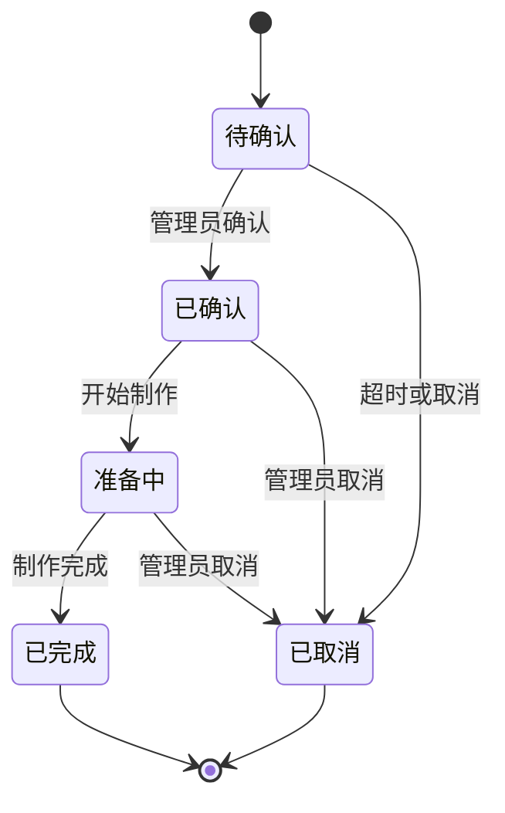
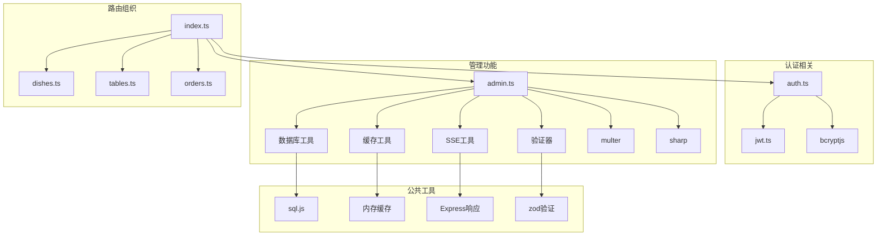

# 管理API路由

<cite>
**本文档引用的文件**
- [server/src/routes/admin.ts](file://server/src/routes/admin.ts)
- [server/src/routes/auth.ts](file://server/src/routes/auth.ts)
- [server/src/utils/jwt.ts](file://server/src/utils/jwt.ts)
- [server/src/routes/index.ts](file://server/src/routes/index.ts)
- [server/src/db/index.ts](file://server/src/db/index.ts)
- [server/src/utils/cache.ts](file://server/src/utils/cache.ts)
- [server/src/utils/sse.ts](file://server/src/utils/sse.ts)
- [server/src/validators/index.ts](file://server/src/validators/index.ts)
- [server/src/routes/orders.ts](file://server/src/routes/orders.ts)
- [server/src/routes/dishes.ts](file://server/src/routes/dishes.ts)
- [server/src/routes/tables.ts](file://server/src/routes/tables.ts)
</cite>

## 目录
1. [简介](#简介)
2. [项目结构](#项目结构)
3. [核心组件](#核心组件)
4. [架构概览](#架构概览)
5. [详细组件分析](#详细组件分析)
6. [依赖关系分析](#依赖关系分析)
7. [性能考虑](#性能考虑)
8. [故障排除指南](#故障排除指南)
9. [结论](#结论)

## 简介

RLRMS餐厅管理系统管理API路由是整个系统的核心控制层，负责提供餐厅管理后台的完整RESTful API接口。该系统采用Express.js框架构建，实现了完整的管理员认证、系统管理、数据管理和实时通信功能。

系统的主要设计原则包括：
- **安全性优先**：基于JWT的强认证机制和严格的权限控制
- **数据完整性**：完整的CRUD操作和数据验证
- **性能优化**：智能缓存策略和批量操作支持
- **可扩展性**：模块化的路由组织和清晰的职责分离
- **实时性**：基于Server-Sent Events的实时推送功能

## 项目结构

管理API路由采用模块化组织方式，主要分为以下几个核心模块：

**图表来源**
- [server/src/routes/index.ts:1-18](file://server/src/routes/index.ts#L1-L18)
- [server/src/routes/admin.ts:107-131](file://server/src/routes/admin.ts#L107-L131)

**章节来源**
- [server/src/routes/index.ts:1-18](file://server/src/routes/index.ts#L1-L18)
- [server/src/routes/admin.ts:107-131](file://server/src/routes/admin.ts#L107-L131)

## 核心组件

### 管理员认证中间件

系统实现了基于JWT的管理员认证机制，确保只有授权管理员才能访问管理API。

**图表来源**
- [server/src/routes/auth.ts:65-144](file://server/src/routes/auth.ts#L65-L144)
- [server/src/routes/admin.ts:116-131](file://server/src/routes/admin.ts#L116-L131)

### 数据库抽象层

系统使用SQLite作为数据存储，通过统一的数据库抽象层提供CRUD操作。

**图表来源**
- [server/src/db/index.ts:93-156](file://server/src/db/index.ts#L93-L156)
- [server/src/utils/cache.ts:18-61](file://server/src/utils/cache.ts#L18-L61)
- [server/src/utils/sse.ts:15-59](file://server/src/utils/sse.ts#L15-L59)

**章节来源**
- [server/src/db/index.ts:1-156](file://server/src/db/index.ts#L1-L156)
- [server/src/utils/cache.ts:1-73](file://server/src/utils/cache.ts#L1-L73)
- [server/src/utils/sse.ts:1-59](file://server/src/utils/sse.ts#L1-L59)

## 架构概览

管理API采用分层架构设计，确保关注点分离和代码可维护性：

**图表来源**
- [server/src/routes/index.ts:8-18](file://server/src/routes/index.ts#L8-L18)
- [server/src/routes/admin.ts:116-131](file://server/src/routes/admin.ts#L116-L131)

## 详细组件分析

### 管理员管理模块

管理员管理模块提供了完整的用户生命周期管理功能：

#### 权限控制机制

**图表来源**
- [server/src/routes/admin.ts:116-131](file://server/src/routes/admin.ts#L116-L131)
- [server/src/utils/jwt.ts:20-26](file://server/src/utils/jwt.ts#L20-L26)

#### 用户管理CRUD操作

管理员可以进行以下用户管理操作：
- **创建用户**：支持管理员和客户两种角色
- **更新用户**：可修改密码、角色、个人信息
- **删除用户**：包含安全检查和约束验证
- **查询用户**：支持分页和排序

**章节来源**
- [server/src/routes/admin.ts:995-1141](file://server/src/routes/admin.ts#L995-L1141)
- [server/src/validators/index.ts:96-109](file://server/src/validators/index.ts#L96-L109)

### 菜品管理模块

菜品管理模块实现了完整的菜单管理功能：

#### 菜品CRUD操作

**图表来源**
- [server/src/routes/admin.ts:374-429](file://server/src/routes/admin.ts#L374-L429)
- [server/src/utils/cache.ts:64-72](file://server/src/utils/cache.ts#L64-L72)

#### 批量操作支持

系统支持多种批量操作：
- **批量排序**：支持拖拽排序和批量更新
- **批量删除**：安全的批量删除操作
- **批量导入**：支持从ZIP文件批量导入数据

**章节来源**
- [server/src/routes/admin.ts:433-454](file://server/src/routes/admin.ts#L433-L454)
- [server/src/routes/admin.ts:1358-1677](file://server/src/routes/admin.ts#L1358-L1677)

### 订单管理模块

订单管理模块提供了完整的订单生命周期管理：

#### 订单状态流转

**图表来源**
- [server/src/routes/admin.ts:795-833](file://server/src/routes/admin.ts#L795-L833)

#### 实时订单监控

系统通过SSE实现实时订单状态更新：
- **新订单通知**：自动推送新订单信息
- **状态变更通知**：订单状态变化实时提醒
- **心跳保活**：维持长连接稳定

**章节来源**
- [server/src/utils/sse.ts:37-51](file://server/src/utils/sse.ts#L37-L51)
- [server/src/routes/admin.ts:134-162](file://server/src/routes/admin.ts#L134-L162)

### 数据导入导出模块

系统提供了完整的数据备份和恢复功能：

#### 数据导出流程

**图表来源**
- [server/src/routes/admin.ts:1686-1782](file://server/src/routes/admin.ts#L1686-L1782)

#### 数据导入验证

系统在导入过程中执行多重验证：
- **文件结构验证**：确保ZIP文件包含必需文件
- **数据格式验证**：验证JSON数据格式正确性
- **引用完整性验证**：检查外键关系一致性
- **安全扫描**：检测潜在的安全风险

**章节来源**
- [server/src/routes/admin.ts:1428-1677](file://server/src/routes/admin.ts#L1428-L1677)

## 依赖关系分析

管理API路由之间的依赖关系体现了清晰的模块化设计：

**图表来源**
- [server/src/routes/index.ts:1-18](file://server/src/routes/index.ts#L1-L18)
- [server/src/routes/admin.ts:1-17](file://server/src/routes/admin.ts#L1-L17)

**章节来源**
- [server/src/routes/index.ts:1-18](file://server/src/routes/index.ts#L1-L18)
- [server/src/utils/jwt.ts:1-27](file://server/src/utils/jwt.ts#L1-L27)

## 性能考虑

系统在多个层面实现了性能优化：

### 缓存策略

- **智能缓存**：针对不频繁变化的数据使用内存缓存
- **缓存失效**：数据变更时自动清除相关缓存
- **TTL管理**：合理的缓存过期时间平衡性能和一致性

### 批量操作

- **事务批处理**：大量数据操作使用批量事务提高性能
- **防抖保存**：数据库写入操作进行防抖合并
- **延迟保存**：批量操作结束后统一保存数据库

### 数据库优化

- **索引优化**：关键查询字段建立适当索引
- **预编译语句**：使用预编译语句提高查询性能
- **连接池管理**：合理管理数据库连接资源

## 故障排除指南

### 常见问题及解决方案

#### 认证相关问题

**问题**：管理员登录失败
- 检查用户名密码是否正确
- 确认用户角色为admin
- 验证JWT密钥配置

**问题**：令牌过期或无效
- 检查cookie设置是否正确
- 验证JWT签名密钥
- 确认令牌过期时间设置

#### 数据操作问题

**问题**：菜品图片上传失败
- 检查文件大小限制（5MB）
- 验证文件类型（JPEG/PNG/GIF/WebP）
- 确认磁盘空间充足

**问题**：批量导入失败
- 验证ZIP文件结构完整性
- 检查JSON数据格式正确性
- 确认数据库权限足够

#### 性能问题

**问题**：API响应缓慢
- 检查缓存命中率
- 监控数据库查询性能
- 验证批量操作是否正确使用

**章节来源**
- [server/src/routes/auth.ts:65-144](file://server/src/routes/auth.ts#L65-L144)
- [server/src/routes/admin.ts:1272-1318](file://server/src/routes/admin.ts#L1272-L1318)

## 结论

RLRMS餐厅管理系统的管理API路由展现了现代Web应用的最佳实践：

### 设计优势

- **安全性**：完善的认证授权机制和数据验证
- **可扩展性**：模块化设计便于功能扩展
- **性能**：多层缓存和批量操作优化
- **可靠性**：完整的错误处理和故障恢复机制

### 技术亮点

- **JWT认证**：基于令牌的无状态认证
- **实时通信**：SSE实现的实时订单监控
- **数据保护**：完整的数据导入导出备份
- **性能优化**：智能缓存和批量处理

### 改进建议

- **监控增强**：添加更详细的API使用统计
- **日志完善**：增强安全事件和错误日志
- **测试覆盖**：增加单元测试和集成测试
- **文档更新**：持续完善API文档和使用示例

该系统为餐厅管理提供了完整的技术解决方案，具有良好的可维护性和扩展性，能够满足中小型餐厅的管理需求。