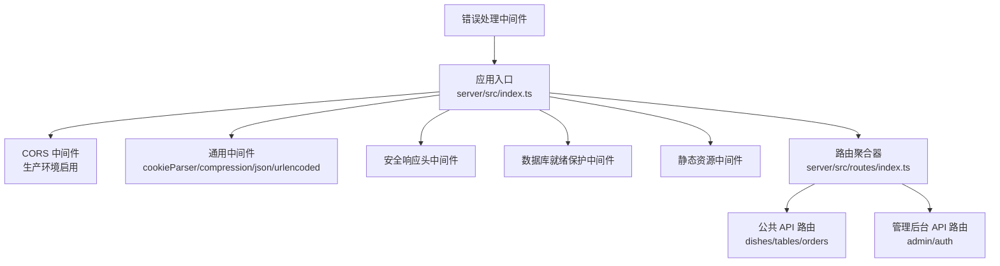
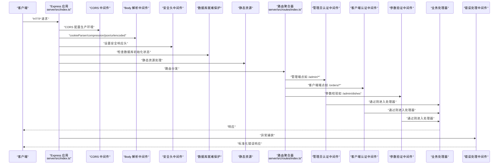
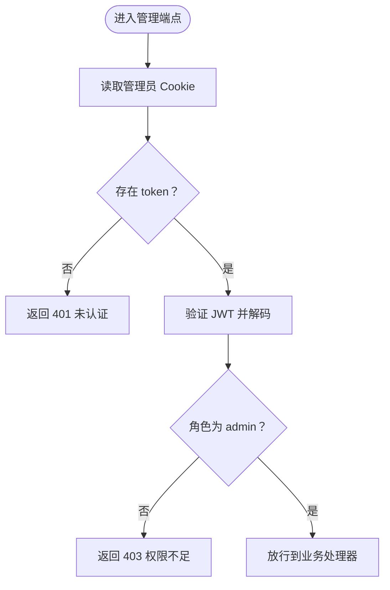
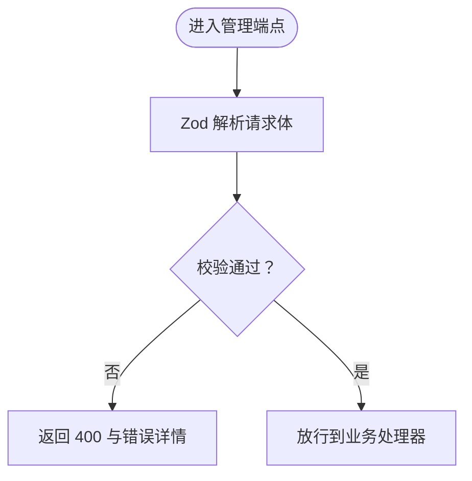
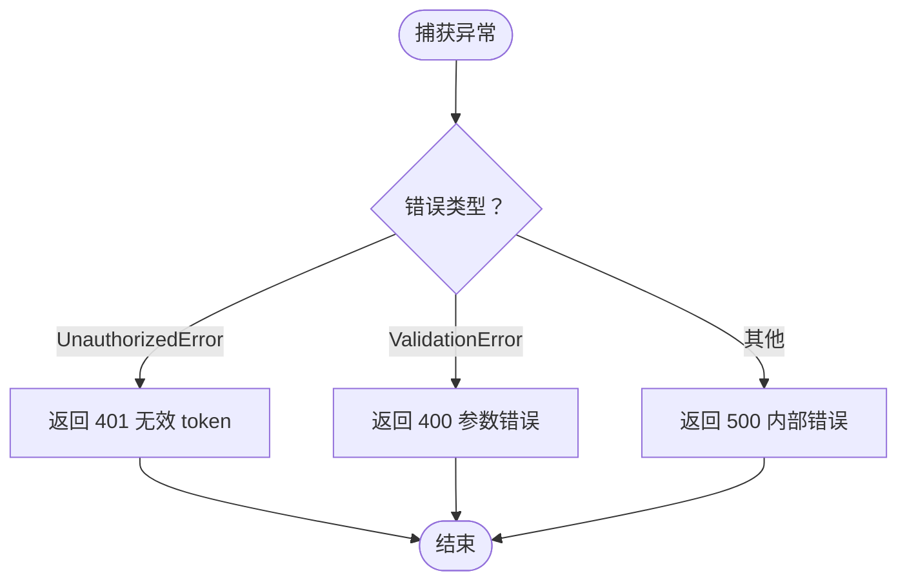
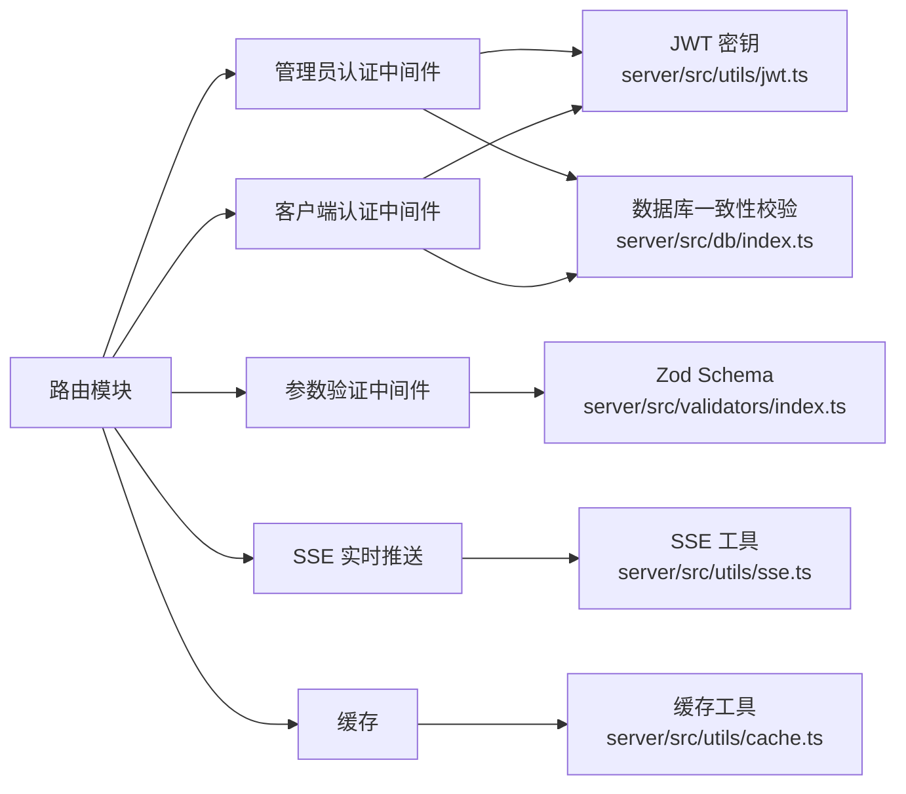

# 路由中间件

<cite>
**本文引用的文件**
- [server/src/index.ts](file://server/src/index.ts)
- [server/src/routes/index.ts](file://server/src/routes/index.ts)
- [server/src/routes/admin.ts](file://server/src/routes/admin.ts)
- [server/src/routes/auth.ts](file://server/src/routes/auth.ts)
- [server/src/routes/orders.ts](file://server/src/routes/orders.ts)
- [server/src/routes/dishes.ts](file://server/src/routes/dishes.ts)
- [server/src/routes/tables.ts](file://server/src/routes/tables.ts)
- [server/src/utils/jwt.ts](file://server/src/utils/jwt.ts)
- [server/src/utils/cache.ts](file://server/src/utils/cache.ts)
- [server/src/utils/sse.ts](file://server/src/utils/sse.ts)
- [server/src/db/index.ts](file://server/src/db/index.ts)
- [server/src/validators/index.ts](file://server/src/validators/index.ts)
- [server/src/dev-server.ts](file://server/src/dev-server.ts)
</cite>

## 目录
1. [简介](#简介)
2. [项目结构](#项目结构)
3. [核心组件](#核心组件)
4. [架构总览](#架构总览)
5. [详细组件分析](#详细组件分析)
6. [依赖关系分析](#依赖关系分析)
7. [性能考量](#性能考量)
8. [故障排查指南](#故障排查指南)
9. [结论](#结论)
10. [附录](#附录)

## 简介
本文件聚焦 RLRMS 餐厅管理系统后端的“路由中间件”体系，系统性阐述：
- 在 API 路由中各中间件的作用与执行顺序
- 认证中间件（管理员、客户端）、参数验证中间件、权限控制中间件的实现与协作
- 错误处理中间件与 CORS 配置
- 中间件链的组合使用与性能优化策略
- 中间件扩展与自定义的最佳实践

## 项目结构
后端采用 Express 应用，统一在入口处配置全局中间件（CORS、压缩、JSON/URL 编码、安全头、健康检查、静态资源、错误处理），并通过路由聚合器将公共 API 与管理后台 API 分层挂载。

图表来源
- [server/src/index.ts:34-143](file://server/src/index.ts#L34-L143)
- [server/src/routes/index.ts:1-18](file://server/src/routes/index.ts#L1-L18)

章节来源
- [server/src/index.ts:34-143](file://server/src/index.ts#L34-L143)
- [server/src/routes/index.ts:1-18](file://server/src/routes/index.ts#L1-L18)

## 核心组件
- 全局中间件链
  - CORS：生产环境按环境变量配置来源与凭证
  - Cookie 解析、Gzip 压缩（SSE 不压缩）
  - JSON/URL 编码大小限制
  - 安全响应头（X-Content-Type-Options、X-Frame-Options、X-XSS-Protection、Referrer-Policy）
  - 数据库就绪保护（非 /health 请求在初始化期间返回 503）
  - 静态资源托管（前端构建产物与图片源）
  - 错误处理中间件（统一拦截 401/400/500 与堆栈输出）
- 路由级中间件
  - 管理员认证中间件（校验管理员 token，角色限制）
  - 客户端认证中间件（校验客户 token，数据库一致性校验）
  - 参数验证中间件（基于 Zod Schema 的输入校验）
  - 权限控制中间件（如仅管理员可访问管理端点）

章节来源
- [server/src/index.ts:38-140](file://server/src/index.ts#L38-L140)
- [server/src/routes/admin.ts:115-131](file://server/src/routes/admin.ts#L115-L131)
- [server/src/routes/orders.ts:24-49](file://server/src/routes/orders.ts#L24-L49)
- [server/src/validators/index.ts:1-123](file://server/src/validators/index.ts#L1-L123)

## 架构总览
下图展示中间件在请求生命周期中的位置与调用顺序，以及与路由模块的交互。

图表来源
- [server/src/index.ts:38-140](file://server/src/index.ts#L38-L140)
- [server/src/routes/index.ts:1-18](file://server/src/routes/index.ts#L1-L18)
- [server/src/routes/admin.ts:115-131](file://server/src/routes/admin.ts#L115-L131)
- [server/src/routes/orders.ts:24-49](file://server/src/routes/orders.ts#L24-L49)
- [server/src/validators/index.ts:1-123](file://server/src/validators/index.ts#L1-L123)

## 详细组件分析

### 认证中间件
- 管理员认证中间件
  - 作用：从 Cookie 读取管理员 token，解码并校验角色是否为管理员；若失败返回 401/403
  - 位置：管理后台路由（/admin/*）的前置中间件
  - 关键实现参考：[server/src/routes/admin.ts:115-131](file://server/src/routes/admin.ts#L115-L131)
- 客户端认证中间件
  - 作用：从 Cookie 读取客户 token，解码并确认用户仍存在于数据库；通过后将用户信息注入请求上下文
  - 位置：客户端相关路由（/orders/*）的前置中间件
  - 关键实现参考：[server/src/routes/orders.ts:24-49](file://server/src/routes/orders.ts#L24-L49)
- JWT 密钥管理
  - 开发环境：基于主机特征派生固定密钥，保证热重载不使旧 token 失效
  - 生产环境：支持显式环境变量或动态密钥（每次启动不同），建议生产环境设置固定密钥
  - 关键实现参考：[server/src/utils/jwt.ts:1-27](file://server/src/utils/jwt.ts#L1-L27)

图表来源
- [server/src/routes/admin.ts:115-131](file://server/src/routes/admin.ts#L115-L131)

章节来源
- [server/src/routes/admin.ts:115-131](file://server/src/routes/admin.ts#L115-L131)
- [server/src/routes/orders.ts:24-49](file://server/src/routes/orders.ts#L24-L49)
- [server/src/utils/jwt.ts:1-27](file://server/src/utils/jwt.ts#L1-L27)

### 参数验证中间件
- 设计：使用 Zod Schema 对请求体进行强类型校验，失败时返回 400 与具体错误消息
- 典型场景：
  - 管理端新增/更新菜品、桌位、分类、库存、订单状态等
  - 客户端下单、修改订单、取消订单等
- 关键实现参考：
  - 管理端参数校验：[server/src/validators/index.ts:1-123](file://server/src/validators/index.ts#L1-L123)
  - 管理端路由中的校验与错误处理：[server/src/routes/admin.ts:374-383](file://server/src/routes/admin.ts#L374-L383)、[server/src/routes/admin.ts:456-467](file://server/src/routes/admin.ts#L456-L467)
  - 客户端路由中的校验与错误处理：[server/src/routes/orders.ts:198-204](file://server/src/routes/orders.ts#L198-L204)、[server/src/routes/orders.ts:427-433](file://server/src/routes/orders.ts#L427-L433)

图表来源
- [server/src/validators/index.ts:1-123](file://server/src/validators/index.ts#L1-L123)
- [server/src/routes/admin.ts:374-383](file://server/src/routes/admin.ts#L374-L383)

章节来源
- [server/src/validators/index.ts:1-123](file://server/src/validators/index.ts#L1-L123)
- [server/src/routes/admin.ts:374-383](file://server/src/routes/admin.ts#L374-L383)
- [server/src/routes/admin.ts:456-467](file://server/src/routes/admin.ts#L456-L467)
- [server/src/routes/orders.ts:198-204](file://server/src/routes/orders.ts#L198-L204)
- [server/src/routes/orders.ts:427-433](file://server/src/routes/orders.ts#L427-L433)

### 权限控制中间件
- 管理端点权限：仅管理员可访问（管理员认证中间件）
- 客户端端点权限：仅登录客户可访问（客户端认证中间件）
- 两者互斥且独立，分别保护不同领域
- 关键实现参考：
  - 管理员认证中间件：[server/src/routes/admin.ts:115-131](file://server/src/routes/admin.ts#L115-L131)
  - 客户端认证中间件：[server/src/routes/orders.ts:24-49](file://server/src/routes/orders.ts#L24-L49)

章节来源
- [server/src/routes/admin.ts:115-131](file://server/src/routes/admin.ts#L115-L131)
- [server/src/routes/orders.ts:24-49](file://server/src/routes/orders.ts#L24-L49)

### 错误处理中间件
- 统一错误处理：捕获 401（UnauthorizedError）、400（ValidationError）与 500，按环境输出简洁或详细信息
- 日志：打印错误消息与堆栈，便于定位问题
- 关键实现参考：[server/src/index.ts:122-140](file://server/src/index.ts#L122-L140)

图表来源
- [server/src/index.ts:122-140](file://server/src/index.ts#L122-L140)

章节来源
- [server/src/index.ts:122-140](file://server/src/index.ts#L122-L140)

### CORS 配置
- 生产环境启用，来源由环境变量控制，允许凭证
- 开发环境因同源无需 CORS
- 关键实现参考：[server/src/index.ts:38-43](file://server/src/index.ts#L38-L43)

章节来源
- [server/src/index.ts:38-43](file://server/src/index.ts#L38-L43)

### 中间件链组合与执行顺序
- 入口处的全局中间件链顺序决定请求在进入具体路由前的处理流程
- 管理端与客户端路由各自在其内部组合认证与参数验证中间件
- 顺序建议（从外到内）：
  1) CORS（生产）
  2) Cookie/压缩/Body 解析
  3) 安全头
  4) 数据库就绪保护
  5) 静态资源
  6) 路由分发
  7) 管理员认证 → 参数验证 → 业务处理器
  8) 客户端认证 → 参数验证 → 业务处理器
  9) 错误处理

章节来源
- [server/src/index.ts:38-140](file://server/src/index.ts#L38-L140)
- [server/src/routes/admin.ts:115-131](file://server/src/routes/admin.ts#L115-L131)
- [server/src/routes/orders.ts:24-49](file://server/src/routes/orders.ts#L24-L49)

## 依赖关系分析
- 中间件与工具模块的耦合
  - 认证依赖 JWT 密钥与数据库一致性校验
  - 参数验证依赖 Zod Schema
  - 缓存与 SSE 用于实时推送与性能优化
- 关键依赖映射

图表来源
- [server/src/routes/admin.ts:115-131](file://server/src/routes/admin.ts#L115-L131)
- [server/src/routes/orders.ts:24-49](file://server/src/routes/orders.ts#L24-L49)
- [server/src/utils/jwt.ts:1-27](file://server/src/utils/jwt.ts#L1-L27)
- [server/src/db/index.ts:1-156](file://server/src/db/index.ts#L1-L156)
- [server/src/validators/index.ts:1-123](file://server/src/validators/index.ts#L1-L123)
- [server/src/utils/sse.ts:1-59](file://server/src/utils/sse.ts#L1-L59)
- [server/src/utils/cache.ts:1-73](file://server/src/utils/cache.ts#L1-L73)

章节来源
- [server/src/routes/admin.ts:115-131](file://server/src/routes/admin.ts#L115-L131)
- [server/src/routes/orders.ts:24-49](file://server/src/routes/orders.ts#L24-L49)
- [server/src/utils/jwt.ts:1-27](file://server/src/utils/jwt.ts#L1-L27)
- [server/src/db/index.ts:1-156](file://server/src/db/index.ts#L1-L156)
- [server/src/validators/index.ts:1-123](file://server/src/validators/index.ts#L1-L123)
- [server/src/utils/sse.ts:1-59](file://server/src/utils/sse.ts#L1-L59)
- [server/src/utils/cache.ts:1-73](file://server/src/utils/cache.ts#L1-L73)

## 性能考量
- 压缩策略
  - 默认开启 gzip，针对 SSE 流禁用压缩以避免缓冲导致实时性下降
  - 关键实现参考：[server/src/index.ts:46-56](file://server/src/index.ts#L46-L56)
- 缓存策略
  - 针对不频繁变化的数据（分类、菜品列表、可用桌位）使用 TTL 内存缓存
  - 数据变更时主动失效相关缓存键，保证一致性
  - 关键实现参考：[server/src/utils/cache.ts:1-73](file://server/src/utils/cache.ts#L1-L73)，[server/src/routes/dishes.ts:7-12](file://server/src/routes/dishes.ts#L7-L12)，[server/src/routes/tables.ts:7-11](file://server/src/routes/tables.ts#L7-L11)
- 数据库写入优化
  - 批量事务与去抖保存，降低磁盘写入频率
  - 关键实现参考：[server/src/db/index.ts:46-60](file://server/src/db/index.ts#L46-L60)、[server/src/db/index.ts:101-109](file://server/src/db/index.ts#L101-L109)
- SSE 实时推送
  - 管理端通过 SSE 推送新订单与更新事件，前端可即时感知
  - 关键实现参考：[server/src/utils/sse.ts:1-59](file://server/src/utils/sse.ts#L1-L59)，[server/src/routes/admin.ts:134-162](file://server/src/routes/admin.ts#L134-L162)，[server/src/routes/orders.ts:344](file://server/src/routes/orders.ts#L344)

章节来源
- [server/src/index.ts:46-56](file://server/src/index.ts#L46-L56)
- [server/src/utils/cache.ts:1-73](file://server/src/utils/cache.ts#L1-L73)
- [server/src/routes/dishes.ts:7-12](file://server/src/routes/dishes.ts#L7-L12)
- [server/src/routes/tables.ts:7-11](file://server/src/routes/tables.ts#L7-L11)
- [server/src/db/index.ts:46-60](file://server/src/db/index.ts#L46-L60)
- [server/src/db/index.ts:101-109](file://server/src/db/index.ts#L101-L109)
- [server/src/utils/sse.ts:1-59](file://server/src/utils/sse.ts#L1-L59)
- [server/src/routes/admin.ts:134-162](file://server/src/routes/admin.ts#L134-L162)
- [server/src/routes/orders.ts:344](file://server/src/routes/orders.ts#L344)

## 故障排查指南
- 401 未认证
  - 管理员：检查管理员 Cookie 是否存在、是否过期或被篡改
  - 客户端：检查客户 Cookie 是否存在、用户是否仍存在于数据库
  - 关键实现参考：[server/src/routes/admin.ts:115-131](file://server/src/routes/admin.ts#L115-L131)、[server/src/routes/orders.ts:24-49](file://server/src/routes/orders.ts#L24-L49)
- 403 权限不足
  - 角色非管理员访问管理端点
  - 关键实现参考：[server/src/routes/admin.ts:124](file://server/src/routes/admin.ts#L124)
- 400 参数错误
  - 请求体不符合 Zod Schema，检查字段类型、范围与必填项
  - 关键实现参考：[server/src/validators/index.ts:1-123](file://server/src/validators/index.ts#L1-L123)
- 500 内部错误
  - 查看服务端日志中的堆栈信息，定位具体业务处理器异常
  - 关键实现参考：[server/src/index.ts:122-140](file://server/src/index.ts#L122-L140)
- 数据库未就绪
  - 非 /health 请求在初始化期间返回 503，等待初始化完成
  - 关键实现参考：[server/src/index.ts:69-79](file://server/src/index.ts#L69-L79)
- CORS 问题（生产环境）
  - 检查 FRONTEND_URL 与凭证配置是否正确
  - 关键实现参考：[server/src/index.ts:38-43](file://server/src/index.ts#L38-L43)

章节来源
- [server/src/routes/admin.ts:115-131](file://server/src/routes/admin.ts#L115-L131)
- [server/src/routes/orders.ts:24-49](file://server/src/routes/orders.ts#L24-L49)
- [server/src/validators/index.ts:1-123](file://server/src/validators/index.ts#L1-L123)
- [server/src/index.ts:122-140](file://server/src/index.ts#L122-L140)
- [server/src/index.ts:69-79](file://server/src/index.ts#L69-L79)
- [server/src/index.ts:38-43](file://server/src/index.ts#L38-L43)

## 结论
- 本系统通过“入口全局中间件 + 路由级中间件”的分层设计，实现了清晰的职责划分与可维护性
- 认证、参数验证与权限控制三类中间件协同工作，既保障安全性，又提升用户体验
- 通过缓存、压缩、批处理与 SSE 等手段，兼顾性能与实时性
- 建议在生产环境明确配置 CORS、JWT 密钥与数据库初始化流程，确保稳定性与安全性

## 附录
- 中间件扩展与自定义最佳实践
  - 新增中间件时遵循“单一职责”，尽量保持无状态
  - 在路由内部组合多个中间件时，注意顺序与错误传播
  - 对外部依赖（如数据库、缓存、SSE）进行容错与降级
  - 为关键路径添加监控指标（耗时、错误率、缓存命中率）
  - 保持错误处理的一致性，避免泄露敏感信息