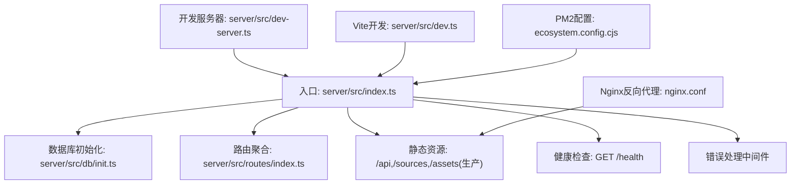
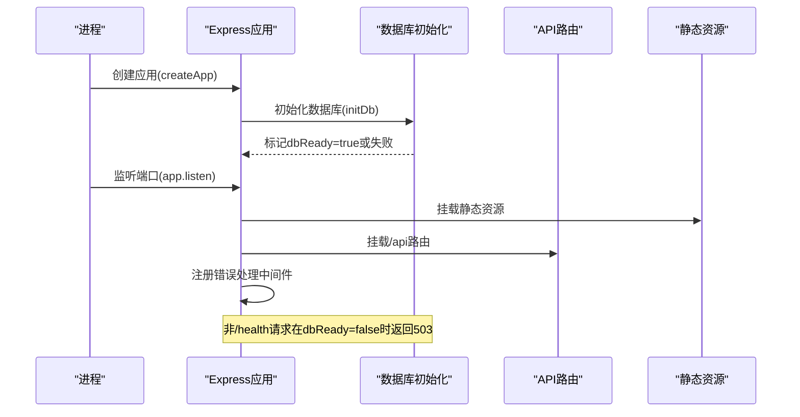
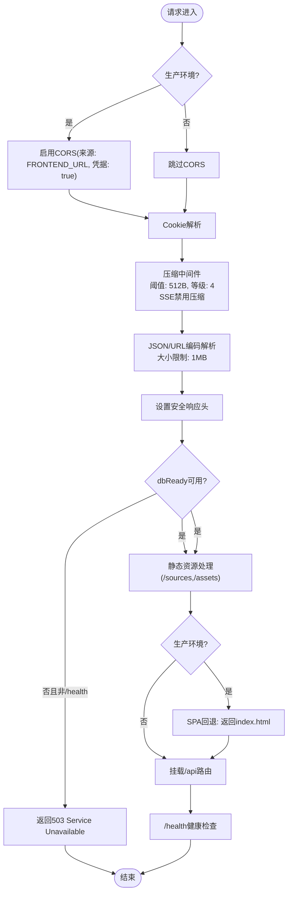
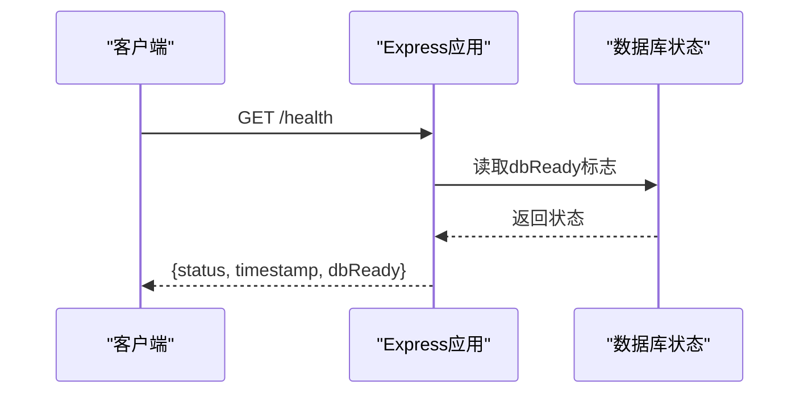
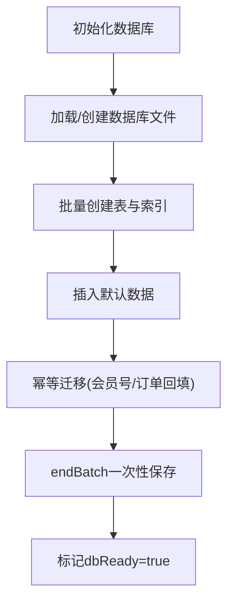
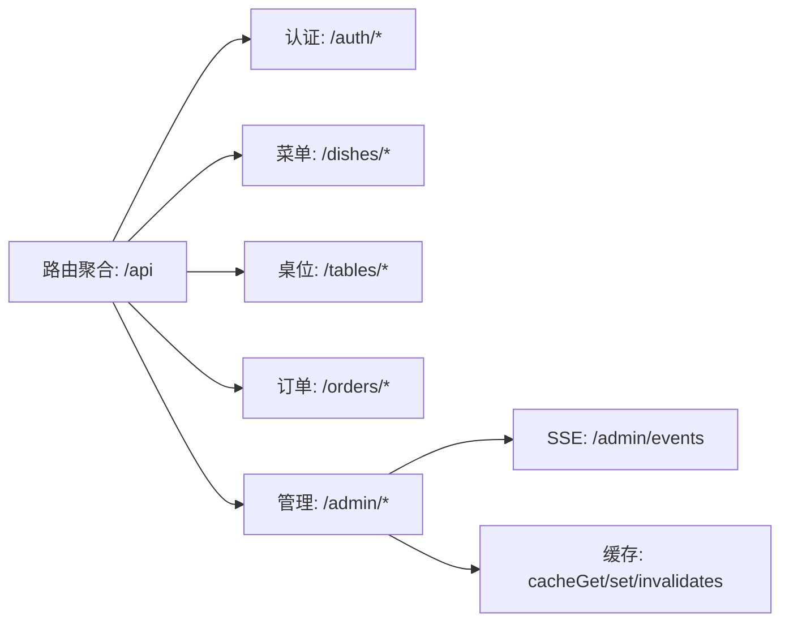
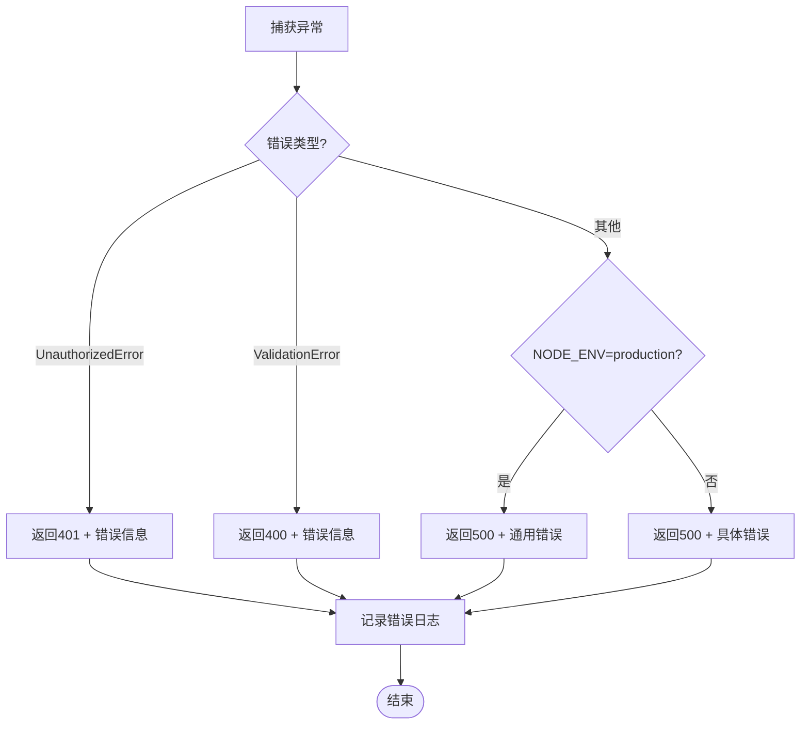
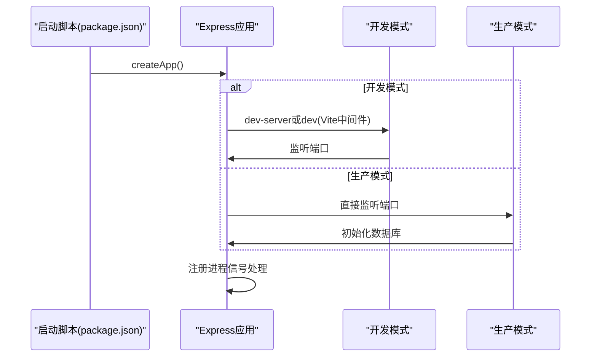
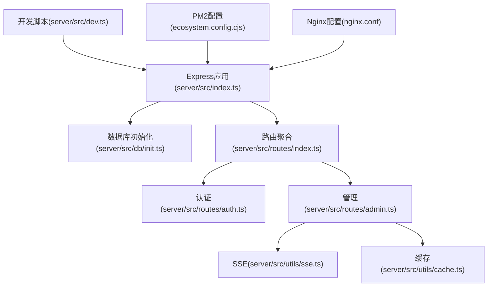

# Express服务器配置

<cite>
**本文档引用的文件**
- [server/src/index.ts](file://server/src/index.ts)
- [server/src/dev-server.ts](file://server/src/dev-server.ts)
- [server/src/dev.ts](file://server/src/dev.ts)
- [server/src/db/init.ts](file://server/src/db/init.ts)
- [server/src/db/index.ts](file://server/src/db/index.ts)
- [server/src/routes/index.ts](file://server/src/routes/index.ts)
- [server/src/routes/auth.ts](file://server/src/routes/auth.ts)
- [server/src/routes/admin.ts](file://server/src/routes/admin.ts)
- [server/src/utils/jwt.ts](file://server/src/utils/jwt.ts)
- [server/src/utils/sse.ts](file://server/src/utils/sse.ts)
- [server/src/utils/cache.ts](file://server/src/utils/cache.ts)
- [package.json](file://package.json)
- [ecosystem.config.cjs](file://ecosystem.config.cjs)
- [nginx.conf](file://nginx.conf)
</cite>

## 目录
1. [简介](#简介)
2. [项目结构](#项目结构)
3. [核心组件](#核心组件)
4. [架构总览](#架构总览)
5. [详细组件分析](#详细组件分析)
6. [依赖关系分析](#依赖关系分析)
7. [性能考虑](#性能考虑)
8. [故障排查指南](#故障排查指南)
9. [结论](#结论)
10. [附录](#附录)

## 简介
本文件面向RLRMS餐厅管理系统的Express服务器配置，系统采用Node.js + Express + sql.js的纯前端部署方案，支持开发与生产双环境运行。服务器负责：
- 中间件链路：CORS、压缩、Cookie解析、安全响应头、静态资源托管、API路由挂载
- 数据库初始化与健康检查：数据库初始化状态监控、/health端点
- 错误处理：统一错误中间件，区分业务异常与系统异常
- 启动流程：端口配置、环境变量处理、进程信号处理

## 项目结构
服务器相关代码集中在server/src目录，主要文件职责如下：
- 入口与应用创建：server/src/index.ts
- 开发服务器：server/src/dev-server.ts
- Vite中间件开发：server/src/dev.ts
- 数据库初始化与持久化：server/src/db/init.ts、server/src/db/index.ts
- 路由聚合：server/src/routes/index.ts
- 认证与管理端点：server/src/routes/auth.ts、server/src/routes/admin.ts
- 工具模块：JWT密钥派生、SSE实时推送、缓存

**图表来源**
- [server/src/index.ts:1-176](file://server/src/index.ts#L1-L176)
- [server/src/dev-server.ts:1-18](file://server/src/dev-server.ts#L1-L18)
- [server/src/dev.ts:1-67](file://server/src/dev.ts#L1-L67)
- [server/src/db/init.ts:1-204](file://server/src/db/init.ts#L1-L204)
- [server/src/db/index.ts:1-156](file://server/src/db/index.ts#L1-L156)
- [server/src/routes/index.ts:1-18](file://server/src/routes/index.ts#L1-L18)
- [nginx.conf:1-170](file://nginx.conf#L1-L170)
- [ecosystem.config.cjs:1-19](file://ecosystem.config.cjs#L1-L19)

**章节来源**
- [server/src/index.ts:1-176](file://server/src/index.ts#L1-L176)
- [server/src/dev-server.ts:1-18](file://server/src/dev-server.ts#L1-L18)
- [server/src/dev.ts:1-67](file://server/src/dev.ts#L1-L67)
- [server/src/db/init.ts:1-204](file://server/src/db/init.ts#L1-L204)
- [server/src/db/index.ts:1-156](file://server/src/db/index.ts#L1-L156)
- [server/src/routes/index.ts:1-18](file://server/src/routes/index.ts#L1-L18)
- [nginx.conf:1-170](file://nginx.conf#L1-L170)
- [ecosystem.config.cjs:1-19](file://ecosystem.config.cjs#L1-L19)

## 核心组件
- 应用工厂函数：创建并配置Express实例，加载中间件、静态资源、路由与错误处理
- 数据库初始化器：初始化sql.js数据库、批量创建表与索引、插入默认数据、幂等迁移
- 路由聚合器：将公开API与管理API按前缀分组挂载
- 开发与生产启动脚本：分别支持Vite中间件模式与直接监听端口
- 健康检查端点：对外暴露数据库初始化状态
- 统一错误处理：根据错误类型返回标准化响应

**章节来源**
- [server/src/index.ts:34-143](file://server/src/index.ts#L34-L143)
- [server/src/db/init.ts:5-204](file://server/src/db/init.ts#L5-L204)
- [server/src/routes/index.ts:1-18](file://server/src/routes/index.ts#L1-L18)
- [server/src/dev-server.ts:1-18](file://server/src/dev-server.ts#L1-L18)
- [server/src/dev.ts:1-67](file://server/src/dev.ts#L1-L67)

## 架构总览
Express服务器在启动时执行以下关键步骤：
- 加载环境变量与平台适配
- 创建Express应用实例
- 条件性启用CORS（生产环境）
- 注册Cookie解析、压缩、JSON/URL编码中间件
- 设置安全响应头
- 数据库初始化状态拦截器（非/health路径阻断服务）
- 静态资源托管（/sources、/assets、SPA回退）
- 路由挂载（/api）
- 健康检查端点（/health）
- 错误处理中间件
- 生产环境：监听端口并注册进程信号处理；开发环境：Vite中间件或独立监听

**图表来源**
- [server/src/index.ts:148-175](file://server/src/index.ts#L148-L175)
- [server/src/db/init.ts:5-204](file://server/src/db/init.ts#L5-L204)

**章节来源**
- [server/src/index.ts:23-143](file://server/src/index.ts#L23-L143)
- [server/src/db/init.ts:5-204](file://server/src/db/init.ts#L5-L204)

## 详细组件分析

### 中间件链路设计
- CORS配置：仅在生产环境启用，允许来源由环境变量控制，并支持凭据
- Cookie解析：启用cookie解析中间件
- 压缩中间件：开启gzip压缩，阈值与压缩等级可调；对SSE流禁用压缩以避免缓冲
- 安全响应头：设置X-Content-Type-Options、X-Frame-Options、X-XSS-Protection、Referrer-Policy
- 数据库就绪拦截：在dbReady=false且请求非/health时返回503
- 静态资源：
  - /sources：图片上传目录，长期缓存、immutable、ETag、Last-Modified
  - 生产环境：/assets长期缓存，其他静态资源短缓存并返回index.html作为SPA回退
- 路由挂载：/api前缀挂载聚合路由

**图表来源**
- [server/src/index.ts:38-120](file://server/src/index.ts#L38-L120)

**章节来源**
- [server/src/index.ts:38-120](file://server/src/index.ts#L38-L120)

### 健康检查端点实现
- 路径：GET /health
- 响应字段：状态字符串（ok/initializing）、时间戳、dbReady布尔值
- 作用：对外暴露数据库初始化状态，便于负载均衡与容器编排探测

**图表来源**
- [server/src/index.ts:90-96](file://server/src/index.ts#L90-L96)

**章节来源**
- [server/src/index.ts:90-96](file://server/src/index.ts#L90-L96)

### 数据库初始化与持久化
- 初始化流程：
  - 初始化sql.js数据库，加载已有数据库文件或创建空库
  - 批量创建表与索引
  - 插入默认数据（管理员、设置项）
  - 幂等迁移（会员号重命名、历史订单回填）
  - 批处理保存，减少I/O开销
- 持久化策略：
  - 引入防抖保存机制，合并短时间内多次写入
  - 批处理模式：beginBatch/endBatch一次性落盘
  - 服务退出前flushSave确保未落盘数据不丢失

**图表来源**
- [server/src/db/init.ts:5-204](file://server/src/db/init.ts#L5-L204)
- [server/src/db/index.ts:47-60](file://server/src/db/index.ts#L47-L60)
- [server/src/db/index.ts:149-156](file://server/src/db/index.ts#L149-L156)

**章节来源**
- [server/src/db/init.ts:5-204](file://server/src/db/init.ts#L5-L204)
- [server/src/db/index.ts:1-156](file://server/src/db/index.ts#L1-L156)

### 路由与认证
- 路由聚合：/api前缀下挂载dishes、tables、orders、auth、admin等子路由
- 认证中间件：基于Cookie的JWT校验，支持管理员权限校验
- SSE实时推送：/api/admin/events，配合Nginx关闭缓冲实现实时推送
- 缓存：简单TTL内存缓存，用于热点数据降低查询压力

**图表来源**
- [server/src/routes/index.ts:1-18](file://server/src/routes/index.ts#L1-L18)
- [server/src/routes/auth.ts:115-144](file://server/src/routes/auth.ts#L115-L144)
- [server/src/routes/admin.ts:115-131](file://server/src/routes/admin.ts#L115-L131)
- [server/src/utils/sse.ts:15-51](file://server/src/utils/sse.ts#L15-L51)
- [server/src/utils/cache.ts:18-61](file://server/src/utils/cache.ts#L18-L61)

**章节来源**
- [server/src/routes/index.ts:1-18](file://server/src/routes/index.ts#L1-L18)
- [server/src/routes/auth.ts:115-144](file://server/src/routes/auth.ts#L115-L144)
- [server/src/routes/admin.ts:115-131](file://server/src/routes/admin.ts#L115-L131)
- [server/src/utils/sse.ts:15-51](file://server/src/utils/sse.ts#L15-L51)
- [server/src/utils/cache.ts:18-61](file://server/src/utils/cache.ts#L18-L61)

### 错误处理中间件
- 统一错误处理：捕获所有未处理异常
- 特殊错误类型：
  - UnauthorizedError：返回401与错误信息
  - ValidationError：返回400与错误信息
  - 其他：返回500，生产环境返回通用错误信息，开发环境返回具体错误消息
- 日志记录：输出错误消息与堆栈

**图表来源**
- [server/src/index.ts:122-140](file://server/src/index.ts#L122-L140)

**章节来源**
- [server/src/index.ts:122-140](file://server/src/index.ts#L122-L140)

### 启动流程与环境变量
- 端口配置：优先使用环境变量PORT，否则默认3000
- 环境变量：
  - NODE_ENV：决定生产/开发行为（CORS、JWT密钥派生、错误响应）
  - FRONTEND_URL：生产环境CORS来源
  - JWT_SECRET：生产环境JWT密钥（可选，未设置时动态生成）
- 生产环境启动：
  - 直接监听端口
  - 初始化数据库
  - 注册SIGTERM/SIGINT信号，确保退出前flushSave
- 开发环境启动：
  - 独立监听：server/src/dev-server.ts
  - Vite中间件：server/src/dev.ts，SPA回退至Vite转换后的index.html

**图表来源**
- [package.json:6-14](file://package.json#L6-L14)
- [server/src/index.ts:164-175](file://server/src/index.ts#L164-L175)
- [server/src/dev-server.ts:7-17](file://server/src/dev-server.ts#L7-L17)
- [server/src/dev.ts:8-66](file://server/src/dev.ts#L8-L66)

**章节来源**
- [package.json:6-14](file://package.json#L6-L14)
- [server/src/index.ts:23-25](file://server/src/index.ts#L23-L25)
- [server/src/index.ts:164-175](file://server/src/index.ts#L164-L175)
- [server/src/dev-server.ts:5-17](file://server/src/dev-server.ts#L5-L17)
- [server/src/dev.ts:6-66](file://server/src/dev.ts#L6-L66)

## 依赖关系分析
- Express应用依赖数据库初始化模块提供dbReady状态
- 路由模块依赖数据库访问层与工具模块（JWT、SSE、缓存）
- 开发脚本依赖Vite中间件模式，生产脚本依赖PM2配置
- Nginx配置依赖Express的静态资源与SSE端点

**图表来源**
- [server/src/index.ts:1-176](file://server/src/index.ts#L1-L176)
- [server/src/db/init.ts:1-204](file://server/src/db/init.ts#L1-L204)
- [server/src/routes/index.ts:1-18](file://server/src/routes/index.ts#L1-L18)
- [server/src/routes/auth.ts:1-405](file://server/src/routes/auth.ts#L1-L405)
- [server/src/routes/admin.ts:1-800](file://server/src/routes/admin.ts#L1-L800)
- [server/src/utils/sse.ts:1-59](file://server/src/utils/sse.ts#L1-L59)
- [server/src/utils/cache.ts:1-73](file://server/src/utils/cache.ts#L1-L73)
- [server/src/dev.ts:1-67](file://server/src/dev.ts#L1-L67)
- [ecosystem.config.cjs:1-19](file://ecosystem.config.cjs#L1-L19)
- [nginx.conf:1-170](file://nginx.conf#L1-L170)

**章节来源**
- [server/src/index.ts:1-176](file://server/src/index.ts#L1-L176)
- [server/src/db/init.ts:1-204](file://server/src/db/init.ts#L1-L204)
- [server/src/routes/index.ts:1-18](file://server/src/routes/index.ts#L1-L18)
- [server/src/dev.ts:1-67](file://server/src/dev.ts#L1-L67)
- [ecosystem.config.cjs:1-19](file://ecosystem.config.cjs#L1-L19)
- [nginx.conf:1-170](file://nginx.conf#L1-L170)

## 性能考虑
- 压缩策略：对SSE禁用压缩避免缓冲导致的实时性问题；对常规响应启用压缩并设置合理阈值
- 静态资源缓存：生产环境对/assets启用长期缓存与immutable属性；/sources启用长期缓存
- 数据库写入优化：批处理与防抖保存减少磁盘I/O
- 缓存：热点数据（分类、菜品、设置、可用桌位）使用TTL缓存降低查询压力
- Nginx长连接与SSE缓冲关闭：保障实时推送性能

**章节来源**
- [server/src/index.ts:46-56](file://server/src/index.ts#L46-L56)
- [server/src/index.ts:102-112](file://server/src/index.ts#L102-L112)
- [server/src/db/index.ts:37-44](file://server/src/db/index.ts#L37-L44)
- [server/src/utils/cache.ts:18-36](file://server/src/utils/cache.ts#L18-L36)
- [nginx.conf:27-48](file://nginx.conf#L27-L48)

## 故障排查指南
- 数据库初始化失败：
  - 现象：服务器启动后立即关闭
  - 处理：查看控制台错误日志；检查数据库文件读写权限；确认初始化SQL语法
- 503 Service Unavailable：
  - 现象：非/health请求返回503
  - 原因：数据库尚未初始化完成
  - 处理：等待/health显示ok；检查初始化日志
- CORS跨域问题（生产环境）：
  - 现象：浏览器跨域报错
  - 原因：FRONTEND_URL未正确配置或未允许凭据
  - 处理：核对环境变量与实际前端域名一致
- JWT密钥问题：
  - 现象：开发模式下热更新导致token失效；生产环境未设置JWT_SECRET
  - 处理：开发模式使用机器特征派生密钥；生产环境设置JWT_SECRET
- SSE实时推送延迟：
  - 现象：客户端接收延迟
  - 原因：Nginx缓冲或代理超时设置不当
  - 处理：参考Nginx配置关闭缓冲并延长超时

**章节来源**
- [server/src/index.ts:154-160](file://server/src/index.ts#L154-L160)
- [server/src/index.ts:70-79](file://server/src/index.ts#L70-L79)
- [server/src/index.ts:38-43](file://server/src/index.ts#L38-L43)
- [server/src/utils/jwt.ts:20-26](file://server/src/utils/jwt.ts#L20-L26)
- [nginx.conf:27-48](file://nginx.conf#L27-L48)

## 结论
本服务器配置以Express为核心，结合sql.js实现轻量级本地数据库存储，支持开发与生产双环境。通过严格的中间件顺序、数据库初始化状态监控、统一错误处理与合理的静态资源缓存策略，系统在易用性与性能之间取得平衡。建议在生产环境中完善Nginx与PM2配置，并确保JWT_SECRET与CORS来源的正确设置。

## 附录
- 环境变量清单：
  - NODE_ENV：development或production
  - PORT：服务器监听端口，默认3000
  - FRONTEND_URL：生产环境CORS来源
  - JWT_SECRET：生产环境JWT密钥（可选）
- 启动命令：
  - 开发：npm run dev 或 npm run dev:server
  - 生产：npm run start 或 npm run start:production
- PM2配置：ecosystem.config.cjs
- Nginx配置：nginx.conf

**章节来源**
- [package.json:6-14](file://package.json#L6-L14)
- [ecosystem.config.cjs:9-12](file://ecosystem.config.cjs#L9-L12)
- [nginx.conf:1-170](file://nginx.conf#L1-170)