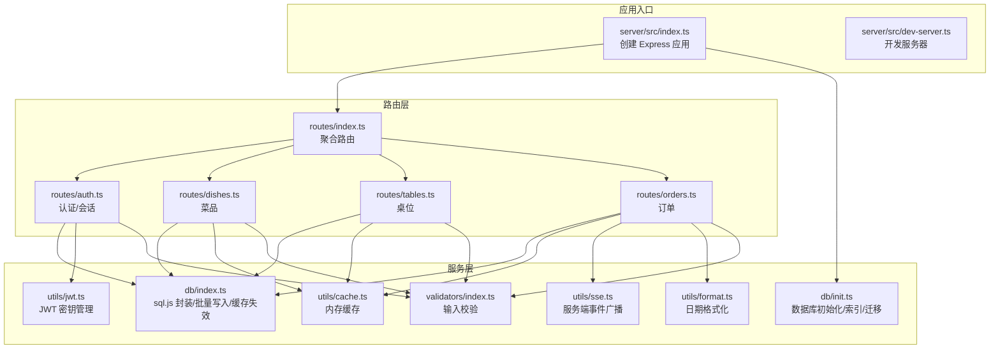
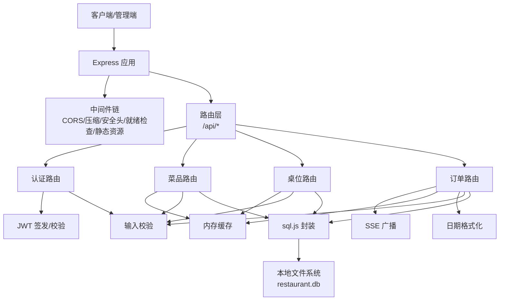
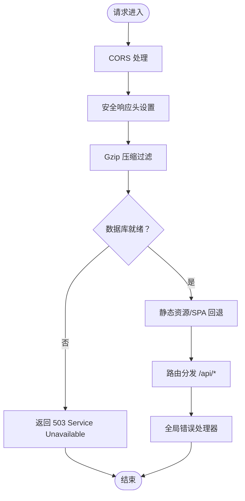
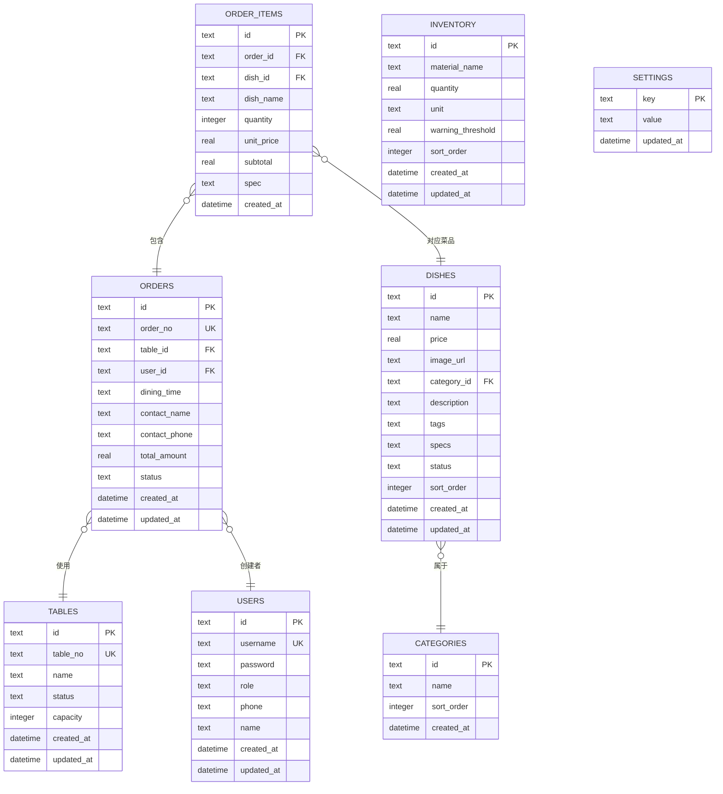
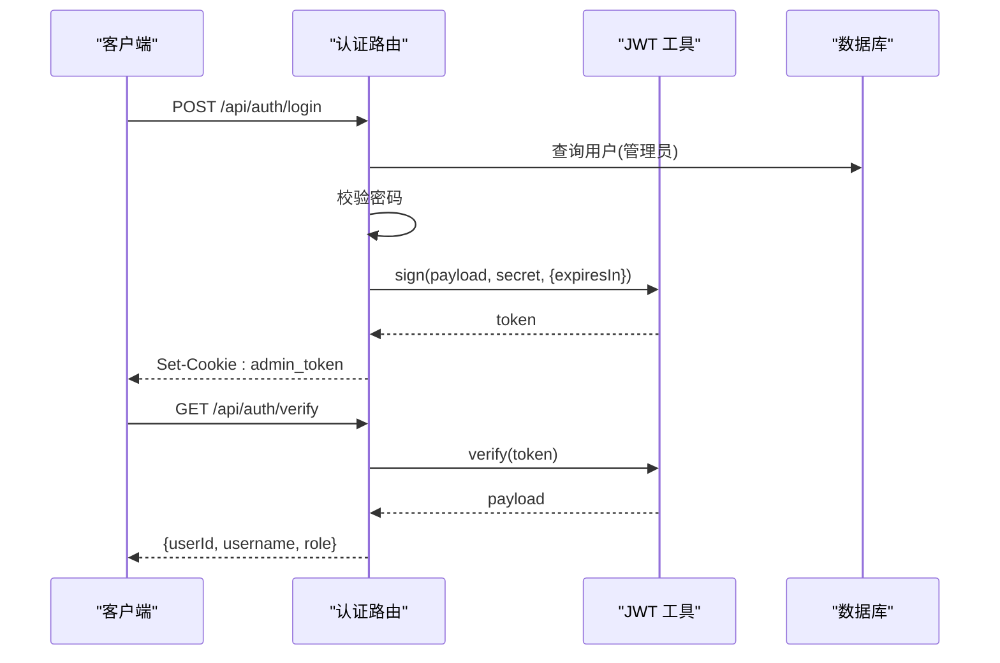
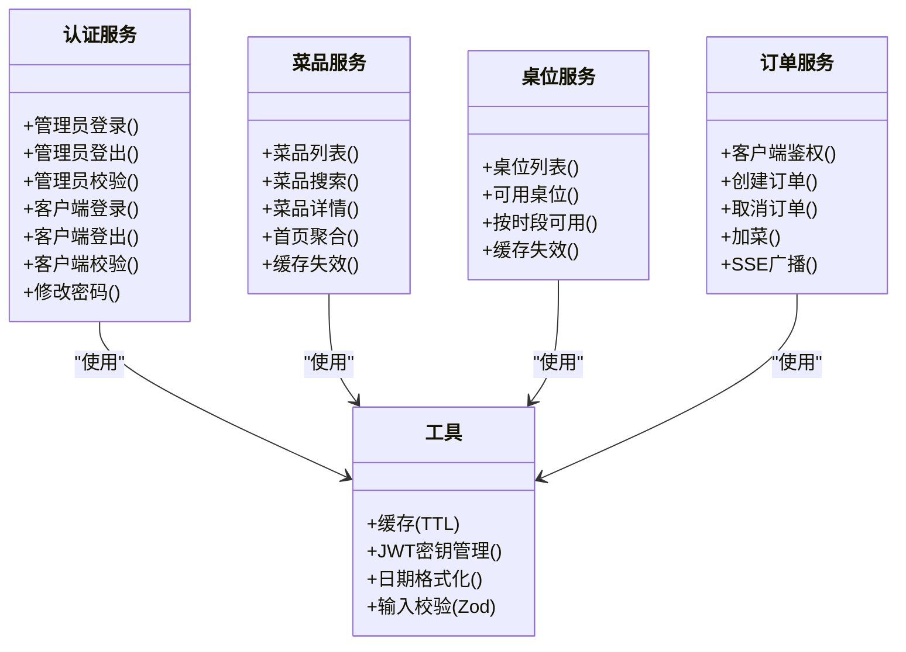
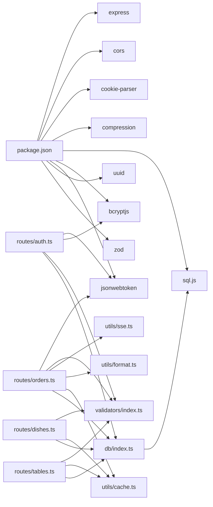

# 后端架构设计

<cite>
**本文引用的文件**
- [server/src/index.ts](file://server/src/index.ts)
- [server/src/dev-server.ts](file://server/src/dev-server.ts)
- [server/src/db/index.ts](file://server/src/db/index.ts)
- [server/src/db/init.ts](file://server/src/db/init.ts)
- [server/src/routes/index.ts](file://server/src/routes/index.ts)
- [server/src/routes/auth.ts](file://server/src/routes/auth.ts)
- [server/src/routes/dishes.ts](file://server/src/routes/dishes.ts)
- [server/src/routes/orders.ts](file://server/src/routes/orders.ts)
- [server/src/routes/tables.ts](file://server/src/routes/tables.ts)
- [server/src/utils/cache.ts](file://server/src/utils/cache.ts)
- [server/src/utils/jwt.ts](file://server/src/utils/jwt.ts)
- [server/src/utils/sse.ts](file://server/src/utils/sse.ts)
- [server/src/utils/format.ts](file://server/src/utils/format.ts)
- [server/src/validators/index.ts](file://server/src/validators/index.ts)
- [package.json](file://package.json)
</cite>

## 目录
1. [简介](#简介)
2. [项目结构](#项目结构)
3. [核心组件](#核心组件)
4. [架构总览](#架构总览)
5. [详细组件分析](#详细组件分析)
6. [依赖关系分析](#依赖关系分析)
7. [性能考量](#性能考量)
8. [故障排查指南](#故障排查指南)
9. [结论](#结论)
10. [附录](#附录)

## 简介
本文件为 RLRMS 餐厅管理系统后端架构设计文档，聚焦于 Express 服务器架构、中间件链路、错误处理机制、CORS 配置策略；RESTful API 设计原则（资源命名、HTTP 方法、状态码）；数据库层设计（SQLite 选型、sql.js 集成、数据模型）；JWT 认证机制（签发、验证、过期处理）；服务层职责划分与缓存策略；并提供架构图与 API 设计规范。

## 项目结构
后端采用模块化组织方式，按功能域拆分路由与工具模块，数据库访问通过统一的封装层抽象，配合 sql.js 实现浏览器级 SQLite 能力，支持开发与生产环境一体化部署。

图表来源
- [server/src/index.ts:1-176](file://server/src/index.ts#L1-L176)
- [server/src/dev-server.ts:1-18](file://server/src/dev-server.ts#L1-L18)
- [server/src/routes/index.ts:1-18](file://server/src/routes/index.ts#L1-L18)
- [server/src/routes/auth.ts:1-405](file://server/src/routes/auth.ts#L1-L405)
- [server/src/routes/dishes.ts:1-216](file://server/src/routes/dishes.ts#L1-L216)
- [server/src/routes/tables.ts:1-93](file://server/src/routes/tables.ts#L1-L93)
- [server/src/routes/orders.ts:1-552](file://server/src/routes/orders.ts#L1-L552)
- [server/src/db/index.ts:1-156](file://server/src/db/index.ts#L1-L156)
- [server/src/db/init.ts:1-204](file://server/src/db/init.ts#L1-L204)
- [server/src/utils/cache.ts:1-73](file://server/src/utils/cache.ts#L1-L73)
- [server/src/utils/jwt.ts:1-27](file://server/src/utils/jwt.ts#L1-L27)
- [server/src/utils/sse.ts:1-59](file://server/src/utils/sse.ts#L1-L59)
- [server/src/utils/format.ts:1-12](file://server/src/utils/format.ts#L1-L12)
- [server/src/validators/index.ts:1-123](file://server/src/validators/index.ts#L1-L123)

章节来源
- [server/src/index.ts:1-176](file://server/src/index.ts#L1-L176)
- [server/src/routes/index.ts:1-18](file://server/src/routes/index.ts#L1-L18)

## 核心组件
- Express 应用与中间件链
  - CORS：生产环境启用，允许前端域名与凭据
  - Cookie 解析、Gzip 压缩（排除 SSE）、JSON/URL 编码体解析
  - 安全响应头设置
  - 数据库就绪检查中间件（非健康检查路径阻断请求）
  - 静态资源托管与 SPA 回退
  - 全局错误处理器（区分 Unauthorized/Validation/Error）
- 数据库层
  - sql.js 初始化、读写封装、批量事务、防抖落盘
  - 数据库初始化脚本（表结构、索引、默认数据、迁移）
- 路由与服务
  - 认证路由（管理员/客户端登录、登出、校验）
  - 菜品路由（列表、搜索、详情、首页聚合）
  - 桌位路由（可用性查询）
  - 订单路由（创建、取消、加菜、客户端鉴权）
  - 工具与校验：缓存、JWT、SSE、格式化、Zod 校验
- 构建与运行
  - 开发模式：tsx watch
  - 生产模式：打包后启动，持久化 SQLite 文件

章节来源
- [server/src/index.ts:34-143](file://server/src/index.ts#L34-L143)
- [server/src/db/index.ts:76-156](file://server/src/db/index.ts#L76-L156)
- [server/src/db/init.ts:5-204](file://server/src/db/init.ts#L5-L204)
- [server/src/routes/auth.ts:62-344](file://server/src/routes/auth.ts#L62-L344)
- [server/src/routes/dishes.ts:5-216](file://server/src/routes/dishes.ts#L5-L216)
- [server/src/routes/tables.ts:5-93](file://server/src/routes/tables.ts#L5-L93)
- [server/src/routes/orders.ts:51-552](file://server/src/routes/orders.ts#L51-L552)
- [server/src/utils/cache.ts:1-73](file://server/src/utils/cache.ts#L1-L73)
- [server/src/utils/jwt.ts:1-27](file://server/src/utils/jwt.ts#L1-L27)
- [server/src/utils/sse.ts:1-59](file://server/src/utils/sse.ts#L1-L59)
- [server/src/utils/format.ts:1-12](file://server/src/utils/format.ts#L1-L12)
- [server/src/validators/index.ts:1-123](file://server/src/validators/index.ts#L1-L123)

## 架构总览
后端采用“入口应用 -> 路由 -> 服务层 -> 数据库”的分层架构。路由层负责协议与业务编排，服务层封装数据访问与缓存，数据库层通过 sql.js 提供轻量级持久化能力。JWT 用于会话状态管理，SSE 用于订单事件推送，Zod 保障输入一致性。

图表来源
- [server/src/index.ts:34-143](file://server/src/index.ts#L34-L143)
- [server/src/routes/auth.ts:62-344](file://server/src/routes/auth.ts#L62-L344)
- [server/src/routes/dishes.ts:5-216](file://server/src/routes/dishes.ts#L5-L216)
- [server/src/routes/tables.ts:5-93](file://server/src/routes/tables.ts#L5-L93)
- [server/src/routes/orders.ts:51-552](file://server/src/routes/orders.ts#L51-L552)
- [server/src/utils/cache.ts:1-73](file://server/src/utils/cache.ts#L1-L73)
- [server/src/utils/sse.ts:1-59](file://server/src/utils/sse.ts#L1-L59)
- [server/src/utils/format.ts:1-12](file://server/src/utils/format.ts#L1-L12)
- [server/src/db/index.ts:76-156](file://server/src/db/index.ts#L76-L156)

## 详细组件分析

### Express 应用与中间件链
- CORS：仅在生产环境启用，允许前端域名与携带凭据
- 安全头：X-Content-Type-Options、X-Frame-Options、X-XSS-Protection、Referrer-Policy
- 压缩：阈值与级别优化，对 SSE 流禁用压缩
- 数据库就绪保护：非 /health 路径在数据库未就绪时返回 503
- 静态资源：生产环境托管 dist 与 public/sources，SPA 回退至 index.html
- 错误处理：区分 Unauthorized/Validation/Error，返回统一结构

图表来源
- [server/src/index.ts:38-140](file://server/src/index.ts#L38-L140)

章节来源
- [server/src/index.ts:34-143](file://server/src/index.ts#L34-L143)

### 数据库层设计
- 选型理由
  - 本地化、零运维、跨平台、适合中小规模数据
  - 与前端技术栈一致，便于开发调试
- 集成方案
  - sql.js 初始化、数据库对象生命周期管理
  - 读操作：prepare/bind/step/getAsObject
  - 写操作：run + 防抖保存（SAVE_DEBOUNCE_MS），批量写入 beginBatch/endBatch
  - 文件持久化：export Buffer 写入本地文件
- 数据模型
  - 用户、桌位、分类、菜品、订单、订单项、库存、设置
  - 索引覆盖常用查询（订单状态、电话、分类排序、菜品状态/排序等）
  - 迁移：默认管理员、默认设置、历史数据回填与去重

图表来源
- [server/src/db/init.ts:11-122](file://server/src/db/init.ts#L11-L122)
- [server/src/db/init.ts:124-137](file://server/src/db/init.ts#L124-L137)
- [server/src/db/index.ts:101-147](file://server/src/db/index.ts#L101-L147)

章节来源
- [server/src/db/index.ts:1-156](file://server/src/db/index.ts#L1-156)
- [server/src/db/init.ts:1-204](file://server/src/db/init.ts#L1-L204)

### JWT 认证机制
- 密钥管理
  - 开发：基于主机特征派生固定密钥，保证热重载不掉 Token
  - 生产：动态密钥或显式环境变量，建议持久化以避免重启失效
- 登录流程
  - 管理员登录：用户名/密码校验，签发带角色的 JWT，设置 httpOnly Cookie
  - 客户端登录：手机号/密码校验，支持自动注册，签发较长有效期 Token
- 校验与过期
  - 读取 Cookie，验证签名与过期时间
  - 客户端校验额外检查用户存在性
- 登出与密码修改
  - 清除 Cookie 即可登出
  - 修改密码时进行旧密码校验

图表来源
- [server/src/routes/auth.ts:65-144](file://server/src/routes/auth.ts#L65-L144)
- [server/src/routes/auth.ts:158-179](file://server/src/routes/auth.ts#L158-L179)
- [server/src/utils/jwt.ts:11-26](file://server/src/utils/jwt.ts#L11-L26)

章节来源
- [server/src/routes/auth.ts:62-344](file://server/src/routes/auth.ts#L62-L344)
- [server/src/utils/jwt.ts:1-27](file://server/src/utils/jwt.ts#L1-L27)

### RESTful API 设计原则
- 资源命名
  - 使用名词复数形式：/dishes、/tables、/orders、/auth
  - 管理端资源前缀：/admin（在路由聚合中体现）
- HTTP 方法
  - GET：查询列表/详情、可用性查询
  - POST：创建、登录、登出、校验、验证订单存在性
  - PUT：更新订单菜品（加菜）
  - DELETE：未在现有路由中使用
- 状态码
  - 成功：200/201
  - 参数错误：400
  - 未授权：401
  - 禁止：403
  - 资源不存在：404
  - 过多请求：429
  - 服务器错误：500
- 统一响应结构
  - 包含 success、data 或 error 字段，便于前端处理

章节来源
- [server/src/routes/dishes.ts:24-216](file://server/src/routes/dishes.ts#L24-L216)
- [server/src/routes/tables.ts:13-93](file://server/src/routes/tables.ts#L13-L93)
- [server/src/routes/orders.ts:61-552](file://server/src/routes/orders.ts#L61-L552)
- [server/src/routes/auth.ts:65-344](file://server/src/routes/auth.ts#L65-L344)

### 服务层职责划分
- 认证服务
  - 管理端：登录/登出/校验，IP 限流
  - 客户端：登录/登出/校验，自动注册，手机号唯一性约束兜底
- 菜品服务
  - 列表、搜索、详情、首页聚合数据
  - 缓存策略：分类、菜品列表、首页数据
- 桌位服务
  - 可用性查询（即时/按就餐时段）
  - 缓存策略：可用桌位、按时段可用
- 订单服务
  - 客户端鉴权中间件
  - 创建订单：菜品校验、单价重算、批量写入、桌位状态联动
  - 取消订单：时间窗口与状态校验
  - 加菜：删除旧项、插入新项、重算金额与状态
  - SSE 广播：新订单、订单更新事件
- 工具与支撑
  - 缓存：TTL 内存缓存、失效策略
  - 格式化：日期时间格式化
  - 校验：Zod Schema 输入校验
  - SSE：客户端连接管理与广播

图表来源
- [server/src/routes/auth.ts:62-344](file://server/src/routes/auth.ts#L62-L344)
- [server/src/routes/dishes.ts:5-216](file://server/src/routes/dishes.ts#L5-L216)
- [server/src/routes/tables.ts:5-93](file://server/src/routes/tables.ts#L5-L93)
- [server/src/routes/orders.ts:51-552](file://server/src/routes/orders.ts#L51-L552)
- [server/src/utils/cache.ts:1-73](file://server/src/utils/cache.ts#L1-L73)
- [server/src/utils/jwt.ts:1-27](file://server/src/utils/jwt.ts#L1-L27)
- [server/src/utils/format.ts:1-12](file://server/src/utils/format.ts#L1-L12)
- [server/src/validators/index.ts:1-123](file://server/src/validators/index.ts#L1-L123)

章节来源
- [server/src/routes/auth.ts:62-344](file://server/src/routes/auth.ts#L62-L344)
- [server/src/routes/dishes.ts:5-216](file://server/src/routes/dishes.ts#L5-L216)
- [server/src/routes/tables.ts:5-93](file://server/src/routes/tables.ts#L5-L93)
- [server/src/routes/orders.ts:51-552](file://server/src/routes/orders.ts#L51-L552)
- [server/src/utils/cache.ts:1-73](file://server/src/utils/cache.ts#L1-L73)
- [server/src/utils/format.ts:1-12](file://server/src/utils/format.ts#L1-L12)
- [server/src/validators/index.ts:1-123](file://server/src/validators/index.ts#L1-L123)

## 依赖关系分析
- 运行时依赖
  - Express、CORS、Cookie Parser、Compression、sql.js、bcryptjs、jsonwebtoken、uuid、zod
- 开发依赖
  - TypeScript、Vite、Vue 生态、tsx、cross-env
- 关键耦合点
  - 路由依赖数据库封装与工具模块
  - JWT 与认证路由强关联
  - 订单服务依赖 SSE、格式化与缓存
  - 校验器贯穿各服务层

图表来源
- [package.json:16-41](file://package.json#L16-L41)
- [server/src/routes/auth.ts:1-8](file://server/src/routes/auth.ts#L1-L8)
- [server/src/routes/orders.ts:1-10](file://server/src/routes/orders.ts#L1-L10)
- [server/src/routes/dishes.ts:1-4](file://server/src/routes/dishes.ts#L1-L4)
- [server/src/routes/tables.ts:1-4](file://server/src/routes/tables.ts#L1-L4)
- [server/src/db/index.ts:1](file://server/src/db/index.ts#L1)

章节来源
- [package.json:1-64](file://package.json#L1-L64)

## 性能考量
- 数据库写入优化
  - 防抖保存（50ms）合并写入，降低磁盘 IO
  - 批量事务 beginBatch/endBatch，减少提交次数
- 查询性能
  - 为高频查询建立索引（订单状态、电话、菜品状态/排序、桌位状态等）
  - 缓存热点数据（分类、菜品列表、首页、可用桌位、按时段可用）
- 压缩与网络
  - Gzip 阈值与级别优化，SSE 不压缩避免缓冲
- 认证与安全
  - IP 登录限流，防止暴力破解
  - 客户端 Token 更长有效期，管理员 Token 较短

## 故障排查指南
- 数据库未就绪
  - 现象：非 /health 请求返回 503
  - 排查：确认数据库初始化完成，查看日志
- 认证失败
  - 现象：401，错误消息提示无效 token/未登录
  - 排查：确认 Cookie 是否正确设置与携带；核对 JWT 密钥一致性
- 参数校验错误
  - 现象：400，返回具体字段错误
  - 排查：对照 Zod Schema 校验规则修正请求体
- SSE 无法接收事件
  - 现象：管理端无实时更新
  - 排查：确认客户端连接未关闭，服务端广播正常
- 写入丢失
  - 现象：服务重启后数据异常
  - 排查：确认 flushSave 在进程退出前执行

章节来源
- [server/src/index.ts:70-79](file://server/src/index.ts#L70-L79)
- [server/src/routes/auth.ts:126-129](file://server/src/routes/auth.ts#L126-L129)
- [server/src/routes/orders.ts:342-343](file://server/src/routes/orders.ts#L342-L343)
- [server/src/db/index.ts:149-156](file://server/src/db/index.ts#L149-L156)

## 结论
本架构以 Express 为核心，结合 sql.js 实现轻量级本地数据库，通过中间件链与统一错误处理保障稳定性；JWT 与 Cookie 实现会话管理；Zod 校验与缓存提升一致性与性能；SSE 提供实时事件推送。整体设计兼顾开发效率与运行时表现，适合中小规模餐厅场景。

## 附录
- 开发与生产命令
  - 开发：npm run dev / npm run dev:server
  - 构建：npm run build / npm run build:server
  - 启动：npm start / npm start:production
  - 初始化数据库：npm run db:init
- 环境变量
  - FRONTEND_URL：生产环境 CORS 前端地址
  - JWT_SECRET：生产环境 JWT 密钥（建议固定）
  - NODE_ENV：开发/生产模式切换

章节来源
- [package.json:6-14](file://package.json#L6-L14)
- [server/src/index.ts:23-43](file://server/src/index.ts#L23-L43)
- [server/src/utils/jwt.ts:20-26](file://server/src/utils/jwt.ts#L20-L26)