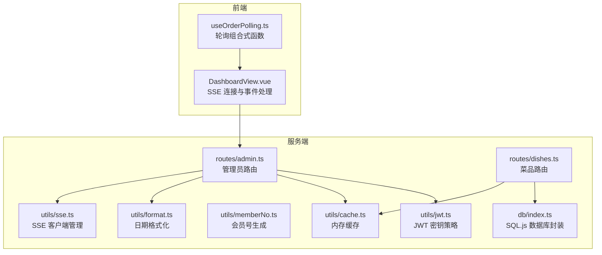
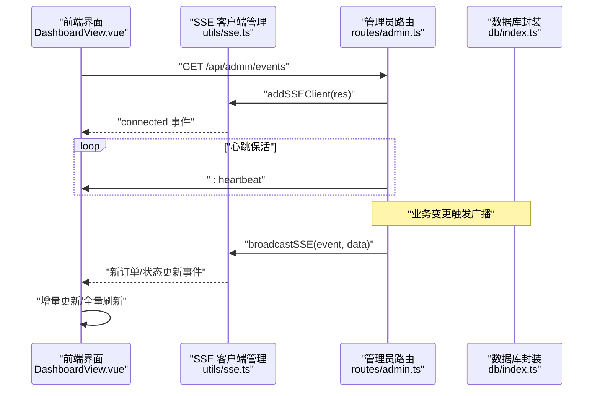
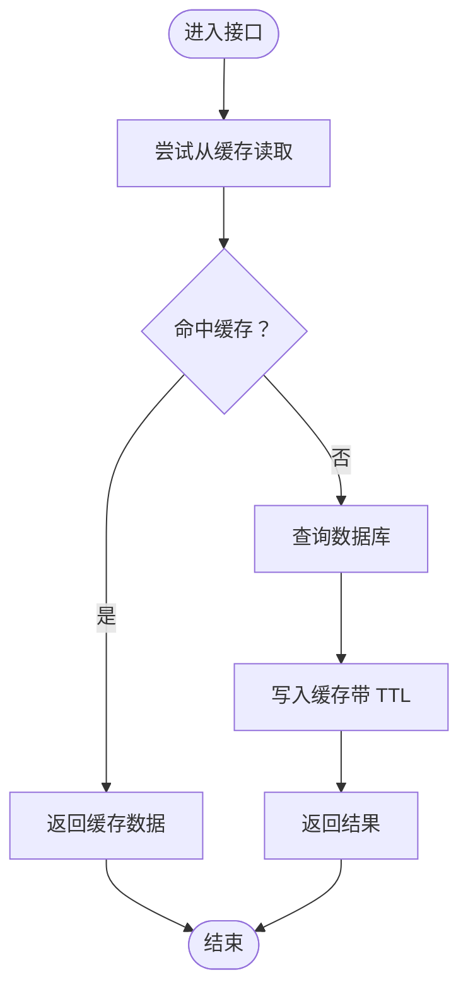
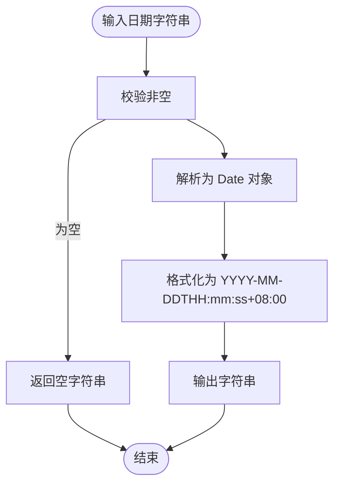
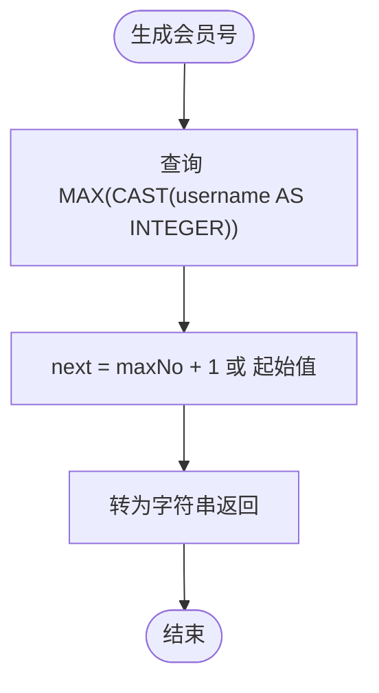
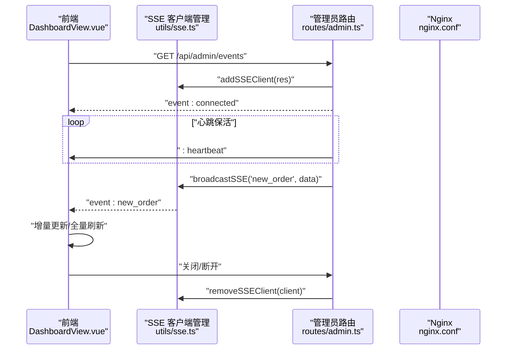
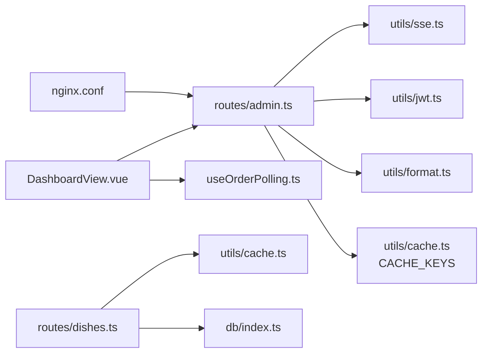

# 工具函数库

<cite>
**本文引用的文件**
- [cache.ts](file://server/src/utils/cache.ts)
- [format.ts](file://server/src/utils/format.ts)
- [memberNo.ts](file://server/src/utils/memberNo.ts)
- [sse.ts](file://server/src/utils/sse.ts)
- [jwt.ts](file://server/src/utils/jwt.ts)
- [admin.ts](file://server/src/routes/admin.ts)
- [dishes.ts](file://server/src/routes/dishes.ts)
- [index.ts](file://server/src/db/index.ts)
- [DashboardView.vue](file://src/admin/views/DashboardView.vue)
- [useOrderPolling.ts](file://src/shared/composables/useOrderPolling.ts)
- [nginx.conf](file://nginx.conf)
</cite>

## 目录
1. [简介](#简介)
2. [项目结构](#项目结构)
3. [核心组件](#核心组件)
4. [架构总览](#架构总览)
5. [详细组件分析](#详细组件分析)
6. [依赖关系分析](#依赖关系分析)
7. [性能考量](#性能考量)
8. [故障排查指南](#故障排查指南)
9. [结论](#结论)
10. [附录](#附录)

## 简介
本文件面向 RLRMS 餐厅管理系统中的工具函数库，系统性梳理以下能力与实现细节：
- 缓存机制：内存 TTL 缓存、缓存键命名规范、失效策略与性能优化
- 数据格式化：日期时间格式化工具
- 会员号生成：基于数据库的自增规则与并发容错
- SSE 实时推送：服务端事件的连接管理、广播与心跳保活
- 测试与最佳实践：如何验证各工具函数的行为与稳定性

上述能力在服务端路由与前端界面中均有落地应用，例如管理员后台通过 SSE 实时接收新订单通知，并结合轮询作为降级方案；菜品与分类接口采用缓存以降低数据库压力；JWT 密钥在开发与生产环境采用差异化策略。

## 项目结构
工具函数库位于服务端源码的工具模块目录，配合数据库层、路由层与前端界面共同构成完整的功能闭环。

图表来源
- [cache.ts:1-73](file://server/src/utils/cache.ts#L1-L73)
- [format.ts:1-12](file://server/src/utils/format.ts#L1-L12)
- [memberNo.ts:1-19](file://server/src/utils/memberNo.ts#L1-L19)
- [sse.ts:1-59](file://server/src/utils/sse.ts#L1-L59)
- [jwt.ts:1-27](file://server/src/utils/jwt.ts#L1-L27)
- [admin.ts:1-1887](file://server/src/routes/admin.ts#L1-L1887)
- [dishes.ts:1-215](file://server/src/routes/dishes.ts#L1-L215)
- [index.ts:1-156](file://server/src/db/index.ts#L1-L156)
- [DashboardView.vue:303-452](file://src/admin/views/DashboardView.vue#L303-L452)
- [useOrderPolling.ts:1-55](file://src/shared/composables/useOrderPolling.ts#L1-L55)

章节来源
- [cache.ts:1-73](file://server/src/utils/cache.ts#L1-L73)
- [format.ts:1-12](file://server/src/utils/format.ts#L1-L12)
- [memberNo.ts:1-19](file://server/src/utils/memberNo.ts#L1-L19)
- [sse.ts:1-59](file://server/src/utils/sse.ts#L1-L59)
- [jwt.ts:1-27](file://server/src/utils/jwt.ts#L1-L27)
- [admin.ts:1-1887](file://server/src/routes/admin.ts#L1-L1887)
- [dishes.ts:1-215](file://server/src/routes/dishes.ts#L1-L215)
- [index.ts:1-156](file://server/src/db/index.ts#L1-L156)
- [DashboardView.vue:303-452](file://src/admin/views/DashboardView.vue#L303-L452)
- [useOrderPolling.ts:1-55](file://src/shared/composables/useOrderPolling.ts#L1-L55)

## 核心组件
- 内存 TTL 缓存：提供键值存储、TTL 过期、按前缀失效、清空等能力，配合统一的缓存键常量使用，减少对数据库的高频读取。
- 日期时间格式化：将输入字符串标准化为带时区偏移的 ISO 字符串，便于前端展示与排序。
- 会员号生成：基于数据库中现有用户名的最大值进行自增，限定长度与字符集，结合唯一约束与调用方重试保证并发安全。
- SSE 客户端管理：维护客户端连接列表、添加/移除、广播消息、获取连接数，配合心跳保活与错误处理。
- JWT 密钥策略：开发环境基于主机特征派生固定密钥，生产环境支持显式密钥或动态密钥，兼顾安全性与可用性。

章节来源
- [cache.ts:1-73](file://server/src/utils/cache.ts#L1-L73)
- [format.ts:1-12](file://server/src/utils/format.ts#L1-L12)
- [memberNo.ts:1-19](file://server/src/utils/memberNo.ts#L1-L19)
- [sse.ts:1-59](file://server/src/utils/sse.ts#L1-L59)
- [jwt.ts:1-27](file://server/src/utils/jwt.ts#L1-L27)

## 架构总览
工具函数库在系统中的位置与交互如下：

图表来源
- [DashboardView.vue:303-452](file://src/admin/views/DashboardView.vue#L303-L452)
- [sse.ts:1-59](file://server/src/utils/sse.ts#L1-L59)
- [admin.ts:133-162](file://server/src/routes/admin.ts#L133-L162)
- [index.ts:1-156](file://server/src/db/index.ts#L1-L156)

## 详细组件分析

### 缓存机制（内存 TTL 缓存）
- 设计目标：缓存不频繁变化的数据（如分类、菜品列表、设置等），降低数据库压力，提升响应速度。
- 数据结构：内部使用 Map 存储键值与过期时间戳，泛型保持数据类型安全。
- 关键函数：
  - 获取：若键不存在或已过期则返回空，否则返回缓存数据。
  - 设置：支持自定义 TTL，默认 30 秒。
  - 失效：按键失效、按前缀失效、清空全部。
- 缓存键常量：集中定义常用键名，便于跨模块复用与失效控制。
- 典型使用：
  - 菜品与分类接口在读取时优先命中缓存，写入时按需失效相关键。
  - 管理员路由在修改表位、菜品、分类等操作后，主动失效相关缓存键，确保一致性。

图表来源
- [cache.ts:18-36](file://server/src/utils/cache.ts#L18-L36)
- [dishes.ts:24-33](file://server/src/routes/dishes.ts#L24-L33)

章节来源
- [cache.ts:1-73](file://server/src/utils/cache.ts#L1-L73)
- [dishes.ts:1-215](file://server/src/routes/dishes.ts#L1-L215)
- [admin.ts:259-266](file://server/src/routes/admin.ts#L259-L266)

### 数据格式化（日期时间）
- 功能：将输入字符串转换为带时区偏移的 ISO 字符串，便于前端一致展示。
- 使用场景：管理员路由在返回订单等数据时，统一格式化 created_at 时间字段。

图表来源
- [format.ts:1-12](file://server/src/utils/format.ts#L1-L12)
- [admin.ts:200-203](file://server/src/routes/admin.ts#L200-L203)

章节来源
- [format.ts:1-12](file://server/src/utils/format.ts#L1-L12)
- [admin.ts:165-219](file://server/src/routes/admin.ts#L165-L219)

### 会员号生成
- 规则：查询现有 5-6 位纯数字 username 的最大值并加一，起始值为 10001。
- 并发容错：依赖用户名唯一约束与调用方重试兜底，避免冲突。
- 数据来源：通过数据库封装模块执行 SQL 查询。

图表来源
- [memberNo.ts:12-18](file://server/src/utils/memberNo.ts#L12-L18)
- [index.ts:112-125](file://server/src/db/index.ts#L112-L125)

章节来源
- [memberNo.ts:1-19](file://server/src/utils/memberNo.ts#L1-L19)
- [index.ts:1-156](file://server/src/db/index.ts#L1-L156)

### SSE 实时推送
- 客户端管理：
  - 添加连接：分配唯一 ID 并加入客户端列表。
  - 移除连接：根据引用定位并删除。
  - 广播：构造标准 SSE 事件负载，遍历副本写入，异常或不可写时自动清理。
  - 连接数：提供当前连接数查询。
- 服务端事件端点：
  - 设置必要的响应头，禁用缓存与缓冲，发送连接确认事件。
  - 心跳保活：周期性发送占位消息，维持长连接。
  - 断开清理：监听 close 事件并移除客户端。
- 前端集成：
  - 建立 EventSource 连接，监听 connected/new_order/order_updated 等事件。
  - 成功连接后停止轮询；断线时自动重连。
  - 自动刷新开关与轮询组合式函数协同工作，保障离线场景下的数据同步。

图表来源
- [DashboardView.vue:303-452](file://src/admin/views/DashboardView.vue#L303-L452)
- [sse.ts:15-51](file://server/src/utils/sse.ts#L15-L51)
- [admin.ts:133-162](file://server/src/routes/admin.ts#L133-L162)
- [nginx.conf:27-44](file://nginx.conf#L27-L44)

章节来源
- [sse.ts:1-59](file://server/src/utils/sse.ts#L1-L59)
- [admin.ts:133-162](file://server/src/routes/admin.ts#L133-L162)
- [DashboardView.vue:303-452](file://src/admin/views/DashboardView.vue#L303-L452)
- [useOrderPolling.ts:1-55](file://src/shared/composables/useOrderPolling.ts#L1-L55)
- [nginx.conf:27-44](file://nginx.conf#L27-L44)

### JWT 密钥策略
- 开发环境：基于主机名与用户名派生固定哈希作为密钥，保证本地热重载时不丢失令牌。
- 生产环境：优先使用显式环境变量，否则生成随机密钥；若未设置会发出警告提示重启会导致令牌失效。
- 作用域：用于签发与验证管理员端 JWT，确保后台接口鉴权安全。

章节来源
- [jwt.ts:1-27](file://server/src/utils/jwt.ts#L1-L27)

## 依赖关系分析
- 路由层依赖工具层：
  - 管理员路由依赖 SSE 客户端管理、JWT 密钥、格式化工具与缓存键常量。
  - 菜品路由依赖缓存工具与数据库封装。
- 前端依赖服务端：
  - 管理端仪表盘通过 SSE 与轮询组合实现高可用的实时数据更新。
- Nginx 配置：
  - SSE 端点关闭缓冲与缓存，设置长连接超时，确保事件流实时性。

图表来源
- [admin.ts:1-1887](file://server/src/routes/admin.ts#L1-L1887)
- [dishes.ts:1-215](file://server/src/routes/dishes.ts#L1-L215)
- [cache.ts:64-72](file://server/src/utils/cache.ts#L64-L72)
- [format.ts:1-12](file://server/src/utils/format.ts#L1-L12)
- [jwt.ts:1-27](file://server/src/utils/jwt.ts#L1-L27)
- [DashboardView.vue:303-452](file://src/admin/views/DashboardView.vue#L303-L452)
- [useOrderPolling.ts:1-55](file://src/shared/composables/useOrderPolling.ts#L1-L55)
- [nginx.conf:27-44](file://nginx.conf#L27-L44)

章节来源
- [admin.ts:1-1887](file://server/src/routes/admin.ts#L1-L1887)
- [dishes.ts:1-215](file://server/src/routes/dishes.ts#L1-L215)
- [cache.ts:64-72](file://server/src/utils/cache.ts#L64-L72)
- [DashboardView.vue:303-452](file://src/admin/views/DashboardView.vue#L303-L452)
- [nginx.conf:27-44](file://nginx.conf#L27-L44)

## 性能考量
- 缓存策略
  - TTL 默认 30 秒，适合不频繁变化的数据；对热点数据可考虑缩短 TTL 提升一致性。
  - 使用前缀失效精确清理相关键，避免全量清空导致抖动。
  - 结合数据库写入批量事务与防抖保存，减少磁盘 IO。
- SSE
  - Nginx 关闭缓冲与缓存，确保事件实时推送。
  - 心跳保活降低连接中断风险；异常写入自动清理，避免内存泄漏。
- 前端
  - SSE 成功后停止轮询，降低网络与服务器压力；断线自动重连与可见性切换智能启停轮询，平衡体验与性能。

章节来源
- [cache.ts:13-13](file://server/src/utils/cache.ts#L13-L13)
- [index.ts:36-60](file://server/src/db/index.ts#L36-L60)
- [admin.ts:147-155](file://server/src/routes/admin.ts#L147-L155)
- [nginx.conf:37-44](file://nginx.conf#L37-L44)
- [useOrderPolling.ts:19-47](file://src/shared/composables/useOrderPolling.ts#L19-L47)

## 故障排查指南
- SSE 连接问题
  - 检查 Nginx 是否正确配置 SSE 端点（关闭缓冲、设置长超时）。
  - 查看浏览器 Network 面板 SSE 请求与事件流，确认连接确认与心跳消息。
  - 若断线频繁，确认心跳保活逻辑与客户端重连策略是否生效。
- 缓存命中率低
  - 核对缓存键命名是否与失效策略一致，避免误删或未删。
  - 对高频读取但写入少的接口启用缓存，合理设置 TTL。
- 会员号冲突
  - 确认用户名唯一约束是否生效，调用方是否在冲突时重试。
  - 检查查询逻辑是否排除了手机号等非 5-6 位数字用户名。
- JWT 令牌失效
  - 生产环境务必设置 JWT_SECRET；开发环境重启不会影响令牌，但建议统一密钥管理。

章节来源
- [nginx.conf:27-44](file://nginx.conf#L27-L44)
- [sse.ts:37-51](file://server/src/utils/sse.ts#L37-L51)
- [cache.ts:48-54](file://server/src/utils/cache.ts#L48-L54)
- [memberNo.ts:12-18](file://server/src/utils/memberNo.ts#L12-L18)
- [jwt.ts:24-26](file://server/src/utils/jwt.ts#L24-L26)

## 结论
工具函数库围绕“缓存、格式化、会员号、SSE”四大主题构建，既满足了性能与一致性的需求，又提供了良好的扩展性与可维护性。通过路由层与前端的协同，实现了高效稳定的实时数据更新与一致的用户体验。建议在后续迭代中持续关注缓存命中率、SSE 可靠性与 JWT 安全策略，以进一步提升系统整体质量。

## 附录
- 测试方法与最佳实践
  - 缓存测试
    - 单元测试：验证 cacheGet/cacheSet/cacheInvalidate/cacheInvalidatePrefix 的行为，覆盖命中、过期、前缀匹配与清空场景。
    - 集成测试：在路由层模拟写入后失效缓存，验证读取路径的正确性。
  - 格式化测试
    - 输入边界：空字符串、非法日期、时区差异等，确保输出稳定。
  - 会员号测试
    - 并发场景：模拟多实例同时生成，验证唯一约束与重试逻辑。
  - SSE 测试
    - 连接生命周期：建立、心跳、断开、清理。
    - 广播可靠性：异常写入、不可写连接的清理。
  - 最佳实践
    - 缓存键命名规范：统一前缀与分隔符，便于失效与监控。
    - TTL 设定：热点数据短 TTL，静态数据长 TTL。
    - SSE 配置：生产环境务必关闭缓冲与缓存，设置合理超时。
    - JWT 管理：生产环境强制设置密钥，避免动态密钥重启失效。