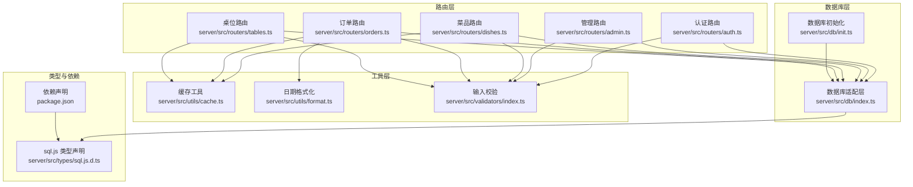
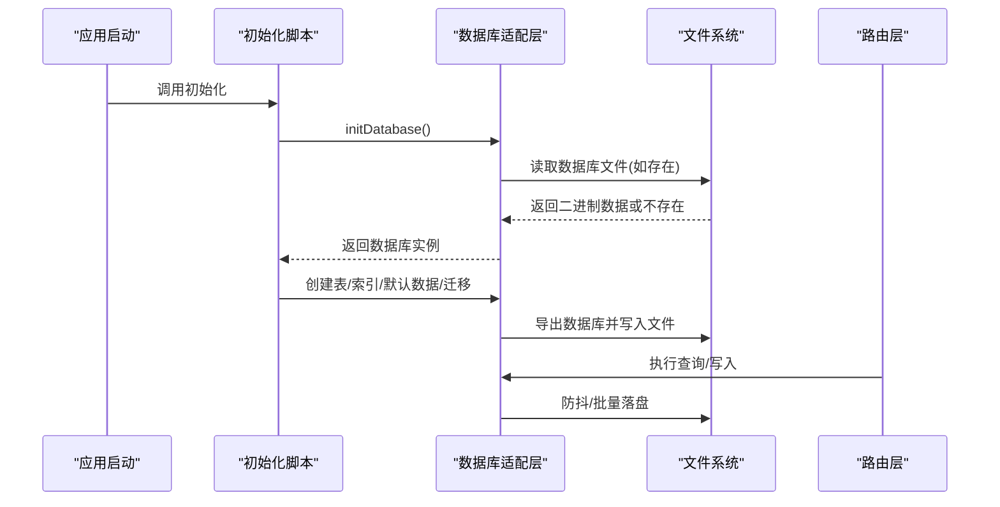
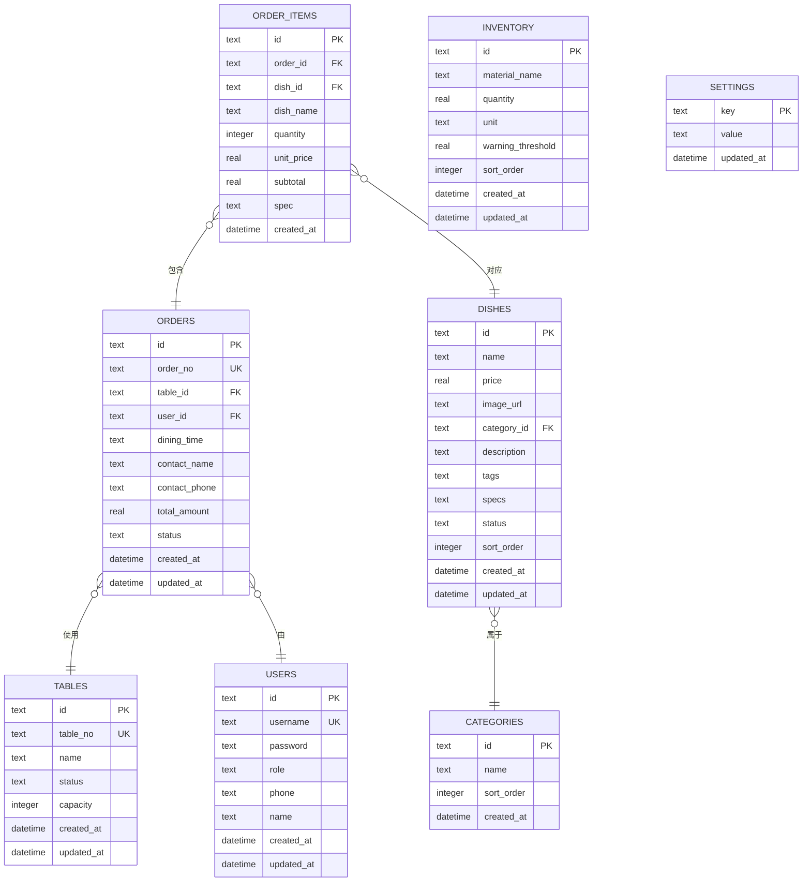
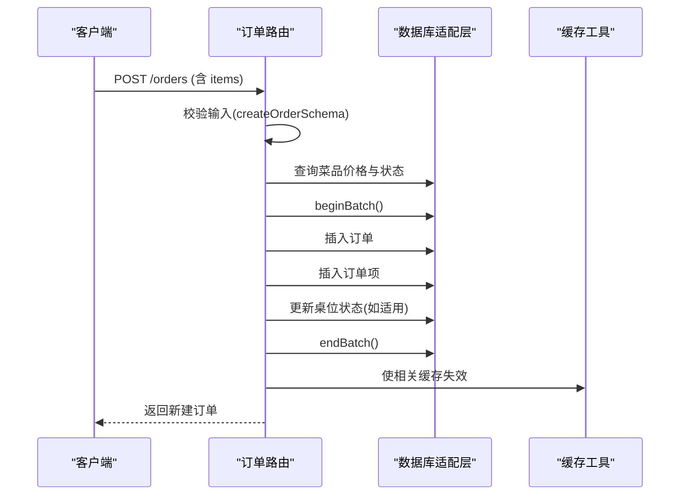
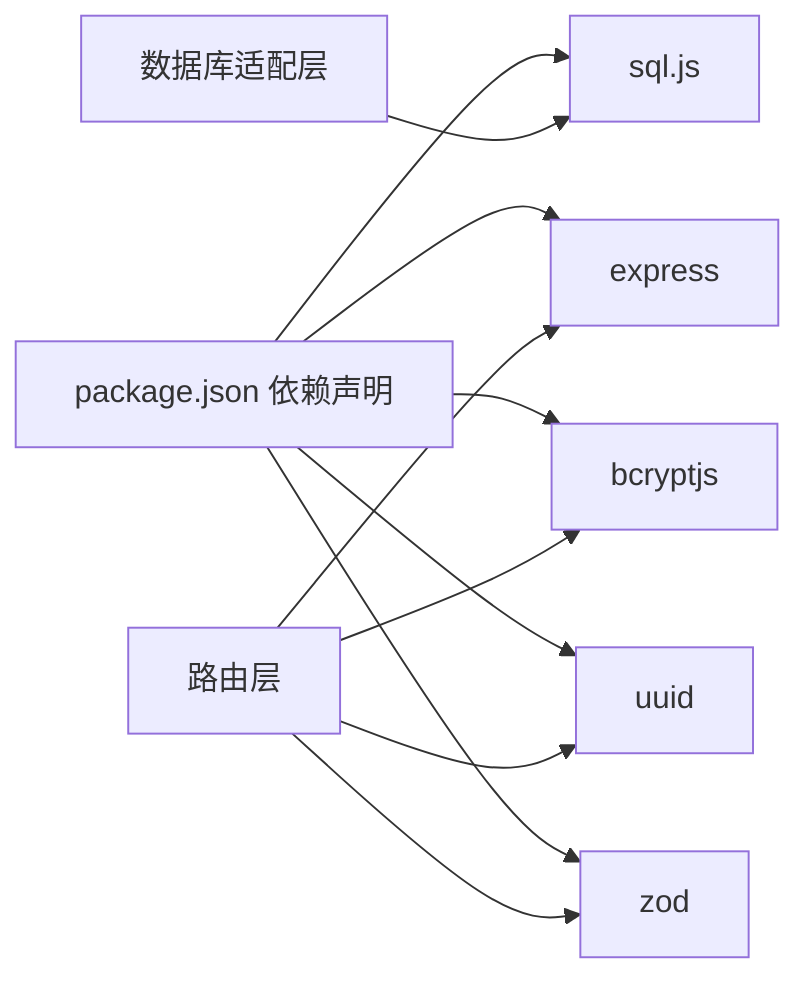

# 数据库设计

<cite>
**本文引用的文件**
- [server/src/db/index.ts](file://server/src/db/index.ts)
- [server/src/db/init.ts](file://server/src/db/init.ts)
- [server/src/types/sql.js.d.ts](file://server/src/types/sql.js.d.ts)
- [server/src/routers/admin.ts](file://server/src/routers/admin.ts)
- [server/src/routers/auth.ts](file://server/src/routers/auth.ts)
- [server/src/routers/dishes.ts](file://server/src/routers/dishes.ts)
- [server/src/routers/orders.ts](file://server/src/routers/orders.ts)
- [server/src/routers/tables.ts](file://server/src/routers/tables.ts)
- [server/src/utils/cache.ts](file://server/src/utils/cache.ts)
- [server/src/utils/format.ts](file://server/src/utils/format.ts)
- [server/src/validators/index.ts](file://server/src/validators/index.ts)
- [package.json](file://package.json)
</cite>

## 目录
1. [简介](#简介)
2. [项目结构](#项目结构)
3. [核心组件](#核心组件)
4. [架构总览](#架构总览)
5. [详细组件分析](#详细组件分析)
6. [依赖分析](#依赖分析)
7. [性能考虑](#性能考虑)
8. [故障排查指南](#故障排查指南)
9. [结论](#结论)
10. [附录](#附录)

## 简介
本文件面向 RLRMS 餐厅管理系统，系统采用 SQLite 作为本地嵌入式数据库，并通过 sql.js 在 Node.js 环境中运行。数据库位于服务器数据目录，以文件形式持久化存储；应用启动时加载现有数据库，若不存在则创建新库。数据库初始化流程负责创建核心业务表、索引、默认数据与迁移任务，确保系统具备完整的用户、菜品、桌位、订单、库存与设置能力。

## 项目结构
数据库相关代码主要分布在以下模块：
- 数据库适配层：封装 sql.js 初始化、读写、批处理与持久化
- 初始化脚本：创建表、索引、默认数据与迁移
- 路由层：围绕用户、菜品、桌位、订单、库存等资源的增删改查与业务流程
- 工具层：缓存、日期格式化、输入校验
- 类型声明：sql.js 的 TypeScript 声明文件

图表来源
- [server/src/db/index.ts:1-156](file://server/src/db/index.ts#L1-L156)
- [server/src/db/init.ts:1-204](file://server/src/db/init.ts#L1-L204)
- [server/src/routers/auth.ts:1-405](file://server/src/routers/auth.ts#L1-L405)
- [server/src/routers/admin.ts:1-800](file://server/src/routers/admin.ts#L1-L800)
- [server/src/routers/dishes.ts:1-216](file://server/src/routers/dishes.ts#L1-L216)
- [server/src/routers/orders.ts:1-552](file://server/src/routers/orders.ts#L1-L552)
- [server/src/routers/tables.ts:1-93](file://server/src/routers/tables.ts#L1-L93)
- [server/src/utils/cache.ts:1-73](file://server/src/utils/cache.ts#L1-L73)
- [server/src/utils/format.ts:1-12](file://server/src/utils/format.ts#L1-L12)
- [server/src/validators/index.ts:1-123](file://server/src/validators/index.ts#L1-L123)
- [server/src/types/sql.js.d.ts:1-24](file://server/src/types/sql.js.d.ts#L1-L24)
- [package.json:1-64](file://package.json#L1-L64)

章节来源
- [server/src/db/index.ts:1-156](file://server/src/db/index.ts#L1-L156)
- [server/src/db/init.ts:1-204](file://server/src/db/init.ts#L1-L204)
- [package.json:16-41](file://package.json#L16-L41)

## 核心组件
- 数据库适配层
  - 提供数据库初始化、获取实例、执行语句、查询单行/多行、批量写入、防抖落盘与强制落盘等能力
  - 通过 sql.js 的 Database/Statement 接口进行操作，并将内存数据库导出为二进制缓冲区持久化到磁盘文件
- 数据库初始化
  - 创建用户、桌位、分类、菜品、订单、订单项、库存、设置等表
  - 为高频查询建立索引
  - 注入默认管理员账户与系统设置
  - 执行幂等迁移：历史客户用户名迁移、历史订单 user_id 回填
- 路由层
  - 管理端：用户、菜品、分类、桌位、订单、库存、设置等资源管理与导入导出
  - 客户端：菜品浏览、分类查询、桌位可用性查询、订单创建/取消/加菜等
- 工具层
  - 缓存：基于 Map 的 TTL 缓存，减少重复查询
  - 格式化：统一日期时间格式输出
  - 校验：使用 Zod 对输入进行严格校验

章节来源
- [server/src/db/index.ts:75-156](file://server/src/db/index.ts#L75-L156)
- [server/src/db/init.ts:5-204](file://server/src/db/init.ts#L5-L204)
- [server/src/routers/admin.ts:107-800](file://server/src/routers/admin.ts#L107-L800)
- [server/src/routers/auth.ts:62-405](file://server/src/routers/auth.ts#L62-L405)
- [server/src/routers/dishes.ts:1-216](file://server/src/routers/dishes.ts#L1-L216)
- [server/src/routers/orders.ts:1-552](file://server/src/routers/orders.ts#L1-L552)
- [server/src/routers/tables.ts:1-93](file://server/src/routers/tables.ts#L1-L93)
- [server/src/utils/cache.ts:1-73](file://server/src/utils/cache.ts#L1-L73)
- [server/src/utils/format.ts:1-12](file://server/src/utils/format.ts#L1-L12)
- [server/src/validators/index.ts:1-123](file://server/src/validators/index.ts#L1-L123)

## 架构总览
系统采用“嵌入式 SQLite + sql.js + 文件持久化”的轻量级数据库架构。sql.js 在 Node.js 中模拟 SQLite 的行为，通过内存数据库承载事务与查询，定期或批量将内存状态导出为二进制文件保存至磁盘，实现零外部依赖与快速部署。

图表来源
- [server/src/db/index.ts:75-98](file://server/src/db/index.ts#L75-L98)
- [server/src/db/index.ts:22-44](file://server/src/db/index.ts#L22-L44)
- [server/src/db/init.ts:5-204](file://server/src/db/init.ts#L5-L204)

## 详细组件分析

### 数据库表结构设计
- 用户表 users
  - 主键：id（文本）
  - 字段：username（唯一）、password、role（默认 customer）、phone、name、created_at、updated_at
  - 约束：username 唯一、role 默认 customer
- 桌位表 tables
  - 主键：id（文本）
  - 字段：table_no（唯一）、name、status（默认 available）、capacity（默认 4）、created_at、updated_at
  - 约束：table_no 唯一
- 分类表 categories
  - 主键：id（文本）
  - 字段：name、sort_order（默认 0）、created_at
- 菜品表 dishes
  - 主键：id（文本）
  - 外键：category_id → categories(id)
  - 字段：name、price、image_url、category_id、description、tags、specs、status（默认 on_sale）、sort_order（默认 0）、created_at、updated_at
- 订单表 orders
  - 主键：id（文本）
  - 外键：table_id → tables(id)、user_id → users(id)
  - 字段：order_no（唯一）、table_id、user_id、dining_time、contact_name、contact_phone、total_amount、status（默认 pending）、created_at、updated_at
- 订单项表 order_items
  - 主键：id（文本）
  - 外键：order_id → orders(id)、dish_id → dishes(id)
  - 字段：order_id、dish_id、dish_name、quantity、unit_price、subtotal、spec、created_at
- 库存表 inventory
  - 主键：id（文本）
  - 字段：material_name、quantity（实数）、unit、warning_threshold（默认 0）、sort_order（默认 0）、created_at、updated_at
- 设置表 settings
  - 主键：key（文本）
  - 字段：value、updated_at

章节来源
- [server/src/db/init.ts:11-122](file://server/src/db/init.ts#L11-L122)

### 关系设计与完整性约束
- 外键关系
  - dishes.category_id → categories(id)
  - orders.table_id → tables(id)
  - orders.user_id → users(id)
  - order_items.order_id → orders(id)
  - order_items.dish_id → dishes(id)
- 约束与索引
  - 唯一性：users.username、tables.table_no、orders.order_no
  - 索引覆盖高频查询：orders(status)、orders(contact_phone)、orders(table_id)、orders(created_at)、orders(user_id)、order_items(order_id)、dishes(category_id)、dishes(status)、dishes(sort_order)、users(phone)、users(role)、tables(status)
- 迁移与兼容
  - inventory 表新增 sort_order 列的幂等迁移
  - 历史客户 username 从 phone 迁移到数字会员号
  - 历史订单 user_id 的回填

章节来源
- [server/src/db/init.ts:124-204](file://server/src/db/init.ts#L124-L204)

### 数据模型图（ER 关系）

图表来源
- [server/src/db/init.ts:11-122](file://server/src/db/init.ts#L11-L122)

### 数据库初始化流程
- 初始化步骤
  - 初始化 sql.js 并加载/创建数据库
  - 创建所有业务表与索引
  - 注入默认管理员与系统设置
  - 执行迁移：客户会员号迁移、订单 user_id 回填
  - 结束批处理并落盘
- 关键点
  - 批量写入使用 beginBatch/endBatch 包裹，减少落盘次数
  - 防抖保存机制在短时间内合并多次写入
  - 异常时通过 try/finally 确保 endBatch 被调用

章节来源
- [server/src/db/index.ts:46-73](file://server/src/db/index.ts#L46-L73)
- [server/src/db/index.ts:149-156](file://server/src/db/index.ts#L149-L156)
- [server/src/db/init.ts:5-204](file://server/src/db/init.ts#L5-L204)

### 查询与写入流程示例（订单创建）

图表来源
- [server/src/routers/orders.ts:194-353](file://server/src/routers/orders.ts#L194-L353)
- [server/src/db/index.ts:46-73](file://server/src/db/index.ts#L46-L73)
- [server/src/utils/cache.ts:41-54](file://server/src/utils/cache.ts#L41-L54)

### 数据一致性与并发控制
- 批处理与事务
  - 使用 beginBatch/endBatch 包裹多条写入，确保原子性与降低落盘频率
- 防抖保存
  - 对写入操作进行 50ms 防抖，合并短时间内的多次写入
- 幂等迁移
  - 客户会员号迁移与订单 user_id 回填均采用幂等策略，避免重复执行
- 输入校验
  - 使用 Zod 对关键输入进行严格校验，减少脏数据进入数据库

章节来源
- [server/src/db/index.ts:46-73](file://server/src/db/index.ts#L46-L73)
- [server/src/db/index.ts:149-156](file://server/src/db/index.ts#L149-L156)
- [server/src/db/init.ts:167-198](file://server/src/db/init.ts#L167-L198)
- [server/src/validators/index.ts:1-123](file://server/src/validators/index.ts#L1-123)

## 依赖分析
- sql.js
  - 通过 npm 依赖引入，提供 SQLite 兼容的 JavaScript 实现
  - 类型声明文件定义了 Database/Statement 接口
- express
  - 路由层基于 Express，提供 RESTful 接口
- bcryptjs
  - 用户密码加密与校验
- uuid
  - 生成全局唯一标识符
- zod
  - 输入参数的强类型校验

图表来源
- [package.json:16-41](file://package.json#L16-L41)
- [server/src/types/sql.js.d.ts:1-24](file://server/src/types/sql.js.d.ts#L1-L24)
- [server/src/db/index.ts:1-156](file://server/src/db/index.ts#L1-L156)

章节来源
- [package.json:16-41](file://package.json#L16-L41)
- [server/src/types/sql.js.d.ts:1-24](file://server/src/types/sql.js.d.ts#L1-L24)

## 性能考虑
- 索引优化
  - 为 orders/status、orders/contact_phone、orders/table_id、orders/created_at、orders/user_id、order_items/order_id、dishes/category_id、dishes/status、dishes/sort_order、users/phone、users/role、tables/status 建立索引，显著提升筛选与联接性能
- 批处理与落盘
  - 使用 beginBatch/endBatch 将多条写入合并为一次事务，减少磁盘 IO
  - 防抖保存将短时间内的多次写入合并，降低文件系统压力
- 缓存策略
  - 对分类、菜品首页与列表、桌位可用性等静态或低频变化的数据设置 TTL 缓存，减少数据库访问
- 查询优化
  - 使用批量查询避免 N+1 查询问题（例如一次性拉取订单项并按订单分组）
  - 使用 prepared statement 与参数绑定，提高执行效率与安全性
- 数据类型与精度
  - 金额使用 REAL 存储，前端/后端计算时注意四舍五入策略，避免精度误差

章节来源
- [server/src/db/init.ts:124-137](file://server/src/db/init.ts#L124-L137)
- [server/src/db/index.ts:46-73](file://server/src/db/index.ts#L46-L73)
- [server/src/db/index.ts:22-44](file://server/src/db/index.ts#L22-L44)
- [server/src/utils/cache.ts:1-73](file://server/src/utils/cache.ts#L1-L73)
- [server/src/routers/dishes.ts:67-117](file://server/src/routers/dishes.ts#L67-L117)
- [server/src/routers/tables.ts:24-55](file://server/src/routers/tables.ts#L24-L55)
- [server/src/routers/orders.ts:61-135](file://server/src/routers/orders.ts#L61-L135)

## 故障排查指南
- 数据库未初始化
  - 现象：调用数据库方法时报错提示未初始化
  - 处理：确保在应用启动阶段调用初始化流程
  - 参考：[server/src/db/index.ts:92-98](file://server/src/db/index.ts#L92-L98)
- 写入未落盘
  - 现象：服务重启后数据丢失
  - 处理：在关闭前调用 flushSave，或等待防抖定时器触发
  - 参考：[server/src/db/index.ts:149-156](file://server/src/db/index.ts#L149-L156)
- 批处理未结束导致保存延迟
  - 现象：多次写入后未立即落盘
  - 处理：确保在业务完成后调用 endBatch
  - 参考：[server/src/db/index.ts:46-60](file://server/src/db/index.ts#L46-L60)
- 订单创建失败（桌位冲突）
  - 现象：提示桌位已被占用或存在未处理订单
  - 处理：检查桌位状态与同时间段内 pending/confirmed 订单
  - 参考：[server/src/routers/orders.ts:207-236](file://server/src/routers/orders.ts#L207-L236)
- 缓存不一致
  - 现象：更新菜品/桌位后界面未刷新
  - 处理：在更新后调用缓存失效接口
  - 参考：[server/src/utils/cache.ts:41-54](file://server/src/utils/cache.ts#L41-L54)
- 导入导出调试
  - 现象：需要查看数据库结构或执行调试 SQL
  - 处理：使用管理端调试接口获取模式或执行 SQL
  - 参考：[server/src/routers/admin.ts:1847-1863](file://server/src/routers/admin.ts#L1847-L1863)

章节来源
- [server/src/db/index.ts:92-98](file://server/src/db/index.ts#L92-L98)
- [server/src/db/index.ts:149-156](file://server/src/db/index.ts#L149-L156)
- [server/src/db/index.ts:46-60](file://server/src/db/index.ts#L46-L60)
- [server/src/routers/orders.ts:207-236](file://server/src/routers/orders.ts#L207-L236)
- [server/src/utils/cache.ts:41-54](file://server/src/utils/cache.ts#L41-L54)
- [server/src/routers/admin.ts:1847-1863](file://server/src/routers/admin.ts#L1847-L1863)

## 结论
本设计以 sql.js 为核心，结合嵌入式 SQLite 的零依赖特性与文件持久化，满足 RLRMS 的本地部署需求。通过批处理、防抖保存、索引与缓存等手段，在保证数据一致性的同时兼顾性能与可维护性。初始化流程与幂等迁移确保系统在演进过程中保持稳定与可恢复。

## 附录
- 常用命令
  - 初始化数据库：npm run db:init
  - 开发启动：npm run dev / npm run dev:server
  - 生产构建与启动：npm run build / npm run build:server / npm run start:production
- 关键路径参考
  - 数据库适配层：[server/src/db/index.ts:1-156](file://server/src/db/index.ts#L1-L156)
  - 初始化脚本：[server/src/db/init.ts:1-204](file://server/src/db/init.ts#L1-L204)
  - 路由层（管理端）：[server/src/routers/admin.ts:1-800](file://server/src/routers/admin.ts#L1-L800)
  - 路由层（客户端）：[server/src/routers/orders.ts:1-552](file://server/src/routers/orders.ts#L1-L552)