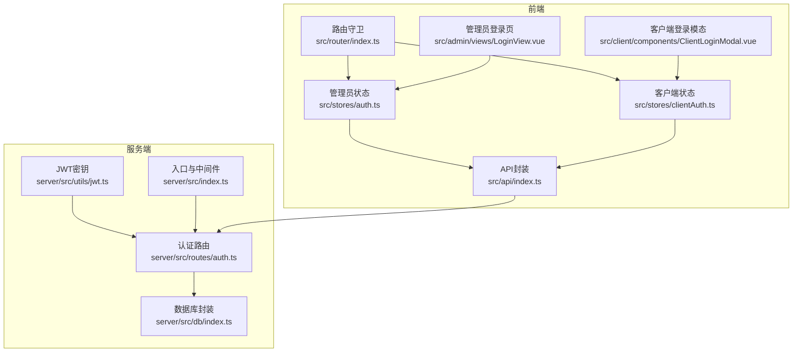
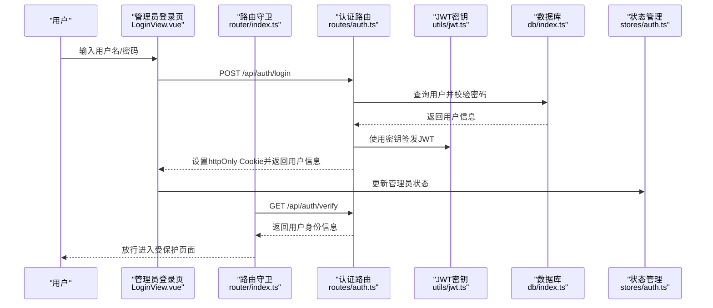
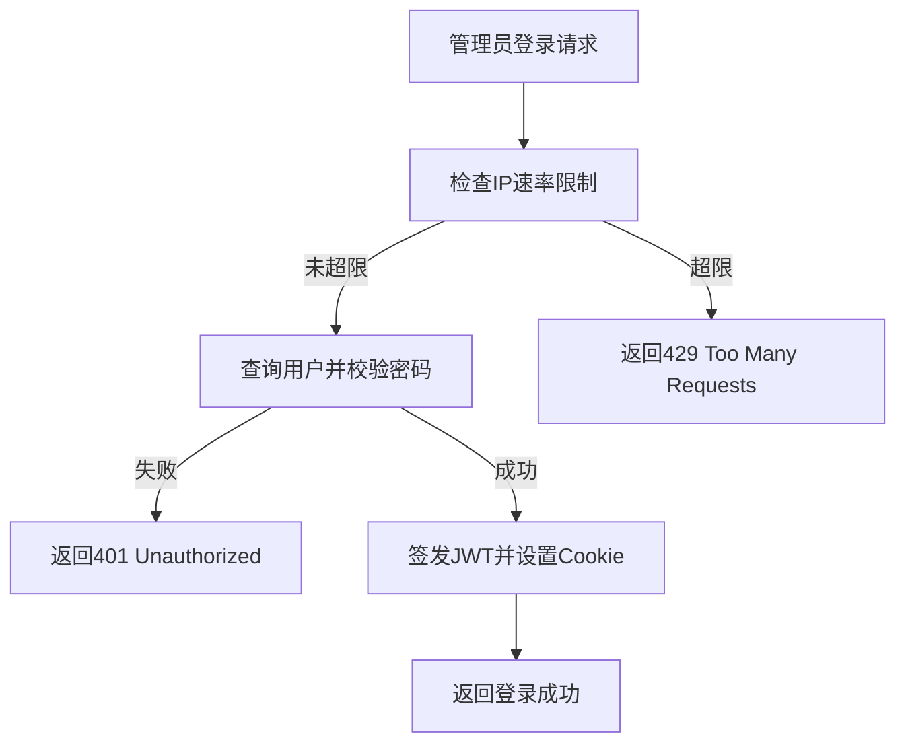
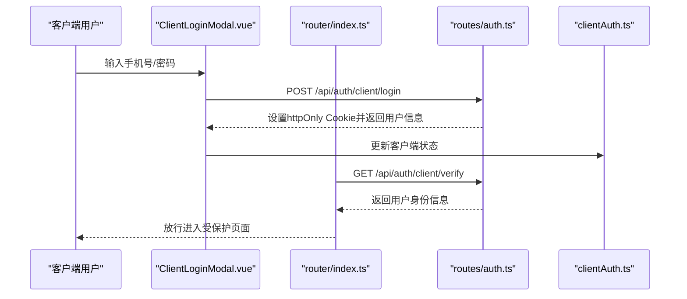
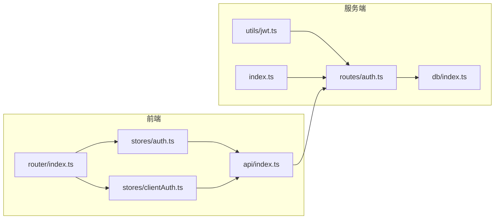

# 认证系统

<cite>
**本文引用的文件列表**
- [jwt.ts](file://server/src/utils/jwt.ts)
- [auth.ts](file://server/src/routes/auth.ts)
- [index.ts](file://server/src/index.ts)
- [auth.ts](file://src/stores/auth.ts)
- [clientAuth.ts](file://src/stores/clientAuth.ts)
- [index.ts](file://src/api/index.ts)
- [index.ts](file://src/router/index.ts)
- [LoginView.vue](file://src/admin/views/LoginView.vue)
- [ClientLoginModal.vue](file://src/client/components/ClientLoginModal.vue)
- [index.ts](file://server/src/db/index.ts)
</cite>

## 目录
1. [简介](#简介)
2. [项目结构](#项目结构)
3. [核心组件](#核心组件)
4. [架构总览](#架构总览)
5. [组件详解](#组件详解)
6. [依赖关系分析](#依赖关系分析)
7. [性能与安全考量](#性能与安全考量)
8. [故障排查指南](#故障排查指南)
9. [结论](#结论)

## 简介
本文件面向RLRMS餐厅管理系统，系统性梳理认证体系的设计与实现，覆盖以下主题：
- JWT认证机制：令牌生成算法、签名验证、过期时间管理
- 管理员认证流程：登录验证、密码加密、权限验证
- 客户端认证：会话管理、自动登录、令牌刷新机制
- 认证中间件：权限控制、访问限制
- 安全最佳实践：密码哈希、防暴力破解、CSRF防护等

## 项目结构
认证相关代码主要分布在服务端与前端两部分：
- 服务端：JWT密钥管理、认证路由、数据库交互、安全响应头与中间件
- 前端：Pinia状态管理、API封装、路由守卫、视图层登录组件

图表来源
- [jwt.ts:1-27](file://server/src/utils/jwt.ts#L1-L27)
- [auth.ts:1-405](file://server/src/routes/auth.ts#L1-L405)
- [index.ts:40-176](file://server/src/index.ts#L40-L176)
- [auth.ts:1-128](file://src/stores/auth.ts#L1-L128)
- [clientAuth.ts:1-87](file://src/stores/clientAuth.ts#L1-L87)
- [index.ts:1-608](file://src/api/index.ts#L1-L608)
- [index.ts:1-317](file://src/router/index.ts#L1-L317)

章节来源
- [jwt.ts:1-27](file://server/src/utils/jwt.ts#L1-L27)
- [auth.ts:1-405](file://server/src/routes/auth.ts#L1-L405)
- [index.ts:40-176](file://server/src/index.ts#L40-L176)
- [auth.ts:1-128](file://src/stores/auth.ts#L1-L128)
- [clientAuth.ts:1-87](file://src/stores/clientAuth.ts#L1-L87)
- [index.ts:1-608](file://src/api/index.ts#L1-L608)
- [index.ts:1-317](file://src/router/index.ts#L1-L317)

## 核心组件
- JWT密钥管理：开发与生产环境密钥生成策略，避免硬编码
- 认证路由：管理员登录/登出/校验；客户端登录/登出/校验；修改密码
- 前端状态管理：管理员与客户端会话生命周期、保活与过期处理
- API封装：统一请求、401处理、缓存策略
- 路由守卫：受保护路由的鉴权与自动登录流程
- 数据库封装：查询/更新用户信息，支持批量写入与持久化

章节来源
- [jwt.ts:1-27](file://server/src/utils/jwt.ts#L1-L27)
- [auth.ts:62-344](file://server/src/routes/auth.ts#L62-L344)
- [auth.ts:15-127](file://src/stores/auth.ts#L15-L127)
- [clientAuth.ts:10-86](file://src/stores/clientAuth.ts#L10-L86)
- [index.ts:54-126](file://src/api/index.ts#L54-L126)
- [index.ts:201-277](file://src/router/index.ts#L201-L277)
- [index.ts:100-147](file://server/src/db/index.ts#L100-L147)

## 架构总览
认证系统采用“基于Cookie的JWT”方案，服务端负责签发与验证，前端通过Cookie存储与自动恢复登录状态，并在路由层进行访问控制。

图表来源
- [LoginView.vue:20-42](file://src/admin/views/LoginView.vue#L20-L42)
- [index.ts:249-273](file://src/router/index.ts#L249-L273)
- [auth.ts:65-144](file://server/src/routes/auth.ts#L65-L144)
- [jwt.ts:20-26](file://server/src/utils/jwt.ts#L20-L26)
- [index.ts:112-125](file://server/src/db/index.ts#L112-L125)
- [auth.ts:71-85](file://src/stores/auth.ts#L71-L85)

## 组件详解

### JWT认证机制
- 密钥生成策略
  - 开发环境：基于主机名与用户名派生固定密钥，保证热重载不使令牌失效
  - 生产环境：默认使用随机密钥，也可通过环境变量显式指定
- 令牌签发与验证
  - 管理员：签发1天有效期的JWT，存储于httpOnly Cookie
  - 客户端：签发7天有效期的JWT，存储于httpOnly Cookie
  - 验证：从Cookie读取并使用对应密钥验证
- 安全属性
  - httpOnly：防止XSS窃取
  - secure：生产环境启用
  - sameSite：Lax
  - maxAge：管理员1天，客户端7天

章节来源
- [jwt.ts:11-26](file://server/src/utils/jwt.ts#L11-L26)
- [auth.ts:113-127](file://server/src/routes/auth.ts#L113-L127)
- [auth.ts:264-278](file://server/src/routes/auth.ts#L264-L278)

### 管理员认证流程
- 登录
  - 校验IP速率限制（15分钟最多5次）
  - 查询用户并bcrypt校验密码
  - 成功后签发JWT并设置Cookie
- 登出
  - 清除Cookie
- 校验
  - 从Cookie读取并验证JWT
  - 返回用户身份信息
- 修改密码
  - 需要携带管理员Cookie
  - 校验旧密码，哈希新密码并更新

图表来源
- [auth.ts:65-144](file://server/src/routes/auth.ts#L65-L144)

章节来源
- [auth.ts:65-144](file://server/src/routes/auth.ts#L65-L144)
- [auth.ts:147-179](file://server/src/routes/auth.ts#L147-L179)
- [auth.ts:347-405](file://server/src/routes/auth.ts#L347-L405)

### 客户端认证流程
- 自动登录/注册
  - 校验手机号格式与密码强度
  - 若用户不存在则自动注册（唯一会员号约束兜底）
  - 成功后签发7天JWT并设置Cookie
- 登出与校验
  - 清除Cookie；校验时额外检查用户是否存在
- 前端自动恢复
  - 页面加载时尝试恢复登录状态，未登录则弹出登录模态

图表来源
- [ClientLoginModal.vue:47-88](file://src/client/components/ClientLoginModal.vue#L47-L88)
- [index.ts:208-247](file://src/router/index.ts#L208-L247)
- [auth.ts:182-294](file://server/src/routes/auth.ts#L182-L294)
- [clientAuth.ts:38-54](file://src/stores/clientAuth.ts#L38-L54)

章节来源
- [auth.ts:182-294](file://server/src/routes/auth.ts#L182-L294)
- [clientAuth.ts:10-86](file://src/stores/clientAuth.ts#L10-L86)
- [ClientLoginModal.vue:1-351](file://src/client/components/ClientLoginModal.vue#L1-L351)

### 认证中间件与权限控制
- 服务端中间件
  - cookieParser：解析Cookie
  - 安全响应头：X-Content-Type-Options、X-Frame-Options、X-XSS-Protection、Referrer-Policy
  - 401错误捕获：统一返回无效token
- 前端路由守卫
  - 管理员路由：若未登录则调用后端校验接口恢复登录，否则跳转登录页
  - 客户端路由：受保护页面需登录，否则弹出登录模态
- 401处理
  - API层对401进行统一处理，触发全局会话过期事件

章节来源
- [index.ts:45-67](file://server/src/index.ts#L45-L67)
- [index.ts:122-140](file://server/src/index.ts#L122-L140)
- [index.ts:201-277](file://src/router/index.ts#L201-L277)
- [index.ts:94-114](file://src/api/index.ts#L94-L114)

### 会话管理与保活
- 管理员会话
  - 登录后设置会话过期时间为24小时
  - 每5分钟向后端发起一次令牌校验，失败则触发过期事件并清理状态
- 客户端会话
  - 登录后设置会话过期时间为7天
  - 提供tryRestore方法尝试从Cookie恢复登录状态
- 自动登录
  - 受保护客户端路由访问前，若未登录则弹出登录模态，登录成功后放行

章节来源
- [auth.ts:15-127](file://src/stores/auth.ts#L15-L127)
- [clientAuth.ts:10-86](file://src/stores/clientAuth.ts#L10-L86)
- [index.ts:208-247](file://src/router/index.ts#L208-L247)

### 密码哈希与安全
- bcrypt加密
  - 管理员登录与客户端密码修改均使用bcrypt比较与哈希
- 密码强度
  - 最短6位，最长128位
- 速率限制
  - 登录尝试按IP维度限制，15分钟窗口内最多5次

章节来源
- [auth.ts:101-108](file://server/src/routes/auth.ts#L101-L108)
- [auth.ts:252-259](file://server/src/routes/auth.ts#L252-L259)
- [auth.ts:366-379](file://server/src/routes/auth.ts#L366-L379)
- [auth.ts:347-405](file://server/src/routes/auth.ts#L347-L405)
- [auth.ts:34-55](file://server/src/routes/auth.ts#L34-L55)

### CSRF防护
- 当前实现
  - 使用httpOnly Cookie存储JWT，天然抵御XSS窃取
  - 未引入CSRF Token或Origin/CORS策略
- 建议
  - 对于非Cookie凭据场景，建议引入CSRF Token
  - 或通过严格的CORS与SameSite策略配合

章节来源
- [auth.ts:121-127](file://server/src/routes/auth.ts#L121-L127)
- [auth.ts:272-278](file://server/src/routes/auth.ts#L272-L278)

## 依赖关系分析

图表来源
- [jwt.ts:1-27](file://server/src/utils/jwt.ts#L1-L27)
- [auth.ts:1-405](file://server/src/routes/auth.ts#L1-L405)
- [index.ts:40-176](file://server/src/index.ts#L40-L176)
- [index.ts:1-156](file://server/src/db/index.ts#L1-L156)
- [auth.ts:1-128](file://src/stores/auth.ts#L1-L128)
- [clientAuth.ts:1-87](file://src/stores/clientAuth.ts#L1-L87)
- [index.ts:1-608](file://src/api/index.ts#L1-L608)
- [index.ts:1-317](file://src/router/index.ts#L1-L317)

章节来源
- [jwt.ts:1-27](file://server/src/utils/jwt.ts#L1-L27)
- [auth.ts:1-405](file://server/src/routes/auth.ts#L1-L405)
- [index.ts:40-176](file://server/src/index.ts#L40-L176)
- [index.ts:1-156](file://server/src/db/index.ts#L1-L156)
- [auth.ts:1-128](file://src/stores/auth.ts#L1-L128)
- [clientAuth.ts:1-87](file://src/stores/clientAuth.ts#L1-L87)
- [index.ts:1-608](file://src/api/index.ts#L1-L608)
- [index.ts:1-317](file://src/router/index.ts#L1-L317)

## 性能与安全考量
- 性能
  - 令牌校验频率：管理员每5分钟一次，客户端每7天一次，避免频繁网络开销
  - 前端缓存：API层采用stale-while-revalidate策略，提升首屏与弱网体验
- 安全
  - httpOnly Cookie：有效降低XSS风险
  - 生产环境secure与sameSite：减少中间人攻击与跨站请求
  - 速率限制：防暴力破解
  - bcrypt：密码不可逆存储
- 可靠性
  - 401统一处理：前端收到401自动触发过期事件，避免状态不一致
  - 数据库写入去抖：批量写入合并，减少磁盘IO

章节来源
- [auth.ts:37-55](file://src/stores/auth.ts#L37-L55)
- [index.ts:9-34](file://src/api/index.ts#L9-L34)
- [index.ts:60-67](file://server/src/index.ts#L60-L67)
- [auth.ts:34-55](file://server/src/routes/auth.ts#L34-L55)
- [index.ts:36-60](file://server/src/db/index.ts#L36-L60)

## 故障排查指南
- 登录失败
  - 检查用户名/密码是否为空
  - 确认速率限制是否触发（15分钟最多5次）
  - 查看后端日志与401响应
- 会话过期
  - 前端401事件：会话过期提示并跳转登录
  - 管理员：路由守卫自动尝试恢复登录
  - 客户端：受保护路由弹出登录模态
- Cookie问题
  - 确认Cookie属性（httpOnly、secure、sameSite、maxAge）
  - 生产环境需HTTPS以启用secure
- 密码修改失败
  - 校验旧密码是否正确
  - 新密码长度是否符合要求

章节来源
- [auth.ts:79-98](file://server/src/routes/auth.ts#L79-L98)
- [auth.ts:35-55](file://server/src/routes/auth.ts#L35-L55)
- [index.ts:94-114](file://src/api/index.ts#L94-L114)
- [index.ts:249-273](file://src/router/index.ts#L249-L273)
- [auth.ts:356-394](file://server/src/routes/auth.ts#L356-L394)

## 结论
本认证系统以“基于Cookie的JWT”为核心，结合Pinia状态管理、路由守卫与统一API封装，实现了管理员与客户端双端认证。通过httpOnly Cookie、速率限制、bcrypt哈希与安全响应头等措施，有效提升了安全性与用户体验。后续可在CSRF防护方面进一步完善，以应对更复杂的跨站场景。