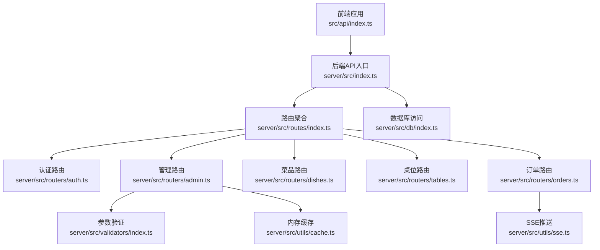
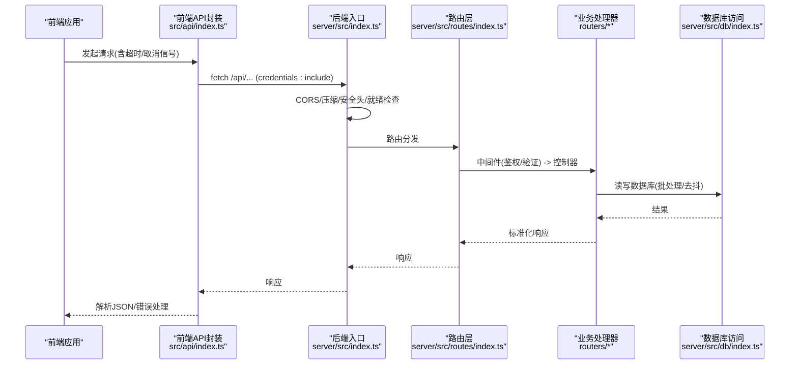
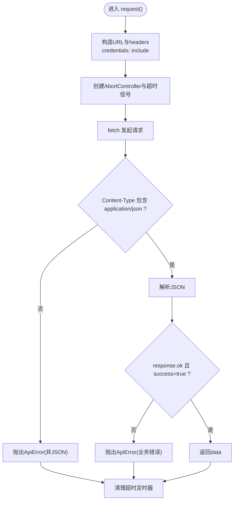
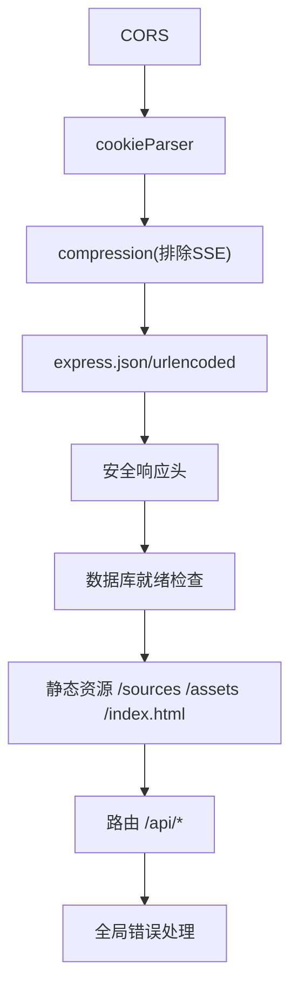
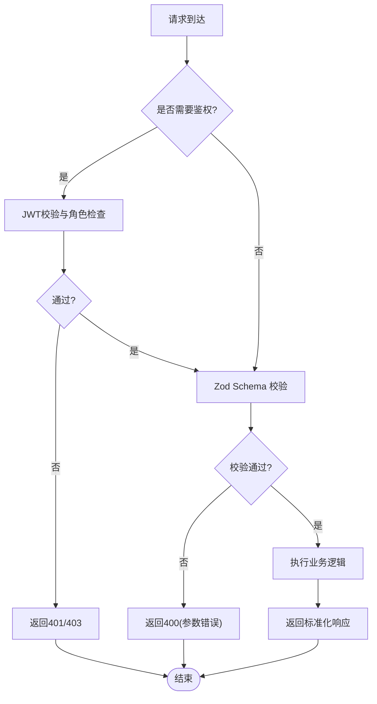
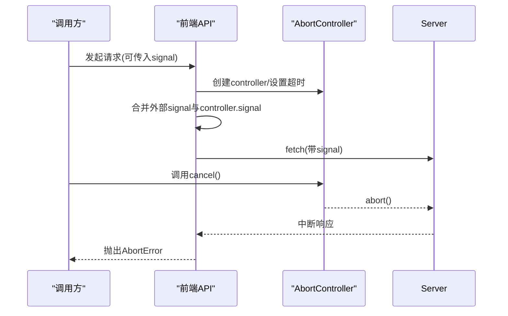
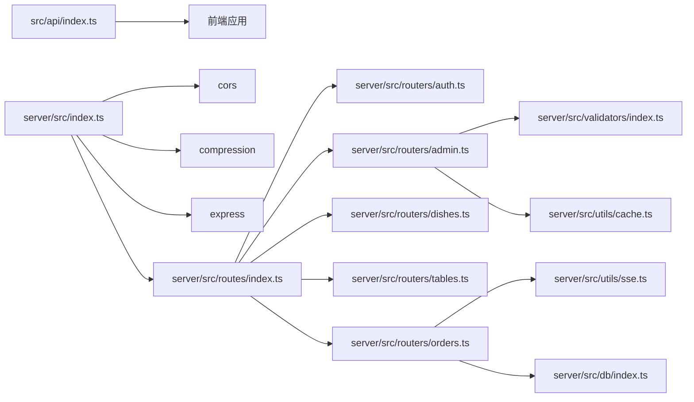

# HTTP请求处理机制

<cite>
**本文引用的文件**
- [src/api/index.ts](file://src/api/index.ts)
- [server/src/index.ts](file://server/src/index.ts)
- [server/src/dev-server.ts](file://server/src/dev-server.ts)
- [server/src/routes/index.ts](file://server/src/routes/index.ts)
- [server/src/routers/auth.ts](file://server/src/routers/auth.ts)
- [server/src/routers/admin.ts](file://server/src/routers/admin.ts)
- [server/src/routers/dishes.ts](file://server/src/routers/dishes.ts)
- [server/src/routers/tables.ts](file://server/src/routers/tables.ts)
- [server/src/routers/orders.ts](file://server/src/routers/orders.ts)
- [server/src/utils/jwt.ts](file://server/src/utils/jwt.ts)
- [server/src/utils/cache.ts](file://server/src/utils/cache.ts)
- [server/src/utils/format.ts](file://server/src/utils/format.ts)
- [server/src/utils/sse.ts](file://server/src/utils/sse.ts)
- [server/src/db/index.ts](file://server/src/db/index.ts)
- [server/src/validators/index.ts](file://server/src/validators/index.ts)
</cite>

## 目录
1. [引言](#引言)
2. [项目结构](#项目结构)
3. [核心组件](#核心组件)
4. [架构总览](#架构总览)
5. [详细组件分析](#详细组件分析)
6. [依赖关系分析](#依赖关系分析)
7. [性能考量](#性能考量)
8. [故障排查指南](#故障排查指南)
9. [结论](#结论)
10. [附录](#附录)

## 引言
本文件面向RLRMS餐厅管理系统，系统性梳理前后端HTTP请求处理机制，覆盖前端API封装层（请求拦截、响应处理、错误处理）、后端路由体系（中间件链路、参数验证、CORS配置）、请求超时控制与并发管理、以及典型HTTP方法（GET/POST/PUT/DELETE）的处理流程与错误策略（401/403/404等）。文档旨在帮助开发者快速理解并扩展API能力。

## 项目结构
- 前端API封装位于 src/api/index.ts，统一发起 /api 前缀请求，内置超时、取消、缓存与错误处理。
- 后端入口位于 server/src/index.ts，配置CORS、压缩、安全头、静态资源、路由挂载与全局错误处理。
- 路由按功能拆分：auth、admin、dishes、tables、orders；公共API与管理API分别挂载到 /api/{prefix}。
- 参数验证采用 Zod Schema，结合中间件进行输入校验。
- 缓存采用内存TTL缓存与stale-while-revalidate策略，提升读取性能。
- SSE用于管理端实时事件推送。

图表来源
- [server/src/index.ts:34-143](file://server/src/index.ts#L34-L143)
- [server/src/routes/index.ts:1-18](file://server/src/routes/index.ts#L1-L18)
- [src/api/index.ts:1-608](file://src/api/index.ts#L1-L608)

章节来源
- [server/src/index.ts:34-143](file://server/src/index.ts#L34-L143)
- [server/src/routes/index.ts:1-18](file://server/src/routes/index.ts#L1-L18)
- [src/api/index.ts:1-608](file://src/api/index.ts#L1-L608)

## 核心组件
- 前端请求封装与拦截
  - 统一基地址 /api，自动携带凭据（credentials: include），默认JSON头。
  - 超时控制：AbortController + AbortSignal，支持外部信号合并。
  - 非JSON响应防御：检测Content-Type，非application/json直接抛错。
  - 401处理：触发自定义事件“auth:expired”，便于UI登出与跳转。
  - 错误包装：统一ApiError，包含状态码与后端错误数据。
  - 缓存策略：stale-while-revalidate，提升弱网与重复请求体验。
  - 取消能力：createCancellableRequest 提供promise与cancel。
- 后端中间件与路由
  - CORS：生产环境按配置开启，允许凭证。
  - 压缩：对SSE禁用压缩，其余响应启用。
  - 安全头：X-Content-Type-Options、X-Frame-Options、X-XSS-Protection、Referrer-Policy。
  - 数据库就绪保护：非健康检查路径在初始化期间返回503。
  - 静态资源：/sources公开媒体资源；生产环境托管前端产物并SPA回退。
  - 全局错误处理：捕获UnauthorizedError/ValidationError/其他异常，返回标准化错误。
  - 路由挂载：/api 下按模块划分公共与管理API。
- 参数验证与中间件
  - Zod Schema：createOrderSchema、createDishSchema、updateDishSchema、createTableSchema、createCategorySchema、createInventorySchema、updateInventorySchema、updateOrderStatusSchema、confirmResetSchema、cancelOrderSchema、updateOrderItemsSchema、createUserSchema、updateUserSchema。
  - requireAuth：管理端JWT鉴权，401/403处理。
  - requireClientAuth：客户端JWT鉴权，绑定用户上下文。
- 缓存与SSE
  - 内存TTL缓存：categories、dishes、tables等键空间。
  - SSE：管理端事件流，心跳保活，断线清理。
- 数据库与批处理
  - sql.js + debounce保存：批量写入合并，减少I/O。
  - beginBatch/endBatch：事务化批量操作。

章节来源
- [src/api/index.ts:48-126](file://src/api/index.ts#L48-L126)
- [src/api/index.ts:17-34](file://src/api/index.ts#L17-L34)
- [src/api/index.ts:117-126](file://src/api/index.ts#L117-L126)
- [server/src/index.ts:37-67](file://server/src/index.ts#L37-L67)
- [server/src/index.ts:69-79](file://server/src/index.ts#L69-L79)
- [server/src/index.ts:88-120](file://server/src/index.ts#L88-L120)
- [server/src/index.ts:122-140](file://server/src/index.ts#L122-L140)
- [server/src/routers/admin.ts:115-131](file://server/src/routers/admin.ts#L115-L131)
- [server/src/routers/orders.ts:24-49](file://server/src/routers/orders.ts#L24-L49)
- [server/src/utils/cache.ts:18-43](file://server/src/utils/cache.ts#L18-L43)
- [server/src/utils/sse.ts:15-51](file://server/src/utils/sse.ts#L15-L51)
- [server/src/db/index.ts:47-73](file://server/src/db/index.ts#L47-L73)

## 架构总览
前端通过统一的请求封装与后端Express中间件链路交互，后端路由根据职责拆分，配合参数验证、鉴权中间件与缓存/SSE机制，形成清晰的请求-处理-响应闭环。

图表来源
- [src/api/index.ts:54-114](file://src/api/index.ts#L54-L114)
- [server/src/index.ts:34-143](file://server/src/index.ts#L34-L143)
- [server/src/routes/index.ts:1-18](file://server/src/routes/index.ts#L1-L18)

## 详细组件分析

### 前端API封装层
- 请求拦截与超时
  - 默认JSON头与凭据携带，统一基址/API前缀。
  - AbortController + AbortSignal合并，支持外部传入信号，实现可控取消。
  - 超时触发controller.abort()，finally中清理定时器。
- 非JSON响应防御
  - 检查Content-Type，非application/json直接抛出ApiError，避免HTML等非JSON响应导致解析错误。
- 401/403/通用错误
  - 401：触发“auth:expired”自定义事件，便于UI处理登出与重定向；可选择跳过全局401处理（skip401Handler）。
  - 4xx/非success：抛出ApiError，携带后端错误信息与状态码。
- 缓存与并发
  - stale-while-revalidate：命中缓存立即返回，后台静默刷新；缓存TTL 30秒。
  - 并发请求：多处接口独立请求，互不影响；部分接口（如首页）内部并发刷新。
- 取消能力
  - createCancellableRequest：返回promise与cancel函数，适合长列表/轮询场景。

图表来源
- [src/api/index.ts:54-114](file://src/api/index.ts#L54-L114)

章节来源
- [src/api/index.ts:48-126](file://src/api/index.ts#L48-L126)
- [src/api/index.ts:17-34](file://src/api/index.ts#L17-L34)
- [src/api/index.ts:117-126](file://src/api/index.ts#L117-L126)

### 后端路由系统与中间件链路
- 中间件链
  - CORS（生产环境按配置启用，允许凭证）
  - cookie解析、压缩（SSE禁用压缩）
  - express.json/urlencoded（大小限制）
  - 安全响应头设置
  - 数据库就绪检查（非健康检查路径）
  - 静态资源与SPA回退（生产环境）
  - 全局错误处理（UnauthorizedError/ValidationError/其他）
- 路由组织
  - /api/dishes、/api/tables、/api/orders、/api/auth
  - /api/admin（管理端）

图表来源
- [server/src/index.ts:37-120](file://server/src/index.ts#L37-L120)
- [server/src/index.ts:122-140](file://server/src/index.ts#L122-L140)

章节来源
- [server/src/index.ts:37-120](file://server/src/index.ts#L37-L120)
- [server/src/index.ts:122-140](file://server/src/index.ts#L122-L140)
- [server/src/routes/index.ts:1-18](file://server/src/routes/index.ts#L1-L18)

### 参数验证与中间件
- 验证器
  - createOrderSchema、createDishSchema、updateDishSchema、createTableSchema、createCategorySchema、createInventorySchema、updateInventorySchema、updateOrderStatusSchema、confirmResetSchema、cancelOrderSchema、updateOrderItemsSchema、createUserSchema、updateUserSchema。
- 中间件
  - requireAuth：管理端JWT鉴权，角色校验，401/403。
  - requireClientAuth：客户端JWT鉴权，绑定用户上下文，401。

图表来源
- [server/src/routers/admin.ts:115-131](file://server/src/routers/admin.ts#L115-L131)
- [server/src/routers/orders.ts:24-49](file://server/src/routers/orders.ts#L24-L49)
- [server/src/validators/index.ts:1-123](file://server/src/validators/index.ts#L1-L123)

章节来源
- [server/src/routers/admin.ts:115-131](file://server/src/routers/admin.ts#L115-L131)
- [server/src/routers/orders.ts:24-49](file://server/src/routers/orders.ts#L24-L49)
- [server/src/validators/index.ts:1-123](file://server/src/validators/index.ts#L1-L123)

### 请求超时控制、信号取消与并发管理
- 超时控制
  - 前端：AbortController + setTimeout，支持外部信号合并，finally清理定时器。
- 信号取消
  - createCancellableRequest：返回cancel函数，可随时中断请求。
- 并发管理
  - 多个独立请求并发执行；部分接口内部并发刷新缓存（fire-and-forget）。
- 后端批处理
  - beginBatch/endBatch：批量写入合并，saveDebounce：写入去抖，降低I/O压力。

图表来源
- [src/api/index.ts:67-74](file://src/api/index.ts#L67-L74)
- [src/api/index.ts:117-126](file://src/api/index.ts#L117-L126)
- [server/src/db/index.ts:47-73](file://server/src/db/index.ts#L47-L73)

章节来源
- [src/api/index.ts:67-74](file://src/api/index.ts#L67-L74)
- [src/api/index.ts:117-126](file://src/api/index.ts#L117-L126)
- [server/src/db/index.ts:47-73](file://server/src/db/index.ts#L47-L73)

### 典型HTTP请求处理示例

- GET：获取首页数据（stale-while-revalidate）
  - 前端：api.getHomeData()，命中缓存立即返回，后台静默刷新。
  - 后端：/dishes/home-data，查询分类与菜品，缓存30秒。
- POST：创建订单
  - 前端：api.createOrder(...)，requireClientAuth，Zod校验，服务端二次核价与批量写入，SSE广播。
  - 后端：/orders，批量插入订单与订单项，更新桌位状态。
- PUT：更新菜品
  - 前端：api.updateDish(id, data)，requireAuth，Zod校验。
  - 后端：/admin/dishes/:id，更新菜品并失效相关缓存。
- DELETE：删除桌位
  - 前端：api.deleteTable(id)，requireAuth。
  - 后端：/admin/tables/:id，存在未完成订单则拒绝删除。

章节来源
- [src/api/index.ts:128-148](file://src/api/index.ts#L128-L148)
- [server/src/routers/dishes.ts:67-117](file://server/src/routers/dishes.ts#L67-L117)
- [server/src/routers/orders.ts:194-353](file://server/src/routers/orders.ts#L194-L353)
- [server/src/routers/admin.ts:433-454](file://server/src/routers/admin.ts#L433-L454)
- [server/src/routers/admin.ts:308-337](file://server/src/routers/admin.ts#L308-L337)

### API错误处理策略
- 401 未认证
  - 前端：触发“auth:expired”，可选择跳过全局401处理（skip401Handler）。
  - 后端：requireAuth/requireClientAuth未携带或无效token时返回401。
- 403 权限不足
  - 后端：requireAuth校验角色非admin时返回403。
- 404 资源不存在
  - 后端：查询不到记录时返回404。
- 400 参数错误
  - 后端：Zod校验失败返回400；IP登录速率限制返回429。
- 500 服务器内部错误
  - 后端：全局错误处理器捕获异常，生产环境返回通用错误信息。

章节来源
- [src/api/index.ts:95-108](file://src/api/index.ts#L95-L108)
- [server/src/routers/admin.ts:115-131](file://server/src/routers/admin.ts#L115-L131)
- [server/src/routers/orders.ts:24-49](file://server/src/routers/orders.ts#L24-L49)
- [server/src/routers/auth.ts:69-75](file://server/src/routers/auth.ts#L69-L75)
- [server/src/index.ts:122-140](file://server/src/index.ts#L122-L140)

## 依赖关系分析
- 前端API依赖
  - src/api/index.ts 依赖浏览器fetch、AbortController、自定义错误类。
- 后端依赖
  - server/src/index.ts 依赖cors、cookie-parser、compression、express、dotenv。
  - 各路由依赖数据库访问层、缓存工具、SSE工具、JWT密钥、Zod验证器。
- 关键耦合点
  - 路由与验证器：各路由使用对应Zod Schema进行输入校验。
  - 路由与缓存：数据变更时主动失效相关缓存键。
  - 路由与SSE：订单状态变更通过SSE广播给管理端。

图表来源
- [server/src/index.ts:1-11](file://server/src/index.ts#L1-L11)
- [server/src/routes/index.ts:1-18](file://server/src/routes/index.ts#L1-L18)
- [server/src/routers/admin.ts:11-17](file://server/src/routers/admin.ts#L11-L17)
- [server/src/routers/orders.ts:1-10](file://server/src/routers/orders.ts#L1-L10)

章节来源
- [server/src/index.ts:1-11](file://server/src/index.ts#L1-L11)
- [server/src/routes/index.ts:1-18](file://server/src/routes/index.ts#L1-L18)
- [server/src/routers/admin.ts:11-17](file://server/src/routers/admin.ts#L11-L17)
- [server/src/routers/orders.ts:1-10](file://server/src/routers/orders.ts#L1-L10)

## 性能考量
- 前端
  - 缓存策略：stale-while-revalidate，显著降低重复请求与网络往返。
  - 压缩：对SSE禁用压缩，保证实时推送不被缓冲。
- 后端
  - 内存缓存：categories/dishes/tables等键空间，TTL 30秒或更短（如tables可用性5秒）。
  - 批处理：beginBatch/endBatch合并多次写入，saveDebounce减少磁盘I/O。
  - 安全头与CORS：减少跨域与嗅探风险，间接提升安全性与稳定性。
- 数据库
  - sql.js嵌入式存储，适合小规模部署；批处理与去抖保存优化吞吐。

章节来源
- [src/api/index.ts:17-34](file://src/api/index.ts#L17-L34)
- [server/src/index.ts:46-56](file://server/src/index.ts#L46-L56)
- [server/src/utils/cache.ts:18-61](file://server/src/utils/cache.ts#L18-L61)
- [server/src/db/index.ts:47-73](file://server/src/db/index.ts#L47-L73)

## 故障排查指南
- 常见问题定位
  - 401/403：检查cookie与JWT签名；确认requireAuth/requireClientAuth是否正确传递token。
  - 400参数错误：检查Zod Schema报错信息，确认请求体格式与字段约束。
  - 503数据库未就绪：等待初始化完成或检查初始化日志。
  - SSE无推送：确认SSE客户端连接与心跳，检查服务端广播逻辑。
- 前端调试
  - 使用createCancellableRequest在组件卸载时cancel，避免悬挂请求。
  - 观察“auth:expired”事件，确保登录态失效时页面正确跳转。
- 后端调试
  - 查看全局错误处理器输出，区分UnauthorizedError/ValidationError与其他异常。
  - 检查数据库批处理与保存时机，避免数据不一致。

章节来源
- [server/src/index.ts:122-140](file://server/src/index.ts#L122-L140)
- [server/src/routers/admin.ts:115-131](file://server/src/routers/admin.ts#L115-L131)
- [server/src/routers/orders.ts:24-49](file://server/src/routers/orders.ts#L24-L49)
- [src/api/index.ts:95-108](file://src/api/index.ts#L95-L108)

## 结论
本系统在前端提供了统一、健壮的HTTP请求封装（超时、取消、缓存、错误处理），在后端实现了清晰的中间件链路与路由分层、严格的参数验证与鉴权中间件、以及高效的缓存与批处理机制。整体设计兼顾了易用性、可维护性与性能表现，适用于中小型餐厅管理场景的快速迭代与稳定运行。

## 附录
- 开发与生产差异
  - 开发：server/src/dev-server.ts直接启动，便于本地联调。
  - 生产：server/src/index.ts启用CORS与静态资源托管，提供健康检查与进程退出钩子。
- JWT密钥
  - 开发模式基于主机特征派生固定密钥；生产模式可配置JWT_SECRET，建议持久化。

章节来源
- [server/src/dev-server.ts:1-18](file://server/src/dev-server.ts#L1-L18)
- [server/src/index.ts:164-176](file://server/src/index.ts#L164-L176)
- [server/src/utils/jwt.ts:11-26](file://server/src/utils/jwt.ts#L11-L26)