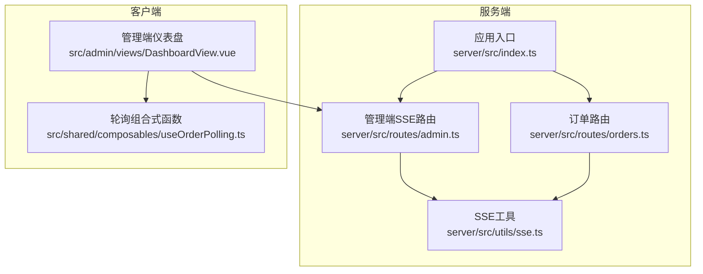
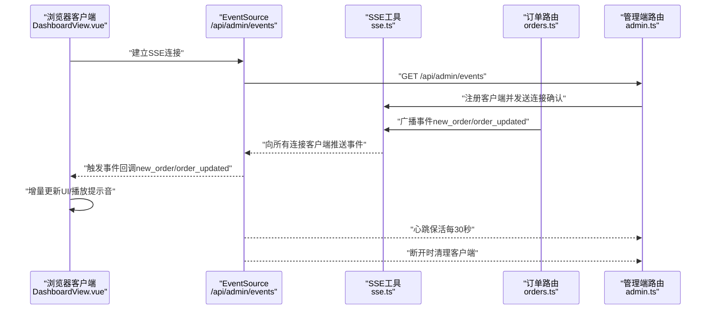
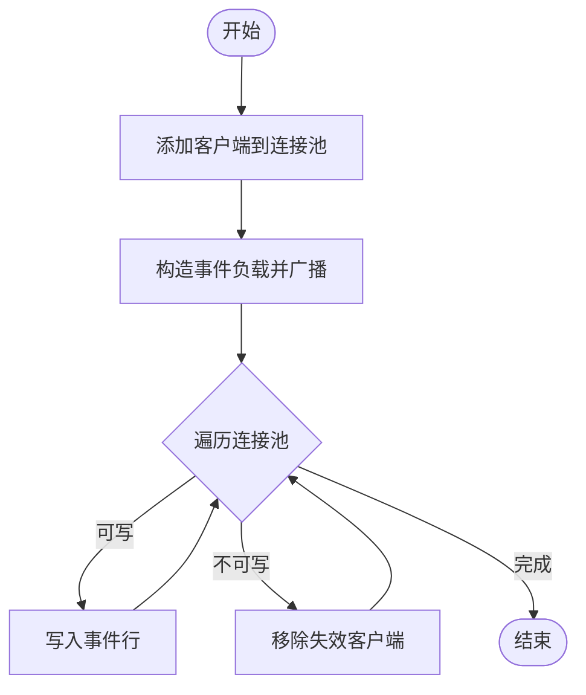
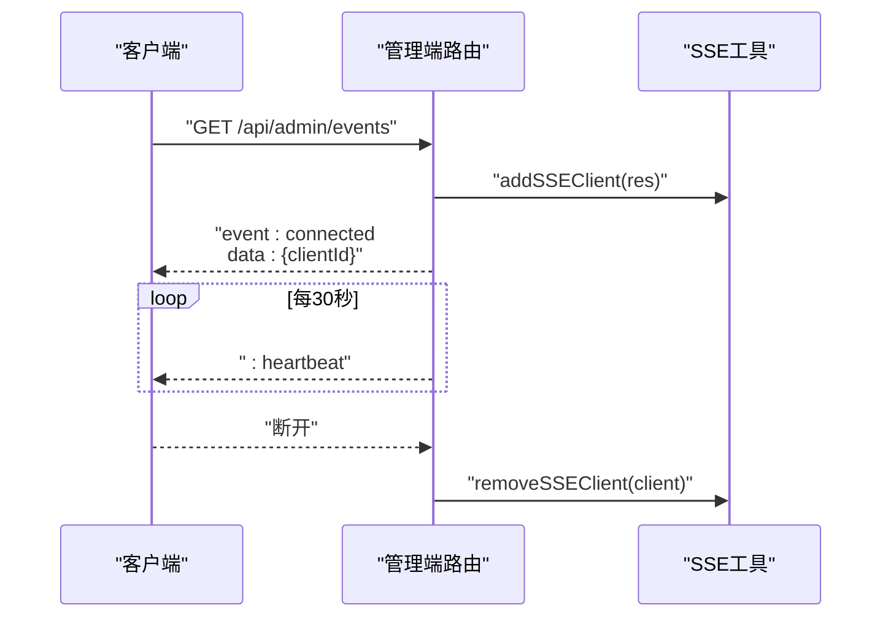
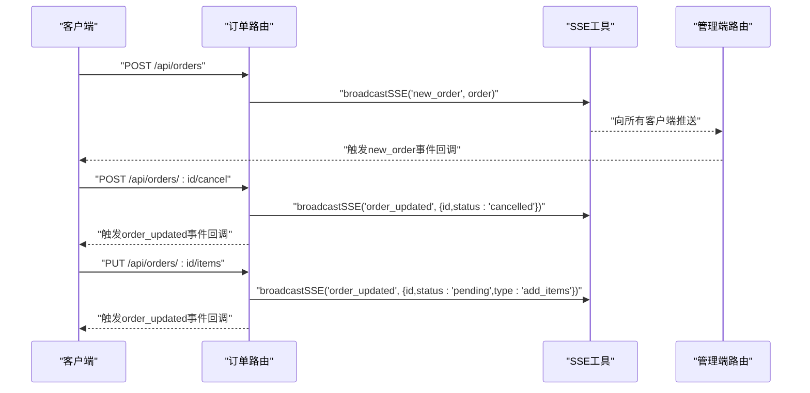
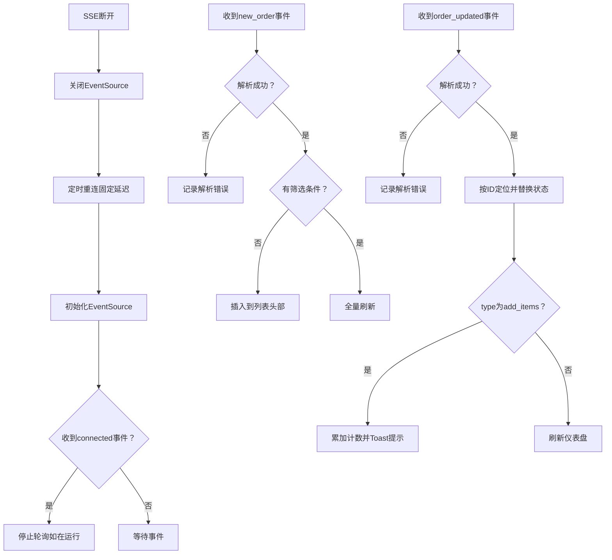
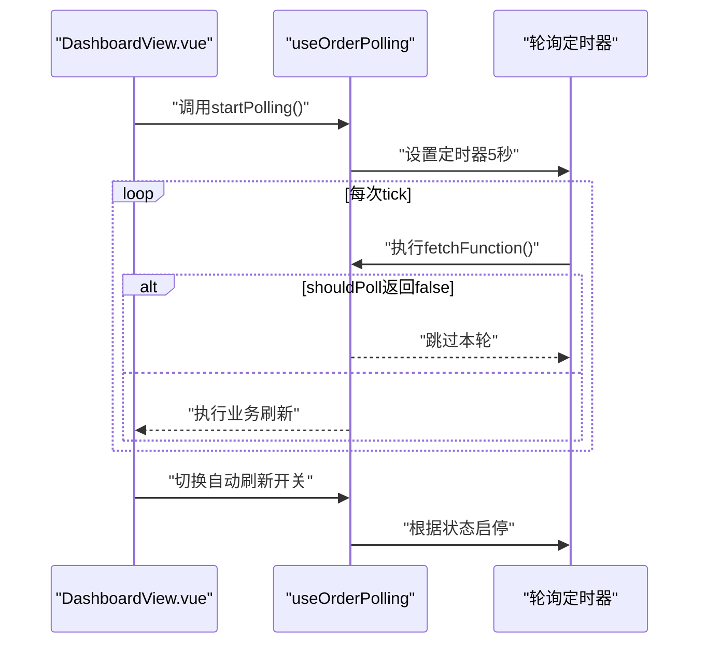
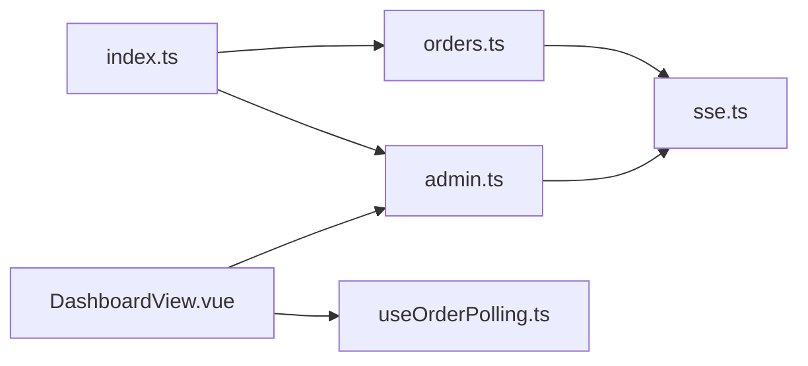

# 实时数据流

<cite>
**本文引用的文件**
- [server/src/utils/sse.ts](file://server/src/utils/sse.ts)
- [server/src/routes/admin.ts](file://server/src/routes/admin.ts)
- [server/src/routes/orders.ts](file://server/src/routes/orders.ts)
- [server/src/index.ts](file://server/src/index.ts)
- [src/admin/views/DashboardView.vue](file://src/admin/views/DashboardView.vue)
- [src/shared/composables/useOrderPolling.ts](file://src/shared/composables/useOrderPolling.ts)
</cite>

## 目录
1. [简介](#简介)
2. [项目结构](#项目结构)
3. [核心组件](#核心组件)
4. [架构总览](#架构总览)
5. [详细组件分析](#详细组件分析)
6. [依赖关系分析](#依赖关系分析)
7. [性能考量](#性能考量)
8. [故障排查指南](#故障排查指南)
9. [结论](#结论)
10. [附录](#附录)

## 简介
本文件面向RLRMS餐厅管理系统，聚焦“实时数据流”主题，系统化梳理基于Server-Sent Events（SSE）的服务器推送机制与客户端事件监听实现，覆盖事件流建立、消息格式、连接管理、错误处理与断线重连策略；并结合订单状态实时更新的完整数据流，给出最佳实践与可复用的Vue组合式函数示例路径，帮助开发者快速集成与扩展。

## 项目结构
围绕实时数据流的关键模块分布如下：
- 服务端
  - SSE工具：维护客户端连接池、广播消息、心跳保活
  - 管理端路由：提供SSE事件通道、订单状态变更广播
  - 订单路由：触发新订单与订单更新事件广播
  - 应用入口：禁用SSE响应的压缩，保证实时性
- 客户端
  - Vue页面：使用EventSource订阅SSE事件，实现增量更新与断线重连
  - 组合式函数：封装轮询降级与可见性感知

图表来源
- [server/src/utils/sse.ts:1-59](file://server/src/utils/sse.ts#L1-L59)
- [server/src/routes/admin.ts:133-162](file://server/src/routes/admin.ts#L133-L162)
- [server/src/routes/orders.ts:342-343](file://server/src/routes/orders.ts#L342-L343)
- [server/src/index.ts:45-56](file://server/src/index.ts#L45-L56)
- [src/admin/views/DashboardView.vue:302-391](file://src/admin/views/DashboardView.vue#L302-L391)
- [src/shared/composables/useOrderPolling.ts:1-74](file://src/shared/composables/useOrderPolling.ts#L1-L74)

章节来源
- [server/src/utils/sse.ts:1-59](file://server/src/utils/sse.ts#L1-L59)
- [server/src/routes/admin.ts:133-162](file://server/src/routes/admin.ts#L133-L162)
- [server/src/routes/orders.ts:342-343](file://server/src/routes/orders.ts#L342-L343)
- [server/src/index.ts:45-56](file://server/src/index.ts#L45-L56)
- [src/admin/views/DashboardView.vue:302-391](file://src/admin/views/DashboardView.vue#L302-L391)
- [src/shared/composables/useOrderPolling.ts:1-74](file://src/shared/composables/useOrderPolling.ts#L1-L74)

## 核心组件
- SSE客户端连接管理
  - 维护连接池、添加/移除客户端、广播事件、统计连接数
- 管理端SSE事件通道
  - 设置SSE响应头、发送连接确认、心跳保活、断开清理
- 订单状态变更广播
  - 新订单创建、订单取消、加菜更新等场景触发事件广播
- 客户端事件监听器
  - EventSource订阅、事件解析、增量更新、断线重连、轮询降级
- 轮询降级组合式函数
  - 自动轮询、可见性感知、新增订单计数、降级开关

章节来源
- [server/src/utils/sse.ts:1-59](file://server/src/utils/sse.ts#L1-L59)
- [server/src/routes/admin.ts:133-162](file://server/src/routes/admin.ts#L133-L162)
- [server/src/routes/orders.ts:342-343](file://server/src/routes/orders.ts#L342-L343)
- [src/admin/views/DashboardView.vue:302-391](file://src/admin/views/DashboardView.vue#L302-L391)
- [src/shared/composables/useOrderPolling.ts:1-74](file://src/shared/composables/useOrderPolling.ts#L1-L74)

## 架构总览
SSE实时数据流从服务器到客户端的端到端流程如下：

图表来源
- [server/src/routes/admin.ts:133-162](file://server/src/routes/admin.ts#L133-L162)
- [server/src/utils/sse.ts:15-51](file://server/src/utils/sse.ts#L15-L51)
- [server/src/routes/orders.ts:342-343](file://server/src/routes/orders.ts#L342-L343)
- [src/admin/views/DashboardView.vue:302-391](file://src/admin/views/DashboardView.vue#L302-L391)

## 详细组件分析

### SSE工具与连接管理
- 功能要点
  - 客户端连接池：保存每个连接的Response对象，生成唯一ID
  - 广播机制：构造标准SSE事件行，遍历副本避免并发修改
  - 错误处理：捕获写入异常与连接结束，及时移除失效客户端
  - 心跳保活：通过SSE注释行维持长连接活性
- 数据结构与复杂度
  - 连接池为数组存储，查找/移除按索引，整体操作近似O(n)
  - 广播为线性扫描，复杂度O(n)，其中n为当前连接数
- 关键实现位置
  - 客户端注册与移除：[server/src/utils/sse.ts:15-32](file://server/src/utils/sse.ts#L15-L32)
  - 事件广播与心跳：[server/src/utils/sse.ts:37-51](file://server/src/utils/sse.ts#L37-L51)

图表来源
- [server/src/utils/sse.ts:37-51](file://server/src/utils/sse.ts#L37-L51)

章节来源
- [server/src/utils/sse.ts:1-59](file://server/src/utils/sse.ts#L1-L59)

### 管理端SSE事件通道
- 功能要点
  - 设置SSE响应头（Content-Type、Cache-Control、Connection、X-Accel-Buffering）
  - 发送连接确认事件（connected），包含客户端ID
  - 心跳保活：每30秒发送注释行
  - 断开清理：监听close事件，清理心跳定时器与连接池
- 关键实现位置
  - SSE路由与心跳保活：[server/src/routes/admin.ts:133-162](file://server/src/routes/admin.ts#L133-L162)

图表来源
- [server/src/routes/admin.ts:133-162](file://server/src/routes/admin.ts#L133-L162)
- [server/src/utils/sse.ts:15-32](file://server/src/utils/sse.ts#L15-L32)

章节来源
- [server/src/routes/admin.ts:133-162](file://server/src/routes/admin.ts#L133-L162)

### 订单状态变更广播
- 触发点
  - 新订单创建：创建完成后广播new_order事件
  - 订单取消：取消完成后广播order_updated事件
  - 加菜更新：加菜完成后广播order_updated事件并携带type标识
- 关键实现位置
  - 新订单广播：[server/src/routes/orders.ts:342-343](file://server/src/routes/orders.ts#L342-L343)
  - 取消广播：[server/src/routes/orders.ts:410-411](file://server/src/routes/orders.ts#L410-L411)
  - 加菜广播：[server/src/routes/orders.ts:544-545](file://server/src/routes/orders.ts#L544-L545)

图表来源
- [server/src/routes/orders.ts:342-343](file://server/src/routes/orders.ts#L342-L343)
- [server/src/routes/orders.ts:410-411](file://server/src/routes/orders.ts#L410-L411)
- [server/src/routes/orders.ts:544-545](file://server/src/routes/orders.ts#L544-L545)
- [server/src/utils/sse.ts:37-51](file://server/src/utils/sse.ts#L37-L51)

章节来源
- [server/src/routes/orders.ts:342-343](file://server/src/routes/orders.ts#L342-L343)
- [server/src/routes/orders.ts:410-411](file://server/src/routes/orders.ts#L410-L411)
- [server/src/routes/orders.ts:544-545](file://server/src/routes/orders.ts#L544-L545)

### 客户端事件监听器设计
- EventSource对象使用
  - 订阅路径：/api/admin/events，withCredentials启用跨域Cookie
  - 事件监听：connected、new_order、order_updated
- 增量更新策略
  - new_order：无筛选条件时直接插入到列表头部，有筛选条件时全量刷新
  - order_updated：按ID定位并替换状态，同步更新选中订单状态
  - 加菜事件：累加计数、Toast提示、定时重置、刷新订单列表
- 重连机制
  - 断线时关闭EventSource并清理定时器
  - 启动定时重连，固定延迟重试
  - 切换自动刷新开关时，若SSE未连接则启动轮询降级
- 错误处理
  - 事件解析失败时记录错误日志
  - SSE断开后启用轮询作为降级方案

图表来源
- [src/admin/views/DashboardView.vue:302-391](file://src/admin/views/DashboardView.vue#L302-L391)

章节来源
- [src/admin/views/DashboardView.vue:302-391](file://src/admin/views/DashboardView.vue#L302-L391)

### 轮询降级与可见性感知
- 组合式函数useOrderPolling
  - 自动轮询：默认5秒间隔，支持自定义间隔
  - shouldPoll钩子：当SSE已连接时跳过轮询
  - 新增订单检测：比较前后订单数量差值，触发回调
  - 可见性感知：页面隐藏时停止轮询，显示时恢复
- 与SSE的协作
  - SSE连接成功后停止轮询
  - SSE断开后若启用自动刷新则启动轮询
  - 切换自动刷新开关时动态启停轮询

图表来源
- [src/shared/composables/useOrderPolling.ts:10-74](file://src/shared/composables/useOrderPolling.ts#L10-L74)
- [src/admin/views/DashboardView.vue:414-417](file://src/admin/views/DashboardView.vue#L414-L417)

章节来源
- [src/shared/composables/useOrderPolling.ts:1-74](file://src/shared/composables/useOrderPolling.ts#L1-L74)
- [src/admin/views/DashboardView.vue:414-417](file://src/admin/views/DashboardView.vue#L414-L417)

## 依赖关系分析
- 服务端耦合
  - 订单路由依赖SSE工具进行事件广播
  - 管理端SSE路由依赖SSE工具进行客户端注册与心跳
  - 应用入口对SSE响应禁用压缩，避免缓冲导致的实时性问题
- 客户端耦合
  - DashboardView依赖SSE事件与轮询降级逻辑
  - 轮询组合式函数独立于SSE，提供通用降级能力

图表来源
- [server/src/routes/orders.ts:6-6](file://server/src/routes/orders.ts#L6-L6)
- [server/src/utils/sse.ts:1-10](file://server/src/utils/sse.ts#L1-L10)
- [server/src/routes/admin.ts:15-15](file://server/src/routes/admin.ts#L15-L15)
- [server/src/index.ts:45-56](file://server/src/index.ts#L45-L56)
- [src/admin/views/DashboardView.vue:302-391](file://src/admin/views/DashboardView.vue#L302-L391)
- [src/shared/composables/useOrderPolling.ts:1-74](file://src/shared/composables/useOrderPolling.ts#L1-L74)

章节来源
- [server/src/routes/orders.ts:6-6](file://server/src/routes/orders.ts#L6-L6)
- [server/src/utils/sse.ts:1-10](file://server/src/utils/sse.ts#L1-L10)
- [server/src/routes/admin.ts:15-15](file://server/src/routes/admin.ts#L15-L15)
- [server/src/index.ts:45-56](file://server/src/index.ts#L45-L56)
- [src/admin/views/DashboardView.vue:302-391](file://src/admin/views/DashboardView.vue#L302-L391)
- [src/shared/composables/useOrderPolling.ts:1-74](file://src/shared/composables/useOrderPolling.ts#L1-L74)

## 性能考量
- SSE实时性保障
  - 禁用SSE响应压缩，避免缓冲导致的推送延迟
  - 使用注释行作为心跳，降低带宽占用
- 广播效率
  - 广播时遍历连接池，建议控制同时在线客户端数量
  - 对于高并发场景，可考虑连接池分片或外部消息队列
- 客户端资源
  - 断线重连采用固定延迟，避免频繁重试造成抖动
  - 页面隐藏时停止轮询，减少CPU与网络消耗

章节来源
- [server/src/index.ts:45-56](file://server/src/index.ts#L45-L56)
- [server/src/utils/sse.ts:37-51](file://server/src/utils/sse.ts#L37-L51)
- [src/admin/views/DashboardView.vue:375-390](file://src/admin/views/DashboardView.vue#L375-L390)

## 故障排查指南
- SSE连接失败
  - 检查管理端SSE路由是否正确设置响应头
  - 确认鉴权中间件未拦截事件通道
- 事件未到达客户端
  - 核查SSE工具广播逻辑与客户端ID是否有效
  - 检查EventSource是否正确订阅路径与Cookie配置
- 断线后无自动恢复
  - 确认onerror回调是否触发重连定时器
  - 检查自动刷新开关状态与轮询降级逻辑
- 轮询降级未生效
  - 确认shouldPoll钩子返回值与SSE连接状态一致
  - 检查可见性变化事件是否正确启停轮询

章节来源
- [server/src/routes/admin.ts:133-162](file://server/src/routes/admin.ts#L133-L162)
- [server/src/utils/sse.ts:37-51](file://server/src/utils/sse.ts#L37-L51)
- [src/admin/views/DashboardView.vue:375-390](file://src/admin/views/DashboardView.vue#L375-L390)
- [src/shared/composables/useOrderPolling.ts:19-31](file://src/shared/composables/useOrderPolling.ts#L19-L31)

## 结论
本项目通过SSE实现了低延迟、低开销的实时数据流，配合客户端的事件监听与断线重连策略，形成“SSE为主、轮询为辅”的双通道机制。服务端以简洁的连接池与广播模型支撑多客户端实时推送，客户端以增量更新与心跳保活提升用户体验。建议在生产环境中结合监控指标与限流策略，持续优化实时性与稳定性。

## 附录
- 最佳实践清单
  - 服务端
    - 禁用SSE响应压缩，确保实时推送
    - 使用心跳注释行维持连接活性
    - 广播前进行连接有效性检查
  - 客户端
    - 使用withCredentials保持会话一致性
    - 增量更新优先，必要时全量刷新
    - 断线重连采用指数退避或固定延迟策略
    - 页面隐藏时停止轮询，显示时恢复
  - 代码示例路径
    - SSE工具与广播：[server/src/utils/sse.ts:37-51](file://server/src/utils/sse.ts#L37-L51)
    - 管理端SSE路由：[server/src/routes/admin.ts:133-162](file://server/src/routes/admin.ts#L133-L162)
    - 订单事件广播：[server/src/routes/orders.ts:342-343](file://server/src/routes/orders.ts#L342-L343)
    - 客户端事件监听与重连：[src/admin/views/DashboardView.vue:302-391](file://src/admin/views/DashboardView.vue#L302-L391)
    - 轮询降级组合式函数：[src/shared/composables/useOrderPolling.ts:10-74](file://src/shared/composables/useOrderPolling.ts#L10-L74)