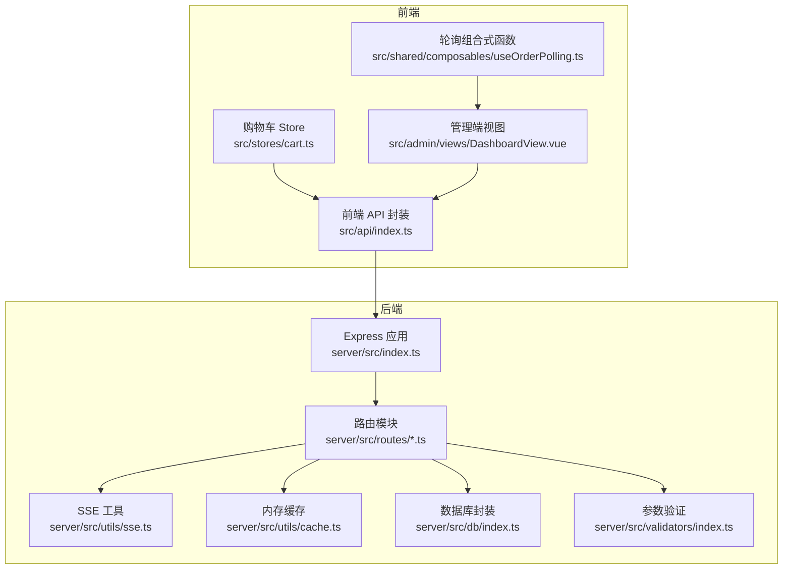
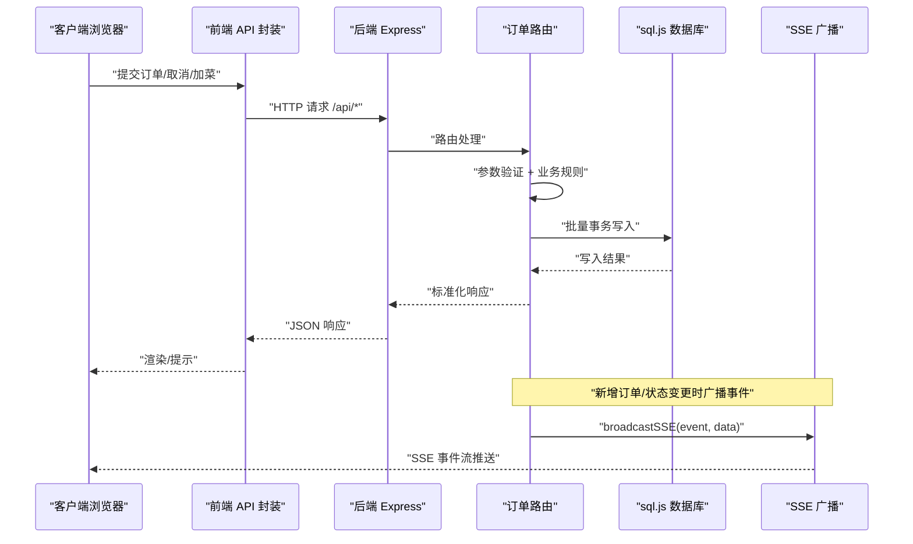
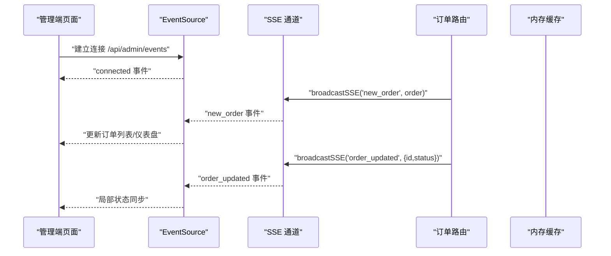
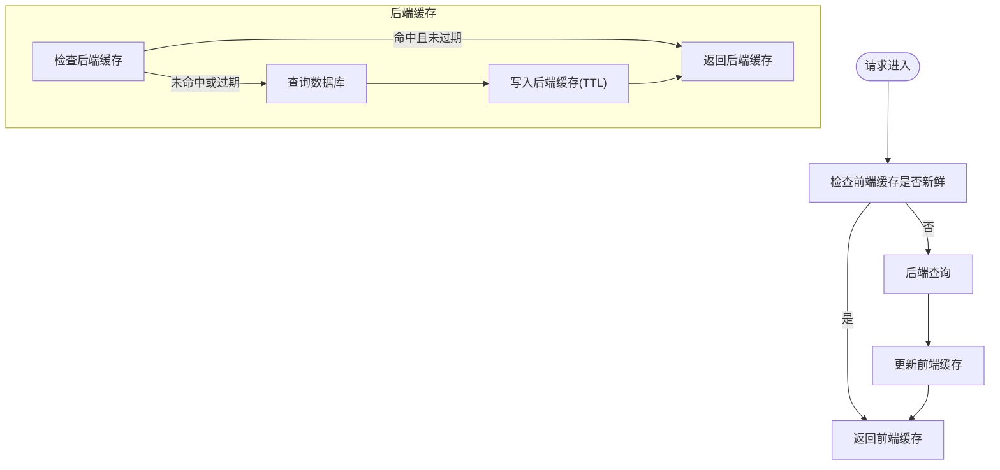
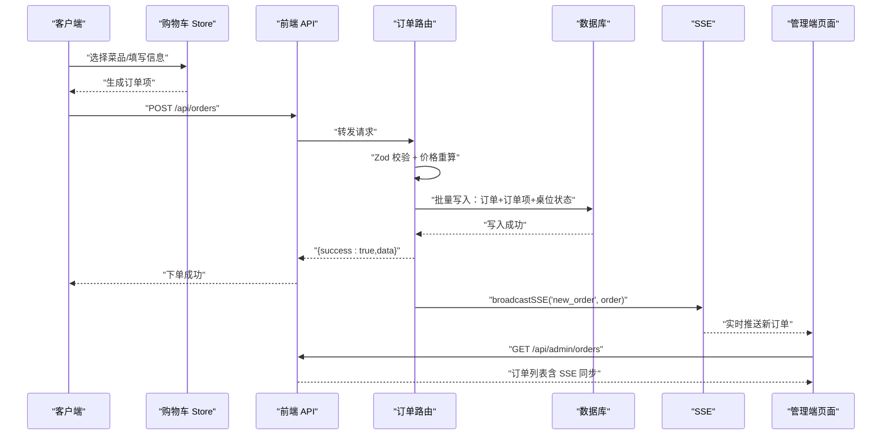
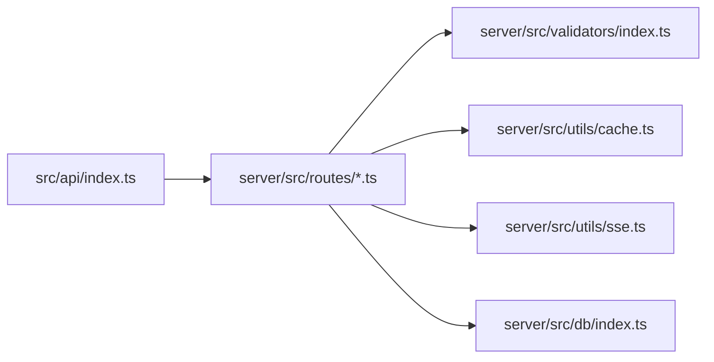

# 数据流设计

<cite>
**本文引用的文件**
- [server/src/index.ts](file://server/src/index.ts)
- [server/src/utils/sse.ts](file://server/src/utils/sse.ts)
- [server/src/utils/cache.ts](file://server/src/utils/cache.ts)
- [server/src/routes/orders.ts](file://server/src/routes/orders.ts)
- [server/src/routes/admin.ts](file://server/src/routes/admin.ts)
- [server/src/validators/index.ts](file://server/src/validators/index.ts)
- [server/src/db/index.ts](file://server/src/db/index.ts)
- [src/api/index.ts](file://src/api/index.ts)
- [src/stores/cart.ts](file://src/stores/cart.ts)
- [src/shared/composables/useOrderPolling.ts](file://src/shared/composables/useOrderPolling.ts)
- [src/admin/views/DashboardView.vue](file://src/admin/views/DashboardView.vue)
</cite>

## 目录
1. [简介](#简介)
2. [项目结构](#项目结构)
3. [核心组件](#核心组件)
4. [架构总览](#架构总览)
5. [详细组件分析](#详细组件分析)
6. [依赖关系分析](#依赖关系分析)
7. [性能考量](#性能考量)
8. [故障排查指南](#故障排查指南)
9. [结论](#结论)
10. [附录](#附录)

## 简介
本文件为 RLRMS 餐厅管理系统“数据流设计”文档，聚焦从前端到后端的完整数据传输机制，涵盖：
- HTTP 请求处理、参数验证、响应格式化
- 实时数据流（SSE 服务器推送事件、客户端事件监听、状态同步）
- 缓存策略（内存缓存、缓存失效、数据一致性）
- 订单状态变更的端到端数据流（从客户端提交到管理员接收）
- 关键业务场景的数据流图与时序图

## 项目结构
系统采用前后端分离架构：
- 前端：Vue 3 + Pinia + Vite，通过统一的 API 封装层调用后端 /api 接口
- 后端：Node.js + Express + sql.js 内嵌数据库，提供 RESTful 接口与 SSE 实时通道
- 数据库：基于 sql.js 的本地 SQLite 文件，支持批量事务与防抖落盘

图表来源
- [server/src/index.ts:1-176](file://server/src/index.ts#L1-L176)
- [src/api/index.ts:1-608](file://src/api/index.ts#L1-L608)
- [server/src/utils/sse.ts:1-59](file://server/src/utils/sse.ts#L1-L59)
- [server/src/utils/cache.ts:1-73](file://server/src/utils/cache.ts#L1-L73)
- [server/src/db/index.ts:1-156](file://server/src/db/index.ts#L1-L156)
- [server/src/validators/index.ts:1-123](file://server/src/validators/index.ts#L1-L123)

章节来源
- [server/src/index.ts:1-176](file://server/src/index.ts#L1-L176)
- [src/api/index.ts:1-608](file://src/api/index.ts#L1-L608)

## 核心组件
- 前端 API 封装：统一请求、超时、鉴权、错误处理、前端缓存（stale-while-revalidate）
- 后端 Express 应用：中间件链、CORS、压缩、健康检查、静态资源、错误处理
- 订单路由：客户端下单、取消、加菜；管理员查询、状态变更；SSE 广播
- 管理端路由：SSE 实时通道、仪表盘、订单/菜品/桌位管理
- 参数验证：Zod Schema 校验，覆盖订单、菜品、桌位、库存、用户等
- 内存缓存：TTL 缓存，配合缓存键前缀失效策略
- 数据库封装：sql.js + 批量事务 + 防抖落盘

章节来源
- [src/api/index.ts:1-608](file://src/api/index.ts#L1-L608)
- [server/src/index.ts:1-176](file://server/src/index.ts#L1-L176)
- [server/src/routes/orders.ts:1-552](file://server/src/routes/orders.ts#L1-L552)
- [server/src/routes/admin.ts:1-800](file://server/src/routes/admin.ts#L1-L800)
- [server/src/validators/index.ts:1-123](file://server/src/validators/index.ts#L1-L123)
- [server/src/utils/cache.ts:1-73](file://server/src/utils/cache.ts#L1-L73)
- [server/src/db/index.ts:1-156](file://server/src/db/index.ts#L1-L156)

## 架构总览
系统数据流分为三类：
- 同步请求：前端通过统一 API 层发起 HTTP 请求，后端执行业务逻辑并返回标准响应
- 实时推送：后端通过 SSE 广播订单事件，管理端 EventSource 监听并增量更新界面
- 缓存与一致性：后端内存缓存 + 前端内存缓存，结合缓存失效策略保证数据一致

图表来源
- [src/api/index.ts:128-286](file://src/api/index.ts#L128-L286)
- [server/src/routes/orders.ts:194-353](file://server/src/routes/orders.ts#L194-L353)
- [server/src/utils/sse.ts:37-51](file://server/src/utils/sse.ts#L37-L51)
- [server/src/db/index.ts:46-73](file://server/src/db/index.ts#L46-L73)

## 详细组件分析

### HTTP 请求处理与响应格式化
- 统一响应结构：success 字段 + data 或 error 字段，便于前端统一处理
- 错误处理：401（令牌无效）、400（参数校验失败）、500（内部错误），并输出友好消息
- 健康检查：/health 返回数据库初始化状态
- 压缩策略：对 SSE 流禁用压缩，避免缓冲导致实时性问题

章节来源
- [server/src/index.ts:122-140](file://server/src/index.ts#L122-L140)
- [server/src/index.ts:90-96](file://server/src/index.ts#L90-L96)
- [server/src/index.ts:46-56](file://server/src/index.ts#L46-L56)

### 参数验证与输入规范化
- 使用 Zod Schema 对订单、菜品、桌位、库存、用户等进行严格校验
- 订单创建：校验联系人、手机号、菜品清单、数量、单价、小计
- 订单取消：要求提供手机号进行身份验证
- 订单加菜：服务端重新核价，防止客户端篡改金额

章节来源
- [server/src/validators/index.ts:6-93](file://server/src/validators/index.ts#L6-L93)
- [server/src/routes/orders.ts:194-353](file://server/src/routes/orders.ts#L194-L353)

### 响应格式化与错误处理
- 后端统一返回 { success, data|error } 结构
- 前端请求封装：非 JSON 响应拦截、401 触发全局会话过期事件、超时控制、可取消请求
- 前端缓存：stale-while-revalidate，命中即刻返回，后台静默刷新

章节来源
- [src/api/index.ts:54-126](file://src/api/index.ts#L54-L126)
- [src/api/index.ts:128-148](file://src/api/index.ts#L128-L148)

### 实时数据流（SSE）
- 后端 SSE：维护客户端连接池，广播 new_order、order_updated 事件
- 管理端 EventSource：连接 /api/admin/events，心跳保活，断线重连
- 增量更新：收到事件后按条件更新列表或触发全量刷新，同步仪表盘数据

图表来源
- [server/src/utils/sse.ts:15-51](file://server/src/utils/sse.ts#L15-L51)
- [server/src/routes/admin.ts:134-162](file://server/src/routes/admin.ts#L134-L162)
- [src/admin/views/DashboardView.vue:308-352](file://src/admin/views/DashboardView.vue#L308-L352)

章节来源
- [server/src/utils/sse.ts:1-59](file://server/src/utils/sse.ts#L1-L59)
- [server/src/routes/admin.ts:134-162](file://server/src/routes/admin.ts#L134-L162)
- [src/admin/views/DashboardView.vue:308-352](file://src/admin/views/DashboardView.vue#L308-L352)

### 缓存策略设计
- 内存缓存（后端）：TTL 缓存 + 前缀失效，用于分类、菜品、设置、可用桌位等
- 前端缓存：stale-while-revalidate，30 秒 TTL，命中即返回，后台刷新
- 失效策略：写操作（新增/更新/删除）后主动失效相关缓存键
- 一致性保障：关键读取路径（如首页、菜品列表、可用桌位）优先走缓存，写后失效，避免脏读

图表来源
- [src/api/index.ts:9-34](file://src/api/index.ts#L9-L34)
- [server/src/utils/cache.ts:18-61](file://server/src/utils/cache.ts#L18-L61)

章节来源
- [src/api/index.ts:9-34](file://src/api/index.ts#L9-L34)
- [server/src/utils/cache.ts:1-73](file://server/src/utils/cache.ts#L1-L73)
- [server/src/routes/orders.ts:321-322](file://server/src/routes/orders.ts#L321-L322)
- [server/src/routes/admin.ts:259-260](file://server/src/routes/admin.ts#L259-L260)

### 订单状态变更数据流（端到端）
从客户端提交到管理员接收的完整流程如下：

图表来源
- [src/stores/cart.ts:78-87](file://src/stores/cart.ts#L78-L87)
- [src/api/index.ts:187-205](file://src/api/index.ts#L187-L205)
- [server/src/routes/orders.ts:194-353](file://server/src/routes/orders.ts#L194-L353)
- [server/src/utils/sse.ts:37-51](file://server/src/utils/sse.ts#L37-L51)
- [src/admin/views/DashboardView.vue:324-340](file://src/admin/views/DashboardView.vue#L324-L340)

章节来源
- [src/stores/cart.ts:1-183](file://src/stores/cart.ts#L1-L183)
- [src/api/index.ts:187-205](file://src/api/index.ts#L187-L205)
- [server/src/routes/orders.ts:194-353](file://server/src/routes/orders.ts#L194-L353)
- [server/src/utils/sse.ts:1-59](file://server/src/utils/sse.ts#L1-L59)
- [src/admin/views/DashboardView.vue:308-352](file://src/admin/views/DashboardView.vue#L308-L352)

### 客户端轮询与 SSE 的协同
- 管理端默认使用 SSE 实时推送，当 SSE 断开时自动回退轮询
- 轮询组合式函数：可配置间隔、可见性切换暂停/恢复、新增订单检测
- 优先级：SSE 优先，SSE 连接时停止轮询，断开后恢复轮询

章节来源
- [src/shared/composables/useOrderPolling.ts:1-74](file://src/shared/composables/useOrderPolling.ts#L1-L74)
- [src/admin/views/DashboardView.vue:308-352](file://src/admin/views/DashboardView.vue#L308-L352)

## 依赖关系分析
- 前端 API 依赖后端路由与响应格式
- 订单路由依赖参数验证、内存缓存、SSE 广播、数据库封装
- 管理端路由依赖 SSE 工具、内存缓存、数据库封装
- 数据库封装提供批量事务与防抖落盘能力

图表来源
- [src/api/index.ts:128-286](file://src/api/index.ts#L128-L286)
- [server/src/routes/orders.ts:1-552](file://server/src/routes/orders.ts#L1-L552)
- [server/src/routes/admin.ts:1-800](file://server/src/routes/admin.ts#L1-L800)
- [server/src/validators/index.ts:1-123](file://server/src/validators/index.ts#L1-L123)
- [server/src/utils/cache.ts:1-73](file://server/src/utils/cache.ts#L1-L73)
- [server/src/utils/sse.ts:1-59](file://server/src/utils/sse.ts#L1-L59)
- [server/src/db/index.ts:1-156](file://server/src/db/index.ts#L1-L156)

章节来源
- [src/api/index.ts:128-286](file://src/api/index.ts#L128-L286)
- [server/src/routes/orders.ts:1-552](file://server/src/routes/orders.ts#L1-L552)
- [server/src/routes/admin.ts:1-800](file://server/src/routes/admin.ts#L1-L800)
- [server/src/validators/index.ts:1-123](file://server/src/validators/index.ts#L1-L123)
- [server/src/utils/cache.ts:1-73](file://server/src/utils/cache.ts#L1-L73)
- [server/src/utils/sse.ts:1-59](file://server/src/utils/sse.ts#L1-L59)
- [server/src/db/index.ts:1-156](file://server/src/db/index.ts#L1-L156)

## 性能考量
- 批量事务：订单创建/加菜/批量排序等写操作使用 beginBatch/endBatch，减少磁盘 IO
- 防抖落盘：多次写入合并为一次持久化，降低写放大
- SSE 实时推送：避免轮询带来的网络与 CPU 开销
- 前端缓存：stale-while-revalidate 提升首屏与弱网体验
- 压缩策略：对 SSE 禁用压缩，确保事件实时性

章节来源
- [server/src/db/index.ts:46-73](file://server/src/db/index.ts#L46-L73)
- [server/src/index.ts:46-56](file://server/src/index.ts#L46-L56)
- [src/api/index.ts:9-34](file://src/api/index.ts#L9-L34)

## 故障排查指南
- 401 未授权：前端触发 auth:expired 事件，建议检查 Cookie、Token 是否过期
- 400 参数错误：检查请求体是否符合 Zod Schema，特别是订单项、手机号、UUID
- 500 内部错误：查看后端日志，关注数据库初始化状态与批量事务异常
- SSE 不推送：确认 /api/admin/events 是否正常返回，心跳是否持续，客户端 EventSource 是否断线重连
- 缓存不一致：写操作后检查是否调用了 cacheInvalidate 或 cacheInvalidatePrefix

章节来源
- [src/api/index.ts:94-114](file://src/api/index.ts#L94-L114)
- [server/src/index.ts:122-140](file://server/src/index.ts#L122-L140)
- [server/src/routes/admin.ts:134-162](file://server/src/routes/admin.ts#L134-L162)
- [server/src/utils/cache.ts:41-54](file://server/src/utils/cache.ts#L41-L54)

## 结论
本系统通过统一的 API 封装、严格的参数验证、内存缓存与批量事务优化，以及 SSE 实时推送，实现了从前端到后端高效、一致、可扩展的数据流。订单状态变更的端到端流程清晰，SSE 与轮询协同确保了高可用与低延迟的用户体验。

## 附录
- 关键业务场景：下单、取消、加菜、状态变更、SSE 实时推送
- 数据一致性：写后失效 + 防抖落盘 + 服务端重算价格
- 可扩展点：引入 Redis 缓存、分布式锁、消息队列异步处理