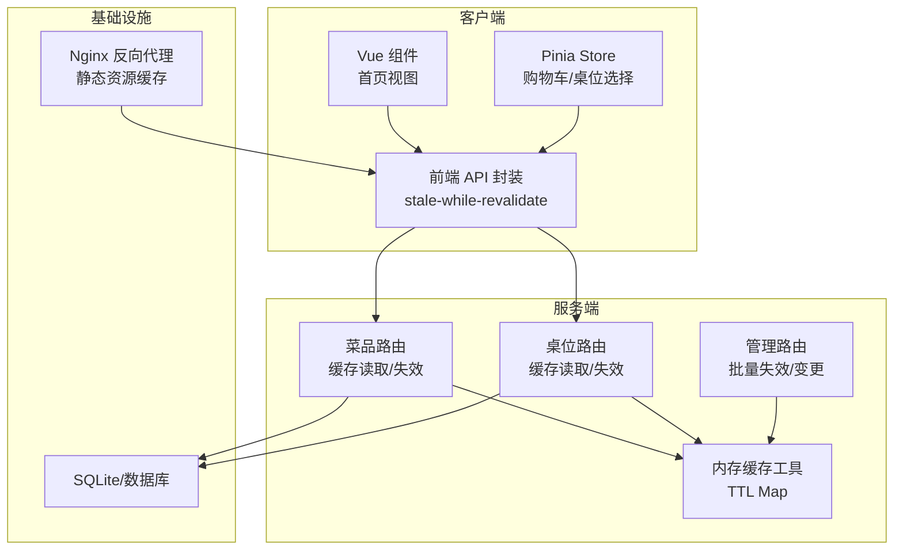
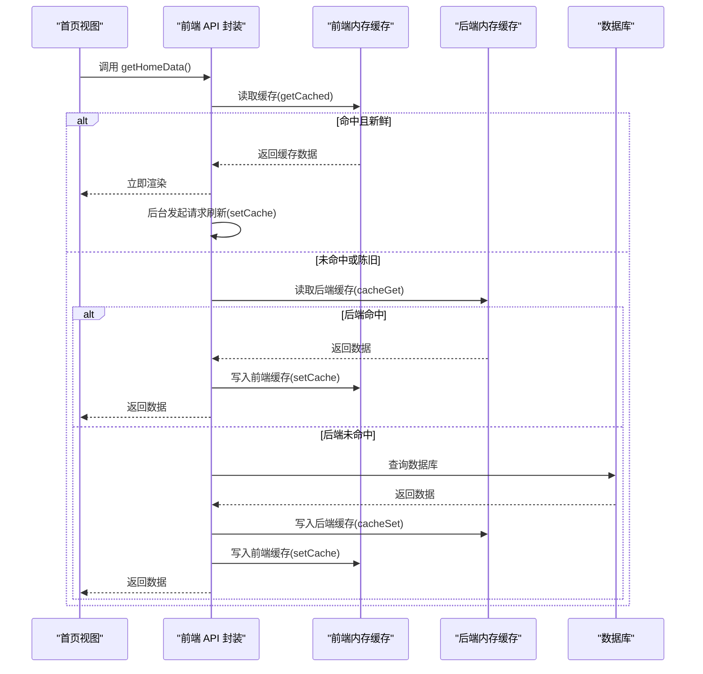
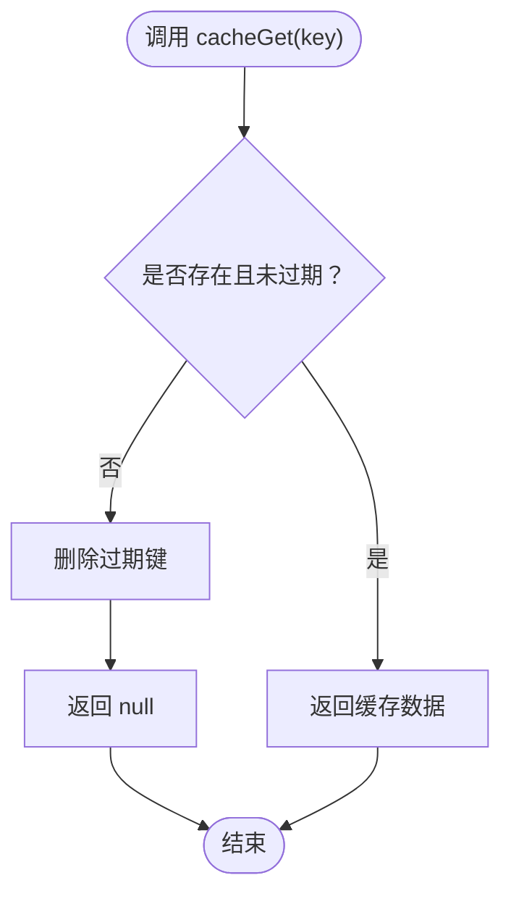
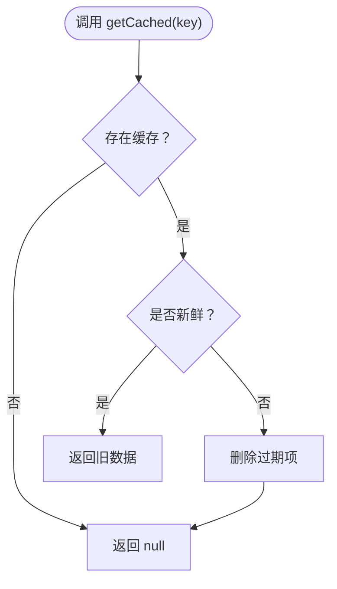
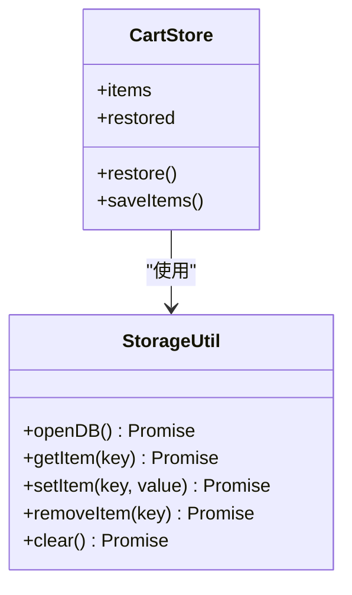
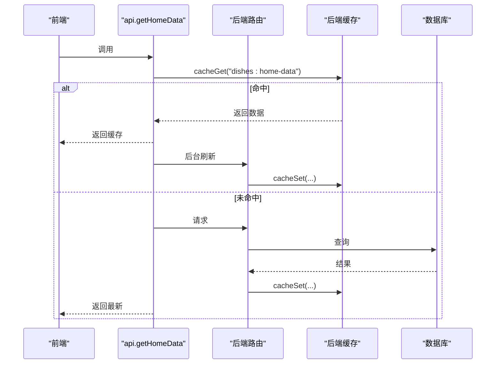
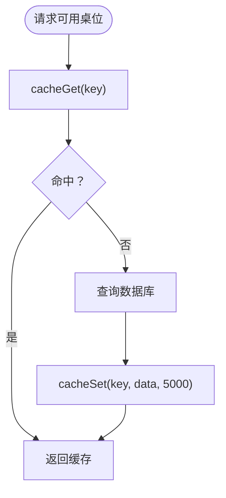
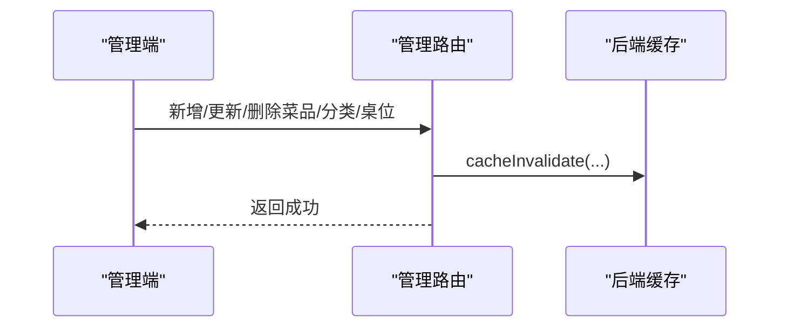
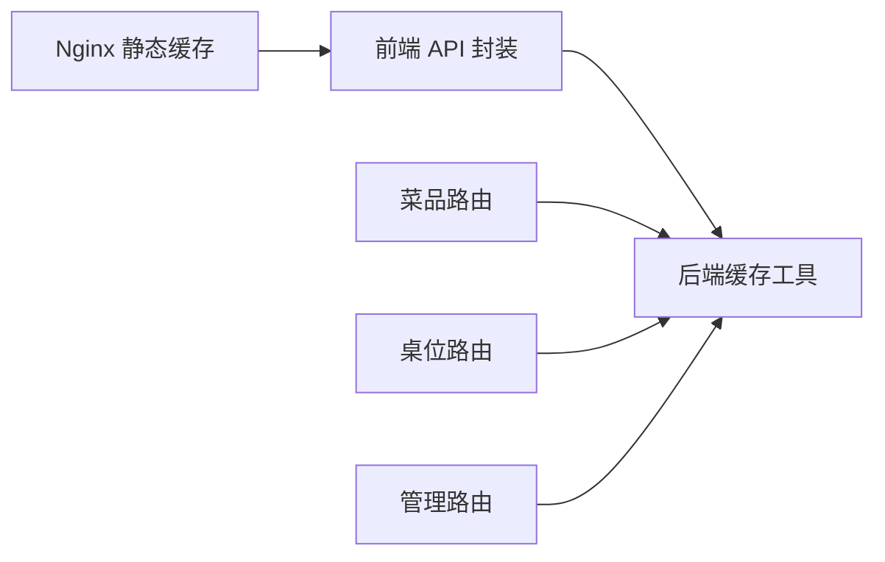

# 缓存策略

<cite>
**本文引用的文件**
- [cache.ts](file://server/src/utils/cache.ts)
- [dishes.ts](file://server/src/routes/dishes.ts)
- [tables.ts](file://server/src/routes/tables.ts)
- [admin.ts](file://server/src/routes/admin.ts)
- [index.ts](file://src/api/index.ts)
- [storage.ts](file://src/utils/storage.ts)
- [HomeView.vue](file://src/client/views/HomeView.vue)
- [cart.ts](file://src/stores/cart.ts)
- [table.ts](file://src/stores/table.ts)
- [nginx.conf](file://nginx.conf)
</cite>

## 目录
1. [引言](#引言)
2. [项目结构](#项目结构)
3. [核心组件](#核心组件)
4. [架构总览](#架构总览)
5. [详细组件分析](#详细组件分析)
6. [依赖关系分析](#依赖关系分析)
7. [性能考量](#性能考量)
8. [故障排查指南](#故障排查指南)
9. [结论](#结论)
10. [附录](#附录)

## 引言
本文件面向 RLRMS 餐厅管理系统，系统性梳理并规范缓存策略，重点覆盖以下方面：
- 后端内存缓存（TTL 内存缓存）与前端内存缓存（stale-while-revalidate）的协同设计
- 缓存键设计原则、TTL 配置与缓存命中检测
- 前端内存缓存条目结构、更新与失效处理
- 缓存一致性保障（穿透防护、雪崩预防、更新策略）
- 性能优化建议（缓存粒度、内存使用、预热）
- 代码级集成示例与异常处理

## 项目结构
系统采用“前端请求层 + 后端 API 层 + 数据库层”的分层架构。缓存策略贯穿三层：
- 前端：基于内存的 stale-while-revalidate 缓存，提升首屏与二次访问体验
- 后端：基于 Map 的 TTL 内存缓存，降低对数据库的压力
- 静态资源：Nginx 层面对静态资源进行长缓存

图表来源
- [index.ts:54-148](file://src/api/index.ts#L54-L148)
- [dishes.ts:24-117](file://server/src/routes/dishes.ts#L24-L117)
- [tables.ts:24-76](file://server/src/routes/tables.ts#L24-L76)
- [admin.ts:398-541](file://server/src/routes/admin.ts#L398-L541)
- [cache.ts:11-61](file://server/src/utils/cache.ts#L11-L61)
- [nginx.conf:70-84](file://nginx.conf#L70-L84)

章节来源
- [index.ts:54-148](file://src/api/index.ts#L54-L148)
- [dishes.ts:24-117](file://server/src/routes/dishes.ts#L24-L117)
- [tables.ts:24-76](file://server/src/routes/tables.ts#L24-L76)
- [admin.ts:398-541](file://server/src/routes/admin.ts#L398-L541)
- [cache.ts:11-61](file://server/src/utils/cache.ts#L11-L61)
- [nginx.conf:70-84](file://nginx.conf#L70-L84)

## 核心组件
- 后端内存缓存工具
  - 提供 TTL 内存缓存能力，支持获取、设置、按前缀失效、清空
  - 默认 TTL 为 30 秒，部分动态场景（如桌位可用性）采用更短 TTL
- 前端内存缓存（stale-while-revalidate）
  - 使用 Map 存储缓存条目，包含数据与时间戳
  - 通过 isCacheFresh 判断是否新鲜；若陈旧仍可返回，同时后台静默刷新
- 前端持久化缓存（IndexedDB）
  - 使用 IndexedDB 存储购物车等用户本地数据，避免刷新丢失
- 路由层缓存集成
  - 菜品与桌位路由在读取数据时优先命中缓存，写操作时主动失效相关缓存键

章节来源
- [cache.ts:11-61](file://server/src/utils/cache.ts#L11-L61)
- [index.ts:9-29](file://src/api/index.ts#L9-L29)
- [storage.ts:1-109](file://src/utils/storage.ts#L1-L109)
- [dishes.ts:24-117](file://server/src/routes/dishes.ts#L24-L117)
- [tables.ts:24-76](file://server/src/routes/tables.ts#L24-L76)

## 架构总览
下图展示了“stale-while-revalidate”在前端与后端的协同工作流。

图表来源
- [HomeView.vue:68-89](file://src/client/views/HomeView.vue#L68-L89)
- [index.ts:128-148](file://src/api/index.ts#L128-L148)
- [cache.ts:18-36](file://server/src/utils/cache.ts#L18-L36)

## 详细组件分析

### 后端内存缓存工具（TTL Map）
- 数据结构
  - 使用 Map 存储缓存条目，条目包含数据与过期时间戳
- 关键方法
  - 获取：命中且未过期则返回，否则删除并返回空
  - 设置：以当前时间 + TTL 写入
  - 失效：按键或前缀失效
  - 清空：清空全部
- TTL 设计
  - 默认 30 秒
  - 动态场景（如桌位可用性）采用更短 TTL（例如 5 秒）

图表来源
- [cache.ts:18-26](file://server/src/utils/cache.ts#L18-L26)

章节来源
- [cache.ts:11-61](file://server/src/utils/cache.ts#L11-L61)

### 前端内存缓存（stale-while-revalidate）
- 条目结构
  - 包含 data 与 timestamp
- 命中检测
  - 通过 isCacheFresh 判断是否在 TTL 内
- 更新策略
  - 若缓存陈旧，仍返回旧数据，同时发起后台请求刷新
- 异常处理
  - 后台刷新的 Promise 被 catch，避免未处理拒绝影响用户体验

图表来源
- [index.ts:17-25](file://src/api/index.ts#L17-L25)

章节来源
- [index.ts:5-29](file://src/api/index.ts#L5-L29)
- [index.ts:128-148](file://src/api/index.ts#L128-L148)

### 前端持久化缓存（IndexedDB）
- 用途
  - 存储购物车、订单关联信息等用户本地数据，避免刷新丢失
- 机制
  - 懒加载打开数据库，失败时清除缓存以便重试
  - 写入前序列化为普通对象，避免响应式代理污染
- 与内存缓存的关系
  - 内存缓存用于短期加速，IndexedDB 用于长期持久化

图表来源
- [storage.ts:11-109](file://src/utils/storage.ts#L11-L109)
- [cart.ts:132-150](file://src/stores/cart.ts#L132-L150)

章节来源
- [storage.ts:1-109](file://src/utils/storage.ts#L1-L109)
- [cart.ts:132-150](file://src/stores/cart.ts#L132-L150)

### 菜品与分类缓存集成
- 路由层
  - 首屏合并接口（home-data）与分类列表、菜品列表均使用后端缓存
  - 写操作（新增/更新/删除菜品、排序、分类变更）主动失效相关缓存键
- 前端层
  - 首页 getHomeData 使用 stale-while-revalidate，提升首屏与二次访问速度

图表来源
- [dishes.ts:67-117](file://server/src/routes/dishes.ts#L67-L117)
- [index.ts:128-148](file://src/api/index.ts#L128-L148)

章节来源
- [dishes.ts:24-117](file://server/src/routes/dishes.ts#L24-L117)
- [index.ts:128-148](file://src/api/index.ts#L128-L148)

### 桌位可用性缓存集成
- 路由层
  - 提供“按就餐时段查询可用桌位”与“全局可用桌位”两个接口
  - 使用较短 TTL（5 秒）应对实时变动
- 前端层
  - 首页在特定场景提示桌位已满，结合后端缓存减少抖动

图表来源
- [tables.ts:24-76](file://server/src/routes/tables.ts#L24-L76)

章节来源
- [tables.ts:24-76](file://server/src/routes/tables.ts#L24-L76)

### 管理端缓存失效联动
- 管理端对菜品、分类、桌位等进行增删改时，主动失效相关后端缓存键
- 保证管理端变更后，后续读取能获取最新数据

图表来源
- [admin.ts:398-541](file://server/src/routes/admin.ts#L398-L541)
- [dishes.ts:7-12](file://server/src/routes/dishes.ts#L7-L12)
- [tables.ts:7-11](file://server/src/routes/tables.ts#L7-L11)

章节来源
- [admin.ts:398-541](file://server/src/routes/admin.ts#L398-L541)
- [dishes.ts:7-12](file://server/src/routes/dishes.ts#L7-L12)
- [tables.ts:7-11](file://server/src/routes/tables.ts#L7-L11)

## 依赖关系分析
- 前端 API 对后端缓存工具的依赖
  - 前端仅依赖后端提供的缓存键常量与接口，不直接操作后端缓存
- 路由层对缓存工具的依赖
  - 菜品与桌位路由直接使用后端缓存工具
  - 管理路由在变更后主动失效缓存
- 静态资源缓存
  - Nginx 对静态资源设置长缓存，减少带宽与服务器压力

图表来源
- [index.ts:54-148](file://src/api/index.ts#L54-L148)
- [cache.ts:63-72](file://server/src/utils/cache.ts#L63-L72)
- [dishes.ts:1-5](file://server/src/routes/dishes.ts#L1-L5)
- [tables.ts:1-5](file://server/src/routes/tables.ts#L1-L5)
- [admin.ts:17-17](file://server/src/routes/admin.ts#L17-L17)
- [nginx.conf:70-84](file://nginx.conf#L70-L84)

章节来源
- [index.ts:54-148](file://src/api/index.ts#L54-L148)
- [cache.ts:63-72](file://server/src/utils/cache.ts#L63-L72)
- [dishes.ts:1-5](file://server/src/routes/dishes.ts#L1-L5)
- [tables.ts:1-5](file://server/src/routes/tables.ts#L1-L5)
- [admin.ts:17-17](file://server/src/routes/admin.ts#L17-L17)
- [nginx.conf:70-84](file://nginx.conf#L70-L84)

## 性能考量
- 缓存粒度控制
  - 首屏合并接口（home-data）减少往返次数
  - 分类与菜品列表按类别细分键，便于精准失效
- 内存使用优化
  - 后端使用 Map 存储，容量可控；短 TTL 降低峰值占用
  - 前端缓存 TTL 30 秒，兼顾体验与内存
- 缓存预热策略
  - 在管理端变更后主动失效，确保下次请求命中最新数据
  - 首页在应用启动阶段触发一次预取，提升首屏体验
- 静态资源缓存
  - Nginx 对图片与构建产物设置长缓存，显著降低带宽

章节来源
- [dishes.ts:67-117](file://server/src/routes/dishes.ts#L67-L117)
- [tables.ts:24-76](file://server/src/routes/tables.ts#L24-L76)
- [nginx.conf:70-84](file://nginx.conf#L70-L84)

## 故障排查指南
- 前端缓存异常
  - 症状：界面显示陈旧数据
  - 排查：检查 isCacheFresh 与 setCache 是否正确调用；确认后台刷新 Promise 已 catch
- 后端缓存异常
  - 症状：管理端变更后数据未更新
  - 排查：确认管理路由是否调用了 cacheInvalidate 或 cacheInvalidatePrefix；检查缓存键是否匹配
- IndexedDB 异常
  - 症状：购物车在刷新后丢失
  - 排查：检查 openDB 初始化是否成功；确认序列化写入与懒加载逻辑
- 静态资源未更新
  - 症状：图片/样式未更新
  - 排查：确认 Nginx 缓存头与过期策略；必要时清理浏览器缓存

章节来源
- [index.ts:128-148](file://src/api/index.ts#L128-L148)
- [admin.ts:398-541](file://server/src/routes/admin.ts#L398-L541)
- [storage.ts:11-40](file://src/utils/storage.ts#L11-L40)
- [nginx.conf:70-84](file://nginx.conf#L70-L84)

## 结论
本系统通过“前端 stale-while-revalidate + 后端 TTL 内存缓存”的组合，在保证数据一致性的同时，显著提升了用户体验与系统性能。配合管理端的精准失效与 Nginx 的静态资源缓存，整体缓存体系具备良好的可维护性与扩展性。

## 附录

### 缓存键设计与 TTL 配置清单
- 缓存键常量（后端）
  - 分类：categories
  - 首页合并数据：dishes:home-data
  - 菜品列表：dishes:list
  - 菜品搜索前缀：dishes:search:
  - 桌位可用：tables:available
  - 桌位可用（按就餐时段）：tables:available-for:
- TTL 配置
  - 默认：30 秒
  - 桌位可用性：5 秒

章节来源
- [cache.ts:63-72](file://server/src/utils/cache.ts#L63-L72)
- [tables.ts:49-70](file://server/src/routes/tables.ts#L49-L70)

### 前端 API 集成示例（路径参考）
- 首页数据获取（stale-while-revalidate）
  - [getHomeData:128-148](file://src/api/index.ts#L128-L148)
- 分类列表获取（前端缓存）
  - [getCategories:164-171](file://src/api/index.ts#L164-L171)
- 桌位可用性查询
  - [getAvailableTablesFor:182-184](file://src/api/index.ts#L182-L184)

章节来源
- [index.ts:128-184](file://src/api/index.ts#L128-L184)

### 前端组件使用示例（路径参考）
- 首页视图触发数据拉取
  - [fetchData:68-89](file://src/client/views/HomeView.vue#L68-L89)
- 购物车持久化与恢复
  - [restore:132-150](file://src/stores/cart.ts#L132-L150)
  - [saveItems:112-121](file://src/stores/cart.ts#L112-L121)

章节来源
- [HomeView.vue:68-89](file://src/client/views/HomeView.vue#L68-L89)
- [cart.ts:112-150](file://src/stores/cart.ts#L112-L150)