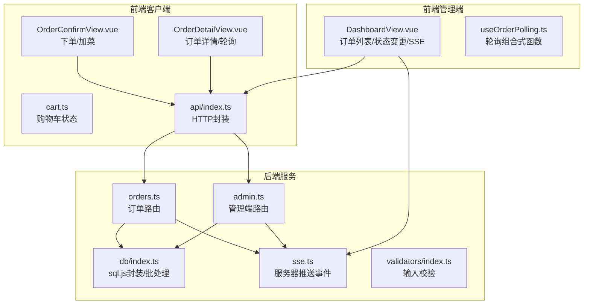
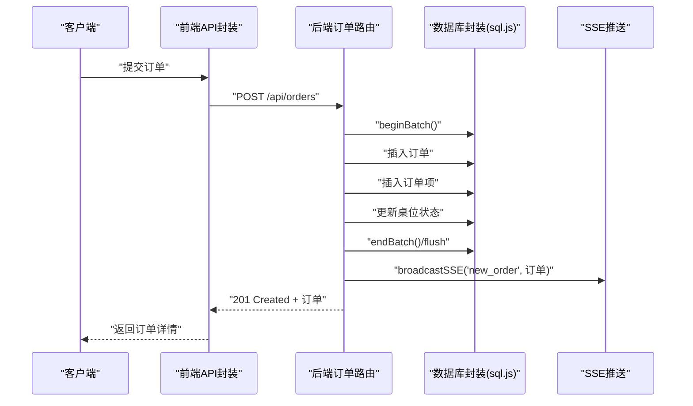
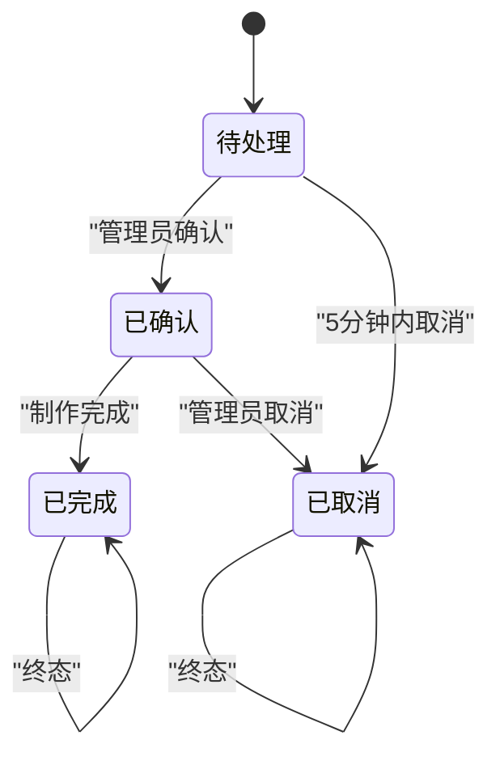
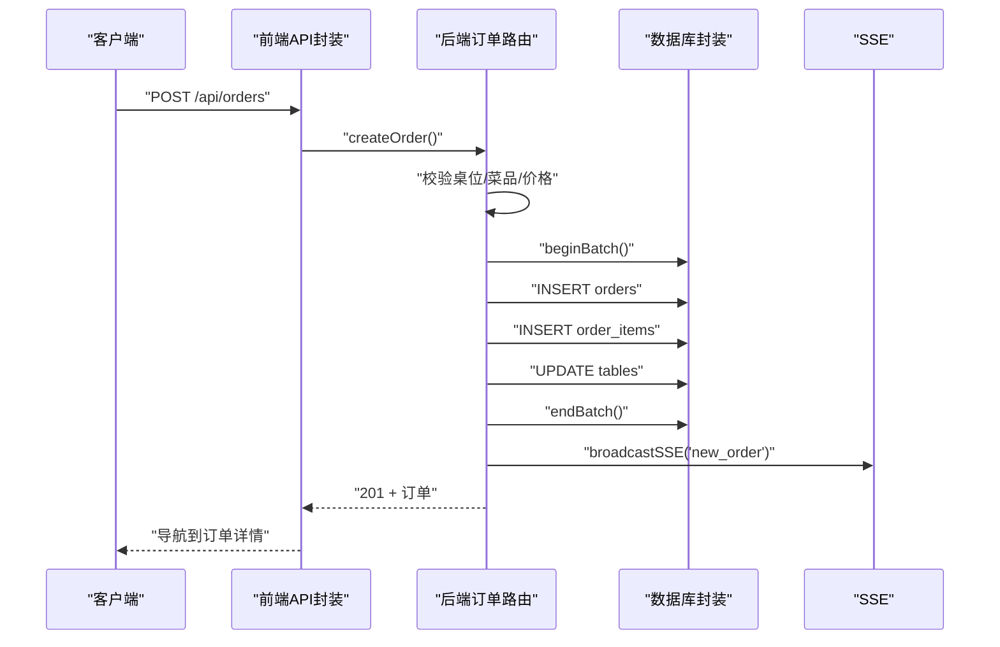
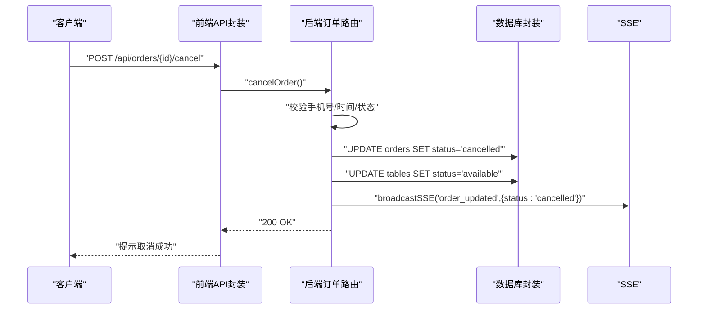
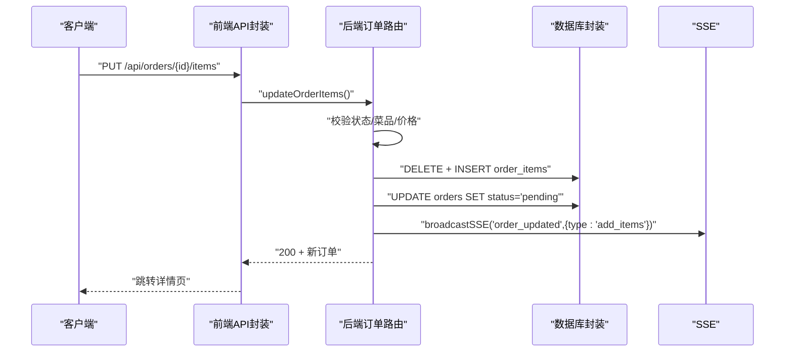
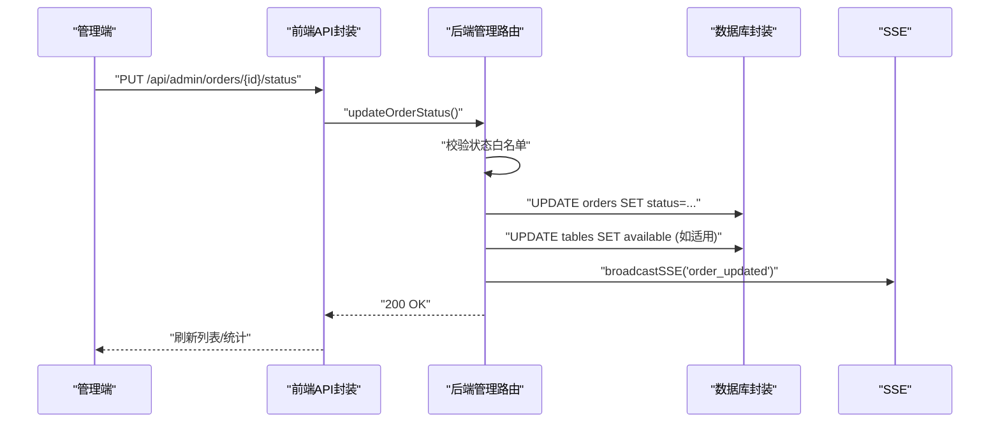
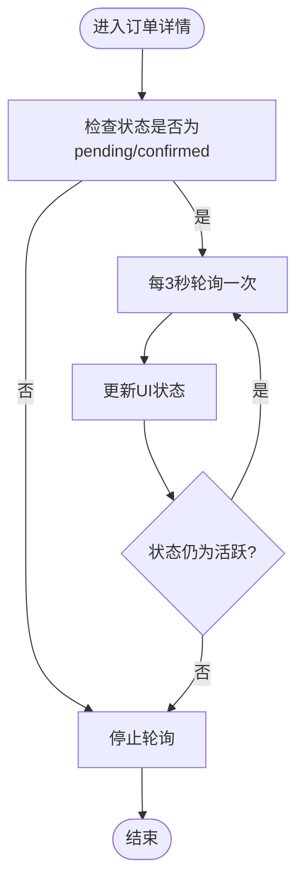
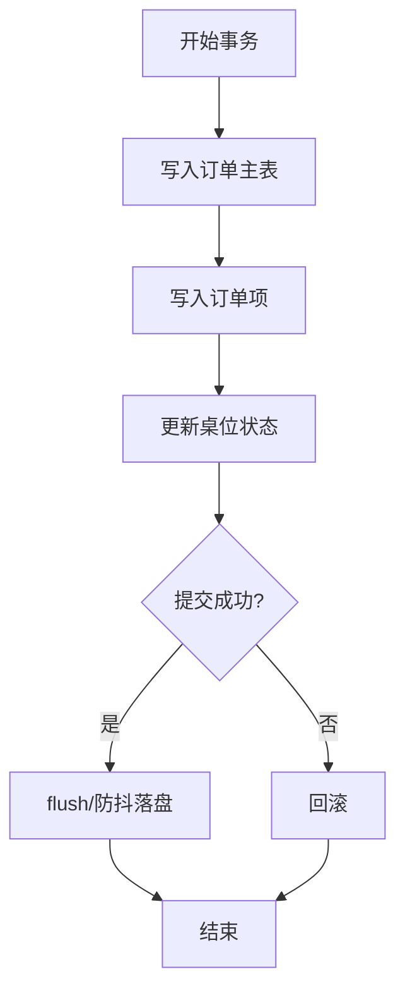
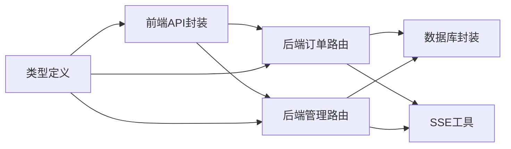

# 订单状态数据流

<cite>
**本文档引用的文件**
- [orders.ts](file://server/src/routes/orders.ts)
- [admin.ts](file://server/src/routes/admin.ts)
- [db/index.ts](file://server/src/db/index.ts)
- [sse.ts](file://server/src/utils/sse.ts)
- [index.ts](file://src/api/index.ts)
- [cart.ts](file://src/stores/cart.ts)
- [useOrderPolling.ts](file://src/shared/composables/useOrderPolling.ts)
- [OrderConfirmView.vue](file://src/client/views/OrderConfirmView.vue)
- [OrderDetailView.vue](file://src/client/views/OrderDetailView.vue)
- [DashboardView.vue](file://src/admin/views/DashboardView.vue)
- [index.ts](file://src/types/index.ts)
- [index.ts](file://server/src/validators/index.ts)
</cite>

## 目录
1. [简介](#简介)
2. [项目结构](#项目结构)
3. [核心组件](#核心组件)
4. [架构总览](#架构总览)
5. [详细组件分析](#详细组件分析)
6. [依赖关系分析](#依赖关系分析)
7. [性能考虑](#性能考虑)
8. [故障排除指南](#故障排除指南)
9. [结论](#结论)

## 简介
本文件面向RLRMS餐厅管理系统，聚焦“订单状态数据流”。内容涵盖从客户下单到管理员处理的完整数据流转过程，包括订单创建、状态变更、通知推送；阐述订单状态机设计（待支付/pending、已确认/confirmed、已完成/completed、已取消/cancelled）及转换规则；分析订单数据完整性保障（事务批处理、数据一致性、回滚机制）；提供订单流程的时序图与数据流图；并给出前后端状态管理与路由处理的代码示例路径，帮助开发者快速实现与集成。

## 项目结构
系统采用前后端分离架构：
- 前端（Vue 3 + Pinia）负责用户交互、状态管理与实时刷新
- 后端（Express + sql.js）负责业务逻辑、数据持久化与事件推送
- 通过REST API进行数据交换，使用SSE实现管理端实时通知

图表来源
- [orders.ts:1-552](file://server/src/routes/orders.ts#L1-L552)
- [admin.ts:795-833](file://server/src/routes/admin.ts#L795-L833)
- [db/index.ts:1-156](file://server/src/db/index.ts#L1-L156)
- [sse.ts:1-59](file://server/src/utils/sse.ts#L1-L59)
- [index.ts:1-608](file://src/api/index.ts#L1-L608)
- [cart.ts:1-183](file://src/stores/cart.ts#L1-L183)
- [useOrderPolling.ts:1-74](file://src/shared/composables/useOrderPolling.ts#L1-L74)
- [OrderConfirmView.vue:1-991](file://src/client/views/OrderConfirmView.vue#L1-L991)
- [OrderDetailView.vue:1-672](file://src/client/views/OrderDetailView.vue#L1-L672)
- [DashboardView.vue:1-1452](file://src/admin/views/DashboardView.vue#L1-L1452)

章节来源
- [orders.ts:1-552](file://server/src/routes/orders.ts#L1-L552)
- [admin.ts:795-833](file://server/src/routes/admin.ts#L795-L833)
- [db/index.ts:1-156](file://server/src/db/index.ts#L1-L156)
- [sse.ts:1-59](file://server/src/utils/sse.ts#L1-L59)
- [index.ts:1-608](file://src/api/index.ts#L1-L608)
- [cart.ts:1-183](file://src/stores/cart.ts#L1-L183)
- [useOrderPolling.ts:1-74](file://src/shared/composables/useOrderPolling.ts#L1-L74)
- [OrderConfirmView.vue:1-991](file://src/client/views/OrderConfirmView.vue#L1-L991)
- [OrderDetailView.vue:1-672](file://src/client/views/OrderDetailView.vue#L1-L672)
- [DashboardView.vue:1-1452](file://src/admin/views/DashboardView.vue#L1-L1452)

## 核心组件
- 订单路由（后端）：负责订单创建、取消、修改菜品、查询等
- 管理端路由（后端）：负责订单状态更新、桌位释放
- 数据库封装（后端）：提供sql.js访问、批处理、防抖落盘
- SSE工具（后端）：向管理端推送新增/更新事件
- 前端API封装：统一请求、缓存、超时与鉴权处理
- 前端状态管理：购物车、应用状态、轮询控制
- 前端视图：下单确认、订单详情、管理端仪表盘

章节来源
- [orders.ts:194-353](file://server/src/routes/orders.ts#L194-L353)
- [admin.ts:795-833](file://server/src/routes/admin.ts#L795-L833)
- [db/index.ts:46-73](file://server/src/db/index.ts#L46-L73)
- [sse.ts:37-51](file://server/src/utils/sse.ts#L37-L51)
- [index.ts:128-243](file://src/api/index.ts#L128-L243)
- [cart.ts:1-183](file://src/stores/cart.ts#L1-L183)
- [useOrderPolling.ts:1-74](file://src/shared/composables/useOrderPolling.ts#L1-L74)

## 架构总览
系统采用“请求-批处理-事件推送”的模式：
- 客户端通过API提交订单，后端执行批量写入（订单+订单项+桌位状态），完成后通过SSE广播
- 管理端优先通过SSE接收事件，若断开则降级为轮询
- 客户端在活跃状态下按固定间隔轮询，以保持UI与服务端一致

图表来源
- [orders.ts:295-318](file://server/src/routes/orders.ts#L295-L318)
- [db/index.ts:46-60](file://server/src/db/index.ts#L46-L60)
- [sse.ts:37-51](file://server/src/utils/sse.ts#L37-L51)
- [index.ts:187-205](file://src/api/index.ts#L187-L205)

## 详细组件分析

### 订单状态机与转换规则
- 状态集合：pending（待处理）、confirmed（已确认）、completed（已完成）、cancelled（已取消）
- 转换规则：
  - 创建订单：初始状态为pending
  - 管理员可将pending转为confirmed或cancelled
  - confirmed可转为completed（完成制作）
  - pending在5分钟内且状态为pending可转为cancelled（取消）
  - 修改订单：仅当状态为pending或confirmed时允许，修改后重置为pending

图表来源
- [orders.ts:383-400](file://server/src/routes/orders.ts#L383-L400)
- [admin.ts:795-823](file://server/src/routes/admin.ts#L795-L823)
- [index.ts:93-97](file://src/types/index.ts#L93-L97)

章节来源
- [orders.ts:355-418](file://server/src/routes/orders.ts#L355-L418)
- [admin.ts:795-833](file://server/src/routes/admin.ts#L795-L833)
- [index.ts:93-97](file://src/types/index.ts#L93-L97)

### 订单创建流程（含数据完整性）
- 输入校验：桌位、就餐时间、联系人、手机号、菜品清单
- 服务端二次核价与库存/售卖状态校验，防止客户端篡改
- 批量写入：订单主表、订单项、桌位状态更新，使用批处理与防抖落盘
- 事件推送：新增订单事件广播给管理端
- 前端：下单成功后进入进度动画，跳转至订单详情页

图表来源
- [orders.ts:194-353](file://server/src/routes/orders.ts#L194-L353)
- [db/index.ts:46-60](file://server/src/db/index.ts#L46-L60)
- [sse.ts:37-51](file://server/src/utils/sse.ts#L37-L51)
- [index.ts:187-205](file://src/api/index.ts#L187-L205)

章节来源
- [orders.ts:194-353](file://server/src/routes/orders.ts#L194-L353)
- [db/index.ts:46-73](file://server/src/db/index.ts#L46-L73)
- [OrderConfirmView.vue:177-241](file://src/client/views/OrderConfirmView.vue#L177-L241)

### 订单取消流程
- 客户端发起取消请求，需携带手机号进行身份验证
- 服务端校验：订单存在、手机号匹配、创建时间在5分钟内、状态为pending
- 执行取消：更新订单状态为cancelled，释放桌位
- 推送事件：广播订单更新事件

图表来源
- [orders.ts:355-418](file://server/src/routes/orders.ts#L355-L418)
- [db/index.ts:100-109](file://server/src/db/index.ts#L100-L109)
- [sse.ts:37-51](file://server/src/utils/sse.ts#L37-L51)
- [index.ts:224-229](file://src/api/index.ts#L224-L229)

章节来源
- [orders.ts:355-418](file://server/src/routes/orders.ts#L355-L418)
- [OrderDetailView.vue:151-171](file://src/client/views/OrderDetailView.vue#L151-L171)

### 修改订单（加菜）流程
- 仅当订单处于pending或confirmed时允许修改
- 服务端重新校验菜品与价格，删除旧项并插入新项
- 更新订单总金额并重置状态为pending
- 推送事件：携带type=add_items，管理端增加修改请求计数

图表来源
- [orders.ts:421-552](file://server/src/routes/orders.ts#L421-L552)
- [db/index.ts:62-73](file://server/src/db/index.ts#L62-L73)
- [sse.ts:37-51](file://server/src/utils/sse.ts#L37-L51)
- [index.ts:231-243](file://src/api/index.ts#L231-L243)

章节来源
- [orders.ts:421-552](file://server/src/routes/orders.ts#L421-L552)
- [OrderConfirmView.vue:185-211](file://src/client/views/OrderConfirmView.vue#L185-L211)

### 管理端状态更新与桌位释放
- 管理员在仪表盘更新订单状态
- 服务端校验状态白名单，更新订单状态
- 若状态为completed或cancelled且关联桌位，释放桌位并失效缓存
- 推送事件：订单状态变更

图表来源
- [admin.ts:795-833](file://server/src/routes/admin.ts#L795-L833)
- [db/index.ts:100-109](file://server/src/db/index.ts#L100-L109)
- [sse.ts:37-51](file://server/src/utils/sse.ts#L37-L51)
- [index.ts:388-393](file://src/api/index.ts#L388-L393)

章节来源
- [admin.ts:795-833](file://server/src/routes/admin.ts#L795-L833)
- [DashboardView.vue:215-241](file://src/admin/views/DashboardView.vue#L215-L241)

### 前端状态管理与轮询
- 购物车状态：Pinia store持久化存储，支持序列化剥离Proxy，避免响应式污染
- 订单详情页：对pending/confirmed状态进行3秒轮询，页面隐藏时停止
- 管理端仪表盘：优先SSE连接，断线后启用轮询；提供自动刷新开关

图表来源
- [OrderDetailView.vue:97-149](file://src/client/views/OrderDetailView.vue#L97-L149)
- [useOrderPolling.ts:19-31](file://src/shared/composables/useOrderPolling.ts#L19-L31)
- [DashboardView.vue:308-391](file://src/admin/views/DashboardView.vue#L308-L391)

章节来源
- [cart.ts:113-130](file://src/stores/cart.ts#L113-L130)
- [OrderDetailView.vue:97-149](file://src/client/views/OrderDetailView.vue#L97-L149)
- [useOrderPolling.ts:1-74](file://src/shared/composables/useOrderPolling.ts#L1-L74)
- [DashboardView.vue:414-446](file://src/admin/views/DashboardView.vue#L414-L446)

### 数据完整性与事务处理
- 批量写入：订单创建/修改均使用beginBatch/endBatch包裹，确保原子性
- 防抖落盘：多次写入合并为一次磁盘写入，提升吞吐
- 价格一致性：服务端二次核价与计算，防止客户端篡改
- 校验约束：Zod Schema严格校验输入，状态白名单限制

图表来源
- [orders.ts:295-318](file://server/src/routes/orders.ts#L295-L318)
- [db/index.ts:46-60](file://server/src/db/index.ts#L46-L60)
- [index.ts:6-19](file://server/src/validators/index.ts#L6-L19)

章节来源
- [orders.ts:295-318](file://server/src/routes/orders.ts#L295-L318)
- [db/index.ts:36-60](file://server/src/db/index.ts#L36-L60)
- [index.ts:6-19](file://server/src/validators/index.ts#L6-L19)

## 依赖关系分析
- 前端API封装依赖后端路由，统一处理401、超时与缓存策略
- 订单路由依赖数据库封装与SSE工具，保证数据一致性与实时性
- 管理端依赖SSE与轮询组合式函数，实现高可用刷新
- 类型定义贯穿前后端，确保状态枚举与数据结构一致

图表来源
- [index.ts:128-243](file://src/api/index.ts#L128-L243)
- [orders.ts:194-353](file://server/src/routes/orders.ts#L194-L353)
- [admin.ts:795-833](file://server/src/routes/admin.ts#L795-L833)
- [db/index.ts:1-156](file://server/src/db/index.ts#L1-L156)
- [sse.ts:1-59](file://server/src/utils/sse.ts#L1-L59)
- [index.ts:70-97](file://src/types/index.ts#L70-L97)

章节来源
- [index.ts:1-608](file://src/api/index.ts#L1-L608)
- [orders.ts:1-552](file://server/src/routes/orders.ts#L1-L552)
- [admin.ts:795-833](file://server/src/routes/admin.ts#L795-L833)
- [db/index.ts:1-156](file://server/src/db/index.ts#L1-L156)
- [sse.ts:1-59](file://server/src/utils/sse.ts#L1-L59)
- [index.ts:70-97](file://src/types/index.ts#L70-L97)

## 性能考虑
- 批量写入与防抖落盘：减少磁盘IO次数，提升写入吞吐
- SSE优先、轮询降级：降低管理端长连接压力，提高实时性
- 前端缓存策略：stale-while-revalidate，兼顾新鲜度与性能
- N+1查询优化：批量查询订单项，避免多次往返

## 故障排除指南
- 订单创建失败：检查输入校验、菜品状态、桌位占用与并发冲突
- 取消订单失败：确认手机号匹配、创建时间在5分钟内、状态为pending
- 修改订单失败：确认订单状态为pending或confirmed，菜品仍在售
- 管理端无实时更新：检查SSE连接状态，必要时启用轮询；查看断线重连日志
- 前端轮询异常：确认页面可见性事件与轮询开关，检查ACTIVE_STATUSES判断

章节来源
- [orders.ts:194-353](file://server/src/routes/orders.ts#L194-L353)
- [orders.ts:355-418](file://server/src/routes/orders.ts#L355-L418)
- [orders.ts:421-552](file://server/src/routes/orders.ts#L421-L552)
- [DashboardView.vue:308-391](file://src/admin/views/DashboardView.vue#L308-L391)
- [OrderDetailView.vue:97-149](file://src/client/views/OrderDetailView.vue#L97-L149)

## 结论
本系统通过严格的输入校验、服务端二次核价、批处理与防抖落盘，确保订单数据的完整性与一致性；通过SSE与轮询双通道实现高效实时通知；前端通过Pinia与组合式函数实现状态管理与轮询控制。整体架构清晰、扩展性强，适合在中小型餐厅场景稳定运行。