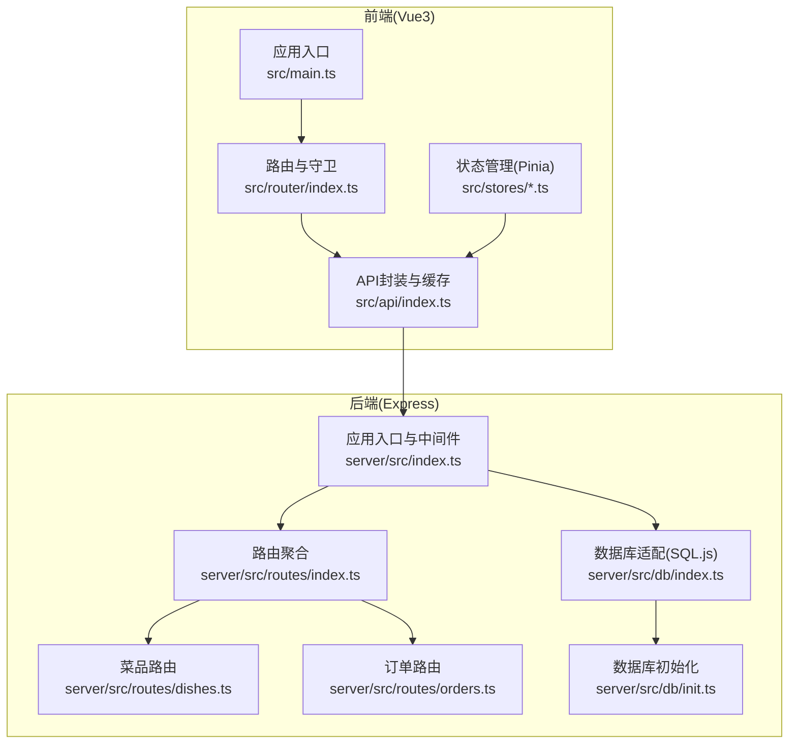
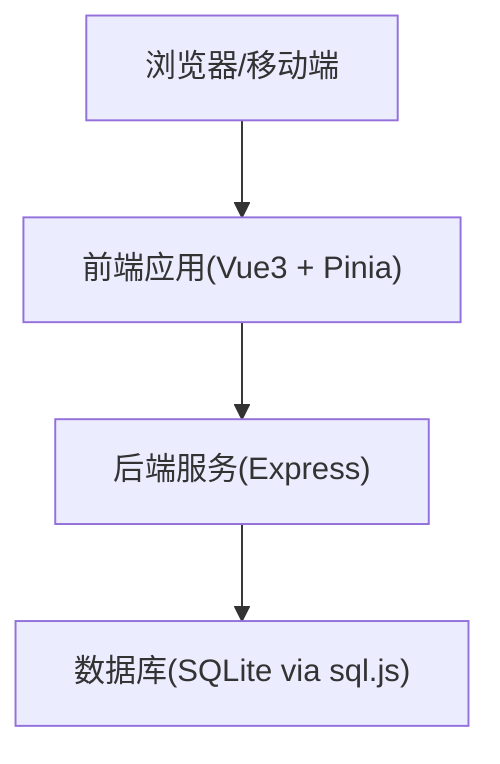
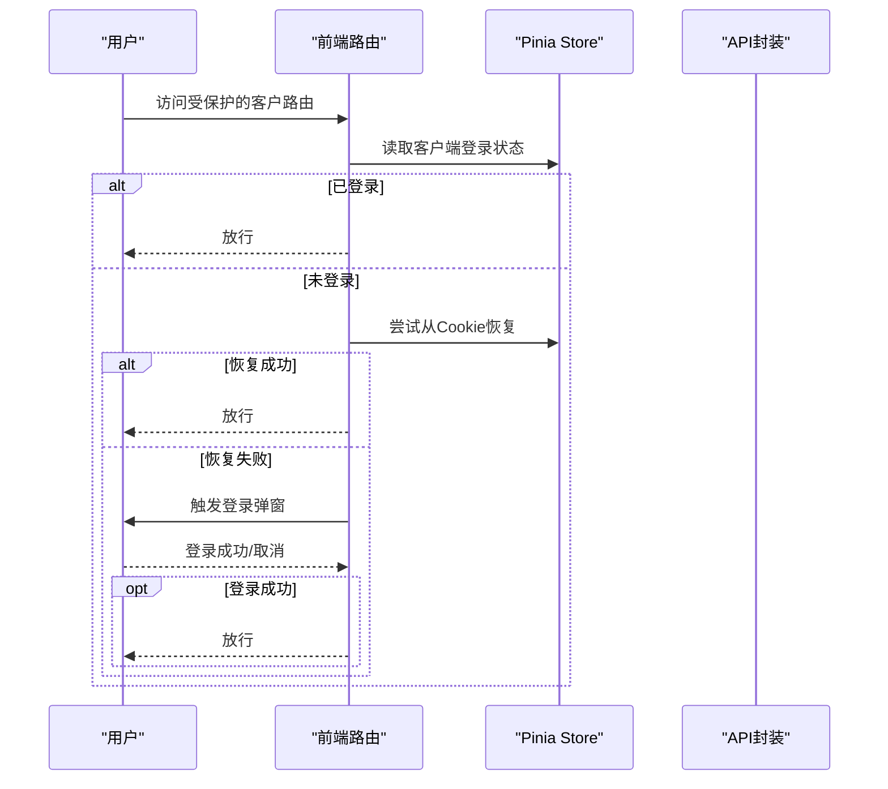
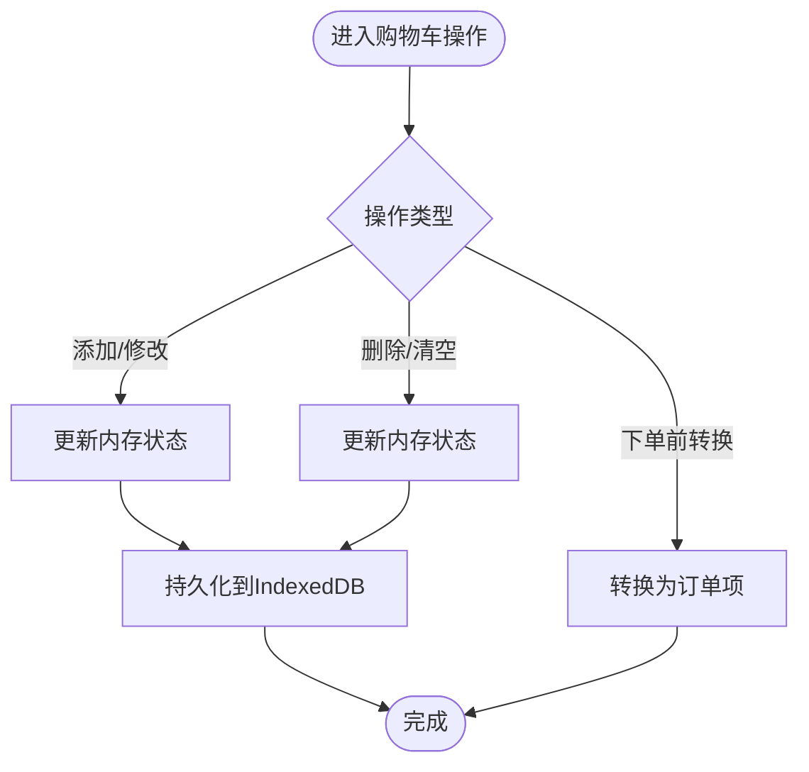
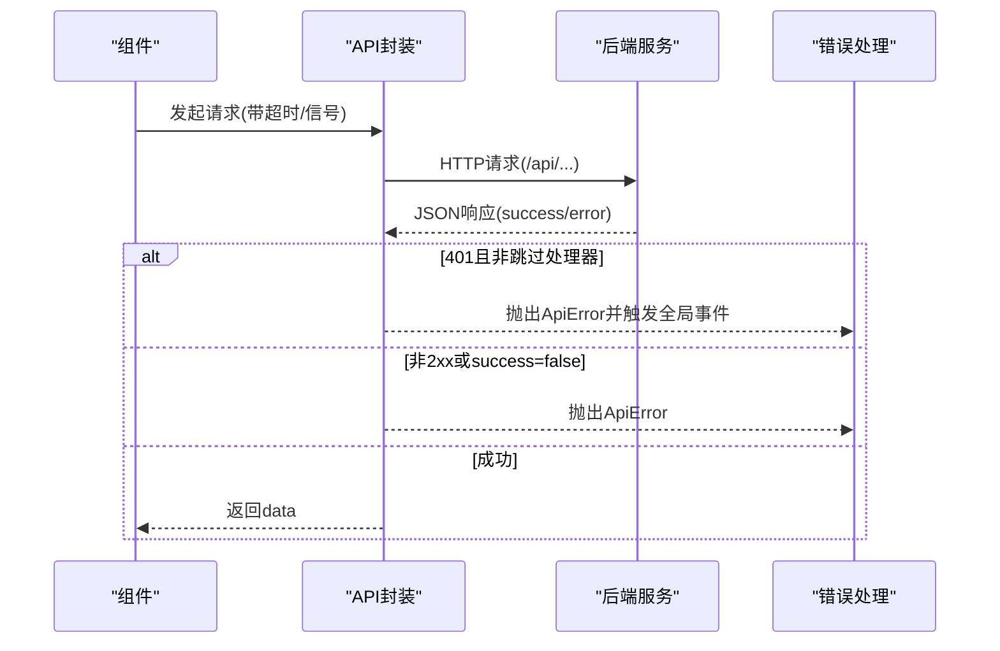
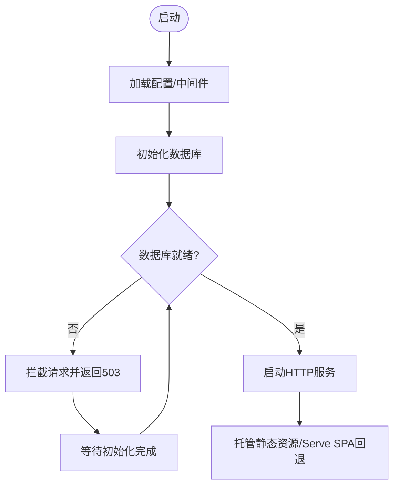
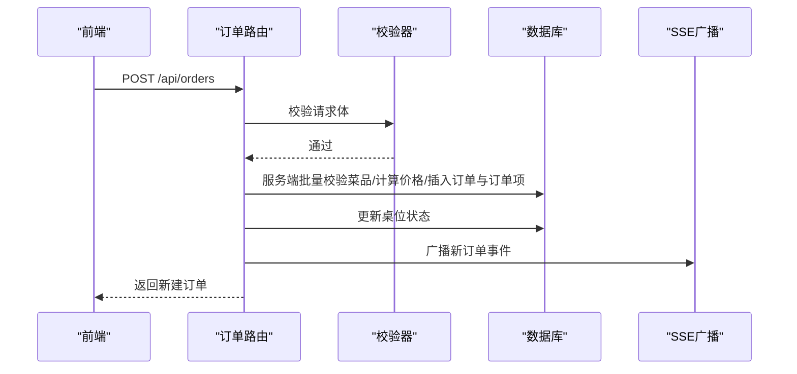
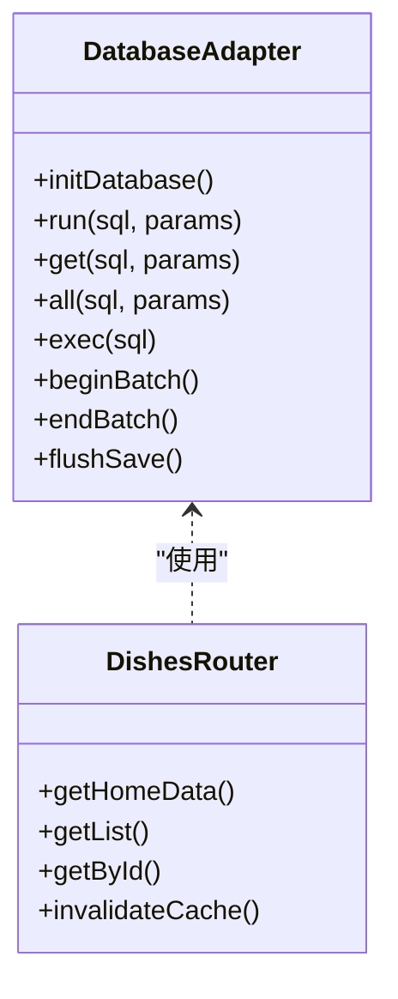
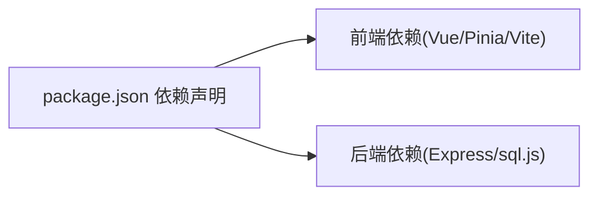

# 整体架构概览

<cite>
**本文引用的文件**
- [package.json](file://package.json)
- [main.ts](file://src/main.ts)
- [router/index.ts](file://src/router/index.ts)
- [api/index.ts](file://src/api/index.ts)
- [stores/app.ts](file://src/stores/app.ts)
- [stores/cart.ts](file://src/stores/cart.ts)
- [index.ts](file://server/src/index.ts)
- [routes/index.ts](file://server/src/routes/index.ts)
- [routes/dishes.ts](file://server/src/routes/dishes.ts)
- [routes/orders.ts](file://server/src/routes/orders.ts)
- [db/index.ts](file://server/src/db/index.ts)
- [db/init.ts](file://server/src/db/init.ts)
- [vite.config.ts](file://vite.config.ts)
- [Dockerfile](file://Dockerfile)
- [tsconfig.json](file://server/tsconfig.json)
</cite>

## 目录
1. [简介](#简介)
2. [项目结构](#项目结构)
3. [核心组件](#核心组件)
4. [架构总览](#架构总览)
5. [详细组件分析](#详细组件分析)
6. [依赖关系分析](#依赖关系分析)
7. [性能考量](#性能考量)
8. [故障排查指南](#故障排查指南)
9. [结论](#结论)
10. [附录](#附录)

## 简介
本项目为“RLRMS餐厅管理系统”，采用前后端分离架构，前端基于Vue3 + Pinia，后端基于Express + SQLite（sql.js），通过REST风格API进行通信。系统以单体架构组织，但通过模块化设计（按功能域拆分路由、数据库、工具与校验层）实现清晰的职责边界与良好的可维护性。技术选型兼顾易部署、低门槛与高性能：前端使用现代构建工具链，后端采用内存数据库与缓存策略，结合SSE实现实时推送。

## 项目结构
项目采用“根目录 + 前端源码(src) + 服务端源码(server) + 构建脚本(scripts)”的组织方式，前端与后端分别拥有独立的构建配置与运行脚本，便于开发与生产部署。

图表来源
- [main.ts:1-37](file://src/main.ts#L1-L37)
- [router/index.ts:1-317](file://src/router/index.ts#L1-L317)
- [api/index.ts:1-608](file://src/api/index.ts#L1-L608)
- [index.ts:1-176](file://server/src/index.ts#L1-L176)
- [routes/index.ts:1-18](file://server/src/routes/index.ts#L1-L18)
- [routes/dishes.ts:1-216](file://server/src/routes/dishes.ts#L1-L216)
- [routes/orders.ts:1-552](file://server/src/routes/orders.ts#L1-L552)
- [db/index.ts:1-156](file://server/src/db/index.ts#L1-L156)
- [db/init.ts:1-204](file://server/src/db/init.ts#L1-L204)

章节来源
- [package.json:1-64](file://package.json#L1-L64)
- [vite.config.ts:1-112](file://vite.config.ts#L1-L112)
- [Dockerfile:1-65](file://Dockerfile#L1-L65)
- [tsconfig.json:1-17](file://server/tsconfig.json#L1-L17)

## 核心组件
- 前端应用
  - 应用入口与插件注册：创建Vue应用、挂载Pinia与路由，全局禁用输入拼写检查，预加载关键路由组件。
  - 路由与导航守卫：区分客户前台与管理后台两套路由，支持登录态校验、客户端登录弹窗、标题动态设置与空闲预取。
  - API封装与缓存：统一请求、超时与401处理，内存级stale-while-revalidate缓存策略，支持可取消请求。
  - 状态管理：Pinia Store负责主题、加载状态、全局提示、购物车持久化与恢复。
- 后端应用
  - 应用入口：统一中间件（CORS、压缩、Cookie、安全头）、健康检查、静态资源托管、错误处理与生产环境SPA回退。
  - 路由聚合：对外暴露公共API与管理API，按领域拆分路由模块。
  - 数据层：基于sql.js的SQLite内存数据库，提供初始化、事务批处理、防抖落盘与索引优化。
  - 实时能力：SSE广播新订单与状态变更，配合前端轮询与订阅。

章节来源
- [main.ts:1-37](file://src/main.ts#L1-L37)
- [router/index.ts:1-317](file://src/router/index.ts#L1-L317)
- [api/index.ts:1-608](file://src/api/index.ts#L1-L608)
- [stores/app.ts:1-122](file://src/stores/app.ts#L1-L122)
- [stores/cart.ts:1-183](file://src/stores/cart.ts#L1-L183)
- [index.ts:1-176](file://server/src/index.ts#L1-L176)
- [routes/index.ts:1-18](file://server/src/routes/index.ts#L1-L18)
- [db/index.ts:1-156](file://server/src/db/index.ts#L1-L156)
- [db/init.ts:1-204](file://server/src/db/init.ts#L1-L204)

## 架构总览
系统采用典型的前后端分离架构，前端Vue3应用通过HTTP与后端Express服务通信；后端以单体形式承载业务逻辑、数据访问与静态资源托管。数据库采用SQLite（sql.js），在内存中运行并定期落盘，满足中小规模餐厅场景的性能与可靠性需求。

图表来源
- [main.ts:1-37](file://src/main.ts#L1-L37)
- [api/index.ts:1-608](file://src/api/index.ts#L1-L608)
- [index.ts:1-176](file://server/src/index.ts#L1-L176)
- [db/index.ts:1-156](file://server/src/db/index.ts#L1-L156)

## 详细组件分析

### 前端：应用与路由
- 应用入口负责初始化Vue实例、注册Pinia与路由，并进行全局行为配置（禁用拼写检查、派发装载完成事件、预加载关键路由）。
- 路由系统分为两类：
  - 客户前台路由：首页、菜品详情、搜索、订单相关、设置等，部分页面需要客户端登录态。
  - 管理后台路由：登录、仪表盘、桌位、菜品、订单、库存、用户、系统设置、调试工具等，受管理员令牌保护。
- 导航守卫实现：
  - 动态设置页面标题；
  - 客户端路由：对需要登录的页面，尝试从Cookie恢复登录状态，否则触发登录弹窗；
  - 管理员路由：通过API校验令牌，失败则跳转登录页并携带重定向参数；
  - 空闲预取：根据当前路由预测用户下一步访问，空闲时异步预取目标组件，提升二次进入速度。

图表来源
- [router/index.ts:200-277](file://src/router/index.ts#L200-L277)

章节来源
- [main.ts:1-37](file://src/main.ts#L1-L37)
- [router/index.ts:1-317](file://src/router/index.ts#L1-L317)

### 前端：状态管理与购物车
- 应用状态：主题偏好（亮/暗/跟随系统）、加载状态、全局提示队列、调试模式等，均通过Pinia Store集中管理。
- 购物车：支持添加、删除、修改数量、清空；下单前转换为订单项；持久化至IndexedDB，应用启动时自动恢复；提供防抖兜底保存，确保数据安全。

图表来源
- [stores/cart.ts:1-183](file://src/stores/cart.ts#L1-L183)

章节来源
- [stores/app.ts:1-122](file://src/stores/app.ts#L1-L122)
- [stores/cart.ts:1-183](file://src/stores/cart.ts#L1-L183)

### 前端：API封装与缓存
- 统一封装fetch请求，内置：
  - 超时控制与可取消请求；
  - 统一错误处理（401触发全局登录过期事件、非JSON响应防御）；
  - 内存缓存（stale-while-revalidate），提升弱网与重复请求体验。
- 提供丰富的API方法：首页聚合数据、菜品列表/详情/搜索、分类、桌位、订单创建/查询/取消/加菜、管理员端各类CRUD、图片上传/删除、数据导入导出等。

图表来源
- [api/index.ts:54-114](file://src/api/index.ts#L54-L114)

章节来源
- [api/index.ts:1-608](file://src/api/index.ts#L1-L608)

### 后端：应用入口与中间件
- 中间件与安全：
  - CORS（生产环境按配置开启）、压缩（SSE不压缩）、Cookie解析、安全响应头；
  - 数据库就绪检查：启动期间阻断非健康检查请求，避免脏读；
  - 错误处理：统一JSON错误响应，区分Unauthorized、Validation与内部错误。
- 静态资源与SPA回退：
  - 生产环境托管前端构建产物，静态资源长期缓存，其他请求回退到index.html。
- 启动流程：创建应用实例、初始化数据库、监听端口、注册进程退出钩子（落盘）。

图表来源
- [index.ts:34-143](file://server/src/index.ts#L34-L143)

章节来源
- [index.ts:1-176](file://server/src/index.ts#L1-L176)

### 后端：路由与领域模型
- 路由聚合：公共API（菜品、桌位、订单、认证）与管理API（后台管理）统一挂载在/api前缀下。
- 菜品模块：
  - 首页聚合数据（分类+菜品）减少往返；
  - 列表/详情/搜索，支持缓存键与JSON字段安全解析；
  - 缓存失效在管理端变更时触发。
- 订单模块：
  - 客户端登录中间件（JWT Cookie校验与用户存在性校验）；
  - 订单创建：服务端批量校验菜品与价格，防止篡改；批量写入（订单+订单项+桌位状态）；SSE广播新订单；
  - 订单取消/加菜：严格状态与时间窗口校验，失败快速返回；成功后SSE广播更新；
  - 批量验证订单存在性，用于清理幽灵订单。

图表来源
- [routes/orders.ts:194-353](file://server/src/routes/orders.ts#L194-L353)

章节来源
- [routes/index.ts:1-18](file://server/src/routes/index.ts#L1-L18)
- [routes/dishes.ts:1-216](file://server/src/routes/dishes.ts#L1-L216)
- [routes/orders.ts:1-552](file://server/src/routes/orders.ts#L1-L552)

### 后端：数据层与缓存
- 数据库适配：
  - 基于sql.js的SQLite内存数据库，首次启动创建/迁移表结构与索引；
  - 提供run/get/all/exec等基础API，支持批量事务(beginBatch/endBatch)与防抖落盘；
  - 启动时从磁盘加载数据库文件，结束时保存，进程退出前flushSave确保不丢数据。
- 缓存策略：
  - 菜品模块使用内存缓存键（首页聚合、列表、分类），管理端变更时主动失效；
  - 前端API层采用stale-while-revalidate内存缓存，降低网络开销。

图表来源
- [db/index.ts:1-156](file://server/src/db/index.ts#L1-L156)
- [routes/dishes.ts:1-216](file://server/src/routes/dishes.ts#L1-L216)

章节来源
- [db/index.ts:1-156](file://server/src/db/index.ts#L1-L156)
- [db/init.ts:1-204](file://server/src/db/init.ts#L1-L204)

## 依赖关系分析
- 技术栈选择
  - 前端：Vue3提供响应式与组件化，Pinia替代Vuex实现轻量状态管理，Vite提供快速开发与生产构建。
  - 后端：Express提供简洁的HTTP服务与中间件生态，sql.js使SQLite可在Node环境中运行，适合小型部署场景。
  - 数据库：SQLite具备零配置、ACID特性与良好兼容性；通过索引与缓存策略平衡性能。
- 模块化设计
  - 路由按领域拆分（菜品/桌位/订单/认证/管理），职责清晰，便于扩展与测试。
  - 数据访问抽象在db层，上层仅依赖统一API，降低耦合度。
  - 前后端通过REST API解耦，前端可替换为其他框架，后端可迁移到其他语言实现。

图表来源
- [package.json:16-41](file://package.json#L16-L41)

章节来源
- [package.json:1-64](file://package.json#L1-L64)

## 性能考量
- 前端
  - Vite预构建常用依赖，开发体验更佳；生产构建启用代码分割与内容哈希命名，利于缓存与CDN分发。
  - API层内存缓存（stale-while-revalidate）与路由空闲预取，显著改善首屏与二次访问性能。
  - 购物车持久化与防抖保存，避免频繁I/O。
- 后端
  - sql.js批量写入与防抖落盘，减少磁盘IO次数；索引覆盖高频查询字段。
  - 压缩中间件按Content-Type过滤，SSE不压缩保障实时推送。
  - SSE广播新订单/更新，管理端可即时感知。

## 故障排查指南
- 常见问题
  - 数据库未初始化：后端启动阶段会阻断非健康检查请求，等待初始化完成；可通过/health端点观察状态。
  - 401未授权：前端收到401时会派发全局事件，触发登录弹窗；检查Cookie与JWT有效性。
  - SSE不推送：确认Content-Type不是text/event-stream被压缩；检查广播逻辑与客户端连接。
  - 订单创建失败：核对菜品状态、桌位占用与重复下单限制；查看服务端批量校验日志。
- 排查步骤
  - 查看后端日志与健康检查(/health)；
  - 使用管理端调试工具执行SQL查询与查看表结构；
  - 前端打开调试面板，观察API请求与缓存命中情况。

章节来源
- [index.ts:122-140](file://server/src/index.ts#L122-L140)
- [api/index.ts:94-114](file://src/api/index.ts#L94-L114)
- [routes/orders.ts:24-49](file://server/src/routes/orders.ts#L24-L49)

## 结论
本项目通过前后端分离与单体架构的结合，在保持系统简洁的同时实现了清晰的模块边界与良好的可维护性。Vue3 + Pinia提供现代化前端体验，Express + SQLite满足中小型餐厅的部署与性能需求。通过缓存、批处理与SSE等手段，系统在用户体验与工程效率之间取得平衡。建议后续根据业务增长逐步引入微服务拆分与云数据库方案。

## 附录
- 开发与生产命令
  - 开发：前端与后端分别热更新；后端支持数据库初始化脚本。
  - 构建：前端TypeScript编译与Vite打包；后端TypeScript编译；生产构建脚本整合产物。
  - 启动：生产环境直接运行后端构建产物；Docker多阶段构建，最小化运行镜像。
- 配置要点
  - 前端Vite别名@指向src，开发代理到后端3000端口；生产静态资源长期缓存。
  - 后端生产环境启用CORS与安全头，静态资源托管与SPA回退；健康检查与进程信号处理。

章节来源
- [package.json:6-14](file://package.json#L6-L14)
- [vite.config.ts:28-112](file://vite.config.ts#L28-L112)
- [Dockerfile:1-65](file://Dockerfile#L1-L65)
- [tsconfig.json:1-17](file://server/tsconfig.json#L1-L17)