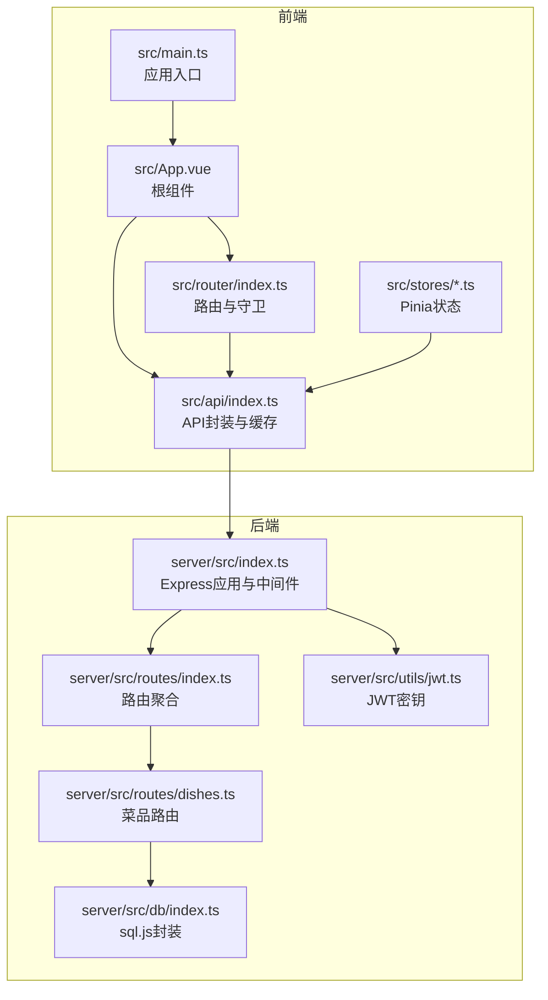
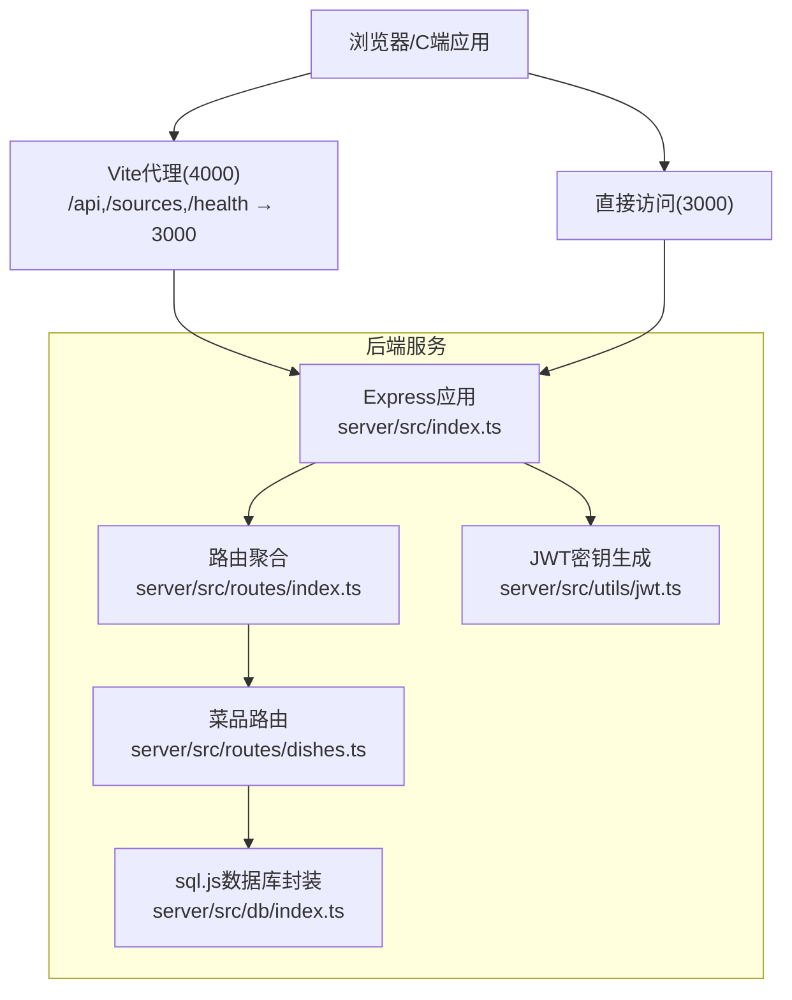
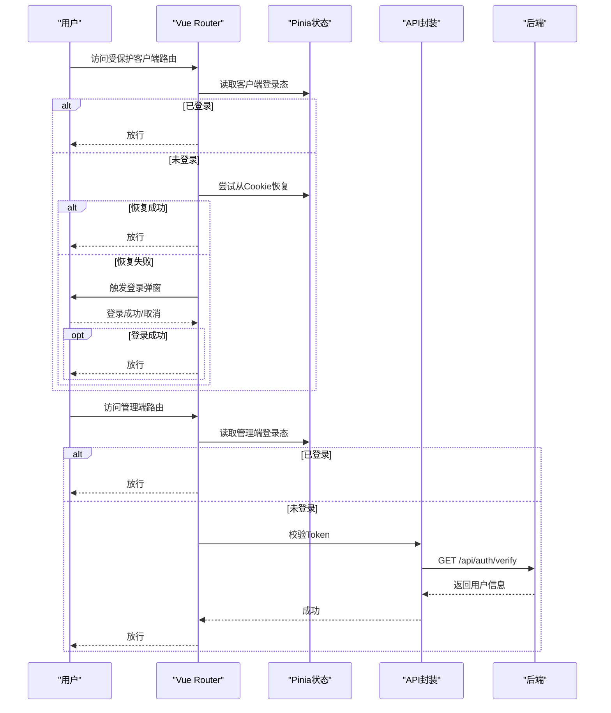
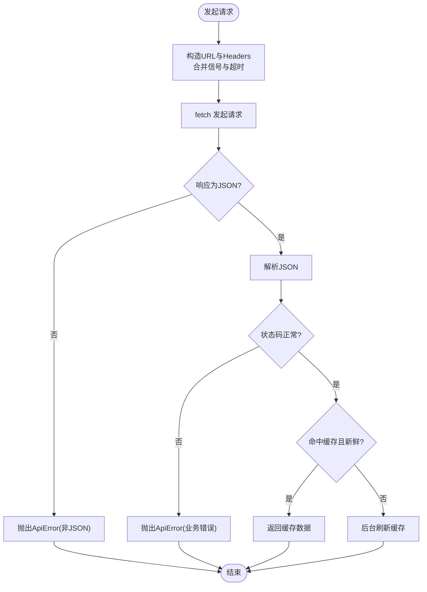
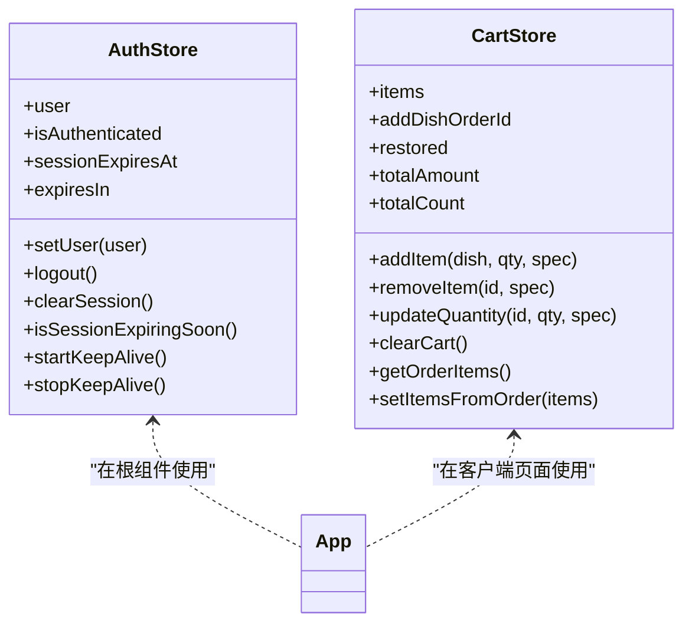
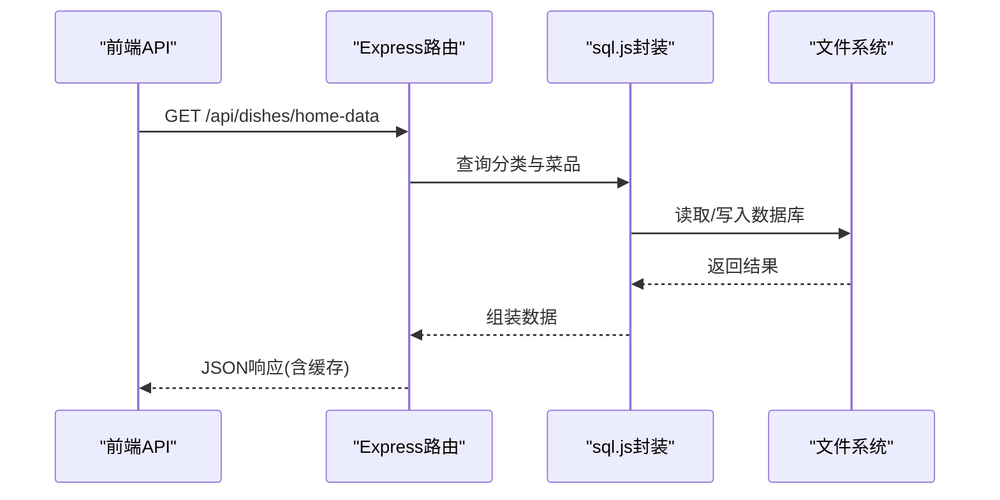
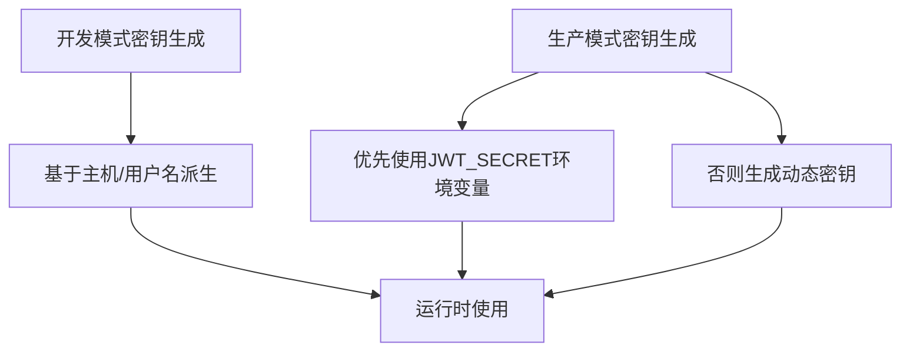
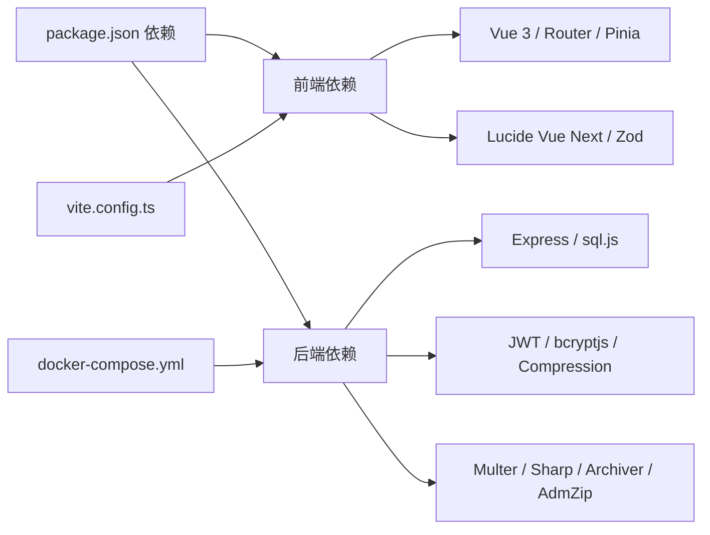

# 架构设计

<cite>
**本文引用的文件**   
- [README.md](file://README.md)
- [package.json](file://package.json)
- [src/main.ts](file://src/main.ts)
- [src/App.vue](file://src/App.vue)
- [src/router/index.ts](file://src/router/index.ts)
- [src/api/index.ts](file://src/api/index.ts)
- [src/stores/auth.ts](file://src/stores/auth.ts)
- [src/stores/cart.ts](file://src/stores/cart.ts)
- [server/src/index.ts](file://server/src/index.ts)
- [server/src/routes/index.ts](file://server/src/routes/index.ts)
- [server/src/routes/dishes.ts](file://server/src/routes/dishes.ts)
- [server/src/db/index.ts](file://server/src/db/index.ts)
- [server/src/utils/jwt.ts](file://server/src/utils/jwt.ts)
- [vite.config.ts](file://vite.config.ts)
- [docker-compose.yml](file://docker-compose.yml)
</cite>

## 目录
1. [引言](#引言)
2. [项目结构](#项目结构)
3. [核心组件](#核心组件)
4. [架构总览](#架构总览)
5. [详细组件分析](#详细组件分析)
6. [依赖分析](#依赖分析)
7. [性能考虑](#性能考虑)
8. [故障排查指南](#故障排查指南)
9. [结论](#结论)
10. [附录](#附录)

## 引言
本项目为“红灯笼食府”餐厅管理系统，采用前后端分离架构，包含顾客端（C端）与管理端（B端）。前端基于 Vue 3 + Vite + TypeScript，使用 Pinia 进行状态管理，Vue Router 实现路由与导航守卫；后端基于 Node.js + Express，使用 sql.js 内嵌数据库，提供 RESTful API，并通过 JWT Cookie 实现认证与权限控制。系统支持开发期的集成模式与分离模式，生产部署可使用 Docker Compose、Nginx/Apache 反向代理与 PM2 进程管理。

## 项目结构
项目采用模块化组织，前端与后端分层清晰，职责明确：
- 前端模块
  - admin：管理端页面与组件
  - client：顾客端页面与组件
  - shared：共享组件与组合式函数
  - stores：Pinia 状态管理
  - router：路由定义与导航守卫
  - api：统一 API 请求封装与缓存策略
- 后端模块
  - routes：按领域拆分的路由（dishes、tables、orders、auth、admin）
  - db：sql.js 初始化与数据库读写封装
  - utils：JWT 密钥生成、SSE、缓存等工具
  - validators：Zod 参数校验
  - dev-server：开发期分离模式入口

**图表来源**
- [src/main.ts:1-37](file://src/main.ts#L1-L37)
- [src/App.vue:1-113](file://src/App.vue#L1-L113)
- [src/router/index.ts:1-317](file://src/router/index.ts#L1-L317)
- [src/api/index.ts:1-608](file://src/api/index.ts#L1-L608)
- [server/src/index.ts:1-176](file://server/src/index.ts#L1-L176)
- [server/src/routes/index.ts:1-18](file://server/src/routes/index.ts#L1-L18)
- [server/src/routes/dishes.ts:1-216](file://server/src/routes/dishes.ts#L1-L216)
- [server/src/db/index.ts:1-156](file://server/src/db/index.ts#L1-L156)
- [server/src/utils/jwt.ts:1-27](file://server/src/utils/jwt.ts#L1-L27)

**章节来源**
- [README.md:61-174](file://README.md#L61-L174)
- [package.json:1-64](file://package.json#L1-L64)

## 核心组件
- 应用入口与挂载
  - 前端在入口文件中创建应用、挂载 Pinia 与 Vue Router，并进行全局输入拼写检查禁用与预加载关键路由。
- 根组件与全局事件
  - 根组件监听认证过期事件，区分管理端与顾客端的过期处理逻辑，统一触发提示与跳转。
- 路由与导航守卫
  - 客户端路由与管理端路由分离，管理端路由具备鉴权守卫；客户端受保护路由通过弹窗登录流程恢复会话。
- API 封装与缓存
  - 统一的请求封装，支持超时、AbortSignal、凭据携带与 401 全局处理；对首页与分类等接口采用“陈旧-同时刷新”缓存策略。
- 状态管理
  - 管理端认证状态（含会话保活）、购物车状态（本地 IndexedDB 持久化与防抖落盘）等。

**章节来源**
- [src/main.ts:1-37](file://src/main.ts#L1-L37)
- [src/App.vue:16-47](file://src/App.vue#L16-L47)
- [src/router/index.ts:202-277](file://src/router/index.ts#L202-L277)
- [src/api/index.ts:54-114](file://src/api/index.ts#L54-L114)
- [src/stores/auth.ts:15-127](file://src/stores/auth.ts#L15-L127)
- [src/stores/cart.ts:9-182](file://src/stores/cart.ts#L9-L182)

## 架构总览
系统采用典型的前后端分离架构，前端负责 C 端与 B 端界面与交互，后端提供 REST API 与静态资源服务。开发期支持两种模式：
- 集成模式：Express 通过 Vite 中间件统一在 3000 端口提供服务，适合本地联调。
- 分离模式：Vite 独立运行于 4000 端口，通过代理将 /api、/sources、/health 转发至后端 3000 端口。

**图表来源**
- [README.md:192-216](file://README.md#L192-L216)
- [vite.config.ts:43-62](file://vite.config.ts#L43-L62)
- [server/src/index.ts:34-143](file://server/src/index.ts#L34-L143)
- [server/src/routes/index.ts:1-18](file://server/src/routes/index.ts#L1-L18)
- [server/src/routes/dishes.ts:1-216](file://server/src/routes/dishes.ts#L1-L216)
- [server/src/db/index.ts:1-156](file://server/src/db/index.ts#L1-L156)
- [server/src/utils/jwt.ts:1-27](file://server/src/utils/jwt.ts#L1-L27)

## 详细组件分析

### 前端路由与导航守卫（Vue Router）
- 路由分层
  - 客户端路由：首页、菜品详情、搜索、订单相关、设置等，部分路由需要客户端登录态。
  - 管理端路由：登录页与带侧边栏布局的子路由，子路由覆盖桌位、菜单、订单、库存、用户、设置、调试等。
- 导航守卫
  - 管理端：校验鉴权 Cookie，必要时调用后端校验接口恢复用户信息。
  - 客户端：受保护路由尝试从 Cookie 恢复，否则触发登录弹窗，等待登录成功事件后放行。
- 预取策略
  - 应用启动后预加载关键路由组件；路由切换后根据目标路由预取相关页面，提升用户体验。

**图表来源**
- [src/router/index.ts:202-277](file://src/router/index.ts#L202-L277)
- [src/stores/auth.ts:15-127](file://src/stores/auth.ts#L15-L127)
- [src/api/index.ts:253-261](file://src/api/index.ts#L253-L261)

**章节来源**
- [src/router/index.ts:42-187](file://src/router/index.ts#L42-L187)
- [src/router/index.ts:202-314](file://src/router/index.ts#L202-L314)

### API 封装与缓存策略
- 统一请求封装
  - 自动携带凭据、合并外部信号与超时信号、统一错误处理与 401 全局事件派发。
- 缓存策略
  - 对首页与分类等接口采用“陈旧-同时刷新”策略，先返回缓存再静默刷新，提升首屏性能。
- 文件上传与导出
  - 图片上传使用表单提交；数据导出返回 ZIP 并自动下载；导入支持校验与 401 处理。

**图表来源**
- [src/api/index.ts:54-114](file://src/api/index.ts#L54-L114)
- [src/api/index.ts:128-171](file://src/api/index.ts#L128-L171)

**章节来源**
- [src/api/index.ts:1-608](file://src/api/index.ts#L1-L608)

### 状态管理（Pinia）
- 管理端认证状态
  - 维护用户信息、登录态、过期时间与会话保活定时器；过期时触发全局事件。
- 购物车状态
  - 维护购物车项、合计数量与金额；支持从订单回填；使用 IndexedDB 持久化与防抖落盘，保证数据一致性。

**图表来源**
- [src/stores/auth.ts:15-127](file://src/stores/auth.ts#L15-L127)
- [src/stores/cart.ts:9-182](file://src/stores/cart.ts#L9-L182)

**章节来源**
- [src/stores/auth.ts:1-128](file://src/stores/auth.ts#L1-L128)
- [src/stores/cart.ts:1-183](file://src/stores/cart.ts#L1-L183)

### 后端路由与数据流（菜品接口）
- 路由聚合
  - /api/dishes、/api/tables、/api/orders、/api/auth、/api/admin 路由按域拆分，便于扩展与维护。
- 菜品接口
  - 首页聚合接口、分类列表、菜品列表、搜索、详情等；使用缓存键空间与失效机制，保障数据一致性。
- 数据库封装
  - sql.js 初始化、读写封装、批量事务、防抖落盘，确保高并发下的稳定性与性能。

**图表来源**
- [server/src/routes/dishes.ts:67-117](file://server/src/routes/dishes.ts#L67-L117)
- [server/src/db/index.ts:76-98](file://server/src/db/index.ts#L76-L98)

**章节来源**
- [server/src/routes/index.ts:1-18](file://server/src/routes/index.ts#L1-L18)
- [server/src/routes/dishes.ts:1-216](file://server/src/routes/dishes.ts#L1-L216)
- [server/src/db/index.ts:1-156](file://server/src/db/index.ts#L1-L156)

### 认证与安全（JWT Cookie）
- JWT 密钥
  - 开发模式基于主机与用户名派生固定密钥，便于热重载；生产模式支持环境变量或动态密钥。
- Cookie 安全
  - 管理端与客户端分别使用不同 Cookie 名称，httpOnly 防止 XSS；登录失败限流与密码加密存储。

**图表来源**
- [server/src/utils/jwt.ts:11-26](file://server/src/utils/jwt.ts#L11-L26)

**章节来源**
- [server/src/utils/jwt.ts:1-27](file://server/src/utils/jwt.ts#L1-L27)
- [README.md:565-577](file://README.md#L565-L577)

## 依赖分析
- 前端依赖
  - Vue 3、Vue Router、Pinia、Lucide Vue Next、Zod 等，构建工具链与类型系统完善。
- 后端依赖
  - Express、sql.js、JWT、bcryptjs、Sharp、Multer、Archiver、AdmZip、Compression、Cookie-parser 等，覆盖认证、文件处理、数据导出导入与压缩。
- 构建与部署
  - Vite 配置包含别名、依赖预构建、代理与产物命名策略；Docker Compose 提供健康检查与资源限制。

**图表来源**
- [package.json:16-41](file://package.json#L16-L41)
- [vite.config.ts:28-112](file://vite.config.ts#L28-L112)
- [docker-compose.yml:6-54](file://docker-compose.yml#L6-L54)

**章节来源**
- [package.json:1-64](file://package.json#L1-L64)
- [vite.config.ts:1-112](file://vite.config.ts#L1-L112)
- [docker-compose.yml:1-54](file://docker-compose.yml#L1-L54)

## 性能考虑
- 前端性能
  - 预加载关键路由组件与相关页面，减少首屏与切换延迟；CSS 代码分割与资源命名哈希，利于缓存；生产环境移除部分 console 输出。
- 后端性能
  - 静态资源缓存与长缓存策略；SSE 响应不压缩以保证实时性；sql.js 防抖落盘与批量事务，降低 I/O 压力。
- 缓存策略
  - 前端对首页与分类采用“陈旧-同时刷新”，兼顾速度与一致性；后端对列表类接口使用缓存键空间，变更时主动失效。

**章节来源**
- [src/router/index.ts:23-40](file://src/router/index.ts#L23-L40)
- [src/api/index.ts:128-171](file://src/api/index.ts#L128-L171)
- [server/src/index.ts:46-56](file://server/src/index.ts#L46-L56)
- [server/src/db/index.ts:13-44](file://server/src/db/index.ts#L13-L44)

## 故障排查指南
- 认证过期
  - 前端收到 401 或后端返回无效 token 时，会派发全局事件，管理端跳转登录页，客户端弹出登录框。
- 数据库初始化失败
  - 后端启动时若数据库初始化失败，会关闭服务并退出进程，检查数据目录权限与磁盘空间。
- SSE 与代理问题
  - 分离模式下确保 Vite 代理正确指向后端；SSE 需要代理超时配置，避免被中间件提前关闭。
- Docker 健康检查
  - 容器健康检查依赖 /health 接口，若失败检查日志与网络连通性。

**章节来源**
- [src/App.vue:16-39](file://src/App.vue#L16-L39)
- [server/src/index.ts:148-175](file://server/src/index.ts#L148-L175)
- [README.md:550-557](file://README.md#L550-L557)
- [docker-compose.yml:32-38](file://docker-compose.yml#L32-L38)

## 结论
本项目在单体架构下实现了清晰的前后端分离与模块化设计，前端采用 Vue 3 + Pinia + Vue Router，后端采用 Express + sql.js，结合 JWT Cookie 认证与缓存策略，满足中小餐厅的日常运营需求。系统具备良好的扩展性：路由与 API 按领域拆分，易于新增模块；后端数据库封装支持批量事务与防抖落盘，便于后续引入分布式数据库；前端预取与缓存策略提升了用户体验。部署方面支持 Docker、Nginx/Apache 反代与 PM2，适配多种运行环境。

## 附录
- 开发与生产模式
  - 集成模式：统一在 3000 端口提供服务，适合本地联调。
  - 分离模式：Vite 独立运行，通过代理转发 API 请求。
- 默认账号
  - 管理端默认账号：admin / admin123（首次登录后建议修改密码）。

**章节来源**
- [README.md:192-216](file://README.md#L192-L216)
- [README.md:485-491](file://README.md#L485-L491)